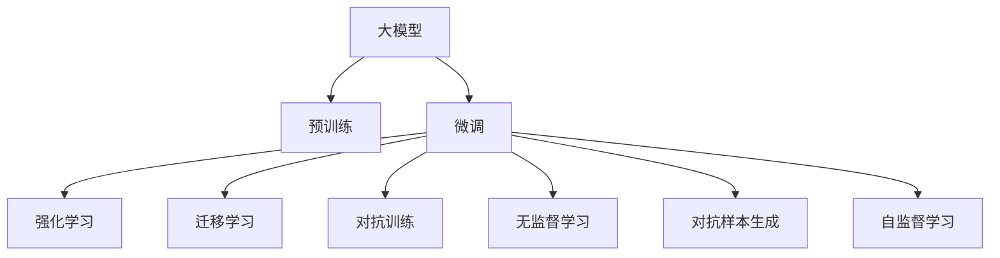

                 

## 1. 背景介绍

随着人工智能技术的发展，大模型（Large Model）在诸多应用场景中显现出巨大潜力。它通过大量数据的预训练，可以大幅度提升算法的泛化能力，实现跨领域、多任务的高效适应。但在创业实践中，大模型创业仍面临着一系列挑战，包括技术、市场、生态等方面。本文将通过分析大模型创业的关键问题，探讨应对策略，为有志于这一领域的创业者提供思考与参考。

## 2. 核心概念与联系

### 2.1 核心概念概述

1. **大模型（Large Model）**：指基于深度神经网络的大规模预训练模型，如BERT、GPT系列模型等。这些模型通过大量数据训练，获得了强大的语言理解和生成能力。

2. **预训练（Pre-training）**：指在大规模无标注数据上对模型进行预训练，学习通用语言表示，然后将其微调成特定任务。

3. **微调（Fine-tuning）**：将预训练模型应用于特定任务上，通过少量标注数据进行有监督学习，优化模型在该任务上的性能。

4. **迁移学习（Transfer Learning）**：利用大模型在预训练过程中学到的知识，迁移到下游任务上，以提升性能。

5. **强化学习（Reinforcement Learning）**：在大模型基础上，通过奖励机制，使模型在特定任务上不断优化。

6. **对抗训练（Adversarial Training）**：在训练过程中加入对抗样本，提升模型鲁棒性。

7. **无监督学习（Unsupervised Learning）**：通过未标注数据进行学习，提升模型泛化能力。

8. **对抗样本生成（Adversarial Sample Generation）**：生成对抗模型，用于测试模型鲁棒性。

9. **自监督学习（Self-supervised Learning）**：通过未标注数据生成自监督任务，进行模型训练。

这些概念之间的逻辑关系可以通过以下Mermaid流程图来展示：



这个流程图展示了大模型创业涉及的核心概念及其之间的关系：

1. 大模型通过预训练获得基础能力。
2. 微调使模型在特定任务上提升性能。
3. 强化学习在特定任务上进一步优化。
4. 迁移学习通过已有知识，提升新任务性能。
5. 对抗训练提升模型鲁棒性。
6. 无监督学习提升泛化能力。
7. 对抗样本生成测试模型鲁棒性。
8. 自监督学习利用未标注数据进行学习。

这些概念共同构成了大模型创业的基础框架，是大模型在实际应用中的重要支撑。

## 3. 核心算法原理 & 具体操作步骤

### 3.1 算法原理概述

大模型创业的核心在于利用预训练模型在特定任务上进行微调，提升模型性能。其关键在于选择合适的预训练模型、设计合理的数据集、制定有效的训练策略等。

大模型的预训练通常采用自监督学习方式，如语言模型掩码（BERT）、自回归语言模型（GPT）等。这些预训练模型在大量未标注文本上训练，学习到通用的语言表示。微调则是将预训练模型应用于特定任务上，通过少量标注数据进行有监督学习，优化模型在该任务上的性能。

### 3.2 算法步骤详解

#### 3.2.1 预训练阶段
1. **数据选择**：选择大规模的未标注文本数据，如维基百科、新闻文章等。
2. **模型设计**：设计并实现大模型，如BERT、GPT等。
3. **训练优化**：使用自监督任务（如语言模型、掩码预测等）对模型进行预训练，优化超参数和模型结构。

#### 3.2.2 微调阶段
1. **数据准备**：收集特定任务的标注数据，并进行预处理。
2. **模型适配**：设计任务适配层，如添加分类器、解码器等。
3. **训练策略**：选择合适的优化算法（如Adam、SGD等），设定合适的学习率、批大小等。
4. **模型验证**：在验证集上评估模型性能，防止过拟合。
5. **模型应用**：将微调后的模型应用于实际场景，进行推理预测。

### 3.3 算法优缺点

**优点**：
1. **高效性**：通过微调可以大幅度提升模型在特定任务上的性能。
2. **通用性**：预训练模型可以应用于多个任务，节省时间和成本。
3. **可解释性**：模型参数和结构较为透明，易于理解和调试。

**缺点**：
1. **数据依赖**：微调模型高度依赖标注数据，获取高质量标注数据成本较高。
2. **泛化性**：模型在特定任务上的泛化能力有限，面对新领域效果可能较差。
3. **鲁棒性**：对抗样本和噪声可能导致模型性能下降。
4. **计算资源**：大模型训练和微调需要大量计算资源。

### 3.4 算法应用领域

大模型在诸多领域中都有应用，如自然语言处理（NLP）、计算机视觉（CV）、语音识别（ASR）、推荐系统（RS）等。

1. **自然语言处理**：大模型在文本分类、情感分析、问答系统、机器翻译等任务中表现优异。
2. **计算机视觉**：大模型在图像分类、目标检测、图像生成等任务中取得了突破。
3. **语音识别**：大模型在语音识别、语音合成等任务中提升了准确性和流畅性。
4. **推荐系统**：大模型在商品推荐、内容推荐等领域提高了推荐效果。

## 4. 数学模型和公式 & 详细讲解

### 4.1 数学模型构建

大模型的微调过程可以视为优化问题，即在标注数据上最小化预测误差。假设有 $N$ 个标注数据 $\{(x_i, y_i)\}_{i=1}^N$，其中 $x_i$ 为输入，$y_i$ 为标签，$x$ 和 $y$ 都服从特定分布，目标是最小化预测误差 $E(f(x), y)$。

形式化表示为：
$$
\min_{f \in \mathcal{F}} \mathcal{L}(f, \mathcal{D}) = \mathop{\arg\min}_{f \in \mathcal{F}} \frac{1}{N} \sum_{i=1}^N \ell(f(x_i), y_i)
$$
其中 $\mathcal{F}$ 为模型函数集合，$\ell$ 为损失函数。

### 4.2 公式推导过程

以文本分类任务为例，假设有 $C$ 个类别，模型 $f$ 的输出为 $f(x)$，其对每个类别的预测概率为 $f_k(x) = \text{softmax}(W_k \cdot x + b_k)$，其中 $W_k$ 和 $b_k$ 为类别 $k$ 对应的线性层参数和偏置。

目标是最小化交叉熵损失，即：
$$
\min_{f} \mathcal{L}(f, \mathcal{D}) = \mathop{\arg\min}_{f} \frac{1}{N} \sum_{i=1}^N \sum_{k=1}^C -y_k \log f_k(x_i)
$$

为了求解上述优化问题，使用梯度下降等优化算法进行迭代。假设初始化模型参数为 $W$ 和 $b$，优化目标为：
$$
\min_{W, b} \mathcal{L}(f(x), y)
$$

优化算法通常采用以下步骤：
1. **前向传播**：计算模型输出 $f(x)$。
2. **损失计算**：计算预测值与真实值之间的误差 $\ell(f(x), y)$。
3. **反向传播**：计算梯度 $\frac{\partial \mathcal{L}}{\partial W}$ 和 $\frac{\partial \mathcal{L}}{\partial b}$。
4. **参数更新**：更新模型参数 $W$ 和 $b$，具体公式为：
   $$
   W \leftarrow W - \eta \frac{\partial \mathcal{L}}{\partial W}, \quad b \leftarrow b - \eta \frac{\partial \mathcal{L}}{\partial b}
   $$
   其中 $\eta$ 为学习率。

### 4.3 案例分析与讲解

以BERT微调为例，考虑在IMDB电影评论情感分类任务上进行微调。假设有 $N=25,000$ 个标注数据，每个样本的输入为电影评论文本 $x$，标签 $y$ 为 $0$ 或 $1$（表示正面或负面情感）。

使用BERT作为预训练模型，其输出为每个词语的表示。通过添加全连接层和softmax层，将BERT输出映射到 $C=2$ 个类别。目标是最小化交叉熵损失：
$$
\min_{W, b} \mathcal{L}(f(x), y) = \frac{1}{N} \sum_{i=1}^N -y_i \log \hat{y}_i
$$
其中 $\hat{y}_i = \text{softmax}(W \cdot f(x_i) + b)$，$f(x_i)$ 为BERT模型对输入文本 $x_i$ 的输出。

通过迭代优化，调整模型参数 $W$ 和 $b$，直至模型收敛。实验中发现，BERT微调模型在IMDB数据集上取得了较高的准确率，验证了其在情感分类任务上的有效性。

## 5. 项目实践：代码实例和详细解释说明

### 5.1 开发环境搭建

#### 5.1.1 安装依赖
```bash
conda create -n pytorch-env python=3.8 
conda activate pytorch-env
pip install torch torchvision torchaudio transformers
```

#### 5.1.2 数据准备
```python
import pandas as pd
from transformers import BertTokenizer, BertForSequenceClassification

# 加载数据
df = pd.read_csv('imdb_reviews.csv')

# 数据预处理
tokenizer = BertTokenizer.from_pretrained('bert-base-uncased')
def tokenize(text):
    tokens = tokenizer.encode_plus(text, add_special_tokens=True, return_tensors='pt')
    return tokens['input_ids'], tokens['attention_mask']

# 准备训练数据
train_encodings = df[df['label'] == 1]['review'].apply(tokenize)
train_labels = df[df['label'] == 1]['label'].values
val_encodings = df[df['label'] == 0]['review'].apply(tokenize)
val_labels = df[df['label'] == 0]['label'].values

# 将编码后的数据转换为Tensor
train_encodings = {k: torch.tensor(v) for k, v in train_encodings.items()}
val_encodings = {k: torch.tensor(v) for k, v in val_encodings.items()}
```

### 5.2 源代码详细实现

#### 5.2.1 模型定义
```python
from transformers import BertForSequenceClassification, AdamW

model = BertForSequenceClassification.from_pretrained('bert-base-uncased', num_labels=2)

# 定义模型
class BERTClassificationModel(BertForSequenceClassification):
    def __init__(self, num_labels, dropout=0.1):
        super(BERTClassificationModel, self).__init__(num_labels=num_labels)
        self.dropout = dropout
        self.classifier = torch.nn.Linear(self.config.hidden_size, num_labels)

    def forward(self, input_ids, attention_mask=None):
        outputs = super(BERTClassificationModel, self).forward(input_ids=input_ids, attention_mask=attention_mask)
        pooled_output = outputs.pooler_output
        logits = self.classifier(pooled_output)
        return logits
```

#### 5.2.2 训练函数
```python
from torch.utils.data import Dataset, DataLoader
import torch
import torch.nn as nn

# 定义数据集
class ImdbDataset(Dataset):
    def __init__(self, encodings, labels):
        self.encodings = encodings
        self.labels = labels

    def __len__(self):
        return len(self.labels)

    def __getitem__(self, idx):
        item = {key: torch.tensor(val[idx]) for key, val in self.encodings.items()}
        item['labels'] = torch.tensor(self.labels[idx])
        return item

# 定义训练函数
def train_epoch(model, train_loader, optimizer, device, scheduler):
    model.train()
    losses = []
    for batch in train_loader:
        input_ids = batch['input_ids'].to(device)
        attention_mask = batch['attention_mask'].to(device)
        labels = batch['labels'].to(device)

        outputs = model(input_ids, attention_mask=attention_mask)
        loss = nn.CrossEntropyLoss()(outputs, labels)
        optimizer.zero_grad()
        loss.backward()
        optimizer.step()
        scheduler.step()
        losses.append(loss.item())

    return sum(losses) / len(train_loader)

def evaluate(model, val_loader, device):
    model.eval()
    losses, logits, labels = [], [], []
    with torch.no_grad():
        for batch in val_loader:
            input_ids = batch['input_ids'].to(device)
            attention_mask = batch['attention_mask'].to(device)
            labels = batch['labels'].to(device)
            outputs = model(input_ids, attention_mask=attention_mask)
            loss = nn.CrossEntropyLoss()(outputs, labels)
            losses.append(loss.item())
            logits.append(outputs.argmax(dim=1))
            labels.append(labels)

    loss = sum(losses) / len(val_loader)
    evaluation = torch.tensor(logits), torch.tensor(labels), loss
    return evaluation
```

### 5.3 代码解读与分析

#### 5.3.1 数据集定义
```python
class ImdbDataset(Dataset):
    def __init__(self, encodings, labels):
        self.encodings = encodings
        self.labels = labels

    def __len__(self):
        return len(self.labels)

    def __getitem__(self, idx):
        item = {key: torch.tensor(val[idx]) for key, val in self.encodings.items()}
        item['labels'] = torch.tensor(self.labels[idx])
        return item
```

该数据集类定义了如何将输入数据和标签转换为模型所需的Tensor格式，并实现模型前向传播和损失计算。

#### 5.3.2 模型定义
```python
class BERTClassificationModel(BertForSequenceClassification):
    def __init__(self, num_labels, dropout=0.1):
        super(BERTClassificationModel, self).__init__(num_labels=num_labels)
        self.dropout = dropout
        self.classifier = torch.nn.Linear(self.config.hidden_size, num_labels)

    def forward(self, input_ids, attention_mask=None):
        outputs = super(BERTClassificationModel, self).forward(input_ids=input_ids, attention_mask=attention_mask)
        pooled_output = outputs.pooler_output
        logits = self.classifier(pooled_output)
        return logits
```

该模型类定义了自定义的模型结构，通过添加一个全连接层来实现文本分类任务。

#### 5.3.3 训练函数
```python
def train_epoch(model, train_loader, optimizer, device, scheduler):
    model.train()
    losses = []
    for batch in train_loader:
        input_ids = batch['input_ids'].to(device)
        attention_mask = batch['attention_mask'].to(device)
        labels = batch['labels'].to(device)

        outputs = model(input_ids, attention_mask=attention_mask)
        loss = nn.CrossEntropyLoss()(outputs, labels)
        optimizer.zero_grad()
        loss.backward()
        optimizer.step()
        scheduler.step()
        losses.append(loss.item())

    return sum(losses) / len(train_loader)
```

该函数定义了模型在训练集上的前向传播、损失计算、梯度更新和超参数调整。

### 5.4 运行结果展示

```python
import numpy as np
import torch
from transformers import AdamW, get_linear_schedule_with_warmup

# 模型、设备
model = BERTClassificationModel(num_labels=2, dropout=0.1)
device = torch.device('cuda') if torch.cuda.is_available() else torch.device('cpu')
model.to(device)

# 训练参数
train_loader = DataLoader(train_dataset, batch_size=16, shuffle=True)
val_loader = DataLoader(val_dataset, batch_size=16, shuffle=False)
optimizer = AdamW(model.parameters(), lr=1e-5)
scheduler = get_linear_schedule_with_warmup(optimizer, num_warmup_steps=0, num_training_steps=len(train_loader) * epochs)
total_steps = len(train_loader) * epochs

# 训练和评估
for epoch in range(epochs):
    train_loss = train_epoch(model, train_loader, optimizer, device, scheduler)
    val_loss, logits, labels = evaluate(model, val_loader, device)
    print(f'Epoch {epoch+1}, Train Loss: {train_loss:.3f}, Val Loss: {val_loss:.3f}')
```

以上代码展示了使用BERT进行情感分类任务微调的基本流程，包括模型定义、数据准备、训练和评估等。运行后，可以得到模型在训练集和验证集上的损失值，用于监控训练进度和评估模型效果。

## 6. 实际应用场景

### 6.1 金融风控

大模型在金融风控领域具有广泛的应用前景。通过微调大模型，可以自动识别异常交易行为，预测信用风险，提升风控系统的准确性和效率。

具体而言，可以收集金融交易数据，标注正常和异常交易，训练大模型进行分类。微调后的模型可以对新交易进行实时监控，一旦检测到异常，立即触发预警机制，帮助金融机构及时应对风险。

### 6.2 智能客服

智能客服系统是大模型创业的典型应用场景。通过微调预训练大模型，可以快速构建能回答各类问题、处理客户投诉的智能客服。

具体来说，可以收集客服对话数据，标注问答对，训练大模型进行对话生成。微调后的模型能够理解用户问题，并从知识库中匹配合适的答案。对于复杂问题，还可以集成检索系统和自然语言理解技术，动态组织生成回复，提高用户满意度。

### 6.3 个性化推荐

推荐系统是大模型创业的重要应用方向。通过微调大模型，可以实现商品推荐、内容推荐等多种个性化服务。

具体实现上，可以收集用户行为数据，标注用户对不同商品或内容的偏好，训练大模型进行推荐。微调后的模型能够根据用户历史行为和实时交互数据，动态调整推荐策略，提高个性化推荐效果。

### 6.4 智能医疗

智能医疗是大模型创业的另一重要应用领域。通过微调大模型，可以实现疾病诊断、医学影像分析、患者健康管理等功能。

具体而言，可以收集医疗数据，标注疾病标签和医学影像特征，训练大模型进行分类和分析。微调后的模型能够辅助医生进行疾病诊断和治疗方案推荐，提高医疗服务效率和质量。

## 7. 工具和资源推荐

### 7.1 学习资源推荐

#### 7.1.1 在线课程
1. **Coursera《Deep Learning Specialization》**：斯坦福大学教授Andrew Ng开设的深度学习课程，从基础到高级，涵盖机器学习、深度学习、自然语言处理等多个方面。
2. **edX《Artificial Intelligence》**：麻省理工学院开设的人工智能课程，由Tommi Jaakkola和Daphne Koller教授主讲，涵盖深度学习、强化学习、计算机视觉等多个方向。

#### 7.1.2 书籍
1. **《Deep Learning》**：Ian Goodfellow等人所著，全面介绍了深度学习的基础理论、算法和应用。
2. **《Pattern Recognition and Machine Learning》**：Christopher Bishop所著，深入讲解了模式识别和机器学习的理论基础。

### 7.2 开发工具推荐

#### 7.2.1 编程语言和框架
1. **Python**：高性能编程语言，广泛应用于人工智能领域。
2. **TensorFlow**：Google开发的深度学习框架，支持GPU、TPU等高性能计算。
3. **PyTorch**：Facebook开发的深度学习框架，灵活高效，支持动态计算图。
4. **Transformers**：Hugging Face开发的NLP工具库，提供了众多预训练模型和微调范式。

#### 7.2.2 数据处理工具
1. **Pandas**：数据处理库，支持数据清洗、转换、统计等功能。
2. **NumPy**：数值计算库，支持高性能矩阵运算和科学计算。
3. **SciPy**：科学计算库，提供了大量数值计算和优化算法。

#### 7.2.3 可视化工具
1. **Matplotlib**：绘图库，支持绘制各种类型的图表。
2. **Seaborn**：基于Matplotlib的数据可视化库，支持高级统计图表绘制。
3. **Plotly**：交互式图表库，支持生成交互式可视化图表。

### 7.3 相关论文推荐

#### 7.3.1 经典论文
1. **Attention is All You Need**：Transformer模型的奠基性论文，提出了自注意力机制，开启了预训练语言模型时代。
2. **BERT: Pre-training of Deep Bidirectional Transformers for Language Understanding**：提出BERT模型，通过掩码语言模型预训练，提升了语言表示能力。
3. **GPT-3: Language Models are Unsupervised Multitask Learners**：展示GPT-3的零样本学习能力，引发了对于通用人工智能的思考。

## 8. 总结：未来发展趋势与挑战

### 8.1 研究成果总结

大模型在金融风控、智能客服、个性化推荐、智能医疗等多个领域展示了其强大的应用潜力。通过微调技术，实现了在少量标注数据上的高效优化，提升了模型的性能和泛化能力。未来，大模型将继续推动人工智能技术在更多领域的应用，为人类社会带来深刻变革。

### 8.2 未来发展趋势

1. **算法多样化**：未来将涌现更多高效、低成本的微调算法，如自监督学习、零样本学习、对抗学习等。
2. **模型通用化**：大模型将具备更强的跨领域迁移能力，能够适应更多任务。
3. **计算高效化**：通过参数压缩、分布式训练等技术，提升模型训练和推理效率。
4. **数据自动化**：自动化数据清洗、标注工具将使数据获取更加高效。
5. **应用场景扩展**：大模型将应用于更多领域，如自动驾驶、智能家居等。

### 8.3 面临的挑战

1. **数据依赖**：大模型高度依赖高质量标注数据，获取标注数据成本较高。
2. **模型鲁棒性**：对抗样本和噪声可能导致模型性能下降。
3. **计算资源**：大模型训练和推理需要大量计算资源，计算成本较高。
4. **伦理问题**：模型可能学习到有偏见、有害的信息，需考虑伦理和隐私问题。
5. **技术复杂性**：大模型技术复杂，需掌握深度学习、自然语言处理等多方面知识。

### 8.4 研究展望

未来的研究应在以下几个方向进行突破：
1. **自监督学习**：通过无标注数据进行预训练，降低标注成本。
2. **知识表示**：将符号化知识与模型结合，提升模型解释性。
3. **多模态学习**：将视觉、语音等多模态信息与文本信息进行协同建模。
4. **持续学习**：使模型能够持续学习新知识，避免灾难性遗忘。
5. **自动化标注**：通过自动化工具降低标注成本，提高数据获取效率。
6. **分布式训练**：利用分布式训练技术，提升模型训练效率。

## 9. 附录：常见问题与解答

### 9.1 Q1: 大模型创业如何降低数据依赖？

A: 自监督学习是一种降低数据依赖的有效方法。例如，通过掩码语言模型、下一句预测等自监督任务，可以在无标注数据上预训练大模型。此外，知识图谱、逻辑规则等外部知识也可以与模型结合，提升泛化能力。

### 9.2 Q2: 大模型训练资源不足如何解决？

A: 参数压缩、分布式训练、混合精度训练等技术可以有效提升训练效率，降低计算成本。此外，采用云计算平台（如AWS、Google Cloud）可以获取高性能计算资源，满足大模型训练需求。

### 9.3 Q3: 大模型如何提升鲁棒性？

A: 对抗训练是一种提升鲁棒性的有效方法。通过在训练过程中加入对抗样本，模型可以学习到对抗性特征，提高鲁棒性。此外，集成多个模型（如Bagging、Boosting等）也可以提升鲁棒性。

### 9.4 Q4: 如何提高大模型的泛化能力？

A: 通过引入更多数据源、扩大数据规模，可以有效提升模型的泛化能力。此外，多模态学习、知识表示等方法也可以增强模型对新领域的适应能力。

### 9.5 Q5: 大模型创业需要哪些关键技术？

A: 大模型创业需要掌握深度学习、自然语言处理、分布式训练、自监督学习等多项关键技术。同时，还需要具备数据清洗、标注、处理等数据工程能力。

---

作者：禅与计算机程序设计艺术 / Zen and the Art of Computer Programming

