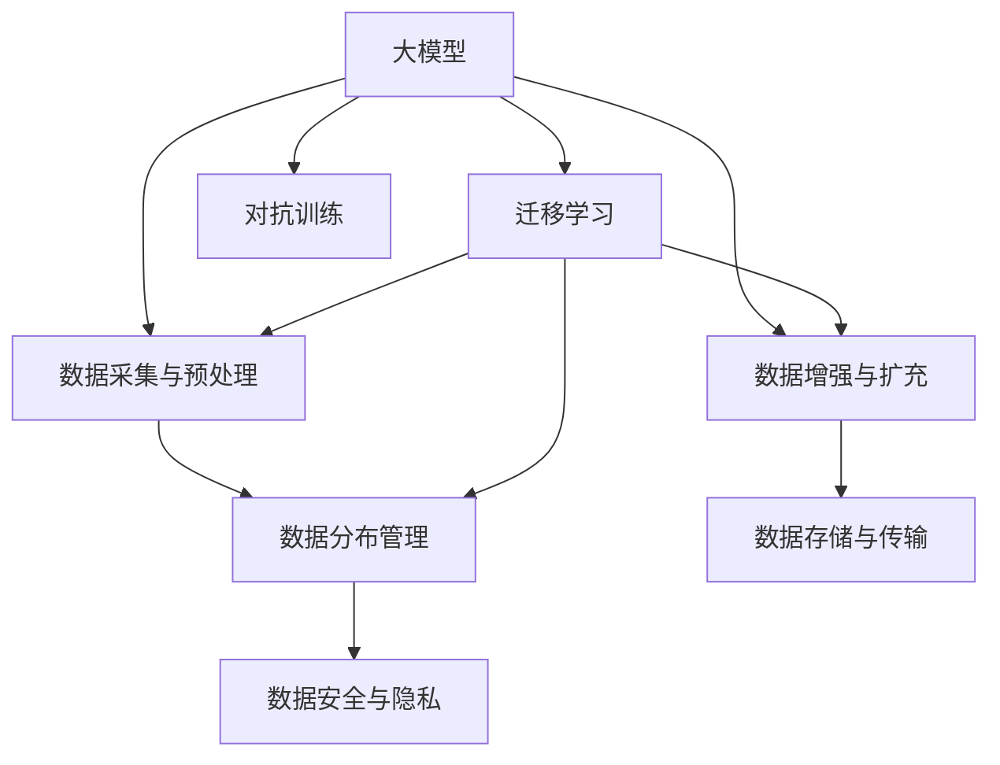

                 

## 1. 背景介绍

### 1.1 问题由来
在人工智能领域，尤其是深度学习模型和大规模数据驱动的领域中，数据的质量和数量成为了制约模型性能和应用效果的关键因素。近年来，大模型在各个领域展现了惊人的潜力，但它们对数据的需求和依赖也是其面临的最大挑战之一。在创业过程中，如何获取和处理大量高质量的数据，如何应对数据分布变化和数据质量波动，成为大模型创业者必须面对的核心问题。

### 1.2 问题核心关键点
本文将探讨大模型创业者如何通过系统性策略和工具，应对数据挑战，提升模型性能和应用效果。我们将从以下几个关键点出发：

- **数据采集与预处理**：如何高效地采集和清洗数据，以构建高质量的数据集。
- **数据增强与扩充**：如何利用数据增强技术，提高数据的多样性和泛化能力。
- **数据分布管理**：如何管理数据分布变化，保证模型在实际应用中的稳健性。
- **数据安全与隐私**：如何在保证数据安全的同时，获取足够的训练数据。
- **数据存储与传输**：如何优化数据存储和传输效率，支持大规模模型的训练和部署。

## 2. 核心概念与联系

### 2.1 核心概念概述

为更好地理解如何应对未来数据挑战，我们首先介绍几个相关核心概念：

- **大模型（Large Models）**：指具有大量参数的深度学习模型，如BERT、GPT-3、XLNet等，通过大规模数据预训练，具备强大的学习能力。
- **数据增强（Data Augmentation）**：通过一系列数据变换技术，如随机裁剪、旋转、翻转等，扩充训练集的多样性。
- **迁移学习（Transfer Learning）**：指将在大规模数据上预训练的模型，迁移到特定任务或小规模数据上进行微调，以提升模型性能。
- **自监督学习（Self-Supervised Learning）**：利用无标签数据，通过自动生成的任务（如掩码语言模型、对比学习等）进行预训练，减少对标注数据的依赖。
- **对抗训练（Adversarial Training）**：通过引入对抗样本，增强模型对噪声和攻击的鲁棒性。
- **数据安全与隐私保护（Data Security & Privacy）**：保障数据在采集、存储、传输和处理过程中不被泄露或滥用。

这些核心概念之间的联系可以通过以下Mermaid流程图来展示：



这个流程图展示了各个核心概念之间的联系：

1. 大模型通过数据采集与预处理、数据增强与扩充等手段，提升训练集的多样性和质量。
2. 数据分布管理和对抗训练技术，增强模型在不同数据分布下的鲁棒性。
3. 迁移学习和数据安全与隐私保护，确保模型在实际应用中的稳健性和合规性。

## 3. 核心算法原理 & 具体操作步骤

### 3.1 算法原理概述

应对未来数据挑战的核心在于系统性、全方位的策略，包括数据采集、预处理、增强、分布管理、安全保护等多个环节。以下将详细介绍这些策略的原理和具体操作步骤。

### 3.2 算法步骤详解

#### 3.2.1 数据采集与预处理

**步骤1: 数据采集**

- **策略1：多源数据采集**：从互联网、公共数据集、企业内外部数据等多个来源采集数据。互联网数据源丰富，但可能存在噪声；公共数据集如Wikipedia、IMDb等可靠但数据量有限；企业内部数据可能包含更多业务信息。

- **策略2：开放数据平台**：利用Google Dataset Search、Kaggle、阿里天池等开放数据平台，获取更多数据集。这些平台涵盖了众多领域的数据，有助于发现适合特定任务的数据集。

**步骤2: 数据预处理**

- **策略1：数据清洗**：通过脚本或工具自动化清洗数据，去除重复、错误、无关的记录。
- **策略2：特征工程**：对原始数据进行归一化、标准化、特征提取等处理，提升数据的质量和可解释性。

#### 3.2.2 数据增强与扩充

**步骤1: 数据增强技术**

- **策略1：随机裁剪、旋转、翻转**：对图像数据进行随机裁剪、旋转、翻转等变换，扩充训练集的多样性。
- **策略2：噪声注入**：对音频、文本等数据加入随机噪声，提高模型对噪声的鲁棒性。
- **策略3：数据合成**：利用GAN、VAE等生成模型，生成更多合成数据。

**步骤2: 数据扩充方法**

- **策略1：生成式数据扩充**：利用文本生成模型，如GPT-3、BERT等，生成新的文本数据。
- **策略2：半监督学习**：利用少量标注数据和大量无标签数据进行半监督学习，提高模型的泛化能力。

#### 3.2.3 数据分布管理

**步骤1: 分布漂移检测**

- **策略1：监测指标**：利用AUC、ROC曲线等指标，监测模型性能是否稳定。
- **策略2：分布漂移检测**：通过数据分布分析工具，如Weka、Scikit-learn等，检测数据分布的变化。

**步骤2: 分布适应策略**

- **策略1：重新采样**：通过重采样技术，如SMOTE、ADASYN等，调整数据分布。
- **策略2：迁移学习**：在不同分布的数据集上进行迁移学习，提升模型的泛化能力。

#### 3.2.4 数据安全与隐私保护

**步骤1: 数据匿名化**

- **策略1：数据脱敏**：使用脱敏技术，如k-匿名化、l-多样性等，保护数据隐私。
- **策略2：差分隐私**：使用差分隐私技术，添加噪声，保护个体隐私。

**步骤2: 安全传输**

- **策略1：端到端加密**：使用TLS、HTTPS等加密技术，保护数据在传输过程中的安全。
- **策略2：访问控制**：通过访问控制策略，限制数据访问权限，防止未经授权的数据访问。

#### 3.2.5 数据存储与传输

**步骤1: 数据存储**

- **策略1：分布式存储**：使用Hadoop、Spark等分布式存储技术，支持大规模数据存储。
- **策略2：数据压缩**：使用Gzip、Snappy等压缩算法，减小数据存储和传输的体积。

**步骤2: 数据传输**

- **策略1：传输协议**：使用TCP/IP、HTTP/HTTPS等传输协议，确保数据传输的可靠性。
- **策略2：数据缓存**：利用缓存技术，如Redis、Memcached等，提升数据传输效率。

### 3.3 算法优缺点

**优点**：

- **高效的数据采集**：多源数据采集策略和开放数据平台，大大提高了数据采集的效率和质量。
- **增强数据多样性**：数据增强和扩充技术，提升了训练集的多样性和泛化能力。
- **应对分布变化**：分布漂移检测和分布适应策略，增强了模型在不同数据分布下的鲁棒性。
- **数据安全保护**：数据匿名化和差分隐私技术，保证了数据的安全和隐私。
- **优化存储传输**：分布式存储和传输协议，提升了数据存储和传输的效率。

**缺点**：

- **技术门槛高**：数据增强和分布管理等策略需要较高的技术门槛，对团队的要求较高。
- **数据质量不稳定**：开放数据平台和互联网数据源可能存在噪声和错误，影响数据质量。
- **隐私保护复杂**：数据匿名化和差分隐私技术虽然有效，但实现复杂，可能存在隐私保护漏洞。
- **存储成本高**：大规模数据存储和传输需要较高的成本和技术支持。

### 3.4 算法应用领域

基于以上策略，大模型创业者在以下领域可以取得显著的成果：

- **医疗领域**：通过多源数据采集和数据增强，利用大模型进行疾病诊断和治疗方案推荐。
- **金融领域**：从多个数据源获取交易数据、市场数据等，利用大模型进行风险预测和投资策略分析。
- **智能客服**：从社交媒体、客服记录等获取客户反馈数据，利用大模型进行情感分析和智能对话。
- **智慧城市**：从交通、环境、能源等多个领域采集数据，利用大模型进行智能决策和城市管理。
- **教育领域**：从学习平台、教育评估等获取学生数据，利用大模型进行个性化教育和智能推荐。

## 4. 数学模型和公式 & 详细讲解 & 举例说明

### 4.1 数学模型构建

为了更好地理解数据增强和分布管理等策略，我们将通过数学模型和公式进行详细讲解。

**数据增强模型**：

设输入数据为 $x$，增强后的数据为 $x'$，增强策略为 $f(x)$，则数据增强的数学模型为：

$$ x' = f(x) $$

其中 $f(x)$ 可以包括随机裁剪、旋转、翻转等变换策略。

**分布管理模型**：

设数据分布为 $p(x)$，分布变化后的数据分布为 $p'(x)$，分布适应策略为 $g(x)$，则分布管理的数学模型为：

$$ p'(x) = g(p(x)) $$

其中 $g(p(x))$ 可以包括重采样、迁移学习等策略。

### 4.2 公式推导过程

以下我们将详细推导数据增强和分布管理的数学公式，并给出具体的案例分析。

**数据增强公式推导**：

对于图像数据增强，常用的策略包括随机裁剪、旋转、翻转等。以随机裁剪为例，假设原始图像大小为 $H \times W$，随机裁剪的大小为 $H' \times W'$，则随机裁剪的数学模型为：

$$ x' = \text{crop}(x, (i,j,H',W')) $$

其中 $(i,j)$ 表示裁剪的起始位置，随机生成于 $[0, H-W']$ 和 $[0, W-H']$ 范围内。

**分布管理公式推导**：

对于数据分布管理，常用的策略包括重采样和迁移学习。以重采样为例，假设原始数据分布为 $p(x)$，重采样后的数据分布为 $p'(x)$，则重采样的数学模型为：

$$ p'(x) = \frac{1}{n} \sum_{i=1}^n \delta(x - x_i) $$

其中 $n$ 为采样数量，$x_i$ 为采样后的数据点。

### 4.3 案例分析与讲解

**案例1: 图像数据增强**

假设有一个包含1000张猫狗的图像数据集，其中每张图像大小为 $512 \times 512$。为了扩充数据集，可以随机裁剪图像大小为 $256 \times 256$，并对其进行随机旋转和翻转。

**案例2: 数据重采样**

假设有一个包含1000个病人的医疗数据集，其中每个病人有10个特征。数据分布不均衡，为了使其更加均衡，可以进行重采样。可以随机选择200个病人进行重采样，使每个病人特征的数量相同，从而提升模型的泛化能力。

## 5. 项目实践：代码实例和详细解释说明

### 5.1 开发环境搭建

在进行数据增强和分布管理的实践前，我们需要准备好开发环境。以下是使用Python进行PyTorch开发的环境配置流程：

1. 安装Anaconda：从官网下载并安装Anaconda，用于创建独立的Python环境。

2. 创建并激活虚拟环境：
```bash
conda create -n pytorch-env python=3.8 
conda activate pytorch-env
```

3. 安装PyTorch：根据CUDA版本，从官网获取对应的安装命令。例如：
```bash
conda install pytorch torchvision torchaudio cudatoolkit=11.1 -c pytorch -c conda-forge
```

4. 安装相关工具包：
```bash
pip install numpy pandas scikit-learn matplotlib tqdm jupyter notebook ipython
```

5. 安装相关库：
```bash
pip install torchvision albumentations transformers
```

完成上述步骤后，即可在`pytorch-env`环境中开始数据增强和分布管理的实践。

### 5.2 源代码详细实现

这里我们以图像数据增强为例，给出使用PyTorch和Albumentations库进行数据增强的Python代码实现。

首先，定义图像增强函数：

```python
import torch
import albumentations as A

def augment_data(x, y):
    transform = A.Compose([
        A.RandomCrop(256, 256),
        A.RandomRotation(30),
        A.HorizontalFlip(p=0.5),
        A.VerticalFlip(p=0.5),
    ])
    return transform(x), y

# 加载原始数据
train_dataset = torchvision.datasets.CIFAR10(root='./data', train=True, download=True)
test_dataset = torchvision.datasets.CIFAR10(root='./data', train=False, download=True)

# 数据预处理
transform_train = A.Compose([
    A.Resize(256, 256),
    A.ToTensor(),
])

train_dataset = A.PILDataset(train_dataset, transform=transform_train)
test_dataset = A.PILDataset(test_dataset, transform=transform_train)

# 数据增强
train_loader = torch.utils.data.DataLoader(train_dataset, batch_size=64, shuffle=True, num_workers=2)
test_loader = torch.utils.data.DataLoader(test_dataset, batch_size=64, shuffle=False, num_workers=2)
```

然后，训练和评估模型：

```python
from torch import nn
from torch import optim

class Net(nn.Module):
    def __init__(self):
        super(Net, self).__init__()
        self.conv1 = nn.Conv2d(3, 64, 3, padding=1)
        self.conv2 = nn.Conv2d(64, 128, 3, padding=1)
        self.conv3 = nn.Conv2d(128, 64, 3, padding=1)
        self.pool = nn.MaxPool2d(2, 2)
        self.fc1 = nn.Linear(64 * 8 * 8, 1024)
        self.fc2 = nn.Linear(1024, 10)

    def forward(self, x):
        x = self.pool(nn.functional.relu(self.conv1(x)))
        x = self.pool(nn.functional.relu(self.conv2(x)))
        x = self.pool(nn.functional.relu(self.conv3(x)))
        x = x.view(-1, 64 * 8 * 8)
        x = nn.functional.relu(self.fc1(x))
        x = self.fc2(x)
        return x

model = Net()
device = torch.device('cuda' if torch.cuda.is_available() else 'cpu')
model.to(device)

criterion = nn.CrossEntropyLoss()
optimizer = optim.Adam(model.parameters(), lr=0.001)

def train_epoch(model, data_loader, optimizer):
    model.train()
    running_loss = 0.0
    for i, (inputs, labels) in enumerate(data_loader):
        inputs, labels = inputs.to(device), labels.to(device)
        optimizer.zero_grad()
        outputs = model(inputs)
        loss = criterion(outputs, labels)
        loss.backward()
        optimizer.step()
        running_loss += loss.item()
    return running_loss / len(data_loader)

def evaluate(model, data_loader):
    model.eval()
    correct = 0
    total = 0
    with torch.no_grad():
        for i, (inputs, labels) in enumerate(data_loader):
            inputs, labels = inputs.to(device), labels.to(device)
            outputs = model(inputs)
            _, predicted = torch.max(outputs.data, 1)
            total += labels.size(0)
            correct += (predicted == labels).sum().item()
    print('Accuracy: {:.2f}%'.format(100 * correct / total))

def main():
    for epoch in range(10):
        train_loss = train_epoch(model, train_loader, optimizer)
        print('Epoch {}: train loss = {:.4f}'.format(epoch + 1, train_loss))
        evaluate(model, test_loader)

if __name__ == '__main__':
    main()
```

### 5.3 代码解读与分析

让我们再详细解读一下关键代码的实现细节：

**augment_data函数**：
- `A.Compose`方法：定义多个增强操作，如随机裁剪、旋转、翻转等，对输入图像进行增强。
- `transform(x), y`：返回增强后的图像和标签。

**Net模型**：
- `nn.Conv2d`：定义卷积层，用于提取图像特征。
- `nn.MaxPool2d`：定义池化层，用于降低特征维度。
- `nn.Linear`：定义全连接层，用于分类。

**train_epoch函数**：
- `model.train()`：将模型设置为训练模式。
- `optimizer.zero_grad()`：梯度清零。
- `outputs = model(inputs)`：前向传播计算输出。
- `loss = criterion(outputs, labels)`：计算损失。
- `loss.backward()`：反向传播计算梯度。
- `optimizer.step()`：更新模型参数。

**evaluate函数**：
- `model.eval()`：将模型设置为评估模式。
- `predicted = torch.max(outputs.data, 1)[1]`：取输出结果中的类别预测值。
- `correct += (predicted == labels).sum().item()`：计算正确预测的样本数。

**main函数**：
- `for epoch in range(10)`：训练10个epoch。
- `train_loss = train_epoch(model, train_loader, optimizer)`：每个epoch计算训练集损失。
- `evaluate(model, test_loader)`：每个epoch在测试集上评估模型性能。

通过以上代码实现，可以看到，数据增强和分布管理的实践并不复杂，但需要掌握一些基本的PyTorch和第三方库的使用技巧。

## 6. 实际应用场景

### 6.1 智能医疗系统

在智能医疗系统中，数据增强和分布管理技术可以大大提升模型的鲁棒性和泛化能力。例如，可以利用大规模医疗影像数据进行预训练，并通过随机裁剪、旋转等技术，扩充训练集的多样性。此外，利用迁移学习技术，可以将在大规模数据上预训练的模型迁移到特定任务上，提升模型的性能和稳定性。

### 6.2 金融风控平台

在金融风控平台中，数据增强和分布管理技术可以提升模型对异常数据的识别能力。例如，可以利用历史交易数据进行预训练，并通过数据合成技术生成更多的异常交易样本，提高模型的鲁棒性。此外，通过迁移学习技术，可以在不同市场环境下进行模型迁移，提升模型的泛化能力。

### 6.3 智慧客服系统

在智慧客服系统中，数据增强和分布管理技术可以提升模型的理解能力和应答准确性。例如，可以利用用户对话记录进行预训练，并通过数据增强技术生成更多的对话样本，提高模型的泛化能力。此外，通过迁移学习技术，可以在不同业务场景中进行模型迁移，提升模型的适应性。

### 6.4 未来应用展望

随着数据增强和分布管理技术的不断发展，大模型创业者在更多领域可以取得显著的成果。未来，数据增强和分布管理技术将与其他AI技术进行更深入的融合，如知识图谱、因果推理、强化学习等，共同推动AI技术在各个垂直行业的落地应用。

## 7. 工具和资源推荐

### 7.1 学习资源推荐

为了帮助开发者系统掌握数据增强和分布管理技术，这里推荐一些优质的学习资源：

1. **《深度学习》课程**：斯坦福大学开设的深度学习课程，涵盖了深度学习的基本概念和核心技术，包括数据增强、迁移学习等。
2. **《数据增强》博客系列**：由AI领域专家撰写，深入浅出地介绍了数据增强的原理和实践技巧。
3. **《迁移学习》书籍**：详细介绍了迁移学习的理论基础和实际应用，包括数据增强、迁移学习等技术。
4. **Transformers库官方文档**：提供了丰富的预训练语言模型和微调样例代码，是学习和实践数据增强和分布管理的利器。
5. **Kaggle平台**：提供了大量公开数据集和竞赛，有助于发现适合特定任务的数据集，进行数据增强和分布管理实践。

通过对这些资源的学习实践，相信你一定能够快速掌握数据增强和分布管理的精髓，并用于解决实际的NLP问题。

### 7.2 开发工具推荐

高效的开发离不开优秀的工具支持。以下是几款用于数据增强和分布管理的常用工具：

1. **PyTorch**：基于Python的开源深度学习框架，灵活动态的计算图，适合快速迭代研究。提供了丰富的数据增强和分布管理接口。
2. **TensorFlow**：由Google主导开发的开源深度学习框架，生产部署方便，适合大规模工程应用。提供了丰富的数据增强和分布管理功能。
3. **Albumentations**：基于PyTorch的图像增强库，提供了丰富的数据增强策略和工具，支持图像、掩码等数据类型的增强。
4. **HuggingFace Transformers库**：提供了丰富的预训练语言模型和微调样例代码，支持分布管理和迁移学习。
5. **Scikit-learn**：基于Python的机器学习库，提供了丰富的数据预处理和分布管理功能，支持多维数据的处理和分析。

合理利用这些工具，可以显著提升数据增强和分布管理的开发效率，加快创新迭代的步伐。

### 7.3 相关论文推荐

数据增强和分布管理技术的发展源于学界的持续研究。以下是几篇奠基性的相关论文，推荐阅读：

1. **《Image Data Augmentation》**：介绍了图像数据增强的多种技术，包括随机裁剪、旋转、翻转等。
2. **《Data Augmentation with Momentum Approximation》**：提出了一种基于动量近似的数据增强方法，提升了数据增强的效率和效果。
3. **《Dataset Shift Detection and Adaptation for Deep Neural Networks》**：介绍了数据分布管理的多种策略，包括重采样、迁移学习等。
4. **《Distributionally Robust Optimization in Machine Learning》**：介绍了分布管理的优化方法，包括最大分布匹配等。

这些论文代表了大模型微调技术的发展脉络。通过学习这些前沿成果，可以帮助研究者把握学科前进方向，激发更多的创新灵感。

## 8. 总结：未来发展趋势与挑战

### 8.1 总结

本文对数据增强和分布管理在大模型中的应用进行了全面系统的介绍。首先阐述了数据增强和分布管理在面对未来数据挑战中的重要性，明确了数据采集、预处理、增强、分布管理、安全保护等多个关键点。其次，从原理到实践，详细讲解了数据增强和分布管理的数学原理和操作步骤，给出了数据增强和分布管理的代码实例。同时，本文还广泛探讨了数据增强和分布管理技术在智能医疗、金融风控、智慧客服等领域的实际应用前景，展示了数据增强和分布管理技术的巨大潜力。此外，本文精选了数据增强和分布管理的各类学习资源，力求为读者提供全方位的技术指引。

通过本文的系统梳理，可以看到，数据增强和分布管理技术在面对未来数据挑战中具有至关重要的作用。这些策略不仅能够提升模型在训练集上的泛化能力，还能增强模型在不同数据分布下的鲁棒性，保障数据的安全和隐私。未来，随着数据增强和分布管理技术的不断演进，大模型微调技术必将迎来新的突破，为构建安全、可靠、可解释、可控的智能系统铺平道路。

### 8.2 未来发展趋势

展望未来，数据增强和分布管理技术将呈现以下几个发展趋势：

1. **深度融合多模态数据**：未来的数据增强和分布管理技术将融合更多模态的数据，如文本、图像、视频、音频等，提升模型的多模态能力。
2. **利用大数据提升效果**：随着数据采集技术的进步，大数据资源将越来越多，利用大数据提升模型性能和泛化能力。
3. **引入对抗样本增强模型鲁棒性**：通过对抗样本生成技术，提升模型的鲁棒性和泛化能力。
4. **引入因果推理增强模型理解**：通过因果推理技术，提升模型的理解能力和推理能力。
5. **结合领域知识进行优化**：利用领域知识进行数据增强和分布管理，提升模型的业务适用性和解释性。

这些趋势展示了数据增强和分布管理技术的广阔前景，为构建更加智能、健壮的AI系统提供了新的方向。

### 8.3 面临的挑战

尽管数据增强和分布管理技术已经取得了不少进展，但在实现其理想效果时，仍面临诸多挑战：

1. **技术复杂度高**：数据增强和分布管理需要复杂的算法和工具，对团队的技术要求较高。
2. **数据质量不稳定**：开放数据平台和互联网数据源可能存在噪声和错误，影响数据质量。
3. **数据隐私保护复杂**：数据匿名化和差分隐私技术虽然有效，但实现复杂，可能存在隐私保护漏洞。
4. **存储和传输成本高**：大规模数据存储和传输需要较高的成本和技术支持。
5. **分布漂移检测困难**：在不同数据分布下，分布漂移检测难度较大，需要先进的监测和分析工具。

这些挑战凸显了数据增强和分布管理技术在实际应用中的复杂性和难度。

### 8.4 研究展望

面对数据增强和分布管理技术面临的挑战，未来的研究需要在以下几个方面寻求新的突破：

1. **提升数据采集效率**：利用自动化数据采集工具和开放数据平台，提升数据采集效率和质量。
2. **降低数据增强成本**：开发更高效的数据增强算法和工具，降低数据增强的成本和时间。
3. **优化数据分布管理策略**：探索新的数据分布管理策略，提升模型的泛化能力和稳健性。
4. **加强数据隐私保护**：结合区块链、联邦学习等技术，提升数据隐私保护能力。
5. **优化数据存储和传输**：利用分布式存储和边缘计算技术，优化数据存储和传输效率。

这些研究方向的探索，必将引领数据增强和分布管理技术迈向更高的台阶，为构建安全、可靠、可解释、可控的智能系统铺平道路。面向未来，数据增强和分布管理技术还需要与其他AI技术进行更深入的融合，如知识表示、因果推理、强化学习等，多路径协同发力，共同推动自然语言理解和智能交互系统的进步。只有勇于创新、敢于突破，才能不断拓展语言模型的边界，让智能技术更好地造福人类社会。

## 9. 附录：常见问题与解答

**Q1: 如何选择合适的数据增强策略？**

A: 选择合适的数据增强策略需要考虑数据的特点和任务的要求。对于图像数据，常用的策略包括随机裁剪、旋转、翻转等。对于文本数据，可以通过近义替换、随机插入等策略增强多样性。此外，可以根据任务类型选择不同的策略，如分类任务可以使用多类别数据增强，生成任务可以使用噪声注入等策略。

**Q2: 数据增强是否会引入噪声？**

A: 数据增强过程中可能会引入噪声，但这并不一定是一件坏事。通过引入随机噪声，可以提高模型的鲁棒性和泛化能力。例如，在图像数据增强中，可以通过加入随机噪声和模糊处理，提升模型的对噪声和攻击的鲁棒性。

**Q3: 如何评估数据增强的效果？**

A: 评估数据增强效果的关键在于计算增强后数据与原始数据之间的差距。可以使用准确率、召回率、F1值等指标来评估数据增强对模型性能的影响。此外，可以通过可视化手段，观察增强后数据的多样性和分布情况，评估数据增强的效果。

**Q4: 数据增强是否适用于所有数据类型？**

A: 数据增强方法通常适用于图像、音频、文本等多种数据类型。但对于一些特定类型的数据，如时序数据、文本等，可能需要采用不同的增强策略。例如，对于时序数据，可以通过时间延拓、数据混杂等策略增强数据多样性。

**Q5: 如何处理数据分布变化？**

A: 处理数据分布变化的关键在于监测和检测数据分布的漂移，及时调整模型。可以使用AUC、ROC曲线等指标，监测模型性能是否稳定。在检测到分布漂移后，可以采用重采样、迁移学习等策略，适应新的数据分布。

**Q6: 如何保证数据的安全和隐私？**

A: 保证数据安全和隐私的关键在于数据采集、存储和传输过程中的加密和访问控制。可以使用端到端加密、访问控制策略等手段，保护数据的机密性和完整性。此外，还可以采用数据匿名化和差分隐私技术，保护个体隐私。

通过以上常见问题的解答，可以看到数据增强和分布管理技术在实际应用中需要考虑诸多因素。只有系统性地处理数据采集、预处理、增强、分布管理等环节，才能构建出高效、健壮、智能的AI系统。

---

作者：禅与计算机程序设计艺术 / Zen and the Art of Computer Programming

