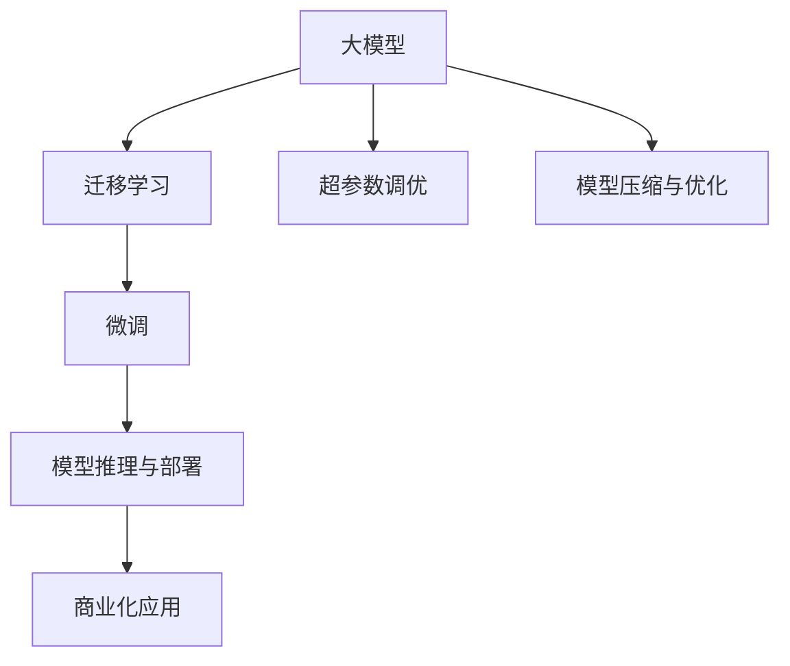

                 

# AI大模型创业：如何打造未来爆款应用？

## 1. 背景介绍

### 1.1 问题由来
近年来，人工智能（AI）和大数据技术的迅猛发展，尤其是在深度学习领域，已经实现了从数据驱动到模型驱动的转变。其中，大模型（Large Models）作为模型驱动的重要代表，由于其强大的表现力和可扩展性，在自然语言处理（NLP）、计算机视觉（CV）、语音识别（ASR）等诸多领域都取得了显著的成果。然而，尽管大模型的能力显著，但在大规模商业化应用中，仍面临诸多挑战。

### 1.2 问题核心关键点
大模型在创业公司的应用中，如何平衡模型性能、开发成本、落地难度、商业模式等多方面因素，是一个复杂且值得深入探讨的问题。核心问题在于：
- **模型选择与适配**：选择何种大模型，以及如何根据业务需求进行适配，是创业公司需要重点考虑的问题。
- **开发与部署**：如何高效地开发、训练、部署和管理大模型，是一个技术难题。
- **商业应用与收入**：如何将大模型转化为有竞争力的商业应用，并实现稳定收入，是商业模式的核心。
- **隐私与伦理**：大模型往往涉及大量敏感数据，如何保证数据隐私和模型伦理，是创业公司必须遵守的规范。

## 2. 核心概念与联系

### 2.1 核心概念概述

为更好地理解如何将大模型应用于创业公司，本节将介绍几个关键概念及其内在联系：

- **大模型（Large Model）**：指的是具有大规模参数量的深度学习模型，如GPT、BERT等，这些模型在特定任务上通常能够显著提升性能。
- **迁移学习（Transfer Learning）**：指将在大规模数据集上预训练的模型迁移到小规模数据集上进行微调，以提高模型在特定任务上的表现。
- **微调（Fine-Tuning）**：指在预训练模型的基础上，使用少量标注数据对模型进行优化，使其能够更好地适应特定任务。
- **超参数调优（Hyperparameter Tuning）**：在模型训练过程中，调整模型的超参数（如学习率、批次大小、优化器等）以获得最佳性能。
- **模型压缩与优化（Model Compression & Optimization）**：通过剪枝、量化、蒸馏等方法，减少模型参数量，提高模型效率和部署速度。
- **模型推理与部署（Model Inference & Deployment）**：将训练好的模型应用于实际场景，进行推理和部署，以提供服务。
- **商业化应用（Commercial Application）**：将AI模型转化为具有实际价值的产品或服务，并实现商业化运营。

这些核心概念之间具有紧密的联系，共同构成了从模型训练到商业化应用的完整流程。

### 2.2 核心概念原理和架构的 Mermaid 流程图



该流程图展示了大模型从训练到商业应用的全过程。首先，通过迁移学习在大规模数据集上进行预训练；然后，使用微调方法在小规模数据集上进行优化；接着，通过超参数调优和模型压缩与优化，提高模型效率；最后，将优化后的模型进行推理和部署，进入商业化应用阶段。

## 3. 核心算法原理 & 具体操作步骤

### 3.1 算法原理概述

AI大模型的创业应用，本质上是一个从模型训练到商业化的过程。其核心思想是将AI大模型的能力转化为可操作的商业产品或服务，通过精准定位市场需求，提供高效、稳定的解决方案。

大模型创业的算法原理，主要包括以下几个步骤：
1. **模型选择与适配**：根据业务需求选择合适的预训练模型，并对其进行适当的微调，以适应具体任务。
2. **数据准备**：收集和处理业务相关的数据，作为微调数据集。
3. **模型训练与优化**：在微调数据集上训练模型，并进行超参数调优和模型压缩，以获得高效、轻量级的模型。
4. **模型部署与推理**：将训练好的模型部署到生产环境中，进行实时推理，以提供服务。
5. **商业化运营**：通过市场营销和用户反馈，不断优化产品，形成稳定的商业模式。

### 3.2 算法步骤详解

基于上述原理，AI大模型创业的应用步骤大致可以分为以下几个阶段：

**阶段1：模型选择与适配**

1. **选择模型**：根据业务需求，选择合适的预训练模型。例如，在NLP领域可以选择BERT或GPT，在CV领域可以选择ResNet或Inception。
2. **数据适配**：根据业务数据的特点，对预训练模型进行微调。例如，在NLP任务中，可以调整模型的分类头，以适应特定的分类任务。
3. **性能评估**：使用业务数据集对微调后的模型进行评估，确保模型性能达到业务需求。

**阶段2：数据准备**

1. **数据收集**：收集业务相关的数据，包括原始数据和标注数据。例如，在NLP任务中，可以收集客户评论、新闻、公告等文本数据。
2. **数据处理**：对数据进行清洗、标注、分割等处理，以适应模型训练的需求。
3. **数据增强**：通过对数据进行扩充、增强，以提高模型的泛化能力。

**阶段3：模型训练与优化**

1. **训练模型**：在处理后的数据集上训练微调后的模型，使用优化器进行参数更新。
2. **超参数调优**：调整学习率、批次大小、优化器等超参数，以获得最佳的模型性能。
3. **模型压缩与优化**：通过剪枝、量化、蒸馏等方法，减少模型参数量，提高模型效率和部署速度。

**阶段4：模型部署与推理**

1. **模型部署**：将训练好的模型部署到生产环境中，例如AWS、阿里云、华为云等。
2. **推理优化**：针对模型推理的性能瓶颈，进行优化，例如使用GPU加速、优化计算图、减少内存占用等。
3. **服务监控**：对模型服务进行监控，确保其稳定运行，并提供告警机制。

**阶段5：商业化运营**

1. **产品设计**：根据模型输出结果，设计产品界面、交互方式等，提升用户体验。
2. **市场营销**：通过线上线下渠道，推广产品，吸引用户。
3. **用户反馈**：收集用户反馈，不断优化产品，以适应市场需求。
4. **商业模式**：根据用户需求和市场反馈，设计合理的商业模式，例如订阅制、按需付费、API服务等。

### 3.3 算法优缺点

AI大模型创业的算法具有以下优点：
- **高效**：利用大模型的能力，可以快速迭代产品，缩短开发周期。
- **泛化能力强**：大模型经过大规模预训练，具有较强的泛化能力，能够适应多种业务场景。
- **易扩展**：大模型具有较好的模块化结构，可以根据需要添加新的模块，扩展产品功能。

同时，也存在一些缺点：
- **成本高**：大模型的训练和部署需要大量的计算资源，初期投入成本较高。
- **数据依赖**：模型的性能依赖于数据的质量和量，需要收集和处理大量数据。
- **模型复杂**：大模型的结构复杂，需要专业的技术人员进行维护和管理。

### 3.4 算法应用领域

AI大模型创业的应用领域非常广泛，以下是几个典型应用场景：

- **自然语言处理（NLP）**：例如智能客服、情感分析、机器翻译等。
- **计算机视觉（CV）**：例如人脸识别、图像分类、自动驾驶等。
- **语音识别（ASR）**：例如智能音箱、语音助手、自动字幕等。
- **医疗健康**：例如智能问诊、疾病预测、基因分析等。
- **金融服务**：例如信用评分、风险评估、投资分析等。
- **智能制造**：例如质量检测、生产调度、设备维护等。

## 4. 数学模型和公式 & 详细讲解 & 举例说明

### 4.1 数学模型构建

在AI大模型的创业应用中，常见的数学模型包括分类模型、回归模型、序列模型等。以分类模型为例，其基本数学模型可以表示为：

$$
y = f(x; \theta)
$$

其中，$y$ 表示模型的预测结果，$x$ 表示输入特征，$\theta$ 表示模型参数。在实际应用中，$x$ 可以是文本、图像、音频等形式，$f$ 可以是各种深度学习模型，如神经网络、卷积神经网络、循环神经网络等。

### 4.2 公式推导过程

以二分类任务为例，假设模型的输入为文本 $x$，输出为二元分类 $y \in \{0,1\}$。模型的预测结果 $y'$ 可以通过sigmoid函数计算得到：

$$
y' = \frac{1}{1+\exp(-W^T x + b)}
$$

其中，$W$ 和 $b$ 是模型的参数，$x$ 是文本的词向量表示。模型的损失函数可以采用二元交叉熵损失函数：

$$
L(y, y') = -(y\log y' + (1-y)\log (1-y'))
$$

在实际应用中，需要对损失函数进行反向传播，更新模型参数 $\theta$：

$$
\theta = \theta - \eta \nabla_\theta L(y, y')
$$

其中，$\eta$ 是学习率。

### 4.3 案例分析与讲解

假设我们有一个电商平台的客户评论分类任务，目标是判断评论是否为正面评价。我们可以使用BERT模型作为预训练模型，在标注的评论数据集上进行微调。具体步骤如下：

1. **数据准备**：收集电商平台的客户评论数据，并进行标注。
2. **模型选择与适配**：选择BERT模型，并将其分类头替换为二分类头。
3. **模型训练与优化**：在标注数据集上训练微调后的模型，并进行超参数调优和模型压缩。
4. **模型部署与推理**：将训练好的模型部署到电商平台的服务器上，进行实时推理，判断客户评论的情感倾向。

## 5. 项目实践：代码实例和详细解释说明

### 5.1 开发环境搭建

在进行AI大模型的创业应用时，需要搭建一个高效的开发环境。以下是一些常用的开发环境搭建步骤：

1. **选择开发平台**：可以选择本地开发环境，例如Jupyter Notebook，或者云开发环境，例如AWS SageMaker、阿里云PaddlePaddle等。
2. **安装必要的库**：安装TensorFlow、PyTorch、scikit-learn等深度学习库和数据分析库。
3. **配置计算资源**：根据任务需求，配置CPU、GPU、内存等计算资源。
4. **版本控制**：使用Git进行版本控制，方便团队协作和代码管理。

### 5.2 源代码详细实现

以电商平台的客户评论分类任务为例，下面是一个基于PyTorch的代码实现：

```python
import torch
import torch.nn as nn
import torch.optim as optim
from transformers import BertTokenizer, BertForSequenceClassification
from transformers import AdamW

# 加载数据集
tokenizer = BertTokenizer.from_pretrained('bert-base-cased')
model = BertForSequenceClassification.from_pretrained('bert-base-cased', num_labels=2)

# 定义损失函数和优化器
criterion = nn.CrossEntropyLoss()
optimizer = AdamW(model.parameters(), lr=2e-5)

# 定义模型训练函数
def train_model(model, data_loader, criterion, optimizer, device):
    model.to(device)
    total_loss = 0
    for batch in data_loader:
        input_ids = batch['input_ids'].to(device)
        attention_mask = batch['attention_mask'].to(device)
        labels = batch['labels'].to(device)
        
        # 前向传播
        outputs = model(input_ids, attention_mask=attention_mask, labels=labels)
        loss = outputs.loss
        
        # 反向传播
        optimizer.zero_grad()
        loss.backward()
        optimizer.step()
        
        # 累加损失
        total_loss += loss.item()
    
    return total_loss / len(data_loader)

# 定义模型评估函数
def evaluate_model(model, data_loader, criterion, device):
    model.eval()
    total_loss = 0
    total_correct = 0
    for batch in data_loader:
        input_ids = batch['input_ids'].to(device)
        attention_mask = batch['attention_mask'].to(device)
        labels = batch['labels'].to(device)
        
        # 前向传播
        with torch.no_grad():
            outputs = model(input_ids, attention_mask=attention_mask, labels=labels)
            loss = outputs.loss
            logits = outputs.logits
        
        # 计算损失和准确率
        total_loss += loss.item()
        total_correct += torch.sum(torch.argmax(logits, dim=1) == labels).item()
    
    return total_loss / len(data_loader), total_correct / len(data_loader)
```

### 5.3 代码解读与分析

上述代码实现了基于BERT模型对电商客户评论分类任务的微调过程。具体分析如下：

1. **数据加载**：使用BertTokenizer对输入文本进行分词，并转换为模型所需的格式。
2. **模型初始化**：从HuggingFace加载预训练的BERT模型，并替换分类头。
3. **损失函数与优化器**：使用CrossEntropyLoss和AdamW作为损失函数和优化器。
4. **模型训练**：定义训练函数train_model，进行前向传播、反向传播、参数更新等操作。
5. **模型评估**：定义评估函数evaluate_model，计算模型的损失和准确率。

## 6. 实际应用场景

### 6.1 智能客服

智能客服系统是大模型创业的典型应用场景之一。通过大模型，可以实现7x24小时不间断服务，提升客户咨询体验，降低企业人力成本。例如，可以针对电商平台的客户服务需求，构建基于BERT模型的智能客服系统，提供自动回复和问题引导服务。

### 6.2 金融风控

金融领域对模型的实时性和准确性要求较高，因此可以利用大模型进行风控预测。例如，基于BERT模型的情感分析，可以用于识别潜在金融风险，及时预警不良交易行为。

### 6.3 健康医疗

医疗领域需要大量的文本数据进行训练，大模型可以用于病历分析、智能问诊等任务。例如，基于BERT模型的疾病预测，可以辅助医生进行诊断，提高诊疗效率和准确性。

### 6.4 未来应用展望

未来，AI大模型创业将继续扩展其应用领域，并在更多行业领域发挥重要作用。例如，在教育、娱乐、智慧城市等领域的AI应用，将为人类生活带来更多便利和创新。

## 7. 工具和资源推荐

### 7.1 学习资源推荐

1. **《深度学习》课程**：斯坦福大学提供的深度学习课程，涵盖深度学习的基本原理和常用模型。
2. **TensorFlow官方文档**：TensorFlow官方文档提供了丰富的教程和示例，方便开发者快速上手。
3. **PyTorch官方文档**：PyTorch官方文档提供了详细的API说明和教程，是PyTorch开发者的必备工具。
4. **Kaggle竞赛**：Kaggle是数据科学竞赛平台，提供了大量的数据集和竞赛任务，适合学习和实践。
5. **Coursera课程**：Coursera提供了许多与AI和机器学习相关的课程，适合入门和进阶学习。

### 7.2 开发工具推荐

1. **Jupyter Notebook**：一个交互式的开发环境，支持Python、R等多种编程语言，适合数据科学和机器学习项目。
2. **AWS SageMaker**：亚马逊提供的云服务平台，支持深度学习模型的训练和部署。
3. **PyTorch Lightning**：一个基于PyTorch的深度学习框架，支持模型训练和优化。
4. **TensorBoard**：TensorFlow提供的可视化工具，用于监控和调试模型训练过程。
5. **HuggingFace Transformers库**：一个用于NLP任务的深度学习库，支持多种预训练模型和微调方法。

### 7.3 相关论文推荐

1. **《深度学习》（Goodfellow et al., 2016）**：深度学习的经典著作，涵盖了深度学习的基本原理和算法。
2. **《大规模深度学习》（Dean et al., 2012）**：介绍谷歌在深度学习领域的实践和经验，适合深度学习工程师阅读。
3. **《自然语言处理综述》（Manning et al., 2014）**：介绍自然语言处理的最新进展和应用，适合NLP领域的研究人员阅读。
4. **《生成对抗网络》（Goodfellow et al., 2014）**：介绍生成对抗网络的基本原理和应用，适合AI领域的研究人员阅读。
5. **《深度学习中的自监督方法》（Laskin et al., 2019）**：介绍自监督学习的最新进展，适合深度学习研究人员阅读。

## 8. 总结：未来发展趋势与挑战

### 8.1 研究成果总结

AI大模型创业在近年来取得了显著进展，并已广泛应用于多个领域。研究表明，大模型在多个任务上取得了SOTA（state-of-the-art）的性能，显示了其在自然语言处理、计算机视觉、语音识别等领域的强大能力。同时，大模型的创业应用也呈现出多种形式，包括智能客服、金融风控、健康医疗等。

### 8.2 未来发展趋势

未来，AI大模型创业将继续拓展其应用领域，并在更多行业领域发挥重要作用。具体趋势如下：
1. **多模态融合**：将视觉、语音、文本等模态信息进行融合，提升模型的表现力和泛化能力。
2. **自监督学习**：利用无监督学习方法和自监督任务，提升模型的自适应能力和泛化能力。
3. **联邦学习**：利用分布式计算和联邦学习技术，提升模型的数据隐私和安全性。
4. **模型压缩与优化**：通过剪枝、量化、蒸馏等方法，提高模型的效率和部署速度。
5. **实时推理**：利用边缘计算和模型蒸馏技术，提升模型的实时推理能力。

### 8.3 面临的挑战

AI大模型创业在发展过程中，仍然面临许多挑战：
1. **数据隐私**：如何保护用户数据的隐私和安全性，是一个重要问题。
2. **模型鲁棒性**：如何在不同数据分布上保持模型的鲁棒性和泛化能力。
3. **模型复杂性**：如何简化模型的结构，提高模型的可解释性和可维护性。
4. **应用落地**：如何将模型高效部署到实际应用中，并实现商业化运营。
5. **算法公平性**：如何避免模型的偏见和歧视，确保算法的公平性。

### 8.4 研究展望

未来的AI大模型创业，需要在以下方面进行深入研究：
1. **隐私保护**：研究如何保护用户数据的隐私和安全性，确保模型在数据隐私方面的合规性。
2. **模型优化**：研究如何优化模型的结构、算法和参数，提高模型的效率和可解释性。
3. **模型融合**：研究如何将多种模型进行融合，提升模型的综合性能。
4. **应用落地**：研究如何将模型高效部署到实际应用中，并实现商业化运营。
5. **公平性**：研究如何消除模型的偏见和歧视，确保算法的公平性和透明性。

总之，AI大模型创业是一个充满挑战和机遇的领域，需要在技术、商业、伦理等多个方面进行深入研究和实践，才能实现其巨大的商业价值和社会价值。

## 9. 附录：常见问题与解答

**Q1: AI大模型的创业应用有哪些优势？**

A: AI大模型的创业应用具有以下优势：
1. **高效**：利用大模型的能力，可以快速迭代产品，缩短开发周期。
2. **泛化能力强**：大模型经过大规模预训练，具有较强的泛化能力，能够适应多种业务场景。
3. **易扩展**：大模型具有较好的模块化结构，可以根据需要添加新的模块，扩展产品功能。

**Q2: 如何选择合适的AI大模型？**

A: 选择合适的AI大模型需要考虑以下几个因素：
1. **任务类型**：根据业务需求，选择适合的预训练模型，例如BERT用于分类，GPT用于生成。
2. **数据量**：根据数据量的大小，选择适合的大模型，例如BERT适用于小规模数据集，GPT适用于大规模数据集。
3. **性能要求**：根据任务对模型性能的要求，选择适合的模型，例如对实时性要求较高的任务，需要选择计算效率高的模型。

**Q3: 如何优化AI大模型的推理速度？**

A: 优化AI大模型的推理速度可以通过以下几种方法：
1. **剪枝**：通过剪枝方法，减少模型的参数量，提高推理速度。
2. **量化**：通过量化方法，将浮点模型转换为定点模型，减少内存占用，提高计算效率。
3. **优化计算图**：通过优化计算图，减少计算量，提高推理速度。
4. **模型并行**：通过模型并行技术，提高计算速度，优化资源利用率。

**Q4: 如何保护用户数据的隐私和安全性？**

A: 保护用户数据的隐私和安全性需要采取以下措施：
1. **数据匿名化**：对用户数据进行匿名化处理，避免泄露用户信息。
2. **差分隐私**：利用差分隐私技术，保护用户数据的安全性。
3. **访问控制**：对用户数据的访问进行严格的控制，确保只有授权人员才能访问。
4. **加密存储**：对用户数据进行加密存储，保护数据的安全性。

**Q5: 如何确保AI大模型的公平性和透明性？**

A: 确保AI大模型的公平性和透明性需要采取以下措施：
1. **数据多样性**：确保训练数据的多样性和代表性，避免模型对某些群体的偏见。
2. **模型解释性**：通过可解释性方法，了解模型的决策过程，提高模型的透明度。
3. **算法公平性**：利用公平性算法，消除模型的偏见和歧视。
4. **用户反馈**：收集用户反馈，不断优化模型，确保模型的公平性和透明性。

---

作者：禅与计算机程序设计艺术 / Zen and the Art of Computer Programming

