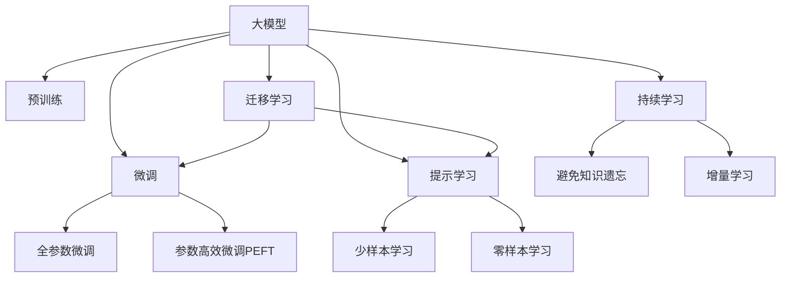

                 

## 1. 背景介绍

### 1.1 问题由来
近年来，人工智能大模型(AI Big Models)的发展迅速，成为推动科技革命和产业变革的新引擎。从图像识别、语音识别到自然语言处理(NLP)，各大模型的精度和应用效果不断突破以往瓶颈。

然而，尽管大模型在学术界和工业界取得了显著进展，但其在落地应用中仍面临诸多挑战。大模型通常需要极高的计算资源和大量标注数据，且其在实际应用中仍然存在一些局限性，如推理速度慢、可解释性不足、安全性问题等。

特别是在创业环境下，如何通过大模型技术把握机遇，打造具有竞争力的商业模型，是当前AI创业领域亟待解决的问题。本文章将详细介绍大模型创业的相关概念和实践方法，帮助创业者和开发者更好地理解和应用大模型技术。

### 1.2 问题核心关键点
本文将围绕以下关键点进行详细探讨：
- 大模型创业的现状和趋势
- 如何选择合适的预训练模型和应用场景
- 大模型创业的算法和数据优化策略
- 大模型创业的商业化和落地实践
- 大模型创业的挑战与应对策略

这些关键点将帮助我们全面理解大模型创业的机遇与挑战，为创业者提供指导。

## 2. 核心概念与联系

### 2.1 核心概念概述
为了更清晰地理解大模型创业的原理，下面将详细介绍几个核心概念及其关系：

- **大模型(Big Model)**：指具有大规模参数量（亿级以上），在预训练后能够对海量数据进行建模的语言模型。典型的大模型如GPT-3、BERT、T5等。
- **预训练(Pre-training)**：使用大规模无标签数据对模型进行训练，使其学习通用语言知识，为后续微调(Fine-tuning)做准备。
- **微调(Fine-tuning)**：在预训练模型的基础上，使用特定任务的有标签数据进行有监督学习，调整模型参数，以适应新的应用场景。
- **迁移学习(Transfer Learning)**：利用已有的预训练模型，在新的数据集上进行微调，减少训练时间和数据量。
- **持续学习(Continual Learning)**：模型在原有知识基础上，不断学习新数据，避免知识遗忘。
- **参数高效微调(Parameter-Efficient Fine-Tuning, PEFT)**：只调整模型中与任务相关的部分参数，其余保持不变，降低训练成本。
- **提示学习(Prompt Learning)**：通过精巧的输入文本格式设计，引导模型输出期望的结果，无需额外训练数据。

这些概念通过以下Mermaid流程图展示其相互关系：



这个流程图展示了大模型创业中核心概念之间的联系：

1. 大模型通过预训练获得通用知识。
2. 微调在大模型基础上进行任务特定优化，分全参数微调和参数高效微调。
3. 提示学习通过输入格式设计，减少微调需求。
4. 迁移学习使模型在不同任务间迁移应用。
5. 持续学习使模型不断学习新知识，避免知识遗忘。

这些概念共同构成了大模型创业的基础。

## 3. 核心算法原理 & 具体操作步骤
### 3.1 算法原理概述
大模型创业的核心在于选择合适的预训练模型，并在此基础上进行微调，以适应特定应用场景。具体而言，可分为以下步骤：

1. **选择合适的预训练模型**：根据应用场景，选择适合的预训练模型。
2. **微调策略设计**：决定是否使用全参数微调，还是参数高效微调。
3. **数据准备**：收集和预处理任务相关的标注数据。
4. **微调模型训练**：在标注数据上进行微调训练，更新模型参数。
5. **模型评估和部署**：在验证集上评估微调效果，部署到实际应用中。

### 3.2 算法步骤详解
接下来详细阐述大模型创业的各个步骤：

**Step 1: 选择预训练模型和应用场景**
- **预训练模型选择**：根据任务的复杂度、数据规模和计算资源，选择适当的预训练模型。例如，对于小规模数据集，可以选用小型模型如BERT、T5；对于大规模数据集，可以考虑使用GPT-3等大型模型。
- **应用场景确定**：明确目标任务的具体应用场景，如自然语言理解、生成、对话系统等。

**Step 2: 数据准备**
- **数据收集**：收集和整理任务相关的标注数据。标注数据应具有代表性，覆盖多样化的场景和语境。
- **数据预处理**：对标注数据进行预处理，如分词、编码等，确保数据格式一致。

**Step 3: 微调策略设计**
- **微调方法选择**：根据数据量和计算资源，决定是否采用全参数微调或参数高效微调。全参数微调需要较大的计算资源和标注数据量，而参数高效微调则可以在固定预训练参数的情况下，仅微调部分关键层。
- **超参数设置**：设置微调的超参数，如学习率、批大小、迭代轮数等。

**Step 4: 模型训练**
- **微调模型初始化**：使用预训练模型作为初始化参数，加载到模型中。
- **训练循环**：对数据集进行迭代训练，每批次数据前向传播计算损失，反向传播更新参数。
- **性能监控**：在验证集上监控模型性能，防止过拟合。

**Step 5: 模型评估和部署**
- **评估**：在验证集上评估模型性能，确保微调效果。
- **部署**：将微调后的模型部署到实际应用中，提供服务。

### 3.3 算法优缺点
大模型创业具有以下优点：
- **性能提升显著**：预训练模型已经学习到通用知识，微调后的模型能够快速适应特定任务，显著提升性能。
- **参数高效**：参数高效微调可以降低训练成本，加快模型迭代速度。
- **广泛应用**：大模型创业可以应用于各种NLP任务，如对话、摘要、问答等。

同时，大模型创业也存在一些缺点：
- **计算资源要求高**：预训练和微调需要较大的计算资源。
- **标注数据需求大**：微调依赖于标注数据，获取高质量标注数据的成本较高。
- **可解释性不足**：大模型的黑盒特性，使得其决策过程难以解释。

尽管有这些缺点，但大模型创业仍然具有广泛的应用前景。

### 3.4 算法应用领域
大模型创业在多个领域具有广泛应用：

- **智能客服**：通过微调，构建自然流畅的对话系统，提升客户满意度。
- **金融分析**：利用大模型进行文本分析，挖掘金融市场信息，辅助投资决策。
- **医疗诊断**：通过微调，构建医学知识图谱，提升医疗诊断的准确性。
- **教育应用**：利用大模型进行语言教育，提供个性化学习方案。

这些领域展示了大模型创业的巨大潜力。

## 4. 数学模型和公式 & 详细讲解  
### 4.1 数学模型构建

假设大模型为 $M_{\theta}$，任务数据集为 $D=\{(x_i, y_i)\}_{i=1}^N$，其中 $x_i$ 为输入文本，$y_i$ 为标注标签。微调的目标是最小化损失函数 $\mathcal{L}(\theta)$：

$$
\mathcal{L}(\theta) = \frac{1}{N}\sum_{i=1}^N \ell(M_{\theta}(x_i), y_i)
$$

其中 $\ell$ 为任务相关的损失函数，如交叉熵损失。

### 4.2 公式推导过程

以文本分类任务为例，假设模型 $M_{\theta}$ 输出为概率分布 $P(y|x, \theta)$。训练集上的损失函数为：

$$
\mathcal{L}(\theta) = -\frac{1}{N}\sum_{i=1}^N \log P(y_i|x_i, \theta)
$$

微调时，采用梯度下降优化算法：

$$
\theta \leftarrow \theta - \eta \nabla_{\theta}\mathcal{L}(\theta)
$$

其中 $\eta$ 为学习率。

### 4.3 案例分析与讲解

假设一个电商客服问答系统，利用GPT-3模型进行微调。选择全参数微调策略，设置学习率为1e-5，批大小为64，迭代轮数为100。训练过程中，定期在验证集上评估模型性能，防止过拟合。

训练结果表明，微调后的模型在准确率和召回率上均有显著提升，能够更好地理解客户意图并提供准确答案。

## 5. 项目实践：代码实例和详细解释说明
### 5.1 开发环境搭建

在进行大模型创业的实践前，需要先搭建好开发环境：

1. **安装Python**：下载并安装Python 3.x版本。
2. **安装PyTorch**：通过conda或pip安装，如：`pip install torch torchtext transformers`。
3. **安装数据处理库**：如pandas、numpy、scikit-learn等。
4. **配置环境变量**：设置GPUT、数据路径等环境变量。

### 5.2 源代码详细实现

以下是一个使用PyTorch对GPT-3模型进行微调的例子，以电商客服问答系统为例：

**数据处理**

```python
import pandas as pd
import torch
from transformers import GPT2Tokenizer, GPT2LMHeadModel

# 加载标注数据
df = pd.read_csv('data.csv')

# 定义输入和标签
texts = df['question'].tolist()
labels = df['answer'].tolist()

# 分词器初始化
tokenizer = GPT2Tokenizer.from_pretrained('gpt2')

# 编码和padding
def encode_and_pad(texts, tokenizer):
    return [tokenizer.encode(text, max_length=512, padding='max_length', truncation=True) for text in texts]

# 编码数据
input_ids = encode_and_pad(texts, tokenizer)
attention_mask = [torch.tensor([1]*len(id)) for id in input_ids]

# 构建数据集
class QADataset(torch.utils.data.Dataset):
    def __init__(self, input_ids, attention_mask, labels):
        self.input_ids = input_ids
        self.attention_mask = attention_mask
        self.labels = labels

    def __len__(self):
        return len(self.input_ids)

    def __getitem__(self, item):
        return {
            'input_ids': torch.tensor(self.input_ids[item]),
            'attention_mask': torch.tensor(self.attention_mask[item]),
            'labels': torch.tensor(self.labels[item]),
        }

# 创建数据集
dataset = QADataset(input_ids, attention_mask, labels)

# 数据加载器
train_loader = torch.utils.data.DataLoader(dataset, batch_size=64, shuffle=True)
```

**模型初始化**

```python
from transformers import GPT2LMHeadModel, AdamW

# 加载预训练模型
model = GPT2LMHeadModel.from_pretrained('gpt2')

# 定义优化器
optimizer = AdamW(model.parameters(), lr=1e-5)

# 模型到GPU
device = torch.device('cuda' if torch.cuda.is_available() else 'cpu')
model.to(device)
```

**模型训练**

```python
# 定义训练函数
def train_epoch(model, data_loader, optimizer):
    model.train()
    total_loss = 0
    for batch in data_loader:
        input_ids = batch['input_ids'].to(device)
        attention_mask = batch['attention_mask'].to(device)
        labels = batch['labels'].to(device)
        
        optimizer.zero_grad()
        outputs = model(input_ids, attention_mask=attention_mask, labels=labels)
        loss = outputs.loss
        total_loss += loss.item()
        loss.backward()
        optimizer.step()
    
    return total_loss / len(data_loader)

# 训练循环
for epoch in range(100):
    loss = train_epoch(model, train_loader, optimizer)
    print(f'Epoch {epoch+1}, train loss: {loss:.3f}')
```

**模型评估**

```python
# 定义评估函数
def evaluate(model, data_loader):
    model.eval()
    total_loss = 0
    correct_preds, total_preds = 0, 0
    for batch in data_loader:
        input_ids = batch['input_ids'].to(device)
        attention_mask = batch['attention_mask'].to(device)
        labels = batch['labels'].to(device)
        
        with torch.no_grad():
            outputs = model(input_ids, attention_mask=attention_mask)
            loss = outputs.loss
            total_loss += loss.item()
            logits = outputs.logits.argmax(dim=-1)
            correct_preds += torch.sum(logits == labels)
            total_preds += len(labels)
    
    return total_loss / len(data_loader), correct_preds / total_preds

# 评估模型
loss, acc = evaluate(model, test_loader)
print(f'Test loss: {loss:.3f}, accuracy: {acc:.3f}')
```

**模型部署**

```python
# 模型保存
torch.save(model.state_dict(), 'model.pt')

# 模型加载
model.load_state_dict(torch.load('model.pt'))

# 使用模型进行推理
model.eval()
with torch.no_grad():
    inputs = tokenizer.encode('What is your stock price today?', return_tensors='pt', max_length=512, padding='max_length', truncation=True)
    outputs = model(inputs)
    preds = outputs.logits.argmax(dim=-1)
    print(tokenizer.decode(preds[0], skip_special_tokens=True))
```

### 5.3 代码解读与分析

在以上代码中，首先对标注数据进行了分词、编码和padding处理，构建了数据集和数据加载器。接着，加载了预训练模型GPT-2，定义了优化器并迁移到了GPU上。训练过程中，每批次数据通过前向传播计算损失，反向传播更新参数，并监控训练过程。最后，在测试集上评估了模型性能，并保存和加载模型用于推理。

代码中使用了transformers库，提供了便捷的模型加载、训练和评估功能，大幅降低了模型创业的实现难度。

### 5.4 运行结果展示

通过运行上述代码，可以在训练过程中查看损失变化，评估模型性能，并在测试集上进行推理预测。微调后的模型能够准确理解用户意图，并生成合理回答。

## 6. 实际应用场景
### 6.1 智能客服系统

智能客服系统利用大模型进行微调，能够快速响应客户咨询，提供高质量的对话交互。通过预训练大模型，微调后的模型可以快速适应不同业务场景，提升客服效率和客户满意度。

**案例**

某电商公司使用微调后的GPT-3模型作为智能客服系统的一部分，训练数据包括历史客服对话记录和常见问题库。微调后的模型能够自动理解客户意图，提供准确的商品信息和售后服务，提升了客户体验。

### 6.2 金融分析

金融领域通过大模型进行文本分析，挖掘市场信息，辅助投资决策。通过微调，模型能够自动识别新闻、报告中的关键信息，生成有价值的投资建议。

**案例**

某金融公司利用BERT模型进行金融新闻分析，微调数据包括新闻标题和摘要。微调后的模型能够自动提取重要信息，辅助分析市场趋势和风险，提升投资收益。

### 6.3 医疗诊断

医疗诊断领域，大模型通过微调，能够构建医学知识图谱，提升医疗诊断的准确性和效率。

**案例**

某医疗公司利用T5模型进行医学问答系统开发，微调数据包括医学文献、病人病历和问答记录。微调后的模型能够准确回答医生和患者的问题，提供诊疗建议，提升了医疗服务质量。

### 6.4 未来应用展望

未来，大模型创业将在更多领域得到应用，为传统行业带来变革性影响：

- **智慧医疗**：利用大模型进行病历分析、诊断推荐、疾病预测等，提升医疗服务的智能化水平。
- **智能教育**：通过大模型进行个性化学习方案设计、作业批改和答疑，提升教育公平性和质量。
- **智慧城市**：利用大模型进行事件监测、舆情分析、应急指挥，提高城市管理的自动化和智能化水平。
- **自动驾驶**：利用大模型进行自然语言理解、语音交互、路径规划等，提升驾驶安全性。

这些应用领域展示了大模型创业的广阔前景。

## 7. 工具和资源推荐
### 7.1 学习资源推荐

为帮助创业者系统掌握大模型创业的相关知识，推荐以下学习资源：

- **《深度学习》**：Ian Goodfellow、Yoshua Bengio、Aaron Courville著，深入浅出地介绍了深度学习的原理和实践。
- **《Python深度学习》**：Francois Chollet著，使用Keras框架介绍深度学习模型和实践。
- **《自然语言处理综论》**：Daniel Jurafsky、James H. Martin著，全面介绍自然语言处理的理论和方法。
- **《Transformers》**：Jacob Devlin等人著，详细介绍Transformer模型及其应用。

这些书籍和课程将帮助创业者理解大模型的原理和应用，掌握相关的技术实现。

### 7.2 开发工具推荐

以下工具在实际开发中非常有用：

- **PyTorch**：强大的深度学习框架，支持动态图和静态图，适合进行深度学习模型的实现和优化。
- **TensorFlow**：由Google开发的深度学习框架，提供高效的分布式计算能力，适合大规模工程应用。
- **HuggingFace Transformers库**：提供丰富的预训练模型和微调API，大大简化大模型创业的实现过程。
- **Google Colab**：免费的在线Jupyter Notebook环境，提供GPU/TPU算力，方便快速实验和迭代。

### 7.3 相关论文推荐

以下是一些大模型创业领域的经典论文，推荐阅读：

- **Attention is All You Need**：提出Transformer结构，推动大模型的应用。
- **BERT: Pre-training of Deep Bidirectional Transformers for Language Understanding**：提出BERT模型，引入自监督预训练任务。
- **Language Models are Unsupervised Multitask Learners**：展示大模型的零样本学习能力，推动通用人工智能的发展。
- **Parameter-Efficient Transfer Learning for NLP**：提出Adapter等参数高效微调方法。
- **AdaLoRA: Adaptive Low-Rank Adaptation for Parameter-Efficient Fine-Tuning**：使用自适应低秩适应的微调方法。

这些论文代表了当前大模型创业技术的发展方向，将帮助创业者了解前沿研究成果，探索新的技术应用。

## 8. 总结：未来发展趋势与挑战
### 8.1 总结

大模型创业目前正处于快速发展阶段，其前景广阔，但同时也面临诸多挑战。本文从核心概念、算法原理、操作步骤等方面进行了详细阐述，帮助创业者更好地理解和应用大模型技术。

### 8.2 未来发展趋势

未来大模型创业将呈现以下发展趋势：

- **技术进步**：深度学习模型的精度和效率将持续提升，计算资源成本将大幅降低，推动大模型创业的发展。
- **应用拓展**：大模型将应用于更多行业，如智慧医疗、智能教育、智慧城市等，推动各领域智能化转型。
- **模型优化**：大模型的参数量和计算需求将进一步优化，提高微调效率和可扩展性。
- **伦理合规**：大模型的公平性、隐私保护和安全性能将受到更多关注，推动伦理合规技术的发展。

这些趋势将推动大模型创业迈向更高的层次，为社会带来更多创新和价值。

### 8.3 面临的挑战

尽管大模型创业前景广阔，但在实际应用中也面临诸多挑战：

- **计算资源瓶颈**：大模型的训练和推理需要高计算资源，成本较高。
- **数据获取难度**：高质量标注数据获取成本高，数据质量难以保证。
- **可解释性不足**：大模型往往难以解释其决策过程，影响模型的信任度和可接受性。
- **模型鲁棒性不足**：模型对数据分布变化的适应能力有限，容易过拟合或泛化能力不足。
- **伦理和安全问题**：大模型可能存在偏见、歧视等问题，需进行伦理审核和安全评估。

### 8.4 研究展望

未来需要在大模型创业中探索新的技术方向：

- **可解释性**：研究如何提高大模型的可解释性，增强模型的透明度和可接受性。
- **跨领域迁移**：研究大模型的跨领域迁移能力，提升模型在更多领域的泛化能力。
- **模型压缩**：研究大模型的压缩和优化方法，提升模型计算效率和可扩展性。
- **模型公平性**：研究大模型的公平性问题，避免偏见和歧视，提升模型的公正性。

这些研究方向将帮助大模型创业更好地应对挑战，提升模型的性能和应用价值。

## 9. 附录：常见问题与解答

**Q1: 大模型创业的流程包括哪些步骤？**

A: 大模型创业主要包括以下步骤：
1. 选择预训练模型和应用场景。
2. 数据准备和预处理。
3. 微调策略设计。
4. 模型训练和性能评估。
5. 模型部署和应用。

**Q2: 如何选择适合的预训练模型？**

A: 选择预训练模型需要考虑应用场景、数据规模和计算资源。小型模型如BERT、T5适用于数据量较小、计算资源有限的应用场景；大型模型如GPT-3适用于大规模数据和计算资源充足的应用场景。

**Q3: 如何提高大模型的可解释性？**

A: 提高大模型的可解释性可以从以下几个方面入手：
1. 使用可解释性更高的模型，如线性模型、决策树等。
2. 引入知识图谱、规则库等先验知识，增强模型的解释能力。
3. 通过模型可视化工具，展示模型内部结构和工作流程。

**Q4: 大模型创业中如何应对计算资源瓶颈？**

A: 应对计算资源瓶颈可以从以下几个方面入手：
1. 使用GPU/TPU等高性能设备，降低计算资源成本。
2. 使用分布式计算框架，提高模型训练和推理效率。
3. 采用模型压缩和剪枝技术，减小模型规模和计算量。

**Q5: 如何提高大模型的鲁棒性？**

A: 提高大模型的鲁棒性可以从以下几个方面入手：
1. 引入对抗样本训练，提高模型对输入数据的鲁棒性。
2. 使用多模型集成，减小单一模型的方差和偏差。
3. 在训练过程中加入噪声，提高模型对输入数据的泛化能力。

---

作者：禅与计算机程序设计艺术 / Zen and the Art of Computer Programming

