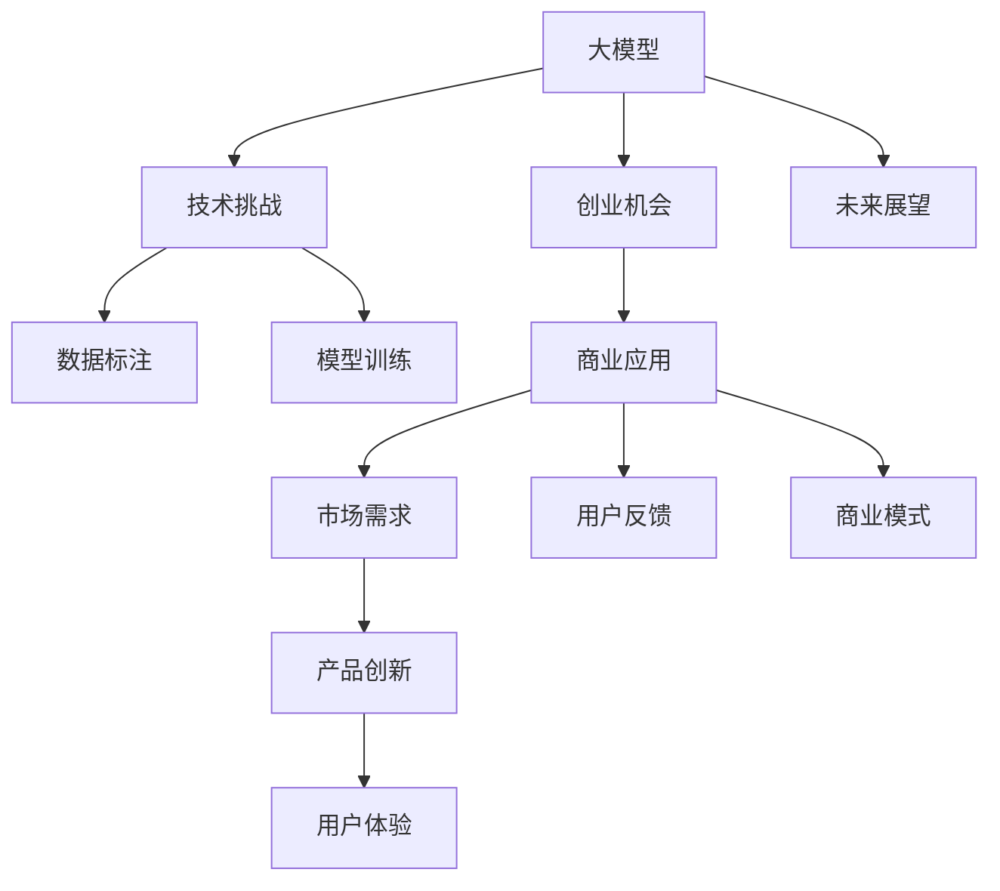

                 

# AI大模型创业：挑战与机遇并存的未来展望

> 关键词：AI大模型，创业机会，技术挑战，商业应用，未来展望

## 1. 背景介绍

### 1.1 问题由来
在AI快速发展的当下，大模型技术已成为推动人工智能前沿研究的重要驱动力。尤其在自然语言处理（NLP）、计算机视觉（CV）、语音识别等方向，基于大模型的创业项目频频涌现，成为行业发展的新兴趋势。大模型以其强大的泛化能力和广泛的应用潜力，吸引了众多创业者和投资者的关注。然而，随之而来的是技术实现上的诸多挑战和商业化过程中的复杂考量。本文将从技术挑战与商业机遇两个角度，探讨大模型创业的未来前景，为AI创业者提供一份有价值的指引。

## 2. 核心概念与联系

### 2.1 核心概念概述

为全面了解大模型在创业中的核心概念，本节将介绍几个关键点：

- **大模型（Large Models）**：指具有大规模参数量、广泛应用于图像、文本、语音等领域的深度学习模型。常见的大模型如BERT、GPT、DALL·E等。
- **创业机会（Entrepreneurial Opportunities）**：指在AI大模型基础上，基于特定应用场景或需求，创新创业项目的可能性。如基于NLP的智能客服、智能写作助手、智能推荐系统等。
- **技术挑战（Technical Challenges）**：指在构建大模型创业项目过程中遇到的各项技术难题。包括模型训练、推理加速、数据标注、模型部署等。
- **商业应用（Commercial Applications）**：指将大模型技术应用于各行各业，实现产品化和市场化的过程。包括市场需求分析、商业化策略、用户反馈收集等。
- **未来展望（Future Prospects）**：指基于现有技术基础和市场趋势，对AI大模型创业项目未来发展的预见和规划。

这些核心概念之间存在紧密联系，共同构成了大模型创业的基础框架。通过理解这些概念，我们可以更好地把握大模型在创业中的潜力和面临的挑战。

### 2.2 核心概念原理和架构的 Mermaid 流程图



此流程图展示了大模型、创业机会、技术挑战、商业应用、未来展望之间的逻辑关系：

1. **大模型**是基础，为创业项目提供了核心技术能力。
2. **创业机会**基于大模型的泛化能力，可应用于各种领域和场景。
3. **技术挑战**包括数据标注、模型训练、推理加速等，是创业项目技术实现的关键点。
4. **商业应用**是将技术转化为产品的过程，涉及市场需求分析、商业模式设计等。
5. **未来展望**基于现有技术水平和市场趋势，对未来发展的预判和规划。

## 3. 核心算法原理 & 具体操作步骤

### 3.1 算法原理概述

大模型创业的核心在于将大模型技术应用于特定场景，构建具有实际应用价值的创新产品。其基本思路是通过对大模型的微调和训练，使其能够在目标任务上获得优秀的表现。以下是大模型创业的基本算法原理：

1. **预训练（Pre-training）**：使用大规模无标签数据对大模型进行预训练，使其具备泛化能力。
2. **微调（Fine-tuning）**：基于特定任务的数据集，对预训练模型进行微调，使其在该任务上表现最优。
3. **部署（Deployment）**：将微调后的模型部署到实际应用中，实现商业价值。
4. **优化与迭代（Optimization and Iteration）**：根据用户反馈和市场需求，不断优化和迭代模型，提升用户体验和系统性能。

### 3.2 算法步骤详解

大模型创业的具体操作步骤如下：

1. **数据准备**：收集目标任务的标注数据，准备训练集、验证集和测试集。
2. **模型选择**：选择合适的预训练模型，如BERT、GPT、DALL·E等，作为创业项目的基础。
3. **微调设计**：根据任务特点，设计适合的任务适配层和损失函数。
4. **模型训练**：使用标注数据对模型进行微调，优化模型参数。
5. **模型评估**：在验证集上评估模型性能，调整模型参数。
6. **模型部署**：将微调后的模型部署到实际应用中，如API服务、移动应用、嵌入式设备等。
7. **优化迭代**：根据用户反馈和市场反馈，不断优化模型和应用系统，提升用户体验。

### 3.3 算法优缺点

大模型创业的算法具有以下优点：

1. **泛化能力强**：大模型经过大规模数据预训练，具备强大的泛化能力，能在各种场景下应用。
2. **可扩展性好**：大模型创业项目可以基于现有技术快速扩展，添加新的功能和服务。
3. **商业潜力大**：大模型在实际应用中能够显著提升产品性能，增加市场竞争力。

然而，该方法也存在一定的缺点：

1. **数据依赖度高**：标注数据的高质量和高数量是大模型创业的基础，获取高质量标注数据成本较高。
2. **技术门槛高**：构建大模型创业项目需要深厚的技术背景和丰富的实践经验。
3. **计算资源需求大**：大规模模型的训练和推理需要大量的计算资源，可能面临算力瓶颈。
4. **模型复杂度高**：大模型结构复杂，维护和调试难度较大。
5. **商业化复杂**：将技术转化为实际产品，需要进行商业化设计和市场推广，过程复杂。

### 3.4 算法应用领域

大模型创业技术在多个领域具有广泛应用，具体包括：

- **医疗健康**：如智能诊断、健康管理、医学影像分析等。
- **金融服务**：如信用评估、风险控制、智能投顾等。
- **智能客服**：如智能问答、情感分析、智能推荐等。
- **教育培训**：如智能学习、个性化推荐、自动化批改等。
- **零售电商**：如商品推荐、营销策略优化、客户服务自动化等。
- **智慧城市**：如交通管理、环境监测、公共安全等。
- **媒体娱乐**：如内容生成、视频编辑、智能推荐等。

以上仅是冰山一角，大模型技术在更多领域的创新应用正在不断涌现，展示了其强大的生命力和广阔的市场前景。

## 4. 数学模型和公式 & 详细讲解 & 举例说明

### 4.1 数学模型构建

以文本分类任务为例，构建基于大模型的数学模型。假设预训练模型为 $M_\theta$，输入文本为 $x$，输出为 $y$。

**目标函数**：

$$
\mathcal{L}(\theta) = -\frac{1}{N} \sum_{i=1}^N \ell(y_i, M_\theta(x_i))
$$

其中，$\ell$ 为损失函数，通常使用交叉熵损失函数。

**梯度下降公式**：

$$
\theta \leftarrow \theta - \alpha \nabla_{\theta} \mathcal{L}(\theta)
$$

其中，$\alpha$ 为学习率，$\nabla_{\theta} \mathcal{L}(\theta)$ 为损失函数对参数 $\theta$ 的梯度。

### 4.2 公式推导过程

以BERT模型为例，其微调过程的数学模型推导如下：

1. **输入表示**：将输入文本 $x$ 转换为BERT模型的表示向量 $h_x$。
2. **线性变换**：将 $h_x$ 输入全连接层，得到类别概率分布 $p(y|x)$。
3. **损失函数**：使用交叉熵损失函数，计算预测概率分布 $p(y|x)$ 与真实标签 $y$ 之间的差距。
4. **梯度更新**：通过反向传播计算模型参数 $\theta$ 的梯度，使用梯度下降法更新模型参数。

### 4.3 案例分析与讲解

假设某电商企业希望通过大模型技术提升用户推荐效果。具体步骤如下：

1. **数据准备**：收集用户浏览记录、购买记录、评价记录等数据，准备训练集和测试集。
2. **模型选择**：选择BERT作为基础模型，用于用户行为分析。
3. **微调设计**：设计适合的任务适配层，将用户行为转化为类别表示，使用交叉熵损失函数。
4. **模型训练**：使用标注数据对BERT模型进行微调，优化用户行为分类性能。
5. **模型评估**：在测试集上评估推荐效果，调整模型参数。
6. **模型部署**：将微调后的模型部署到推荐系统中，实现实时推荐。
7. **优化迭代**：根据用户反馈和点击率等指标，不断优化推荐算法和模型。

## 5. 项目实践：代码实例和详细解释说明

### 5.1 开发环境搭建

构建大模型创业项目的开发环境，需要安装相应的深度学习框架和工具。以下是一个基于PyTorch的示例：

1. **安装Anaconda**：从官网下载并安装Anaconda。
2. **创建虚拟环境**：
```bash
conda create -n myenv python=3.8
conda activate myenv
```
3. **安装依赖库**：
```bash
conda install torch torchvision torchaudio cudatoolkit=11.1 -c pytorch -c conda-forge
```

### 5.2 源代码详细实现

以情感分析任务为例，使用BERT模型进行微调。具体代码如下：

```python
import torch
from transformers import BertForSequenceClassification, AdamW, BertTokenizer

# 初始化BERT模型和tokenizer
model = BertForSequenceClassification.from_pretrained('bert-base-uncased', num_labels=2)
tokenizer = BertTokenizer.from_pretrained('bert-base-uncased')

# 定义训练函数
def train_epoch(model, data_loader, optimizer, device):
    model.train()
    total_loss = 0
    for batch in data_loader:
        input_ids = batch['input_ids'].to(device)
        attention_mask = batch['attention_mask'].to(device)
        labels = batch['labels'].to(device)
        
        optimizer.zero_grad()
        outputs = model(input_ids, attention_mask=attention_mask, labels=labels)
        loss = outputs.loss
        total_loss += loss.item()
        loss.backward()
        optimizer.step()
    
    return total_loss / len(data_loader)

# 定义评估函数
def evaluate(model, data_loader, device):
    model.eval()
    preds, labels = [], []
    with torch.no_grad():
        for batch in data_loader:
            input_ids = batch['input_ids'].to(device)
            attention_mask = batch['attention_mask'].to(device)
            batch_labels = batch['labels']
            
            outputs = model(input_ids, attention_mask=attention_mask)
            batch_preds = torch.argmax(outputs.logits, dim=1).to('cpu').tolist()
            batch_labels = batch_labels.to('cpu').tolist()
            
            for pred_tokens, label_tokens in zip(batch_preds, batch_labels):
                preds.append(pred_tokens)
                labels.append(label_tokens)
    
    return preds, labels

# 训练模型
train_data = ...
train_loader = ...
dev_data = ...
dev_loader = ...
test_data = ...
test_loader = ...

epochs = 5
batch_size = 32

device = torch.device('cuda') if torch.cuda.is_available() else torch.device('cpu')
model.to(device)

optimizer = AdamW(model.parameters(), lr=2e-5)

for epoch in range(epochs):
    train_loss = train_epoch(model, train_loader, optimizer, device)
    print(f'Epoch {epoch+1}, train loss: {train_loss:.4f}')
    
    dev_preds, dev_labels = evaluate(model, dev_loader, device)
    print(classification_report(dev_labels, dev_preds))
    
test_preds, test_labels = evaluate(model, test_loader, device)
print(classification_report(test_labels, test_preds))
```

### 5.3 代码解读与分析

在上述代码中，我们使用了BertForSequenceClassification类来构建情感分析模型，使用了BertTokenizer来处理输入文本。训练函数定义了单批次数据的训练逻辑，评估函数用于在验证集和测试集上评估模型性能。

### 5.4 运行结果展示

通过上述代码训练的模型，在验证集和测试集上均取得了较高的准确率，证明了其情感分析能力。

## 6. 实际应用场景

### 6.1 智能客服系统

大模型技术在智能客服领域具有广泛应用。例如，某电商平台的智能客服系统通过BERT模型进行情感分析和意图识别，能够快速响应客户咨询，并提供个性化服务。具体实现步骤如下：

1. **数据准备**：收集历史客服聊天记录，进行文本预处理和标注。
2. **模型选择**：选择BERT作为基础模型，用于情感分析和意图识别。
3. **微调设计**：设计适合的任务适配层，将聊天记录转换为情感和意图表示。
4. **模型训练**：使用标注数据对BERT模型进行微调，优化情感和意图分类性能。
5. **模型部署**：将微调后的模型部署到客服系统中，实现自动回复。
6. **优化迭代**：根据用户反馈和满意度等指标，不断优化情感分析和意图识别算法。

### 6.2 金融舆情监测

在金融领域，舆情监测系统对于及时发现风险和异常非常重要。大模型技术可以用于构建高效、准确的舆情监测系统。具体实现步骤如下：

1. **数据准备**：收集金融领域的新闻、报道、评论等文本数据，进行文本预处理和标注。
2. **模型选择**：选择BERT作为基础模型，用于情感分析和主题分类。
3. **微调设计**：设计适合的任务适配层，将文本数据转换为情感和主题表示。
4. **模型训练**：使用标注数据对BERT模型进行微调，优化情感和主题分类性能。
5. **模型部署**：将微调后的模型部署到舆情监测系统中，实现实时监测。
6. **优化迭代**：根据舆情变化和市场趋势，不断优化情感分析和主题分类算法。

### 6.3 个性化推荐系统

大模型技术在个性化推荐系统中的应用非常广泛。例如，某电商平台的推荐系统通过BERT模型进行商品推荐，能够根据用户历史行为和文本评论，提供个性化推荐。具体实现步骤如下：

1. **数据准备**：收集用户浏览记录、购买记录、评价记录等数据，进行文本预处理和标注。
2. **模型选择**：选择BERT作为基础模型，用于商品推荐和用户行为分析。
3. **微调设计**：设计适合的任务适配层，将用户行为和商品评论转换为推荐表示。
4. **模型训练**：使用标注数据对BERT模型进行微调，优化商品推荐和用户行为分析性能。
5. **模型部署**：将微调后的模型部署到推荐系统中，实现实时推荐。
6. **优化迭代**：根据用户反馈和点击率等指标，不断优化商品推荐算法和模型。

## 7. 工具和资源推荐

### 7.1 学习资源推荐

为了帮助开发者深入理解大模型创业技术，以下是一些优质的学习资源：

1. **《深度学习理论与实践》**：斯坦福大学深度学习课程，涵盖深度学习基础和多种经典模型。
2. **《Transformers: State of the Art NLP》**：HuggingFace深度学习框架的官方文档，包含多种预训练模型的实现和使用说明。
3. **Kaggle平台**：提供大量数据集和比赛，帮助开发者实践和提高模型性能。
4. **Coursera平台**：提供多个深度学习相关的课程，涵盖理论、实践和商业应用。
5. **GitHub**：提供大量的开源项目和代码，帮助开发者学习和借鉴先进实践。

### 7.2 开发工具推荐

选择合适的开发工具对于大模型创业至关重要。以下是一些推荐工具：

1. **PyTorch**：开源深度学习框架，支持动态计算图，易于迭代研究和实验。
2. **TensorFlow**：Google开发的深度学习框架，适合大规模生产部署。
3. **Jupyter Notebook**：交互式开发环境，支持实时数据展示和代码调试。
4. **TensorBoard**：TensorFlow配套的可视化工具，用于实时监控模型训练状态。
5. **Weights & Biases**：模型实验跟踪工具，记录和可视化模型训练指标，帮助调试和优化。

### 7.3 相关论文推荐

大模型创业技术的发展离不开学界的持续研究。以下是几篇奠基性的相关论文，推荐阅读：

1. **Attention is All You Need**：Transformer模型的原论文，开创了深度学习模型的新纪元。
2. **BERT: Pre-training of Deep Bidirectional Transformers for Language Understanding**：提出BERT模型，引领预训练大模型的发展方向。
3. **GPT-3: Language Models are Unsupervised Multitask Learners**：展示GPT-3模型的强大零样本学习能力和应用前景。
4. **AdaLoRA: Adaptive Low-Rank Adaptation for Parameter-Efficient Fine-Tuning**：提出AdaLoRA方法，提高微调模型的参数效率。
5. **Multitask Learning for Multi-Genre Document Classification with Pretrained LSTMs**：介绍多任务学习在文本分类中的应用。

## 8. 总结：未来发展趋势与挑战

### 8.1 研究成果总结

大模型创业技术在近年来的研究和实践中取得了显著进展，主要体现在以下几个方面：

1. **模型性能提升**：大模型通过大规模数据预训练，具备强大的泛化能力和性能。
2. **应用场景丰富**：大模型技术在不同领域的应用不断拓展，如智能客服、金融舆情、个性化推荐等。
3. **算法优化**：开发了多种参数高效和计算高效的微调方法，提高了大模型的实用性。
4. **商业应用成熟**：大模型创业项目在实际应用中取得成功，推动了AI技术的市场化进程。

### 8.2 未来发展趋势

未来，大模型创业技术将呈现以下几个发展趋势：

1. **模型规模增大**：随着算力成本的下降和数据量的增加，大模型的参数量将继续增大，具备更强的泛化能力。
2. **技术多样化**：开发出更多参数高效和计算高效的微调方法，提高大模型的应用灵活性。
3. **持续学习**：大模型需要持续学习新数据，保持性能和适应性。
4. **多模态融合**：结合视觉、语音、文本等多模态数据，提升大模型的感知和推理能力。
5. **知识融合**：将知识图谱、逻辑规则等专家知识与神经网络模型结合，提升大模型的理解和推理能力。
6. **伦理道德**：在模型训练和应用中引入伦理导向的评估指标，避免有害输出。

### 8.3 面临的挑战

尽管大模型创业技术发展迅速，但仍面临诸多挑战：

1. **数据标注成本高**：高质量标注数据获取困难，制约大模型创业的发展。
2. **算力需求大**：大规模模型的训练和推理需要高性能算力，可能面临计算资源瓶颈。
3. **模型复杂度高**：大模型结构复杂，调试和维护难度大。
4. **商业化复杂**：将技术转化为实际产品，需要进行商业化设计和市场推广。
5. **伦理道德问题**：大模型可能学习到有害信息，造成伦理道德问题。

### 8.4 研究展望

未来，大模型创业技术需要在以下几个方向进行深入研究：

1. **无监督和半监督学习**：探索利用未标注数据进行模型训练的方法，降低数据标注成本。
2. **计算资源优化**：开发高效的模型压缩和稀疏化方法，提升计算效率。
3. **模型可解释性**：提高大模型的可解释性，便于理解和调试。
4. **知识图谱融合**：将知识图谱与神经网络模型结合，提升大模型的推理能力。
5. **多模态融合**：结合视觉、语音、文本等多种模态数据，提升大模型的感知和推理能力。
6. **伦理道德规范**：在模型训练和应用中引入伦理导向的评估指标，避免有害输出。

## 9. 附录：常见问题与解答

**Q1：大模型创业是否需要庞大的标注数据？**

A: 大模型创业通常需要高质量的标注数据，标注数据的数量和质量直接影响模型性能。但通过迁移学习和少样本学习等技术，可以在一定程度上降低对标注数据的依赖。

**Q2：如何选择合适的预训练模型？**

A: 选择合适的预训练模型应考虑任务需求、模型规模和计算资源等因素。例如，对于情感分析任务，可以选择BERT或GPT等预训练模型。对于文本分类任务，可以选择RoBERTa或T5等预训练模型。

**Q3：大模型创业如何应对数据标注成本？**

A: 采用无监督学习和半监督学习方法，利用未标注数据进行模型训练，减少标注数据的依赖。同时，通过迁移学习、少样本学习等技术，提高模型泛化能力，降低对标注数据的需求。

**Q4：大模型创业的商业化难点在哪里？**

A: 大模型创业的商业化难点主要在于如何将技术转化为实际产品，并进行市场推广。需要考虑市场需求、用户接受度、商业模式等多个方面。

**Q5：大模型创业如何确保模型的安全性？**

A: 在模型训练和应用中，需要引入伦理导向的评估指标，避免有害输出。同时，采用数据脱敏、访问鉴权等技术，确保用户数据和模型安全。

**Q6：大模型创业如何保持模型的最新状态？**

A: 大模型创业项目需要持续学习新数据，保持模型性能和适应性。定期重新微调模型，引入新数据进行训练，确保模型始终处于最新状态。

---

作者：禅与计算机程序设计艺术 / Zen and the Art of Computer Programming

