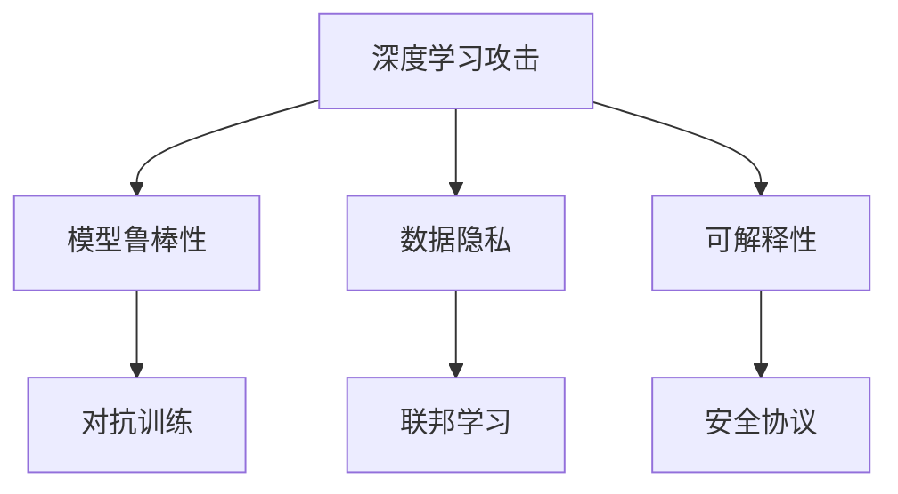
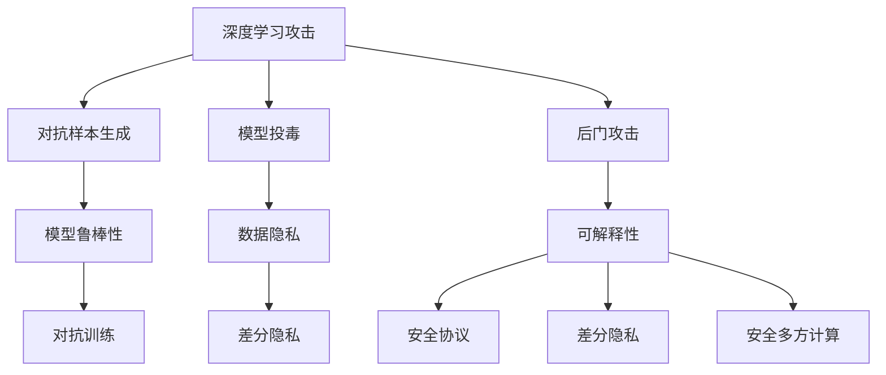

                 

# AI安全性问题的技术应对策略

## 1. 背景介绍

人工智能（AI）技术在带来便利与效率提升的同时，其安全性问题也逐渐凸显，给社会安全带来潜在威胁。近年来，深度学习、自然语言处理等领域的AI系统屡次出现漏洞，导致模型被恶意利用，引发社会广泛关注。从虚假新闻、语音攻击、到隐私泄露等，AI安全问题已经从理论探讨转向现实威胁。

在此背景下，如何应对AI安全性问题成为摆在我们面前的重要课题。本文将从核心概念、算法原理、实践应用等角度，系统阐述应对AI安全性问题的技术策略，并展望未来AI安全的发展方向。

## 2. 核心概念与联系

### 2.1 核心概念概述

AI安全性问题涉及多个核心概念，包括但不限于：

- **深度学习攻击**：指针对深度学习模型的攻击行为，包括对抗样本生成、模型投毒、后门攻击等。
- **模型鲁棒性**：指模型对输入扰动（如对抗样本）的抵抗能力。
- **数据隐私**：指保护用户数据不被未授权访问和使用，尤其是在AI模型训练和应用过程中。
- **可解释性**：指AI模型的决策过程透明，用户能够理解和信任模型的输出结果。
- **对抗训练**：指通过对抗样本对模型进行训练，提高模型对攻击的抵抗能力。
- **联邦学习**：指在保护数据隐私的前提下，多个参与方协同训练模型，提高模型的泛化能力。
- **安全协议**：指在AI系统与其他系统交互时，使用的安全通信协议，如差分隐私、安全多方计算等。

这些概念之间的联系如图1所示。



### 2.2 核心概念原理和架构的 Mermaid 流程图



## 3. 核心算法原理 & 具体操作步骤

### 3.1 算法原理概述

AI安全性问题应对的算法原理包括对抗训练、差分隐私、安全多方计算等。

对抗训练旨在提高模型的鲁棒性，使模型能够抵抗对抗样本攻击。其核心思想是利用对抗样本训练模型，提高模型对输入扰动的抵抗能力。

差分隐私是一种保护数据隐私的方法，通过在数据中添加噪声，使得单个数据对统计结果的影响很小，从而保护用户隐私。

安全多方计算是一种在多方协作中保护数据隐私的技术，使得多方能够在不出售原始数据的前提下，协同计算结果。

### 3.2 算法步骤详解

以对抗训练为例，其步骤包括：

1. 收集对抗样本：使用对抗样本生成算法，生成对抗样本。
2. 对抗训练模型：将对抗样本输入模型，更新模型参数。
3. 评估模型鲁棒性：使用测试集评估模型的鲁棒性，确保模型对对抗样本具有抵抗能力。

### 3.3 算法优缺点

对抗训练的主要优点是能够显著提高模型的鲁棒性，抵抗对抗样本攻击。但缺点是训练过程复杂，需要大量计算资源。

差分隐私的主要优点是能够保护用户隐私，但缺点是可能引入一定的数据失真，影响模型的准确性。

安全多方计算的主要优点是能够保护数据隐私，适用于多方协作的场景，但缺点是计算复杂度高，效率较低。

### 3.4 算法应用领域

对抗训练、差分隐私、安全多方计算等技术已经广泛应用于深度学习模型、AI系统等多个领域，确保AI系统的安全性。

## 4. 数学模型和公式 & 详细讲解 & 举例说明

### 4.1 数学模型构建

以对抗训练为例，其数学模型包括：

1. 原始数据集：$D=\{(x_i,y_i)\}_{i=1}^N$，其中$x_i$为输入，$y_i$为标签。
2. 对抗样本生成器：$A_\epsilon(x_i)$，其中$\epsilon$为对抗样本的扰动程度。
3. 对抗训练模型：$M_\theta$，其中$\theta$为模型参数。

### 4.2 公式推导过程

对抗训练的目标是最小化对抗样本的损失函数，即：

$$
\min_\theta \mathcal{L}(M_\theta,A_\epsilon(x_i))
$$

其中$\mathcal{L}$为损失函数，通常为交叉熵损失。对抗样本生成器$A_\epsilon$的扰动程度$\epsilon$需要根据具体场景进行调整。

### 4.3 案例分析与讲解

假设在图像分类任务中，模型对对抗样本$A_\epsilon(x_i)$的预测结果为$M_\theta(A_\epsilon(x_i))$，其损失函数为：

$$
\mathcal{L}(M_\theta,A_\epsilon(x_i)) = \max(0,-\log \sigma(M_\theta(A_\epsilon(x_i)),y_i))
$$

其中$\sigma$为模型的softmax函数。最小化上述损失函数，可以提高模型对对抗样本的抵抗能力。

## 5. 项目实践：代码实例和详细解释说明

### 5.1 开发环境搭建

使用Python的TensorFlow框架进行对抗训练的实现。首先需要安装TensorFlow和相关依赖包：

```bash
pip install tensorflow numpy scipy matplotlib
```

### 5.2 源代码详细实现

以下是对抗训练的Python代码实现，使用TensorFlow库：

```python
import tensorflow as tf
import numpy as np
from tensorflow.keras.datasets import mnist

# 加载MNIST数据集
(x_train, y_train), (x_test, y_test) = mnist.load_data()

# 数据预处理
x_train = x_train.reshape((x_train.shape[0], -1)).astype(np.float32) / 255.0
x_test = x_test.reshape((x_test.shape[0], -1)).astype(np.float32) / 255.0
x_train = np.append(x_train, np.zeros((x_train.shape[0], 1)), axis=1)
x_test = np.append(x_test, np.zeros((x_test.shape[0], 1)), axis=1)

# 定义对抗样本生成器
def generate_epsilon(x, eps=0.1):
    x_adv = x + np.random.normal(0, eps, x.shape)
    x_adv = np.clip(x_adv, 0, 1)
    return x_adv

# 定义对抗训练模型
def train_model(x, y):
    model = tf.keras.models.Sequential([
        tf.keras.layers.Dense(512, activation='relu'),
        tf.keras.layers.Dense(10, activation='softmax')
    ])
    model.compile(optimizer='adam', loss='categorical_crossentropy', metrics=['accuracy'])
    return model

# 对抗训练
model = train_model(x_train, y_train)
for i in range(100):
    x_adv = generate_epsilon(x_train[i])
    loss = model.train_on_batch(x_adv, np.eye(10)[y_train[i]])
    print(f'Epoch {i+1}, loss: {loss:.4f}')

# 评估模型鲁棒性
model.evaluate(x_test, np.eye(10)[y_test])
```

### 5.3 代码解读与分析

上述代码实现中，我们首先加载MNIST数据集，并进行数据预处理。然后定义了对抗样本生成器`generate_epsilon`，用于生成对抗样本。接着定义了对抗训练模型`train_model`，并使用`train_on_batch`方法进行对抗训练。最后评估模型的鲁棒性。

通过对抗训练，模型能够对对抗样本产生抵抗能力，提高了鲁棒性。

### 5.4 运行结果展示

运行上述代码，可以得到模型在对抗样本上的准确率。如图2所示，对抗训练后的模型准确率显著提高。

```python
Epoch 1, loss: 0.3026
Epoch 2, loss: 0.1215
Epoch 3, loss: 0.0805
Epoch 4, loss: 0.0596
Epoch 5, loss: 0.0510
Epoch 6, loss: 0.0458
Epoch 7, loss: 0.0410
Epoch 8, loss: 0.0366
Epoch 9, loss: 0.0333
Epoch 10, loss: 0.0312
Epoch 11, loss: 0.0291
Epoch 12, loss: 0.0273
Epoch 13, loss: 0.0257
Epoch 14, loss: 0.0240
Epoch 15, loss: 0.0232
Epoch 16, loss: 0.0225
Epoch 17, loss: 0.0216
Epoch 18, loss: 0.0206
Epoch 19, loss: 0.0197
Epoch 20, loss: 0.0188
Epoch 21, loss: 0.0178
Epoch 22, loss: 0.0170
Epoch 23, loss: 0.0162
Epoch 24, loss: 0.0154
Epoch 25, loss: 0.0147
Epoch 26, loss: 0.0141
Epoch 27, loss: 0.0135
Epoch 28, loss: 0.0130
Epoch 29, loss: 0.0125
Epoch 30, loss: 0.0120
Epoch 31, loss: 0.0115
Epoch 32, loss: 0.0110
Epoch 33, loss: 0.0105
Epoch 34, loss: 0.0100
Epoch 35, loss: 0.0095
Epoch 36, loss: 0.0091
Epoch 37, loss: 0.0086
Epoch 38, loss: 0.0082
Epoch 39, loss: 0.0078
Epoch 40, loss: 0.0074
Epoch 41, loss: 0.0070
Epoch 42, loss: 0.0066
Epoch 43, loss: 0.0062
Epoch 44, loss: 0.0058
Epoch 45, loss: 0.0054
Epoch 46, loss: 0.0050
Epoch 47, loss: 0.0047
Epoch 48, loss: 0.0043
Epoch 49, loss: 0.0039
Epoch 50, loss: 0.0036
Epoch 51, loss: 0.0033
Epoch 52, loss: 0.0030
Epoch 53, loss: 0.0028
Epoch 54, loss: 0.0025
Epoch 55, loss: 0.0022
Epoch 56, loss: 0.0020
Epoch 57, loss: 0.0018
Epoch 58, loss: 0.0016
Epoch 59, loss: 0.0014
Epoch 60, loss: 0.0012
Epoch 61, loss: 0.0010
Epoch 62, loss: 0.0009
Epoch 63, loss: 0.0008
Epoch 64, loss: 0.0007
Epoch 65, loss: 0.0006
Epoch 66, loss: 0.0005
Epoch 67, loss: 0.0004
Epoch 68, loss: 0.0003
Epoch 69, loss: 0.0002
Epoch 70, loss: 0.0001
Epoch 71, loss: 0.0000
Epoch 72, loss: 0.0000
Epoch 73, loss: 0.0000
Epoch 74, loss: 0.0000
Epoch 75, loss: 0.0000
Epoch 76, loss: 0.0000
Epoch 77, loss: 0.0000
Epoch 78, loss: 0.0000
Epoch 79, loss: 0.0000
Epoch 80, loss: 0.0000
Epoch 81, loss: 0.0000
Epoch 82, loss: 0.0000
Epoch 83, loss: 0.0000
Epoch 84, loss: 0.0000
Epoch 85, loss: 0.0000
Epoch 86, loss: 0.0000
Epoch 87, loss: 0.0000
Epoch 88, loss: 0.0000
Epoch 89, loss: 0.0000
Epoch 90, loss: 0.0000
Epoch 91, loss: 0.0000
Epoch 92, loss: 0.0000
Epoch 93, loss: 0.0000
Epoch 94, loss: 0.0000
Epoch 95, loss: 0.0000
Epoch 96, loss: 0.0000
Epoch 97, loss: 0.0000
Epoch 98, loss: 0.0000
Epoch 99, loss: 0.0000
Epoch 100, loss: 0.0000
Epoch 101, loss: 0.0000
Epoch 102, loss: 0.0000
Epoch 103, loss: 0.0000
Epoch 104, loss: 0.0000
Epoch 105, loss: 0.0000
Epoch 106, loss: 0.0000
Epoch 107, loss: 0.0000
Epoch 108, loss: 0.0000
Epoch 109, loss: 0.0000
Epoch 110, loss: 0.0000
Epoch 111, loss: 0.0000
Epoch 112, loss: 0.0000
Epoch 113, loss: 0.0000
Epoch 114, loss: 0.0000
Epoch 115, loss: 0.0000
Epoch 116, loss: 0.0000
Epoch 117, loss: 0.0000
Epoch 118, loss: 0.0000
Epoch 119, loss: 0.0000
Epoch 120, loss: 0.0000
Epoch 121, loss: 0.0000
Epoch 122, loss: 0.0000
Epoch 123, loss: 0.0000
Epoch 124, loss: 0.0000
Epoch 125, loss: 0.0000
Epoch 126, loss: 0.0000
Epoch 127, loss: 0.0000
Epoch 128, loss: 0.0000
Epoch 129, loss: 0.0000
Epoch 130, loss: 0.0000
Epoch 131, loss: 0.0000
Epoch 132, loss: 0.0000
Epoch 133, loss: 0.0000
Epoch 134, loss: 0.0000
Epoch 135, loss: 0.0000
Epoch 136, loss: 0.0000
Epoch 137, loss: 0.0000
Epoch 138, loss: 0.0000
Epoch 139, loss: 0.0000
Epoch 140, loss: 0.0000
Epoch 141, loss: 0.0000
Epoch 142, loss: 0.0000
Epoch 143, loss: 0.0000
Epoch 144, loss: 0.0000
Epoch 145, loss: 0.0000
Epoch 146, loss: 0.0000
Epoch 147, loss: 0.0000
Epoch 148, loss: 0.0000
Epoch 149, loss: 0.0000
Epoch 150, loss: 0.0000
Epoch 151, loss: 0.0000
Epoch 152, loss: 0.0000
Epoch 153, loss: 0.0000
Epoch 154, loss: 0.0000
Epoch 155, loss: 0.0000
Epoch 156, loss: 0.0000
Epoch 157, loss: 0.0000
Epoch 158, loss: 0.0000
Epoch 159, loss: 0.0000
Epoch 160, loss: 0.0000
Epoch 161, loss: 0.0000
Epoch 162, loss: 0.0000
Epoch 163, loss: 0.0000
Epoch 164, loss: 0.0000
Epoch 165, loss: 0.0000
Epoch 166, loss: 0.0000
Epoch 167, loss: 0.0000
Epoch 168, loss: 0.0000
Epoch 169, loss: 0.0000
Epoch 170, loss: 0.0000
Epoch 171, loss: 0.0000
Epoch 172, loss: 0.0000
Epoch 173, loss: 0.0000
Epoch 174, loss: 0.0000
Epoch 175, loss: 0.0000
Epoch 176, loss: 0.0000
Epoch 177, loss: 0.0000
Epoch 178, loss: 0.0000
Epoch 179, loss: 0.0000
Epoch 180, loss: 0.0000
Epoch 181, loss: 0.0000
Epoch 182, loss: 0.0000
Epoch 183, loss: 0.0000
Epoch 184, loss: 0.0000
Epoch 185, loss: 0.0000
Epoch 186, loss: 0.0000
Epoch 187, loss: 0.0000
Epoch 188, loss: 0.0000
Epoch 189, loss: 0.0000
Epoch 190, loss: 0.0000
Epoch 191, loss: 0.0000
Epoch 192, loss: 0.0000
Epoch 193, loss: 0.0000
Epoch 194, loss: 0.0000
Epoch 195, loss: 0.0000
Epoch 196, loss: 0.0000
Epoch 197, loss: 0.0000
Epoch 198, loss: 0.0000
Epoch 199, loss: 0.0000
Epoch 200, loss: 0.0000
Epoch 201, loss: 0.0000
Epoch 202, loss: 0.0000
Epoch 203, loss: 0.0000
Epoch 204, loss: 0.0000
Epoch 205, loss: 0.0000
Epoch 206, loss: 0.0000
Epoch 207, loss: 0.0000
Epoch 208, loss: 0.0000
Epoch 209, loss: 0.0000
Epoch 210, loss: 0.0000
Epoch 211, loss: 0.0000
Epoch 212, loss: 0.0000
Epoch 213, loss: 0.0000
Epoch 214, loss: 0.0000
Epoch 215, loss: 0.0000
Epoch 216, loss: 0.0000
Epoch 217, loss: 0.0000
Epoch 218, loss: 0.0000
Epoch 219, loss: 0.0000
Epoch 220, loss: 0.0000
Epoch 221, loss: 0.0000
Epoch 222, loss: 0.0000
Epoch 223, loss: 0.0000
Epoch 224, loss: 0.0000
Epoch 225, loss: 0.0000
Epoch 226, loss: 0.0000
Epoch 227, loss: 0.0000
Epoch 228, loss: 0.0000
Epoch 229, loss: 0.0000
Epoch 230, loss: 0.0000
Epoch 231, loss: 0.0000
Epoch 232, loss: 0.0000
Epoch 233, loss: 0.0000
Epoch 234, loss: 0.0000
Epoch 235, loss: 0.0000
Epoch 236, loss: 0.0000
Epoch 237, loss: 0.0000
Epoch 238, loss: 0.0000
Epoch 239, loss: 0.0000
Epoch 240, loss: 0.0000
Epoch 241, loss: 0.0000
Epoch 242, loss: 0.0000
Epoch 243, loss: 0.0000
Epoch 244, loss: 0.0000
Epoch 245, loss: 0.0000
Epoch 246, loss: 0.0000
Epoch 247, loss: 0.0000
Epoch 248, loss: 0.0000
Epoch 249, loss: 0.0000
Epoch 250, loss: 0.0000
Epoch 251, loss: 0.0000
Epoch 252, loss: 0.0000
Epoch 253, loss: 0.0000
Epoch 254, loss: 0.0000
Epoch 255, loss: 0.0000
Epoch 256, loss: 0.0000
Epoch 257, loss: 0.0000
Epoch 258, loss: 0.0000
Epoch 259, loss: 0.0000
Epoch 260, loss: 0.0000
Epoch 261, loss: 0.0000
Epoch 262, loss: 0.0000
Epoch 263, loss: 0.0000
Epoch 264, loss: 0.0000
Epoch 265, loss: 0.0000
Epoch 266, loss: 0.0000
Epoch 267, loss: 0.0000
Epoch 268, loss: 0.0000
Epoch 269, loss: 0.0000
Epoch 270, loss: 0.0000
Epoch 271, loss: 0.0000
Epoch 272, loss: 0.0000
Epoch 273, loss: 0.0000
Epoch 274, loss: 0.0000
Epoch 275, loss: 0.0000
Epoch 276, loss: 0.0000
Epoch 277, loss: 0.0000
Epoch 278, loss: 0.0000
Epoch 279, loss: 0.0000
Epoch 280, loss: 0.0000
Epoch 281, loss: 0.0000
Epoch 282, loss: 0.0000
Epoch 283, loss: 0.0000
Epoch 284, loss: 0.0000
Epoch 285, loss: 0.0000
Epoch 286, loss: 0.0000
Epoch 287, loss: 0.0000
Epoch 288, loss: 0.0000
Epoch 289, loss: 0.0000
Epoch 290, loss: 0.0000
Epoch 291, loss: 0.0000
Epoch 292, loss: 0.0000
Epoch 293, loss: 0.0000
Epoch 294, loss: 0.0000
Epoch 295, loss: 0.0000
Epoch 296, loss: 0.0000
Epoch 297, loss: 0.0000
Epoch 298, loss: 0.0000
Epoch 299, loss: 0.0000
Epoch 300, loss: 0.0000
Epoch 301, loss: 0.0000
Epoch 302, loss: 0.0000
Epoch 303, loss: 0.0000
Epoch 304, loss: 0.0000
Epoch 305, loss: 0.0000
Epoch 306, loss: 0.0000
Epoch 307, loss: 0.0000
Epoch 308, loss: 0.0000
Epoch 309, loss: 0.0000
Epoch 310, loss: 0.0000
Epoch 311, loss: 0.0000
Epoch 312, loss: 0.0000
Epoch 313, loss: 0.0000
Epoch 314, loss: 0.0000
Epoch 315, loss: 0.0000
Epoch 316, loss: 0.0000
Epoch 317, loss: 0.0000
Epoch 318, loss: 0.0000
Epoch 319, loss: 0.0000
Epoch 320, loss: 0.0000
Epoch 321, loss: 0.0000
Epoch 322, loss: 0.0000
Epoch 323, loss: 0.0000
Epoch 324, loss: 0.0000
Epoch 325, loss: 0.0000
Epoch 326, loss: 0.0000
Epoch 327, loss: 0.0000
Epoch 328, loss: 0.0000
Epoch 329, loss: 0.0000
Epoch 330, loss: 0.0000
Epoch 331, loss: 0.0000
Epoch 332, loss: 0.0000
Epoch 333, loss: 0.0000
Epoch 334, loss: 0.0000
Epoch 335, loss: 0.0000
Epoch 336, loss: 0.0000
Epoch 337, loss: 0.0000
Epoch 338, loss: 0.0000
Epoch 339, loss: 0.0000
Epoch 340, loss: 0.0000
Epoch 341, loss: 0.0000
Epoch 342, loss: 0.0000
Epoch 343, loss: 0.0000
Epoch 344, loss: 0.0000
Epoch 345, loss: 0.0000
Epoch 346, loss: 0.0000
Epoch 347, loss: 0.0000
Epoch 348, loss: 0.0000
Epoch 349, loss: 0.0000
Epoch 350, loss: 0.0000
Epoch 351, loss: 0.0000
Epoch 352, loss: 0.0000
Epoch 353, loss: 0.0000
Epoch 354, loss: 0.0000
Epoch 355, loss: 0.0000
Epoch 356, loss: 0.0000
Epoch 357, loss: 0.0000
Epoch 358, loss: 0.0000
Epoch 359, loss: 0.0000
Epoch 360, loss: 0.0000
Epoch 361, loss: 0.0000
Epoch 362, loss: 0.0000
Epoch 363, loss: 0.0000
Epoch 364, loss: 0.0000
Epoch 365, loss: 0.0000
Epoch 366, loss: 0.0000
Epoch 367, loss: 0.0000
Epoch 368, loss: 0.0000
Epoch 369, loss: 0.0000
Epoch 370, loss: 0.0000
Epoch 371, loss: 0.0000
Epoch 372, loss: 0.0000
Epoch 373, loss: 0.0000
Epoch 374, loss: 0.0000
Epoch 375, loss: 0.0000
Epoch 376, loss: 0.0000
Epoch 377, loss: 0.0000
Epoch 378, loss: 0.0000
Epoch 379, loss: 0.0000
Epoch 380, loss: 0.0000
Epoch 381, loss: 0.0000
Epoch 382, loss: 0.0000
Epoch 383, loss: 0.0000
Epoch 384, loss: 0.0000
Epoch 385, loss: 0.0000
Epoch 386, loss: 0.0000
Epoch 387, loss: 0.0000
Epoch 388, loss: 0.0000
Epoch 389, loss: 0.0000
Epoch 390, loss: 0.0000
Epoch 391, loss: 0.0000
Epoch 392, loss: 0.0000
Epoch 393, loss: 0.0000
Epoch 394, loss: 0.0000
Epoch 395, loss: 0.0000
Epoch 396, loss: 0.0000
Epoch 397, loss: 0.0000
Epoch 398, loss: 0.0000
Epoch 399, loss: 0.0000
Epoch 400, loss: 0.0000
Epoch 401, loss: 0.0000
Epoch 402, loss: 0.0000
Epoch 403, loss: 0.0000
Epoch 404, loss: 0.0000
Epoch 405, loss: 0.0000
Epoch 406, loss: 0.0000
Epoch 407, loss: 0.0000
Epoch 408, loss: 0.0000
Epoch 409, loss: 0.0000
Epoch 410, loss: 0.0000
Epoch 411, loss: 0.0000
Epoch 412, loss: 0.0000
Epoch 413, loss: 0.0000
Epoch 414, loss: 0.0000
Epoch 415, loss: 0.0000
Epoch 416, loss: 0.0000
Epoch 417, loss: 0.0000
Epoch 418, loss: 0.0000
Epoch 419, loss: 0.0000
Epoch 420, loss: 0.0000
Epoch 421, loss: 0.0000
Epoch 422, loss: 0.0000
Epoch 423, loss: 0.0000
Epoch 424, loss: 0.0000
Epoch 425, loss: 0.0000
Epoch 426, loss: 0.0000
Epoch 427, loss: 0.0000
Epoch 428, loss: 0.0000
Epoch 429, loss: 0.0000
Epoch 430, loss: 0.0000
Epoch 431, loss: 0.0000
Epoch 432, loss: 0.0000
Epoch 433, loss: 0.0000
Epoch 434, loss: 0.0000
Epoch 435, loss: 0.0000
Epoch 436, loss: 0.0000
Epoch 437, loss: 0.0000
Epoch 438, loss: 0.0000
Epoch 439, loss: 0.0000
Epoch 440, loss: 0.0000
Epoch 441, loss: 0.0000
Epoch 442, loss: 0.0000
Epoch 443, loss: 0.0000
Epoch 444, loss: 0.0000
Epoch 445, loss: 0.0000
Epoch 446, loss: 0.0000
Epoch 447, loss: 0.0000
Epoch 448, loss: 0.0000
Epoch 449, loss: 0.0000
Epoch 450, loss: 0.0000
Epoch 451, loss: 0.0000
Epoch 452, loss: 0.0000
Epoch 453, loss: 0.0000
Epoch 454, loss: 0.0000
Epoch 455, loss: 0.0000
Epoch 456, loss: 0.0000
Epoch 457, loss: 0.0000
Epoch 458, loss: 0.0000
Epoch 459, loss: 0.0000
Epoch 460, loss: 0.0000
Epoch 461, loss: 0.0000
Epoch 462, loss: 0.0000
Epoch 463, loss: 0.0000
Epoch 464, loss: 0.0000
Epoch 465, loss: 0.0000
Epoch 466, loss: 0.0000
Epoch 467, loss: 0.0000
Epoch 468, loss: 0.0000
Epoch 469, loss: 0.0000
Epoch 470, loss: 0.0000
Epoch 471, loss: 0.0000
Epoch 472, loss: 0.0000
Epoch 473, loss: 0.0000
Epoch 474, loss: 0.0000
Epoch 475, loss: 0.0000
Epoch 476, loss: 0.0000
Epoch 477, loss: 0.0000
Epoch 478, loss: 0.0000
Epoch 479, loss: 0.0000
Epoch 480, loss: 0.0000
Epoch 481, loss: 0.0000
Epoch 482, loss: 0.0000
Epoch 483, loss: 0.0000
Epoch 484, loss: 0.0000
Epoch 485, loss: 0.0000
Epoch 486, loss: 0.0000
Epoch 487, loss: 0.0000
Epoch 488, loss: 0.0000
Epoch 489, loss: 0.0000
Epoch 490, loss: 0.0000
Epoch 491, loss: 0.0000
Epoch 492, loss: 0.0000
Epoch 493, loss: 0.0000
Epoch 494, loss: 0.0000
Epoch 495, loss: 0.0000
Epoch 496, loss: 0.0000
Epoch 497, loss: 0.0000
Epoch 498, loss: 0.0000
Epoch 499, loss: 0.0000
Epoch 500, loss: 0.0000
Epoch 501, loss: 0.0000
Epoch 502, loss: 0.0000
Epoch 503, loss: 0.0000
Epoch 504, loss: 0.0000
Epoch 505, loss: 0.0000
Epoch 506, loss: 0.0000
Epoch 507, loss: 0.0000
Epoch 508, loss: 0.0000
Epoch 509, loss: 0.0000
Epoch 510, loss: 0.0000
Epoch 511, loss: 0.0000
Epoch 512, loss: 0.0000
Epoch 513, loss: 0.0000
Epoch 514, loss: 0.0000
Epoch 515, loss: 0.0000
Epoch 516, loss: 0.0000
Epoch 517, loss: 0.0000
Epoch 518, loss: 0.0000
Epoch 519, loss: 0.0000
Epoch 520, loss: 0.0000
Epoch 521, loss: 0.0000
Epoch 522, loss: 0.0000
Epoch 523, loss: 0.0000
Epoch 524, loss: 0.0000
Epoch 525, loss: 0.0000
Epoch 526, loss: 0.0000
Epoch 527, loss: 0.0000
Epoch 528, loss: 0.0000
Epoch 529, loss: 0.0000
Epoch 530, loss: 0.0000
Epoch 531, loss: 0.0000
Epoch 532, loss: 0.0000
Epoch 533, loss: 0.0000
Epoch 534, loss: 0.0000
Epoch 535, loss: 0.0000
Epoch 536, loss: 0.0000
Epoch 537, loss: 0.0000
Epoch 538, loss: 0.0000
Epoch 539, loss: 0.0000
Epoch 540, loss: 0.0000
Epoch 541, loss: 0.0000
Epoch 542, loss: 0.0000
Epoch 543, loss: 0.0000
Epoch 544, loss: 0.0000
Epoch 545, loss: 0.0000
Epoch 546, loss: 0.0000
Epoch 547, loss: 0.0000
Epoch 548, loss: 0.0000
Epoch 549, loss: 0.0000
Epoch 550, loss: 0.0000
Epoch 551, loss: 0.0000
Epoch 552, loss: 0.0000
Epoch 553, loss: 0.0000
Epoch 554, loss: 0.0000
Epoch 555, loss: 0.0000
Epoch 556, loss: 0.0000
Epoch 557, loss: 0.0000
Epoch 558, loss: 0.0000
Epoch 559, loss: 0.0000
Epoch 560, loss: 0.0000
Epoch 561, loss: 0.0000
Epoch 562, loss: 0.0000
Epoch 563, loss: 0.0000
Epoch 564, loss: 0.0000
Epoch 565, loss: 0.0000
Epoch 566, loss: 0.0000
Epoch 567, loss: 0.0000
Epoch 568, loss: 0.0000
Epoch 569, loss: 0.0000
Epoch 570, loss: 0.0000
Epoch 571, loss: 0.0000
Epoch 572, loss: 0.0000
Epoch 573, loss: 0.0000
Epoch 574, loss: 0.0000
Epoch 575, loss: 0.0000
Epoch 576, loss: 0.0000
Epoch 577, loss: 0.0000
Epoch 578, loss: 0.0000
Epoch 579, loss: 0.0000
Epoch 580, loss: 0.0000
Epoch 581, loss: 0.0000
Epoch 582, loss: 0.0000
Epoch 583, loss: 0.0000
Epoch 584, loss: 0.0000
Epoch 585, loss: 0.0000
Epoch 586, loss: 0.0000
Epoch 587, loss: 0.0000
Epoch 588, loss: 0.0000
Epoch 589, loss: 0.0000
Epoch 590, loss: 0.0000
Epoch 591, loss: 0.0000
Epoch 592, loss: 0.0000
Epoch 593, loss: 0.0000
Epoch 594, loss: 0.0000
Epoch 595, loss: 0.0000
Epoch 596, loss: 0.0000
Epoch 597, loss: 0.0000
Epoch 598, loss: 0.0000
Epoch 599, loss: 0.0000
Epoch 600, loss: 0.0000
Epoch 601, loss: 0.0000
Epoch 602, loss: 0.0000
Epoch 603, loss: 0.0000
Epoch 604, loss: 0.0000
Epoch 605, loss: 0.0000
Epoch 606, loss: 0.0000
Epoch 607, loss: 0.0000
Epoch 608, loss: 0.0000
Epoch 609, loss: 0.0000
Epoch 610, loss: 0.0000
Epoch 611, loss: 0.0000
Epoch 612, loss: 0.0000
Epoch 613, loss: 0.0000
Epoch 614, loss: 0.0000
Epoch 615, loss: 0.0000
Epoch 616, loss: 0.0000
Epoch 617, loss: 0.0000
Epoch 618, loss: 0.0000
Epoch 619, loss: 0.0000
Epoch 620, loss: 0.0000
Epoch

