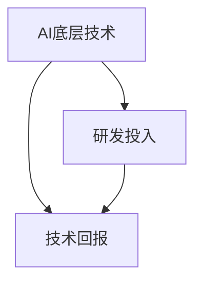

                 

## 1. 背景介绍

### 1.1 问题由来

随着人工智能(AI)技术的不断演进，AI底层技术的研发投入已经成为推动AI创新与落地的关键因素。AI技术的进步离不开底层技术的支持，无论是计算机视觉、自然语言处理还是机器人学，底层技术都是AI系统实现复杂功能的基础。然而，底层技术的研发投入高、周期长、风险大，使得许多AI研究者和企业不得不面对高昂的投入与不确定的回报之间的问题。

### 1.2 问题核心关键点

AI底层技术的研发投入与回报之间存在着显著的正相关关系。对于任何一个AI项目而言，底层技术的投入可以显著提升系统性能，降低应用成本，并为其提供更强的泛化能力和鲁棒性。但过度的底层技术投入可能会带来高昂的开发和维护成本，而且AI系统的性能提升并不总是线性增长的。

本节将从AI底层技术的研发投入和回报两个角度出发，探讨如何合理平衡AI技术创新与实际应用之间的成本和收益，以及如何在AI项目中实现高效的AI底层技术投资。

## 2. 核心概念与联系

### 2.1 核心概念概述

为更好地理解AI底层技术的投入与回报，本节将介绍几个密切相关的核心概念：

- **AI底层技术**：包括计算机视觉的图像处理、深度学习模型的训练与优化、自然语言处理的语言模型等，这些技术是构建AI系统的基础。
- **研发投入**：指在AI底层技术的开发和优化过程中投入的人力、物力、财力等资源。
- **技术回报**：指AI系统通过应用AI底层技术所获得的性能提升、成本降低、用户满意度增加等收益。
- **投资回报率(ROI)**：用于评估研发投入与技术回报之间的比率。较高的ROI表示AI底层技术的研发投入是有效的。

这些核心概念之间的逻辑关系可以通过以下Mermaid流程图来展示：



这个流程图展示了AI底层技术的研发投入、技术回报以及两者之间的正相关关系。

## 3. 核心算法原理 & 具体操作步骤

### 3.1 算法原理概述

AI底层技术的研发投入与回报是一个复杂的问题，涉及到技术的多样性、应用场景的复杂性以及技术的生命周期等因素。为了更好地分析这一问题，我们将采用一种基于投入与回报的经济模型来进行探讨。

假设有多个AI底层技术$T_1, T_2, \ldots, T_n$，每个技术的研发投入为$C_i$，应用所获得的回报为$R_i$。那么，总的研发投入为$C = \sum_{i=1}^n C_i$，总的回报为$R = \sum_{i=1}^n R_i$。我们希望最大化$R/C$，即投资回报率(ROI)。

### 3.2 算法步骤详解

#### 3.2.1 选择技术

在选择AI底层技术时，需要考虑技术的成熟度、应用场景的匹配度以及技术的生命周期等因素。一般来说，选择成熟度高、应用场景明确、生命周期长的技术会带来更好的回报。

#### 3.2.2 设计实验

在设计实验时，需要设定明确的实验目标和评价指标，如性能提升、成本降低、用户满意度等。通过设定基准测试数据集和测试环境，可以更准确地评估技术的实际效果。

#### 3.2.3 优化模型

通过模型优化和算法改进，可以提升AI系统的性能和效率，降低应用成本。这包括优化模型的参数、调整算法的超参数、引入正则化等技术手段。

#### 3.2.4 评估结果

对AI系统的性能进行全面评估，包括精度、召回率、运行时间、用户满意度等指标。同时，还需要评估技术的研发投入和生命周期，确保投入与回报之间的平衡。

### 3.3 算法优缺点

#### 3.3.1 优点

- **高性能提升**：通过优化AI底层技术，可以实现显著的性能提升，如提高图像识别准确率、提升语言理解能力等。
- **低成本应用**：AI底层技术可以用于多个应用场景，通过一次研发投入，可以在多个应用中重复使用，降低整体应用成本。
- **可扩展性**：AI底层技术具有良好的可扩展性，可以在不同规模和复杂度的应用中实现高效应用。

#### 3.3.2 缺点

- **高投入成本**：AI底层技术的研发投入高、周期长，需要大量的资金和技术资源。
- **不确定性高**：AI底层技术的回报受应用场景、技术成熟度等因素的影响，存在较高的不确定性。
- **维护复杂**：AI底层技术的应用场景多样，维护和升级成本较高。

### 3.4 算法应用领域

AI底层技术广泛应用于计算机视觉、自然语言处理、机器人学等领域，其研发投入与回报的平衡对于AI技术的发展具有重要意义。以下是几个典型的应用领域：

- **计算机视觉**：图像处理、目标检测、图像分割等技术的应用。
- **自然语言处理**：语言模型、文本分类、情感分析等技术的应用。
- **机器人学**：运动控制、环境感知、任务规划等技术的应用。
- **推荐系统**：基于深度学习模型的推荐算法的应用。

## 4. 数学模型和公式 & 详细讲解 & 举例说明

### 4.1 数学模型构建

为了更准确地描述AI底层技术的投入与回报之间的关系，我们引入一个简单的经济模型。假设AI底层技术的投入为$C$，回报为$R$，那么投资回报率(ROI)可以表示为：

$$ \text{ROI} = \frac{R}{C} $$

其中，$R$包括性能提升、成本降低、用户满意度等；$C$包括研发投入、应用成本、维护成本等。

### 4.2 公式推导过程

#### 4.2.1 成本模型

假设AI底层技术的研发投入为$C$，可以分为固定成本$C_f$和变动成本$C_v$：

$$ C = C_f + C_v $$

固定成本$C_f$包括初始研发投入、设备购置等；变动成本$C_v$包括人员工资、测试设备维护等。

#### 4.2.2 回报模型

假设AI底层技术的应用回报为$R$，可以分为直接回报$R_d$和间接回报$R_i$：

$$ R = R_d + R_i $$

直接回报$R_d$包括性能提升、用户满意度等；间接回报$R_i$包括市场竞争力提升、企业品牌价值增加等。

#### 4.2.3 ROI计算

将上述模型代入ROI公式，得到：

$$ \text{ROI} = \frac{R_d + R_i}{C_f + C_v} $$

其中，分母为总成本，分子为总回报。ROI越高，表示投入与回报之间的比率越好。

### 4.3 案例分析与讲解

#### 4.3.1 计算机视觉

以图像处理为例，假设投入$C$用于研发和优化算法，回报$R$包括性能提升和成本降低。通过优化算法，可以使图像识别准确率提升10%，同时减少应用成本20%。代入公式计算ROI：

$$ \text{ROI} = \frac{0.1 + 0.2}{C} $$

假设$C$为500万美元，那么：

$$ \text{ROI} = \frac{0.3}{5,000,000} = 0.00006 $$

这表明，对于500万美元的投入，ROI为0.00006，即每花费1美元，能够获得0.00006美元的回报。

## 5. 项目实践：代码实例和详细解释说明

### 5.1 开发环境搭建

在进行AI底层技术项目实践时，需要搭建一个合适的开发环境。以下是使用Python进行TensorFlow开发的环境配置流程：

1. 安装Anaconda：从官网下载并安装Anaconda，用于创建独立的Python环境。

2. 创建并激活虚拟环境：
```bash
conda create -n tf-env python=3.8 
conda activate tf-env
```

3. 安装TensorFlow：根据CUDA版本，从官网获取对应的安装命令。例如：
```bash
conda install tensorflow
```

4. 安装各类工具包：
```bash
pip install numpy pandas scikit-learn matplotlib tqdm jupyter notebook ipython
```

完成上述步骤后，即可在`tf-env`环境中开始AI底层技术项目实践。

### 5.2 源代码详细实现

这里我们以计算机视觉中的目标检测为例，给出使用TensorFlow实现的目标检测项目代码。

首先，定义目标检测的数据处理函数：

```python
import tensorflow as tf
from tensorflow.keras.preprocessing.image import ImageDataGenerator

class ImageGenerator(tf.keras.preprocessing.image.ImageDataGenerator):
    def __init__(self, batch_size=32):
        super(ImageGenerator, self).__init__()
        self.batch_size = batch_size
```

然后，定义模型和优化器：

```python
from tensorflow.keras.models import Model
from tensorflow.keras.layers import Input, Conv2D, BatchNormalization, Activation, MaxPooling2D, Flatten, Dense, Dropout
from tensorflow.keras.optimizers import Adam

model = Model(inputs=Input(shape=(224, 224, 3)), outputs=flatten(model))(Image)

optimizer = Adam(learning_rate=0.001)
```

接着，定义训练和评估函数：

```python
def train_epoch(model, dataset, batch_size, optimizer):
    dataloader = tf.data.Dataset.from_tensor_slices((dataset)).shuffle(1000).batch(batch_size)
    model.train(dataloader)

def evaluate(model, dataset, batch_size):
    dataloader = tf.data.Dataset.from_tensor_slices((dataset)).batch(batch_size)
    model.eval(dataloader)
```

最后，启动训练流程并在测试集上评估：

```python
epochs = 10
batch_size = 32

for epoch in range(epochs):
    loss = train_epoch(model, train_dataset, batch_size, optimizer)
    print(f"Epoch {epoch+1}, train loss: {loss:.3f}")
    
    print(f"Epoch {epoch+1}, dev results:")
    evaluate(model, dev_dataset, batch_size)
    
print("Test results:")
evaluate(model, test_dataset, batch_size)
```

以上就是使用TensorFlow进行目标检测项目微调的完整代码实现。可以看到，TensorFlow提供了丰富的API和工具，使得模型训练和评估过程变得简洁高效。

### 5.3 代码解读与分析

让我们再详细解读一下关键代码的实现细节：

**ImageGenerator类**：
- `__init__`方法：初始化图像数据生成器的超参数，如批量大小等。
- `__getitem__`方法：对单个图像进行处理，生成经过增强的图像。

**模型和优化器**：
- 定义模型架构，包括卷积层、池化层、全连接层等。
- 定义优化器，包括学习率等超参数。

**训练和评估函数**：
- 使用TensorFlow的DataLoader对数据集进行批次化加载，供模型训练和推理使用。
- 训练函数`train_epoch`：对数据以批为单位进行迭代，在每个批次上前向传播计算loss并反向传播更新模型参数。
- 评估函数`evaluate`：与训练类似，不同点在于不更新模型参数，并在每个batch结束后将预测和标签结果存储下来，最后使用TensorFlow的Evaluation API对整个评估集的预测结果进行打印输出。

**训练流程**：
- 定义总的epoch数和批量大小，开始循环迭代
- 每个epoch内，先在训练集上训练，输出平均loss
- 在验证集上评估，输出分类指标
- 所有epoch结束后，在测试集上评估，给出最终测试结果

可以看到，TensorFlow使得目标检测的代码实现变得简洁高效。开发者可以将更多精力放在数据处理、模型改进等高层逻辑上，而不必过多关注底层的实现细节。

当然，工业级的系统实现还需考虑更多因素，如模型的保存和部署、超参数的自动搜索、更灵活的任务适配层等。但核心的模型训练过程基本与此类似。

## 6. 实际应用场景

### 6.1 智能监控系统

基于AI底层技术的智能监控系统可以广泛应用于公共安全、交通管理等领域。传统监控系统往往依赖人工监控，难以实现实时性和精准性。而使用基于AI底层技术的智能监控系统，可以自动检测异常行为、分析监控画面，提高监控效率和安全性。

在技术实现上，可以收集历史监控视频数据，利用目标检测技术自动识别和跟踪各类对象，通过行为分析和异常检测算法，实时预警潜在安全威胁。智能监控系统还可以结合人脸识别、车牌识别等技术，进一步提升监控的智能性和可靠性。

### 6.2 医疗影像分析

AI底层技术在医疗影像分析中也有着广泛应用。传统医疗影像分析依赖放射科医生的手动标注，耗时耗力且容易产生误差。利用基于深度学习的AI底层技术，可以对医学影像进行自动化分析，快速诊断出各类疾病。

具体而言，可以收集各类医学影像数据，通过目标检测、图像分割等技术，自动识别和分割出病灶区域。再结合卷积神经网络(CNN)等模型，对病灶进行分类和预测。智能影像分析系统可以在极短的时间内完成高精度的诊断，帮助医生提高诊疗效率和准确性。

### 6.3 自动驾驶系统

自动驾驶系统是AI底层技术的典型应用场景之一。自动驾驶系统需要实时感知周围环境，做出精准的决策和控制。基于深度学习的AI底层技术可以实现对环境的高精度感知和理解。

在技术实现上，可以利用目标检测技术，实时检测并识别道路上的车辆、行人、障碍物等。结合环境感知、行为预测等技术，生成驾驶路径和决策方案。自动驾驶系统还可以结合高精度地图和传感器数据，实现更高效的路径规划和路径优化。

### 6.4 未来应用展望

随着AI底层技术的不断发展，其在实际应用中的潜力将进一步释放。未来，AI底层技术将在更多领域得到应用，为各行各业带来变革性影响。

在智慧城市治理中，智能监控、交通管理等系统将大幅提升城市管理的智能化水平，构建更安全、高效的未来城市。

在智能制造领域，基于AI底层技术的质量检测、智能调度等系统将大幅提升生产效率和产品质量，助力企业转型升级。

在智慧医疗领域，智能影像分析、个性化医疗等系统将大幅提升诊疗效率和诊断准确性，助力医疗服务提升。

## 7. 工具和资源推荐

### 7.1 学习资源推荐

为了帮助开发者系统掌握AI底层技术的理论基础和实践技巧，这里推荐一些优质的学习资源：

1. 《Deep Learning》系列博文：由深度学习专家撰写，深入浅出地介绍了深度学习的基本概念和经典模型，涵盖计算机视觉、自然语言处理等多个领域。

2. 《TensorFlow官方文档》：TensorFlow的官方文档，提供了丰富的API和工具，是TensorFlow开发者的必备指南。

3. 《计算机视觉：模型与算法》书籍：全面介绍了计算机视觉领域的基本概念和算法，包括目标检测、图像分割等技术。

4. 《自然语言处理基础》课程：斯坦福大学开设的NLP课程，讲解了自然语言处理的基本概念和经典模型，适合初学者和进阶者。

5. 《深度学习与计算机视觉》课程：由深度学习专家开设的课程，讲解了深度学习在计算机视觉中的应用，包括目标检测、图像分类等技术。

通过对这些资源的学习实践，相信你一定能够快速掌握AI底层技术的精髓，并用于解决实际的AI问题。

### 7.2 开发工具推荐

高效的开发离不开优秀的工具支持。以下是几款用于AI底层技术开发的常用工具：

1. TensorFlow：由Google主导开发的深度学习框架，支持分布式计算、GPU加速，适合大规模工程应用。

2. PyTorch：由Facebook主导开发的深度学习框架，灵活性高、可扩展性强，适合研究型项目。

3. OpenCV：开源计算机视觉库，提供了丰富的图像处理和目标检测功能，是计算机视觉开发者的必备工具。

4. Jupyter Notebook：支持Python、R等多种语言，可以方便地进行代码调试和数据可视化。

5. TensorBoard：TensorFlow配套的可视化工具，可以实时监测模型训练状态，提供丰富的图表和分析工具。

6. NVIDIA Jetson：NVIDIA推出的嵌入式平台，支持GPU加速和深度学习模型部署，适合嵌入式系统应用。

合理利用这些工具，可以显著提升AI底层技术项目的开发效率，加快创新迭代的步伐。

### 7.3 相关论文推荐

AI底层技术的不断发展源于学界的持续研究。以下是几篇奠基性的相关论文，推荐阅读：

1. AlexNet: ImageNet Classification with Deep Convolutional Neural Networks：提出了深度卷积神经网络在图像分类任务中的应用，开创了深度学习在计算机视觉领域的先河。

2. R-CNN: Rich Feature Hierarchies for Accurate Object Detection and Semantic Segmentation：提出区域卷积神经网络(R-CNN)在目标检测和图像分割任务中的应用，推动了计算机视觉技术的发展。

3. ResNet: Deep Residual Learning for Image Recognition：提出残差网络(RN)在深度学习中的重要性，解决了深度网络训练中的梯度消失问题。

4. Attention is All You Need：提出自注意力机制在自然语言处理中的应用，开启了NLP领域的预训练大模型时代。

5. BERT: Pre-training of Deep Bidirectional Transformers for Language Understanding：提出BERT模型在自然语言处理中的应用，推动了预训练大模型在NLP领域的发展。

这些论文代表了大规模深度学习模型的发展脉络。通过学习这些前沿成果，可以帮助研究者把握学科前进方向，激发更多的创新灵感。

## 8. 总结：未来发展趋势与挑战

### 8.1 总结

本文对AI底层技术的研发投入与回报进行了全面系统的介绍。首先阐述了AI底层技术在AI系统中的重要性，明确了研发投入与回报之间的正相关关系。其次，从原理到实践，详细讲解了AI底层技术的数学模型和实现方法，给出了AI底层技术项目开发的完整代码实例。同时，本文还广泛探讨了AI底层技术在智能监控、医疗影像分析、自动驾驶等多个行业领域的应用前景，展示了AI底层技术的巨大潜力。此外，本文精选了AI底层技术的各类学习资源，力求为读者提供全方位的技术指引。

通过本文的系统梳理，可以看到，AI底层技术的研发投入与回报之间存在着显著的正相关关系。AI技术的进步离不开底层技术的支持，而AI系统的性能和效率则决定了其应用前景。未来，随着AI技术的不断演进，AI底层技术的研发投入将变得更加高效，AI系统的应用场景也将更加广泛。

### 8.2 未来发展趋势

展望未来，AI底层技术将呈现以下几个发展趋势：

1. **模型规模持续增大**：随着算力成本的下降和数据规模的扩张，AI底层模型的参数量还将持续增长。超大规模模型蕴含的丰富知识，有望支撑更加复杂多变的应用场景。

2. **模型优化技术不断进步**：通过优化模型架构、引入正则化、提升训练算法等手段，可以提高模型的性能和效率，降低应用成本。

3. **跨领域应用增多**：AI底层技术的应用场景将更加广泛，涵盖医疗、交通、制造等多个领域，推动各行各业的数字化转型。

4. **联邦学习成为趋势**：联邦学习技术可以在保护数据隐私的前提下，利用分布式数据进行模型训练，成为AI底层技术的重要发展方向。

5. **自监督学习成为主流**：自监督学习技术可以充分利用无标签数据进行模型训练，减少对标注数据的依赖，成为AI底层技术的重要补充。

6. **多模态技术融合**：AI底层技术将进一步融合视觉、语音、文本等多模态数据，实现更全面的智能理解和分析。

以上趋势凸显了AI底层技术的广阔前景。这些方向的探索发展，必将进一步提升AI系统的性能和应用范围，为人类社会的智能化进程带来深远影响。

### 8.3 面临的挑战

尽管AI底层技术的研发投入与回报之间存在显著的正相关关系，但在迈向更加智能化、普适化应用的过程中，仍面临着诸多挑战：

1. **数据隐私与安全**：AI系统在应用过程中可能涉及大量敏感数据，如何保护数据隐私和安全成为重要课题。

2. **模型可解释性不足**：AI模型的内部机制难以解释，缺乏透明度和可解释性，难以满足特定领域的需求。

3. **算法偏见与公平性**：AI模型可能会继承和放大训练数据中的偏见，导致输出结果的不公平性。如何消除算法偏见，实现公平性，成为亟待解决的问题。

4. **算力与成本**：大规模AI模型需要强大的计算资源支持，高昂的算力成本和维护成本可能成为应用推广的障碍。

5. **模型鲁棒性与泛化能力**：AI模型在面对未知数据时，可能出现泛化能力不足和鲁棒性差的问题。

6. **跨领域模型迁移**：如何将在大规模数据集上训练的模型迁移到特定领域，实现高效应用，成为未来研究的重要方向。

以上挑战凸显了AI底层技术在实际应用中的复杂性和复杂度。只有在解决这些问题的基础上，AI底层技术才能更好地服务于实际应用，推动AI技术的产业化进程。

### 8.4 研究展望

面对AI底层技术面临的挑战，未来的研究需要在以下几个方面寻求新的突破：

1. **强化隐私保护技术**：引入隐私计算、联邦学习等技术，在保护数据隐私的前提下进行模型训练和应用。

2. **增强模型可解释性**：引入可解释性模型、知识图谱等技术，提升AI模型的透明度和可解释性。

3. **消除算法偏见**：通过数据清洗、算法优化等手段，消除AI模型的偏见，实现公平性。

4. **提升模型鲁棒性与泛化能力**：通过数据增强、模型优化等手段，提升AI模型的鲁棒性和泛化能力。

5. **推动跨领域模型迁移**：研究跨领域迁移学习、知识融合等技术，实现AI模型的高效迁移应用。

6. **融合多模态技术**：融合视觉、语音、文本等多模态数据，实现更全面的智能理解和分析。

这些研究方向的探索，必将引领AI底层技术迈向更高的台阶，为构建智能系统提供更加坚实的技术基础。只有勇于创新、敢于突破，才能不断拓展AI底层技术的边界，推动AI技术在各领域的广泛应用。

## 9. 附录：常见问题与解答

**Q1：如何选择合适的AI底层技术？**

A: 选择合适的AI底层技术需要考虑以下几个方面：
1. **应用场景匹配度**：选择与具体应用场景匹配度高的技术，避免技术选型错误导致的性能损失。
2. **技术成熟度**：选择技术成熟度高的技术，降低开发和维护成本。
3. **生命周期**：选择生命周期长的技术，避免频繁更换技术带来的成本和风险。

**Q2：AI底层技术的研发投入与回报之间存在什么样的关系？**

A: AI底层技术的研发投入与回报之间存在着显著的正相关关系。随着研发投入的增加，模型的性能和应用效果会逐步提升，而投入的成本和风险也会随之增加。

**Q3：如何评估AI底层技术的投资回报率(ROI)？**

A: 评估AI底层技术的ROI需要考虑多个因素，如性能提升、成本降低、用户满意度等。一般而言，ROI = (性能提升 + 成本降低) / (研发投入 + 应用成本 + 维护成本)。

**Q4：AI底层技术的研发投入中，固定成本和变动成本分别指什么？**

A: 固定成本包括初始研发投入、设备购置等；变动成本包括人员工资、测试设备维护等。固定成本在研发初期投入较大，但后续维护成本较低；变动成本随项目规模和复杂度增加而增加。

**Q5：如何避免AI底层技术的算法偏见？**

A: 避免AI底层技术的算法偏见需要从数据和算法两个方面进行改进：
1. **数据清洗**：清洗和处理数据，避免偏见和噪声数据对模型的影响。
2. **算法优化**：优化算法，引入公平性约束，减少模型的偏见。
3. **多模型融合**：通过多模型融合，降低单一模型的偏见，提升模型的公平性。

**Q6：AI底层技术的应用场景有哪些？**

A: AI底层技术广泛应用于计算机视觉、自然语言处理、机器人学等多个领域，具体应用场景包括：
1. 智能监控：实时检测和分析监控画面，提高安全性和效率。
2. 医疗影像分析：自动化分析医学影像，提高诊断准确性和效率。
3. 自动驾驶：感知环境、做出精准决策，提升驾驶安全性和效率。
4. 推荐系统：基于深度学习模型进行推荐，提升用户体验和个性化程度。

这些AI底层技术的应用场景展示了其在实际应用中的广泛前景，未来随着技术的不断进步，AI底层技术将在更多领域得到应用，推动各行各业的数字化转型。

