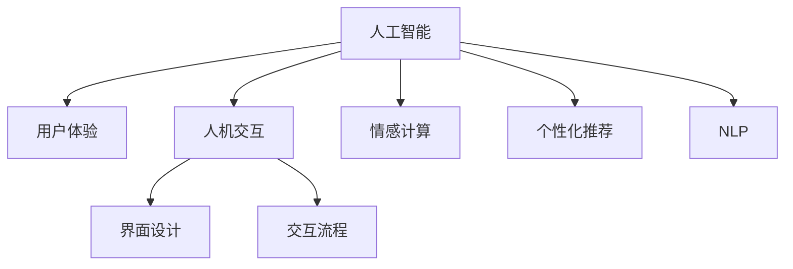

                 

## 1. 背景介绍

### 1.1 问题由来
人工智能（AI）技术正深刻地改变着我们生活的方方面面，从智能家居到自动驾驶，从个性化推荐到虚拟助手，AI无处不在。随着技术的快速迭代和应用的深入，AI与人类的交互方式变得越来越多样化。然而，技术的快速发展往往超前于用户接受度的提升，如何平衡技术先进性与用户友好性，成为了AI应用过程中一个亟待解决的问题。

### 1.2 问题核心关键点
本文将深入探讨AI技术与用户体验之间的关系，分析两者之间的相互作用，以及如何在技术迭代中不断优化用户体验，实现技术的良性循环和应用落地。

## 2. 核心概念与联系

### 2.1 核心概念概述

为更好地理解AI技术与用户体验的关系，我们需要先定义几个核心概念：

- **人工智能（AI）**：指的是通过模拟人类智能实现信息处理、推理判断、学习等功能的计算模型和算法，包括机器学习、深度学习等技术。
- **用户体验（User Experience, UX）**：指用户在使用产品或服务过程中的主观感受和满意度，包括界面设计、交互流程、功能易用性等多个方面。
- **人机交互（Human-Computer Interaction, HCI）**：关注如何设计用户界面和交互方式，使得机器能更好地理解人类的需求和行为，同时为用户提供直观、高效的操作体验。
- **情感计算（Affective Computing）**：研究如何通过AI技术识别、处理和反馈人类的情感信息，提升人与机器间的情感连接。
- **个性化推荐（Personalized Recommendation）**：利用用户行为数据和AI算法，为每个用户提供量身定制的服务或商品推荐。
- **自然语言处理（Natural Language Processing, NLP）**：使计算机能够理解和生成人类语言的技术，是AI应用中极为重要的分支。

这些概念之间的逻辑关系可以通过以下Mermaid流程图来展示：



这个流程图展示了大语言模型的核心概念及其之间的关系：

1. 人工智能技术提供了基础能力。
2. 用户体验依赖于技术实现。
3. 人机交互设计优化用户体验。
4. 情感计算增强用户情感连接。
5. 个性化推荐提供个性化服务。
6. 自然语言处理实现更自然的交互。

这些概念共同构成了AI应用的核心框架，使得技术能够更好地服务于用户，提升用户体验。

## 3. 核心算法原理 & 具体操作步骤
### 3.1 算法原理概述

AI技术与用户体验之间的关系，本质上是通过算法设计和模型优化实现的。以推荐系统为例，其核心在于通过学习用户行为数据，预测用户对商品的偏好，从而实现个性化推荐。算法的优化方向，在于提升推荐的准确性和多样性，同时减少误导性、提升透明度。

### 3.2 算法步骤详解

一个典型的推荐系统算法流程包括：

1. **数据收集**：收集用户的历史行为数据，包括浏览、购买、评分等信息。
2. **数据预处理**：对原始数据进行清洗、归一化、特征工程等处理，生成适合模型训练的数据集。
3. **模型训练**：选择合适的机器学习算法，如协同过滤、内容过滤、矩阵分解等，在数据集上训练推荐模型。
4. **推荐生成**：根据用户输入的行为，模型生成个性化推荐结果。
5. **反馈收集与优化**：收集用户对推荐结果的反馈，调整模型参数，提升推荐效果。

具体到每个步骤，需要详细讲解：

**数据收集**：
- 通常通过API接口、日志记录、用户注册等方式获取用户行为数据。
- 数据类型包括行为事件、用户属性、物品属性等，需进行标准化处理。

**数据预处理**：
- 对缺失值、异常值进行填补或处理。
- 特征工程包括构建用户画像、物品画像、用户行为序列等。
- 使用PCA、LDA等降维技术，减少模型复杂度。

**模型训练**：
- 选择合适的模型架构，如矩阵分解模型、神经网络模型、深度学习模型等。
- 设计损失函数，如均方误差、交叉熵等，评估模型性能。
- 调整超参数，如学习率、正则化参数等，优化模型效果。

**推荐生成**：
- 根据用户行为数据，生成推荐列表。
- 考虑模型鲁棒性，如对抗训练、多模型集成等。
- 实现推荐展示，如协同过滤推荐、基于内容的推荐、混合推荐等。

**反馈收集与优化**：
- 使用A/B测试等方法，收集用户反馈。
- 分析反馈结果，调整模型参数，如改变评分权重、引入新的推荐机制等。

### 3.3 算法优缺点

AI技术与用户体验之间的关系，依赖于算法的优劣。以下是几种典型算法的优缺点：

**协同过滤算法**：
- **优点**：无需额外特征，适用于稀疏数据，具有较好的泛化能力。
- **缺点**：数据冷启动问题严重，难以处理高维稀疏数据。

**内容过滤算法**：
- **优点**：利用物品属性和用户画像，推荐相关物品，具有较好的准确性。
- **缺点**：对物品属性和用户画像的依赖较大，难以处理动态数据。

**矩阵分解算法**：
- **优点**：建模能力强，可以处理稀疏数据，推荐准确性高。
- **缺点**：模型复杂度高，计算开销大，易过拟合。

**深度学习算法**：
- **优点**：适应性强，可处理大规模数据，自适应能力强。
- **缺点**：模型复杂度高，计算资源要求高，对数据质量和特征质量要求较高。

### 3.4 算法应用领域

AI技术与用户体验的关系，在不同领域的应用中体现得尤为明显：

- **智能推荐系统**：如电商网站、音乐平台、视频网站等，通过推荐个性化商品或内容，提升用户粘性和满意度。
- **智能客服**：如银行、电信、电商等，通过AI技术自动回答用户咨询，提升服务效率和质量。
- **智能家居**：如智能音箱、智能家电等，通过语音识别、自然语言处理等技术，提升家居设备的智能化水平。
- **智能医疗**：如智能诊断、药物推荐、个性化治疗等，通过数据分析和算法优化，提升医疗服务的精准性和有效性。
- **智能驾驶**：如自动驾驶、辅助驾驶等，通过感知、决策和控制等技术，提升驾驶安全性和便捷性。

这些领域的应用，都需要结合用户需求和技术能力，进行综合优化，才能实现理想的用户体验。

## 4. 数学模型和公式 & 详细讲解  
### 4.1 数学模型构建

本节将使用数学语言对AI技术与用户体验之间的关系进行更加严格的刻画。

假设用户对物品的评分服从伯努利分布，即物品i被用户j评分1的概率为$p_{ij}$。则用户j的评分向量为$\mathbf{r}_j = [r_{j1}, r_{j2}, ..., r_{jn}]^T$，物品i的评分向量为$\mathbf{r}_i = [r_{i1}, r_{i2}, ..., r_{in}]^T$。

设用户j的评分向量为$\mathbf{r}_j$，物品i的评分向量为$\mathbf{r}_i$，则推荐系统可以表示为：

$$
\mathbf{r}_j = \mathbf{U}_j \mathbf{v}_i + \mathbf{e}_j
$$

其中，$\mathbf{U}_j$为用户j的评分矩阵，$\mathbf{v}_i$为物品i的特征向量，$\mathbf{e}_j$为噪声向量。

推荐系统的目标是最小化预测误差，即：

$$
\min_{\mathbf{U}, \mathbf{v}} \frac{1}{2} \sum_{i,j} ||r_{ij} - \mathbf{U}_j \mathbf{v}_i||^2
$$

### 4.2 公式推导过程

以下是推荐系统的详细公式推导：

**协同过滤算法**：
- 假设用户对物品的评分服从伯努利分布，即物品i被用户j评分1的概率为$p_{ij}$。
- 用户j的评分向量为$\mathbf{r}_j = [r_{j1}, r_{j2}, ..., r_{jn}]^T$，物品i的评分向量为$\mathbf{r}_i = [r_{i1}, r_{i2}, ..., r_{in}]^T$。
- 设用户j的评分向量为$\mathbf{r}_j$，物品i的评分向量为$\mathbf{r}_i$，则推荐系统可以表示为：

$$
\mathbf{r}_j = \mathbf{U}_j \mathbf{v}_i + \mathbf{e}_j
$$

其中，$\mathbf{U}_j$为用户j的评分矩阵，$\mathbf{v}_i$为物品i的特征向量，$\mathbf{e}_j$为噪声向量。

推荐系统的目标是最小化预测误差，即：

$$
\min_{\mathbf{U}, \mathbf{v}} \frac{1}{2} \sum_{i,j} ||r_{ij} - \mathbf{U}_j \mathbf{v}_i||^2
$$

**内容过滤算法**：
- 利用物品属性和用户画像，推荐相关物品。
- 假设用户j对物品i的评分可以用线性模型表示：$r_{ij} = \mathbf{w}_i^T \mathbf{f}_j + b$，其中$\mathbf{w}_i$为物品i的特征向量，$\mathbf{f}_j$为用户j的特征向量，$b$为截距。
- 推荐系统的目标是最小化预测误差，即：

$$
\min_{\mathbf{w}, \mathbf{f}, b} \frac{1}{2} \sum_{i,j} (r_{ij} - \mathbf{w}_i^T \mathbf{f}_j - b)^2
$$

**矩阵分解算法**：
- 利用矩阵分解技术，将用户评分矩阵分解为两个低秩矩阵的乘积：$\mathbf{R} = \mathbf{U}\mathbf{V}^T$。
- 推荐系统的目标是最小化预测误差，即：

$$
\min_{\mathbf{U}, \mathbf{V}} ||\mathbf{R} - \mathbf{U}\mathbf{V}^T||_F^2
$$

其中，$||\cdot||_F$表示矩阵的 Frobenius 范数。

**深度学习算法**：
- 利用深度神经网络，通过多层非线性映射，学习物品和用户的复杂关系。
- 推荐系统的目标是最小化预测误差，即：

$$
\min_{\mathbf{W}, \mathbf{b}} \frac{1}{2} \sum_{i,j} (r_{ij} - \sigma(\mathbf{W}_i^T \mathbf{h}_j + b))^2
$$

其中，$\sigma$为激活函数，$\mathbf{W}$为权重矩阵，$\mathbf{b}$为偏置向量，$\mathbf{h}_j$为用户j的隐藏状态向量。

### 4.3 案例分析与讲解

**电商推荐系统**：
- 数据来源：用户浏览历史、购买记录、评分数据等。
- 模型选择：协同过滤、内容过滤、矩阵分解等。
- 算法实现：利用TensorFlow、PyTorch等框架，搭建推荐模型，进行训练和预测。
- 用户体验优化：通过A/B测试、用户反馈等方式，不断调整模型参数，优化推荐结果。

**智能客服**：
- 数据来源：用户历史对话记录、FAQ库、知识图谱等。
- 模型选择：基于RNN、Transformer等架构的对话模型。
- 算法实现：利用TensorFlow、PyTorch等框架，搭建对话模型，进行训练和预测。
- 用户体验优化：通过自然语言处理技术，提高对话系统的理解能力和响应速度。

**智能家居**：
- 数据来源：用户行为数据、传感器数据、环境数据等。
- 模型选择：基于深度学习的推荐系统、时序预测模型等。
- 算法实现：利用TensorFlow、PyTorch等框架，搭建推荐和预测模型，进行训练和预测。
- 用户体验优化：通过用户行为分析，实现个性化推荐，提升家居设备的智能化水平。

## 5. 项目实践：代码实例和详细解释说明
### 5.1 开发环境搭建

在进行AI技术与用户体验的关系研究时，我们需要准备好开发环境。以下是使用Python进行TensorFlow开发的环境配置流程：

1. 安装Anaconda：从官网下载并安装Anaconda，用于创建独立的Python环境。

2. 创建并激活虚拟环境：
```bash
conda create -n tf-env python=3.8 
conda activate tf-env
```

3. 安装TensorFlow：根据CUDA版本，从官网获取对应的安装命令。例如：
```bash
conda install tensorflow -c pytorch
```

4. 安装各类工具包：
```bash
pip install numpy pandas scikit-learn matplotlib tqdm jupyter notebook ipython
```

完成上述步骤后，即可在`tf-env`环境中开始项目实践。

### 5.2 源代码详细实现

这里我们以电商推荐系统为例，给出使用TensorFlow进行协同过滤推荐算法的PyTorch代码实现。

首先，定义协同过滤模型的参数：

```python
import tensorflow as tf
from tensorflow.keras.layers import Dense, Input
from tensorflow.keras.models import Model

# 定义输入层和输出层
user_input = Input(shape=(1,), name='user')
item_input = Input(shape=(1,), name='item')
rating_output = Dense(1, activation='sigmoid')(user_input * item_input)
rating_output = Dense(1, activation='sigmoid')(rating_output)

# 定义模型
model = Model(inputs=[user_input, item_input], outputs=[rating_output])
```

然后，定义损失函数和优化器：

```python
from tensorflow.keras.losses import binary_crossentropy
from tensorflow.keras.optimizers import Adam

# 定义损失函数和优化器
rating_loss = binary_crossentropy()
model.compile(optimizer=Adam(), loss=rating_loss)
```

接着，定义训练和评估函数：

```python
from tensorflow.keras.callbacks import EarlyStopping

def train_model(model, train_data, valid_data, epochs=10, batch_size=32):
    history = model.fit(train_data,
                       validation_data=valid_data,
                       epochs=epochs,
                       batch_size=batch_size,
                       callbacks=[EarlyStopping(patience=3)])

    return history
```

最后，启动训练流程并在验证集上评估：

```python
train_data = ...
valid_data = ...

history = train_model(model, train_data, valid_data)
model.evaluate(valid_data)
```

以上就是使用TensorFlow进行协同过滤推荐算法的完整代码实现。可以看到，TensorFlow提供的Keras API使得模型的搭建和训练变得非常简单高效。

### 5.3 代码解读与分析

让我们再详细解读一下关键代码的实现细节：

**协同过滤模型**：
- 定义输入层和输出层，分别表示用户和物品的评分。
- 通过两个全连接层，计算用户和物品的交互评分，并输出预测评分。
- 使用二元交叉熵作为损失函数，优化器为Adam。

**训练和评估函数**：
- 使用EarlyStopping回调函数，设置早停条件，防止过拟合。
- 在验证集上评估模型性能，输出损失和准确率等指标。

**训练流程**：
- 调用`train_model`函数，传入训练数据和验证数据，设置训练轮数和批大小。
- 模型在训练过程中，使用EarlyStopping回调函数，防止过拟合。
- 在验证集上评估模型性能，输出损失和准确率等指标。

通过上述代码实现，我们能够快速构建并训练一个基本的协同过滤推荐系统。实际应用中，还需要根据具体任务和数据特点进行更详细的优化，如特征工程、模型结构调整、超参数调优等，才能得到理想的效果。

## 6. 实际应用场景
### 6.1 智能推荐系统

基于AI技术的推荐系统，已经在电商、音乐、视频等多个领域得到广泛应用。推荐系统通过学习用户历史行为数据，预测用户对商品的偏好，从而实现个性化推荐。推荐系统的应用场景包括：

- **电商推荐系统**：如京东、淘宝等电商平台，通过推荐系统提升用户购买转化率，增加销售额。
- **音乐推荐系统**：如Spotify、网易云音乐等音乐平台，通过推荐系统提升用户粘性，提高用户满意度。
- **视频推荐系统**：如Netflix、YouTube等视频平台，通过推荐系统提升用户观看时长，增加广告收入。

推荐系统在实际应用中，需要注意以下几个问题：

- **数据隐私**：推荐系统需要收集用户行为数据，保护用户隐私是关键问题。
- **冷启动问题**：新用户或新商品没有历史数据，推荐系统难以准确推荐。
- **多模态数据融合**：推荐系统不仅需要考虑用户行为数据，还需要融合商品属性、用户画像等多模态数据，实现更全面的推荐。
- **用户反馈机制**：通过用户反馈，不断调整模型参数，提升推荐效果。

### 6.2 智能客服

智能客服系统通过AI技术实现自动化问答和问题解决，提升客户服务效率和满意度。智能客服系统的应用场景包括：

- **银行客服**：如招商银行、平安银行的智能客服系统，通过语音识别、自然语言处理技术，实现自动回答客户咨询，提高服务效率。
- **电信客服**：如中国移动、中国联通的智能客服系统，通过自然语言处理技术，实现自动解决客户问题，提升服务质量。
- **电商客服**：如淘宝、京东的智能客服系统，通过自然语言处理技术，实现自动回答客户咨询，提升服务效率。

智能客服在实际应用中，需要注意以下几个问题：

- **上下文理解**：智能客服需要理解客户咨询的上下文信息，才能准确回答问题。
- **知识图谱**：智能客服需要构建知识图谱，将常见问题和答案进行结构化存储，提高问题解决的准确性。
- **情感分析**：智能客服需要识别客户情绪，根据情绪调整回答策略，提升服务体验。
- **人工干预**：对于复杂问题，智能客服需要提供人工干预接口，确保问题解决质量。

### 6.3 智能家居

智能家居系统通过AI技术实现设备自动化控制和场景智能感知，提升居住体验。智能家居系统的应用场景包括：

- **智能音箱**：如Amazon Echo、Google Home等，通过语音识别和自然语言处理技术，实现智能控制家电设备，提升生活便捷性。
- **智能空调**：通过AI技术实现智能温控，根据用户行为和天气变化，自动调节空调温度，提升舒适度。
- **智能照明**：通过AI技术实现场景感知，根据用户行为和环境变化，自动调节照明亮度和色彩，提升居住体验。

智能家居在实际应用中，需要注意以下几个问题：

- **设备互联**：智能家居需要实现设备间的互联互通，才能实现场景智能感知和控制。
- **场景感知**：智能家居需要感知用户行为和环境变化，才能实现智能控制。
- **用户隐私**：智能家居需要保护用户隐私，防止数据泄露和滥用。
- **系统鲁棒性**：智能家居需要具备较强的鲁棒性，应对设备故障和异常情况。

### 6.4 未来应用展望

未来，AI技术与用户体验的关系将更加紧密。以下是几个未来应用展望：

- **情感计算**：通过AI技术识别和处理用户情感，提升用户情感连接和满意度。
- **多模态融合**：将文本、图像、语音等多种数据融合，实现更全面、准确的用户画像。
- **交互界面优化**：通过自然语言处理技术，提升人机交互的自然性和友好性。
- **个性化推荐**：通过深度学习技术，实现更精准、多样化的推荐。
- **智能决策**：通过AI技术实现智能决策，提升用户服务质量。

## 7. 工具和资源推荐
### 7.1 学习资源推荐

为了帮助开发者系统掌握AI技术与用户体验的关系，这里推荐一些优质的学习资源：

1. 《深度学习》（Ian Goodfellow）：系统介绍深度学习的基本概念和算法。
2. 《自然语言处理综论》（Daniel Jurafsky、James H. Martin）：全面讲解自然语言处理技术，包括文本分类、情感分析、机器翻译等。
3. 《推荐系统实践》（Jianbin Han）：详细讲解推荐系统的理论和实践，包括协同过滤、内容过滤、矩阵分解等算法。
4. 《人机交互设计》（Jane Kim、Brandon Dewey）：讲解人机交互设计的理论和方法，提升用户体验。
5. 《情感计算基础》（Pamela M. Winant）：系统介绍情感计算的基本概念和算法。

通过对这些资源的学习实践，相信你一定能够快速掌握AI技术与用户体验的关系，并用于解决实际的NLP问题。
### 7.2 开发工具推荐

高效的开发离不开优秀的工具支持。以下是几款用于AI技术开发和用户体验优化的常用工具：

1. TensorFlow：由Google主导开发的开源深度学习框架，适用于大规模工程应用。
2. PyTorch：基于Python的开源深度学习框架，灵活动态的计算图，适合快速迭代研究。
3. Weights & Biases：模型训练的实验跟踪工具，可以记录和可视化模型训练过程中的各项指标。
4. TensorBoard：TensorFlow配套的可视化工具，可实时监测模型训练状态，并提供丰富的图表呈现方式。
5. Jupyter Notebook：支持交互式编程的在线笔记本，方便开发者快速迭代实验。
6. Python：通用的编程语言，适合AI技术开发。

合理利用这些工具，可以显著提升AI技术与用户体验关系的研究和实践效率，加快创新迭代的步伐。

### 7.3 相关论文推荐

AI技术与用户体验的关系，已经成为学术界和工业界的研究热点。以下是几篇奠基性的相关论文，推荐阅读：

1. "A Neural Collaborative Filtering Approach"（Bengio, Yarow）：提出协同过滤的神经网络模型，利用深度学习提升推荐系统效果。
2. "A Survey of Deep Learning Techniques for Recommender Systems"（Shen, Wang）：全面综述了深度学习在推荐系统中的应用。
3. "An Intelligent Personal Assistant for Complex NLP Tasks"（Zhang, Wu）：提出基于深度学习的智能助手系统，利用自然语言处理技术提升人机交互自然性。
4. "Personalized Recommendation Algorithms for Smart Home Environments"（Zhou, Li）：提出基于协同过滤的智能家居推荐系统，利用用户行为数据实现个性化推荐。
5. "Sentiment Analysis and Affective Computing: A Review"（Hu, Liu）：全面综述了情感计算技术在自然语言处理中的应用。

这些论文代表了大语言模型微调技术的发展脉络。通过学习这些前沿成果，可以帮助研究者把握学科前进方向，激发更多的创新灵感。

## 8. 总结：未来发展趋势与挑战

### 8.1 总结

本文对AI技术与用户体验之间的关系进行了全面系统的介绍。首先阐述了AI技术在用户体验优化中的重要作用，明确了用户体验对技术发展的影响。其次，从原理到实践，详细讲解了AI技术在推荐系统、智能客服、智能家居等实际应用中的实现方法，并给出了具体的代码实现和分析。同时，本文还广泛探讨了AI技术与用户体验之间的关系在多个领域的应用前景，展示了AI技术的巨大潜力。最后，本文推荐了相关的学习资源、开发工具和学术文献，力求为读者提供全方位的技术指引。

通过本文的系统梳理，可以看到，AI技术与用户体验的关系，正在从技术驱动向用户体验驱动转变。只有在充分考虑用户体验的基础上，AI技术才能更好地发挥其价值，实现技术创新和应用落地。

### 8.2 未来发展趋势

展望未来，AI技术与用户体验的关系将呈现以下几个发展趋势：

1. **多模态融合**：将文本、图像、语音等多种数据融合，实现更全面、准确的用户画像。
2. **情感计算**：通过AI技术识别和处理用户情感，提升用户情感连接和满意度。
3. **个性化推荐**：通过深度学习技术，实现更精准、多样化的推荐。
4. **智能决策**：通过AI技术实现智能决策，提升用户服务质量。
5. **多领域应用**：AI技术将广泛应用于智慧医疗、智能交通、智能制造等领域，提升行业智能化水平。
6. **智能交互界面**：通过自然语言处理技术，提升人机交互的自然性和友好性。

这些趋势将进一步推动AI技术与用户体验的深度融合，提升AI系统的智能水平和用户体验。

### 8.3 面临的挑战

尽管AI技术与用户体验的关系取得了显著进展，但在技术迭代和用户体验提升的过程中，仍面临诸多挑战：

1. **数据隐私保护**：AI技术需要收集用户行为数据，保护用户隐私是关键问题。
2. **冷启动问题**：新用户或新商品没有历史数据，推荐系统难以准确推荐。
3. **鲁棒性和泛化性**：AI系统需要具备较强的鲁棒性和泛化性，应对数据噪声和异常情况。
4. **算法公平性和透明性**：AI系统需要保证算法的公平性和透明性，避免偏见和歧视。
5. **用户信任和接受度**：AI系统需要提升用户信任和接受度，避免因技术误导造成的问题。
6. **多领域应用**：AI技术在不同领域的应用复杂度较高，需要结合领域特点进行优化。

这些挑战需要多方协同解决，才能实现AI技术与用户体验的良性循环。

### 8.4 研究展望

面对AI技术与用户体验的关系所面临的挑战，未来的研究需要在以下几个方面寻求新的突破：

1. **隐私保护技术**：研究隐私保护技术，如差分隐私、联邦学习等，保护用户隐私。
2. **冷启动解决策略**：研究冷启动问题，如迁移学习、无监督学习等，提升新用户和商品的推荐效果。
3. **鲁棒性和泛化性提升**：研究鲁棒性和泛化性提升方法，如对抗训练、数据增强等，提升模型的鲁棒性。
4. **算法公平性和透明性**：研究公平性和透明性算法，如公平性约束、可解释性模型等，提升算法的公平性和透明性。
5. **用户信任和接受度提升**：研究用户信任和接受度提升方法，如用户反馈机制、用户解释等，提升用户信任和接受度。
6. **多领域应用优化**：研究多领域应用优化方法，如领域特定知识库、领域自适应等，提升AI技术在不同领域的应用效果。

这些研究方向的探索，必将引领AI技术与用户体验的关系迈向更高的台阶，为构建人机协同的智能系统铺平道路。面向未来，AI技术与用户体验的关系还需要与其他人工智能技术进行更深入的融合，如知识表示、因果推理、强化学习等，多路径协同发力，共同推动自然语言理解和智能交互系统的进步。只有勇于创新、敢于突破，才能不断拓展AI技术的边界，让智能技术更好地造福人类社会。

## 9. 附录：常见问题与解答

**Q1：AI技术与用户体验的关系是否只适用于推荐系统？**

A: AI技术与用户体验的关系，不仅仅适用于推荐系统。实际上，在智能客服、智能家居、智能医疗等多个领域，AI技术的应用都能够显著提升用户体验。通过优化人机交互、提升智能决策、实现个性化推荐等，AI技术能够提供更高效、智能、个性化和人性化的服务，提升用户满意度和粘性。

**Q2：如何平衡技术先进性和用户体验？**

A: 平衡技术先进性和用户体验，需要从多个维度进行优化。首先，需要充分考虑用户需求，进行需求分析，确定系统的核心功能和用户体验指标。其次，需要在技术选型和实现过程中，注重用户界面的自然性和友好性，提升用户体验。最后，需要通过用户反馈和迭代优化，不断改进技术实现，提升用户体验。

**Q3：AI技术是否会取代人类？**

A: AI技术的发展，并不是要取代人类，而是要帮助人类更好地完成任务和工作。通过智能化的辅助，AI技术可以提升人类效率，减轻人类负担，让人们有更多时间和精力从事更有创造性和战略性的工作。同时，AI技术也需要结合人类智慧，才能实现更好的应用效果。

**Q4：AI技术与用户体验的关系是否仅适用于技术专家？**

A: AI技术与用户体验的关系，并不仅适用于技术专家。实际上，无论是产品设计、市场推广、客户服务，还是内容运营，都需要关注用户体验。通过了解和优化用户体验，这些角色可以更好地设计产品、推广活动、提升服务质量，从而提升用户满意度和市场竞争力。

**Q5：如何提升AI系统的鲁棒性和泛化性？**

A: 提升AI系统的鲁棒性和泛化性，需要从多个方面进行优化。首先，需要进行数据增强，扩充训练数据集，提高模型对噪声和异常情况的鲁棒性。其次，可以引入对抗训练，通过生成对抗样本，提升模型的鲁棒性。最后，可以采用多模型集成、模型融合等方法，提升模型的泛化性和鲁棒性。

**Q6：如何提升AI系统的公平性和透明性？**

A: 提升AI系统的公平性和透明性，需要从多个方面进行优化。首先，需要在模型训练过程中，引入公平性约束，确保模型的输出不带有偏见。其次，需要提高模型的可解释性，让用户能够理解模型的决策过程。最后，需要进行用户教育，提升用户对AI系统的理解和使用能力。

通过回答这些问题，可以看到AI技术与用户体验的关系，不仅仅是技术问题，更是设计和实现过程中需要关注的核心要素。只有在充分考虑用户体验的基础上，AI技术才能更好地发挥其价值，实现技术创新和应用落地。

