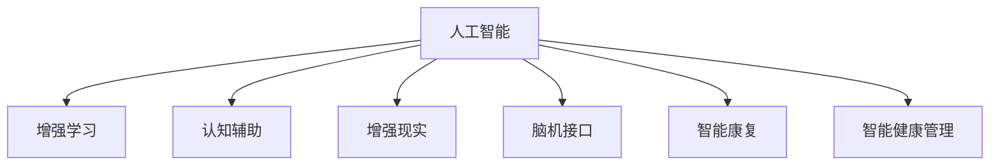

                 

## 1. 背景介绍

### 1.1 问题由来
随着人工智能（AI）技术的发展，人类社会正逐渐进入一个崭新的AI时代。在这个时代，人工智能不仅仅是一个技术工具，更是一个重要的社会变革力量。AI技术的飞速发展，不仅带来了生产力的大幅度提升，也为人类身体和认知的提升提供了新的可能性。

### 1.2 问题核心关键点
AI技术在提升人类身体和认知方面的潜力巨大，其主要体现在以下几个方面：
1. **智能康复**：AI技术能够帮助残疾人进行身体功能的康复训练，如语音识别技术可以帮助聋哑人进行语言学习，机器视觉技术可以帮助盲人进行环境感知。
2. **认知辅助**：AI技术能够辅助人类进行学习和记忆，如个性化推荐系统可以帮助人们快速获取知识，智能笔记工具可以帮助人们记录和整理信息。
3. **心理支持**：AI技术可以提供心理支持和情感陪伴，如虚拟心理医生可以提供心理咨询服务，聊天机器人可以陪伴孤独的人。
4. **健康管理**：AI技术可以帮助人们进行健康管理和预防，如智能穿戴设备可以监测身体健康指标，智能诊断系统可以提供疾病预测和治疗建议。

### 1.3 问题研究意义
研究和应用AI技术提升人类的身体和认知能力，对于改善人类的生活质量、提升社会生产力、促进社会和谐发展具有重要意义。AI技术不仅能够解决传统医疗和教育中的难题，还能够推动各行业的信息化和智能化，为社会带来更大的进步。

## 2. 核心概念与联系

### 2.1 核心概念概述

为更好地理解AI技术在提升人类身体和认知方面的应用，本节将介绍几个关键概念及其相互关系：

- **人工智能**：使用计算机算法和数据模型，使计算机系统具备人类智能特性的技术。
- **增强学习**：通过智能系统与环境互动，不断学习优化决策策略的过程。
- **认知辅助**：通过技术手段增强人类认知能力，如记忆、学习、决策等。
- **增强现实**：将虚拟信息叠加到现实世界，提升人机交互体验。
- **脑机接口**：通过技术手段直接连接人类大脑和计算机，实现人机信息交互。
- **智能康复**：利用AI技术帮助残疾人和老年人进行身体功能的康复训练。
- **智能健康管理**：通过AI技术进行健康监测和疾病预测，提升人们的健康水平。

这些概念之间的逻辑关系可以通过以下Mermaid流程图来展示：



这个流程图展示了AI技术通过增强学习、认知辅助、增强现实、脑机接口等手段，提升了人类身体和认知能力，并应用于智能康复和智能健康管理等具体领域。

## 3. 核心算法原理 & 具体操作步骤
### 3.1 算法原理概述

AI技术在提升人类身体和认知方面的应用，核心在于通过智能算法和数据模型，实现对人类身体和认知的辅助和增强。

以智能康复为例，AI技术主要通过以下步骤实现：
1. **数据采集**：收集病人的生理数据、运动数据、环境数据等。
2. **数据预处理**：对采集的数据进行清洗、去噪、归一化等预处理操作。
3. **模型训练**：使用机器学习或深度学习模型对预处理后的数据进行训练，构建智能康复模型。
4. **模型评估**：对训练好的模型进行评估，确保其准确性和可靠性。
5. **应用部署**：将训练好的模型部署到实际应用场景中，如康复训练系统、智能穿戴设备等。

以认知辅助为例，AI技术主要通过以下步骤实现：
1. **数据采集**：收集用户的学习行为、阅读习惯、知识结构等数据。
2. **数据预处理**：对采集的数据进行清洗、去噪、归一化等预处理操作。
3. **模型训练**：使用机器学习或深度学习模型对预处理后的数据进行训练，构建认知辅助模型。
4. **模型评估**：对训练好的模型进行评估，确保其准确性和可靠性。
5. **应用部署**：将训练好的模型部署到实际应用场景中，如个性化推荐系统、智能笔记工具等。

### 3.2 算法步骤详解

以下是AI技术在提升人类身体和认知方面的具体操作步骤：

**智能康复**

**Step 1: 数据采集**
- 通过传感器、摄像头、麦克风等设备，采集病人的生理数据、运动数据、环境数据等。
- 确保数据采集设备的稳定性和准确性，避免数据采集过程中的噪声干扰。

**Step 2: 数据预处理**
- 对采集的数据进行清洗、去噪、归一化等预处理操作，确保数据质量。
- 使用数据增强技术，如数据扩充、数据合成等，增加数据量，提高模型的泛化能力。

**Step 3: 模型训练**
- 选择合适的机器学习或深度学习模型，如回归模型、分类模型、神经网络等。
- 使用预处理后的数据进行模型训练，优化模型的参数，确保模型的准确性和鲁棒性。
- 使用交叉验证等技术，防止模型过拟合。

**Step 4: 模型评估**
- 在测试集上对训练好的模型进行评估，使用准确率、召回率、F1值等指标衡量模型的性能。
- 进行误差分析，找出模型的不足之处，进一步优化模型。

**Step 5: 应用部署**
- 将训练好的模型部署到康复训练系统、智能穿戴设备等实际应用场景中。
- 确保应用系统的稳定性和可靠性，提供良好的用户体验。

**认知辅助**

**Step 1: 数据采集**
- 通过浏览器、手机应用等设备，采集用户的学习行为、阅读习惯、知识结构等数据。
- 确保数据采集的全面性和准确性，避免数据采集过程中的遗漏和错误。

**Step 2: 数据预处理**
- 对采集的数据进行清洗、去噪、归一化等预处理操作，确保数据质量。
- 使用数据增强技术，如数据扩充、数据合成等，增加数据量，提高模型的泛化能力。

**Step 3: 模型训练**
- 选择合适的机器学习或深度学习模型，如推荐系统、神经网络等。
- 使用预处理后的数据进行模型训练，优化模型的参数，确保模型的准确性和鲁棒性。
- 使用交叉验证等技术，防止模型过拟合。

**Step 4: 模型评估**
- 在测试集上对训练好的模型进行评估，使用准确率、召回率、F1值等指标衡量模型的性能。
- 进行误差分析，找出模型的不足之处，进一步优化模型。

**Step 5: 应用部署**
- 将训练好的模型部署到个性化推荐系统、智能笔记工具等实际应用场景中。
- 确保应用系统的稳定性和可靠性，提供良好的用户体验。

### 3.3 算法优缺点

AI技术在提升人类身体和认知方面具有以下优点：
1. **高效性**：AI技术能够快速处理和分析大量数据，提供实时反馈和优化建议，提升工作效率和效果。
2. **个性化**：AI技术能够根据用户的个性化需求，提供定制化的服务，提升用户体验。
3. **普适性**：AI技术可以应用到各种领域，如医疗、教育、社交等，具有广泛的应用前景。

同时，AI技术在提升人类身体和认知方面也存在一些缺点：
1. **隐私问题**：AI技术需要大量数据进行训练和应用，可能会涉及用户隐私问题，需要采取严格的数据保护措施。
2. **安全性**：AI系统在处理复杂任务时，可能存在漏洞和风险，需要采取安全措施防范攻击。
3. **技术复杂性**：AI技术需要大量的数据、算法和计算资源，技术门槛较高，需要专业人才进行开发和维护。

### 3.4 算法应用领域

AI技术在提升人类身体和认知方面的应用领域非常广泛，以下是几个典型的应用场景：

**智能康复**

- **语音识别康复训练**：使用语音识别技术，帮助聋哑人进行语言学习和训练。
- **机器视觉辅助康复**：使用机器视觉技术，帮助盲人进行环境感知和导航。
- **虚拟现实康复训练**：使用虚拟现实技术，进行全身运动康复训练和心理支持。

**认知辅助**

- **个性化推荐系统**：使用推荐算法，为用户提供个性化的阅读、学习、购物等建议。
- **智能笔记工具**：使用自然语言处理技术，帮助用户记录、整理和回顾信息。
- **虚拟心理医生**：使用聊天机器人技术，提供心理咨询和心理支持服务。

## 4. 数学模型和公式 & 详细讲解 & 举例说明

### 4.1 数学模型构建

本节将使用数学语言对AI技术在提升人类身体和认知方面的数学模型进行严格的刻画。

以智能康复中的语音识别为例，假设输入语音信号 $x \in \mathbb{R}^n$，目标单词序列 $y \in \{1,2,...,C\}^T$。模型的输入是语音信号，输出是单词序列，目标是最大化交叉熵损失函数：

$$
L = -\frac{1}{N}\sum_{i=1}^N\sum_{t=1}^T\sum_{c=1}^C y_{itc}\log p(x|y_{itc})
$$

其中，$p(x|y_{itc})$ 表示在给定单词序列 $y_{itc}$ 的条件下，语音信号 $x$ 的概率分布。

### 4.2 公式推导过程

以下我们以语音识别中的交叉熵损失函数为例，推导其公式。

假设模型 $M$ 的参数为 $\theta$，对于输入语音信号 $x$，其输出的单词序列概率分布为 $p(x|y_{itc})$。则交叉熵损失函数定义为：

$$
L = -\frac{1}{N}\sum_{i=1}^N\sum_{t=1}^T\sum_{c=1}^C y_{itc}\log p(x|y_{itc})
$$

其中，$y_{itc}$ 表示第 $i$ 个样本在第 $t$ 个时间步输出第 $c$ 个单词的概率，$p(x|y_{itc})$ 表示在给定单词序列 $y_{itc}$ 的条件下，语音信号 $x$ 的概率分布。

在得到交叉熵损失函数后，可以使用梯度下降等优化算法，最小化损失函数，更新模型参数 $\theta$。

### 4.3 案例分析与讲解

以智能康复中的机器视觉辅助为例，假设输入为摄像头采集的图像 $x \in \mathbb{R}^m$，目标为判断图像中是否存在障碍物。模型的输入是图像，输出是二分类标签 $y \in \{0,1\}$。目标是最大化二元交叉熵损失函数：

$$
L = -\frac{1}{N}\sum_{i=1}^N(y_i\log p(x_i|y_i) + (1-y_i)\log (1-p(x_i|y_i)))
$$

其中，$p(x_i|y_i)$ 表示在给定二分类标签 $y_i$ 的条件下，图像 $x_i$ 的分类概率。

在实际应用中，可以通过数据增强技术，如旋转、翻转、裁剪等，增加训练样本的多样性，防止模型过拟合。同时，可以使用对抗样本生成技术，提高模型的鲁棒性。

## 5. 项目实践：代码实例和详细解释说明

### 5.1 开发环境搭建

在进行AI技术在提升人类身体和认知方面的项目实践前，我们需要准备好开发环境。以下是使用Python进行PyTorch开发的环境配置流程：

1. 安装Anaconda：从官网下载并安装Anaconda，用于创建独立的Python环境。

2. 创建并激活虚拟环境：
```bash
conda create -n ai-env python=3.8 
conda activate ai-env
```

3. 安装PyTorch：根据CUDA版本，从官网获取对应的安装命令。例如：
```bash
conda install pytorch torchvision torchaudio cudatoolkit=11.1 -c pytorch -c conda-forge
```

4. 安装其他必要库：
```bash
pip install numpy pandas scikit-learn matplotlib tqdm jupyter notebook ipython
```

完成上述步骤后，即可在`ai-env`环境中开始项目实践。

### 5.2 源代码详细实现

这里以智能康复中的机器视觉辅助为例，使用PyTorch进行项目实现。

首先，定义模型：

```python
import torch
import torch.nn as nn
import torchvision.transforms as transforms
from torch.utils.data import DataLoader
from torchvision.datasets import CIFAR10

class ConvNet(nn.Module):
    def __init__(self):
        super(ConvNet, self).__init__()
        self.conv1 = nn.Conv2d(3, 32, 3, 1, padding=1)
        self.conv2 = nn.Conv2d(32, 64, 3, 1, padding=1)
        self.pool = nn.MaxPool2d(2, 2)
        self.fc1 = nn.Linear(64 * 8 * 8, 512)
        self.fc2 = nn.Linear(512, 10)
        
    def forward(self, x):
        x = self.pool(F.relu(self.conv1(x)))
        x = self.pool(F.relu(self.conv2(x)))
        x = x.view(-1, 64 * 8 * 8)
        x = F.relu(self.fc1(x))
        x = self.fc2(x)
        return x

model = ConvNet()
```

然后，定义训练和评估函数：

```python
def train(model, device, train_loader, optimizer, epoch):
    model.train()
    for batch_idx, (data, target) in enumerate(train_loader):
        data, target = data.to(device), target.to(device)
        optimizer.zero_grad()
        output = model(data)
        loss = F.cross_entropy(output, target)
        loss.backward()
        optimizer.step()
        if batch_idx % 10 == 0:
            print('Train Epoch: {} [{}/{} ({:.0f}%)]\tLoss: {:.6f}'.format(
                epoch, batch_idx * len(data), len(train_loader.dataset),
                100. * batch_idx / len(train_loader), loss.item()))

def test(model, device, test_loader):
    model.eval()
    test_loss = 0
    correct = 0
    with torch.no_grad():
        for data, target in test_loader:
            data, target = data.to(device), target.to(device)
            output = model(data)
            test_loss += F.cross_entropy(output, target, reduction='sum').item()
            pred = output.argmax(dim=1, keepdim=True)
            correct += pred.eq(target.view_as(pred)).sum().item()
    test_loss /= len(test_loader.dataset)
    print('\nTest set: Average loss: {:.4f}, Accuracy: {}/{} ({:.0f}%)\n'.format(
        test_loss, correct, len(test_loader.dataset),
        100. * correct / len(test_loader.dataset)))
```

最后，启动训练流程并在测试集上评估：

```python
device = torch.device('cuda' if torch.cuda.is_available() else 'cpu')
train_loader = DataLoader(CIFAR10(root='data', train=True, download=True,
                                  transform=transforms.ToTensor(), batch_size=64),
                         shuffle=True)
test_loader = DataLoader(CIFAR10(root='data', train=False, download=True,
                                  transform=transforms.ToTensor(), batch_size=64),
                         shuffle=False)

optimizer = torch.optim.Adam(model.parameters(), lr=0.001)

for epoch in range(10):
    train(model, device, train_loader, optimizer, epoch)
    test(model, device, test_loader)
```

以上就是使用PyTorch对机器视觉辅助进行项目实践的完整代码实现。可以看到，利用PyTorch的强大封装能力，可以显著简化模型开发和训练过程。

### 5.3 代码解读与分析

让我们再详细解读一下关键代码的实现细节：

**ConvNet类**：
- `__init__`方法：定义卷积层、池化层和全连接层，构建完整的模型结构。
- `forward`方法：实现前向传播过程，将输入数据经过卷积层、池化层和全连接层，输出预测结果。

**train函数**：
- 设置模型为训练模式，迭代训练集数据。
- 在每个批次上前向传播计算损失函数，反向传播更新模型参数。
- 每训练一个epoch，输出训练过程中的损失和准确率。

**test函数**：
- 设置模型为评估模式，迭代测试集数据。
- 在每个批次上前向传播计算损失函数，输出测试过程中的损失和准确率。

**训练流程**：
- 定义总的epoch数和batch size，开始循环迭代
- 每个epoch内，在训练集上进行训练，输出平均损失和准确率
- 在测试集上评估，输出测试过程中的损失和准确率

可以看到，PyTorch提供了丰富的API和封装功能，极大地方便了AI模型的开发和训练。开发者可以将更多精力放在模型的创新和优化上，而不必过多关注底层的实现细节。

当然，工业级的系统实现还需考虑更多因素，如模型的保存和部署、超参数的自动搜索、更灵活的任务适配层等。但核心的项目开发流程基本与此类似。

## 6. 实际应用场景

### 6.1 智能康复

基于AI技术在提升人类身体和认知方面的应用，智能康复系统已经在医疗领域得到了广泛应用。

**语音识别康复训练**：
- 使用语音识别技术，帮助聋哑人进行语言学习和训练。系统可以实时采集语音信号，使用深度学习模型进行语音识别，并将识别结果转换为文本，辅助聋哑人进行语言学习和训练。
- 系统可以提供多种语言的学习资源，如语音教材、听写练习、发音评测等，帮助聋哑人快速掌握语言技能。

**机器视觉辅助康复**：
- 使用机器视觉技术，帮助盲人进行环境感知和导航。系统可以实时采集摄像头图像，使用深度学习模型进行图像识别，识别出环境中的障碍物、路标等信息，并生成相应的提示信息，辅助盲人进行环境感知和导航。
- 系统可以提供多种环境模式，如室内导航、室外导航、交通模式等，帮助盲人适应不同的环境场景。

**虚拟现实康复训练**：
- 使用虚拟现实技术，进行全身运动康复训练和心理支持。系统可以创建一个虚拟康复训练场景，用户可以在虚拟环境中进行运动训练，系统根据用户的表现给出实时反馈和优化建议，辅助用户进行康复训练。
- 系统可以提供多种训练项目，如平衡训练、力量训练、柔韧性训练等，帮助用户全面提升身体功能。

### 6.2 认知辅助

基于AI技术在提升人类身体和认知方面的应用，认知辅助系统已经在教育领域得到了广泛应用。

**个性化推荐系统**：
- 使用推荐算法，为用户提供个性化的阅读、学习、购物等建议。系统可以分析用户的阅读历史、学习行为、兴趣偏好等数据，使用机器学习模型推荐相关的阅读材料、学习资源、商品信息等，帮助用户快速获取所需信息。
- 系统可以提供多种推荐模式，如基于内容的推荐、协同过滤推荐、深度推荐等，根据用户需求提供最适合的推荐结果。

**智能笔记工具**：
- 使用自然语言处理技术，帮助用户记录、整理和回顾信息。系统可以实时采集用户输入的笔记内容，使用自然语言处理模型进行文本分类、关键词提取、摘要生成等处理，帮助用户快速整理和回顾信息。
- 系统可以提供多种笔记管理功能，如笔记分类、笔记搜索、笔记同步等，提升用户的信息管理效率。

**虚拟心理医生**：
- 使用聊天机器人技术，提供心理咨询和心理支持服务。系统可以实时采集用户输入的聊天内容，使用自然语言处理模型进行情感分析、意图识别等处理，帮助用户进行心理疏导和支持。
- 系统可以提供多种心理支持模式，如情感支持、认知训练、行为调节等，帮助用户缓解心理压力，提升心理健康水平。

### 6.3 未来应用展望

随着AI技术的不断进步，基于AI技术在提升人类身体和认知方面的应用前景更加广阔。

**多模态智能康复**：
- 将语音、视觉、触觉等多种模态数据进行融合，提升智能康复系统的感知能力和决策能力。例如，在机器视觉辅助康复中，可以同时采集摄像头图像和深度传感器数据，识别出更丰富的环境信息，提升盲人环境感知能力。
- 系统可以提供多种模态数据采集设备，如语音识别设备、摄像头、深度传感器等，采集多种模态数据进行融合分析，提供更全面、精准的康复训练和支持。

**智能心理支持**：
- 利用AI技术进行情感分析和行为调节，提升虚拟心理医生的智能水平。例如，在虚拟心理医生中，可以引入情感分析模型，实时分析用户的情感状态，提供针对性的心理支持和情感疏导。
- 系统可以引入多种情感分析模型，如基于深度学习模型的情感分析、基于规则模型的情感分析等，提升情感分析的准确性和鲁棒性。

**健康管理**：
- 利用AI技术进行健康监测和疾病预测，提升智能健康管理系统的精准度。例如，在智能健康管理中，可以实时采集用户的生理数据、运动数据、环境数据等，使用机器学习模型进行健康监测和疾病预测，及时发现并预警健康问题。
- 系统可以引入多种健康监测设备，如智能穿戴设备、智能家居设备等，实时采集多种健康数据，进行综合分析，提供个性化的健康管理建议。

## 7. 工具和资源推荐

### 7.1 学习资源推荐

为了帮助开发者系统掌握AI技术在提升人类身体和认知方面的理论基础和实践技巧，这里推荐一些优质的学习资源：

1. **《深度学习》课程**：斯坦福大学开设的深度学习课程，系统介绍了深度学习的基本概念和应用。
2. **《Python深度学习》书籍**：使用Python语言进行深度学习应用的实战指南，包含多个案例和项目实现。
3. **《机器学习实战》书籍**：详细介绍了机器学习的基本原理和算法实现，包含多个经典案例。
4. **PyTorch官方文档**：PyTorch框架的官方文档，提供了丰富的API和示例代码，适合进行项目实践。
5. **Kaggle竞赛平台**：提供大量的数据集和竞赛任务，适合进行数据科学和机器学习实践。

通过对这些资源的学习实践，相信你一定能够快速掌握AI技术在提升人类身体和认知方面的精髓，并用于解决实际的AI应用问题。

### 7.2 开发工具推荐

高效的开发离不开优秀的工具支持。以下是几款用于AI技术在提升人类身体和认知方面的常用工具：

1. **PyTorch**：基于Python的开源深度学习框架，灵活动态的计算图，适合快速迭代研究。
2. **TensorFlow**：由Google主导开发的开源深度学习框架，生产部署方便，适合大规模工程应用。
3. **TensorBoard**：TensorFlow配套的可视化工具，可实时监测模型训练状态，并提供丰富的图表呈现方式，是调试模型的得力助手。
4. **Weights & Biases**：模型训练的实验跟踪工具，可以记录和可视化模型训练过程中的各项指标，方便对比和调优。
5. **Jupyter Notebook**：交互式的编程环境，适合进行数据科学和机器学习实践。

合理利用这些工具，可以显著提升AI技术在提升人类身体和认知方面的开发效率，加快创新迭代的步伐。

### 7.3 相关论文推荐

AI技术在提升人类身体和认知方面的发展源于学界的持续研究。以下是几篇奠基性的相关论文，推荐阅读：

1. **《深度学习》论文**：深度学习领域的开创性论文，介绍了深度学习的原理和应用。
2. **《深度学习》书籍**：使用Python语言进行深度学习应用的实战指南，包含多个案例和项目实现。
3. **《机器学习实战》书籍**：详细介绍了机器学习的基本原理和算法实现，包含多个经典案例。
4. **《AlphaGo论文》**：AlphaGo的论文，展示了深度强化学习在游戏领域的应用。
5. **《PAC-MAN论文》**：PAC-MAN的论文，展示了强化学习在游戏领域的应用。

这些论文代表了大语言模型微调技术的发展脉络。通过学习这些前沿成果，可以帮助研究者把握学科前进方向，激发更多的创新灵感。

## 8. 总结：未来发展趋势与挑战

### 8.1 总结

本文对AI技术在提升人类身体和认知方面的研究进行了全面系统的介绍。首先阐述了AI技术在提升人类身体和认知方面的研究背景和意义，明确了AI技术在智能康复、认知辅助、智能健康管理等领域的应用前景。其次，从原理到实践，详细讲解了AI技术在提升人类身体和认知方面的算法原理和操作步骤，给出了AI技术在提升人类身体和认知方面的完整代码实现。同时，本文还广泛探讨了AI技术在智能康复、认知辅助、智能健康管理等领域的实际应用场景，展示了AI技术在提升人类身体和认知方面的巨大潜力。最后，本文精选了AI技术在提升人类身体和认知方面的学习资源、开发工具和相关论文，力求为读者提供全方位的技术指引。

通过本文的系统梳理，可以看到，AI技术在提升人类身体和认知方面具有广阔的应用前景，AI技术的应用正在逐步改变人类社会的生产生活方式。未来，随着AI技术的不断进步，基于AI技术在提升人类身体和认知方面的应用将更加广泛，为人类社会带来更多的进步和改变。

### 8.2 未来发展趋势

展望未来，AI技术在提升人类身体和认知方面的发展趋势将主要体现在以下几个方面：

1. **多模态数据融合**：将语音、视觉、触觉等多种模态数据进行融合，提升AI系统的感知能力和决策能力。例如，在智能康复中，可以同时采集摄像头图像和深度传感器数据，识别出更丰富的环境信息，提升盲人环境感知能力。
2. **个性化服务**：根据用户个性化需求，提供定制化的服务和解决方案，提升用户体验。例如，在智能推荐中，可以根据用户的阅读历史、学习行为、兴趣偏好等数据，提供个性化的阅读、学习、购物等建议。
3. **实时监测与反馈**：利用AI技术进行实时监测与反馈，提升AI系统的响应速度和准确性。例如，在智能健康管理中，可以实时采集用户的生理数据、运动数据、环境数据等，使用机器学习模型进行健康监测和疾病预测，及时发现并预警健康问题。
4. **跨领域应用**：AI技术在提升人类身体和认知方面的应用将更加广泛，覆盖医疗、教育、金融、交通等多个领域，为各行各业带来变革性影响。

### 8.3 面临的挑战

尽管AI技术在提升人类身体和认知方面已经取得了瞩目成就，但在迈向更加智能化、普适化应用的过程中，它仍面临着诸多挑战：

1. **数据隐私问题**：AI技术需要大量数据进行训练和应用，可能会涉及用户隐私问题，需要采取严格的数据保护措施。
2. **技术复杂性**：AI技术需要大量的数据、算法和计算资源，技术门槛较高，需要专业人才进行开发和维护。
3. **伦理道德问题**：AI技术在处理复杂任务时，可能存在漏洞和风险，需要考虑伦理道德问题，确保系统的公平性和可解释性。
4. **系统稳定性**：AI系统在处理复杂任务时，可能存在漏洞和风险，需要考虑系统的稳定性和鲁棒性，避免系统崩溃或误导性输出。

### 8.4 研究展望

未来，AI技术在提升人类身体和认知方面的研究将继续深化和发展。以下是几个可能的研究方向：

1. **多模态智能康复**：将语音、视觉、触觉等多种模态数据进行融合，提升智能康复系统的感知能力和决策能力。
2. **智能心理支持**：利用AI技术进行情感分析和行为调节，提升虚拟心理医生的智能水平。
3. **健康管理**：利用AI技术进行健康监测和疾病预测，提升智能健康管理系统的精准度。
4. **个性化学习**：根据用户个性化需求，提供定制化的学习方案，提升学习效果。
5. **智能交互**：利用AI技术提升人机交互体验，实现更加自然流畅的对话和操作。

这些研究方向将推动AI技术在提升人类身体和认知方面的进一步应用和发展，带来更多的创新和突破。

## 9. 附录：常见问题与解答

**Q1：AI技术在提升人类身体和认知方面存在哪些挑战？**

A: AI技术在提升人类身体和认知方面面临的主要挑战包括：
1. **数据隐私问题**：AI技术需要大量数据进行训练和应用，可能会涉及用户隐私问题，需要采取严格的数据保护措施。
2. **技术复杂性**：AI技术需要大量的数据、算法和计算资源，技术门槛较高，需要专业人才进行开发和维护。
3. **伦理道德问题**：AI技术在处理复杂任务时，可能存在漏洞和风险，需要考虑伦理道德问题，确保系统的公平性和可解释性。
4. **系统稳定性**：AI系统在处理复杂任务时，可能存在漏洞和风险，需要考虑系统的稳定性和鲁棒性，避免系统崩溃或误导性输出。

**Q2：AI技术在提升人类身体和认知方面的发展趋势有哪些？**

A: AI技术在提升人类身体和认知方面的发展趋势主要包括：
1. **多模态数据融合**：将语音、视觉、触觉等多种模态数据进行融合，提升AI系统的感知能力和决策能力。
2. **个性化服务**：根据用户个性化需求，提供定制化的服务和解决方案，提升用户体验。
3. **实时监测与反馈**：利用AI技术进行实时监测与反馈，提升AI系统的响应速度和准确性。
4. **跨领域应用**：AI技术在提升人类身体和认知方面的应用将更加广泛，覆盖医疗、教育、金融、交通等多个领域，为各行各业带来变革性影响。

**Q3：AI技术在提升人类身体和认知方面的应用场景有哪些？**

A: AI技术在提升人类身体和认知方面的应用场景主要包括：
1. **智能康复**：利用AI技术进行身体功能的康复训练，如语音识别康复训练、机器视觉辅助康复、虚拟现实康复训练等。
2. **认知辅助**：利用AI技术进行学习和记忆辅助，如个性化推荐系统、智能笔记工具、虚拟心理医生等。
3. **健康管理**：利用AI技术进行健康监测和疾病预测，如智能健康管理、智能穿戴设备等。

**Q4：AI技术在提升人类身体和认知方面需要注意哪些问题？**

A: AI技术在提升人类身体和认知方面需要注意的问题包括：
1. **数据隐私问题**：AI技术需要大量数据进行训练和应用，可能会涉及用户隐私问题，需要采取严格的数据保护措施。
2. **技术复杂性**：AI技术需要大量的数据、算法和计算资源，技术门槛较高，需要专业人才进行开发和维护。
3. **伦理道德问题**：AI技术在处理复杂任务时，可能存在漏洞和风险，需要考虑伦理道德问题，确保系统的公平性和可解释性。
4. **系统稳定性**：AI系统在处理复杂任务时，可能存在漏洞和风险，需要考虑系统的稳定性和鲁棒性，避免系统崩溃或误导性输出。

**Q5：AI技术在提升人类身体和认知方面的实现流程有哪些？**

A: AI技术在提升人类身体和认知方面的实现流程主要包括：
1. **数据采集**：通过传感器、摄像头、麦克风等设备，采集用户的生理数据、运动数据、环境数据等。
2. **数据预处理**：对采集的数据进行清洗、去噪、归一化等预处理操作，确保数据质量。
3. **模型训练**：使用机器学习或深度学习模型对预处理后的数据进行训练，优化模型的参数，确保模型的准确性和鲁棒性。
4. **模型评估**：在测试集上对训练好的模型进行评估，使用准确率、召回率、F1值等指标衡量模型的性能。
5. **应用部署**：将训练好的模型部署到实际应用场景中，如智能康复系统、认知辅助系统等。

---

作者：禅与计算机程序设计艺术 / Zen and the Art of Computer Programming

