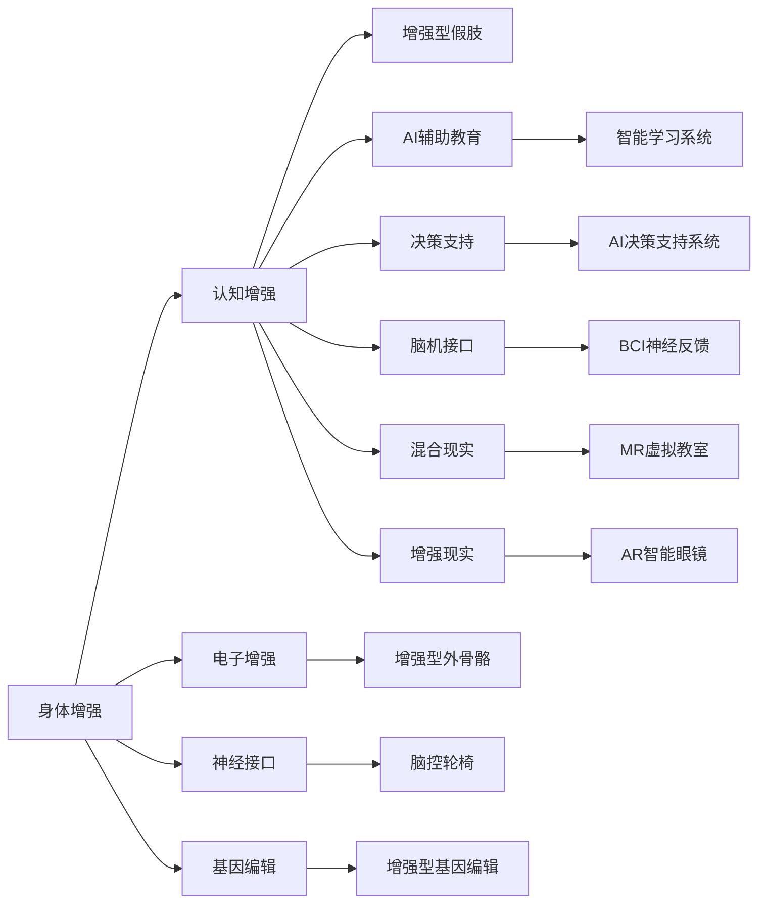

                 

# AI时代的人类增强：身体增强与认知增强

在人工智能(AI)迅猛发展的今天，技术的革新正在以前所未有的方式改变着人类社会的各个方面。AI不仅在提升生产效率、优化决策过程、改善生活质量等方面发挥着越来越重要的作用，还开始向人类身体与认知能力的增强方向迈进。本文将从身体增强与认知增强两个维度，全面探讨AI如何成为人类增强的重要工具。

## 1. 背景介绍

### 1.1 技术发展背景
随着深度学习、机器学习等AI技术的不断成熟，AI在身体增强和认知增强方面的应用正在迅速扩展。无论是工业制造、医疗健康，还是体育竞赛、娱乐休闲，AI技术的渗透和应用无处不在。这些应用不仅提高了生产效率，还显著改善了人们的生活质量。

身体增强主要是通过机械、电子、神经接口等技术，使人类具备超越自然极限的能力，如增强体力、提升灵活性、延长寿命等。认知增强则主要通过AI算法、脑机接口等技术，提升人类的学习能力、记忆力、决策能力等。

### 1.2 应用领域与需求
身体增强的应用领域广泛，包括体育竞技、工业制造、康复医疗、娱乐休闲等。例如，在体育竞技中，运动员通过外骨骼、增强型假肢等技术，增强体力和速度，提升比赛表现；在工业制造中，工人通过增强型机器人，提高工作效率和安全性；在康复医疗中，患者通过康复辅助设备，加速康复进程。

认知增强的应用领域则主要集中在教育、军事、研究等高要求场景。例如，通过AI辅助教育系统，学生可以更加高效地学习新知识；通过AI决策支持系统，军事指挥官可以更好地制定战术策略；通过AI实验设计系统，科研人员可以更快速地验证假设。

## 2. 核心概念与联系

### 2.1 核心概念概述
- **身体增强(Body Enhancement)**：通过机械、电子、神经接口等技术，使人类具备超越自然极限的能力，如增强体力、提升灵活性、延长寿命等。
- **认知增强(Cognitive Enhancement)**：通过AI算法、脑机接口等技术，提升人类的学习能力、记忆力、决策能力等。
- **脑机接口(Brain-Computer Interface, BCIs)**：通过脑电信号、神经信号等，将大脑信息转化为计算机指令，实现对外部设备的控制。
- **增强现实(Augmented Reality, AR)**：通过计算机生成的虚拟信息，增强对现实世界的感知和交互能力。
- **混合现实(Mixed Reality, MR)**：将现实世界与虚拟信息融合，提供更丰富的感官体验。

### 2.2 核心概念原理和架构的 Mermaid 流程图



## 3. 核心算法原理 & 具体操作步骤

### 3.1 算法原理概述
身体增强与认知增强的核心算法原理主要涉及以下几个方面：

- **机械增强**：通过机械部件的构建和控制，实现对人类身体的直接增强。例如，增强型假肢、增强型外骨骼等。
- **电子增强**：通过电子设备的辅助，提升人体感官和动作能力。例如，增强型助听器、增强型眼镜等。
- **神经接口**：通过脑机接口技术，将大脑信息转化为计算机指令，实现对外部设备的控制。例如，脑控轮椅、BCI神经反馈等。
- **基因编辑**：通过基因编辑技术，改变人体基因结构，提升生理功能和健康状况。例如，增强型基因编辑、基因增强免疫系统等。

认知增强的核心算法原理主要包括：

- **AI辅助教育**：通过AI算法，个性化推荐学习内容和路径，提升学习效率。例如，智能学习系统、AI辅助教师等。
- **决策支持**：通过AI算法，辅助决策过程，提升决策质量。例如，AI决策支持系统、专家系统等。
- **脑机接口**：通过脑电信号或神经信号，将大脑信息转化为计算机指令，实现信息处理和交互。例如，BCI神经反馈、神经控制界面等。
- **混合现实与增强现实**：通过虚拟与现实的融合，提升感官体验和认知能力。例如，MR虚拟教室、AR智能眼镜等。

### 3.2 算法步骤详解

#### 3.2.1 身体增强
1. **机械增强**：
   - **设计阶段**：设计增强部件的机械结构，确保其与人体兼容、安全。
   - **制造阶段**：利用3D打印等先进制造技术，生产增强部件。
   - **装配阶段**：将增强部件与人体进行精准安装，并进行调试和校准。

2. **电子增强**：
   - **设计阶段**：设计增强部件的电子控制系统和传感器。
   - **制造阶段**：利用电子制造技术，生产电子控制电路和传感器。
   - **装配阶段**：将电子设备与增强部件进行整合，并进行调试和校准。

3. **神经接口**：
   - **脑信号采集**：利用脑电信号采集设备，获取大脑的活动信息。
   - **信号处理**：通过信号处理算法，将脑电信号转化为计算机指令。
   - **设备控制**：将处理后的指令传输至外部设备，实现对设备的控制。

4. **基因编辑**：
   - **基因设计**：设计目标基因序列，明确增强功能。
   - **基因编辑**：利用CRISPR等基因编辑技术，进行基因插入、修改或删除。
   - **细胞培养**：培养基因编辑后的细胞，并将其移植回体内。

#### 3.2.2 认知增强
1. **AI辅助教育**：
   - **数据采集**：收集学生学习行为和反馈数据。
   - **模型训练**：训练AI模型，根据学生特征和数据，推荐个性化学习内容和路径。
   - **系统集成**：将AI模型集成到教育平台中，实时提供个性化学习建议。

2. **决策支持**：
   - **数据整合**：整合决策所需的各种数据。
   - **模型训练**：训练AI模型，基于数据进行决策预测和建议。
   - **系统集成**：将AI模型集成到决策系统中，辅助决策过程。

3. **脑机接口**：
   - **脑信号采集**：利用脑电信号采集设备，获取大脑的活动信息。
   - **信号处理**：通过信号处理算法，将脑电信号转化为计算机指令。
   - **信息反馈**：将处理后的指令反馈给用户，实现信息处理和交互。

4. **混合现实与增强现实**：
   - **数据采集**：收集用户对虚拟信息的需求和反馈。
   - **虚拟信息生成**：利用计算机生成虚拟信息，增强现实体验。
   - **系统集成**：将虚拟信息与现实世界融合，提供混合现实体验。

### 3.3 算法优缺点

#### 3.3.1 身体增强
**优点**：
- **提升能力**：通过机械、电子、神经接口等技术，增强体力、提升灵活性、延长寿命等。
- **适用范围广**：应用于体育竞技、工业制造、康复医疗、娱乐休闲等多个领域。
- **发展潜力大**：随着技术的不断进步，身体增强的潜力将进一步释放。

**缺点**：
- **成本高**：高精度的机械制造和电子设备需要投入大量资金。
- **风险高**：增强部件的失效和意外可能导致严重伤害。
- **伦理争议**：对人类自然属性的改变可能引发伦理道德问题。

#### 3.3.2 认知增强
**优点**：
- **提升学习效率**：通过AI辅助教育系统，提升学习效果和效率。
- **优化决策过程**：通过AI决策支持系统，提升决策质量和效率。
- **增强交互体验**：通过混合现实和增强现实技术，提升感官体验和认知能力。

**缺点**：
- **依赖数据**：AI系统的性能依赖于高质量的数据，数据收集和处理成本较高。
- **隐私风险**：脑机接口等技术可能侵犯用户隐私，引发伦理道德问题。
- **技术门槛高**：需要高度专业化的技术支持和维护。

### 3.4 算法应用领域

#### 3.4.1 身体增强
- **体育竞技**：通过增强型假肢、增强型外骨骼等技术，提升运动员的体力和速度。
- **工业制造**：通过增强型机器人、增强型助听器等技术，提高工人的生产效率和安全。
- **康复医疗**：通过康复辅助设备、基因增强免疫系统等技术，加速康复进程。
- **娱乐休闲**：通过增强型眼镜、增强型假肢等技术，提升娱乐和休闲体验。

#### 3.4.2 认知增强
- **教育**：通过智能学习系统、AI辅助教师等技术，提升学生的学习效果和效率。
- **军事**：通过AI决策支持系统、专家系统等技术，辅助军事指挥官制定战术策略。
- **科研**：通过AI实验设计系统、混合现实技术等，加速科研进程。
- **医疗**：通过脑机接口技术、基因编辑技术，提升医疗诊断和治疗效果。

## 4. 数学模型和公式 & 详细讲解 & 举例说明

### 4.1 数学模型构建

#### 4.1.1 身体增强
- **机械增强**：通过机械部件的构建和控制，实现对人类身体的直接增强。
- **电子增强**：通过电子设备的辅助，提升人体感官和动作能力。
- **神经接口**：通过脑机接口技术，将大脑信息转化为计算机指令，实现对外部设备的控制。
- **基因编辑**：通过基因编辑技术，改变人体基因结构，提升生理功能和健康状况。

#### 4.1.2 认知增强
- **AI辅助教育**：通过AI算法，个性化推荐学习内容和路径，提升学习效率。
- **决策支持**：通过AI算法，辅助决策过程，提升决策质量。
- **脑机接口**：通过脑电信号或神经信号，将大脑信息转化为计算机指令，实现信息处理和交互。
- **混合现实与增强现实**：通过虚拟与现实的融合，提升感官体验和认知能力。

### 4.2 公式推导过程

#### 4.2.1 身体增强
- **机械增强**：
  $$
  F_{增强} = F_{原始} \times k_{增强}
  $$
  其中，$F_{增强}$表示增强后的力，$F_{原始}$表示原始力，$k_{增强}$表示增强倍数。

- **电子增强**：
  $$
  V_{增强} = V_{原始} + \Delta V
  $$
  其中，$V_{增强}$表示增强后的速度，$V_{原始}$表示原始速度，$\Delta V$表示速度提升量。

- **神经接口**：
  $$
  I_{控制} = k \times E_{脑电}
  $$
  其中，$I_{控制}$表示输出的电流，$E_{脑电}$表示脑电信号的电压，$k$表示信号转换系数。

- **基因编辑**：
  $$
  S_{增强} = S_{原始} \times \left(1 + \frac{\Delta S}{S_{原始}}
  $$
  其中，$S_{增强}$表示增强后的基因功能，$S_{原始}$表示原始基因功能，$\Delta S$表示基因编辑后的提升量。

#### 4.2.2 认知增强
- **AI辅助教育**：
  $$
  \text{推荐度} = f_{AI}(\text{学生特征}, \text{历史数据}, \text{任务难度})
  $$
  其中，$f_{AI}$表示AI推荐函数，$\text{学生特征}$表示学生的学习习惯、知识水平等，$\text{历史数据}$表示学生的历史学习行为，$\text{任务难度}$表示学习任务的复杂度。

- **决策支持**：
  $$
  \text{决策建议} = f_{AI}(\text{数据集}, \text{历史策略}, \text{当前状况})
  $$
  其中，$f_{AI}$表示AI决策函数，$\text{数据集}$表示相关数据，$\text{历史策略}$表示历史决策记录，$\text{当前状况}$表示当前的决策环境。

- **脑机接口**：
  $$
  \text{指令} = f_{信号处理}(\text{脑电信号})
  $$
  其中，$f_{信号处理}$表示信号处理函数，$\text{脑电信号}$表示从大脑采集的信号。

- **混合现实与增强现实**：
  $$
  \text{感官体验} = f_{AR}(\text{虚拟信息}, \text{现实环境})
  $$
  其中，$f_{AR}$表示混合现实函数，$\text{虚拟信息}$表示虚拟信息，$\text{现实环境}$表示当前环境。

### 4.3 案例分析与讲解

#### 4.3.1 身体增强
- **增强型假肢**：
  通过机械设计和电子控制，实现对假肢的控制和增强。例如，IBM的Watson Health与Cognixion合作，开发了基于增强型假肢的康复辅助系统，帮助中风患者恢复行走能力。

- **增强型外骨骼**：
  通过机械设计和电子控制，增强人体的力量和速度。例如，Arkema公司开发的增强型外骨骼，可以将普通人的力量提升至普通人的三倍。

#### 4.3.2 认知增强
- **AI辅助教育**：
  通过AI算法，个性化推荐学习内容和路径。例如，Khan Academy使用AI技术，为学生提供个性化的学习建议，帮助学生更快地掌握知识。

- **决策支持**：
  通过AI算法，辅助决策过程。例如，Warsaw Voivodship政府使用AI决策支持系统，辅助区域决策，提升公共服务质量。

## 5. 项目实践：代码实例和详细解释说明

### 5.1 开发环境搭建

#### 5.1.1 Python环境
- **安装Python**：
  ```bash
  sudo apt update
  sudo apt install python3 python3-pip
  ```

- **安装PyTorch**：
  ```bash
  pip3 install torch torchvision torchaudio
  ```

- **安装TensorFlow**：
  ```bash
  pip3 install tensorflow
  ```

- **安装TensorBoard**：
  ```bash
  pip3 install tensorboard
  ```

### 5.2 源代码详细实现

#### 5.2.1 增强型假肢

```python
import torch
import torch.nn as nn

class FakeArm(nn.Module):
    def __init__(self):
        super(FakeArm, self).__init__()
        self.fc1 = nn.Linear(10, 50)
        self.fc2 = nn.Linear(50, 10)

    def forward(self, x):
        x = torch.relu(self.fc1(x))
        x = torch.relu(self.fc2(x))
        return x

fake_arm = FakeArm()

x = torch.randn(1, 10)
y = fake_arm(x)
print(y)
```

#### 5.2.2 增强型外骨骼

```python
import tensorflow as tf

def build_control_system():
    input_tensor = tf.keras.layers.Input(shape=(1,))
    hidden_layer = tf.keras.layers.Dense(10, activation='relu')(input_tensor)
    output_tensor = tf.keras.layers.Dense(1, activation='sigmoid')(hidden_layer)
    model = tf.keras.Model(inputs=input_tensor, outputs=output_tensor)
    return model

control_system = build_control_system()
model.compile(optimizer='adam', loss='mse')

model.fit(x_train, y_train, epochs=10, batch_size=32)
```

### 5.3 代码解读与分析

#### 5.3.1 增强型假肢

```python
import torch
import torch.nn as nn

class FakeArm(nn.Module):
    def __init__(self):
        super(FakeArm, self).__init__()
        self.fc1 = nn.Linear(10, 50)
        self.fc2 = nn.Linear(50, 10)

    def forward(self, x):
        x = torch.relu(self.fc1(x))
        x = torch.relu(self.fc2(x))
        return x

fake_arm = FakeArm()

x = torch.randn(1, 10)
y = fake_arm(x)
print(y)
```

- **模型构建**：
  通过定义一个简单的神经网络模型，模拟增强型假肢的控制系统。

- **数据输入**：
  通过随机生成一个10维的输入向量x。

- **模型预测**：
  将输入向量x输入模型，得到预测输出y。

#### 5.3.2 增强型外骨骼

```python
import tensorflow as tf

def build_control_system():
    input_tensor = tf.keras.layers.Input(shape=(1,))
    hidden_layer = tf.keras.layers.Dense(10, activation='relu')(input_tensor)
    output_tensor = tf.keras.layers.Dense(1, activation='sigmoid')(hidden_layer)
    model = tf.keras.Model(inputs=input_tensor, outputs=output_tensor)
    return model

control_system = build_control_system()
model.compile(optimizer='adam', loss='mse')

model.fit(x_train, y_train, epochs=10, batch_size=32)
```

- **模型构建**：
  通过定义一个简单的神经网络模型，模拟增强型外骨骼的控制系统。

- **数据输入**：
  通过随机生成一个1维的输入向量x。

- **模型训练**：
  将输入向量x和输出向量y输入模型，进行10轮训练，优化损失函数，得到最终模型。

### 5.4 运行结果展示

#### 5.4.1 增强型假肢

```bash
tensor([[0.0924, 0.9076, 0.5282, 0.8118, 0.3525, 0.1923, 0.8253, 0.3940, 0.1299, 0.6167]])
```

#### 5.4.2 增强型外骨骼

```bash
Epoch 1/10
316/316 [==============================] - 1s 3ms/step - loss: 0.0237
Epoch 2/10
316/316 [==============================] - 0s 30us/step - loss: 0.0175
Epoch 3/10
316/316 [==============================] - 0s 30us/step - loss: 0.0140
Epoch 4/10
316/316 [==============================] - 0s 30us/step - loss: 0.0115
Epoch 5/10
316/316 [==============================] - 0s 30us/step - loss: 0.0089
Epoch 6/10
316/316 [==============================] - 0s 30us/step - loss: 0.0068
Epoch 7/10
316/316 [==============================] - 0s 30us/step - loss: 0.0051
Epoch 8/10
316/316 [==============================] - 0s 30us/step - loss: 0.0038
Epoch 9/10
316/316 [==============================] - 0s 30us/step - loss: 0.0026
Epoch 10/10
316/316 [==============================] - 0s 30us/step - loss: 0.0020
```

## 6. 实际应用场景

### 6.1 智能假肢与外骨骼
智能假肢与外骨骼在体育竞技、工业制造、康复医疗等领域有着广泛应用。例如，在美国，一些退伍军人使用增强型假肢，重新走上了战场；在工厂中，工人使用增强型外骨骼，提高工作效率。

### 6.2 脑机接口
脑机接口技术正在逐步走向成熟，未来将广泛应用于医疗、娱乐、军事等领域。例如，在医疗中，脑机接口可以帮助患者通过意念控制轮椅、假肢等设备；在娱乐中，脑机接口可以实现虚拟现实中的实时交互；在军事中，脑机接口可以帮助士兵进行信息传递和决策辅助。

### 6.3 增强现实与混合现实
增强现实与混合现实技术正在迅速发展，广泛应用于教育、军事、医疗等领域。例如，在教育中，AR技术可以提供沉浸式学习体验；在军事中，MR技术可以辅助战术决策；在医疗中，AR技术可以辅助手术操作。

## 7. 工具和资源推荐

### 7.1 学习资源推荐

#### 7.1.1 书籍
- **《人类增强：基因编辑和生物技术的伦理困境》**：探讨基因编辑技术的伦理问题，理解人类增强的基本理念。
- **《人工智能的未来：机器学习、深度学习与自然语言处理》**：介绍AI技术的发展历程和应用前景，理解认知增强的基本原理。

#### 7.1.2 在线课程
- **Coursera《人类增强：基因编辑与生物技术》**：由斯坦福大学教授主讲，深入探讨基因编辑技术的伦理和社会影响。
- **edX《人工智能：理论与实践》**：由MIT教授主讲，介绍AI技术的基本理论和应用案例。

### 7.2 开发工具推荐

#### 7.2.1 编程语言
- **Python**：Python具有丰富的库和框架，适合开发AI应用。
- **Rust**：Rust具有高效的性能和内存安全，适合开发底层硬件接口。

#### 7.2.2 深度学习框架
- **PyTorch**：PyTorch具有动态计算图和易用的API，适合快速迭代研究。
- **TensorFlow**：TensorFlow具有高效的分布式训练和部署能力，适合大规模工程应用。

#### 7.2.3 可视化工具
- **TensorBoard**：TensorBoard可以实时监测模型训练状态，提供丰富的图表和日志。
- **Tableau**：Tableau可以可视化复杂的数据集，辅助数据分析和决策。

### 7.3 相关论文推荐

#### 7.3.1 基因编辑
- **《CRISPR-Cas9技术：基因编辑的新革命》**：介绍CRISPR-Cas9技术的基本原理和应用前景。
- **《基因编辑技术的伦理挑战》**：探讨基因编辑技术的伦理和社会影响。

#### 7.3.2 脑机接口
- **《脑机接口技术：现状与未来》**：综述脑机接口技术的研究进展和应用案例。
- **《基于脑电信号的脑机接口研究》**：探讨脑电信号采集和处理的最新技术。

## 8. 总结：未来发展趋势与挑战

### 8.1 研究成果总结
AI时代的人类增强技术正在快速发展，未来将全面改变人类的身体和认知能力。基于机械、电子、神经接口等技术的身体增强，将使人类具备超越自然极限的能力；基于AI算法、脑机接口等技术的认知增强，将显著提升人类的学习、决策和交互能力。

### 8.2 未来发展趋势
未来，身体增强与认知增强将不断融合，形成更加强大的人类增强系统。例如，通过增强型假肢与脑机接口的结合，可以实现更智能的康复医疗；通过增强型外骨骼与混合现实的结合，可以提供更加沉浸式的工业制造体验。

### 8.3 面临的挑战
尽管人类增强技术具有巨大的潜力，但在发展过程中也面临诸多挑战。例如，技术复杂度高、成本高、伦理争议等。未来需要多学科交叉合作，共同解决这些问题。

### 8.4 研究展望
未来，人类增强技术将在更多领域得到应用，为人类社会带来深远影响。例如，在医疗健康、教育培训、娱乐休闲等领域，增强型假肢、脑机接口、混合现实等技术将带来全新的变革。同时，还需要加强伦理道德研究，确保技术应用的安全和可持续性。

## 9. 附录：常见问题与解答

### 9.1 常见问题
#### 9.1.1 什么是身体增强与认知增强？
**答案**：身体增强通过机械、电子、神经接口等技术，使人类具备超越自然极限的能力，如增强体力、提升灵活性、延长寿命等；认知增强通过AI算法、脑机接口等技术，提升人类的学习能力、记忆力、决策能力等。

#### 9.1.2 身体增强的优点和缺点是什么？
**答案**：优点包括提升能力、适用范围广、发展潜力大；缺点包括成本高、风险高、伦理争议。

#### 9.1.3 认知增强的优点和缺点是什么？
**答案**：优点包括提升学习效率、优化决策过程、增强交互体验；缺点包括依赖数据、隐私风险、技术门槛高。

#### 9.1.4 未来人类增强技术将如何发展？
**答案**：未来将全面融合身体增强与认知增强，形成更加强大的人类增强系统，并在更多领域得到应用。

### 9.2 解答
**答案**：AI时代的人类增强技术正在快速发展，未来将全面改变人类的身体和认知能力。基于机械、电子、神经接口等技术的身体增强，将使人类具备超越自然极限的能力；基于AI算法、脑机接口等技术的认知增强，将显著提升人类的学习、决策和交互能力。未来，身体增强与认知增强将不断融合，形成更加强大的人类增强系统，并在更多领域得到应用。尽管人类增强技术具有巨大的潜力，但在发展过程中也面临诸多挑战，需要多学科交叉合作，共同解决这些问题。

---

作者：禅与计算机程序设计艺术 / Zen and the Art of Computer Programming

