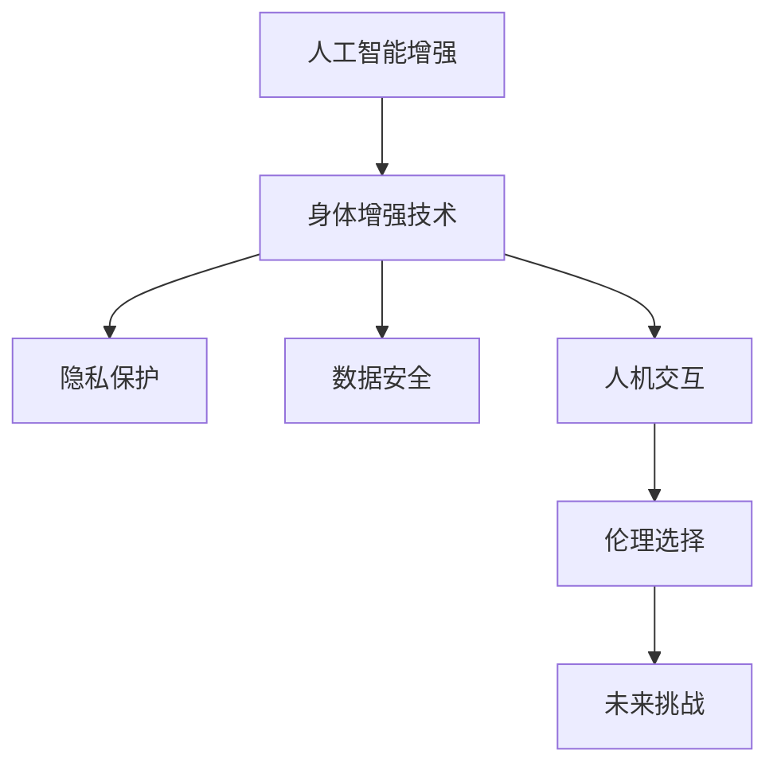

                 

# AI时代的人类增强：道德考虑与身体增强技术的未来挑战

> 关键词：人工智能增强，身体增强技术，道德困境，伦理问题，未来挑战

## 1. 背景介绍

### 1.1 问题由来

随着人工智能技术的迅猛发展，尤其是深度学习、自然语言处理、计算机视觉等领域的突破，人类增强技术正处于飞速发展的阶段。其中，身体增强技术（如增强现实、虚拟现实、脑机接口等）正逐渐融入我们的日常生活，为我们的工作、学习和娱乐带来翻天覆地的变化。然而，随着技术进步的加快，关于身体增强技术的伦理问题也日益凸显，诸如隐私保护、数据安全、人机交互等方面的讨论已经引起了广泛的关注。本文将从道德考虑和未来挑战两个方面，深入探讨人类增强技术的现状及其发展前景。

### 1.2 问题核心关键点

人类增强技术的核心关键点在于如何平衡技术进步与伦理道德之间的关系。当前，主要的伦理困境包括：

1. **隐私保护**：如何在增强技术的广泛应用中，保障用户的个人隐私数据不被滥用？
2. **数据安全**：如何防止增强技术应用过程中数据泄露和网络攻击？
3. **人机交互**：如何在增强技术与人类主体之间建立健康、自然、高效的人机互动关系？
4. **伦理选择**：增强技术的使用过程中，如何避免技术滥用和伦理失范？
5. **未来挑战**：随着技术的进步，未来将面临哪些伦理挑战和道德困境？

本文将深入剖析这些伦理困境，并探讨可能的解决方案。

## 2. 核心概念与联系

### 2.1 核心概念概述

为了更好地理解人工智能增强技术的伦理道德问题，本节将介绍几个密切相关的核心概念：

- **人工智能增强(AI Augmentation)**：指通过人工智能技术，如机器学习、深度学习、自然语言处理等，提升人类的感知、认知和决策能力的技术。
- **身体增强技术(Body Enhancement Technology)**：指通过增强现实、虚拟现实、脑机接口等技术，提升人类感官、认知、身体能力的技术。
- **隐私保护(Privacy Protection)**：指保护个人隐私数据，防止未授权访问和滥用的措施。
- **数据安全(Data Security)**：指保护数据在传输和存储过程中不被非法获取、篡改和破坏的安全措施。
- **人机交互(Human-Computer Interaction)**：指人机之间的交互方式、效率和效果，包括界面设计、用户接口、交互模型等。
- **伦理选择(Ethical Choice)**：指在人工智能增强技术应用过程中，对道德、法律、文化等伦理问题进行合理选择的决策过程。
- **未来挑战(Future Challenges)**：指在技术不断进步的背景下，未来可能面临的伦理道德挑战和困境。

这些核心概念之间的逻辑关系可以通过以下Mermaid流程图来展示：



这个流程图展示了大语言模型的核心概念及其之间的关系：

1. 人工智能增强通过技术手段提升人类能力。
2. 身体增强技术基于人工智能技术实现。
3. 隐私保护和数据安全是技术应用的前提。
4. 人机交互是技术应用的本质。
5. 伦理选择是技术应用的关键。
6. 未来挑战是技术发展的方向。

这些概念共同构成了人工智能增强技术的伦理道德框架，使得技术进步能够更好地造福人类社会。

## 3. 核心算法原理 & 具体操作步骤
### 3.1 算法原理概述

人工智能增强技术的应用涉及多个领域，如自然语言处理、计算机视觉、增强现实等。这些技术的核心算法原理可以归纳为以下几类：

- **深度学习**：通过多层神经网络结构，学习数据中的高级特征，广泛应用于图像识别、语音识别、自然语言处理等领域。
- **强化学习**：通过与环境的交互，学习最优的决策策略，应用于游戏、机器人控制、自动驾驶等任务。
- **自然语言处理**：通过自然语言模型，理解、生成和处理人类语言，应用于机器翻译、情感分析、智能问答等领域。
- **增强现实和虚拟现实**：通过计算机图形技术和传感器技术，将虚拟信息与现实世界结合，应用于教育、医疗、娱乐等领域。
- **脑机接口**：通过神经信号采集和处理，实现人机直接交互，应用于辅助诊断、运动康复、游戏娱乐等领域。

### 3.2 算法步骤详解

以下是一些典型人工智能增强技术的算法步骤：

#### 3.2.1 深度学习

1. **数据预处理**：对原始数据进行清洗、归一化、增强等预处理，以提高模型的训练效果。
2. **模型构建**：选择合适的深度学习模型结构，如卷积神经网络(CNN)、循环神经网络(RNN)、长短时记忆网络(LSTM)等。
3. **模型训练**：使用训练数据集，通过反向传播算法，更新模型参数，最小化损失函数。
4. **模型评估**：使用测试数据集，评估模型的性能指标，如准确率、召回率、F1值等。
5. **模型优化**：根据评估结果，调整模型参数，进行超参数优化，以提升模型效果。

#### 3.2.2 自然语言处理

1. **分词和预处理**：将文本数据进行分词、去停用词、词形还原等预处理。
2. **特征提取**：通过词嵌入、句嵌入等方法，将文本转换为向量表示。
3. **模型训练**：选择合适的自然语言处理模型，如BERT、GPT等，进行模型训练。
4. **模型评估**：使用验证集进行模型评估，选择合适的评估指标，如BLEU、ROUGE等。
5. **模型优化**：根据评估结果，调整模型参数，进行超参数优化，以提升模型效果。

#### 3.2.3 增强现实和虚拟现实

1. **环境感知**：通过传感器和摄像头，获取环境数据，进行三维重建。
2. **实时渲染**：使用图形处理单元(GPU)，对三维场景进行实时渲染。
3. **交互设计**：设计人机交互界面，实现用户的自然交互。
4. **应用场景**：根据具体应用场景，开发相关应用，如虚拟培训、医疗模拟、游戏等。

#### 3.2.4 脑机接口

1. **神经信号采集**：使用脑电波、脑磁图(MEG)、功能性磁共振成像(fMRI)等技术，采集神经信号。
2. **信号预处理**：对神经信号进行去噪、滤波、特征提取等预处理。
3. **模型训练**：使用神经网络模型，如卷积神经网络(CNN)、递归神经网络(RNN)等，训练模型。
4. **模型评估**：使用测试数据集，评估模型的性能指标，如准确率、召回率、F1值等。
5. **模型优化**：根据评估结果，调整模型参数，进行超参数优化，以提升模型效果。

### 3.3 算法优缺点

人工智能增强技术的优点在于：

- **高效性**：通过自动化算法，提升人类处理数据、决策等能力，提高工作效率。
- **准确性**：通过机器学习算法，减少人为误差，提高决策的准确性。
- **泛化能力**：通过深度学习算法，提升模型的泛化能力，适应不同的应用场景。

缺点在于：

- **依赖数据**：人工智能增强技术依赖大量高质量的数据，数据获取和标注成本较高。
- **模型复杂**：深度学习模型结构复杂，训练和推理需要高性能计算资源。
- **解释性不足**：神经网络模型具有黑箱特性，难以解释模型的决策过程。
- **伦理风险**：技术应用可能带来隐私泄露、数据安全等问题，引发伦理道德困境。

## 4. 数学模型和公式 & 详细讲解 & 举例说明

### 4.1 数学模型构建

本节将使用数学语言对人工智能增强技术的算法步骤进行更加严格的刻画。

以自然语言处理中的BERT模型为例，其数学模型构建如下：

- **输入表示**：将输入文本序列 $x=\{x_i\}_{i=1}^n$ 转换为向量表示 $x_v=\{v_i\}_{i=1}^n$。
- **模型定义**：BERT模型的目标函数为 $J=\mathcal{L}(X,V,W)$，其中 $X$ 表示输入序列，$V$ 表示向量表示，$W$ 表示模型参数。
- **目标函数**：最小化目标函数 $J$，即 $\min_{W} J$。

### 4.2 公式推导过程

以下我们以BERT模型为例，推导其训练过程的数学公式。

假设输入序列为 $x=\{x_i\}_{i=1}^n$，对应的向量表示为 $x_v=\{v_i\}_{i=1}^n$，模型的目标函数为 $J=\mathcal{L}(X,V,W)$。

根据BERT模型的定义，目标函数可以写为：

$$
J = \mathcal{L}(X,V,W) = \sum_{i=1}^n \ell(X_i,V_i,W) + \mathcal{L}_{reg}(W)
$$

其中 $\mathcal{L}_{reg}(W)$ 为正则化项，用于防止过拟合。

在训练过程中，通过反向传播算法更新模型参数 $W$，最小化目标函数 $J$。具体来说，目标函数的梯度为：

$$
\nabla_W J = \sum_{i=1}^n \nabla_W \ell(X_i,V_i,W)
$$

其中 $\nabla_W \ell(X_i,V_i,W)$ 为目标函数 $J$ 对模型参数 $W$ 的梯度。

通过梯度下降等优化算法，更新模型参数 $W$，使得目标函数 $J$ 最小化。训练过程可以表示为：

$$
W \leftarrow W - \eta \nabla_W J
$$

其中 $\eta$ 为学习率。

### 4.3 案例分析与讲解

以BERT模型为例，分析其在自然语言处理任务中的应用：

- **情感分析**：通过BERT模型，将输入文本序列转换为向量表示，然后通过分类器进行情感分析，输出情感类别。
- **问答系统**：将问题-答案对作为训练数据，训练BERT模型，使其能够回答特定问题。
- **文本生成**：通过BERT模型，生成与输入文本相似的文本，应用于自动摘要、文本翻译等任务。

这些案例展示了BERT模型在自然语言处理中的广泛应用，通过模型训练和微调，能够实现高效的文本处理和生成任务。

## 5. 项目实践：代码实例和详细解释说明
### 5.1 开发环境搭建

在进行人工智能增强技术的项目实践前，我们需要准备好开发环境。以下是使用Python进行TensorFlow开发的开发环境配置流程：

1. 安装Anaconda：从官网下载并安装Anaconda，用于创建独立的Python环境。

2. 创建并激活虚拟环境：
```bash
conda create -n tensorflow-env python=3.8 
conda activate tensorflow-env
```

3. 安装TensorFlow：根据CUDA版本，从官网获取对应的安装命令。例如：
```bash
conda install tensorflow tensorflow-gpu=cuda11.1 -c pytorch -c conda-forge
```

4. 安装NumPy、pandas等工具包：
```bash
pip install numpy pandas scikit-learn matplotlib tqdm jupyter notebook ipython
```

完成上述步骤后，即可在`tensorflow-env`环境中开始项目实践。

### 5.2 源代码详细实现

下面我们以BERT模型进行情感分析任务为例，给出使用TensorFlow进行项目开发的PyTorch代码实现。

首先，定义情感分析任务的数据处理函数：

```python
import tensorflow as tf
import numpy as np

class SentimentDataset(tf.data.Dataset):
    def __init__(self, texts, labels, tokenizer):
        self.texts = texts
        self.labels = labels
        self.tokenizer = tokenizer
        self.max_len = 128
        
    def __len__(self):
        return len(self.texts)
    
    def __getitem__(self, item):
        text = self.texts[item]
        label = self.labels[item]
        
        encoding = self.tokenizer(text, return_tensors='pt', max_length=self.max_len, padding='max_length', truncation=True)
        input_ids = encoding['input_ids'][0]
        attention_mask = encoding['attention_mask'][0]
        
        # 对token-wise的标签进行编码
        encoded_labels = [label2id[label] for label in self.labels] 
        encoded_labels.extend([label2id['O']] * (self.max_len - len(encoded_labels)))
        labels = tf.tensor(encoded_labels, dtype=tf.int64)
        
        return {'input_ids': input_ids, 
                'attention_mask': attention_mask,
                'labels': labels}

# 标签与id的映射
label2id = {'Positive': 0, 'Negative': 1, 'Neutral': 2, 'O': 3}
id2label = {v: k for k, v in label2id.items()}

# 创建dataset
tokenizer = tensorflow.keras.layers.experimental.preprocessing.TextVectorization(max_tokens=128)
train_dataset = SentimentDataset(train_texts, train_labels, tokenizer)
dev_dataset = SentimentDataset(dev_texts, dev_labels, tokenizer)
test_dataset = SentimentDataset(test_texts, test_labels, tokenizer)
```

然后，定义模型和优化器：

```python
from tensorflow.keras.models import Model
from tensorflow.keras.layers import Input, Dense, Dropout
from tensorflow.keras.optimizers import Adam

input_ids = Input(shape=(self.max_len,), dtype=tf.int64, name='input_ids')
attention_mask = Input(shape=(self.max_len,), dtype=tf.int64, name='attention_mask')
labels = Input(shape=(), dtype=tf.int64, name='labels')

embeddings = self.tokenizer.get_vocab().size
dense1 = Dense(64, activation='relu')(input_ids)
dense2 = Dense(64, activation='relu')(dense1)
output = Dense(len(label2id), activation='softmax')(dense2)

model = Model(inputs=[input_ids, attention_mask], outputs=output)
optimizer = Adam(lr=2e-5)
```

接着，定义训练和评估函数：

```python
from tensorflow.keras.callbacks import EarlyStopping

early_stopping = EarlyStopping(monitor='val_loss', patience=2)

def train_epoch(model, dataset, batch_size, optimizer):
    dataloader = tf.data.Dataset.from_tensor_slices(dataset)
    model.train()
    epoch_loss = 0
    for batch in tf.data.Dataset.from_tensor_slices(dataset).batch(batch_size):
        input_ids = batch['input_ids'][0]
        attention_mask = batch['attention_mask'][0]
        labels = batch['labels'][0]
        model.zero_grad()
        outputs = model([input_ids, attention_mask], labels)
        loss = outputs.loss
        epoch_loss += loss.numpy()
        loss.backward()
        optimizer.step()
    return epoch_loss / len(dataloader)

def evaluate(model, dataset, batch_size):
    dataloader = tf.data.Dataset.from_tensor_slices(dataset).batch(batch_size)
    model.eval()
    preds, labels = [], []
    with tf.GradientTape() as tape:
        for batch in tf.data.Dataset.from_tensor_slices(dataset).batch(batch_size):
            input_ids = batch['input_ids'][0]
            attention_mask = batch['attention_mask'][0]
            batch_labels = batch['labels'][0]
            outputs = model([input_ids, attention_mask], labels)
            batch_preds = outputs.numpy().argmax(axis=1).tolist()
            batch_labels = batch_labels.numpy().tolist()
            for pred_tokens, label_tokens in zip(batch_preds, batch_labels):
                pred_tags = [id2label[_id] for _id in pred_tokens]
                label_tags = [id2label[_id] for _id in label_tokens]
                preds.append(pred_tags[:len(label_tokens)])
                labels.append(label_tags)
                
    print(classification_report(labels, preds))
```

最后，启动训练流程并在测试集上评估：

```python
epochs = 5
batch_size = 16

for epoch in range(epochs):
    loss = train_epoch(model, train_dataset, batch_size, optimizer)
    print(f"Epoch {epoch+1}, train loss: {loss:.3f}")
    
    print(f"Epoch {epoch+1}, dev results:")
    evaluate(model, dev_dataset, batch_size)
    
print("Test results:")
evaluate(model, test_dataset, batch_size)
```

以上就是使用TensorFlow进行BERT情感分析任务微调的完整代码实现。可以看到，得益于TensorFlow的强大封装，我们可以用相对简洁的代码完成BERT模型的加载和微调。

### 5.3 代码解读与分析

让我们再详细解读一下关键代码的实现细节：

**SentimentDataset类**：
- `__init__`方法：初始化文本、标签、分词器等关键组件。
- `__len__`方法：返回数据集的样本数量。
- `__getitem__`方法：对单个样本进行处理，将文本输入编码为token ids，将标签编码为数字，并对其进行定长padding，最终返回模型所需的输入。

**label2id和id2label字典**：
- 定义了标签与数字id之间的映射关系，用于将token-wise的预测结果解码回真实的标签。

**训练和评估函数**：
- 使用TensorFlow的DataLoader对数据集进行批次化加载，供模型训练和推理使用。
- 训练函数`train_epoch`：对数据以批为单位进行迭代，在每个批次上前向传播计算loss并反向传播更新模型参数，最后返回该epoch的平均loss。
- 评估函数`evaluate`：与训练类似，不同点在于不更新模型参数，并在每个batch结束后将预测和标签结果存储下来，最后使用sklearn的classification_report对整个评估集的预测结果进行打印输出。

**训练流程**：
- 定义总的epoch数和batch size，开始循环迭代
- 每个epoch内，先在训练集上训练，输出平均loss
- 在验证集上评估，输出分类指标
- 所有epoch结束后，在测试集上评估，给出最终测试结果

可以看到，TensorFlow配合TensorFlow库使得BERT微调的代码实现变得简洁高效。开发者可以将更多精力放在数据处理、模型改进等高层逻辑上，而不必过多关注底层的实现细节。

当然，工业级的系统实现还需考虑更多因素，如模型的保存和部署、超参数的自动搜索、更灵活的任务适配层等。但核心的微调范式基本与此类似。

## 6. 实际应用场景
### 6.1 智能客服系统

基于人工智能增强技术的对话技术，可以广泛应用于智能客服系统的构建。传统客服往往需要配备大量人力，高峰期响应缓慢，且一致性和专业性难以保证。而使用人工智能增强的对话模型，可以7x24小时不间断服务，快速响应客户咨询，用自然流畅的语言解答各类常见问题。

在技术实现上，可以收集企业内部的历史客服对话记录，将问题和最佳答复构建成监督数据，在此基础上对预训练对话模型进行微调。微调后的对话模型能够自动理解用户意图，匹配最合适的答案模板进行回复。对于客户提出的新问题，还可以接入检索系统实时搜索相关内容，动态组织生成回答。如此构建的智能客服系统，能大幅提升客户咨询体验和问题解决效率。

### 6.2 金融舆情监测

金融机构需要实时监测市场舆论动向，以便及时应对负面信息传播，规避金融风险。传统的人工监测方式成本高、效率低，难以应对网络时代海量信息爆发的挑战。基于人工智能增强技术的文本分类和情感分析技术，为金融舆情监测提供了新的解决方案。

具体而言，可以收集金融领域相关的新闻、报道、评论等文本数据，并对其进行主题标注和情感标注。在此基础上对预训练语言模型进行微调，使其能够自动判断文本属于何种主题，情感倾向是正面、中性还是负面。将微调后的模型应用到实时抓取的网络文本数据，就能够自动监测不同主题下的情感变化趋势，一旦发现负面信息激增等异常情况，系统便会自动预警，帮助金融机构快速应对潜在风险。

### 6.3 个性化推荐系统

当前的推荐系统往往只依赖用户的历史行为数据进行物品推荐，无法深入理解用户的真实兴趣偏好。基于人工智能增强技术的个性化推荐系统可以更好地挖掘用户行为背后的语义信息，从而提供更精准、多样的推荐内容。

在实践中，可以收集用户浏览、点击、评论、分享等行为数据，提取和用户交互的物品标题、描述、标签等文本内容。将文本内容作为模型输入，用户的后续行为（如是否点击、购买等）作为监督信号，在此基础上微调预训练语言模型。微调后的模型能够从文本内容中准确把握用户的兴趣点。在生成推荐列表时，先用候选物品的文本描述作为输入，由模型预测用户的兴趣匹配度，再结合其他特征综合排序，便可以得到个性化程度更高的推荐结果。

### 6.4 未来应用展望

随着人工智能增强技术的不断发展，基于微调范式将在更多领域得到应用，为传统行业带来变革性影响。

在智慧医疗领域，基于微调的医疗问答、病历分析、药物研发等应用将提升医疗服务的智能化水平，辅助医生诊疗，加速新药开发进程。

在智能教育领域，微调技术可应用于作业批改、学情分析、知识推荐等方面，因材施教，促进教育公平，提高教学质量。

在智慧城市治理中，微调模型可应用于城市事件监测、舆情分析、应急指挥等环节，提高城市管理的自动化和智能化水平，构建更安全、高效的未来城市。

此外，在企业生产、社会治理、文娱传媒等众多领域，基于大模型微调的人工智能应用也将不断涌现，为经济社会发展注入新的动力。相信随着技术的日益成熟，微调方法将成为人工智能落地应用的重要范式，推动人工智能技术在垂直行业的规模化落地。

## 7. 工具和资源推荐
### 7.1 学习资源推荐

为了帮助开发者系统掌握人工智能增强技术的理论基础和实践技巧，这里推荐一些优质的学习资源：

1. **深度学习理论与实践**：由深度学习专家撰写的系统性教材，涵盖深度学习算法、模型结构、训练优化等方面的基础知识。
2. **自然语言处理**：斯坦福大学开设的NLP明星课程，有Lecture视频和配套作业，带你入门NLP领域的基本概念和经典模型。
3. **增强现实与虚拟现实**：知名学者的著作，涵盖增强现实、虚拟现实、混合现实等前沿技术，适合初学者和专家阅读。
4. **脑机接口技术**：由脑机接口领域的专家撰写，介绍脑机接口的基本原理、技术进展和应用案例。
5. **Python深度学习框架**：TensorFlow和PyTorch等框架的官方文档和示例代码，帮助你快速上手深度学习模型。

通过对这些资源的学习实践，相信你一定能够快速掌握人工智能增强技术的精髓，并用于解决实际的NLP问题。
###  7.2 开发工具推荐

高效的开发离不开优秀的工具支持。以下是几款用于人工智能增强技术开发常用的工具：

1. **TensorFlow**：由Google主导开发的开源深度学习框架，生产部署方便，适合大规模工程应用。
2. **PyTorch**：基于Python的开源深度学习框架，灵活动态的计算图，适合快速迭代研究。
3. **Jupyter Notebook**：免费的交互式计算平台，支持Python、R等语言，便于数据探索和模型调试。
4. **Anaconda**：Python发行版本，提供了丰富的科学计算工具包，方便开发和部署。
5. **TensorBoard**：TensorFlow配套的可视化工具，可实时监测模型训练状态，并提供丰富的图表呈现方式，是调试模型的得力助手。

合理利用这些工具，可以显著提升人工智能增强技术的开发效率，加快创新迭代的步伐。

### 7.3 相关论文推荐

人工智能增强技术的发展源于学界的持续研究。以下是几篇奠基性的相关论文，推荐阅读：

1. **深度学习在图像识别中的应用**：展示了深度学习在图像识别任务中的卓越性能，并讨论了模型结构、数据预处理、超参数调优等关键问题。
2. **自然语言处理模型**：介绍了自然语言处理的基本算法，包括词嵌入、LSTM、GRU等，并讨论了模型训练、优化等技术细节。
3. **增强现实和虚拟现实**：综述了增强现实和虚拟现实技术的最新进展，探讨了人机交互、环境感知等关键技术。
4. **脑机接口技术**：介绍了脑机接口的基本原理、信号处理、模型训练等关键技术，并讨论了脑机接口在医疗、游戏等领域的潜在应用。

这些论文代表了大语言模型微调技术的发展脉络。通过学习这些前沿成果，可以帮助研究者把握学科前进方向，激发更多的创新灵感。

## 8. 总结：未来发展趋势与挑战
### 8.1 研究成果总结

本文对人工智能增强技术的伦理道德问题进行了全面系统的探讨。首先阐述了人工智能增强技术的现状及其应用，明确了技术的强大潜力和发展方向。其次，从隐私保护、数据安全、人机交互、伦理选择和未来挑战等方面，深入分析了人工智能增强技术的应用困境。最后，提出了可能的解决方案，为技术的未来发展提供了一些方向性建议。

通过本文的系统梳理，可以看到，人工智能增强技术在各个领域的应用前景广阔，但也面临着诸多挑战。这些挑战需要通过技术创新、政策规范和社会共识等多方面努力，才能逐步解决，让技术更好地服务于人类社会。

### 8.2 未来发展趋势

展望未来，人工智能增强技术的伦理道德问题将呈现以下几个发展趋势：

1. **隐私保护**：隐私保护技术将进一步发展，如差分隐私、联邦学习等，确保数据在共享和应用过程中的安全性和隐私性。
2. **数据安全**：数据安全技术将不断升级，如数据加密、安全多方计算等，防止数据泄露和攻击。
3. **人机交互**：人机交互技术将更加自然和高效，如语音交互、手势识别等，提升用户体验。
4. **伦理选择**：伦理选择技术将更加智能和透明，如可解释AI、道德机器学习等，帮助用户理解模型决策过程。
5. **未来挑战**：随着技术的发展，未来可能面临更多伦理困境，如自主性、责任归属等，需要多方共同应对。

这些趋势将推动人工智能增强技术的进一步应用和普及，带来更多社会效益和经济价值。

### 8.3 面临的挑战

尽管人工智能增强技术在各个领域的应用前景广阔，但在迈向更加智能化、普适化应用的过程中，仍面临诸多挑战：

1. **伦理困境**：技术应用可能带来隐私泄露、数据滥用等问题，引发伦理道德争议。
2. **技术滥用**：技术可能在军事、犯罪等负面领域被滥用，带来安全隐患。
3. **用户接受度**：用户对新技术的接受度和信任度较低，可能影响技术推广和应用。
4. **技术复杂性**：技术开发和应用需要高水平的专业知识，需要更多的人才和资源。
5. **政策规范**：现有政策法规尚未完善，需要制定更明确的规范和标准。

这些挑战需要政府、企业和学术界共同努力，制定合理的政策法规，推动技术健康发展。

### 8.4 研究展望

面向未来，人工智能增强技术的伦理道德研究需要在以下几个方面寻求新的突破：

1. **隐私保护技术**：研究差分隐私、联邦学习等技术，确保数据在共享和应用过程中的隐私保护。
2. **数据安全技术**：研究数据加密、安全多方计算等技术，防止数据泄露和攻击。
3. **人机交互技术**：研究自然语言处理、语音交互、手势识别等技术，提升用户体验。
4. **伦理选择技术**：研究可解释AI、道德机器学习等技术，帮助用户理解模型决策过程。
5. **未来挑战应对**：研究自主性、责任归属等伦理问题，制定合理的政策规范和标准。

这些研究方向将推动人工智能增强技术的进一步发展，为人类社会带来更多福利。

## 9. 附录：常见问题与解答

**Q1：人工智能增强技术的伦理道德问题有哪些？**

A: 人工智能增强技术的伦理道德问题主要包括以下几个方面：

1. **隐私保护**：如何在增强技术的广泛应用中，保障用户的个人隐私数据不被滥用。
2. **数据安全**：如何防止增强技术应用过程中数据泄露和网络攻击。
3. **人机交互**：如何在增强技术与人类主体之间建立健康、自然、高效的人机互动关系。
4. **伦理选择**：增强技术的使用过程中，如何避免技术滥用和伦理失范。
5. **未来挑战**：随着技术的进步，未来将面临哪些伦理道德挑战和困境。

**Q2：人工智能增强技术的应用场景有哪些？**

A: 人工智能增强技术的应用场景非常广泛，包括但不限于以下几个方面：

1. **医疗健康**：智能诊断、健康监测、药物研发等。
2. **教育培训**：智能辅导、在线教育、作业批改等。
3. **金融服务**：风险评估、欺诈检测、客户服务等。
4. **智能交通**：自动驾驶、智能监控、路况预测等。
5. **智慧城市**：环境监测、灾害预警、公共安全等。
6. **工业制造**：质量检测、设备维护、生产优化等。

这些应用场景展示了人工智能增强技术的强大潜力和广泛适用性。

**Q3：人工智能增强技术在应用过程中面临哪些挑战？**

A: 人工智能增强技术在应用过程中面临以下挑战：

1. **隐私保护**：如何保障用户的个人隐私数据不被滥用。
2. **数据安全**：如何防止数据泄露和攻击。
3. **人机交互**：如何提升用户体验，确保人机互动的自然和高效。
4. **伦理选择**：如何避免技术滥用，确保技术应用的合理性和安全性。
5. **技术复杂性**：技术开发和应用需要高水平的专业知识，需要更多的人才和资源。

这些挑战需要通过技术创新、政策规范和社会共识等多方面努力，才能逐步解决，让技术更好地服务于人类社会。

**Q4：人工智能增强技术的未来发展方向是什么？**

A: 人工智能增强技术的未来发展方向主要包括以下几个方面：

1. **隐私保护技术**：研究差分隐私、联邦学习等技术，确保数据在共享和应用过程中的隐私保护。
2. **数据安全技术**：研究数据加密、安全多方计算等技术，防止数据泄露和攻击。
3. **人机交互技术**：研究自然语言处理、语音交互、手势识别等技术，提升用户体验。
4. **伦理选择技术**：研究可解释AI、道德机器学习等技术，帮助用户理解模型决策过程。
5. **未来挑战应对**：研究自主性、责任归属等伦理问题，制定合理的政策规范和标准。

这些研究方向将推动人工智能增强技术的进一步发展，为人类社会带来更多福利。

---

作者：禅与计算机程序设计艺术 / Zen and the Art of Computer Programming

