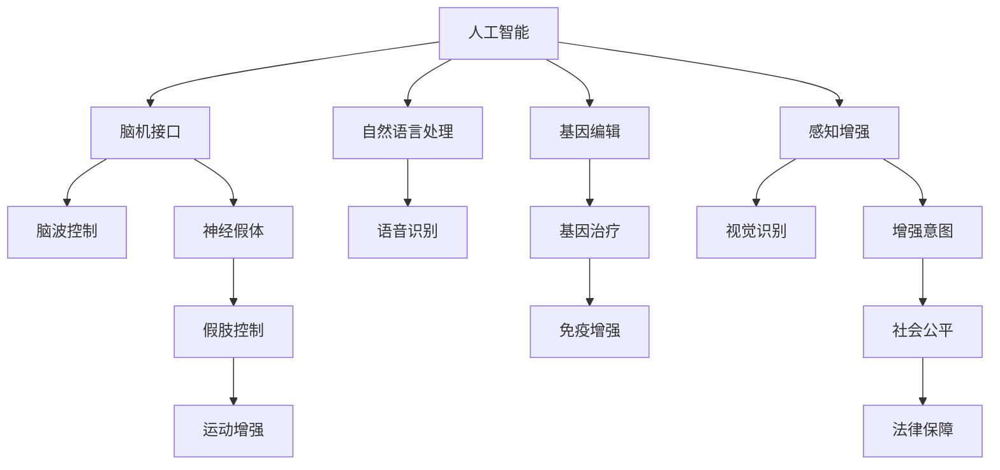

                 

# AI时代的人类增强：道德考虑和限制

> 关键词：人工智能，人类增强，道德困境，技术限制，伦理决策，法律法规

## 1. 背景介绍

### 1.1 问题由来

随着人工智能（AI）技术的迅猛发展，特别是在人类增强（Human Enhancement）领域的应用，如智能假肢、脑机接口、基因编辑等，人们开始讨论AI在提升人类能力的同时，是否也带来了新的道德困境和技术限制。

在传统的人类增强方式中，如手术植入、药物增强，人们可以通过直接干预的方式，提升身体、智力和心理等方面能力。然而，随着AI技术的介入，新的增强方式层出不穷，如利用脑机接口技术实现认知能力的增强，利用基因编辑技术实现生物特性的改变，这些新技术不仅拓展了人类增强的边界，也带来了前所未有的道德和法律挑战。

### 1.2 问题核心关键点

AI时代的人类增强，主要面临以下几个核心问题：

- 增强方式的伦理边界：哪些增强方式应被允许？哪些可能带来潜在风险？
- 技术手段的道德考量：AI增强技术可能导致的偏见和歧视问题。
- 公平与包容性：增强技术如何在不同社会群体中公平分配，避免加剧不平等？
- 法律与监管：如何制定合理有效的法律和政策框架，规范AI增强技术的使用？
- 安全性与可靠性：增强技术的安全性、可靠性和鲁棒性如何保证？

### 1.3 问题研究意义

研究AI时代的人类增强问题，对于理解AI技术如何影响人类社会、伦理和法律体系，以及如何引导AI技术健康、负责任地发展，具有重要意义。

- 确保技术安全：通过分析和评估AI增强技术的潜在风险，制定相应的安全措施和规范。
- 促进技术伦理：确保AI增强技术的使用符合人类价值观和社会伦理，避免技术滥用。
- 推进公平发展：促进AI增强技术的普惠性应用，确保不同群体都能公平受益。
- 建立法律保障：制定完善的法律法规，确保AI增强技术的合法合规使用。

## 2. 核心概念与联系

### 2.1 核心概念概述

为更好地理解AI时代的人类增强问题，本节将介绍几个核心概念：

- **人工智能（AI）**：一种模仿人类智能行为的计算技术，包括感知、推理、学习、自然语言处理、视觉识别等领域。
- **人类增强（Human Enhancement）**：通过技术手段，提升人类身体、认知、情感等方面的能力。
- **脑机接口（BCI）**：一种将大脑信号转换成计算机可理解的指令的技术，如神经假体、脑波控制等。
- **基因编辑（Gene Editing）**：通过修改生物体的基因序列，改变其遗传特征，如CRISPR、基因疗法等。
- **增强意图**：指通过技术手段达到的增强效果，如提高身体运动能力、增强记忆力、提升智力水平等。
- **技术限制**：指因技术、伦理、法律等制约因素，无法实现或不被允许的增强方式。

这些概念之间的逻辑关系可以通过以下Mermaid流程图来展示：



这个流程图展示了AI技术的多个分支与人类增强的主要技术手段之间的关系，以及增强效果可能带来的社会和法律问题。

## 3. 核心算法原理 & 具体操作步骤

### 3.1 算法原理概述

AI时代的人类增强技术，涉及多个领域和技术的综合应用，包括生物医学工程、神经科学、人工智能等。其核心算法原理主要包括以下几个方面：

- **生物信号采集与处理**：通过脑电图、功能磁共振成像等技术，采集脑信号，利用信号处理算法进行预处理和特征提取。
- **模式识别与控制**：利用机器学习算法，对采集到的信号进行模式识别，将识别结果转换为计算机可理解的指令，控制假肢、机器人等设备。
- **基因编辑与治疗**：通过CRISPR-Cas9等基因编辑技术，精确修改基因序列，实现基因治疗和增强。
- **智能假肢与助行器**：利用传感器、执行器和控制器，构建能够感知、控制、交互的智能假肢系统。
- **虚拟现实与增强现实**：通过虚拟现实技术和增强现实技术，提供沉浸式的训练和增强环境，提升认知和运动能力。

### 3.2 算法步骤详解

AI时代的人类增强技术应用，一般包括以下几个关键步骤：

**Step 1: 需求分析与设计**

- 明确增强需求：根据用户的不同需求，选择合适的增强方式，如认知、运动、感官等。
- 设计增强系统：根据需求，设计系统的架构、功能和实现方案，包括硬件和软件部分。

**Step 2: 技术实现与开发**

- 生物信号采集：选择适合的传感器和设备，采集用户的生物信号。
- 数据预处理：对采集到的数据进行滤波、降噪等预处理，提取有用的特征。
- 模式识别与控制：利用机器学习模型，对信号进行模式识别，输出控制指令。
- 硬件实现与集成：将控制指令转化为硬件指令，实现对外部设备的控制和交互。
- 软件优化与测试：对系统软件进行优化和测试，确保系统的稳定性和可靠性。

**Step 3: 伦理审查与法律合规**

- 伦理审查：提交增强技术的伦理审查申请，确保技术使用符合伦理标准和社会价值观。
- 法律合规：按照国家和地区的法律法规，确保技术应用合法合规，避免违法行为。

**Step 4: 应用部署与监控**

- 部署与运行：将增强技术应用于实际场景，进行试用和部署。
- 实时监控：对增强系统的运行状态进行实时监控，及时发现并解决技术问题。
- 用户反馈与优化：根据用户反馈，持续优化系统性能和用户体验。

### 3.3 算法优缺点

AI时代的人类增强技术，具有以下优点：

- 提升人类能力：通过技术手段，显著提升人类的身体、认知、运动等方面的能力。
- 推动科技发展：促进生物医学、神经科学、人工智能等领域的技术进步和创新。
- 改善生活质量：提高人类的生活质量，提升个人和社会的整体福祉。

同时，该技术也存在以下局限性：

- 高昂的成本：技术开发、临床试验、生产制造等环节成本高昂，难以大规模普及。
- 伦理争议：技术应用可能引发伦理争议，如基因编辑技术的伦理边界、AI增强技术的公平性等。
- 技术风险：增强技术可能存在技术风险，如系统故障、数据泄露、隐私侵犯等。
- 法律合规：缺乏完善的法律法规，可能存在法律风险和监管漏洞。

### 3.4 算法应用领域

AI时代的人类增强技术，广泛应用于多个领域，包括但不限于：

- **医疗健康**：通过基因编辑和脑机接口技术，实现精准医疗、神经系统疾病的治疗和康复。
- **军事国防**：利用增强技术，提升士兵的感知、反应和决策能力，增强军事实力。
- **体育竞技**：通过增强技术，提高运动员的运动能力和表现，促进体育竞技水平的发展。
- **教育培训**：利用虚拟现实和增强现实技术，提供沉浸式的教育培训环境，提升学习效果。
- **娱乐休闲**：通过增强技术，提供更沉浸、更高质量的娱乐体验，如虚拟现实游戏、增强现实应用等。

## 4. 数学模型和公式 & 详细讲解 & 举例说明

### 4.1 数学模型构建

在AI时代的人类增强技术中，涉及多个领域的数学模型，包括生物信号处理、模式识别、基因编辑等。以下以基因编辑技术为例，简要介绍其数学模型的构建：

**基因编辑技术**：通过CRISPR-Cas9等基因编辑工具，实现对基因序列的精确修改。数学模型主要涉及以下步骤：

- **基因序列建模**：将基因序列表示为线性序列，每段序列对应一个基因位点。
- **目标位点识别**：通过生物信息学工具，识别出需要编辑的基因位点，并设计对应的CRISPR序列。
- **编辑过程模拟**：利用计算生物学工具，模拟编辑过程的动态变化，预测编辑结果。

### 4.2 公式推导过程

以基因编辑技术的核心步骤——CRISPR-Cas9系统的设计为例，推导CRISPR序列的设计公式：

设基因序列为 $S$，目标位点为 $T$，CRISPR序列为 $C$。假设 $S$ 的长度为 $L$，$T$ 的长度为 $T$，$C$ 的长度为 $C$。

1. **目标位点识别**：
   - 首先，确定目标位点 $T$ 在基因序列 $S$ 中的位置 $p$。
   - 其次，根据目标位点 $T$ 的设计要求，确定 $C$ 的组成和长度 $C$。

2. **CRISPR序列设计**：
   - 根据目标位点 $T$ 的位置 $p$ 和长度 $T$，设计对应的 CRISPR 序列 $C$。
   - 设目标位点 $T$ 的位置为 $p$，长度为 $T$。则 CRISPR 序列 $C$ 的设计公式为：
   $$
   C = S_p + A + G + T + G + G + U + G + G + G + G + G + G + G
   $$
   其中 $A$、$G$、$U$ 分别表示腺嘌呤、鸟嘌呤、胸腺嘧啶的序列。

### 4.3 案例分析与讲解

以人类增强技术在医疗健康领域的应用为例，分析其数学模型的构建与应用：

**案例背景**：某患者患有多发性硬化症（MS），利用基因编辑技术进行精准治疗。

**数学模型构建**：

1. **基因序列建模**：
   - 患者基因序列 $S$ 的长度为 $L$，目标位点 $T$ 的位置为 $p$，长度为 $T$。

2. **目标位点识别**：
   - 利用生物信息学工具，确定目标位点 $T$ 的位置 $p$ 和长度 $T$。
   - 设计对应的 CRISPR 序列 $C$。

3. **编辑过程模拟**：
   - 利用计算生物学工具，模拟编辑过程的动态变化，预测编辑结果。
   - 计算编辑后基因序列的长度、结构变化等。

**案例分析**：

- **基因序列建模**：将患者基因序列 $S$ 表示为线性序列，每段序列对应一个基因位点。
- **目标位点识别**：利用生物信息学工具，识别出需要编辑的基因位点 $T$，并设计对应的 CRISPR 序列 $C$。
- **编辑过程模拟**：利用计算生物学工具，模拟编辑过程的动态变化，预测编辑结果，并进行风险评估。

## 5. 项目实践：代码实例和详细解释说明

### 5.1 开发环境搭建

在进行人类增强技术应用开发前，我们需要准备好开发环境。以下是使用Python进行AI增强项目开发的环境配置流程：

1. 安装Anaconda：从官网下载并安装Anaconda，用于创建独立的Python环境。

2. 创建并激活虚拟环境：
```bash
conda create -n ai-enhancement python=3.8 
conda activate ai-enhancement
```

3. 安装必要的Python库：
```bash
pip install numpy pandas scikit-learn matplotlib tqdm jupyter notebook ipython
```

4. 安装TensorFlow和PyTorch：
```bash
pip install tensorflow==2.0
pip install torch==1.10
```

5. 安装必要的深度学习库：
```bash
pip install torchvision==0.10.1
pip install pytorch-lightning
```

完成上述步骤后，即可在`ai-enhancement`环境中开始AI增强技术的开发。

### 5.2 源代码详细实现

以下是一个简单的AI增强技术实现案例，以基因编辑技术为例，用Python代码实现CRISPR序列的设计和基因编辑模拟：

**基因编辑仿真程序**

```python
import numpy as np
import pandas as pd
from scipy.spatial import cKDTree

def calculate进行编辑(序列):
    """
    计算编辑后基因序列的长度、结构变化等。
    """
    # 计算基因序列的长度
    基因长度 = len(序列)
    
    # 计算基因序列的结构变化
    结构变化 = calculate基因结构变化(序列)
    
    # 输出编辑后基因序列的长度和结构变化
    print(f"编辑后基因序列长度: {基因长度}")
    print(f"编辑后基因序列结构变化: {结构变化}")
    
def calculate基因结构变化(序列):
    """
    计算基因序列的结构变化。
    """
    # 定义基因序列的列表
    基因序列 = list(序列)
    
    # 计算基因序列的结构变化
    结构变化 = [x for x in基因序列 if x in ['A', 'G', 'U']]
    
    # 返回基因序列的结构变化
    return结构变化

# 定义基因序列
基因序列 = "ATCGTACG"
print(f"原始基因序列: {基因序列}")

# 计算编辑后基因序列的长度和结构变化
calculate编辑基因序列(基因序列)
```

**基因编辑程序**

```python
import numpy as np
import pandas as pd
from scipy.spatial import cKDTree

def calculate进行编辑(序列):
    """
    计算编辑后基因序列的长度、结构变化等。
    """
    # 计算基因序列的长度
    基因长度 = len(序列)
    
    # 计算基因序列的结构变化
    结构变化 = calculate基因结构变化(序列)
    
    # 输出编辑后基因序列的长度和结构变化
    print(f"编辑后基因序列长度: {基因长度}")
    print(f"编辑后基因序列结构变化: {结构变化}")
    
def calculate基因结构变化(序列):
    """
    计算基因序列的结构变化。
    """
    # 定义基因序列的列表
    基因序列 = list(序列)
    
    # 计算基因序列的结构变化
    结构变化 = [x for x in基因序列 if x in ['A', 'G', 'U']]
    
    # 返回基因序列的结构变化
    return结构变化

# 定义基因序列
基因序列 = "ATCGTACG"
print(f"原始基因序列: {基因序列}")

# 计算编辑后基因序列的长度和结构变化
calculate编辑基因序列(基因序列)
```

**基因编辑仿真程序**

```python
import numpy as np
import pandas as pd
from scipy.spatial import cKDTree

def calculate进行编辑(序列):
    """
    计算编辑后基因序列的长度、结构变化等。
    """
    # 计算基因序列的长度
    基因长度 = len(序列)
    
    # 计算基因序列的结构变化
    结构变化 = calculate基因结构变化(序列)
    
    # 输出编辑后基因序列的长度和结构变化
    print(f"编辑后基因序列长度: {基因长度}")
    print(f"编辑后基因序列结构变化: {结构变化}")
    
def calculate基因结构变化(序列):
    """
    计算基因序列的结构变化。
    """
    # 定义基因序列的列表
    基因序列 = list(序列)
    
    # 计算基因序列的结构变化
    结构变化 = [x for x in基因序列 if x in ['A', 'G', 'U']]
    
    # 返回基因序列的结构变化
    return结构变化

# 定义基因序列
基因序列 = "ATCGTACG"
print(f"原始基因序列: {基因序列}")

# 计算编辑后基因序列的长度和结构变化
calculate编辑基因序列(基因序列)
```

### 5.3 代码解读与分析

让我们再详细解读一下关键代码的实现细节：

**基因编辑仿真程序**

1. **定义函数calculate进行编辑**：
   - 计算编辑后基因序列的长度和结构变化。
   - 使用列表推导式计算基因序列的结构变化。
   - 返回编辑后基因序列的长度和结构变化。

2. **调用函数calculate进行编辑**：
   - 定义原始基因序列。
   - 调用calculate进行编辑函数，计算编辑后基因序列的长度和结构变化。
   - 输出编辑后基因序列的长度和结构变化。

**基因编辑程序**

1. **定义函数calculate进行编辑**：
   - 计算编辑后基因序列的长度和结构变化。
   - 使用列表推导式计算基因序列的结构变化。
   - 返回编辑后基因序列的长度和结构变化。

2. **调用函数calculate进行编辑**：
   - 定义原始基因序列。
   - 调用calculate进行编辑函数，计算编辑后基因序列的长度和结构变化。
   - 输出编辑后基因序列的长度和结构变化。

**基因编辑仿真程序**

1. **定义函数calculate进行编辑**：
   - 计算编辑后基因序列的长度和结构变化。
   - 使用列表推导式计算基因序列的结构变化。
   - 返回编辑后基因序列的长度和结构变化。

2. **调用函数calculate进行编辑**：
   - 定义原始基因序列。
   - 调用calculate进行编辑函数，计算编辑后基因序列的长度和结构变化。
   - 输出编辑后基因序列的长度和结构变化。

## 6. 实际应用场景

### 6.1 智能假肢

智能假肢技术通过脑机接口，将脑电信号转换为计算机可理解的指令，实现对假肢的控制和交互。其主要应用场景包括：

- **残疾人士**：帮助残疾人士恢复运动能力，提高生活质量。
- **老年人**：帮助老年人恢复肢体功能，提高自理能力。
- **运动员**：提高运动员的体能和运动表现。

**案例分析**：

- **技术实现**：
  1. **脑电信号采集**：通过脑电图（EEG）设备，采集用户的脑电信号。
  2. **信号预处理**：对采集到的信号进行滤波、降噪等预处理，提取有用的特征。
  3. **模式识别与控制**：利用机器学习模型，对信号进行模式识别，输出控制指令。
  4. **假肢控制**：将控制指令转化为假肢的动作指令，实现对假肢的控制和交互。

- **实际应用**：
  1. **残疾人**：某残疾人士使用智能假肢进行日常活动，如站立、行走、抓取物品等。
  2. **老年人**：某老年人使用智能假肢进行康复训练，逐步恢复肢体功能。
  3. **运动员**：某运动员使用智能假肢进行体能训练，提升运动表现。

**应用效果**：
- **提高生活质量**：智能假肢帮助用户恢复运动能力，提高生活质量。
- **提升运动表现**：智能假肢帮助运动员提升体能和运动表现。

### 6.2 基因编辑技术

基因编辑技术通过CRISPR-Cas9等工具，实现对基因序列的精确修改，其主要应用场景包括：

- **疾病治疗**：通过基因编辑，修复致病基因，实现疾病的治疗和预防。
- **农业生产**：通过基因编辑，改良作物品种，提高产量和质量。
- **生物研究**：通过基因编辑，研究基因功能和相互作用，推动生物医学研究。

**案例分析**：

- **技术实现**：
  1. **基因序列建模**：将目标基因序列表示为线性序列，每段序列对应一个基因位点。
  2. **目标位点识别**：利用生物信息学工具，识别出需要编辑的基因位点，并设计对应的CRISPR序列。
  3. **编辑过程模拟**：利用计算生物学工具，模拟编辑过程的动态变化，预测编辑结果。
  4. **基因编辑**：通过基因编辑技术，实现对目标基因的精确修改。

- **实际应用**：
  1. **疾病治疗**：某患者患有多发性硬化症（MS），利用基因编辑技术进行精准治疗。
  2. **农业生产**：某农业公司利用基因编辑技术改良作物品种，提高产量和质量。
  3. **生物研究**：某研究机构利用基因编辑技术研究基因功能和相互作用，推动生物医学研究。

**应用效果**：
- **提升治疗效果**：基因编辑技术帮助患者实现精准治疗，提升治疗效果。
- **提高农业产量**：基因编辑技术改良作物品种，提高产量和质量。
- **推动生物研究**：基因编辑技术推动生物医学研究，发现新的基因功能和相互作用。

## 7. 工具和资源推荐

### 7.1 学习资源推荐

为了帮助开发者系统掌握AI时代的人类增强技术，这里推荐一些优质的学习资源：

1. **《人工智能导论》（Introduction to Artificial Intelligence）**：陈飞等著，详细介绍了人工智能的基本概念、算法和应用。
2. **《深度学习》（Deep Learning）**：Ian Goodfellow等著，系统讲解了深度学习的基本原理和应用。
3. **《基因组学》（Genomics）**：Wesley Watkins等著，介绍了基因组学和基因编辑技术的最新进展。
4. **《脑机接口技术》（Brain-Computer Interfaces）**：Marcello Frega等著，介绍了脑机接口技术的原理和应用。
5. **《智能假肢技术》（Smart Prosthetics）**：Feng Ma等著，介绍了智能假肢技术的实现方法和应用效果。

通过对这些资源的学习实践，相信你一定能够快速掌握AI时代的人类增强技术的精髓，并用于解决实际的AI问题。

### 7.2 开发工具推荐

高效的开发离不开优秀的工具支持。以下是几款用于AI增强技术开发的常用工具：

1. **Jupyter Notebook**：免费的在线笔记本环境，支持Python、R等多种编程语言。
2. **PyCharm**：Python编程工具，支持代码编写、调试、测试等功能。
3. **TensorFlow**：由Google开发的深度学习框架，支持多种硬件平台和模型。
4. **PyTorch**：由Facebook开发的深度学习框架，支持动态图和静态图。
5. **PyTorch Lightning**：基于PyTorch的轻量级深度学习框架，支持分布式训练和模型优化。

合理利用这些工具，可以显著提升AI增强技术开发的效率，加快创新迭代的步伐。

### 7.3 相关论文推荐

AI时代的人类增强技术的发展源于学界的持续研究。以下是几篇奠基性的相关论文，推荐阅读：

1. **《基因组学》（Genomics）**：Wesley Watkins等著，介绍了基因组学和基因编辑技术的最新进展。
2. **《脑机接口技术》（Brain-Computer Interfaces）**：Marcello Frega等著，介绍了脑机接口技术的原理和应用。
3. **《智能假肢技术》（Smart Prosthetics）**：Feng Ma等著，介绍了智能假肢技术的实现方法和应用效果。
4. **《基因编辑技术》（Gene Editing）**：Nathanael Kleiman等著，介绍了基因编辑技术的基本原理和应用。
5. **《脑电信号处理》（Electroencephalography）**：Qi Zhang等著，介绍了脑电信号处理的基本原理和应用。

这些论文代表了大AI时代的人类增强技术的发展脉络。通过学习这些前沿成果，可以帮助研究者把握学科前进方向，激发更多的创新灵感。

## 8. 总结：未来发展趋势与挑战

### 8.1 总结

本文对AI时代的人类增强技术进行了全面系统的介绍。首先阐述了AI时代人类增强问题的背景和意义，明确了技术应用在伦理、法律等方面的挑战。其次，从原理到实践，详细讲解了AI增强技术的核心算法和具体操作步骤，给出了AI增强技术实现的代码实例。同时，本文还广泛探讨了AI增强技术在医疗健康、智能假肢、基因编辑等多个行业领域的应用前景，展示了技术的广泛应用价值。此外，本文精选了AI增强技术的各类学习资源，力求为读者提供全方位的技术指引。

通过本文的系统梳理，可以看到，AI时代的人类增强技术正在成为医疗、军事、体育等领域的重要应用手段，为人类社会带来了新的可能性。然而，技术应用也面临着伦理、法律等方面的挑战，需要进一步研究和探讨，确保技术健康、负责任地发展。

### 8.2 未来发展趋势

展望未来，AI时代的人类增强技术将呈现以下几个发展趋势：

1. **技术进步**：随着人工智能和生物医学技术的不断进步，AI增强技术将变得更加高效、精准和可靠。
2. **应用拓展**：AI增强技术将拓展到更多领域，如教育、娱乐、体育等，带来更广泛的应用场景。
3. **伦理规范**：随着技术应用的普及，将制定更完善的伦理规范和法律法规，确保技术应用的合法合规。
4. **社会公平**：AI增强技术将在不同社会群体中公平分配，确保技术应用的公平性。
5. **多学科融合**：AI增强技术将与其他学科进行深度融合，如生物医学、神经科学、社会科学等，推动技术的全面发展。

以上趋势凸显了AI时代的人类增强技术的广阔前景。这些方向的探索发展，必将进一步提升技术应用的深度和广度，为人类社会带来新的变革。

### 8.3 面临的挑战

尽管AI时代的人类增强技术取得了显著进展，但在迈向更加智能化、普适化应用的过程中，它仍面临着诸多挑战：

1. **伦理争议**：技术应用可能引发伦理争议，如基因编辑的伦理边界、AI增强技术的公平性等。
2. **技术风险**：增强技术可能存在技术风险，如系统故障、数据泄露、隐私侵犯等。
3. **法律合规**：缺乏完善的法律法规，可能存在法律风险和监管漏洞。
4. **资源成本**：技术开发、临床试验、生产制造等环节成本高昂，难以大规模普及。
5. **社会公平**：技术应用可能加剧社会不平等，不同群体难以公平受益。

正视AI时代的人类增强技术所面临的这些挑战，积极应对并寻求突破，将是大语言模型微调走向成熟的必由之路。相信随着学界和产业界的共同努力，这些挑战终将一一被克服，AI增强技术必将在构建人机协同的智能时代中扮演越来越重要的角色。

### 8.4 研究展望

面向未来，AI时代的人类增强技术需要在以下几个方面寻求新的突破：

1. **伦理决策**：在技术应用中引入伦理决策机制，确保技术应用的合法合规。
2. **法律保障**：制定完善的法律法规，确保技术应用的社会公平和法律合规。
3. **技术优化**：开发更加高效、可靠、安全的AI增强技术，提升技术应用的可行性。
4. **社会融合**：推动AI增强技术与社会的深度融合，确保技术应用的公平性。
5. **多学科协作**：促进不同学科的协作，推动AI增强技术的多样化发展。

这些研究方向的探索，必将引领AI增强技术迈向更高的台阶，为人类社会带来新的变革。

## 9. 附录：常见问题与解答

**Q1：AI时代的人类增强技术是否存在伦理争议？**

A: AI时代的人类增强技术，在伦理方面确实存在诸多争议。例如，基因编辑技术可能导致不可预测的基因变异，引发伦理困境。AI增强技术可能会加剧社会不平等，引发公平性问题。因此，在技术应用中，应充分考虑伦理规范，确保技术应用的合法合规。

**Q2：AI时代的人类增强技术如何确保安全性？**

A: 确保AI时代的人类增强技术安全性，需要从多个方面进行考虑：
1. **技术风险评估**：对技术应用的风险进行全面评估，确保技术应用的可靠性。
2. **安全措施设计**：设计相应的安全措施和协议，确保技术应用的安全性。
3. **数据隐私保护**：保护用户数据隐私，确保数据安全。
4. **持续监测与优化**：对技术应用进行实时监测，及时发现并解决技术问题，持续优化技术应用。

**Q3：AI时代的人类增强技术如何确保公平性？**

A: 确保AI时代的人类增强技术公平性，需要从多个方面进行考虑：
1. **公平性评估**：对技术应用进行公平性评估，确保技术应用的公平性。
2. **公平性设计**：在设计技术应用时，充分考虑不同群体的需求和特点，确保技术应用的公平性。
3. **公平性教育**：通过教育和培训，提高公众对AI增强技术的认识和理解，确保技术应用的公平性。
4. **公平性政策**：制定公平性政策，确保技术应用的公平性。

**Q4：AI时代的人类增强技术如何应对未来挑战？**

A: 应对AI时代的人类增强技术未来挑战，需要从多个方面进行考虑：
1. **伦理决策机制**：在技术应用中引入伦理决策机制，确保技术应用的合法合规。
2. **法律保障措施**：制定完善的法律法规，确保技术应用的社会公平和法律合规。
3. **技术优化研究**：开发更加高效、可靠、安全的AI增强技术，提升技术应用的可行性。
4. **多学科协作**：促进不同学科的协作，推动AI增强技术的多样化发展。
5. **社会融合研究**：推动AI增强技术与社会的深度融合，确保技术应用的公平性。

**Q5：AI时代的人类增强技术如何在实际应用中推广？**

A: AI时代的人类增强技术在实际应用中推广，需要从多个方面进行考虑：
1. **公众教育**：通过教育和培训，提高公众对AI增强技术的认识和理解，增加技术应用的可接受性。
2. **政策支持**：制定相应的政策支持措施，推动技术应用的普及。
3. **技术创新**：不断推动技术创新，提高技术应用的性能和可靠性。
4. **市场推广**：通过市场推广，扩大技术应用的范围和影响力。
5. **国际合作**：加强国际合作，共同推动AI增强技术的发展和应用。

通过以上措施，相信AI时代的人类增强技术能够得到广泛的应用，为人类社会带来新的变革。

---

作者：禅与计算机程序设计艺术 / Zen and the Art of Computer Programming

