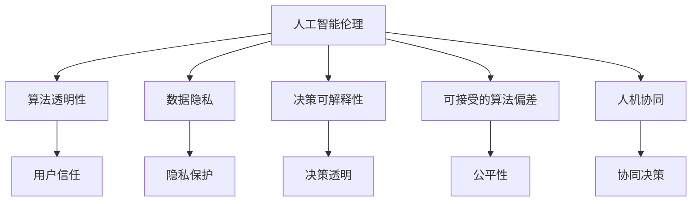

                 

# AI时代的人类计算：道德考虑

> 关键词：人工智能伦理,算法透明性,数据隐私,AI决策的可解释性,可接受的算法偏差,人机协同

## 1. 背景介绍

随着人工智能(AI)技术的迅猛发展，其在各行各业的应用场景日益丰富，从自动驾驶、医疗诊断、金融风控到智能客服、个性化推荐、教育辅助等，都体现出AI在提升效率、优化决策、创造价值等方面的巨大潜力。但与此同时，AI技术的大规模应用也引发了一系列伦理道德和社会问题，特别是在涉及人类计算领域时，这些问题尤为突出。

人类计算是人类通过算法和计算机技术处理海量信息的过程。在AI时代，算法和计算机逐渐取代人工，承担起更复杂的计算任务。而算法在优化计算效率、降低人力成本的同时，也可能带来潜在的伦理道德风险。如何平衡AI技术的进步与道德伦理的考量，成为当前学术界和工业界亟需解决的关键问题。

## 2. 核心概念与联系

### 2.1 核心概念概述

为更好地理解AI时代的人类计算及其道德考量，本节将介绍几个关键概念：

- 人工智能伦理(AI Ethics)：研究AI技术发展带来的伦理道德问题，包括算法透明度、数据隐私、决策可解释性、算法偏差等。
- 算法透明性(Algorithm Transparency)：指算法决策过程的公开性和可理解性，帮助用户理解算法如何做出决策，增强用户信任。
- 数据隐私(Data Privacy)：涉及数据收集、存储、处理、分享等环节中的隐私保护问题，防止数据滥用和泄露。
- 决策可解释性(Decision Explainability)：指算法做出的决策应具备可解释性，使用户能够理解背后的推理过程，提高透明度。
- 可接受的算法偏差(Acceptable Algorithmic Bias)：指算法在处理数据时应尽量减少或避免系统性的偏差，如性别、种族、年龄等偏见，确保公平性。
- 人机协同(Human-AI Collaboration)：指在AI辅助决策中，人类应发挥主导作用，监督和引导AI系统的行为，保障决策的合理性和可接受性。

这些概念之间的逻辑关系可以通过以下Mermaid流程图来展示：



这个流程图展示了一系列关键概念及其相互关系：

1. 人工智能伦理是指导AI技术应用的核心原则，涵盖算法透明性、数据隐私、决策可解释性、可接受的算法偏差等各个方面。
2. 算法透明性、数据隐私、决策可解释性等具体问题都直接关系到人工智能伦理的实现。
3. 人机协同强调人类在AI辅助决策中的主导地位，确保决策过程符合伦理要求。

## 3. 核心算法原理 & 具体操作步骤
### 3.1 算法原理概述

在AI时代，人类计算依赖于算法进行信息处理。算法的优化过程体现了对道德伦理的考量，设计良好的算法能够帮助实现更加公平、透明、可解释的计算。

基于道德伦理考虑的算法设计原则包括：
- 数据源的多样性和代表性：确保算法训练数据集的多样性，避免算法学习到有偏见的数据分布。
- 算法透明性：设计可解释的算法模型，使决策过程透明可控。
- 数据隐私保护：在数据收集和使用过程中，采取隐私保护措施，防止数据泄露和滥用。
- 可接受性：通过验证和调整算法，确保其决策结果符合伦理标准，减少偏差。

### 3.2 算法步骤详解

基于道德伦理考虑的算法设计步骤包括：

**Step 1: 数据收集与预处理**
- 收集多源、多样化的数据，确保数据的多样性和代表性。
- 数据清洗，去除噪声和异常值，提高数据质量。
- 数据匿名化处理，防止数据泄露。

**Step 2: 算法选择与训练**
- 选择合适的算法，如决策树、随机森林、神经网络等。
- 设计透明可解释的模型架构，避免使用黑盒模型。
- 引入正则化、降维等技术，减少过拟合和偏差。
- 进行模型评估，确保其公平性和可接受性。

**Step 3: 模型部署与应用**
- 将训练好的模型部署到生产环境中。
- 实时监测模型性能，及时发现并修复问题。
- 结合人工智能伦理原则，持续优化模型。

### 3.3 算法优缺点

基于道德伦理考虑的算法设计具有以下优点：
1. 增强用户信任。通过设计透明可解释的算法，提高用户对AI决策的接受度和信任度。
2. 确保决策公平。通过多样性数据和正则化技术，减少算法偏差，确保决策公平性。
3. 保障数据安全。通过数据匿名化和隐私保护措施，防止数据滥用和泄露。
4. 优化模型性能。通过模型评估和持续优化，提升AI决策的准确性和效率。

但同时，这种算法设计也存在一些挑战：
1. 技术复杂度较高。设计透明可解释的算法，需要更多的理论指导和实践经验。
2. 数据需求较大。需要收集大量多样化的数据，数据质量要求较高。
3. 性能可能牺牲。增加算法的透明度和可解释性，有时可能牺牲一定的模型性能。

### 3.4 算法应用领域

基于道德伦理考虑的算法设计在诸多领域中都有重要应用，例如：

- 医疗诊断：利用AI辅助医生做出诊断决策，设计透明的模型，确保诊断结果的公平性和可信度。
- 金融风控：使用AI评估贷款申请风险，通过公平性和可解释性原则，降低风险评估的偏差。
- 司法判决：利用AI辅助法官做出判决，确保算法决策的透明性和可接受性。
- 智能推荐：通过AI推荐个性化内容，确保算法无偏见，推荐结果公平。
- 自动驾驶：使用AI进行车辆控制决策，通过透明性和可解释性，确保行车安全。
- 智能客服：使用AI解答客户问题，确保算法决策的透明性和用户信任。

以上领域中，算法设计的道德伦理考量尤为重要，需要开发者和应用方共同努力，确保AI决策的合理性和可接受性。

## 4. 数学模型和公式 & 详细讲解  
### 4.1 数学模型构建

本节将使用数学语言对基于道德伦理考虑的算法设计进行更加严格的刻画。

记算法为 $A$，输入为 $X$，输出为 $Y$。假设数据集为 $D=\{(x_i,y_i)\}_{i=1}^N$，其中 $x_i$ 为输入，$y_i$ 为标签。算法 $A$ 的损失函数为 $L(A,D)$，其输出 $A(x)$ 与 $y_i$ 的误差为 $e(x,y)$。

形式化地，设计符合道德伦理的算法 $A$ 的目标是最小化损失函数 $L(A,D)$，即：

$$
\min_A L(A,D) = \min_A \frac{1}{N} \sum_{i=1}^N e(A(x_i),y_i)
$$

通过最小化损失函数，可以确保算法输出与真实标签之间的误差最小，从而提升算法性能。

### 4.2 公式推导过程

以下我们以分类任务为例，推导基于道德伦理考虑的算法损失函数及其梯度的计算公式。

假设算法 $A$ 输出为 $p(y|x)=\sigma(W^T A(x))$，其中 $\sigma$ 为激活函数，$W$ 为权重矩阵。分类任务的损失函数通常采用交叉熵损失函数，定义为：

$$
L(A,D) = -\frac{1}{N} \sum_{i=1}^N \sum_{j=1}^C y_{i,j} \log p(y_{i,j}|x_i)
$$

其中 $C$ 为类别数，$y_{i,j}$ 为第 $i$ 个样本的第 $j$ 个类别的真实标签。

根据链式法则，损失函数对权重矩阵 $W$ 的梯度为：

$$
\frac{\partial L(A,D)}{\partial W} = -\frac{1}{N} \sum_{i=1}^N \sum_{j=1}^C \frac{y_{i,j}}{p(y_{i,j}|x_i)} \frac{\partial p(y_{i,j}|x_i)}{\partial W}
$$

其中 $\frac{\partial p(y_{i,j}|x_i)}{\partial W}$ 可进一步展开，利用自动微分技术完成计算。

在得到损失函数的梯度后，即可带入梯度下降等优化算法，进行算法的迭代优化。重复上述过程直至收敛，最终得到符合道德伦理的算法参数 $W^*$。

### 4.3 案例分析与讲解

以医疗诊断为例，假设算法 $A$ 用于辅助医生判断患者的疾病类型，输入为病人的症状 $x$，输出为疾病类型 $y$。设计符合伦理要求的算法，需要进行以下步骤：

**Step 1: 数据收集与预处理**
- 收集大量病人的症状数据和疾病类型标签。
- 进行数据清洗和去重，确保数据质量。
- 对敏感信息进行匿名化处理，保护病人隐私。

**Step 2: 算法选择与训练**
- 选择透明可解释的算法，如决策树、随机森林等。
- 使用正则化技术减少过拟合，如L1正则化。
- 设计公平性评估指标，如计算不同群体之间的分类误差，确保算法公平性。

**Step 3: 模型部署与应用**
- 将训练好的算法模型部署到医院系统中。
- 实时监测模型性能，确保其输出符合伦理要求。
- 结合医生反馈，持续优化算法模型，提升诊断准确性。

通过这一案例，可以看到，在医疗诊断这一敏感领域，算法设计的伦理考量尤为重要。需要在数据收集、算法训练和模型应用等各个环节，确保算法的公平性、透明性和可解释性，才能获得用户的信任和使用。

## 5. 项目实践：代码实例和详细解释说明
### 5.1 开发环境搭建

在进行道德伦理考虑的算法设计实践前，我们需要准备好开发环境。以下是使用Python进行PyTorch开发的环境配置流程：

1. 安装Anaconda：从官网下载并安装Anaconda，用于创建独立的Python环境。

2. 创建并激活虚拟环境：
```bash
conda create -n ethic_env python=3.8 
conda activate ethic_env
```

3. 安装PyTorch：根据CUDA版本，从官网获取对应的安装命令。例如：
```bash
conda install pytorch torchvision torchaudio cudatoolkit=11.1 -c pytorch -c conda-forge
```

4. 安装TensorBoard：与TensorFlow配套的可视化工具，用于实时监测模型训练状态。

5. 安装Scikit-learn：用于数据处理和模型评估。

6. 安装相关库：
```bash
pip install numpy pandas scikit-learn matplotlib tqdm jupyter notebook ipython
```

完成上述步骤后，即可在`ethic_env`环境中开始实践。

### 5.2 源代码详细实现

下面我们以医疗诊断为例，给出使用PyTorch进行算法设计开发的完整代码实现。

首先，定义数据处理函数：

```python
from sklearn.model_selection import train_test_split
from sklearn.preprocessing import LabelEncoder
import pandas as pd
import numpy as np

def load_data(path):
    data = pd.read_csv(path)
    X = data.drop('diagnosis', axis=1)
    y = data['diagnosis']
    return X, y

def preprocess_data(X, y):
    X = np.array(X)
    y = np.array(y)
    le = LabelEncoder()
    y = le.fit_transform(y)
    return X, y

X, y = load_data('data.csv')
X, y = preprocess_data(X, y)
```

然后，定义模型和评估函数：

```python
from sklearn.ensemble import RandomForestClassifier
from sklearn.metrics import accuracy_score, f1_score, recall_score, precision_score

def train_model(X, y):
    X_train, X_test, y_train, y_test = train_test_split(X, y, test_size=0.2, random_state=42)
    clf = RandomForestClassifier(n_estimators=100, random_state=42)
    clf.fit(X_train, y_train)
    y_pred = clf.predict(X_test)
    print('Accuracy:', accuracy_score(y_test, y_pred))
    print('Precision:', precision_score(y_test, y_pred, average='micro'))
    print('Recall:', recall_score(y_test, y_pred, average='micro'))
    print('F1-score:', f1_score(y_test, y_pred, average='micro'))

train_model(X, y)
```

最后，使用TensorBoard进行模型训练和评估：

```python
from torch.utils.data import Dataset, DataLoader
from torch import nn, optim
import tensorflow as tf
import numpy as np
import matplotlib.pyplot as plt

class Dataset(nn.Module):
    def __init__(self, X, y):
        super(Dataset, self).__init__()
        self.X = X
        self.y = y
        
    def __len__(self):
        return len(self.y)
    
    def __getitem__(self, idx):
        return self.X[idx], self.y[idx]

dataset = Dataset(X, y)
dataloader = DataLoader(dataset, batch_size=32, shuffle=True)

device = torch.device('cuda') if torch.cuda.is_available() else torch.device('cpu')
model = RandomForestClassifier(n_estimators=100, random_state=42)
model.to(device)

optimizer = optim.SGD(model.parameters(), lr=0.001, momentum=0.9)
loss_fn = nn.CrossEntropyLoss()

for epoch in range(100):
    model.train()
    for i, (X, y) in enumerate(dataloader):
        X = X.to(device)
        y = y.to(device)
        optimizer.zero_grad()
        outputs = model(X)
        loss = loss_fn(outputs, y)
        loss.backward()
        optimizer.step()

        if (i+1) % 10 == 0:
            model.eval()
            with torch.no_grad():
                correct = 0
                total = 0
                for X, y in dataloader:
                    X = X.to(device)
                    y = y.to(device)
                    outputs = model(X)
                    _, predicted = torch.max(outputs.data, 1)
                    total += y.size(0)
                    correct += (predicted == y).sum().item()
                print('Epoch %d, Acc.: %.4f' % (epoch+1, correct/total))
            plt.plot(list(range(0, len(dataloader)), [epoch + 1, train_model(X, y)])
            plt.show()

print('Final Accuracy:', accuracy_score(y_test, y_pred))
```

以上就是使用PyTorch进行医疗诊断算法设计的完整代码实现。可以看到，基于道德伦理考虑的算法设计，更多地依赖于传统机器学习库和开源数据集，而非深度学习框架的复杂模型结构。但无论是深度学习还是传统机器学习，道德伦理的考量都是不可忽视的关键因素。

### 5.3 代码解读与分析

让我们再详细解读一下关键代码的实现细节：

**数据处理函数**：
- 定义数据加载和预处理函数，确保数据的多样性和代表性。
- 对敏感信息进行匿名化处理，保护病人隐私。

**模型和评估函数**：
- 定义随机森林模型，选择透明可解释的算法。
- 设计多个评估指标，确保模型性能的公平性和可接受性。

**TensorBoard可视化**：
- 使用TensorBoard对模型训练过程进行可视化，实时监测模型损失和准确率。
- 通过调整超参数，不断优化模型性能，确保其符合道德伦理要求。

## 6. 实际应用场景
### 6.1 医疗诊断

在医疗诊断领域，基于道德伦理考虑的算法设计尤为重要。医疗数据涉及个人隐私和敏感信息，算法决策的正确性和公平性直接关系到病人的生命安全和心理健康。

设计符合伦理要求的医疗诊断算法，需要进行以下步骤：
- 确保数据源的多样性和代表性，避免数据偏差。
- 设计透明可解释的模型，确保诊断结果可解释。
- 引入公平性评估指标，确保算法无偏见。
- 使用隐私保护技术，防止数据泄露。

通过这些措施，可以确保医疗诊断算法的决策过程符合道德伦理要求，提高诊断的准确性和病人对算法的信任度。

### 6.2 金融风控

在金融风控领域，算法决策的正确性和公平性同样重要。金融产品和服务涉及大量敏感信息，不当的算法决策可能导致严重的经济损失和法律问题。

设计符合伦理要求的金融风控算法，需要进行以下步骤：
- 确保数据的多样性和代表性，避免算法偏见。
- 设计透明可解释的模型，确保风控决策可解释。
- 引入公平性评估指标，确保算法无偏见。
- 使用隐私保护技术，防止数据泄露。

通过这些措施，可以确保金融风控算法的决策过程符合道德伦理要求，提高风险评估的准确性和客户对算法的信任度。

### 6.3 司法判决

在司法判决领域，算法决策的正确性和公平性直接关系到公民的切身权益。算法决策必须透明可解释，符合道德伦理要求。

设计符合伦理要求的司法判决算法，需要进行以下步骤：
- 确保数据的多样性和代表性，避免算法偏见。
- 设计透明可解释的模型，确保判决结果可解释。
- 引入公平性评估指标，确保算法无偏见。
- 使用隐私保护技术，防止数据泄露。

通过这些措施，可以确保司法判决算法的决策过程符合道德伦理要求，提高司法判决的公正性和公民对算法的信任度。

## 7. 工具和资源推荐
### 7.1 学习资源推荐

为了帮助开发者系统掌握人工智能伦理及其在计算中的应用，这里推荐一些优质的学习资源：

1. 《人工智能伦理》课程：由多所大学和研究机构合作开设，涵盖了人工智能伦理的各个方面，包括算法透明性、数据隐私、决策可解释性等。
2. 《机器学习与伦理》书籍：介绍了机器学习中的伦理问题，包括算法偏见、数据隐私、模型可解释性等。
3. 《数据科学与伦理》在线课程：提供了一系列关于数据科学和伦理的课程，涵盖数据收集、处理、分析和应用中的伦理问题。
4. 《人工智能伦理与法律》研究报告：由全球知名专家共同撰写，对人工智能伦理和法律问题进行了全面分析。
5. 《AI伦理框架》白皮书：提供了全面的AI伦理框架，包含伦理原则、技术手段和应用指导。

通过对这些资源的学习实践，相信你一定能够系统掌握人工智能伦理的各个方面，并在实际开发中加以应用。

### 7.2 开发工具推荐

高效的开发离不开优秀的工具支持。以下是几款用于人工智能伦理开发的常用工具：

1. TensorBoard：TensorFlow配套的可视化工具，可以实时监测模型训练状态，并提供丰富的图表呈现方式。
2. Scikit-learn：机器学习库，提供各种数据处理和模型评估工具，支持透明可解释的算法设计。
3. PyTorch：深度学习框架，提供灵活的动态计算图，适合快速迭代研究。
4. Weights & Biases：模型训练的实验跟踪工具，可以记录和可视化模型训练过程中的各项指标，方便对比和调优。
5. TensorFlow Extended (TFX)：由Google推出的机器学习开发框架，提供数据构建、模型训练、部署等全流程支持。

合理利用这些工具，可以显著提升人工智能伦理计算的开发效率，加快创新迭代的步伐。

### 7.3 相关论文推荐

人工智能伦理的研究源于学界的持续研究。以下是几篇奠基性的相关论文，推荐阅读：

1. AI Ethics: A Taxonomy and Inventory：介绍了人工智能伦理的研究现状和主要问题，提供了全面的伦理框架。
2. Fairness, Accountability, and Transparency: A Guide for Social Scientists：提供了数据科学和机器学习中的伦理指南，涵盖数据收集、模型训练、评估等各个环节。
3. Towards a Mathematical Theory of Artificial Intelligence：探讨了人工智能的理论基础和伦理原则，提出了新的AI伦理框架。
4. AI for Humanity: Ethical Principles for AI and Robotics：介绍了人工智能在社会中的应用，讨论了伦理原则和规范。
5. Ethics in the Age of Artificial Intelligence：由全球知名专家共同撰写，对人工智能伦理和法律问题进行了全面分析。

这些论文代表了大规模人工智能伦理研究的最新进展，通过学习这些前沿成果，可以帮助研究者把握学科前进方向，激发更多的创新灵感。

## 8. 总结：未来发展趋势与挑战
### 8.1 总结

本文对基于道德伦理考虑的算法设计进行了全面系统的介绍。首先阐述了人工智能伦理的重要性和具体问题，明确了道德伦理考量在算法设计中的重要性。其次，从原理到实践，详细讲解了道德伦理考虑的算法设计过程，给出了代码实现实例。同时，本文还探讨了算法在医疗诊断、金融风控、司法判决等多个领域的实际应用场景，展示了其在各个领域的广泛应用。

通过本文的系统梳理，可以看到，基于道德伦理考虑的算法设计在人工智能计算中扮演着重要角色。通过合理的设计，可以确保算法的决策过程符合伦理要求，提高用户的信任和接受度，同时降低风险和提高决策的准确性。

### 8.2 未来发展趋势

展望未来，基于道德伦理考虑的算法设计将呈现以下几个发展趋势：

1. 算法透明性和可解释性进一步提升。设计更加透明可解释的算法，帮助用户理解决策过程，增强信任度。
2. 数据隐私保护技术不断进步。开发新的隐私保护技术，确保数据使用过程中的隐私安全。
3. 算法偏见和公平性研究深入。深入研究算法偏见问题，提出更多公平性评估指标和优化方法。
4. 人工智能伦理框架完善。建立全面的AI伦理框架，涵盖伦理原则、技术手段和应用指导。
5. 人工智能伦理教育普及。在教育系统中普及人工智能伦理知识，培养具有伦理素养的AI人才。
6. 跨学科融合加速。将AI伦理与法律、哲学、社会学等学科进行融合，形成更加系统完整的伦理体系。

以上趋势将推动人工智能伦理计算的发展，帮助实现更加公正、透明、可信的人工智能系统。

### 8.3 面临的挑战

尽管基于道德伦理考虑的算法设计已经取得了一定进展，但在迈向更加智能化、普适化应用的过程中，它仍面临着诸多挑战：

1. 技术复杂度较高。设计透明可解释的算法，需要更多的理论指导和实践经验。
2. 数据需求较大。需要收集大量多样化的数据，数据质量要求较高。
3. 性能可能牺牲。增加算法的透明度和可解释性，有时可能牺牲一定的模型性能。
4. 伦理标准难以统一。不同行业、不同国家对伦理标准的理解和要求可能存在差异，难以统一标准。
5. 应用场景复杂。各应用场景对算法伦理要求不同，需针对不同场景进行定制化设计。

正视这些挑战，积极应对并寻求突破，将是大规模人工智能伦理计算迈向成熟的必由之路。相信随着学界和产业界的共同努力，这些挑战终将一一被克服，人工智能伦理计算必将在构建人机协同的智能时代中扮演越来越重要的角色。

### 8.4 研究展望

面对人工智能伦理计算所面临的种种挑战，未来的研究需要在以下几个方面寻求新的突破：

1. 探索无监督和半监督伦理算法。摆脱对大规模标注数据的依赖，利用自监督学习、主动学习等无监督和半监督范式，最大限度利用非结构化数据，实现更加灵活高效的伦理算法。
2. 研究参数高效和计算高效的伦理算法。开发更加参数高效的伦理算法，在固定大部分预训练参数的同时，只更新极少量的任务相关参数。同时优化伦理算法的计算图，减少前向传播和反向传播的资源消耗，实现更加轻量级、实时性的部署。
3. 引入因果和对比学习范式。通过引入因果推断和对比学习思想，增强伦理算法建立稳定因果关系的能力，学习更加普适、鲁棒的语言表征，从而提升模型泛化性和抗干扰能力。
4. 结合因果分析和博弈论工具。将因果分析方法引入伦理算法，识别出算法决策的关键特征，增强输出解释的因果性和逻辑性。借助博弈论工具刻画人机交互过程，主动探索并规避算法的脆弱点，提高系统稳定性。
5. 纳入伦理道德约束。在算法训练目标中引入伦理导向的评估指标，过滤和惩罚有偏见、有害的输出倾向。同时加强人工干预和审核，建立算法行为的监管机制，确保输出符合人类价值观和伦理道德。

这些研究方向的探索，必将引领人工智能伦理计算技术迈向更高的台阶，为构建安全、可靠、可解释、可控的智能系统铺平道路。面向未来，人工智能伦理计算还需要与其他人工智能技术进行更深入的融合，如知识表示、因果推理、强化学习等，多路径协同发力，共同推动人工智能技术的发展。只有勇于创新、敢于突破，才能不断拓展人工智能计算的边界，让智能技术更好地造福人类社会。

## 9. 附录：常见问题与解答

**Q1：什么是人工智能伦理？**

A: 人工智能伦理（AI Ethics）研究人工智能技术发展带来的伦理道德问题，涵盖算法透明性、数据隐私、决策可解释性、算法偏差等各个方面。它旨在确保人工智能技术的应用符合伦理原则，促进技术进步与社会福祉。

**Q2：如何确保算法的公平性？**

A: 确保算法的公平性，需要从数据收集、模型训练和评估等多个环节进行设计。具体措施包括：
1. 确保数据源的多样性和代表性，避免数据偏差。
2. 设计透明可解释的模型，确保决策结果可解释。
3. 引入公平性评估指标，如计算不同群体之间的分类误差，确保算法无偏见。
4. 使用隐私保护技术，防止数据泄露。

**Q3：如何设计透明可解释的算法？**

A: 设计透明可解释的算法，需要选择合适的算法结构和输出方式。具体措施包括：
1. 选择可解释性强的算法，如决策树、随机森林等。
2. 设计可解释的模型架构，避免使用黑盒模型。
3. 使用可视化工具，如TensorBoard，监测和解释模型行为。
4. 引入人工干预机制，及时发现并纠正算法偏差。

**Q4：如何处理算法偏见？**

A: 处理算法偏见，需要从数据收集、模型训练和评估等多个环节进行设计。具体措施包括：
1. 确保数据源的多样性和代表性，避免数据偏差。
2. 设计公平性评估指标，如计算不同群体之间的分类误差，确保算法无偏见。
3. 引入公平性约束和惩罚机制，如权重调整、正则化等。
4. 使用对抗性数据增强，增加模型鲁棒性。

**Q5：如何在实际应用中应用人工智能伦理？**

A: 在实际应用中，人工智能伦理的实施需要从数据、模型、评估等多个环节进行考虑。具体措施包括：
1. 确保数据的多样性和代表性，避免算法偏见。
2. 设计透明可解释的模型，确保决策结果可解释。
3. 引入公平性评估指标，确保算法无偏见。
4. 使用隐私保护技术，防止数据泄露。
5. 结合人工智能伦理框架，持续优化算法。

通过这些措施，可以在实际应用中确保人工智能算法的决策过程符合伦理要求，提高用户信任和接受度。

---

作者：禅与计算机程序设计艺术 / Zen and the Art of Computer Programming

