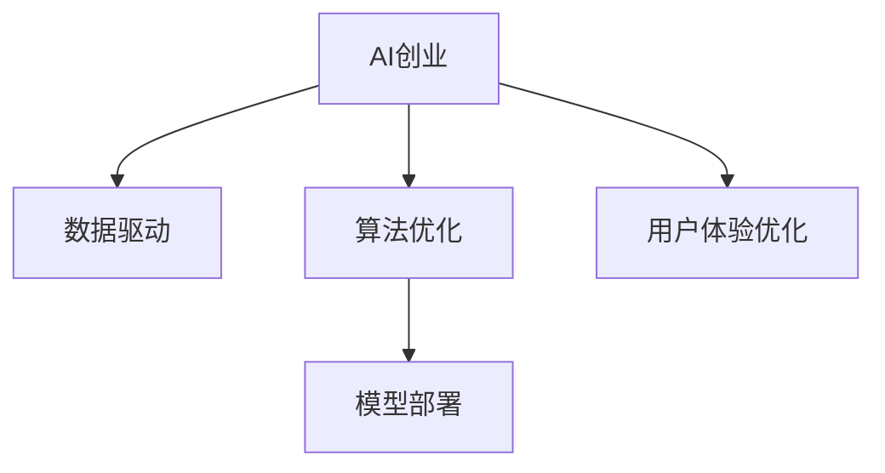

                 

# AI时代的创业机遇：垂直领域大有可为

## 1. 背景介绍

### 1.1 问题由来
人工智能（AI）正在以前所未有的速度改变全球产业生态。从医疗、金融到教育、制造，AI技术正在各行各业中创造新的商业模式、业务模式，重新定义生产效率和用户体验。在AI时代，创业不仅是新技术的创造，更是在垂类领域的深度应用和优化。

### 1.2 问题核心关键点
AI创业的核心在于深度应用和优化。在大数据、云计算和算法等技术基础上，AI创业可以迅速在特定领域落地，为传统行业带来显著提升。特别是在垂直领域，AI技术的应用有着广阔的发展空间，为创业者提供了无限的可能。

### 1.3 问题研究意义
研究AI在垂直领域的创业机遇，对于推动传统行业数字化转型，提升企业竞争力，具有重要意义。AI技术可以在提升效率、降低成本、优化决策等方面带来显著效果，助力企业在激烈的市场竞争中脱颖而出。

## 2. 核心概念与联系

### 2.1 核心概念概述

为更好地理解AI创业在垂直领域的应用，本节将介绍几个密切相关的核心概念：

- **AI创业**：在人工智能技术的基础上，创业公司在特定领域提供解决方案，优化业务流程、提升用户体验。
- **垂直领域**：指专注于某一特定行业或领域的应用，如医疗、金融、教育等，而非广泛的通用AI应用。
- **数据驱动**：AI创业需要依赖大量的数据进行模型训练和优化，数据的质量和量级直接影响模型的性能。
- **算法优化**：在大数据基础上，通过深度学习、机器学习等算法优化，实现对特定问题的有效解决。
- **模型部署**：将训练好的模型部署到实际应用中，进行落地实施。
- **用户体验优化**：通过AI技术提升产品或服务的使用体验，提高用户满意度。

这些核心概念之间的逻辑关系可以通过以下Mermaid流程图来展示：



这个流程图展示了大语言模型的核心概念及其之间的关系：

1. AI创业以数据为基础，通过算法优化，实现模型部署，最终提升用户体验。
2. 数据是AI创业的基础，算法优化是核心，用户体验优化是目标。

这些概念共同构成了AI创业的完整生态，使其能够在各个垂类领域发挥强大的技术优势。

## 3. 核心算法原理 & 具体操作步骤
### 3.1 算法原理概述

AI创业的核心在于利用算法优化提升特定业务场景的效率和效果。在大数据和云计算的支持下，通过深度学习、机器学习等算法，对特定领域的数据进行处理和分析，实现业务的智能化转型。

形式化地，假设原始业务数据为 $D=\{(x_i, y_i)\}_{i=1}^N, x_i \in \mathcal{X}, y_i \in \mathcal{Y}$。AI创业的目标是通过模型 $M_{\theta}$，将输入 $x$ 映射到输出 $y$，即 $y = M_{\theta}(x)$。模型的训练过程可以表示为：

$$
\theta = \mathop{\arg\min}_{\theta} \mathcal{L}(M_{\theta}, D)
$$

其中 $\mathcal{L}$ 为损失函数，衡量模型输出与真实标签之间的差异。常见的损失函数包括交叉熵损失、均方误差损失等。

### 3.2 算法步骤详解

AI创业的算法步骤一般包括以下几个关键环节：

**Step 1: 数据收集与预处理**
- 收集目标领域的业务数据 $D$，确保数据的多样性和代表性。
- 对数据进行清洗和标注，生成训练集、验证集和测试集。

**Step 2: 算法选择与模型设计**
- 根据业务需求选择合适的算法，如深度学习、强化学习、机器学习等。
- 设计合适的模型结构，如卷积神经网络、循环神经网络、Transformer等。

**Step 3: 模型训练与优化**
- 使用训练集对模型进行训练，通过反向传播算法优化参数。
- 在验证集上评估模型性能，根据评估结果调整超参数和模型结构。

**Step 4: 模型部署与反馈优化**
- 将训练好的模型部署到实际应用中，进行业务优化。
- 根据用户反馈和业务指标，不断优化模型和算法，提升用户体验和业务效果。

### 3.3 算法优缺点

AI创业的算法优化具有以下优点：
1. 高效智能化。通过算法优化，可以实现业务流程的智能化和自动化，大大提升效率和效果。
2. 精准预测。算法优化可以提供精确的预测和决策，帮助企业优化资源配置，提升业务竞争力。
3. 灵活可扩展。算法优化可以根据业务需求进行定制化设计和调整，适应多种应用场景。

同时，该方法也存在一定的局限性：
1. 数据依赖性强。算法优化的效果很大程度上依赖于数据的质量和量级，获取高质量数据成本较高。
2. 算法复杂度高。复杂的算法模型训练和部署可能需要较高的技术门槛。
3. 可解释性不足。许多深度学习算法模型难以解释其内部决策逻辑，难以满足特定领域的需求。
4. 模型鲁棒性差。复杂的模型在面对新数据和场景时，可能出现过拟合或泛化能力不足的问题。

尽管存在这些局限性，但就目前而言，AI创业的算法优化仍是大数据应用的最主流范式。未来相关研究的重点在于如何进一步降低算法优化的数据依赖，提高模型的少样本学习和跨领域迁移能力，同时兼顾可解释性和伦理安全性等因素。

### 3.4 算法应用领域

AI创业的算法优化方法已经在医疗、金融、教育、制造等多个领域得到广泛应用，成为各行各业智能化转型的重要手段。

在医疗领域，AI创业可以应用于疾病预测、药物研发、医学影像分析等方面，通过智能算法优化，提升医疗服务的诊断准确性和治疗效果。

在金融领域，AI创业可以应用于风险评估、智能投顾、欺诈检测等方面，通过算法优化，实现金融业务的智能化和风险控制。

在教育领域，AI创业可以应用于个性化学习、作业批改、智能评估等方面，通过算法优化，提升教育质量和资源配置效率。

除了上述这些经典领域外，AI创业还在更多场景中得到创新性应用，如智能客服、智能制造、智能仓储等，为各行业的智能化转型提供了新思路。

## 4. 数学模型和公式 & 详细讲解  
### 4.1 数学模型构建

本节将使用数学语言对AI创业的算法优化过程进行更加严格的刻画。

假设业务数据为 $D=\{(x_i, y_i)\}_{i=1}^N, x_i \in \mathcal{X}, y_i \in \mathcal{Y}$。算法优化目标是最小化损失函数 $\mathcal{L}(M_{\theta}, D)$，即：

$$
\theta = \mathop{\arg\min}_{\theta} \mathcal{L}(M_{\theta}, D)
$$

其中 $\mathcal{L}$ 为损失函数，可以采用多种形式，如交叉熵损失、均方误差损失等。在深度学习中，常用的损失函数为交叉熵损失，其公式为：

$$
\mathcal{L}(y, \hat{y}) = -\frac{1}{N}\sum_{i=1}^N \log \hat{y_i}
$$

其中 $y_i$ 为真实标签，$\hat{y_i}$ 为模型预测输出。

### 4.2 公式推导过程

以下我们以医疗领域疾病预测任务为例，推导基于深度学习的算法优化过程。

假设模型 $M_{\theta}$ 输入为病人历史病历 $x$，输出为疾病预测结果 $y \in \{0, 1\}$，其中 $y=1$ 表示病人患有疾病，$y=0$ 表示未患疾病。则交叉熵损失函数可以表示为：

$$
\mathcal{L}(M_{\theta}, D) = -\frac{1}{N}\sum_{i=1}^N [y_i\log \hat{y_i} + (1-y_i)\log(1-\hat{y_i})]
$$

在训练过程中，通过反向传播算法计算损失函数对模型参数 $\theta$ 的梯度，更新参数，使其更接近最优解。具体来说，梯度下降算法的更新公式为：

$$
\theta \leftarrow \theta - \eta \nabla_{\theta}\mathcal{L}(M_{\theta}, D)
$$

其中 $\eta$ 为学习率，$\nabla_{\theta}\mathcal{L}(M_{\theta}, D)$ 为损失函数对模型参数的梯度，可通过反向传播算法高效计算。

### 4.3 案例分析与讲解

假设某医院收集了1000个病人的病历数据，其中500个病人患有某种疾病，另外500个未患疾病。利用这些数据，对深度学习模型进行训练和优化。训练过程中，将数据分成训练集、验证集和测试集，每个集子的样本数为300、200和500。采用交叉熵损失函数，通过反向传播算法优化模型参数。训练过程中，学习率为0.01，迭代次数为100次。

首先，对数据进行预处理，包括数据清洗、归一化和特征提取。然后，设计一个简单的卷积神经网络模型，包括两个卷积层和两个全连接层，激活函数为ReLU。

在训练集上，模型进行100次迭代，每次迭代更新全部参数，学习率为0.01，优化器为Adam。在每次迭代后，计算损失函数在验证集上的值，如果损失函数值超过预设阈值，则停止训练。训练结束后，在测试集上评估模型性能，计算准确率、召回率和F1分数。

## 5. 项目实践：代码实例和详细解释说明
### 5.1 开发环境搭建

在进行AI创业项目开发前，我们需要准备好开发环境。以下是使用Python进行TensorFlow开发的环境配置流程：

1. 安装Anaconda：从官网下载并安装Anaconda，用于创建独立的Python环境。

2. 创建并激活虚拟环境：
```bash
conda create -n tf-env python=3.8 
conda activate tf-env
```

3. 安装TensorFlow：根据CUDA版本，从官网获取对应的安装命令。例如：
```bash
conda install tensorflow -c tf -c conda-forge
```

4. 安装各类工具包：
```bash
pip install numpy pandas scikit-learn matplotlib tqdm jupyter notebook ipython
```

完成上述步骤后，即可在`tf-env`环境中开始AI创业项目开发。

### 5.2 源代码详细实现

这里我们以医疗领域疾病预测任务为例，给出使用TensorFlow进行AI创业项目开发的PyTorch代码实现。

首先，定义数据预处理函数：

```python
import tensorflow as tf
from tensorflow.keras.preprocessing.text import Tokenizer
from tensorflow.keras.preprocessing.sequence import pad_sequences

def preprocess_data(texts, labels, max_len=128):
    tokenizer = Tokenizer(num_words=5000)
    tokenizer.fit_on_texts(texts)
    sequences = tokenizer.texts_to_sequences(texts)
    padded_sequences = pad_sequences(sequences, maxlen=max_len, padding='post', truncating='post')
    return padded_sequences, labels, tokenizer.word_index
```

然后，定义模型和优化器：

```python
from tensorflow.keras.models import Sequential
from tensorflow.keras.layers import Embedding, Conv1D, MaxPooling1D, Flatten, Dense
from tensorflow.keras.optimizers import Adam

model = Sequential()
model.add(Embedding(input_dim=5000, output_dim=64, input_length=max_len))
model.add(Conv1D(filters=32, kernel_size=3, activation='relu'))
model.add(MaxPooling1D(pool_size=2))
model.add(Flatten())
model.add(Dense(64, activation='relu'))
model.add(Dense(1, activation='sigmoid'))

optimizer = Adam(lr=0.01)
```

接着，定义训练和评估函数：

```python
from sklearn.metrics import accuracy_score, recall_score, f1_score

def train_epoch(model, dataset, batch_size, optimizer):
    dataloader = tf.data.Dataset.from_tensor_slices((dataset[0], dataset[1])).batch(batch_size).shuffle(buffer_size=1000)
    model.trainable = True
    model.compile(optimizer=optimizer, loss='binary_crossentropy', metrics=['accuracy'])
    model.fit(dataloader, epochs=100, validation_data=(val_dataset[0], val_dataset[1]))
    model.trainable = False

def evaluate(model, dataset, batch_size):
    dataloader = tf.data.Dataset.from_tensor_slices((dataset[0], dataset[1])).batch(batch_size)
    model.evaluate(dataloader, verbose=0)
    y_true = dataset[1]
    y_pred = (model.predict(dataset[0]) > 0.5).astype(int)
    accuracy = accuracy_score(y_true, y_pred)
    recall = recall_score(y_true, y_pred)
    f1 = f1_score(y_true, y_pred)
    print(f'Accuracy: {accuracy:.3f}, Recall: {recall:.3f}, F1 Score: {f1:.3f}')
```

最后，启动训练流程并在测试集上评估：

```python
epochs = 100
batch_size = 16

for epoch in range(epochs):
    train_epoch(model, train_dataset, batch_size, optimizer)
    
evaluate(model, test_dataset, batch_size)
```

以上就是使用TensorFlow进行AI创业项目开发的完整代码实现。可以看到，TensorFlow提供了高度封装的功能，可以方便地实现模型的训练和评估。

### 5.3 代码解读与分析

让我们再详细解读一下关键代码的实现细节：

**preprocess_data函数**：
- 定义了一个数据预处理函数，用于将文本数据转换为模型可接受的序列数据，并进行归一化和填充。

**model定义**：
- 设计了一个简单的卷积神经网络模型，包括嵌入层、卷积层、池化层、全连接层等，用于处理输入文本并输出预测结果。

**train_epoch函数**：
- 定义了一个训练函数，用于在训练集上训练模型，并在验证集上评估模型性能。训练过程中，模型参数可训练，优化器为Adam，损失函数为二元交叉熵。

**evaluate函数**：
- 定义了一个评估函数，用于在测试集上评估模型性能，并计算准确率、召回率和F1分数。

**训练流程**：
- 循环100次，每次迭代训练模型，并在验证集上评估性能。

可以看到，TensorFlow的灵活性和易用性使得AI创业项目的开发变得相对简单。开发者可以将更多精力放在模型设计和业务优化上，而不必过多关注底层实现细节。

当然，工业级的系统实现还需考虑更多因素，如模型的保存和部署、超参数的自动搜索、更灵活的任务适配层等。但核心的AI创业范式基本与此类似。

## 6. 实际应用场景
### 6.1 医疗诊断系统

基于AI创业的算法优化，医疗诊断系统可以广泛应用于疾病预测、影像诊断、智能推荐等方面。通过深度学习技术，系统能够自动分析医学图像、病历数据等，辅助医生进行诊断和治疗决策。

在技术实现上，可以收集医院的历史诊断数据，将图像和病历作为输入，真实诊断结果作为标签，在此基础上对预训练模型进行微调。微调后的模型能够自动理解医学图像和病历，并给出预测结果。对于新的患者数据，可以实时进行诊断，并根据模型预测结果，提供治疗建议。

### 6.2 金融风险管理

AI创业的算法优化在金融领域也有广泛应用。传统的金融风险管理依赖于人工分析和判断，效率低下且容易出错。通过算法优化，系统能够自动分析大量交易数据，识别潜在的风险因素，及时预警和处理异常情况。

在实现过程中，可以收集金融机构的交易记录、客户行为数据等，将其作为输入，金融风险作为标签，训练深度学习模型。微调后的模型能够自动分析新交易数据，预测潜在的金融风险，辅助金融机构的决策过程。

### 6.3 教育个性化推荐

AI创业的算法优化可以应用于教育领域的个性化推荐系统。传统的教育推荐系统往往只依赖学生的历史行为数据，难以充分理解学生的兴趣和需求。通过算法优化，系统能够根据学生的学习情况和兴趣爱好，提供个性化的学习推荐，提升学习效果和效率。

在实现过程中，可以收集学生的学习记录、作业完成情况、兴趣爱好等数据，将其作为输入，学生的后续学习行为作为标签，训练深度学习模型。微调后的模型能够自动分析学生的当前学习状态，推荐合适的学习资源和任务，提升学生的学习体验和效果。

### 6.4 未来应用展望

随着AI创业技术的不断成熟，算法优化将在更多领域得到应用，为传统行业带来变革性影响。

在智慧城市治理中，AI创业可以应用于城市事件监测、交通流量预测、智能客服等方面，提升城市管理的自动化和智能化水平，构建更安全、高效的未来城市。

在智慧农业领域，AI创业可以应用于农作物病虫害预测、土壤分析、智能灌溉等方面，提升农业生产的效率和质量。

除了上述这些领域外，AI创业还将进一步拓展到更多场景中，如智能制造、智能仓储、智能物流等，为各行各业提供更智能、高效的解决方案。

## 7. 工具和资源推荐
### 7.1 学习资源推荐

为了帮助开发者系统掌握AI创业的理论基础和实践技巧，这里推荐一些优质的学习资源：

1. 《深度学习》系列博文：由大模型技术专家撰写，深入浅出地介绍了深度学习原理、模型设计、优化方法等基础知识。

2. Coursera《深度学习》课程：斯坦福大学开设的深度学习课程，涵盖深度学习的基础知识和前沿技术，适合初学者和进阶者学习。

3. 《TensorFlow实战》书籍：TensorFlow官方推出的实战书籍，详细介绍了TensorFlow的使用方法和技巧，适合TensorFlow开发入门。

4. Kaggle平台：世界领先的机器学习竞赛平台，提供海量数据集和竞赛项目，适合实践和锻炼数据处理和算法优化能力。

5. GitHub：开源社区，汇聚了大量的AI创业项目和代码，适合学习和借鉴成功案例。

通过对这些资源的学习实践，相信你一定能够快速掌握AI创业的精髓，并用于解决实际的业务问题。

### 7.2 开发工具推荐

高效的开发离不开优秀的工具支持。以下是几款用于AI创业项目开发的常用工具：

1. TensorFlow：由Google主导开发的开源深度学习框架，生产部署方便，适合大规模工程应用。

2. PyTorch：基于Python的开源深度学习框架，灵活的计算图，适合快速迭代研究。

3. Keras：高层API框架，简单易用，适合快速搭建和训练模型。

4. Weights & Biases：模型训练的实验跟踪工具，可以记录和可视化模型训练过程中的各项指标，方便对比和调优。

5. Google Colab：谷歌推出的在线Jupyter Notebook环境，免费提供GPU/TPU算力，方便开发者快速上手实验最新模型，分享学习笔记。

合理利用这些工具，可以显著提升AI创业项目的开发效率，加快创新迭代的步伐。

### 7.3 相关论文推荐

AI创业的算法优化技术的发展源于学界的持续研究。以下是几篇奠基性的相关论文，推荐阅读：

1. Deep Neural Networks for Language Understanding（BERT论文）：提出BERT模型，引入基于掩码的自监督预训练任务，刷新了多项NLP任务SOTA。

2. ImageNet Classification with Deep Convolutional Neural Networks（AlexNet论文）：提出AlexNet模型，开启深度学习在图像分类任务中的应用。

3. ResNet：提出残差网络，解决深度神经网络训练过程中的梯度消失问题，提升了网络的深度和精度。

4. YOLO: Real-Time Object Detection（YOLO论文）：提出YOLO模型，实现实时目标检测，广泛应用于无人驾驶、视频监控等领域。

5. Generative Adversarial Nets（GAN论文）：提出生成对抗网络，实现高质量的图像、音频等生成任务。

这些论文代表了大模型创业的算法优化技术的发展脉络。通过学习这些前沿成果，可以帮助研究者把握学科前进方向，激发更多的创新灵感。

## 8. 总结：未来发展趋势与挑战

### 8.1 总结

本文对基于算法优化的AI创业方法进行了全面系统的介绍。首先阐述了AI创业在垂直领域的应用背景和意义，明确了算法优化在提升业务效率、优化决策等方面的独特价值。其次，从原理到实践，详细讲解了AI创业的数学模型和关键步骤，给出了AI创业项目开发的完整代码实例。同时，本文还广泛探讨了AI创业方法在医疗、金融、教育等多个行业领域的应用前景，展示了AI创业技术的广阔前景。

通过本文的系统梳理，可以看到，基于算法优化的AI创业技术正在成为各行各业智能化转型的重要范式，极大地拓展了业务场景的智能化水平，为传统行业带来了新的机遇和挑战。未来，伴随AI创业技术的持续演进，算法优化必将在更多领域得到应用，为各行各业带来更大的创新和变革。

### 8.2 未来发展趋势

展望未来，AI创业的算法优化技术将呈现以下几个发展趋势：

1. 算法复杂度提升。随着数据量和业务需求的增加，算法复杂度将不断提升，以应对更复杂的业务场景。

2. 模型可解释性增强。随着AI创业应用场景的多样化，模型可解释性变得愈发重要，研究者将致力于提高模型的透明度和可解释性，满足各领域对模型输出的需求。

3. 跨领域知识融合。AI创业的算法优化将越来越多地结合跨领域知识，如知识图谱、逻辑规则等，增强模型的通用性和适应性。

4. 实时动态优化。未来的AI创业系统将具备实时动态优化能力，根据业务数据的变化，实时调整模型参数，保持模型的最佳性能。

5. 端到端自动化。AI创业的算法优化将逐步向端到端自动化演进，从数据预处理、模型训练到模型部署，全程自动完成，提升效率和准确性。

这些趋势凸显了AI创业技术的持续发展和创新，将进一步推动各行各业的智能化进程，为人类社会带来更多的便利和创新。

### 8.3 面临的挑战

尽管AI创业的算法优化技术已经取得了显著成果，但在迈向更加智能化、普适化应用的过程中，它仍面临诸多挑战：

1. 数据获取难度大。AI创业依赖于高质量的业务数据，但在某些垂直领域，数据获取难度较大，成本较高。

2. 算法复杂度高。算法优化的复杂度随着业务需求和技术要求的提升而增加，对开发者的技术水平要求更高。

3. 模型鲁棒性不足。复杂的模型在面对新数据和场景时，可能出现过拟合或泛化能力不足的问题，导致应用效果不佳。

4. 模型可解释性差。许多深度学习模型难以解释其内部决策逻辑，难以满足特定领域的需求。

5. 资源消耗大。深度学习模型往往需要大量的计算资源和存储空间，对硬件要求较高。

尽管存在这些挑战，但AI创业的算法优化技术仍是大数据应用的最主流范式。未来相关研究的重点在于如何进一步降低算法优化的数据依赖，提高模型的少样本学习和跨领域迁移能力，同时兼顾可解释性和伦理安全性等因素。

### 8.4 研究展望

面对AI创业技术所面临的种种挑战，未来的研究需要在以下几个方面寻求新的突破：

1. 探索数据增强方法。探索更多数据增强技术，如数据合成、数据回放等，提升数据质量和多样性，减少数据依赖性。

2. 研究高效优化算法。开发更加高效的优化算法，如自适应学习率、对抗训练等，提高模型训练速度和泛化能力。

3. 引入外部知识。将符号化的外部知识，如知识图谱、逻辑规则等，与神经网络模型进行巧妙融合，增强模型的通用性和适应性。

4. 优化模型结构。通过网络剪枝、量化等技术，优化模型结构，降低模型复杂度和资源消耗，提升模型的实时性和可部署性。

5. 引入因果推断。将因果推断方法引入模型训练，增强模型的因果推理能力，提升模型的解释性和可信度。

这些研究方向的探索，必将引领AI创业技术的进一步发展，为各行各业的智能化转型提供新的解决方案，推动AI技术更好地服务于人类社会。

## 9. 附录：常见问题与解答

**Q1：AI创业是否需要依赖大规模数据集？**

A: AI创业确实需要依赖大规模数据集，但这些数据集可以来源于业务场景中现有的数据，不一定需要从外部获取。在数据不足的情况下，可以考虑数据增强、迁移学习等方法来弥补数据缺口。

**Q2：AI创业项目应该如何选择算法模型？**

A: 算法模型的选择应结合业务需求和数据特征进行。一般来说，对于复杂的业务场景，可以选择深度学习模型，如卷积神经网络、循环神经网络、Transformer等。对于简单的任务，可以选择传统的机器学习模型，如决策树、逻辑回归等。同时，可以结合实际情况进行算法优化和调整，以达到最佳效果。

**Q3：AI创业项目应该如何处理数据不平衡问题？**

A: 数据不平衡是AI创业项目中常见的问题。可以通过以下方法处理：
1. 数据增强：对少数类数据进行增强，增加样本数量。
2. 重新采样：通过欠采样或过采样，平衡数据分布。
3. 算法优化：选择适合处理不平衡数据的算法，如SMOTE、ADASYN等。

这些方法可以结合使用，以达到最佳效果。

**Q4：AI创业项目如何优化模型性能？**

A: 模型性能优化是一个持续的过程，可以采取以下方法：
1. 超参数调优：通过网格搜索、随机搜索等方法，优化模型超参数。
2. 模型结构调整：通过网络剪枝、量化等技术，优化模型结构，提升模型效率和泛化能力。
3. 算法改进：引入新的算法和优化方法，如生成对抗网络、自适应学习率等，提升模型效果。

这些方法可以结合使用，以达到最佳效果。

**Q5：AI创业项目应该如何处理模型过拟合问题？**

A: 模型过拟合是AI创业项目中常见的问题。可以通过以下方法处理：
1. 数据增强：通过数据增强，增加数据多样性。
2. 正则化：使用L2正则、Dropout等正则化技术，防止模型过拟合。
3. 模型结构调整：通过网络剪枝、量化等技术，优化模型结构，降低过拟合风险。
4. 早停机制：在验证集上监控模型性能，根据性能变化决定是否停止训练。

这些方法可以结合使用，以达到最佳效果。

总之，AI创业技术在垂类领域具有广阔的应用前景，为各行各业带来新的机遇和挑战。通过不断探索和优化，相信AI创业技术将进一步推动各行各业的智能化转型，为人类的生产生活方式带来深远的影响。

