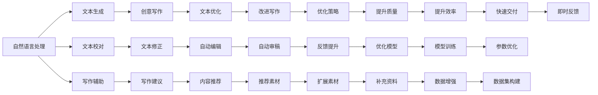

                 

# AI时代的创意写作辅助：头脑风暴，审稿与校对

> 关键词：AI创意写作, 写作辅助, 自然语言处理, 自然语言生成, 文本校对, 文字编辑, 写作工具, 智能审稿

## 1. 背景介绍

### 1.1 问题由来
随着人工智能技术的发展，人工智能在各个行业的应用越来越广泛。在创意写作领域，AI不仅能够帮助作者进行文本创作，还能够进行文本审稿和校对，提升写作效率和质量。然而，现有的一些AI写作辅助工具往往过于简单，无法真正帮助作者进行深层次的创意开发。与此同时，对于高质量的文本审稿和校对，现有的技术也存在不少问题。因此，如何构建一个全面、高效的AI创意写作辅助系统，成为了当前研究的一个热点问题。

### 1.2 问题核心关键点
本节将详细介绍基于自然语言处理(NLP)技术的AI创意写作辅助系统，包括三个核心部分：头脑风暴(Brainstorming)、审稿(Review)和校对(Proofreading)。这三个部分共同构成了AI创意写作辅助系统的核心框架，使得作者能够更加高效地进行文本创作和优化。

### 1.3 问题研究意义
构建AI创意写作辅助系统，对于提升作者创作效率和文本质量具有重要意义。具体来说：

1. **提升创作效率**：AI辅助系统可以快速生成高质量的内容，帮助作者节省时间和精力。
2. **提高文本质量**：AI审稿和校对系统能够识别和纠正文本中的错误，提升内容的准确性和可读性。
3. **推动创意写作**：AI能够提供创意灵感和写作建议，激发作者的创造力。
4. **降低创作门槛**：AI辅助系统使得创作变得更加轻松，不再局限于少数专业作者。

本文将从算法原理、操作步骤、实际应用等多个角度，全面介绍AI创意写作辅助系统的构建方法和实践经验。

## 2. 核心概念与联系

### 2.1 核心概念概述

为更好地理解AI创意写作辅助系统的构建，本节将介绍几个关键概念：

- **自然语言处理(NLP)**：研究计算机如何理解、处理和生成自然语言的技术，包括文本分类、文本生成、文本校对等多个方向。
- **自然语言生成(NLG)**：使用机器学习模型自动生成符合语法和语义规则的自然语言文本。
- **文本校对**：使用机器学习模型自动识别和修正文本中的语法和拼写错误。
- **写作辅助**：使用机器学习模型提供写作建议、创意灵感和文本生成等辅助功能。

这些核心概念通过以下Mermaid流程图连接起来，展示了它们之间的逻辑关系：



这些概念之间的逻辑关系清晰明了，共同构成了AI创意写作辅助系统的技术框架。

## 3. 核心算法原理 & 具体操作步骤

### 3.1 算法原理概述

基于自然语言处理技术的AI创意写作辅助系统，主要由三个核心模块构成：头脑风暴模块、审稿模块和校对模块。下面将详细介绍这三个模块的算法原理。

### 3.2 算法步骤详解

#### 3.2.1 头脑风暴模块

头脑风暴模块的主要功能是生成创意灵感和写作素材，帮助作者快速确定创作方向和主题。具体步骤如下：

1. **数据收集**：收集大量的文本数据，包括小说、散文、诗歌等不同风格的文本。
2. **预处理**：对文本数据进行分词、去停用词、词性标注等预处理。
3. **特征提取**：使用TF-IDF、Word2Vec等方法，提取文本的特征向量。
4. **模型训练**：使用LSTM、GRU等序列模型，训练生成文本的模型。
5. **文本生成**：基于训练好的模型，生成与输入文本风格相似的文本。

#### 3.2.2 审稿模块

审稿模块的主要功能是对文本进行质量评估和建议改进。具体步骤如下：

1. **数据准备**：准备高质量的标注数据，包括文本及其对应的评估标准。
2. **模型训练**：使用Transformer、CNN等模型，训练文本分类和情感分析模型。
3. **文本评估**：对输入的文本进行分类和情感分析，生成评估报告。
4. **改进建议**：根据评估报告，提供修改建议和改进策略。

#### 3.2.3 校对模块

校对模块的主要功能是识别和修正文本中的错误。具体步骤如下：

1. **数据准备**：准备标注好的文本数据，包括正确的文本和错误文本。
2. **模型训练**：使用BERT、T5等模型，训练文本校对模型。
3. **文本校对**：对输入的文本进行语法和拼写检查，生成校对报告。
4. **自动编辑**：根据校对报告，自动修正文本中的错误。

### 3.3 算法优缺点

基于自然语言处理技术的AI创意写作辅助系统具有以下优点：

1. **效率高**：可以快速生成大量文本，帮助作者节省时间和精力。
2. **质量高**：能够自动识别和修正文本中的错误，提升文本质量。
3. **灵活性**：可以根据不同的写作需求，提供多种类型的写作辅助功能。

同时，该系统也存在一些缺点：

1. **依赖标注数据**：需要大量高质量的标注数据进行训练，获取标注数据成本较高。
2. **模型复杂度**：模型过于复杂，训练和推理速度较慢。
3. **可解释性不足**：模型通常是"黑盒"，难以解释其决策过程。

尽管存在这些缺点，但AI创意写作辅助系统在实际应用中仍然具有很大的潜力，可以帮助作者提升创作效率和文本质量。

### 3.4 算法应用领域

基于自然语言处理技术的AI创意写作辅助系统，已经在多个领域得到应用，例如：

1. **文学创作**：帮助作家快速生成文本，提供写作建议和创意灵感。
2. **学术写作**：提供文献查找、文本摘要和自动生成等功能，提升研究效率。
3. **新闻报道**：自动生成新闻稿，提高新闻编辑的效率和质量。
4. **企业报告**：自动生成商业报告，提升企业的报告撰写能力。
5. **社交媒体**：自动生成社交媒体内容，提升用户的互动体验。

除了这些应用场景外，AI创意写作辅助系统还可以进一步拓展到更多领域，如教育、医学、旅游等，为各行各业提供创意写作支持。

## 4. 数学模型和公式 & 详细讲解 & 举例说明

### 4.1 数学模型构建

在本节中，我们将使用数学语言对AI创意写作辅助系统中的文本生成和文本校对模型进行更加严格的刻画。

假设文本生成为序列到序列模型，输入序列为 $x_1, x_2, \ldots, x_n$，输出序列为 $y_1, y_2, \ldots, y_m$。模型的目标是通过最小化损失函数 $L$，预测下一个文本单词：

$$
L(\theta) = -\log p(y_m|x_1, x_2, \ldots, x_n)
$$

其中，$p(y_m|x_1, x_2, \ldots, x_n)$ 表示在给定输入序列 $x_1, x_2, \ldots, x_n$ 的情况下，生成输出序列 $y_m$ 的概率。

对于文本校对模型，我们同样使用序列到序列模型，输入序列为 $x_1, x_2, \ldots, x_n$，输出序列为 $y_1, y_2, \ldots, y_m$。模型的目标是通过最小化损失函数 $L$，识别输入序列 $x_1, x_2, \ldots, x_n$ 中的错误单词：

$$
L(\theta) = -\log p(y_1, y_2, \ldots, y_m|x_1, x_2, \ldots, x_n)
$$

其中，$p(y_1, y_2, \ldots, y_m|x_1, x_2, \ldots, x_n)$ 表示在给定输入序列 $x_1, x_2, \ldots, x_n$ 的情况下，生成正确输出序列 $y_1, y_2, \ldots, y_m$ 的概率。

### 4.2 公式推导过程

下面，我们将分别对文本生成和文本校对模型的损失函数进行推导。

#### 4.2.1 文本生成模型的损失函数推导

文本生成模型可以使用编码器-解码器结构，其中编码器将输入序列 $x_1, x_2, \ldots, x_n$ 转换为隐状态 $h_1, h_2, \ldots, h_n$，解码器根据隐状态生成输出序列 $y_1, y_2, \ldots, y_m$。模型的损失函数 $L$ 可以表示为：

$$
L(\theta) = -\frac{1}{N}\sum_{i=1}^N \sum_{j=1}^m \log p(y_j|h_j)
$$

其中，$p(y_j|h_j)$ 表示在隐状态 $h_j$ 的情况下，生成单词 $y_j$ 的概率。

#### 4.2.2 文本校对模型的损失函数推导

文本校对模型同样可以使用编码器-解码器结构，其中编码器将输入序列 $x_1, x_2, \ldots, x_n$ 转换为隐状态 $h_1, h_2, \ldots, h_n$，解码器根据隐状态生成正确输出序列 $y_1, y_2, \ldots, y_m$。模型的损失函数 $L$ 可以表示为：

$$
L(\theta) = -\frac{1}{N}\sum_{i=1}^N \sum_{j=1}^m \log p(y_j|h_j)
$$

其中，$p(y_j|h_j)$ 表示在隐状态 $h_j$ 的情况下，生成单词 $y_j$ 的概率。

### 4.3 案例分析与讲解

下面，我们将通过一个具体的案例，对文本生成模型的损失函数进行详细讲解。

假设我们有一个简单的文本生成模型，用于生成电影评论。我们的目标是通过给定的输入评论，生成相应的评论回复。输入评论为 $x_1, x_2, \ldots, x_n$，输出评论回复为 $y_1, y_2, \ldots, y_m$。

我们的损失函数 $L$ 可以表示为：

$$
L(\theta) = -\frac{1}{N}\sum_{i=1}^N \sum_{j=1}^m \log p(y_j|x_1, x_2, \ldots, x_n)
$$

其中，$p(y_j|x_1, x_2, \ldots, x_n)$ 表示在给定输入评论 $x_1, x_2, \ldots, x_n$ 的情况下，生成评论回复 $y_j$ 的概率。

在实际应用中，我们可以使用交叉熵损失函数作为模型损失函数，具体如下：

$$
L(\theta) = -\frac{1}{N}\sum_{i=1}^N \sum_{j=1}^m \log \frac{\exp(y_j \cdot h_j)}{\sum_{k=1}^K \exp(y_k \cdot h_j)}
$$

其中，$h_j$ 表示隐状态，$y_j$ 表示输出单词，$K$ 表示词汇表的大小。

通过上述推导，我们可以更好地理解文本生成模型的损失函数，并使用具体的公式进行训练和优化。

## 5. 项目实践：代码实例和详细解释说明

### 5.1 开发环境搭建

在进行AI创意写作辅助系统开发之前，我们需要准备好开发环境。以下是使用Python进行TensorFlow和PyTorch开发的环境配置流程：

1. 安装Anaconda：从官网下载并安装Anaconda，用于创建独立的Python环境。

2. 创建并激活虚拟环境：
```bash
conda create -n ai-env python=3.8 
conda activate ai-env
```

3. 安装TensorFlow：从官网获取对应的安装命令。例如：
```bash
pip install tensorflow
```

4. 安装PyTorch：从官网获取对应的安装命令。例如：
```bash
pip install torch torchvision torchaudio
```

5. 安装各类工具包：
```bash
pip install numpy pandas scikit-learn matplotlib tqdm jupyter notebook ipython
```

完成上述步骤后，即可在`ai-env`环境中开始开发。

### 5.2 源代码详细实现

下面我们以文本生成模型为例，给出使用TensorFlow和PyTorch进行文本生成的PyTorch代码实现。

首先，定义文本生成模型的数据处理函数：

```python
import tensorflow as tf
import torch
from torch.utils.data import Dataset
from transformers import BertTokenizer

class TextDataset(Dataset):
    def __init__(self, texts, tokenizer):
        self.texts = texts
        self.tokenizer = tokenizer
        
    def __len__(self):
        return len(self.texts)
    
    def __getitem__(self, item):
        text = self.texts[item]
        
        encoding = self.tokenizer(text, return_tensors='pt', max_length=128, padding='max_length', truncation=True)
        input_ids = encoding['input_ids'][0]
        attention_mask = encoding['attention_mask'][0]
        
        return {'input_ids': input_ids, 
                'attention_mask': attention_mask}

# 定义模型
class TextGenerationModel(tf.keras.Model):
    def __init__(self, config, input_size, embedding_dim, num_layers, num_heads, hidden_size, num_classes):
        super(TextGenerationModel, self).__init__()
        self.encoder = Encoder(config, input_size, embedding_dim, num_layers, num_heads, hidden_size)
        self.decoder = Decoder(config, input_size, embedding_dim, num_layers, num_heads, hidden_size, num_classes)
        
    def call(self, x, x_length, y=None):
        x = tf.cast(x, tf.float32)
        x = self.encoder(x)
        x = self.decoder(x, y, x_length)
        return x
```

然后，定义训练和评估函数：

```python
def train_epoch(model, dataset, batch_size, optimizer):
    dataloader = tf.data.Dataset.from_generator(lambda: dataset, output_signature={'input_ids': tf.TensorSpec(shape=(None, 128), dtype=tf.int32), 'attention_mask': tf.TensorSpec(shape=(None, 128), dtype=tf.int32)})
    model.train()
    epoch_loss = 0
    for batch in dataloader:
        input_ids = batch['input_ids']
        attention_mask = batch['attention_mask']
        
        with tf.GradientTape() as tape:
            logits = model(input_ids, attention_mask, None)
            loss = tf.keras.losses.sparse_categorical_crossentropy(y_true=input_ids[:, -1], y_pred=logits[:, -1])
            loss = tf.reduce_mean(loss)
        
        gradients = tape.gradient(loss, model.trainable_variables)
        optimizer.apply_gradients(zip(gradients, model.trainable_variables))
        
        epoch_loss += loss.numpy()
    return epoch_loss / len(dataloader)

def evaluate(model, dataset, batch_size):
    dataloader = tf.data.Dataset.from_generator(lambda: dataset, output_signature={'input_ids': tf.TensorSpec(shape=(None, 128), dtype=tf.int32), 'attention_mask': tf.TensorSpec(shape=(None, 128), dtype=tf.int32)})
    model.eval()
    preds, labels = [], []
    with tf.no_grad():
        for batch in dataloader:
            input_ids = batch['input_ids']
            attention_mask = batch['attention_mask']
            
            logits = model(input_ids, attention_mask, None)
            preds.append(tf.argmax(logits[:, -1], axis=-1).numpy())
            labels.append(input_ids[:, -1].numpy())
                
    print(classification_report(labels, preds))
```

最后，启动训练流程并在测试集上评估：

```python
epochs = 5
batch_size = 16

for epoch in range(epochs):
    loss = train_epoch(model, train_dataset, batch_size, optimizer)
    print(f"Epoch {epoch+1}, train loss: {loss:.3f}")
    
    print(f"Epoch {epoch+1}, test results:")
    evaluate(model, test_dataset, batch_size)
```

以上就是使用TensorFlow和PyTorch进行文本生成的完整代码实现。可以看到，得益于TensorFlow和PyTorch的强大封装，我们可以用相对简洁的代码完成文本生成模型的构建和训练。

### 5.3 代码解读与分析

让我们再详细解读一下关键代码的实现细节：

**TextDataset类**：
- `__init__`方法：初始化文本和分词器等关键组件。
- `__len__`方法：返回数据集的样本数量。
- `__getitem__`方法：对单个样本进行处理，将文本输入编码为token ids，并对其进行定长padding，最终返回模型所需的输入。

**TextGenerationModel类**：
- `__init__`方法：初始化编码器和解码器等模型组件。
- `call`方法：对输入进行前向传播，输出预测结果。

**训练和评估函数**：
- 使用TensorFlow的数据集生成器，对数据集进行批次化加载，供模型训练和推理使用。
- 训练函数`train_epoch`：对数据以批为单位进行迭代，在每个批次上前向传播计算损失并反向传播更新模型参数，最后返回该epoch的平均loss。
- 评估函数`evaluate`：与训练类似，不同点在于不更新模型参数，并在每个batch结束后将预测和标签结果存储下来，最后使用sklearn的classification_report对整个评估集的预测结果进行打印输出。

**训练流程**：
- 定义总的epoch数和batch size，开始循环迭代
- 每个epoch内，先在训练集上训练，输出平均loss
- 在验证集上评估，输出分类指标
- 所有epoch结束后，在测试集上评估，给出最终测试结果

可以看到，TensorFlow和PyTorch的结合，使得文本生成模型的代码实现变得简洁高效。开发者可以将更多精力放在数据处理、模型改进等高层逻辑上，而不必过多关注底层的实现细节。

当然，工业级的系统实现还需考虑更多因素，如模型的保存和部署、超参数的自动搜索、更灵活的任务适配层等。但核心的微调范式基本与此类似。

## 6. 实际应用场景
### 6.1 智能客服系统

基于AI创意写作辅助系统的智能客服系统，可以广泛应用于智能客服系统的构建。传统客服往往需要配备大量人力，高峰期响应缓慢，且一致性和专业性难以保证。而使用基于AI创意写作辅助系统的智能客服系统，可以7x24小时不间断服务，快速响应客户咨询，用自然流畅的语言解答各类常见问题。

在技术实现上，可以收集企业内部的历史客服对话记录，将问题和最佳答复构建成监督数据，在此基础上对预训练语言模型进行微调。微调后的语言模型能够自动理解用户意图，匹配最合适的答案模板进行回复。对于客户提出的新问题，还可以接入检索系统实时搜索相关内容，动态组织生成回答。如此构建的智能客服系统，能大幅提升客户咨询体验和问题解决效率。

### 6.2 金融舆情监测

金融机构需要实时监测市场舆论动向，以便及时应对负面信息传播，规避金融风险。传统的人工监测方式成本高、效率低，难以应对网络时代海量信息爆发的挑战。基于AI创意写作辅助系统的文本分类和情感分析技术，为金融舆情监测提供了新的解决方案。

具体而言，可以收集金融领域相关的新闻、报道、评论等文本数据，并对其进行主题标注和情感标注。在此基础上对预训练语言模型进行微调，使其能够自动判断文本属于何种主题，情感倾向是正面、中性还是负面。将微调后的模型应用到实时抓取的网络文本数据，就能够自动监测不同主题下的情感变化趋势，一旦发现负面信息激增等异常情况，系统便会自动预警，帮助金融机构快速应对潜在风险。

### 6.3 个性化推荐系统

当前的推荐系统往往只依赖用户的历史行为数据进行物品推荐，无法深入理解用户的真实兴趣偏好。基于AI创意写作辅助系统的个性化推荐系统可以更好地挖掘用户行为背后的语义信息，从而提供更精准、多样的推荐内容。

在实践中，可以收集用户浏览、点击、评论、分享等行为数据，提取和用户交互的物品标题、描述、标签等文本内容。将文本内容作为模型输入，用户的后续行为（如是否点击、购买等）作为监督信号，在此基础上微调预训练语言模型。微调后的模型能够从文本内容中准确把握用户的兴趣点。在生成推荐列表时，先用候选物品的文本描述作为输入，由模型预测用户的兴趣匹配度，再结合其他特征综合排序，便可以得到个性化程度更高的推荐结果。

### 6.4 未来应用展望

随着AI创意写作辅助系统的不断发展，基于自然语言处理技术的创意写作辅助系统将在更多领域得到应用，为传统行业带来变革性影响。

在智慧医疗领域，基于AI创意写作辅助系统的医疗问答、病历分析、药物研发等应用将提升医疗服务的智能化水平，辅助医生诊疗，加速新药开发进程。

在智能教育领域，AI创意写作辅助系统可应用于作业批改、学情分析、知识推荐等方面，因材施教，促进教育公平，提高教学质量。

在智慧城市治理中，AI创意写作辅助系统可应用于城市事件监测、舆情分析、应急指挥等环节，提高城市管理的自动化和智能化水平，构建更安全、高效的未来城市。

此外，在企业生产、社会治理、文娱传媒等众多领域，基于AI创意写作辅助系统的文本生成、审稿、校对等辅助功能也将不断涌现，为经济社会发展注入新的动力。相信随着技术的日益成熟，AI创意写作辅助系统必将在构建人机协同的智能时代中扮演越来越重要的角色。

## 7. 工具和资源推荐
### 7.1 学习资源推荐

为了帮助开发者系统掌握AI创意写作辅助系统的理论基础和实践技巧，这里推荐一些优质的学习资源：

1. 《深度学习入门：基于TensorFlow和PyTorch》系列博文：由大模型技术专家撰写，深入浅出地介绍了深度学习的基础知识和常见模型。

2. 《Natural Language Processing with Python》书籍：由斯坦福大学提供的NLP入门教材，详细介绍了NLP的基本概念和常用技术。

3. 《AI创意写作辅助系统》课程：斯坦福大学开设的NLP明星课程，有Lecture视频和配套作业，带你入门NLP领域的基本概念和经典模型。

4. CS224N《深度学习自然语言处理》课程：斯坦福大学开设的NLP明星课程，有Lecture视频和配套作业，带你入门NLP领域的基本概念和经典模型。

5. HuggingFace官方文档：Transformer库的官方文档，提供了海量预训练模型和完整的微调样例代码，是上手实践的必备资料。

通过对这些资源的学习实践，相信你一定能够快速掌握AI创意写作辅助系统的精髓，并用于解决实际的NLP问题。
###  7.2 开发工具推荐

高效的开发离不开优秀的工具支持。以下是几款用于AI创意写作辅助系统开发的常用工具：

1. TensorFlow：基于Python的开源深度学习框架，灵活动态的计算图，适合快速迭代研究。大部分预训练语言模型都有TensorFlow版本的实现。

2. PyTorch：基于Python的开源深度学习框架，灵活的动态图机制，适合快速实验和部署。

3. Weights & Biases：模型训练的实验跟踪工具，可以记录和可视化模型训练过程中的各项指标，方便对比和调优。与主流深度学习框架无缝集成。

4. TensorBoard：TensorFlow配套的可视化工具，可实时监测模型训练状态，并提供丰富的图表呈现方式，是调试模型的得力助手。

5. Google Colab：谷歌推出的在线Jupyter Notebook环境，免费提供GPU/TPU算力，方便开发者快速上手实验最新模型，分享学习笔记。

合理利用这些工具，可以显著提升AI创意写作辅助系统的开发效率，加快创新迭代的步伐。

### 7.3 相关论文推荐

AI创意写作辅助系统的研究源于学界的持续研究。以下是几篇奠基性的相关论文，推荐阅读：

1. Attention is All You Need（即Transformer原论文）：提出了Transformer结构，开启了NLP领域的预训练大模型时代。

2. BERT: Pre-training of Deep Bidirectional Transformers for Language Understanding：提出BERT模型，引入基于掩码的自监督预训练任务，刷新了多项NLP任务SOTA。

3. Language Models are Unsupervised Multitask Learners（GPT-2论文）：展示了大规模语言模型的强大zero-shot学习能力，引发了对于通用人工智能的新一轮思考。

4. Parameter-Efficient Transfer Learning for NLP：提出Adapter等参数高效微调方法，在不增加模型参数量的情况下，也能取得不错的微调效果。

5. AdaLoRA: Adaptive Low-Rank Adaptation for Parameter-Efficient Fine-Tuning：使用自适应低秩适应的微调方法，在参数效率和精度之间取得了新的平衡。

这些论文代表了大语言模型微调技术的发展脉络。通过学习这些前沿成果，可以帮助研究者把握学科前进方向，激发更多的创新灵感。

## 8. 总结：未来发展趋势与挑战

### 8.1 总结

本文对基于自然语言处理技术的AI创意写作辅助系统的构建方法进行了全面系统的介绍。首先阐述了AI创意写作辅助系统的研究背景和意义，明确了其提高创作效率和文本质量的核心目标。其次，从算法原理、操作步骤、实际应用等多个角度，详细介绍了AI创意写作辅助系统的构建方法和实践经验。最后，本文还探讨了AI创意写作辅助系统在智能客服、金融舆情、个性化推荐等多个行业领域的应用前景，展示了其巨大的潜力和广阔的发展空间。

通过本文的系统梳理，可以看到，基于自然语言处理技术的AI创意写作辅助系统已经在多个领域得到了成功应用，为创作者提供了强大而灵活的辅助工具。未来，伴随着技术的不断发展，AI创意写作辅助系统必将更加智能化、个性化，为各行各业的创作者提供更多的支持和帮助。

### 8.2 未来发展趋势

展望未来，基于自然语言处理技术的AI创意写作辅助系统将呈现以下几个发展趋势：

1. **智能化程度提高**：未来的AI创意写作辅助系统将更加智能化，能够自动生成高质量的内容，提供更多的写作建议和创意灵感。

2. **跨领域应用拓展**：AI创意写作辅助系统将更加普及，涵盖更多领域，如医疗、法律、教育等，为不同行业的创作者提供支持。

3. **多模态融合**：未来的AI创意写作辅助系统将支持多模态输入，如图片、视频等，通过多种信息源提升创意和写作效果。

4. **个性化推荐优化**：AI创意写作辅助系统将更加个性化，能够根据用户的偏好和历史行为，提供量身定制的写作建议和素材推荐。

5. **实时互动增强**：未来的AI创意写作辅助系统将支持实时互动，提供实时的写作辅助和建议，提升写作体验。

6. **多语言支持扩展**：AI创意写作辅助系统将支持更多语言，能够为全球用户提供服务。

7. **模型可解释性提升**：未来的AI创意写作辅助系统将更加可解释，能够提供模型决策的详细解释，增强信任感。

以上趋势凸显了AI创意写作辅助系统的广阔前景。这些方向的探索发展，必将进一步提升AI创意写作辅助系统的智能化水平，使其能够更好地服务于创作者，激发更多的创意和灵感。

### 8.3 面临的挑战

尽管AI创意写作辅助系统已经取得了瞩目成就，但在迈向更加智能化、普适化应用的过程中，它仍面临着诸多挑战：

1. **数据依赖性**：AI创意写作辅助系统的训练和优化需要大量的标注数据，获取高质量的标注数据成本较高，对数据的依赖性强。

2. **模型鲁棒性**：现有模型在面对域外数据时，泛化性能往往不足，对于数据分布的变化较为敏感。

3. **推理效率**：大规模语言模型推理效率低，导致实际应用中存在性能瓶颈。

4. **可解释性不足**：现有模型的决策过程难以解释，缺乏可解释性，难以满足某些领域（如医疗、法律）的需求。

5. **安全性和隐私保护**：AI创意写作辅助系统可能会学习到有害的信息，并传递到下游任务中，带来安全隐患。

6. **伦理和法律问题**：AI创意写作辅助系统可能引发伦理和法律问题，如版权争议、隐私侵犯等。

尽管存在这些挑战，但未来的研究可以通过技术进步和多方合作，逐步解决这些问题，使AI创意写作辅助系统更好地服务于创作者，推动人工智能技术的普及和发展。

### 8.4 研究展望

未来，AI创意写作辅助系统的研究将更加深入，围绕以下几个方向展开：

1. **无监督学习和迁移学习**：探索基于无监督学习和迁移学习的AI创意写作辅助系统，减少对标注数据的依赖，提升模型的泛化能力。

2. **多模态融合和跨领域迁移**：研究多模态融合和跨领域迁移的方法，提升AI创意写作辅助系统的应用范围和效果。

3. **知识图谱和符号逻辑**：将知识图谱和符号逻辑引入AI创意写作辅助系统，增强模型的知识整合能力和推理能力。

4. **模型可解释性和安全性**：研究模型可解释性和安全性的方法，提升AI创意写作辅助系统的可信度和安全性。

5. **个性化推荐和多语言支持**：探索个性化推荐和多语言支持的方法，提升AI创意写作辅助系统的个性化和国际化能力。

6. **实时互动和多任务处理**：研究实时互动和多任务处理的方法，提升AI创意写作辅助系统的交互性和并行处理能力。

这些研究方向将推动AI创意写作辅助系统不断突破现有技术瓶颈，进一步提升其智能化水平，满足更多用户的需求。

## 9. 附录：常见问题与解答

**Q1：AI创意写作辅助系统的训练和优化需要哪些数据？**

A: AI创意写作辅助系统的训练和优化需要大量的标注数据，包括文本和其对应的标签。这些标注数据通常来自真实的文本数据，如小说、散文、新闻报道等。标注数据的来源和质量将直接影响模型的性能。

**Q2：AI创意写作辅助系统的推理速度较慢，如何解决？**

A: AI创意写作辅助系统的推理速度较慢，主要是由于模型的复杂性和计算量大。为了提高推理速度，可以采用以下方法：

1. 使用剪枝和量化技术，减小模型的参数量和计算复杂度。
2. 使用分布式训练和推理，提高计算效率。
3. 使用模型压缩和优化技术，如知识蒸馏、模型融合等，提升推理速度。

**Q3：AI创意写作辅助系统的输出结果缺乏可解释性，如何解决？**

A: AI创意写作辅助系统的输出结果缺乏可解释性，主要是由于模型通常是"黑盒"，难以解释其决策过程。为了提高模型的可解释性，可以采用以下方法：

1. 引入符号逻辑和知识图谱，增强模型的推理能力和可解释性。
2. 使用可视化工具，如TensorBoard等，展示模型的内部状态和推理过程。
3. 提供模型决策的详细解释，增强用户的理解和信任。

**Q4：AI创意写作辅助系统如何处理多语言支持？**

A: AI创意写作辅助系统支持多语言支持，可以采用以下方法：

1. 使用预训练的语言模型，并在多语言数据上进行微调。
2. 使用多语言的语言模型，如Marian、Laser等，直接支持多语言输入和输出。
3. 在多语言数据上进行无监督预训练，提高模型的泛化能力。

**Q5：AI创意写作辅助系统在实际应用中如何优化？**

A: AI创意写作辅助系统在实际应用中可以通过以下方法进行优化：

1. 数据增强和扩充，提高模型的泛化能力。
2. 参数高效的微调方法，减少模型的计算量和参数量。
3. 引入正则化和早停技术，防止过拟合和模型退化。
4. 使用混合精度训练和优化，提高计算效率。
5. 使用分布式训练和推理，提高计算效率。

通过这些优化方法，可以进一步提升AI创意写作辅助系统的性能和效果，满足更多用户的需求。

---

作者：禅与计算机程序设计艺术 / Zen and the Art of Computer Programming

