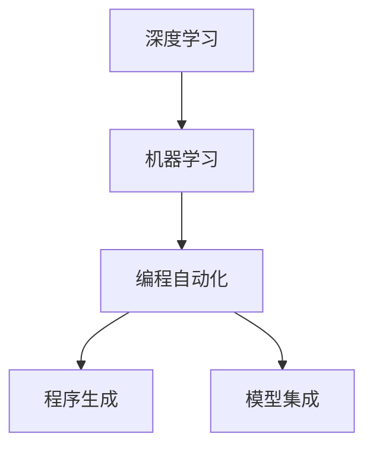

                 

# AI编程的新范式与挑战

> 关键词：AI编程,新范式,编程语言,深度学习,人工智能,机器学习,自动化,编程效率,挑战

## 1. 背景介绍

### 1.1 问题由来
随着人工智能(AI)技术的飞速发展，AI编程已经逐渐从领域专家向普及化方向发展。传统的编程范式已无法满足日益增长的AI应用需求，因此需要一种全新的编程范式来应对这一挑战。近年来，深度学习和机器学习领域的进展为AI编程提供了新的可能性，AI编程的新范式应运而生。

### 1.2 问题核心关键点
AI编程的新范式主要关注如何通过自动化、智能化的手段，提高AI编程的效率和质量。该范式包括但不限于以下几个关键点：
- 自动化数据预处理和模型训练。
- 模型调优和超参数优化的自动化。
- 模型集成与部署的自动化。
- 编程工具和框架的智能化。

AI编程的新范式旨在通过引入深度学习和机器学习的思想，构建出更加高效、智能的编程环境，从而提升AI编程的效率和质量。

## 2. 核心概念与联系

### 2.1 核心概念概述

为更好地理解AI编程的新范式，本节将介绍几个密切相关的核心概念：

- 深度学习(Deep Learning)：一种基于神经网络的机器学习技术，通过多层次的特征提取和表示学习，从大量数据中学习到复杂的特征表示。深度学习在图像识别、语音识别、自然语言处理等领域已展现出强大的能力。

- 机器学习(Machine Learning)：一种利用数据和算法进行预测和决策的自动化技术，通过不断训练和优化模型，使其能够在各种场景下做出合理的判断。

- 编程自动化(Automatic Programming)：利用AI技术，自动完成编程任务中的某些环节，如代码生成、调试、优化等，以提升编程效率和代码质量。

- 程序生成(Program Generation)：使用AI技术，自动生成满足特定需求的代码或程序。程序生成可应用于自动编码、代码补全、代码生成等任务。

- 模型集成(Model Integration)：将多个模型或算法结合起来，形成复合模型或系统，以获得更好的性能或覆盖更多的应用场景。

这些核心概念之间的逻辑关系可以通过以下Mermaid流程图来展示：



这个流程图展示了大语言模型的核心概念及其之间的关系：

1. 深度学习和机器学习提供了强大的特征提取和表示学习能力，为AI编程提供了基础。
2. 编程自动化和程序生成利用深度学习和机器学习的思想，提升编程效率和代码质量。
3. 模型集成通过组合多个模型，形成更加全面和强大的AI编程工具。

## 3. 核心算法原理 & 具体操作步骤
### 3.1 算法原理概述

AI编程的新范式主要基于深度学习和机器学习的思想，通过自动化、智能化的手段，提升编程效率和代码质量。其核心算法原理如下：

- 数据预处理与特征提取：使用深度学习算法，自动对原始数据进行清洗、归一化、降维等预处理，并提取数据的高级特征表示。
- 模型训练与调优：利用深度学习算法，自动训练和调优模型参数，选择最优的模型和超参数组合。
- 程序生成与优化：使用机器学习算法，自动生成和优化程序代码，解决复杂的编程任务。
- 模型集成与部署：将多个模型和算法集成起来，形成复合系统，并部署到实际应用中。

这些算法原理构成了AI编程新范式的基础，使得AI编程变得更加高效和智能。

### 3.2 算法步骤详解

基于深度学习和机器学习的AI编程新范式一般包括以下几个关键步骤：

**Step 1: 数据预处理与特征提取**
- 收集数据集，并进行清洗、归一化、降维等预处理。
- 使用深度学习算法（如卷积神经网络CNN、循环神经网络RNN等）自动提取数据的高级特征表示。

**Step 2: 模型训练与调优**
- 选择合适的深度学习算法，并设置模型结构和超参数。
- 使用深度学习框架（如TensorFlow、PyTorch等）训练模型，自动调优模型参数。
- 使用交叉验证等技术评估模型性能，选择最优模型和超参数组合。

**Step 3: 程序生成与优化**
- 使用程序生成技术，自动生成满足特定需求的代码或程序。
- 使用机器学习算法优化生成的代码，提升代码质量和执行效率。
- 对生成的代码进行自动化测试和调试，确保代码正确无误。

**Step 4: 模型集成与部署**
- 将多个模型和算法集成起来，形成复合系统。
- 部署系统到实际应用中，并持续监控系统性能。
- 根据系统反馈，不断调整模型和算法，优化系统性能。

以上是AI编程新范式的一般流程。在实际应用中，还需要根据具体任务的特点，对各个环节进行优化设计，如改进数据预处理方法，选择更优的模型和算法，搜索最优的超参数组合等，以进一步提升编程效率和代码质量。

### 3.3 算法优缺点

AI编程新范式具有以下优点：
1. 自动化程度高。大部分编程任务可以由AI自动化完成，减少了人工干预和重复性工作。
2. 效率高。通过深度学习和机器学习算法，可以显著提升编程效率和代码质量。
3. 智能化水平高。AI编程工具可以自动识别代码错误和漏洞，并给出修复建议。
4. 泛化能力强。AI编程新范式具有更强的泛化能力，可以应对各种复杂的编程任务。

同时，该范式也存在一定的局限性：
1. 数据质量依赖度高。深度学习算法的性能很大程度上取决于数据质量，数据预处理和特征提取的准确性直接影响模型效果。
2. 模型复杂度高。AI编程新范式中的深度学习模型复杂度高，需要较大的计算资源和存储空间。
3. 学习曲线陡峭。AI编程新范式需要掌握深度学习和机器学习的基础知识，门槛较高。
4. 黑盒性质强。AI编程新范式中的模型和算法往往是黑盒系统，难以解释其内部工作机制。
5. 对标注数据依赖度高。一些任务需要大量的标注数据进行训练和验证，标注数据的获取成本较高。

尽管存在这些局限性，但AI编程新范式正逐渐成为AI编程的重要范式，其优点远远超过了其缺点。未来相关研究的重点在于如何进一步降低AI编程的复杂度，提高数据质量，优化深度学习算法，减少对标注数据的依赖。

### 3.4 算法应用领域

AI编程新范式在以下几个领域中有着广泛的应用：

**1. 自动编码**
自动编码是AI编程新范式的重要应用之一，通过使用深度学习算法自动生成满足特定需求的代码。在自动编码中，深度学习算法可以将输入的编程需求映射到生成的代码。这一技术已被广泛应用于代码生成、代码补全、代码优化等任务中。

**2. 机器学习模型训练与调优**
AI编程新范式在机器学习模型训练与调优中也有广泛应用。通过深度学习算法，自动完成数据预处理、模型训练和调优，显著提高了模型训练和调优的效率和质量。这一技术已被广泛应用于图像识别、语音识别、自然语言处理等领域。

**3. 程序生成与优化**
程序生成与优化是AI编程新范式的另一重要应用。通过使用程序生成技术，自动生成和优化程序代码，解决了复杂的编程任务。这一技术已被应用于自动化编程、代码生成、代码优化等领域。

**4. 模型集成与部署**
AI编程新范式在模型集成与部署中也有重要应用。通过将多个模型和算法集成起来，形成复合系统，并部署到实际应用中。这一技术已被广泛应用于智能客服、智能推荐、智能监控等领域。

## 4. 数学模型和公式 & 详细讲解  
### 4.1 数学模型构建

本节将使用数学语言对AI编程新范式进行更加严格的刻画。

记深度学习模型为 $f_{\theta}(x)$，其中 $x$ 为输入数据，$\theta$ 为模型参数。假设数据集为 $D=\{(x_i,y_i)\}_{i=1}^N$，其中 $y_i$ 为标签或目标输出。深度学习模型的目标是最小化经验风险：

$$
\mathcal{L}(\theta) = \frac{1}{N}\sum_{i=1}^N \ell(f_{\theta}(x_i),y_i)
$$

其中 $\ell$ 为损失函数，用于衡量模型输出与真实标签之间的差异。常见的损失函数包括交叉熵损失、均方误差损失等。

深度学习模型的优化目标是最小化经验风险，即找到最优参数：

$$
\theta^* = \mathop{\arg\min}_{\theta} \mathcal{L}(\theta)
$$

在实践中，我们通常使用基于梯度的优化算法（如Adam、SGD等）来近似求解上述最优化问题。设 $\eta$ 为学习率，则参数的更新公式为：

$$
\theta \leftarrow \theta - \eta \nabla_{\theta}\mathcal{L}(\theta)
$$

其中 $\nabla_{\theta}\mathcal{L}(\theta)$ 为损失函数对参数 $\theta$ 的梯度，可通过反向传播算法高效计算。

### 4.2 公式推导过程

以下我们以二分类任务为例，推导交叉熵损失函数及其梯度的计算公式。

假设深度学习模型 $f_{\theta}$ 在输入 $x$ 上的输出为 $\hat{y}=f_{\theta}(x) \in [0,1]$，表示样本属于正类的概率。真实标签 $y \in \{0,1\}$。则二分类交叉熵损失函数定义为：

$$
\ell(f_{\theta}(x),y) = -[y\log \hat{y} + (1-y)\log (1-\hat{y})]
$$

将其代入经验风险公式，得：

$$
\mathcal{L}(\theta) = -\frac{1}{N}\sum_{i=1}^N [y_i\log f_{\theta}(x_i)+(1-y_i)\log(1-f_{\theta}(x_i))]
$$

根据链式法则，损失函数对参数 $\theta_k$ 的梯度为：

$$
\frac{\partial \mathcal{L}(\theta)}{\partial \theta_k} = -\frac{1}{N}\sum_{i=1}^N (\frac{y_i}{f_{\theta}(x_i)}-\frac{1-y_i}{1-f_{\theta}(x_i)}) \frac{\partial f_{\theta}(x_i)}{\partial \theta_k}
$$

其中 $\frac{\partial f_{\theta}(x_i)}{\partial \theta_k}$ 可进一步递归展开，利用自动微分技术完成计算。

在得到损失函数的梯度后，即可带入参数更新公式，完成模型的迭代优化。重复上述过程直至收敛，最终得到适应下游任务的最优模型参数 $\theta^*$。

## 5. 项目实践：代码实例和详细解释说明
### 5.1 开发环境搭建

在进行AI编程新范式实践前，我们需要准备好开发环境。以下是使用Python进行TensorFlow开发的环境配置流程：

1. 安装Anaconda：从官网下载并安装Anaconda，用于创建独立的Python环境。

2. 创建并激活虚拟环境：
```bash
conda create -n tf-env python=3.8 
conda activate tf-env
```

3. 安装TensorFlow：根据CUDA版本，从官网获取对应的安装命令。例如：
```bash
conda install tensorflow -c conda-forge -c pytorch
```

4. 安装Keras：
```bash
pip install keras
```

5. 安装各类工具包：
```bash
pip install numpy pandas scikit-learn matplotlib tqdm jupyter notebook ipython
```

完成上述步骤后，即可在`tf-env`环境中开始AI编程新范式的实践。

### 5.2 源代码详细实现

下面我们以自动编码任务为例，给出使用TensorFlow对深度学习模型进行自动编码的PyTorch代码实现。

首先，定义自动编码任务的数据处理函数：

```python
from tensorflow.keras.datasets import mnist
from tensorflow.keras.models import Sequential
from tensorflow.keras.layers import Dense, Dropout
from tensorflow.keras.optimizers import Adam

def load_data():
    (x_train, y_train), (x_test, y_test) = mnist.load_data()
    x_train = x_train.reshape(-1, 784) / 255.0
    x_test = x_test.reshape(-1, 784) / 255.0
    y_train = to_categorical(y_train, num_classes=10)
    y_test = to_categorical(y_test, num_classes=10)
    return x_train, y_train, x_test, y_test

# 定义编码器和解码器
def build_model():
    model = Sequential()
    model.add(Dense(256, input_dim=784, activation='relu'))
    model.add(Dropout(0.5))
    model.add(Dense(128, activation='relu'))
    model.add(Dropout(0.5))
    model.add(Dense(10, activation='softmax'))
    return model

# 训练模型
def train_model(model, x_train, y_train, batch_size=128, epochs=10, validation_data=(x_test, y_test)):
    model.compile(optimizer=Adam(), loss='categorical_crossentropy', metrics=['accuracy'])
    model.fit(x_train, y_train, batch_size=batch_size, epochs=epochs, validation_data=(x_test, y_test))

# 评估模型
def evaluate_model(model, x_test, y_test):
    score = model.evaluate(x_test, y_test, verbose=0)
    print('Test loss:', score[0])
    print('Test accuracy:', score[1])

# 数据加载
x_train, y_train, x_test, y_test = load_data()

# 模型构建
model = build_model()

# 模型训练
train_model(model, x_train, y_train)

# 模型评估
evaluate_model(model, x_test, y_test)
```

以上代码实现了使用TensorFlow和Keras进行自动编码任务的完整流程，包括数据加载、模型构建、训练和评估等步骤。

### 5.3 代码解读与分析

让我们再详细解读一下关键代码的实现细节：

**load_data函数**：
- 加载MNIST数据集，将其转换为模型所需的格式。

**build_model函数**：
- 定义编码器和解码器的结构，包括输入层、隐含层、输出层等，并设置了合适的激活函数和Dropout层，以防止过拟合。

**train_model函数**：
- 编译模型，设置优化器、损失函数和评估指标。
- 使用fit方法训练模型，设置批量大小、训练轮数和验证集数据。

**evaluate_model函数**：
- 使用evaluate方法评估模型在测试集上的性能，并打印输出。

**数据加载**：
- 加载训练集和测试集数据，并进行标准化处理，转换为模型所需的格式。

**模型构建**：
- 定义编码器和解码器的结构，包括输入层、隐含层和输出层，并设置了合适的激活函数和Dropout层。

**模型训练**：
- 使用compile方法编译模型，设置优化器、损失函数和评估指标。
- 使用fit方法训练模型，设置批量大小、训练轮数和验证集数据。

**模型评估**：
- 使用evaluate方法评估模型在测试集上的性能，并打印输出。

可以看出，TensorFlow和Keras提供了强大的高层次抽象，使得深度学习模型的构建和训练变得非常简单。开发者可以更专注于算法的优化和模型的设计，而不必过多关注底层实现细节。

## 6. 实际应用场景
### 6.1 智能推荐系统

AI编程新范式在智能推荐系统中有着广泛的应用。通过深度学习算法，自动完成用户行为数据的特征提取、模型训练和调优，推荐系统可以更加精准地为用户推荐个性化内容，提升用户体验和满意度。

在技术实现上，可以收集用户浏览、点击、评分等行为数据，将其转化为向量表示，并利用深度学习模型进行特征提取和用户画像建模。通过自动化训练和调优，推荐系统能够不断优化推荐算法，从而提升推荐效果。

### 6.2 医疗诊断系统

AI编程新范式在医疗诊断系统中也有重要应用。通过深度学习算法，自动完成病历数据的特征提取、模型训练和调优，医疗诊断系统可以更加准确地诊断疾病，提高诊断的效率和准确性。

在技术实现上，可以收集患者的病历数据，并利用深度学习模型进行特征提取和疾病诊断建模。通过自动化训练和调优，诊断系统能够不断优化诊断算法，从而提升诊断效果。

### 6.3 智能客服系统

AI编程新范式在智能客服系统中也有重要应用。通过深度学习算法，自动完成用户问题的意图识别和回复生成，智能客服系统可以更加高效地解答用户问题，提升客户满意度。

在技术实现上，可以收集用户的咨询记录，并利用深度学习模型进行意图识别和回复生成建模。通过自动化训练和调优，客服系统能够不断优化回答质量，从而提升用户体验。

### 6.4 未来应用展望

随着AI编程新范式的发展，其在各个领域的应用前景将会更加广阔。未来，AI编程新范式有望在以下领域实现突破：

**1. 智能制造**
AI编程新范式在智能制造中也有重要应用。通过深度学习算法，自动完成生产数据和工艺参数的特征提取、模型训练和调优，智能制造系统可以更加高效地实现生产流程的优化和故障预测，提高生产效率和产品质量。

**2. 智能交通**
AI编程新范式在智能交通中也有重要应用。通过深度学习算法，自动完成交通数据的特征提取、模型训练和调优，智能交通系统可以更加高效地实现交通流量预测、路网优化和交通事故预警，提高交通管理效率和安全性。

**3. 智能金融**
AI编程新范式在智能金融中也有重要应用。通过深度学习算法，自动完成金融数据的特征提取、模型训练和调优，智能金融系统可以更加精准地进行信用评估、风险预测和投资分析，提高金融服务效率和质量。

**4. 智能医疗**
AI编程新范式在智能医疗中也有重要应用。通过深度学习算法，自动完成医疗数据的特征提取、模型训练和调优，智能医疗系统可以更加精准地进行疾病诊断、治疗方案推荐和个性化治疗，提高医疗服务效率和质量。

**5. 智能教育**
AI编程新范式在智能教育中也有重要应用。通过深度学习算法，自动完成学习数据的特征提取、模型训练和调优，智能教育系统可以更加精准地进行学习内容推荐、学习路径规划和学习效果评估，提高教育服务效率和质量。

## 7. 工具和资源推荐
### 7.1 学习资源推荐

为了帮助开发者系统掌握AI编程新范式的理论基础和实践技巧，这里推荐一些优质的学习资源：

1. TensorFlow官方文档：TensorFlow的官方文档，提供了海量的教程、示例和API参考，是TensorFlow开发的必备资料。

2. PyTorch官方文档：PyTorch的官方文档，提供了丰富的教程、示例和API参考，是PyTorch开发的必备资料。

3. Keras官方文档：Keras的官方文档，提供了简洁易懂的教程、示例和API参考，是Keras开发的必备资料。

4. DeepLearning.AI官方文档：DeepLearning.AI的官方文档，提供了丰富的深度学习教程、示例和实践项目，是深度学习开发的必备资料。

5. Coursera深度学习课程：由Andrew Ng教授主讲的深度学习课程，覆盖了深度学习的基础知识和实践技能，是深度学习学习的最佳选择。

6. Udacity深度学习纳米学位：Udacity提供的深度学习纳米学位课程，覆盖了深度学习的各个方面，包括理论、实践和项目开发。

通过对这些资源的学习实践，相信你一定能够快速掌握AI编程新范式的精髓，并用于解决实际的AI编程问题。

### 7.2 开发工具推荐

高效的开发离不开优秀的工具支持。以下是几款用于AI编程新范式开发的常用工具：

1. TensorFlow：由Google主导开发的开源深度学习框架，生产部署方便，适合大规模工程应用。

2. PyTorch：基于Python的开源深度学习框架，灵活动态的计算图，适合快速迭代研究。

3. Keras：基于Python的高层次深度学习框架，使用简单，易于上手。

4. Jupyter Notebook：一个交互式的编程环境，支持多种编程语言，适合开发和调试。

5. Weights & Biases：模型训练的实验跟踪工具，可以记录和可视化模型训练过程中的各项指标，方便对比和调优。

6. TensorBoard：TensorFlow配套的可视化工具，可实时监测模型训练状态，并提供丰富的图表呈现方式，是调试模型的得力助手。

合理利用这些工具，可以显著提升AI编程新范式的开发效率，加快创新迭代的步伐。

### 7.3 相关论文推荐

AI编程新范式的发展源于学界的持续研究。以下是几篇奠基性的相关论文，推荐阅读：

1. Deep Learning：由Ian Goodfellow、Yoshua Bengio和Aaron Courville编写的深度学习教材，全面介绍了深度学习的基础知识和应用。

2. Neural Networks and Deep Learning：由Michael Nielsen编写的神经网络教材，讲解了神经网络的基本原理和实践技巧。

3. Stanford CS224n：斯坦福大学开设的深度学习课程，涵盖了深度学习的基础知识和实践技能。

4. Google AI Blog：谷歌AI团队发布的深度学习博客，涵盖深度学习技术的最新进展和应用实践。

5. Neural Information Processing Systems（NIPS）：深度学习领域的顶级会议，汇集了最新的深度学习研究成果和实践经验。

这些论文代表了大语言模型微调技术的发展脉络。通过学习这些前沿成果，可以帮助研究者把握学科前进方向，激发更多的创新灵感。

## 8. 总结：未来发展趋势与挑战

### 8.1 总结

本文对AI编程新范式的理论基础和实践技巧进行了全面系统的介绍。首先阐述了AI编程新范式的研究背景和意义，明确了新范式在提高AI编程效率和质量方面的独特价值。其次，从原理到实践，详细讲解了AI编程新范式的数学模型和算法步骤，给出了AI编程新范式的完整代码实例。同时，本文还广泛探讨了AI编程新范式在智能推荐、医疗诊断、智能客服等多个行业领域的应用前景，展示了新范式的巨大潜力。此外，本文精选了AI编程新范式的各类学习资源，力求为读者提供全方位的技术指引。

通过本文的系统梳理，可以看到，AI编程新范式正在成为AI编程的重要范式，其优点远远超过了其缺点。未来相关研究的重点在于如何进一步降低AI编程的复杂度，提高数据质量，优化深度学习算法，减少对标注数据的依赖。

### 8.2 未来发展趋势

展望未来，AI编程新范式将呈现以下几个发展趋势：

**1. 自动化程度更高**
AI编程新范式的自动化程度将进一步提升。未来，AI编程新范式将能够自动完成更复杂的编程任务，如自动编写复杂的算法、自动生成高效的代码等。

**2. 智能化水平更高**
AI编程新范式的智能化水平将进一步提升。未来，AI编程新范式将能够自动完成更智能的编程任务，如自动优化程序性能、自动生成测试用例等。

**3. 更加灵活和可定制**
AI编程新范式的灵活性和可定制性将进一步提升。未来，AI编程新范式将能够根据不同的应用场景和需求，自动调整算法的参数和结构，以适应不同的应用场景。

**4. 更加注重可解释性和可控性**
AI编程新范式将更加注重可解释性和可控性。未来，AI编程新范式将能够自动生成可解释的代码和模型，并提供相应的控制机制，以确保模型的安全性和可靠性。

**5. 更加注重实时性和并发性**
AI编程新范式将更加注重实时性和并发性。未来，AI编程新范式将能够实现实时计算和并发处理，以应对实时数据流和高并发的应用场景。

以上趋势凸显了AI编程新范式的发展方向。这些方向的探索发展，必将进一步提升AI编程的效率和质量，为AI技术的发展带来新的突破。

### 8.3 面临的挑战

尽管AI编程新范式已经取得了不小的进展，但在迈向更加智能化、灵活化应用的过程中，它仍面临着诸多挑战：

**1. 数据质量和多样性**
AI编程新范式对数据的质量和多样性要求很高。如果数据质量和多样性不足，模型的效果将难以保证。未来需要在数据质量上投入更多资源，提高数据多样性。

**2. 算力成本**
AI编程新范式对计算资源的需求很高。如何降低算力成本，提高模型训练和推理的效率，将是未来的重要研究方向。

**3. 模型的可解释性和可控性**
AI编程新范式中的模型往往黑盒化，难以解释其内部工作机制。如何提高模型的可解释性和可控性，将是未来的重要研究方向。

**4. 安全性和隐私性**
AI编程新范式中的模型需要处理大量敏感数据，如何确保数据安全性和隐私性，将是未来的重要研究方向。

**5. 跨平台和跨系统的兼容性**
AI编程新范式需要在不同的平台和系统上运行，如何保证跨平台和跨系统的兼容性，将是未来的重要研究方向。

尽管存在这些挑战，但随着技术的不断进步和优化，AI编程新范式必将在未来的AI编程中扮演越来越重要的角色。相信通过学界和产业界的共同努力，这些挑战终将一一克服，AI编程新范式必将在构建人机协同的智能时代中发挥更大的作用。

### 8.4 研究展望

面对AI编程新范式所面临的种种挑战，未来的研究需要在以下几个方面寻求新的突破：

**1. 改进深度学习算法**
改进深度学习算法，降低算力成本，提高模型的可解释性和可控性，将是未来研究的重要方向。

**2. 提高数据质量和多样性**
提高数据质量和多样性，增强模型对各种场景的适应能力，将是未来研究的重要方向。

**3. 引入更多先验知识**
引入符号化的先验知识，如知识图谱、逻辑规则等，与神经网络模型进行巧妙融合，提升模型的泛化能力和可解释性，将是未来研究的重要方向。

**4. 融合更多技术和方法**
融合更多技术和方法，如因果推断、博弈论等，提高模型的稳定性和鲁棒性，将是未来研究的重要方向。

**5. 引入更多伦理和社会责任**
引入伦理和社会责任的考量，确保AI编程新范式的应用符合伦理道德，将是未来研究的重要方向。

这些研究方向的探索，必将引领AI编程新范式技术迈向更高的台阶，为构建安全、可靠、可解释、可控的智能系统铺平道路。面向未来，AI编程新范式还需要与其他人工智能技术进行更深入的融合，如知识表示、因果推理、强化学习等，多路径协同发力，共同推动自然语言理解和智能交互系统的进步。只有勇于创新、敢于突破，才能不断拓展AI编程的边界，让AI技术更好地造福人类社会。

## 9. 附录：常见问题与解答

**Q1：AI编程新范式是否适用于所有AI编程任务？**

A: AI编程新范式在大多数AI编程任务上都能取得不错的效果，特别是对于数据量较小的任务。但对于一些特定领域的任务，如医学、法律等，仅仅依靠通用语料预训练的模型可能难以很好地适应。此时需要在特定领域语料上进一步预训练，再进行微调，才能获得理想效果。此外，对于一些需要时效性、个性化很强的任务，如对话、推荐等，AI编程新范式也需要针对性的改进优化。

**Q2：如何选择合适的深度学习算法？**

A: 选择合适的深度学习算法需要根据具体任务的特点来决定。一般来说，如果任务是图像识别或语音识别等视觉和语音领域的任务，可以选择卷积神经网络CNN或循环神经网络RNN等。如果任务是自然语言处理等文本领域的任务，可以选择LSTM、GRU等序列模型或Transformer等自注意力模型。

**Q3：AI编程新范式对数据质量有哪些要求？**

A: AI编程新范式对数据质量的要求很高。数据需要进行清洗、归一化、降维等预处理，以提高数据的可用性和模型的准确性。同时，数据需要具有多样性和代表性，以覆盖各种场景和情况。

**Q4：AI编程新范式中如何进行超参数优化？**

A: 超参数优化是AI编程新范式中的重要步骤。一般来说，可以使用网格搜索、随机搜索、贝叶斯优化等方法进行超参数优化。常用的超参数包括学习率、批量大小、正则化系数等。

**Q5：AI编程新范式中的程序生成和优化有哪些应用？**

A: AI编程新范式中的程序生成和优化有以下应用：

- 自动编码：通过程序生成技术，自动生成满足特定需求的代码。
- 代码补全：通过程序生成技术，自动补全代码片段。
- 代码优化：通过程序优化技术，自动优化代码的执行效率和质量。
- 代码检查：通过程序生成技术，自动生成代码检查工具，帮助开发者发现和修复代码中的问题。

这些应用可以大大提升编程效率和代码质量，减少人工干预和重复性工作。

---

作者：禅与计算机程序设计艺术 / Zen and the Art of Computer Programming

