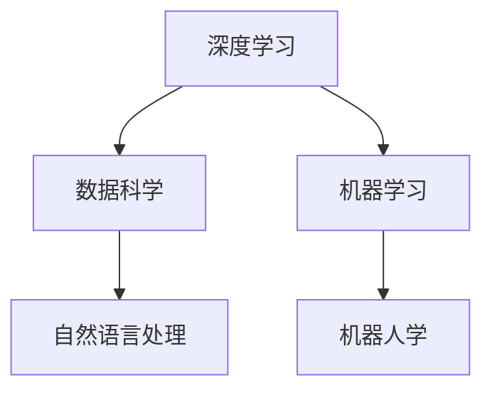

                 

# AI自动化的未来发展趋势

> 关键词：AI自动化, 人工智能, 深度学习, 数据科学, 机器人学, 自然语言处理

## 1. 背景介绍

### 1.1 问题由来

随着科技的迅猛发展，AI自动化技术已经成为当前最热门的研究领域之一。AI自动化技术的兴起，不仅推动了各行业的效率提升，还极大地改变了人类的生活方式。然而，随着技术的不断进步，AI自动化也面临着一些挑战和问题。本文将从AI自动化的基本概念和核心概念入手，分析其当前的发展现状和未来趋势，并探讨如何应对这些挑战。

### 1.2 问题核心关键点

AI自动化的核心在于通过自动化和智能化的手段，使得机器能够自主地完成复杂的任务。AI自动化技术的核心是深度学习和机器学习算法，通过大量的数据训练和模型优化，让机器具备自主学习和自主决策的能力。AI自动化技术的应用领域非常广泛，包括工业制造、金融、医疗、教育等。其优势在于可以提高生产效率，降低成本，减少人为错误，提升服务质量等。

然而，AI自动化技术也面临着一些挑战，如数据隐私、模型可解释性、伦理道德等问题。这些问题不仅会影响到AI自动化技术的发展，也会影响到其应用的安全性和可靠性。

### 1.3 问题研究意义

研究AI自动化的未来发展趋势，对于推动各行业的数字化转型，提高生产效率和服务质量，具有重要的意义。同时，通过了解AI自动化技术的优势和挑战，可以更好地应对其发展中的问题，确保其应用的安全性和可靠性。

## 2. 核心概念与联系

### 2.1 核心概念概述

AI自动化技术的核心在于深度学习和机器学习算法，通过大量的数据训练和模型优化，使得机器能够自主地完成复杂任务。以下是一些核心的概念和其联系：

- **深度学习（Deep Learning）**：一种基于神经网络的机器学习技术，通过多层次的神经网络对数据进行学习和处理，实现自主学习和决策。
- **机器学习（Machine Learning）**：通过大量数据训练模型，让机器能够自主地识别和处理数据，并进行决策。
- **数据科学（Data Science）**：利用数据进行分析和建模，辅助机器学习和决策。
- **自然语言处理（Natural Language Processing, NLP）**：一种利用机器学习技术处理和理解自然语言的技术。
- **机器人学（Robotics）**：结合AI技术和机械工程，实现自主决策和操作的机器人。

这些概念之间相互联系，共同构成了AI自动化的技术基础。

### 2.2 核心概念原理和架构的 Mermaid 流程图



这个流程图展示了AI自动化的核心概念及其相互联系。深度学习是AI自动化的基础，数据科学提供数据支持和模型优化，机器学习实现自主决策，自然语言处理处理和理解自然语言，机器人学实现自主决策和操作。这些技术相互交织，共同构成了AI自动化的技术体系。

## 3. 核心算法原理 & 具体操作步骤

### 3.1 算法原理概述

AI自动化的核心算法原理基于深度学习和机器学习，通过大量的数据训练和模型优化，使得机器能够自主地完成复杂任务。以下是AI自动化技术的核心算法和具体操作步骤：

- **深度学习算法**：包括卷积神经网络（CNN）、循环神经网络（RNN）、长短时记忆网络（LSTM）等，通过多层次的神经网络对数据进行学习和处理。
- **机器学习算法**：包括回归算法、分类算法、聚类算法等，通过大量数据训练模型，实现自主学习和决策。
- **数据科学算法**：包括数据预处理、特征选择、模型评估等，利用数据进行分析和建模，辅助机器学习和决策。

### 3.2 算法步骤详解

AI自动化技术的具体操作步骤包括以下几个关键步骤：

**Step 1: 数据收集和预处理**

数据收集和预处理是AI自动化的基础。需要收集相关的数据，并进行预处理，如数据清洗、特征提取、归一化等。预处理的好坏直接影响到后续模型的训练效果。

**Step 2: 模型训练和优化**

模型训练和优化是AI自动化的核心。需要选择合适的模型架构，并利用大量的数据进行训练和优化。常用的深度学习框架包括TensorFlow、PyTorch等。

**Step 3: 模型部署和应用**

模型训练完成后，需要进行部署和应用。将模型集成到实际的系统中，并进行测试和优化，确保其能够稳定运行和达到预期的效果。

**Step 4: 持续学习和改进**

AI自动化技术需要持续学习和改进。需要不断地收集新的数据和反馈，并对模型进行更新和优化，以提高其性能和稳定性。

### 3.3 算法优缺点

AI自动化技术具有以下优点：

- 提高生产效率：通过自动化和智能化的手段，使得机器能够自主地完成复杂任务，提高生产效率。
- 降低成本：减少了人力成本和错误率，降低了运营成本。
- 提升服务质量：通过自动化的手段，提高服务质量和客户满意度。

然而，AI自动化技术也存在一些缺点：

- 数据隐私问题：大量的数据收集和处理，涉及到数据隐私和安全问题。
- 模型可解释性：深度学习模型的决策过程较为复杂，难以进行解释和分析。
- 伦理道德问题：AI自动化技术的应用涉及到伦理道德问题，需要严格规范和监管。

### 3.4 算法应用领域

AI自动化技术的应用领域非常广泛，以下是一些典型的应用领域：

- **工业制造**：利用机器人自动化生产线，提高生产效率和质量。
- **金融**：利用机器学习算法进行风险评估、欺诈检测等。
- **医疗**：利用AI技术进行疾病诊断、药物研发等。
- **教育**：利用智能教育平台进行个性化教育，提高学习效率。
- **自动驾驶**：利用AI技术进行自动驾驶，提高行车安全和效率。

## 4. 数学模型和公式 & 详细讲解 & 举例说明

### 4.1 数学模型构建

AI自动化的数学模型通常包括深度学习模型和机器学习模型。以下是一些典型的数学模型：

- **卷积神经网络（CNN）**：
  $$
  f(x) = W^{[1]} * \sigma(z^{[1]})
  $$
  其中，$z^{[1]} = X * W^{[0]} + b^{[0]}$，$W^{[1]}$ 和 $b^{[1]}$ 为卷积层和偏置项。

- **循环神经网络（RNN）**：
  $$
  h_{t} = \tanh(W_{h} * [h_{t-1}, x_{t}] + b_{h})
  $$
  其中，$h_{t}$ 为当前时刻的隐藏状态，$W_{h}$ 和 $b_{h}$ 为循环神经网络的权重和偏置项。

- **长短时记忆网络（LSTM）**：
  $$
  f_{C} = \tanh(W_{f} * [h_{t-1}, x_{t}] + b_{f})
  $$
  $$
  i_{C} = \sigma(W_{i} * [h_{t-1}, x_{t}] + b_{i})
  $$
  $$
  f_{o} = \sigma(W_{o} * [h_{t-1}, x_{t}] + b_{o})
  $$
  $$
  C_{t} = f_{C} * i_{C} * C_{t-1} + (1 - i_{C}) * C_{t-1}
  $$
  $$
  h_{t} = f_{o} * C_{t}
  $$
  其中，$C_{t}$ 为当前时刻的细胞状态，$h_{t}$ 为当前时刻的隐藏状态。

### 4.2 公式推导过程

以下是一些典型AI自动化模型的公式推导过程：

- **卷积神经网络（CNN）**：
  $$
  f(x) = W^{[1]} * \sigma(z^{[1]})
  $$
  $$
  z^{[1]} = X * W^{[0]} + b^{[0]}
  $$

- **循环神经网络（RNN）**：
  $$
  h_{t} = \tanh(W_{h} * [h_{t-1}, x_{t}] + b_{h})
  $$

- **长短时记忆网络（LSTM）**：
  $$
  f_{C} = \tanh(W_{f} * [h_{t-1}, x_{t}] + b_{f})
  $$
  $$
  i_{C} = \sigma(W_{i} * [h_{t-1}, x_{t}] + b_{i})
  $$
  $$
  f_{o} = \sigma(W_{o} * [h_{t-1}, x_{t}] + b_{o})
  $$
  $$
  C_{t} = f_{C} * i_{C} * C_{t-1} + (1 - i_{C}) * C_{t-1}
  $$
  $$
  h_{t} = f_{o} * C_{t}
  $$

### 4.3 案例分析与讲解

**案例1：图像分类**

利用卷积神经网络（CNN）进行图像分类。以MNIST数据集为例，数据集包含手写数字图片，每个图片大小为28x28像素，共有10个类别。以下是基于CNN的图像分类模型：

- **模型构建**：使用Keras框架构建CNN模型，包括卷积层、池化层和全连接层。
- **数据预处理**：将原始数据集进行归一化、扩充等预处理操作。
- **模型训练**：使用交叉熵损失函数，Adam优化器进行模型训练。
- **模型评估**：在测试集上评估模型性能，计算准确率、精度等指标。

**案例2：文本分类**

利用循环神经网络（RNN）进行文本分类。以IMDB数据集为例，数据集包含电影评论，每个评论文本长度不一，共有两个类别（正面和负面）。以下是基于RNN的文本分类模型：

- **模型构建**：使用Keras框架构建RNN模型，包括嵌入层、循环层和全连接层。
- **数据预处理**：将原始文本进行嵌入处理，转化为固定长度的向量序列。
- **模型训练**：使用交叉熵损失函数，Adam优化器进行模型训练。
- **模型评估**：在测试集上评估模型性能，计算准确率、精度等指标。

## 5. 项目实践：代码实例和详细解释说明

### 5.1 开发环境搭建

在进行AI自动化项目实践前，需要准备好开发环境。以下是使用Python进行TensorFlow开发的Python环境配置流程：

1. 安装Anaconda：从官网下载并安装Anaconda，用于创建独立的Python环境。

2. 创建并激活虚拟环境：
```bash
conda create -n tf-env python=3.8 
conda activate tf-env
```

3. 安装TensorFlow：根据CUDA版本，从官网获取对应的安装命令。例如：
```bash
conda install tensorflow -c tf -c conda-forge
```

4. 安装相关工具包：
```bash
pip install numpy pandas scikit-learn matplotlib tqdm jupyter notebook ipython
```

完成上述步骤后，即可在`tf-env`环境中开始项目实践。

### 5.2 源代码详细实现

以下是使用TensorFlow实现图像分类的完整代码：

```python
import tensorflow as tf
from tensorflow.keras import layers, models

# 定义CNN模型
model = models.Sequential()
model.add(layers.Conv2D(32, (3, 3), activation='relu', input_shape=(28, 28, 1)))
model.add(layers.MaxPooling2D((2, 2)))
model.add(layers.Conv2D(64, (3, 3), activation='relu'))
model.add(layers.MaxPooling2D((2, 2)))
model.add(layers.Flatten())
model.add(layers.Dense(64, activation='relu'))
model.add(layers.Dense(10))

# 编译模型
model.compile(optimizer='adam',
              loss=tf.keras.losses.SparseCategoricalCrossentropy(from_logits=True),
              metrics=['accuracy'])

# 训练模型
model.fit(train_images, train_labels, epochs=10, 
          validation_data=(test_images, test_labels))

# 评估模型
test_loss, test_acc = model.evaluate(test_images, test_labels)
print('Test accuracy:', test_acc)
```

以上代码展示了使用TensorFlow构建CNN模型进行图像分类的过程。可以看到，TensorFlow提供了一系列的API，方便开发者进行模型构建和训练。

### 5.3 代码解读与分析

让我们再详细解读一下关键代码的实现细节：

**模型定义**：
- `Sequential`：定义序列模型，依次添加卷积层、池化层和全连接层。
- `Conv2D`：定义卷积层，输入大小为(28, 28, 1)，卷积核大小为(3, 3)，激活函数为ReLU。
- `MaxPooling2D`：定义池化层，池化大小为(2, 2)。
- `Flatten`：将卷积层的输出展平，转化为一维向量。
- `Dense`：定义全连接层，激活函数为ReLU。

**模型编译**：
- `compile`：编译模型，设置优化器、损失函数和评估指标。

**模型训练**：
- `fit`：训练模型，设置训练集和测试集，训练轮数为10。

**模型评估**：
- `evaluate`：评估模型，计算测试集上的准确率。

以上代码展示了使用TensorFlow进行图像分类的完整过程。TensorFlow提供了一系列的API，使得模型构建和训练过程非常简单和直观。

## 6. 实际应用场景

### 6.1 智能制造

AI自动化技术在智能制造领域有广泛的应用。通过智能化的生产线，可以实现自动化生产、质量检测、故障诊断等。例如，利用机器人自动化生产线，可以减少人力成本，提高生产效率和质量。

### 6.2 金融行业

AI自动化技术在金融行业也有广泛的应用。通过机器学习算法，可以进行风险评估、欺诈检测、信用评分等。例如，利用AI技术进行欺诈检测，可以提高金融系统的安全性。

### 6.3 医疗健康

AI自动化技术在医疗健康领域也有广泛的应用。通过AI技术，可以进行疾病诊断、药物研发、医疗影像分析等。例如，利用AI技术进行疾病诊断，可以提高诊断的准确率和效率。

### 6.4 未来应用展望

未来，AI自动化技术将呈现以下几个发展趋势：

- **智能化程度提升**：通过深度学习和强化学习等技术，提升AI自动化系统的智能化程度，使其能够自主决策和操作。
- **多模态融合**：将语音、视觉、文本等不同模态的数据进行融合，提升AI自动化系统的综合能力。
- **边缘计算**：利用边缘计算技术，提高AI自动化系统的实时性和响应速度。
- **伦理道德规范**：通过制定伦理道德规范，保障AI自动化系统的安全和可靠性。

## 7. 工具和资源推荐

### 7.1 学习资源推荐

为了帮助开发者系统掌握AI自动化的技术基础和实践技巧，这里推荐一些优质的学习资源：

1. **深度学习入门教程**：由TensorFlow官方提供的深度学习入门教程，覆盖了深度学习的基本概念和实践技巧。
2. **Keras官方文档**：Keras框架的官方文档，提供了丰富的API和样例代码，适合初学者快速上手。
3. **TensorFlow官方文档**：TensorFlow框架的官方文档，提供了详细的API文档和教程，适合深入学习。
4. **自然语言处理入门教程**：由自然语言处理领域的大师级专家提供的入门教程，涵盖了自然语言处理的基本概念和实践技巧。
5. **机器人学入门教程**：由机器人学领域的大师级专家提供的入门教程，涵盖了机器人学的基础概念和实践技巧。

通过对这些资源的学习实践，相信你一定能够快速掌握AI自动化的精髓，并用于解决实际的工程问题。

### 7.2 开发工具推荐

高效的开发离不开优秀的工具支持。以下是几款用于AI自动化开发的常用工具：

1. **TensorFlow**：由Google主导开发的深度学习框架，生产部署方便，适合大规模工程应用。
2. **Keras**：基于TensorFlow的高级API，提供了简单易用的模型构建接口，适合初学者使用。
3. **PyTorch**：由Facebook主导开发的深度学习框架，动态计算图，适合快速迭代研究。
4. **OpenCV**：开源的计算机视觉库，提供了丰富的图像处理和计算机视觉算法，适合图像识别和处理。
5. **ROS**：开源的机器人操作系统，提供了丰富的机器人控制和感知算法，适合机器人自动化系统开发。

合理利用这些工具，可以显著提升AI自动化任务的开发效率，加快创新迭代的步伐。

### 7.3 相关论文推荐

AI自动化的发展离不开学界的持续研究。以下是几篇奠基性的相关论文，推荐阅读：

1. **ImageNet Classification with Deep Convolutional Neural Networks**：提出卷积神经网络（CNN），广泛应用于图像识别任务。
2. **Long Short-Term Memory**：提出长短时记忆网络（LSTM），广泛应用于自然语言处理任务。
3. **Attention is All You Need**：提出Transformer模型，广泛应用于自然语言处理任务。
4. **Deep Learning for Drug Discovery**：提出深度学习在药物研发中的应用，展示了深度学习的强大能力。
5. **Robotic Process Automation in Healthcare**：提出机器人自动化在医疗领域的应用，展示了AI自动化的广泛应用前景。

这些论文代表了大数据、深度学习和AI自动化的发展脉络。通过学习这些前沿成果，可以帮助研究者把握学科前进方向，激发更多的创新灵感。

## 8. 总结：未来发展趋势与挑战

### 8.1 总结

本文对AI自动化的基本概念和核心算法原理进行了全面系统的介绍。首先，阐述了AI自动化的背景和核心概念，明确了AI自动化的发展方向和应用领域。其次，从算法原理和操作步骤出发，详细讲解了AI自动化的实现过程，提供了完整的代码实例和解释说明。同时，本文还探讨了AI自动化技术的优势和挑战，提供了相关的学习资源和开发工具推荐。

通过本文的系统梳理，可以看到，AI自动化技术已经成为各行业数字化转型的重要手段，具有广泛的应用前景和巨大的发展潜力。未来，AI自动化技术将继续深化与人工智能技术的融合，推动各行业的智能化转型。

### 8.2 未来发展趋势

展望未来，AI自动化技术将呈现以下几个发展趋势：

1. **智能化程度提升**：通过深度学习和强化学习等技术，提升AI自动化系统的智能化程度，使其能够自主决策和操作。
2. **多模态融合**：将语音、视觉、文本等不同模态的数据进行融合，提升AI自动化系统的综合能力。
3. **边缘计算**：利用边缘计算技术，提高AI自动化系统的实时性和响应速度。
4. **伦理道德规范**：通过制定伦理道德规范，保障AI自动化系统的安全和可靠性。
5. **持续学习和改进**：通过持续学习新数据和新知识，提高AI自动化系统的适应性和鲁棒性。

### 8.3 面临的挑战

尽管AI自动化技术已经取得了瞩目成就，但在迈向更加智能化、普适化应用的过程中，仍面临一些挑战：

1. **数据隐私问题**：大量的数据收集和处理，涉及到数据隐私和安全问题，需要制定严格的数据隐私保护策略。
2. **模型可解释性**：深度学习模型的决策过程较为复杂，难以进行解释和分析，需要引入可解释性技术，提高模型的透明度和可靠性。
3. **伦理道德问题**：AI自动化技术的应用涉及到伦理道德问题，需要制定严格的行为规范，保障系统的安全性和可靠性。
4. **计算资源限制**：AI自动化技术需要大量的计算资源，需要高效利用计算资源，提高系统的效率和性能。

### 8.4 研究展望

未来，AI自动化技术需要在以下几个方面寻求新的突破：

1. **深度学习模型优化**：通过模型优化和剪枝等技术，提高模型的效率和精度，降低计算资源需求。
2. **强化学习技术引入**：通过引入强化学习技术，提升AI自动化系统的自主决策和操作能力。
3. **多模态融合技术**：通过多模态融合技术，提高AI自动化系统的综合能力，增强系统的适应性和鲁棒性。
4. **可解释性技术研究**：通过引入可解释性技术，提高AI自动化系统的透明度和可靠性，增强用户信任。
5. **伦理道德规范制定**：通过制定伦理道德规范，保障AI自动化系统的安全和可靠性，避免伦理道德问题。

总之，AI自动化技术需要从多个维度进行深入研究和优化，才能在未来发展中取得更大的突破。未来，AI自动化技术必将在大数据、深度学习和人工智能技术的推动下，实现更加智能化、普适化的应用，为各行业带来深刻的变革和进步。

## 9. 附录：常见问题与解答

**Q1: 如何选择合适的AI自动化模型架构？**

A: 选择合适的AI自动化模型架构需要考虑以下几个方面：
1. 任务的复杂度：任务的复杂度越高，需要使用的模型越复杂。
2. 数据量和质量：数据量越大，数据质量越好，模型的表现也越好。
3. 计算资源：计算资源越充足，可以使用的模型越复杂。
4. 任务类型：不同类型任务需要不同的模型架构，如图像分类、文本分类等。

**Q2: 如何提高AI自动化模型的训练效率？**

A: 提高AI自动化模型的训练效率可以从以下几个方面入手：
1. 数据增强：通过数据增强技术，丰富训练数据，提高模型的泛化能力。
2. 模型剪枝：通过模型剪枝技术，减少模型参数，提高训练效率。
3. 批量训练：通过批量训练技术，提高训练速度，降低计算成本。
4. 分布式训练：通过分布式训练技术，利用多台计算设备进行训练，提高训练效率。

**Q3: 如何确保AI自动化模型的安全性？**

A: 确保AI自动化模型的安全性可以从以下几个方面入手：
1. 数据隐私保护：通过数据隐私保护技术，保护用户数据的安全性。
2. 模型可解释性：通过模型可解释性技术，提高模型的透明度和可靠性。
3. 行为规范制定：通过制定行为规范，约束AI自动化系统的行为，避免伦理道德问题。
4. 安全防护措施：通过安全防护措施，保障系统的安全性，防止恶意攻击。

通过合理使用这些技术和措施，可以确保AI自动化系统的安全性和可靠性，保障用户的利益和安全。

**Q4: 如何应对AI自动化技术的未来挑战？**

A: 应对AI自动化技术的未来挑战需要从以下几个方面入手：
1. 技术创新：通过技术创新，不断提升AI自动化系统的性能和效率。
2. 伦理道德规范：通过制定伦理道德规范，保障AI自动化系统的安全和可靠性。
3. 数据隐私保护：通过数据隐私保护技术，保护用户数据的安全性。
4. 计算资源优化：通过优化计算资源，提高AI自动化系统的效率和性能。
5. 持续学习和改进：通过持续学习新数据和新知识，提高AI自动化系统的适应性和鲁棒性。

这些措施可以帮助应对AI自动化技术的未来挑战，保障系统的安全和可靠性，推动技术的进一步发展。

