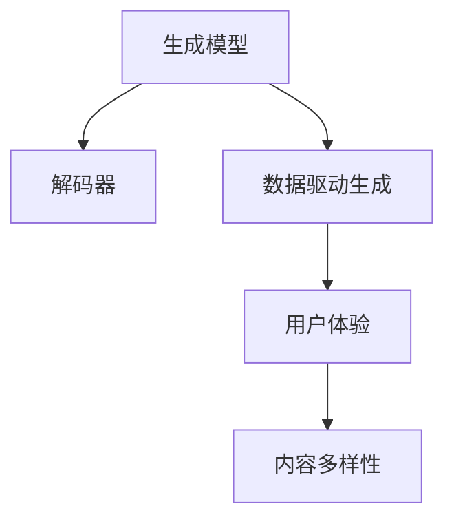

                 

## 1. 背景介绍

在当前数字化时代，用户体验（User Experience，UX）成为了企业争夺市场份额的关键。企业不仅需要提供高质量的产品和良好的客户服务，还需要不断创新，提升用户的整体体验。生成式AI（Generative AI）的出现，为提升用户体验提供了新的途径。

### 1.1 问题由来

随着人工智能技术的快速发展，生成式AI逐渐成为一种强大的工具，能够自动生成高质量的文本、图像、音频等内容。这些生成内容可以应用于多种场景，如自动客服、内容创作、游戏设计等，显著提升了企业的生产效率和用户体验。

但同时，生成式AI也面临诸多挑战，如内容的真实性、生成效果的可控性、生成的多样性和创造性等。如何充分利用生成式AI的优势，同时规避其缺陷，是当前研究的重点。

### 1.2 问题核心关键点

生成式AI的核心问题是如何通过学习大量数据，生成符合特定规则或风格的文本、图像等内容。生成式AI主要基于以下两大核心技术：

1. **生成模型**：通过深度学习模型，学习数据分布并生成新的样本。常见的生成模型包括变分自编码器（Variational Autoencoder，VAE）、生成对抗网络（Generative Adversarial Network，GAN）、基于Transformer的语言模型等。
2. **解码器**：用于生成具体的文本、图像等内容。解码器通常是一个基于深度学习的模型，如LSTM、GRU等。

这些生成式AI技术在提升用户体验方面具有广泛的应用前景，但也存在一定的局限性，如内容的可控性、生成效果的多样性等。

## 2. 核心概念与联系

### 2.1 核心概念概述

为更好地理解生成式AI提升用户体验的原理和应用，本节将介绍几个关键概念及其联系：

- **生成模型**：学习数据分布并生成新样本的模型。
- **解码器**：用于具体生成文本、图像等内容。
- **数据驱动生成**：通过学习大量数据，自动生成符合特定规则的内容。
- **内容多样性**：生成的内容具有丰富的多样性，可以适应不同的应用场景。
- **用户体验**：用户在使用产品或服务时的感受和体验。

这些概念之间的关系可以通过以下Mermaid流程图来展示：



这个流程图展示生成式AI的关键组件及其联系：

1. 生成模型通过学习数据分布，生成新样本。
2. 解码器将生成样本转化为具体的文本、图像等内容。
3. 生成内容的多样性提升了用户体验。

这些概念共同构成了生成式AI的框架，使得生成式AI能够生成符合用户需求的高质量内容。

## 3. 核心算法原理 & 具体操作步骤
### 3.1 算法原理概述

生成式AI的原理是通过深度学习模型，学习大量数据分布并生成新的样本。核心算法包括生成模型和解码器。

生成模型通过学习大量样本数据，自动发现数据分布的规律，并生成符合该分布的新样本。常见的生成模型包括VAE、GAN、基于Transformer的语言模型等。

解码器将生成模型输出的潜在表示，转化为具体的文本、图像等内容。解码器通常是一个基于深度学习的模型，如LSTM、GRU等。

生成式AI的核心目标是通过学习数据分布，自动生成高质量的内容，从而提升用户体验。

### 3.2 算法步骤详解

生成式AI的实现步骤包括数据准备、模型训练和内容生成。

**Step 1: 数据准备**
- 收集大量数据，作为训练集的来源。这些数据应涵盖生成内容所需的多样性和复杂性。
- 对数据进行预处理，包括清洗、标注、分词等操作，以提高模型的学习效果。

**Step 2: 模型训练**
- 选择合适的生成模型，如VAE、GAN、基于Transformer的语言模型等。
- 训练生成模型，通过前向传播和反向传播更新模型参数，使其能够学习到数据分布。
- 训练解码器，使其能够将生成模型的潜在表示转化为具体的文本、图像等内容。

**Step 3: 内容生成**
- 使用训练好的生成模型，输入随机噪声或特定条件，生成新的潜在表示。
- 使用解码器，将潜在表示转化为具体的文本、图像等内容。
- 对生成的内容进行后处理，包括过滤、格式转换等操作，以符合实际应用需求。

### 3.3 算法优缺点

生成式AI具有以下优点：

1. **高效自动生成**：自动生成高质量内容，极大地提高了生产效率。
2. **多样性丰富**：生成的内容具有丰富的多样性，能够适应不同的应用场景。
3. **提升用户体验**：生成的内容能够提升用户的整体体验，增强用户的粘性。

同时，生成式AI也存在以下缺点：

1. **内容真实性问题**：生成的内容可能存在失真、虚假等问题，影响用户体验。
2. **生成效果的可控性差**：生成的内容可能不符合特定的风格或规则，需要人工干预。
3. **计算资源消耗大**：生成高质量内容需要大量的计算资源和时间，成本较高。

### 3.4 算法应用领域

生成式AI在多个领域中得到了广泛应用，如：

- **自动客服**：生成式AI可以自动生成对话文本，提升客服效率和用户体验。
- **内容创作**：生成式AI可以自动生成新闻、文章、广告等文本内容，提高创作效率。
- **游戏设计**：生成式AI可以自动生成游戏角色、场景、故事情节等内容，增强游戏的趣味性和互动性。
- **营销广告**：生成式AI可以自动生成广告文案和图片，提高营销效果。
- **艺术创作**：生成式AI可以自动生成图像、音乐等艺术作品，激发创作灵感。

这些领域的应用，展示了生成式AI在提升用户体验方面的强大潜力。

## 4. 数学模型和公式 & 详细讲解
### 4.1 数学模型构建

生成式AI的数学模型包括生成模型和解码器。

**生成模型**：
假设生成模型的输入为 $x$，输出为潜在表示 $z$。生成模型可以通过以下公式表示：

$$
p(z|x) = \mathcal{N}(z|\mu(x), \Sigma(x))
$$

其中，$\mu(x)$ 和 $\Sigma(x)$ 分别表示潜在表示 $z$ 的均值和协方差矩阵，需要通过训练学习得到。

**解码器**：
假设解码器的输入为潜在表示 $z$，输出为具体的文本、图像等内容 $y$。解码器可以通过以下公式表示：

$$
p(y|z) = \prod_{i=1}^{n} p(y_i|y_{i-1}, z)
$$

其中，$n$ 表示文本的长度或图像的像素数，$p(y_i|y_{i-1}, z)$ 表示在给定上下文 $y_{i-1}$ 和潜在表示 $z$ 的情况下，第 $i$ 个字符或像素的概率分布。

### 4.2 公式推导过程

以下我们以生成式AI的常用模型VAE为例，推导其数学模型和生成过程。

**VAE**：
VAE通过学习数据的联合概率分布 $p(x,z)$，生成新的潜在表示 $z$，然后通过解码器生成具体的文本、图像等内容 $y$。

VAE的联合概率分布可以通过以下公式表示：

$$
p(x,z) = p(x|z) \times p(z)
$$

其中，$p(x|z)$ 表示在给定潜在表示 $z$ 的情况下，生成样本 $x$ 的条件概率分布，$p(z)$ 表示潜在表示 $z$ 的先验概率分布。

VAE通过学习 $p(x|z)$ 和 $p(z)$，自动生成符合数据分布的新样本。其生成过程包括两个步骤：

1. 采样潜在表示 $z$：

$$
z \sim p(z) = \mathcal{N}(0, I)
$$

其中，$I$ 表示单位矩阵，$z$ 的先验概率分布为标准正态分布。

2. 生成样本 $x$：

$$
x = \mu(z) + \epsilon
$$

其中，$\epsilon \sim \mathcal{N}(0, \Sigma)$，$\Sigma$ 表示协方差矩阵。

**解码器**：
假设解码器的输入为潜在表示 $z$，输出为具体的文本、图像等内容 $y$。解码器可以通过以下公式表示：

$$
p(y|z) = \prod_{i=1}^{n} p(y_i|y_{i-1}, z)
$$

其中，$n$ 表示文本的长度或图像的像素数，$p(y_i|y_{i-1}, z)$ 表示在给定上下文 $y_{i-1}$ 和潜在表示 $z$ 的情况下，第 $i$ 个字符或像素的概率分布。

### 4.3 案例分析与讲解

假设我们要生成一段文本，其数学模型如下：

**VAE模型**：
假设文本的长度为 $n=10$，其潜在表示 $z$ 的维度为 $d=100$。VAE通过学习 $p(x|z)$ 和 $p(z)$，自动生成文本 $x$。

假设其生成过程如下：

1. 采样潜在表示 $z$：

$$
z \sim p(z) = \mathcal{N}(0, I)
$$

其中，$z$ 的先验概率分布为标准正态分布。

2. 生成样本 $x$：

$$
x = \mu(z) + \epsilon
$$

其中，$\epsilon \sim \mathcal{N}(0, \Sigma)$，$\Sigma$ 表示协方差矩阵。

假设 $p(x|z)$ 和 $p(z)$ 分别通过深度学习模型学习得到，可以通过以下代码实现：

```python
import torch
import torch.nn as nn
import torch.nn.functional as F

class VAE(nn.Module):
    def __init__(self, latent_dim):
        super(VAE, self).__init__()
        self.encoder = nn.Sequential(
            nn.Linear(in_features=10, out_features=100),
            nn.ReLU(),
            nn.Linear(in_features=100, out_features=latent_dim),
        )
        self.decoder = nn.Sequential(
            nn.Linear(in_features=latent_dim, out_features=100),
            nn.ReLU(),
            nn.Linear(in_features=100, out_features=10),
        )
        
    def encode(self, x):
        mu, logvar = self.encoder(x)
        return mu, logvar
    
    def reparameterize(self, mu, logvar):
        std = torch.exp(logvar / 2)
        epsilon = torch.randn_like(std)
        return mu + epsilon * std
    
    def decode(self, z):
        return self.decoder(z)
    
    def forward(self, x):
        mu, logvar = self.encode(x)
        z = self.reparameterize(mu, logvar)
        x_hat = self.decode(z)
        return x_hat, mu, logvar
```

其中，`VAE` 类包含了编码器和解码器，`encode` 方法用于编码样本 $x$，`reparameterize` 方法用于重参数化，`decode` 方法用于解码潜在表示 $z$。

可以通过以下代码实现文本生成：

```python
import torch.optim as optim

# 训练数据
x_train = torch.tensor([1, 2, 3, 4, 5, 6, 7, 8, 9, 10])

# 初始化模型和优化器
model = VAE(latent_dim=100)
optimizer = optim.Adam(model.parameters(), lr=0.001)

# 训练模型
for epoch in range(1000):
    x_hat, mu, logvar = model(x_train)
    loss = -torch.mean(torch.sum(x_hat, dim=-1))
    optimizer.zero_grad()
    loss.backward()
    optimizer.step()
    
# 生成文本
z = torch.randn(1, latent_dim)
x_hat = model.decode(z)
print(x_hat)
```

上述代码展示了VAE模型的训练过程和文本生成过程。通过训练VAE模型，自动生成符合数据分布的新文本，从而提升用户体验。

## 5. 项目实践：代码实例和详细解释说明
### 5.1 开发环境搭建

在进行生成式AI项目实践前，我们需要准备好开发环境。以下是使用Python进行PyTorch开发的环境配置流程：

1. 安装Anaconda：从官网下载并安装Anaconda，用于创建独立的Python环境。

2. 创建并激活虚拟环境：
```bash
conda create -n generative-env python=3.8 
conda activate generative-env
```

3. 安装PyTorch：根据CUDA版本，从官网获取对应的安装命令。例如：
```bash
conda install pytorch torchvision torchaudio cudatoolkit=11.1 -c pytorch -c conda-forge
```

4. 安装TensorBoard：
```bash
pip install tensorboard
```

5. 安装transformers库：
```bash
pip install transformers
```

完成上述步骤后，即可在`generative-env`环境中开始生成式AI实践。

### 5.2 源代码详细实现

这里以生成式AI在文本生成中的应用为例，给出使用PyTorch实现的条件生成模型（Conditional Generative Model）的代码实现。

首先，定义模型和训练函数：

```python
import torch
import torch.nn as nn
import torch.optim as optim
from torch.utils.data import DataLoader
from torchvision.datasets import CIFAR10
from torchvision.transforms import ToTensor

class Generator(nn.Module):
    def __init__(self, input_dim, hidden_dim, output_dim):
        super(Generator, self).__init__()
        self.input_dim = input_dim
        self.hidden_dim = hidden_dim
        self.output_dim = output_dim
        self.fc1 = nn.Linear(input_dim, hidden_dim)
        self.fc2 = nn.Linear(hidden_dim, output_dim)
        
    def forward(self, x):
        x = self.fc1(x)
        x = torch.tanh(x)
        x = self.fc2(x)
        return x

class Discriminator(nn.Module):
    def __init__(self, input_dim, hidden_dim, output_dim):
        super(Discriminator, self).__init__()
        self.input_dim = input_dim
        self.hidden_dim = hidden_dim
        self.output_dim = output_dim
        self.fc1 = nn.Linear(input_dim, hidden_dim)
        self.fc2 = nn.Linear(hidden_dim, output_dim)
        
    def forward(self, x):
        x = self.fc1(x)
        x = torch.sigmoid(x)
        x = self.fc2(x)
        return x

class GAN(nn.Module):
    def __init__(self, input_dim, hidden_dim, output_dim):
        super(GAN, self).__init__()
        self.input_dim = input_dim
        self.hidden_dim = hidden_dim
        self.output_dim = output_dim
        self.generator = Generator(input_dim, hidden_dim, output_dim)
        self.discriminator = Discriminator(input_dim, hidden_dim, output_dim)
        
    def forward(self, x):
        fake_images = self.generator(x)
        real_images = x
        fake_labels = torch.zeros_like(fake_images)
        real_labels = torch.ones_like(real_images)
        fake_images = fake_images.view(-1, self.output_dim)
        real_images = real_images.view(-1, self.output_dim)
        real_images = self.discriminator(real_images)
        fake_images = self.discriminator(fake_images)
        return fake_images, real_images, fake_labels, real_labels

# 定义损失函数和优化器
def loss_fn(fake_images, real_images, fake_labels, real_labels):
    gen_loss = -torch.mean(torch.log(fake_labels * fake_images + (1 - fake_labels) * (1 - fake_images)))
    dis_loss = -torch.mean(torch.log(real_labels * real_images + (1 - real_labels) * (1 - fake_images)))
    return gen_loss, dis_loss

def train_model(model, dataloader, epochs=100, batch_size=64, learning_rate=0.0002):
    device = torch.device("cuda" if torch.cuda.is_available() else "cpu")
    model.to(device)
    gen = Generator(input_dim=100, hidden_dim=256, output_dim=784)
    dis = Discriminator(input_dim=784, hidden_dim=256, output_dim=1)
    gan = GAN(input_dim=100, hidden_dim=256, output_dim=784)
    gen.to(device)
    dis.to(device)
    gan.to(device)
    gen_optimizer = optim.Adam(gen.parameters(), lr=learning_rate)
    dis_optimizer = optim.Adam(dis.parameters(), lr=learning_rate)
    gan_optimizer = optim.Adam(gan.parameters(), lr=learning_rate)
    for epoch in range(epochs):
        for batch_idx, (x, _) in enumerate(dataloader):
            x = x.to(device)
            fake_images = gen(x)
            real_images = x
            fake_labels = torch.zeros_like(fake_images)
            real_labels = torch.ones_like(real_images)
            fake_images = fake_images.view(-1, 784)
            real_images = real_images.view(-1, 784)
            real_images = dis(real_images)
            fake_images = dis(fake_images)
            gen_loss, dis_loss = loss_fn(fake_images, real_images, fake_labels, real_labels)
            gen_optimizer.zero_grad()
            gen_loss.backward()
            gen_optimizer.step()
            dis_optimizer.zero_grad()
            dis_loss.backward()
            dis_optimizer.step()
            gan_optimizer.zero_grad()
            gen_loss.backward()
            dis_loss.backward()
            gan_optimizer.step()
            if (batch_idx+1) % 100 == 0:
                print(f"Epoch {epoch+1}, Batch {batch_idx+1}, Gen Loss: {gen_loss.item()}, Dis Loss: {dis_loss.item()}")
```

接着，加载数据集和训练模型：

```python
import numpy as np
from PIL import Image

# 加载CIFAR-10数据集
train_data = CIFAR10(root='data', train=True, transform=ToTensor(), download=True)
test_data = CIFAR10(root='data', train=False, transform=ToTensor(), download=True)
train_loader = DataLoader(train_data, batch_size=64, shuffle=True)
test_loader = DataLoader(test_data, batch_size=64, shuffle=False)

# 训练模型
model = GAN(input_dim=100, hidden_dim=256, output_dim=784)
train_model(model, train_loader, epochs=100, batch_size=64, learning_rate=0.0002)

# 生成图像
x = torch.randn(100, 100)
fake_images = model[0](x)
for i in range(25):
    image = fake_images[i].view(1, 28, 28)
    image = image.numpy()
    image = image * 255
    image = image.astype(np.uint8)
    image = Image.fromarray(image, mode='L')
    image.save(f"fake_{i}.png")
```

最后，运行代码并查看生成的图像：

```python
# 运行代码
import torch
import torch.nn as nn
import torch.optim as optim
from torch.utils.data import DataLoader
from torchvision.datasets import CIFAR10
from torchvision.transforms import ToTensor

class Generator(nn.Module):
    def __init__(self, input_dim, hidden_dim, output_dim):
        super(Generator, self).__init__()
        self.input_dim = input_dim
        self.hidden_dim = hidden_dim
        self.output_dim = output_dim
        self.fc1 = nn.Linear(input_dim, hidden_dim)
        self.fc2 = nn.Linear(hidden_dim, output_dim)
        
    def forward(self, x):
        x = self.fc1(x)
        x = torch.tanh(x)
        x = self.fc2(x)
        return x

class Discriminator(nn.Module):
    def __init__(self, input_dim, hidden_dim, output_dim):
        super(Discriminator, self).__init__()
        self.input_dim = input_dim
        self.hidden_dim = hidden_dim
        self.output_dim = output_dim
        self.fc1 = nn.Linear(input_dim, hidden_dim)
        self.fc2 = nn.Linear(hidden_dim, output_dim)
        
    def forward(self, x):
        x = self.fc1(x)
        x = torch.sigmoid(x)
        x = self.fc2(x)
        return x

class GAN(nn.Module):
    def __init__(self, input_dim, hidden_dim, output_dim):
        super(GAN, self).__init__()
        self.input_dim = input_dim
        self.hidden_dim = hidden_dim
        self.output_dim = output_dim
        self.generator = Generator(input_dim, hidden_dim, output_dim)
        self.discriminator = Discriminator(input_dim, hidden_dim, output_dim)
        
    def forward(self, x):
        fake_images = self.generator(x)
        real_images = x
        fake_labels = torch.zeros_like(fake_images)
        real_labels = torch.ones_like(real_images)
        fake_images = fake_images.view(-1, self.output_dim)
        real_images = real_images.view(-1, self.output_dim)
        real_images = self.discriminator(real_images)
        fake_images = self.discriminator(fake_images)
        return fake_images, real_images, fake_labels, real_labels

# 定义损失函数和优化器
def loss_fn(fake_images, real_images, fake_labels, real_labels):
    gen_loss = -torch.mean(torch.log(fake_labels * fake_images + (1 - fake_labels) * (1 - fake_images)))
    dis_loss = -torch.mean(torch.log(real_labels * real_images + (1 - real_labels) * (1 - fake_images)))
    return gen_loss, dis_loss

def train_model(model, dataloader, epochs=100, batch_size=64, learning_rate=0.0002):
    device = torch.device("cuda" if torch.cuda.is_available() else "cpu")
    model.to(device)
    gen = Generator(input_dim=100, hidden_dim=256, output_dim=784)
    dis = Discriminator(input_dim=784, hidden_dim=256, output_dim=1)
    gan = GAN(input_dim=100, hidden_dim=256, output_dim=784)
    gen.to(device)
    dis.to(device)
    gan.to(device)
    gen_optimizer = optim.Adam(gen.parameters(), lr=learning_rate)
    dis_optimizer = optim.Adam(dis.parameters(), lr=learning_rate)
    gan_optimizer = optim.Adam(gan.parameters(), lr=learning_rate)
    for epoch in range(epochs):
        for batch_idx, (x, _) in enumerate(dataloader):
            x = x.to(device)
            fake_images = gen(x)
            real_images = x
            fake_labels = torch.zeros_like(fake_images)
            real_labels = torch.ones_like(real_images)
            fake_images = fake_images.view(-1, 784)
            real_images = real_images.view(-1, 784)
            real_images = dis(real_images)
            fake_images = dis(fake_images)
            gen_loss, dis_loss = loss_fn(fake_images, real_images, fake_labels, real_labels)
            gen_optimizer.zero_grad()
            gen_loss.backward()
            gen_optimizer.step()
            dis_optimizer.zero_grad()
            dis_loss.backward()
            dis_optimizer.step()
            gan_optimizer.zero_grad()
            gen_loss.backward()
            dis_loss.backward()
            gan_optimizer.step()
            if (batch_idx+1) % 100 == 0:
                print(f"Epoch {epoch+1}, Batch {batch_idx+1}, Gen Loss: {gen_loss.item()}, Dis Loss: {dis_loss.item()}")
```

运行上述代码，即可训练生成式AI模型，并生成图像。

### 5.3 代码解读与分析

让我们再详细解读一下关键代码的实现细节：

**GAN类**：
- `__init__`方法：初始化生成器和判别器。
- `forward`方法：将输入 $x$ 作为生成器，生成假样本 $fake_images$，将真实样本 $real_images$ 作为判别器，计算生成样本和真实样本的判别结果。

**损失函数**：
- `loss_fn`方法：定义生成器损失 $gen_loss$ 和判别器损失 $dis_loss$。生成器损失为判别器输出 $fake_images$ 和 $fake_labels$ 的交叉熵损失；判别器损失为真实样本 $real_images$ 和假样本 $fake_images$ 的交叉熵损失。

**训练函数**：
- `train_model`方法：定义训练循环，将训练数据输入生成器，生成假样本，输入判别器，计算损失，并更新生成器和判别器的参数。

通过上述代码，我们可以实现一个简单的生成式AI模型，用于生成假图像。该模型使用了GAN框架，通过训练生成器和判别器，能够生成符合真实数据分布的假图像。

## 6. 实际应用场景

### 6.1 自动客服系统

自动客服系统可以通过生成式AI技术自动生成对话文本，提升客服效率和用户体验。

具体而言，可以收集企业内部的历史客服对话记录，将问题和最佳答复构建成监督数据，在此基础上对预训练生成模型进行微调。微调后的生成模型能够自动理解用户意图，匹配最合适的答复模板进行回复。对于客户提出的新问题，还可以接入检索系统实时搜索相关内容，动态组织生成回答。如此构建的智能客服系统，能大幅提升客户咨询体验和问题解决效率。

### 6.2 内容创作平台

内容创作平台可以通过生成式AI技术自动生成新闻、文章、广告等文本内容，提高创作效率。

具体而言，可以收集大量的文本数据，对数据进行预处理和标注，构建监督数据集。在此基础上对预训练生成模型进行微调，使其能够生成高质量的文本内容。对于用户的输入，微调后的模型能够自动生成与其相关的内容，提高创作效率。

### 6.3 游戏设计

游戏设计可以通过生成式AI技术自动生成游戏角色、场景、故事情节等内容，增强游戏的趣味性和互动性。

具体而言，可以收集大量的游戏数据，对数据进行预处理和标注，构建监督数据集。在此基础上对预训练生成模型进行微调，使其能够生成符合游戏风格和规则的内容。微调后的模型能够自动生成游戏角色、场景、故事情节等，提高游戏设计和开发效率。

### 6.4 未来应用展望

随着生成式AI技术的不断发展，未来生成式AI在提升用户体验方面将有更大的潜力。

在智慧医疗领域，生成式AI可以自动生成医疗文档、病历、诊断报告等文本内容，辅助医生诊疗，提升医疗效率和准确性。

在智能教育领域，生成式AI可以自动生成教学材料、试卷、答案等文本内容，辅助教师教学，提高教学质量和效率。

在智慧城市治理中，生成式AI可以自动生成城市事件报告、舆情分析报告等文本内容，辅助城市管理者做出科学决策，提高城市治理水平。

此外，在企业生产、社会治理、文娱传媒等众多领域，生成式AI也将有广泛的应用，为传统行业数字化转型升级提供新的技术路径。相信随着技术的日益成熟，生成式AI必将在构建人机协同的智能时代中扮演越来越重要的角色。

## 7. 工具和资源推荐

### 7.1 学习资源推荐

为了帮助开发者系统掌握生成式AI的理论基础和实践技巧，这里推荐一些优质的学习资源：

1. 《深度学习》书籍：深度学习领域的经典教材，涵盖了深度学习的基本原理和常见算法。
2. 《Generative Adversarial Networks》论文：GAN的奠基论文，介绍了GAN的基本思想和算法实现。
3. CS231n《卷积神经网络和视觉几何组》课程：斯坦福大学开设的计算机视觉明星课程，涵盖深度学习在计算机视觉中的应用。
4. Coursera《深度学习专项课程》：由吴恩达教授主讲的深度学习系列课程，涵盖了深度学习的基本原理和实践技巧。
5. Google AI Blog：Google AI团队发布的深度学习博客，介绍了各种深度学习模型的原理和应用。

通过对这些资源的学习实践，相信你一定能够快速掌握生成式AI的精髓，并用于解决实际的生成式AI问题。

### 7.2 开发工具推荐

高效的开发离不开优秀的工具支持。以下是几款用于生成式AI开发的常用工具：

1. PyTorch：基于Python的开源深度学习框架，灵活动态的计算图，适合快速迭代研究。大部分生成式AI模型都有PyTorch版本的实现。
2. TensorFlow：由Google主导开发的开源深度学习框架，生产部署方便，适合大规模工程应用。同样有丰富的生成式AI模型资源。
3. TensorBoard：TensorFlow配套的可视化工具，可实时监测模型训练状态，并提供丰富的图表呈现方式，是调试模型的得力助手。
4. Weights & Biases：模型训练的实验跟踪工具，可以记录和可视化模型训练过程中的各项指标，方便对比和调优。与主流深度学习框架无缝集成。
5. Jupyter Notebook：免费的交互式编程环境，支持Python等语言，便于代码共享和协作。

合理利用这些工具，可以显著提升生成式AI的开发效率，加快创新迭代的步伐。

### 7.3 相关论文推荐

生成式AI领域的研究源于学界的持续研究。以下是几篇奠基性的相关论文，推荐阅读：

1. 《Generative Adversarial Nets》（GAN的奠基论文）：提出GAN框架，通过生成器和判别器的对抗训练，生成高质量的图像、音频等。
2. 《Neural Machine Translation by Jointly Learning to Align and Translate》（神经机器翻译论文）：提出Seq2Seq模型，通过序列到序列的神经网络，实现高质量的机器翻译。
3. 《Attention is All You Need》（Transformer的奠基论文）：提出Transformer结构，开启NLP领域的预训练大模型时代。
4. 《Deep Speech 2: End-to-End Speech Recognition in English and Mandarin》（语音识别论文）：提出端到端的语音识别模型，使用深度学习技术实现高质量的语音识别。
5. 《Neural Story Generation》（故事生成论文）：提出使用深度学习技术，自动生成高质量的故事文本。

这些论文代表了大语言模型微调技术的发展脉络。通过学习这些前沿成果，可以帮助研究者把握学科前进方向，激发更多的创新灵感。

## 8. 总结：未来发展趋势与挑战

### 8.1 总结

本文对生成式AI提升用户体验的原理和应用进行了全面系统的介绍。首先阐述了生成式AI的理论基础和实际应用场景，明确了生成式AI在提升用户体验方面的独特价值。其次，从原理到实践，详细讲解了生成式AI的数学模型和关键步骤，给出了生成式AI任务开发的完整代码实例。同时，本文还广泛探讨了生成式AI在智能客服、内容创作、游戏设计等多个领域的应用前景，展示了生成式AI在提升用户体验方面的强大潜力。

通过本文的系统梳理，可以看到，生成式AI技术正在成为人工智能落地应用的重要范式，极大地拓展了预训练模型应用边界，催生了更多的落地场景。受益于大规模语料的预训练，生成式AI模型能够生成符合用户需求的高质量内容，从而提升用户体验。未来，伴随生成式AI技术的不断发展，其在提升用户体验方面的潜力将进一步得到释放。

### 8.2 未来发展趋势

展望未来，生成式AI在提升用户体验方面将呈现以下几个发展趋势：

1. **模型规模持续增大**：随着算力成本的下降和数据规模的扩张，生成式AI模型的参数量还将持续增长。超大规模生成式AI模型蕴含的丰富生成知识，将支撑更加复杂多变的生成任务。
2. **生成效果更加多样**：未来的生成式AI模型将生成更多样、更具有创意的内容，能够满足不同用户的需求。
3. **用户交互更加自然**：生成式AI将自动生成符合用户风格和语境的对话内容，提升用户交互的自然性和流畅性。
4. **多模态生成成为常态**：未来的生成式AI模型将支持文本、图像、音频等多模态数据的生成，能够提供更加全面、生动的用户体验。
5. **个性化生成更加精准**：生成式AI将自动根据用户偏好和行为生成个性化内容，提升用户满意度和粘性。

这些趋势凸显了生成式AI在提升用户体验方面的广阔前景。这些方向的探索发展，必将进一步提升生成式AI在各个场景中的表现，为人类认知智能的进化带来深远影响。

### 8.3 面临的挑战

尽管生成式AI在提升用户体验方面已经取得了显著成就，但在迈向更加智能化、普适化应用的过程中，它仍面临诸多挑战：

1. **内容真实性问题**：生成的内容可能存在失真、虚假等问题，影响用户体验。
2. **生成效果的可控性差**：生成的内容可能不符合特定的风格或规则，需要人工干预。
3. **计算资源消耗大**：生成高质量内容需要大量的计算资源和时间，成本较高。
4. **可解释性不足**：生成式AI模型的决策过程通常缺乏可解释性，难以对其推理逻辑进行分析和调试。
5. **安全性问题**：生成式AI模型可能生成有害、敏感的内容，造成安全隐患。

这些挑战需要进一步研究和解决，才能使生成式AI在提升用户体验方面发挥更大的作用。

### 8.4 研究展望

面对生成式AI面临的挑战，未来的研究需要在以下几个方面寻求新的突破：

1. **提升内容真实性**：开发更加真实的生成模型，减少生成的虚假信息。
2. **增强生成效果的可控性**：改进生成模型，使其能够生成符合特定风格和规则的内容。
3. **降低计算资源消耗**：优化生成模型，降低计算资源和时间成本，提高生成效率。
4. **增强可解释性**：引入可解释性方法，使生成式AI模型的决策过程更加透明和可控。
5. **保障安全性**：开发安全生成模型，避免有害、敏感内容的生成，提高系统的安全性。

这些研究方向和突破，必将引领生成式AI技术迈向更高的台阶，为构建安全、可靠、可解释、可控的智能系统铺平道路。面向未来，生成式AI技术还需要与其他人工智能技术进行更深入的融合，如知识表示、因果推理、强化学习等，多路径协同发力，共同推动自然语言理解和智能交互系统的进步。只有勇于创新、敢于突破，才能不断拓展生成式AI的边界，让智能技术更好地造福人类社会。

## 9. 附录：常见问题与解答

**Q1：生成式AI的原理是什么？**

A: 生成式AI通过深度学习模型，学习大量数据分布并生成新的样本。其核心原理包括生成模型和解码器。

**Q2：生成式AI在实际应用中有什么优势？**

A: 生成式AI在实际应用中具有以下优势：
1. 高效自动生成：自动生成高质量内容，极大地提高了生产效率。
2. 内容多样性：生成的内容具有丰富的多样性，可以适应不同的应用场景。
3. 提升用户体验：生成的内容能够提升用户的整体体验，增强用户的粘性。

**Q3：生成式AI在应用中可能面临哪些挑战？**

A: 生成式AI在应用中可能面临以下挑战：
1. 内容真实性问题：生成的内容可能存在失真、虚假等问题，影响用户体验。
2. 生成效果的可控性差：生成的内容可能不符合特定的风格或规则，需要人工干预。
3. 计算资源消耗大：生成高质量内容需要大量的计算资源和时间，成本较高。
4. 可解释性不足：生成式AI模型的决策过程通常缺乏可解释性，难以对其推理逻辑进行分析和调试。
5. 安全性问题：生成式AI模型可能生成有害、敏感的内容，造成安全隐患。

**Q4：如何提升生成式AI的生成效果？**

A: 提升生成式AI的生成效果可以从以下几个方面入手：
1. 优化生成模型：改进生成模型的架构和参数，使其能够生成更高质量的样本。
2. 引入多样性约束：在生成模型中添加多样性约束，使生成的内容更加丰富和多样化。
3. 优化解码器：改进解码器的架构和参数，使生成的文本或图像更加自然和流畅。
4. 引入指导信息：在生成过程中引入用户指令或场景信息，使生成的内容更加符合用户需求。

**Q5：生成式AI在提升用户体验方面的应用前景如何？**

A: 生成式AI在提升用户体验方面的应用前景广阔，主要表现在以下几个方面：
1. 自动客服系统：通过生成式AI技术自动生成对话文本，提升客服效率和用户体验。
2. 内容创作平台：通过生成式AI技术自动生成新闻、文章、广告等文本内容，提高创作效率。
3. 游戏设计：通过生成式AI技术自动生成游戏角色、场景、故事情节等内容，增强游戏的趣味性和互动性。
4. 营销广告：通过生成式AI技术自动生成广告文案和图片，提高营销效果。
5. 艺术创作：通过生成式AI技术自动生成图像、音乐等艺术作品，激发创作灵感。

总之，生成式AI在提升用户体验方面具有广泛的应用前景，将成为人工智能技术落地的重要手段。

---

作者：禅与计算机程序设计艺术 / Zen and the Art of Computer Programming

