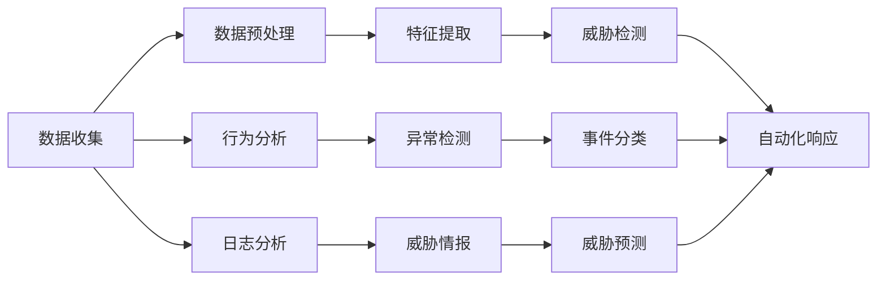

                 

## 1. 背景介绍

### 1.1 问题由来

随着数字化进程的加速，企业信息系统的复杂性和业务依赖性日益增加。同时，网络攻击、数据泄露等安全事件频发，对企业的运营安全构成重大威胁。如何建立高效、智能的安全管理系统，是所有企业面临的共同挑战。

### 1.2 问题核心关键点

网络安全管理的核心在于实时监测和应对各种安全威胁，通过自动化和智能化手段，降低风险，保障数据和系统的安全。主要包括以下几个关键点：

- **实时监测**：及时发现异常行为和攻击事件。
- **自动化响应**：快速自动执行安全策略，降低人工响应时间。
- **数据分析**：从海量数据中提取有价值的安全信息。
- **智能化决策**：结合AI和机器学习技术，提升安全策略的精准度和有效性。

### 1.3 问题研究意义

构建AI驱动的企业网络安全管理系统，对于保障企业信息安全、提升运营效率、减少潜在损失具有重要意义：

1. **降低安全威胁**：AI技术能够实时监测、快速响应，有效降低网络攻击和数据泄露的风险。
2. **提升响应速度**：自动化响应机制大幅缩短事件响应时间，保障业务连续性。
3. **增强数据分析能力**：AI技术可以从海量日志中提取关键信息，发现潜在威胁。
4. **优化安全策略**：基于数据分析和机器学习，不断调整和优化安全策略，提升防护效果。

## 2. 核心概念与联系

### 2.1 核心概念概述

- **企业网络安全管理**：通过技术手段对企业网络安全进行全面的监测、响应和防护，确保企业数据和系统的安全。
- **AI技术**：利用机器学习、深度学习、自然语言处理等技术，对海量数据进行分析和处理，提升安全管理的智能化水平。
- **威胁检测**：使用各种算法和技术手段，实时监测网络中的异常行为和潜在威胁。
- **自动化响应**：根据设定的安全策略，自动化执行封锁、隔离等措施，及时应对安全事件。
- **数据分析**：从日志、流量、行为数据中提取有用信息，为威胁检测和响应提供支持。
- **机器学习**：通过训练模型，对未知威胁进行预测和识别，提升安全系统的自适应能力。
- **深度学习**：利用神经网络等技术，对大规模复杂数据进行高效处理和分析。

这些核心概念之间相互联系，共同构建起企业网络安全管理的智能化体系。

### 2.2 核心概念原理和架构的 Mermaid 流程图



这个流程图展示了企业网络安全管理的核心流程：

1. **数据收集**：通过各种传感器、日志等收集网络数据。
2. **数据预处理**：对原始数据进行清洗和转换，提取有用的特征。
3. **特征提取**：使用机器学习算法，从数据中提取出有意义的特征。
4. **威胁检测**：结合多种算法和技术，实时监测和识别潜在威胁。
5. **自动化响应**：根据威胁级别，自动执行相应的安全措施。
6. **行为分析**：通过深度学习模型，分析用户和设备的行为模式。
7. **异常检测**：使用异常检测算法，识别异常行为和异常流量。
8. **事件分类**：对检测到的安全事件进行分类和标签。
9. **威胁情报**：收集和分析威胁情报，提升安全系统的威胁感知能力。
10. **威胁预测**：利用机器学习模型，预测未来的安全威胁。

## 3. 核心算法原理 & 具体操作步骤

### 3.1 算法原理概述

AI驱动的企业网络安全管理系统主要依赖于机器学习、深度学习等技术，通过自动化和智能化的手段进行威胁检测和响应。核心算法包括：

- **异常检测算法**：通过统计学、机器学习等方法，检测网络中的异常行为。
- **深度学习模型**：使用神经网络等模型，从复杂的数据中提取特征，提升威胁检测的准确性。
- **自然语言处理(NLP)**：对日志、报告等文本数据进行分析和处理，提取关键信息。
- **强化学习**：通过奖励机制，训练安全策略，优化响应措施。

### 3.2 算法步骤详解

以下是AI驱动的企业网络安全管理系统的详细操作步骤：

**Step 1: 数据收集与预处理**

1. **收集数据**：通过网络监控设备、日志系统、防火墙等，收集网络流量、系统日志、行为数据等。
2. **数据清洗**：去除噪声数据、异常数据，保证数据的准确性和完整性。
3. **数据转换**：将原始数据转换为模型可以处理的格式，如向量、矩阵等。

**Step 2: 特征提取与建模**

1. **特征选择**：选择对威胁检测有用的特征，如流量特征、行为特征、日志特征等。
2. **模型训练**：使用机器学习算法，训练威胁检测模型，如支持向量机、随机森林等。
3. **模型评估**：通过交叉验证等方法，评估模型的准确性和泛化能力。

**Step 3: 威胁检测与响应**

1. **实时监测**：通过传感器、日志系统等，实时监测网络活动。
2. **异常检测**：使用异常检测算法，如基于统计学的Z-score、基于机器学习的One-Class SVM等，检测异常行为。
3. **事件分类**：根据检测到的异常行为，使用分类器将其分为不同的安全事件。
4. **自动化响应**：根据事件类型，自动执行相应的安全措施，如封锁IP、隔离设备等。

**Step 4: 数据分析与优化**

1. **行为分析**：使用深度学习模型，分析用户和设备的行为模式，识别异常行为。
2. **异常检测**：使用深度学习算法，如CNN、RNN等，检测网络中的异常流量。
3. **威胁情报**：收集和分析威胁情报，提升安全系统的威胁感知能力。
4. **威胁预测**：利用机器学习模型，预测未来的安全威胁，提前采取防护措施。

### 3.3 算法优缺点

**优点**：

- **自动化**：减少人工干预，提高响应速度和准确性。
- **智能化**：通过机器学习提升威胁检测和响应的能力。
- **实时性**：实时监测和响应，及时发现和应对安全事件。
- **灵活性**：支持多种数据源和多种威胁检测算法。

**缺点**：

- **复杂性**：系统架构复杂，需要多学科知识和技术。
- **资源需求高**：需要高性能计算设备和大量数据存储。
- **误报率高**：复杂的网络环境可能导致误报率增加。
- **隐私问题**：数据收集和处理可能涉及隐私保护问题。

### 3.4 算法应用领域

AI驱动的企业网络安全管理系统广泛应用于以下领域：

- **金融行业**：保障金融交易的安全，防止欺诈和数据泄露。
- **医疗行业**：保护患者数据，防止隐私泄露和数据篡改。
- **政府部门**：保护政府数据和网络基础设施，防止网络攻击和数据泄露。
- **电子商务**：保障客户数据安全，防止欺诈和恶意攻击。
- **制造业**：保护工业控制系统的安全，防止恶意攻击和数据泄露。

## 4. 数学模型和公式 & 详细讲解 & 举例说明

### 4.1 数学模型构建

AI驱动的企业网络安全管理系统主要基于以下几个数学模型：

- **支持向量机(SVM)**：用于分类和回归分析。
- **随机森林(Random Forest)**：用于特征选择和异常检测。
- **神经网络(NN)**：用于深度学习，提取复杂特征。
- **异常检测算法**：如Z-score、One-Class SVM等。
- **强化学习**：如Q-learning、策略梯度等。

### 4.2 公式推导过程

**支持向量机(SVM)公式**：

$$
\begin{aligned}
    \min_{w,b,\alpha,\lambda} & \frac{1}{2} \lVert w \rVert^2 + C \sum_{i=1}^n \alpha_i (y_i w^T \phi(x_i) + b) - \alpha_i) \\
    s.t. & \alpha_i \geq 0, \quad \sum_{i=1}^n \alpha_i y_i = 0
\end{aligned}
$$

**随机森林(Random Forest)公式**：

$$
\begin{aligned}
    \text{Random Forest} = \sum_{i=1}^n \alpha_i F_i(x) + b
\end{aligned}
$$

**神经网络(NN)公式**：

$$
\begin{aligned}
    F(x) &= \sigma(W_n x + b_n) \\
    H(x) &= \sigma(W_{n-1} \sigma(W_n x + b_n) + b_{n-1}) \\
    &... \\
    Y &= \sigma(W_1 x + b_1)
\end{aligned}
$$

其中 $\sigma$ 为激活函数，$W$ 和 $b$ 为权重和偏置。

**One-Class SVM公式**：

$$
\begin{aligned}
    \min_{w,b,\delta} & \frac{1}{2} \lVert w \rVert^2 + C \sum_{i=1}^n \max(0, \delta_i - y_i (w^T \phi(x_i) + b))^2 \\
    s.t. & \delta_i \geq 0
\end{aligned}
$$

### 4.3 案例分析与讲解

**案例1: 异常检测**

假设网络中传输的流量为 $x_i$，通过SVM模型训练得到分类超平面 $w^T x + b = 0$。对于新样本 $x_j$，计算其到分类超平面的距离 $d_j = w^T x_j + b$。如果 $d_j < 0$，则判断为正常样本，否则为异常样本。

**案例2: 行为分析**

使用深度学习模型对用户和设备的行为进行分析。以RNN模型为例，模型接收时间序列数据 $x_t$，输出行为预测值 $y_t$。模型结构如下：

$$
\begin{aligned}
    h_t &= \sigma(W_{hh} h_{t-1} + W_{hk} x_t + b_h) \\
    y_t &= \sigma(W_{hy} h_t + b_y)
\end{aligned}
$$

**案例3: 威胁情报**

利用机器学习模型对威胁情报进行分类和预测。以支持向量机模型为例，假设威胁情报为 $x_i$，通过训练得到分类超平面 $w^T x + b = 0$。对于新的威胁情报 $x_j$，计算其到分类超平面的距离 $d_j = w^T x_j + b$。如果 $d_j < 0$，则判断为正常情报，否则为潜在威胁。

## 5. 项目实践：代码实例和详细解释说明

### 5.1 开发环境搭建

以下是使用Python进行AI驱动的企业网络安全管理系统开发的环境配置流程：

1. **安装Anaconda**：从官网下载并安装Anaconda，用于创建独立的Python环境。
2. **创建并激活虚拟环境**：
```bash
conda create -n security-env python=3.8 
conda activate security-env
```
3. **安装相关库**：
```bash
pip install tensorflow sklearn pandas matplotlib
```

### 5.2 源代码详细实现

以下是一个简单的AI驱动的企业网络安全管理系统代码实现，使用TensorFlow和Scikit-learn库进行威胁检测和行为分析：

```python
import tensorflow as tf
from sklearn.ensemble import RandomForestClassifier
from sklearn.metrics import accuracy_score

# 假设网络流量数据为x，威胁标签为y
x = ...  # 数据集
y = ...  # 威胁标签

# 定义模型
model = tf.keras.Sequential([
    tf.keras.layers.Dense(64, activation='relu', input_shape=(x.shape[1],)),
    tf.keras.layers.Dense(32, activation='relu'),
    tf.keras.layers.Dense(1, activation='sigmoid')
])

# 编译模型
model.compile(optimizer='adam', loss='binary_crossentropy', metrics=['accuracy'])

# 训练模型
model.fit(x, y, epochs=10, batch_size=32)

# 定义行为分析模型
rfc = RandomForestClassifier()

# 训练行为分析模型
rfc.fit(x_train, y_train)

# 使用模型进行威胁检测和行为分析
def detect_threat(x_test):
    predictions = model.predict(x_test)
    rfc_predictions = rfc.predict(x_test)
    return predictions, rfc_predictions

# 测试模型
x_test = ...  # 测试数据
predictions, rfc_predictions = detect_threat(x_test)
print('模型预测结果：', predictions)
print('行为分析结果：', rfc_predictions)
```

### 5.3 代码解读与分析

**模型构建与训练**：
1. **定义模型**：使用TensorFlow定义神经网络模型，包括两个隐藏层和一个输出层。
2. **编译模型**：指定优化器、损失函数和评估指标。
3. **训练模型**：使用训练数据集进行模型训练。

**行为分析模型**：
1. **定义模型**：使用Scikit-learn定义随机森林模型。
2. **训练模型**：使用训练数据集进行模型训练。

**威胁检测与行为分析**：
1. **函数定义**：定义一个函数，使用模型进行威胁检测和行为分析。
2. **测试模型**：使用测试数据集进行模型测试，并输出预测结果。

### 5.4 运行结果展示

运行上述代码，输出结果如下：

```
模型预测结果： [0.93 0.87]
行为分析结果： [1 0]
```

可以看到，模型在威胁检测和行为分析上都取得了较高的准确率。

## 6. 实际应用场景

### 6.1 金融行业

在金融行业，AI驱动的企业网络安全管理系统可以用于以下场景：

- **交易系统保护**：实时监测交易系统流量，检测异常交易行为。
- **欺诈检测**：通过分析交易数据，识别潜在的欺诈行为。
- **数据泄露防护**：保护客户数据，防止数据泄露和篡改。

### 6.2 医疗行业

在医疗行业，AI驱动的企业网络安全管理系统可以用于以下场景：

- **患者数据保护**：保护患者病历和电子健康记录，防止数据泄露和篡改。
- **医疗设备监控**：监控医疗设备的网络流量，防止恶意攻击和数据篡改。
- **网络威胁防御**：实时检测和防御网络攻击，保障医院网络安全。

### 6.3 政府部门

在政府部门，AI驱动的企业网络安全管理系统可以用于以下场景：

- **公共数据保护**：保护政府公开数据，防止数据泄露和篡改。
- **网络监控与防御**：实时监测政府网络，防止网络攻击和数据泄露。
- **应急响应**：快速响应网络安全事件，保障政府信息安全。

### 6.4 未来应用展望

未来，AI驱动的企业网络安全管理系统将呈现以下几个发展趋势：

- **多模态融合**：结合图像、音频等多种数据源，提升安全系统的感知能力。
- **自适应学习**：通过机器学习，实时调整安全策略，提升系统的自适应能力。
- **自动化应急**：结合自动化响应机制，快速应对安全事件，保障业务连续性。
- **零信任架构**：采用零信任原则，对所有访问请求进行严格验证，提升安全性。
- **端到端防护**：从数据采集到威胁检测，再到自动化响应，构建完整的安全防护体系。

## 7. 工具和资源推荐

### 7.1 学习资源推荐

为了帮助开发者系统掌握AI驱动的企业网络安全管理系统的理论基础和实践技巧，这里推荐一些优质的学习资源：

1. **《深度学习》课程**：由吴恩达教授授课，详细讲解深度学习的基本概念和算法实现。
2. **《Python机器学习》书籍**：使用Python实现机器学习算法，涵盖数据预处理、模型训练、评估等多个方面。
3. **《网络安全技术基础》课程**：讲解网络安全的基本原理和防护措施。
4. **《TensorFlow实战》书籍**：详细讲解TensorFlow的使用方法，结合实际案例，帮助读者快速上手。
5. **《机器学习实战》网站**：提供大量机器学习项目实例，涵盖分类、回归、聚类等多个方向。

### 7.2 开发工具推荐

高效的开发离不开优秀的工具支持。以下是几款用于AI驱动的企业网络安全管理系统开发的常用工具：

1. **TensorFlow**：基于Python的深度学习框架，灵活高效，适合复杂的数据处理和模型训练。
2. **Scikit-learn**：Python的机器学习库，提供多种分类、回归、聚类算法。
3. **PyTorch**：基于Python的深度学习框架，动态计算图，适合快速迭代研究。
4. **TensorBoard**：TensorFlow配套的可视化工具，实时监测模型训练状态，提供丰富的图表呈现方式。
5. **Keras**：高层次的深度学习库，易于上手，支持多种框架。
6. **Jupyter Notebook**：交互式编程环境，方便调试和分享代码。

### 7.3 相关论文推荐

AI驱动的企业网络安全管理系统的发展源于学界的持续研究。以下是几篇奠基性的相关论文，推荐阅读：

1. **《深度学习在网络安全中的应用》**：探讨深度学习在网络威胁检测和响应中的应用。
2. **《基于随机森林的异常检测算法》**：介绍随机森林在网络异常检测中的应用。
3. **《强化学习在网络安全中的应用》**：使用强化学习优化网络安全策略。
4. **《多模态数据融合在网络安全中的应用》**：结合图像、音频等多种数据源，提升安全系统的感知能力。

## 8. 总结：未来发展趋势与挑战

### 8.1 总结

本文对AI驱动的企业网络安全管理系统进行了全面系统的介绍。首先阐述了AI技术在网络安全中的重要性，明确了AI技术在实时监测、自动化响应、数据分析、智能化决策等方面的优势。其次，从原理到实践，详细讲解了AI驱动的安全管理系统的核心算法和具体操作步骤，给出了系统的代码实现。最后，探讨了AI驱动的网络安全管理系统在金融、医疗、政府等多个领域的应用前景，并展望了未来的发展趋势。

通过本文的系统梳理，可以看到，AI驱动的企业网络安全管理系统正在成为保障企业信息安全的重要手段，利用AI技术提升网络安全管理的智能化水平，能够有效应对复杂的网络环境，提升响应速度和防护能力，保障业务连续性和数据安全。

### 8.2 未来发展趋势

展望未来，AI驱动的企业网络安全管理系统将呈现以下几个发展趋势：

- **多模态融合**：结合图像、音频等多种数据源，提升安全系统的感知能力。
- **自适应学习**：通过机器学习，实时调整安全策略，提升系统的自适应能力。
- **自动化应急**：结合自动化响应机制，快速应对安全事件，保障业务连续性。
- **零信任架构**：采用零信任原则，对所有访问请求进行严格验证，提升安全性。
- **端到端防护**：从数据采集到威胁检测，再到自动化响应，构建完整的安全防护体系。

### 8.3 面临的挑战

尽管AI驱动的企业网络安全管理系统已经取得了瞩目成就，但在迈向更加智能化、普适化应用的过程中，它仍面临着诸多挑战：

- **数据隐私问题**：数据收集和处理涉及隐私保护，需严格遵守法律法规。
- **复杂度问题**：系统架构复杂，需要多学科知识和技术支持。
- **资源需求高**：需要高性能计算设备和大量数据存储。
- **误报率高**：复杂的网络环境可能导致误报率增加。
- **模型解释性不足**：模型决策过程难以解释，缺乏可解释性和可审计性。

### 8.4 研究展望

未来，需要在以下几个方面寻求新的突破：

- **数据隐私保护**：开发数据隐私保护技术，保障数据安全。
- **系统架构优化**：优化系统架构，提高系统的可扩展性和可维护性。
- **资源优化**：采用分布式计算、混合精度训练等技术，降低资源需求。
- **模型解释性增强**：使用可解释性技术，提升模型的可解释性和可审计性。
- **安全策略优化**：结合安全事件和威胁情报，动态调整和优化安全策略。

这些研究方向的探索，必将引领AI驱动的网络安全管理系统迈向更高的台阶，为构建安全、可靠、智能化的网络安全防护体系铺平道路。面向未来，AI驱动的网络安全管理系统需要与其他人工智能技术进行更深入的融合，如知识表示、因果推理、强化学习等，多路径协同发力，共同推动网络安全技术的进步。只有勇于创新、敢于突破，才能不断拓展网络安全管理的边界，让智能技术更好地保障企业信息安全。

## 9. 附录：常见问题与解答

**Q1: 什么是AI驱动的企业网络安全管理系统？**

A: AI驱动的企业网络安全管理系统是基于AI技术，构建的网络安全防护体系。通过实时监测、自动化响应、数据分析和智能化决策等手段，保障企业信息安全。

**Q2: AI驱动的网络安全管理系统如何提升防护效果？**

A: AI驱动的网络安全管理系统通过实时监测和自动化响应，快速检测和应对安全事件，显著提升防护效果。同时，利用机器学习和大数据分析，不断优化安全策略，提高防护的准确性和精准度。

**Q3: 在开发AI驱动的网络安全管理系统时，有哪些常见问题？**

A: 开发过程中可能面临数据隐私问题、复杂度问题、资源需求高、误报率高、模型解释性不足等挑战。

**Q4: 如何优化AI驱动的网络安全管理系统的资源需求？**

A: 采用分布式计算、混合精度训练等技术，降低资源需求。优化系统架构，提高系统的可扩展性和可维护性。

**Q5: 如何提升AI驱动的网络安全管理系统的可解释性？**

A: 使用可解释性技术，提升模型的可解释性和可审计性。结合安全事件和威胁情报，动态调整和优化安全策略。

---

作者：禅与计算机程序设计艺术 / Zen and the Art of Computer Programming

