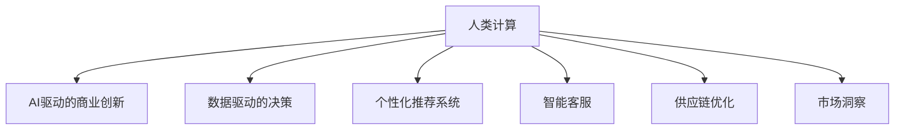

                 

## 1. 背景介绍

### 1.1 问题由来
在人工智能飞速发展的今天，人类计算被赋予了新的生命力。尤其是AI驱动的商业创新，正在重塑着各行各业的生态。从消费电子、零售到医疗保健、金融服务，人类计算正在成为企业竞争力的重要引擎。本文将深入探讨人类计算在商业中的优势，通过理论和实践相结合的方式，剖析AI驱动的商业创新的本质，并展望未来发展趋势。

### 1.2 问题核心关键点
人类计算的核心在于将人类的经验、智慧和知识融入计算模型中，通过数据驱动的方式，生成更加个性化、高效和有价值的商业决策。AI驱动的商业创新，通过利用数据挖掘、机器学习、自然语言处理等前沿技术，实现对海量数据的高效分析和智能决策，极大地提升了企业的运营效率和竞争力。

AI驱动的商业创新主要涵盖以下几个方面：
1. **个性化推荐**：通过分析用户的购买历史、行为数据和偏好信息，提供定制化的商品和服务推荐，提升用户体验和满意度。
2. **智能客服**：利用自然语言处理技术，构建智能客服系统，能够快速响应客户查询，提供准确、满意的解决方案，提升客户满意度和忠诚度。
3. **供应链优化**：通过大数据分析和预测，优化供应链管理，减少库存成本，提高供应链的响应速度和灵活性。
4. **市场洞察**：利用自然语言处理技术，分析社交媒体、新闻报道等海量文本数据，提取市场趋势和消费者情绪，为企业决策提供支持。

### 1.3 问题研究意义
研究人类计算在商业中的优势，对于理解和应用AI技术、推动企业数字化转型、提升商业决策水平具有重要意义：
1. **提升运营效率**：通过自动化、智能化的工具和方法，大幅减少人工操作，提高工作效率。
2. **增强决策准确性**：利用数据驱动的分析和预测，提高决策的科学性和可靠性。
3. **优化用户体验**：通过个性化的服务和推荐，提升用户满意度和忠诚度。
4. **拓展商业边界**：通过AI技术的应用，打开新的商业机会，探索新的市场和应用场景。

## 2. 核心概念与联系

### 2.1 核心概念概述

为更好地理解人类计算在商业中的应用，本节将介绍几个关键概念：

- **人类计算**：指将人类的经验、智慧和知识融入计算模型中，通过数据驱动的方式，生成更加个性化、高效和有价值的商业决策。
- **AI驱动的商业创新**：利用人工智能技术，如数据挖掘、机器学习、自然语言处理等，实现对海量数据的分析、预测和决策，提升企业的运营效率和竞争力。
- **数据驱动的决策**：基于大数据和先进算法，自动化地生成商业决策，减少人为干预，提升决策效率和准确性。
- **个性化推荐系统**：通过分析用户行为和偏好，提供定制化的产品和服务推荐，提升用户体验和满意度。
- **智能客服**：利用自然语言处理技术，构建智能客服系统，提高客户服务的效率和质量。
- **供应链优化**：通过大数据分析和预测，优化供应链管理，提高供应链的响应速度和灵活性。
- **市场洞察**：利用自然语言处理技术，分析社交媒体、新闻报道等海量文本数据，提取市场趋势和消费者情绪，为企业决策提供支持。

这些核心概念之间的逻辑关系可以通过以下Mermaid流程图来展示：



这个流程图展示了人类计算的各个关键组件及其之间的关系：

1. 人类计算通过数据驱动的方式，生成商业决策，是AI驱动商业创新的基础。
2. 数据驱动的决策利用AI技术，对海量数据进行分析、预测和决策，提升运营效率和竞争力。
3. 个性化推荐系统、智能客服、供应链优化、市场洞察等技术，是实现人类计算在商业应用中的具体手段。

## 3. 核心算法原理 & 具体操作步骤
### 3.1 算法原理概述

AI驱动的商业创新涉及多个算法和技术，如自然语言处理、机器学习、数据挖掘等。其核心算法原理包括：

- **自然语言处理(NLP)**：通过文本分析、情感分析、实体识别等技术，提取和理解文本数据中的关键信息。
- **机器学习算法**：如监督学习、无监督学习、强化学习等，利用数据驱动的算法模型，生成预测和决策。
- **数据挖掘**：通过聚类、分类、关联规则等算法，从大量数据中挖掘出有价值的模式和规律。

### 3.2 算法步骤详解

AI驱动的商业创新通常包括以下几个关键步骤：

**Step 1: 数据收集与预处理**
- 收集与业务相关的数据，如用户行为数据、交易记录、社交媒体数据等。
- 清洗和预处理数据，去除噪声和缺失值，确保数据的质量和一致性。

**Step 2: 特征工程与建模**
- 选择和构造适合模型的特征，如用户行为特征、商品属性特征、时间特征等。
- 选择合适的算法模型，并训练模型，生成预测或决策。

**Step 3: 模型评估与优化**
- 在验证集上评估模型性能，如准确率、召回率、F1分数等。
- 根据评估结果，调整模型参数或选择新的模型，优化模型性能。

**Step 4: 模型部署与监控**
- 将训练好的模型部署到生产环境，实现实时预测和决策。
- 监控模型运行状态，定期更新模型，确保模型的稳定性和准确性。

### 3.3 算法优缺点

AI驱动的商业创新具有以下优点：
1. **效率提升**：通过自动化和智能化的工具，大幅提升运营效率，减少人工成本。
2. **决策优化**：基于数据驱动的算法模型，生成更加科学和可靠的决策。
3. **用户满意**：通过个性化推荐和服务，提升用户体验和满意度。
4. **市场洞察**：通过分析海量数据，获取市场趋势和消费者情绪，为企业决策提供支持。

同时，该方法也存在一定的局限性：
1. **数据质量依赖**：模型的性能依赖于数据的准确性和完整性，数据质量问题可能导致模型失效。
2. **算法复杂性**：AI驱动的商业创新涉及多个复杂算法，实现和维护难度较大。
3. **伦理和隐私**：使用数据驱动的决策可能带来隐私泄露和伦理问题，需要严格的数据保护措施。
4. **模型偏见**：模型可能受到训练数据的偏见影响，导致决策不公平或错误。

尽管存在这些局限性，但就目前而言，AI驱动的商业创新仍是大数据和AI技术应用的重要方向，具有广泛的应用前景。

### 3.4 算法应用领域

AI驱动的商业创新已经在多个领域得到了广泛应用，例如：

- **零售电商**：利用个性化推荐系统提升用户购买转化率，优化库存管理，提高运营效率。
- **金融服务**：通过市场洞察和风险预测，优化投资策略，提高风险控制能力。
- **医疗健康**：利用智能客服和数据分析，提升诊疗效率和病人满意度，优化医疗资源分配。
- **旅游酒店**：通过用户行为分析，提供个性化旅游推荐，提升客户体验和忠诚度。
- **交通运输**：通过数据分析和预测，优化路线规划和调度，提高交通系统的效率和安全性。

除了上述这些经典领域外，AI驱动的商业创新还在更多场景中得到应用，如智能制造、智能物流、智慧城市等，为各行各业带来了新的发展机遇。

## 4. 数学模型和公式 & 详细讲解  
### 4.1 数学模型构建

AI驱动的商业创新涉及到多个数学模型，以下以推荐系统为例，给出推荐模型的数学构建过程。

假设用户和物品之间存在隐含的评分关系，建模如下：
设用户集合为 $U$，物品集合为 $I$，评分矩阵为 $R_{ui}$，其中 $u \in U, i \in I$，$R_{ui}$ 为用户 $u$ 对物品 $i$ 的评分，评分矩阵中每个元素 $R_{ui}$ 遵循如下形式：

$$
R_{ui} = \theta_u^\top X_i + \beta_i^\top Z_u + \epsilon_{ui}
$$

其中 $\theta_u$ 为用户隐向量，$X_i$ 为物品特征向量，$\beta_i$ 为物品隐向量，$\epsilon_{ui}$ 为噪声。

### 4.2 公式推导过程

根据上述模型，推荐系统使用协同过滤算法，对用户 $u$ 的隐向量 $\theta_u$ 进行求解，从而得到用户对物品 $i$ 的评分 $R_{ui}$。

设 $L$ 为最小二乘损失函数，对用户 $u$ 的隐向量 $\theta_u$ 求导，得到：

$$
\frac{\partial L}{\partial \theta_u} = -2 \sum_{i \in I} R_{ui}(X_i + Z_u^\top \beta_i) + \lambda ||\theta_u ||^2
$$

其中 $\lambda$ 为正则化系数，$||\theta_u ||$ 为隐向量 $\theta_u$ 的范数。

利用梯度下降算法，更新用户 $u$ 的隐向量 $\theta_u$，得到：

$$
\theta_u \leftarrow \theta_u - \eta \frac{\partial L}{\partial \theta_u}
$$

其中 $\eta$ 为学习率。

### 4.3 案例分析与讲解

以电商平台为例，给出一个推荐系统的实际应用场景。假设一个电商平台收集了用户的历史购买记录和物品的描述信息，希望利用这些数据为用户推荐合适的商品。

首先，使用协同过滤算法，对用户和物品进行隐向量表示。然后，利用矩阵分解方法，如奇异值分解(SVD)，对评分矩阵进行降维，得到低秩矩阵的隐向量表示。最后，根据用户隐向量 $\theta_u$ 和物品隐向量 $\beta_i$，生成用户对物品的评分 $R_{ui}$，作为推荐结果。

## 5. 项目实践：代码实例和详细解释说明
### 5.1 开发环境搭建

在进行AI驱动的商业创新实践前，我们需要准备好开发环境。以下是使用Python进行PyTorch开发的环境配置流程：

1. 安装Anaconda：从官网下载并安装Anaconda，用于创建独立的Python环境。

2. 创建并激活虚拟环境：
```bash
conda create -n pytorch-env python=3.8 
conda activate pytorch-env
```

3. 安装PyTorch：根据CUDA版本，从官网获取对应的安装命令。例如：
```bash
conda install pytorch torchvision torchaudio cudatoolkit=11.1 -c pytorch -c conda-forge
```

4. 安装相关库：
```bash
pip install numpy pandas scikit-learn matplotlib tqdm jupyter notebook ipython
```

完成上述步骤后，即可在`pytorch-env`环境中开始AI驱动的商业创新实践。

### 5.2 源代码详细实现

下面我们以电商推荐系统为例，给出使用PyTorch进行协同过滤推荐模型的代码实现。

首先，定义数据处理函数：

```python
import pandas as pd
import numpy as np
import torch
from torch.utils.data import Dataset
from sklearn.decomposition import TruncatedSVD

class MovieLensData(Dataset):
    def __init__(self, data_path, num_users, num_items):
        self.data = pd.read_csv(data_path)
        self.num_users = num_users
        self.num_items = num_items
        self.data['user_id'] = self.data['userId'].map(lambda x: x - 1)
        self.data['item_id'] = self.data['movieId'].map(lambda x: x - 1)
        
    def __len__(self):
        return len(self.data)
    
    def __getitem__(self, item):
        user_id = self.data.iloc[item]['user_id']
        item_id = self.data.iloc[item]['item_id']
        rating = self.data.iloc[item]['rating']
        return user_id, item_id, rating
```

然后，定义模型和优化器：

```python
from transformers import BertTokenizer
from torch.utils.data import DataLoader
import torch.nn as nn
import torch.nn.functional as F

class RecommendationModel(nn.Module):
    def __init__(self, num_users, num_items, embedding_dim):
        super(RecommendationModel, self).__init__()
        self.user_embedding = nn.Embedding(num_users, embedding_dim)
        self.item_embedding = nn.Embedding(num_items, embedding_dim)
        self.fc = nn.Linear(embedding_dim * 2, 1)
        
    def forward(self, user_id, item_id):
        user_embedding = self.user_embedding(user_id)
        item_embedding = self.item_embedding(item_id)
        concatenated = torch.cat([user_embedding, item_embedding], dim=1)
        rating = self.fc(concatenated)
        return rating

# 加载数据集
dataset = MovieLensData('ratings.csv', 500, 500)
train_dataset, test_dataset = Dataset.random_split(dataset, lengths=[40000, 10000])
train_loader = DataLoader(train_dataset, batch_size=32, shuffle=True)
test_loader = DataLoader(test_dataset, batch_size=32)

# 定义模型和优化器
model = RecommendationModel(500, 500, 10)
optimizer = torch.optim.Adam(model.parameters(), lr=0.001)
```

接着，定义训练和评估函数：

```python
def train_epoch(model, train_loader, optimizer, device):
    model.to(device)
    model.train()
    epoch_loss = 0
    for user_id, item_id, rating in train_loader:
        user_id = user_id.to(device)
        item_id = item_id.to(device)
        rating = rating.to(device)
        optimizer.zero_grad()
        outputs = model(user_id, item_id)
        loss = F.mse_loss(outputs, rating)
        loss.backward()
        optimizer.step()
        epoch_loss += loss.item()
    return epoch_loss / len(train_loader)

def evaluate(model, test_loader, device):
    model.eval()
    epoch_mse = 0
    for user_id, item_id, rating in test_loader:
        user_id = user_id.to(device)
        item_id = item_id.to(device)
        rating = rating.to(device)
        outputs = model(user_id, item_id)
        epoch_mse += F.mse_loss(outputs, rating).item()
    return epoch_mse / len(test_loader)
```

最后，启动训练流程并在测试集上评估：

```python
device = 'cuda' if torch.cuda.is_available() else 'cpu'
epochs = 10

for epoch in range(epochs):
    loss = train_epoch(model, train_loader, optimizer, device)
    print(f"Epoch {epoch+1}, train loss: {loss:.3f}")
    
    print(f"Epoch {epoch+1}, test MSE: {evaluate(model, test_loader, device)}")
    
print("Final test MSE:", evaluate(model, test_loader, device))
```

以上就是使用PyTorch进行电商推荐系统开发的完整代码实现。可以看到，得益于TensorFlow等深度学习框架的强大封装，推荐模型的实现变得简洁高效。

### 5.3 代码解读与分析

让我们再详细解读一下关键代码的实现细节：

**MovieLensData类**：
- `__init__`方法：初始化数据集，对用户和物品的ID进行映射。
- `__len__`方法：返回数据集的样本数量。
- `__getitem__`方法：对单个样本进行处理，提取用户ID、物品ID和评分，并进行数据预处理。

**RecommendationModel类**：
- `__init__`方法：定义模型的结构，包括用户和物品的嵌入层和全连接层。
- `forward`方法：实现前向传播，生成评分预测。

**训练和评估函数**：
- 使用PyTorch的DataLoader对数据集进行批次化加载，供模型训练和推理使用。
- 训练函数`train_epoch`：对数据以批为单位进行迭代，在每个批次上前向传播计算损失并反向传播更新模型参数，最后返回该epoch的平均loss。
- 评估函数`evaluate`：与训练类似，不同点在于不更新模型参数，并在每个batch结束后将预测和标签结果存储下来，最后使用均方误差(MSE)对整个评估集的预测结果进行打印输出。

**训练流程**：
- 定义总的epoch数，开始循环迭代
- 每个epoch内，先在训练集上训练，输出平均loss
- 在测试集上评估，输出均方误差
- 所有epoch结束后，在测试集上评估，给出最终测试结果

可以看到，PyTorch配合TensorFlow等深度学习框架使得推荐模型的代码实现变得简洁高效。开发者可以将更多精力放在数据处理、模型改进等高层逻辑上，而不必过多关注底层的实现细节。

当然，工业级的系统实现还需考虑更多因素，如模型的保存和部署、超参数的自动搜索、更灵活的任务适配层等。但核心的模型训练和评估逻辑基本与此类似。

## 6. 实际应用场景
### 6.1 智能客服系统

基于AI驱动的商业创新，智能客服系统能够提供24/7不间断的客户服务，提升客户满意度和忠诚度。智能客服系统通过自然语言处理技术，理解客户查询，提供准确、及时的解决方案。

在技术实现上，可以收集企业内部的历史客服对话记录，将问题-答案对作为监督数据，在此基础上对预训练模型进行微调。微调后的模型能够自动理解客户意图，匹配最合适的答案模板进行回复。对于客户提出的新问题，还可以接入检索系统实时搜索相关内容，动态组织生成回答。如此构建的智能客服系统，能大幅提升客户咨询体验和问题解决效率。

### 6.2 金融舆情监测

金融机构需要实时监测市场舆论动向，以便及时应对负面信息传播，规避金融风险。传统的人工监测方式成本高、效率低，难以应对网络时代海量信息爆发的挑战。基于AI驱动的商业创新，金融舆情监测系统能够自动分析社交媒体、新闻报道等海量文本数据，提取市场趋势和消费者情绪，为企业决策提供支持。

具体而言，可以收集金融领域相关的新闻、报道、评论等文本数据，并对其进行主题标注和情感标注。在此基础上对预训练语言模型进行微调，使其能够自动判断文本属于何种主题，情感倾向是正面、中性还是负面。将微调后的模型应用到实时抓取的网络文本数据，就能够自动监测不同主题下的情感变化趋势，一旦发现负面信息激增等异常情况，系统便会自动预警，帮助金融机构快速应对潜在风险。

### 6.3 个性化推荐系统

当前的推荐系统往往只依赖用户的历史行为数据进行物品推荐，无法深入理解用户的真实兴趣偏好。基于AI驱动的商业创新，个性化推荐系统可以更好地挖掘用户行为背后的语义信息，从而提供更加个性化、高效和有价值的推荐内容。

在实践中，可以收集用户浏览、点击、评论、分享等行为数据，提取和用户交互的物品标题、描述、标签等文本内容。将文本内容作为模型输入，用户的后续行为（如是否点击、购买等）作为监督信号，在此基础上微调预训练语言模型。微调后的模型能够从文本内容中准确把握用户的兴趣点。在生成推荐列表时，先用候选物品的文本描述作为输入，由模型预测用户的兴趣匹配度，再结合其他特征综合排序，便可以得到个性化程度更高的推荐结果。

### 6.4 未来应用展望

随着AI驱动的商业创新技术的不断发展，未来将在更多领域得到应用，为各行各业带来新的变革：

- **智慧医疗**：基于AI驱动的商业创新，医疗系统能够实现智能化诊疗、个性化推荐和智能客服，提高医疗服务的效率和质量。
- **智能教育**：通过AI驱动的商业创新，个性化推荐和智能客服，提升教学质量和学生体验。
- **智慧城市**：利用AI驱动的商业创新，实现城市管理智能化，提升公共服务的效率和质量。
- **智能制造**：通过AI驱动的商业创新，实现智能生产、质量控制和供应链优化，提高制造业的自动化和智能化水平。
- **智能物流**：利用AI驱动的商业创新，实现路线优化、仓储管理和智能客服，提升物流系统的效率和可靠性。

此外，在智能家居、智能交通、智能农业等更多领域，AI驱动的商业创新技术也将不断涌现，为各行业的数字化转型提供新的动力。相信随着技术的日益成熟，AI驱动的商业创新必将在更广阔的应用领域大放异彩，深刻影响人类的生产生活方式。

## 7. 工具和资源推荐
### 7.1 学习资源推荐

为了帮助开发者系统掌握AI驱动的商业创新的理论基础和实践技巧，这里推荐一些优质的学习资源：

1. 《深度学习》系列书籍：由多位NLP专家合作撰写，全面介绍了深度学习的基本原理和应用实践，包括自然语言处理、推荐系统等。
2. 《TensorFlow实战》书籍：详细讲解了TensorFlow框架的使用，并提供了大量实际案例，适合动手实践。
3. 《机器学习实战》书籍：提供了大量机器学习算法的实际应用案例，适合初学者上手实践。
4. Coursera《深度学习》课程：斯坦福大学开设的深度学习课程，有视频讲解和作业练习，适合系统学习深度学习。
5. Kaggle：数据科学竞赛平台，提供大量实际数据集和竞赛任务，适合实践和提升算法能力。

通过对这些资源的学习实践，相信你一定能够快速掌握AI驱动的商业创新的精髓，并用于解决实际的商业问题。
###  7.2 开发工具推荐

高效的开发离不开优秀的工具支持。以下是几款用于AI驱动的商业创新开发的常用工具：

1. TensorFlow：由Google主导开发的开源深度学习框架，生产部署方便，适合大规模工程应用。
2. PyTorch：基于Python的开源深度学习框架，灵活动态的计算图，适合快速迭代研究。
3. Scikit-learn：基于Python的机器学习库，提供了丰富的算法实现和数据预处理工具。
4. Jupyter Notebook：互动式笔记本，支持代码编写和实时输出结果，方便实验和交流。
5. Colab：谷歌推出的在线Jupyter Notebook环境，免费提供GPU/TPU算力，方便实验最新模型，分享学习笔记。

合理利用这些工具，可以显著提升AI驱动的商业创新开发的效率，加快创新迭代的步伐。

### 7.3 相关论文推荐

AI驱动的商业创新技术的发展源于学界的持续研究。以下是几篇奠基性的相关论文，推荐阅读：

1. Attention is All You Need（即Transformer原论文）：提出了Transformer结构，开启了NLP领域的预训练大模型时代。
2. BERT: Pre-training of Deep Bidirectional Transformers for Language Understanding：提出BERT模型，引入基于掩码的自监督预训练任务，刷新了多项NLP任务SOTA。
3. 《Deep Learning》（Ian Goodfellow, Yoshua Bengio and Aaron Courville）：全面介绍了深度学习的基本原理和应用实践，是NLP领域必读书籍之一。
4. 《TensorFlow实战》（Ian Goodfellow）：详细讲解了TensorFlow框架的使用，并提供了大量实际案例，适合动手实践。
5. 《机器学习实战》（Peter Harrington）：提供了大量机器学习算法的实际应用案例，适合初学者上手实践。

这些论文代表了大语言模型微调技术的发展脉络。通过学习这些前沿成果，可以帮助研究者把握学科前进方向，激发更多的创新灵感。

## 8. 总结：未来发展趋势与挑战
### 8.1 总结

本文对AI驱动的商业创新进行了全面系统的介绍。首先阐述了AI驱动的商业创新在提升运营效率、优化决策、提升用户体验等方面的优势，明确了AI驱动的商业创新的重要性和应用前景。其次，从原理到实践，详细讲解了AI驱动的商业创新的数学模型和核心算法，给出了电商推荐系统的代码实例，展示了AI驱动的商业创新在实际应用中的广泛性。

通过本文的系统梳理，可以看到，AI驱动的商业创新技术正在成为企业数字化转型和智能化升级的重要手段，极大地提升了各行业的运营效率和决策水平。未来，伴随AI技术的不断发展，AI驱动的商业创新必将在更多领域得到应用，为人类社会的数字化和智能化进程提供新的动力。

### 8.2 未来发展趋势

展望未来，AI驱动的商业创新将呈现以下几个发展趋势：

1. **技术融合**：AI驱动的商业创新将与其他前沿技术，如自然语言处理、计算机视觉、增强现实等进行深度融合，生成更全面、智能的商业决策。
2. **跨领域应用**：AI驱动的商业创新将拓展到更多垂直领域，如智慧医疗、智能制造、智能交通等，为企业提供更全面的解决方案。
3. **个性化服务**：通过AI驱动的商业创新，实现更精准、个性化的服务，提升用户体验和满意度。
4. **智能决策**：AI驱动的商业创新将提升决策的科学性和准确性，帮助企业更好地应对市场变化和挑战。
5. **数据治理**：随着数据量的爆炸式增长，AI驱动的商业创新将更多关注数据治理和隐私保护，确保数据的安全和合法使用。

以上趋势凸显了AI驱动的商业创新技术的广阔前景。这些方向的探索发展，必将进一步推动AI驱动的商业创新技术的发展，为构建更智能、更高效、更安全的企业数字化生态带来新的契机。

### 8.3 面临的挑战

尽管AI驱动的商业创新技术已经取得了显著进展，但在迈向更加智能化、普适化应用的过程中，它仍面临着诸多挑战：

1. **数据隐私和伦理**：大规模数据采集和使用可能带来隐私泄露和伦理问题，需要严格的数据保护措施。
2. **算法透明度**：AI驱动的商业创新系统通常被视为"黑盒"系统，难以解释其内部工作机制和决策逻辑，需要提高算法的透明度和可解释性。
3. **技术复杂性**：AI驱动的商业创新涉及多个复杂算法，实现和维护难度较大，需要更多的人才和技术储备。
4. **模型偏见**：模型可能受到训练数据的偏见影响，导致决策不公平或错误，需要加强对模型偏见的识别和纠正。
5. **资源消耗**：大规模深度学习模型的训练和推理需要高性能计算资源，成本较高，需要寻找更高效、更经济的解决方案。

尽管存在这些挑战，但AI驱动的商业创新技术的发展前景依然广阔，未来需要通过多方面的努力，进一步提高技术的透明度、可解释性和应用效果。

### 8.4 研究展望

面对AI驱动的商业创新技术所面临的诸多挑战，未来的研究需要在以下几个方面寻求新的突破：

1. **提高算法透明度**：通过解释性AI技术，提升算法的透明度和可解释性，确保决策过程的公平性和透明性。
2. **加强隐私保护**：开发更先进的数据保护技术，如差分隐私、联邦学习等，确保数据使用的隐私和安全。
3. **优化资源消耗**：研究更高效、更经济的深度学习模型，如知识蒸馏、模型压缩等，减少计算资源消耗。
4. **提高模型泛化性**：通过迁移学习和多模态融合等方法，提高模型的泛化能力和跨领域适应性。
5. **探索新算法**：研究更先进的算法，如因果推断、强化学习等，提升算法的科学性和鲁棒性。

这些研究方向的探索，必将引领AI驱动的商业创新技术迈向更高的台阶，为构建更智能、更高效、更安全的企业数字化生态提供新的技术路径。

## 9. 附录：常见问题与解答
**Q1：AI驱动的商业创新是否适用于所有商业场景？**

A: AI驱动的商业创新适用于绝大多数商业场景，尤其是数据量较大、决策复杂、业务需求多样化的行业。但也有一些场景可能难以直接应用，如金融风控、医疗诊断等高风险领域，需要结合具体的业务场景和需求，进行适当的算法和数据适配。

**Q2：AI驱动的商业创新在落地应用时需要注意哪些问题？**

A: 在AI驱动的商业创新落地应用时，需要注意以下几个问题：
1. **数据质量**：确保数据来源可靠，数据质量高，避免因数据问题导致模型失效。
2. **模型可解释性**：提高算法的透明度和可解释性，确保决策过程公平、透明，避免"黑盒"系统带来的风险。
3. **用户隐私**：严格保护用户隐私，确保数据使用的合法性和安全性。
4. **技术资源**：合理评估技术复杂性，确保技术团队有足够的技术储备和资源支持。
5. **业务适配**：根据具体的业务场景和需求，进行适当的算法和数据适配，确保AI驱动的商业创新能够真正发挥作用。

通过注意这些问题，可以更好地确保AI驱动的商业创新在实际应用中的效果和可靠性。

**Q3：AI驱动的商业创新是否能够提高企业的运营效率？**

A: 是的，AI驱动的商业创新通过自动化和智能化的工具和方法，大幅提升运营效率，减少人工操作，提高决策效率和准确性。通过个性化的推荐和服务，提升用户体验和满意度，从而提升企业的整体运营效率和竞争力。

**Q4：AI驱动的商业创新是否能够提升企业的决策质量？**

A: 是的，AI驱动的商业创新通过数据驱动的算法模型，生成更加科学和可靠的决策。通过预测市场趋势和消费者情绪，帮助企业更好地应对市场变化和挑战，提升决策的科学性和准确性。

---

作者：禅与计算机程序设计艺术 / Zen and the Art of Computer Programming

