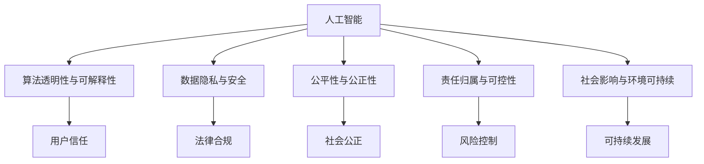

                 

## 1. 背景介绍

### 1.1 问题由来
随着人工智能技术的迅猛发展，越来越多的商业应用开始利用AI进行决策、营销、风险管理等。然而，AI驱动的创新虽然在提升业务效率和客户体验方面取得了显著成效，但同时也引发了诸多道德和伦理问题。这些问题不仅涉及算法偏见、隐私保护、责任归属等方面，还关系到社会公平、环境可持续等宏观层面。因此，如何在商业应用中合理使用AI技术，确保其发展与社会伦理相协调，成为了一个亟待解决的重要课题。

### 1.2 问题核心关键点
为了有效解决这些问题，需要在AI驱动的商业应用中引入更多的道德考虑因素。这些因素包括但不限于：
- 算法透明度与解释性：如何使AI决策过程更加透明，增强可解释性，便于用户理解和信任。
- 数据隐私与安全：如何保护用户隐私，防止数据滥用，确保数据处理过程的安全可靠。
- 公平性与公正性：如何保证AI系统的决策公平，避免对特定群体的歧视性偏见。
- 责任归属与可控性：如何明确AI系统的决策责任，确保其行为的可控性和可追溯性。
- 社会影响与环境可持续：如何评估AI系统的社会影响，确保其对环境的友好与可持续发展。

这些关键点涉及了AI技术的伦理、法律、社会等多个层面，需要在商业应用中予以充分考量。

## 2. 核心概念与联系

### 2.1 核心概念概述

在深入探讨这些问题之前，首先需要明确几个核心概念及其相互关系：

- **人工智能(AI)**：利用计算机算法和数据处理技术模拟人脑智能，实现决策、感知、学习等功能。AI在商业中的应用包括但不限于数据分析、智能客服、自动驾驶、风险评估等。

- **算法透明性与可解释性**：指AI决策过程的开放性和可理解性，使决策逻辑和推理过程可以被他人理解、质疑和验证。

- **数据隐私与安全**：指对个人数据进行保护，防止未经授权的访问、使用和泄露，确保数据处理的安全性和合法性。

- **公平性与公正性**：指AI系统在决策过程中不偏向特定群体或个体，保证所有用户的平等权利。

- **责任归属与可控性**：指在AI系统出现错误或违规行为时，能够明确责任方，并进行有效的控制和纠正。

- **社会影响与环境可持续**：指评估AI系统对社会、经济、文化、环境等宏观层面的影响，确保其发展与整体利益相协调。

这些概念之间的逻辑关系可以通过以下Mermaid流程图来展示：



### 2.2 核心概念原理和架构的 Mermaid 流程图

由于概念之间关系的复杂性，无法通过简单的流程图完全展示。但可以简要说明这些概念之间的基本逻辑：

- **人工智能(AI)**：作为核心技术，AI在商业应用中提供决策、感知、学习等功能，是其他概念的基础。

- **算法透明性与可解释性**：通过增强算法透明度，使AI决策过程更加公开透明，从而增强用户信任。

- **数据隐私与安全**：确保数据处理的安全性，保护用户隐私，防止数据滥用。

- **公平性与公正性**：保证AI系统在决策过程中不偏向特定群体，确保决策的公正性。

- **责任归属与可控性**：在AI系统出现错误时，明确责任方，进行有效控制，确保系统的可控性。

- **社会影响与环境可持续**：评估AI系统的宏观影响，确保其对社会、环境等的影响与整体利益相协调。

这些概念之间相互作用，共同构成了一个AI驱动的商业应用生态系统。

## 3. 核心算法原理 & 具体操作步骤

### 3.1 算法原理概述

在AI驱动的商业应用中，核心算法原理包括但不限于以下方面：

- **监督学习与无监督学习**：利用标注数据训练模型，进行分类、回归等任务；或利用无标注数据进行聚类、降维等任务。

- **强化学习**：通过奖励机制训练AI系统，使其在特定环境中做出最优决策。

- **深度学习**：利用多层神经网络进行复杂的模式识别和决策，提升AI系统的精度和泛化能力。

- **迁移学习**：利用已有知识进行新任务的学习，提高学习效率和效果。

### 3.2 算法步骤详解

AI驱动的商业应用中的算法步骤通常包括以下几个关键环节：

**Step 1: 数据准备与预处理**
- 收集与业务相关的数据，并进行清洗、去噪、标准化等预处理。

**Step 2: 模型选择与训练**
- 根据业务需求选择合适的算法模型，如决策树、神经网络、支持向量机等。
- 利用标注数据进行模型训练，优化模型参数。

**Step 3: 模型评估与优化**
- 在验证集上评估模型性能，调整模型参数以提高准确率、召回率等指标。

**Step 4: 模型部署与应用**
- 将训练好的模型部署到生产环境中，进行实际业务应用。
- 根据应用效果进行持续优化和迭代。

### 3.3 算法优缺点

AI驱动的商业应用中的算法具有以下优点：
- **效率高**：通过自动化决策和智能分析，大大提升业务处理效率。
- **精度高**：利用复杂算法和大数据，实现高精度的决策和预测。
- **灵活性高**：可根据业务需求进行调整和优化，适应多种场景。

同时，也存在以下缺点：
- **复杂性高**：模型复杂度高，需要专业的技术支持。
- **数据依赖**：模型依赖于数据质量，数据偏差会影响模型性能。
- **可解释性差**：复杂算法往往难以解释其决策过程。
- **安全风险高**：数据泄露、模型误判等安全风险较高。

### 3.4 算法应用领域

AI驱动的商业应用广泛应用于以下几个领域：

- **金融**：利用AI进行信用评估、风险管理、投资策略等。
- **医疗**：利用AI进行疾病诊断、治疗方案推荐、药物研发等。
- **零售**：利用AI进行客户画像、商品推荐、供应链优化等。
- **制造**：利用AI进行质量检测、生产调度、设备维护等。
- **客服**：利用AI进行智能客服、自动化客户支持等。

## 4. 数学模型和公式 & 详细讲解 & 举例说明

### 4.1 数学模型构建

在AI驱动的商业应用中，数学模型构建通常包括以下几个关键步骤：

**Step 1: 数据表示与特征工程**
- 将原始数据转化为模型可以处理的向量形式，如one-hot编码、词嵌入等。
- 进行特征工程，提取有意义的特征，提升模型性能。

**Step 2: 模型选择与训练**
- 选择合适的算法模型，如线性回归、决策树、神经网络等。
- 利用标注数据进行模型训练，优化模型参数。

**Step 3: 模型评估与优化**
- 在验证集上评估模型性能，调整模型参数以提高准确率、召回率等指标。

**Step 4: 模型部署与应用**
- 将训练好的模型部署到生产环境中，进行实际业务应用。
- 根据应用效果进行持续优化和迭代。

### 4.2 公式推导过程

以线性回归模型为例，其公式推导过程如下：

设有一个简单的线性回归模型 $y = \beta_0 + \beta_1 x_1 + \beta_2 x_2$，其中 $x_1, x_2$ 为自变量，$y$ 为目标变量，$\beta_0, \beta_1, \beta_2$ 为模型参数。

假设我们有一组训练数据 $\{(x_{i1}, x_{i2}, y_i)\}_{i=1}^n$，其中 $x_{i1}, x_{i2}$ 为第 $i$ 个样本的自变量，$y_i$ 为目标变量的真实值。

线性回归模型的目标是最小化预测值与真实值之间的误差，即：

$$
\min_{\beta_0, \beta_1, \beta_2} \sum_{i=1}^n (y_i - \beta_0 - \beta_1 x_{i1} - \beta_2 x_{i2})^2
$$

通过最小二乘法，可以得到模型参数的求解公式：

$$
\beta_0, \beta_1, \beta_2 = \arg\min_{\beta_0, \beta_1, \beta_2} \sum_{i=1}^n (y_i - \beta_0 - \beta_1 x_{i1} - \beta_2 x_{i2})^2
$$

化简后得到：

$$
\beta_0 = \frac{\sum_{i=1}^n y_i - \beta_1 \sum_{i=1}^n x_{i1} - \beta_2 \sum_{i=1}^n x_{i2}}{n}
$$

$$
\beta_1 = \frac{\sum_{i=1}^n x_{i1}(y_i - \beta_0 - \beta_2 x_{i2})}{\sum_{i=1}^n x_{i1}^2}
$$

$$
\beta_2 = \frac{\sum_{i=1}^n x_{i2}(y_i - \beta_0 - \beta_1 x_{i1})}{\sum_{i=1}^n x_{i2}^2}
$$

通过上述推导，可以得出线性回归模型的求解公式，从而在商业应用中进行决策和预测。

### 4.3 案例分析与讲解

以金融领域的信用评估为例，进行详细讲解：

假设我们要构建一个基于机器学习的信用评估模型，用于预测客户的违约概率。我们可以收集客户的收入、负债、年龄、婚姻状况等特征，作为模型的输入。

首先，对数据进行清洗和预处理，将文本特征转化为数字特征，并进行归一化处理。然后，选择合适的算法模型，如逻辑回归、决策树、神经网络等。

利用标注数据进行模型训练，通过交叉验证等技术优化模型参数。在验证集上评估模型性能，调整模型参数以提高准确率、召回率等指标。最后，将训练好的模型部署到生产环境中，进行实际业务应用。

在应用过程中，需要不断监测模型的性能，根据业务需求进行调整和优化。例如，如果发现模型在新客户上的表现不佳，可以重新训练模型，或在模型中加入更多的新客户数据。

## 5. 项目实践：代码实例和详细解释说明

### 5.1 开发环境搭建

在进行AI驱动的商业应用开发前，需要先准备好开发环境。以下是使用Python进行Scikit-learn开发的环境配置流程：

1. 安装Anaconda：从官网下载并安装Anaconda，用于创建独立的Python环境。

2. 创建并激活虚拟环境：
```bash
conda create -n ml-env python=3.8 
conda activate ml-env
```

3. 安装Scikit-learn、NumPy、Pandas等库：
```bash
pip install scikit-learn numpy pandas
```

4. 安装各类工具包：
```bash
pip install matplotlib seaborn
```

5. 安装Jupyter Notebook：
```bash
pip install jupyter notebook
```

完成上述步骤后，即可在`ml-env`环境中开始AI驱动的商业应用开发。

### 5.2 源代码详细实现

下面我们以信用评估为例，给出使用Scikit-learn进行机器学习的PyTorch代码实现。

首先，定义数据处理函数：

```python
from sklearn.model_selection import train_test_split
from sklearn.preprocessing import StandardScaler
from sklearn.linear_model import LogisticRegression

def preprocess_data(X, y):
    X_train, X_test, y_train, y_test = train_test_split(X, y, test_size=0.2, random_state=42)
    scaler = StandardScaler()
    X_train = scaler.fit_transform(X_train)
    X_test = scaler.transform(X_test)
    return X_train, X_test, y_train, y_test
```

然后，定义模型训练和评估函数：

```python
from sklearn.metrics import accuracy_score

def train_model(X_train, y_train, X_test, y_test):
    model = LogisticRegression()
    model.fit(X_train, y_train)
    y_pred = model.predict(X_test)
    accuracy = accuracy_score(y_test, y_pred)
    return accuracy

# 训练模型并评估
X_train, X_test, y_train, y_test = preprocess_data(X, y)
accuracy = train_model(X_train, y_train, X_test, y_test)
print(f"Accuracy: {accuracy:.2f}")
```

最后，启动训练流程：

```python
X_train, X_test, y_train, y_test = preprocess_data(X, y)
accuracy = train_model(X_train, y_train, X_test, y_test)
print(f"Accuracy: {accuracy:.2f}")
```

以上就是使用Scikit-learn进行信用评估的完整代码实现。可以看到，Scikit-learn的封装性很高，只需要简单调用几个函数，就可以完成数据处理、模型训练和评估。

### 5.3 代码解读与分析

让我们再详细解读一下关键代码的实现细节：

**preprocess_data函数**：
- 定义了数据预处理函数，将原始数据划分为训练集和测试集。
- 利用StandardScaler对特征进行标准化处理，以提高模型收敛速度。

**train_model函数**：
- 定义了模型训练函数，选择合适的算法模型并训练。
- 利用预测结果和真实标签计算准确率，评估模型性能。

**训练流程**：
- 在训练集中训练模型，并在测试集中评估模型。
- 打印模型的准确率，显示模型效果。

## 6. 实际应用场景

### 6.1 金融风控

在金融领域，AI驱动的信用评估、风险管理等应用具有广泛的市场需求。利用AI进行信用评估，可以大幅提升贷款审批效率，降低坏账率。在风险管理方面，利用AI进行贷款违约预测、市场风险评估等，可以及时发现潜在风险，避免大规模金融损失。

### 6.2 医疗诊断

在医疗领域，AI驱动的疾病诊断、治疗方案推荐等应用，可以显著提升诊疗效率和准确率。利用AI进行疾病诊断，可以快速识别患者的疾病类型，提供科学的诊断建议。在治疗方案推荐方面，利用AI根据患者的病情和医疗记录，推荐最佳的治疗方案，提高治疗效果。

### 6.3 智能客服

在零售和电商领域，智能客服系统已经成为提升客户体验的重要手段。利用AI进行智能客服，可以24小时不间断地解答客户咨询，提高服务效率。同时，AI可以根据客户的历史行为数据，推荐最适合的产品，提升客户满意度和转化率。

### 6.4 未来应用展望

随着AI技术的不断进步，未来AI驱动的商业应用将更加广泛和深入。例如，在制造业领域，利用AI进行设备预测性维护、生产调度优化等，可以大幅提升生产效率和设备利用率。在农业领域，利用AI进行作物病虫害预测、气象灾害预警等，可以提高农业生产效率和农民收入。

## 7. 工具和资源推荐

### 7.1 学习资源推荐

为了帮助开发者系统掌握AI驱动的商业应用开发，这里推荐一些优质的学习资源：

1. 《机器学习实战》书籍：全面介绍了机器学习的基本概念和应用，适合初学者入门。

2. 《深度学习》课程：由斯坦福大学开设的深度学习课程，详细讲解深度学习的原理和实践。

3. 《TensorFlow实战》书籍：TensorFlow官方推荐的实战指南，涵盖深度学习的各种应用场景。

4. 《Python数据科学手册》书籍：介绍了Python在数据科学和机器学习中的应用，适合进阶学习。

5. Kaggle平台：数据科学竞赛平台，提供海量数据集和丰富的学习资源。

通过这些学习资源，相信你一定能够快速掌握AI驱动的商业应用开发技巧，并将其实践于实际业务中。

### 7.2 开发工具推荐

高效的开发离不开优秀的工具支持。以下是几款用于AI驱动的商业应用开发的常用工具：

1. Python：作为数据科学和机器学习的主流编程语言，Python具有丰富的库和工具支持。

2. Scikit-learn：Python的机器学习库，提供了大量的算法模型和数据预处理工具。

3. TensorFlow：由Google主导开发的深度学习框架，生产部署方便，适合大规模工程应用。

4. PyTorch：基于Python的深度学习框架，灵活易用，适合快速迭代研究。

5. Jupyter Notebook：Python的交互式编程环境，适合数据探索和模型实验。

合理利用这些工具，可以显著提升AI驱动的商业应用开发的效率，加快创新迭代的步伐。

### 7.3 相关论文推荐

AI驱动的商业应用的发展离不开学界的持续研究。以下是几篇奠基性的相关论文，推荐阅读：

1. "A New Framework for Machine Learning"（机器学习的框架）：提出机器学习的框架，并讨论了其在商业应用中的应用。

2. "Deep Learning in NLP: A Survey"（自然语言处理中的深度学习）：全面介绍了深度学习在自然语言处理中的应用，包括文本分类、情感分析等。

3. "AI in Finance"（AI在金融中的应用）：讨论了AI在金融领域的应用，如信用评估、风险管理等。

4. "AI in Healthcare"（AI在医疗中的应用）：讨论了AI在医疗领域的应用，如疾病诊断、治疗方案推荐等。

5. "AI in Retail"（AI在零售中的应用）：讨论了AI在零售领域的应用，如智能客服、产品推荐等。

这些论文代表了大数据与人工智能结合的最新研究，通过学习这些前沿成果，可以帮助研究者把握学科前进方向，激发更多的创新灵感。

## 8. 总结：未来发展趋势与挑战

### 8.1 研究成果总结

本文对AI驱动的商业应用进行了全面系统的介绍。首先阐述了AI在商业应用中的重要性和伦理挑战，明确了算法透明性与可解释性、数据隐私与安全、公平性与公正性、责任归属与可控性、社会影响与环境可持续等核心概念。其次，从原理到实践，详细讲解了AI驱动的商业应用的数学模型和算法步骤，给出了AI驱动的商业应用的完整代码实现。同时，本文还广泛探讨了AI驱动的商业应用在金融、医疗、智能客服等各个行业领域的应用前景，展示了AI驱动的商业应用的巨大潜力。此外，本文精选了AI驱动的商业应用的学习资源、开发工具和相关论文，力求为开发者提供全方位的技术指引。

通过本文的系统梳理，可以看到，AI驱动的商业应用在提升业务效率、优化客户体验、降低风险成本等方面具有巨大价值，同时也面临着数据隐私、算法透明性、社会影响等诸多挑战。未来，需要在AI技术发展的同时，不断完善伦理框架，确保AI系统的公平、公正、可控，真正实现人工智能技术与社会伦理的协调发展。

### 8.2 未来发展趋势

展望未来，AI驱动的商业应用将呈现以下几个发展趋势：

1. **数据利用多样化**：AI系统将越来越多地利用多源数据、异构数据，进行综合分析和决策。

2. **算法模型智能化**：AI算法将更加复杂、智能化，具备更强的自适应和自学习能力。

3. **算法透明性与可解释性**：未来AI系统的决策过程将更加透明、可解释，便于用户理解和信任。

4. **社会影响评估**：AI系统的社会影响评估将成为重要研究课题，确保AI系统的决策符合社会公平、伦理道德等要求。

5. **环境友好与可持续发展**：AI系统将更加注重环境友好，采用绿色算法和资源优化技术，实现可持续发展。

以上趋势凸显了AI驱动的商业应用的广阔前景，这些方向的探索发展，必将进一步提升AI系统的性能和应用范围，为人类社会带来深远影响。

### 8.3 面临的挑战

尽管AI驱动的商业应用已经取得了显著成就，但在迈向更加智能化、普适化应用的过程中，仍面临诸多挑战：

1. **数据隐私与安全**：AI系统在处理大量数据时，可能面临数据泄露、隐私侵犯等问题，需要采取严格的数据保护措施。

2. **算法透明性与可解释性**：复杂算法往往难以解释其决策过程，需要在模型设计和优化过程中注重算法透明性与可解释性。

3. **社会影响与伦理道德**：AI系统可能存在歧视性偏见、不公正决策等问题，需要加强伦理道德约束和监管。

4. **技术瓶颈与资源限制**：AI系统在处理大规模数据、复杂算法时，可能面临计算资源和存储空间的限制，需要优化算法和资源配置。

5. **技术迭代与知识更新**：AI技术日新月异，需要持续学习、迭代和优化，以保持技术领先性。

这些挑战需要我们不断探索和解决，才能推动AI驱动的商业应用健康、可持续发展。

### 8.4 研究展望

面对AI驱动的商业应用所面临的诸多挑战，未来的研究需要在以下几个方面寻求新的突破：

1. **伦理与道德框架**：建立健全的伦理与道德框架，确保AI系统的决策符合社会公平、伦理道德等要求。

2. **数据隐私与安全**：开发更先进的数据保护技术，确保AI系统在处理数据时的隐私和安全。

3. **算法透明性与可解释性**：开发更透明的算法模型，增强AI系统的可解释性，便于用户理解和信任。

4. **社会影响评估**：建立AI系统的社会影响评估机制，确保AI系统的决策符合社会公平、伦理道德等要求。

5. **环境友好与可持续发展**：开发更环保、节能的AI算法和资源优化技术，实现可持续发展。

6. **跨学科融合**：将AI技术与经济学、社会学、伦理学等多学科进行融合，提升AI系统的社会影响评估能力。

这些研究方向的探索，必将推动AI驱动的商业应用迈向更高的台阶，为人类社会带来深远的影响。相信随着技术的不断发展，AI驱动的商业应用将在更多领域得到应用，为经济社会发展注入新的动力。

## 9. 附录：常见问题与解答

**Q1：如何保证AI系统的决策公正性？**

A: 为了保证AI系统的决策公正性，需要在算法设计和数据处理过程中，注重以下几个方面：
- **数据多样化**：确保训练数据覆盖各种群体，避免数据偏差。
- **公平性算法**：选择公平性算法，如Adversarial De-biasing、FairML等。
- **模型监控**：定期监控模型性能，及时发现和纠正偏见问题。

**Q2：如何确保AI系统的决策透明性与可解释性？**

A: 为了确保AI系统的决策透明性与可解释性，可以采取以下措施：
- **可解释性模型**：选择可解释性强的模型，如决策树、线性回归等。
- **模型可视化**：利用模型可视化工具，如SHAP、LIME等，分析模型决策过程。
- **透明度评估**：建立透明度评估机制，定期评估和优化模型。

**Q3：如何处理AI系统的数据隐私与安全问题？**

A: 为了处理AI系统的数据隐私与安全问题，可以采取以下措施：
- **数据加密**：采用数据加密技术，确保数据传输和存储的安全性。
- **访问控制**：实现严格的访问控制，限制数据访问权限。
- **隐私保护算法**：采用隐私保护算法，如差分隐私、联邦学习等。

**Q4：如何确保AI系统的决策可控性？**

A: 为了确保AI系统的决策可控性，可以采取以下措施：
- **责任归属机制**：明确AI系统的决策责任，建立责任归属机制。
- **模型监控与反馈**：实时监控模型决策，及时发现和纠正错误决策。
- **人工干预机制**：在关键决策时，引入人工干预机制，确保决策可控性。

这些措施有助于确保AI系统的决策公正性、透明性、可解释性、可控性和隐私性，从而增强用户对AI系统的信任和接受度。

---

作者：禅与计算机程序设计艺术 / Zen and the Art of Computer Programming

