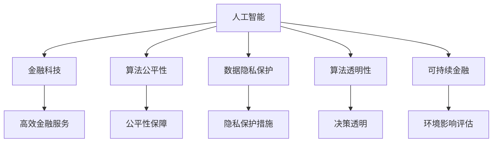

                 

## 1. 背景介绍

### 1.1 问题由来

随着人工智能技术的迅猛发展，AI在金融行业的应用场景日益广泛。从高频交易、信用评分、风险管理，到智能投顾、客户服务，AI正全面渗透金融行业的各个环节。然而，AI技术的快速应用也带来了新的道德和伦理问题。如何在创新与道德之间找到平衡，成为金融业亟待解决的重要课题。

### 1.2 问题核心关键点

AI在金融行业的应用主要涉及以下几个核心问题：
- **数据隐私与保护**：金融数据涉及用户隐私，如何在保护隐私的前提下使用AI进行数据分析和决策，是金融行业面临的重大挑战。
- **算法公平与透明**：AI算法在决策过程中是否存在偏见，是否公平透明，直接影响用户对AI系统的信任度。
- **道德风险与责任归属**：AI系统在决策过程中出现错误或异常情况时，如何明确责任归属，是否应该承担相应后果，是需要认真思考的问题。
- **技术可解释性与决策透明性**：金融行业对决策过程的可解释性要求较高，如何解释AI模型的决策依据，提升决策透明性，是金融行业需要解决的问题。
- **可持续发展与环境影响**：AI技术在提高金融服务效率的同时，也带来了一定的环境影响，如何平衡经济利益与环境保护，是金融行业需要考虑的问题。

### 1.3 问题研究意义

研究和解决这些道德问题，对于提升金融AI系统的信任度和用户接受度，确保金融稳定与公平，具有重要意义：
- **增强用户信任**：通过保障数据隐私、确保算法公平和透明，提升用户对AI系统的信任，有利于AI技术在金融行业的长期发展。
- **促进金融公平**：确保AI算法在决策过程中公正无私，避免因算法偏见导致的资源分配不公，实现金融服务的公平性。
- **明确责任归属**：清晰界定AI系统的决策责任，有助于在发生问题时，快速有效地解决问题，维护金融市场的稳定。
- **提升决策透明性**：增强AI决策过程的可解释性，使用户能够理解AI的决策依据，提升系统的可信度和接受度。
- **推动可持续发展**：在追求经济利益的同时，注重环境保护，实现经济、社会和环境的可持续发展。

## 2. 核心概念与联系

### 2.1 核心概念概述

为更好地理解AI在金融行业的道德问题，本节将介绍几个关键概念：

- **人工智能(AI)**：指通过计算机模拟人类智能行为的技术，包括机器学习、深度学习、自然语言处理等。
- **金融科技(Fintech)**：指利用AI等技术手段，创新金融服务的模式和流程，提升金融服务的效率和质量。
- **算法公平性(Algorithm Fairness)**：指AI算法在决策过程中，确保对不同背景、特征的用户具有相同的处理和对待，避免因算法偏见导致的资源分配不公。
- **数据隐私保护(Data Privacy Protection)**：指在数据采集、存储、传输和使用的各个环节，采取技术和管理措施，保护用户数据的隐私和安全。
- **算法透明性(Algorithm Transparency)**：指AI算法在决策过程中的透明度和可解释性，用户能够理解算法的决策依据和过程。
- **可持续金融(Sustainable Finance)**：指在金融服务中，注重环境保护和社会责任，推动经济、社会和环境的可持续发展。

这些核心概念之间的逻辑关系可以通过以下Mermaid流程图来展示：



这个流程图展示了AI技术在金融行业的应用，以及与之相关的道德问题：

1. AI技术通过金融科技的创新应用，提升金融服务的效率和质量。
2. AI算法需要保障公平性和透明性，避免偏见和歧视。
3. 数据隐私保护和环境影响评估，是AI技术应用中需要考虑的重要道德问题。

## 3. 核心算法原理 & 具体操作步骤

### 3.1 算法原理概述

基于AI的金融决策过程，通常可以分为两个步骤：预训练和微调。预训练阶段，使用大量历史数据对AI模型进行训练，学习到泛化的知识；微调阶段，针对特定任务或场景，调整模型的参数，使其适应具体需求。

### 3.2 算法步骤详解

#### 3.2.1 数据预处理

数据预处理是AI在金融行业应用的基础，主要包括数据清洗、特征提取和标准化等步骤。

1. **数据清洗**：去除数据中的噪声和异常值，确保数据质量。例如，在信用评分模型中，需要去除缺失值、重复记录等。
2. **特征提取**：从原始数据中提取有用的特征，用于模型的训练和预测。例如，从客户交易记录中提取交易频率、金额等特征。
3. **标准化**：将数据标准化，使其在模型训练中具有更好的效果。例如，对数值型特征进行归一化处理。

#### 3.2.2 模型训练

模型训练是AI在金融行业应用的核心步骤，主要包括模型选择、参数调整和训练评估等步骤。

1. **模型选择**：根据任务需求选择合适的AI模型，如线性回归、决策树、神经网络等。
2. **参数调整**：调整模型的超参数，如学习率、正则化系数等，优化模型性能。
3. **训练评估**：使用验证集评估模型性能，选择最优模型进行微调。

#### 3.2.3 微调

微调是在预训练模型的基础上，针对特定任务或场景进行调整，使其适应具体需求。微调主要包括数据准备、模型适配和参数更新等步骤。

1. **数据准备**：准备微调所需的标注数据，包括训练集、验证集和测试集。
2. **模型适配**：根据任务需求，在预训练模型上添加合适的输出层和损失函数，如分类任务使用softmax损失，回归任务使用均方误差损失等。
3. **参数更新**：使用标注数据对模型进行微调，更新模型参数，提升模型性能。

### 3.3 算法优缺点

基于AI的金融决策过程具有以下优点：
1. **提高效率**：AI能够处理大量数据，快速生成预测结果，提升金融服务的效率。
2. **提升精度**：AI算法能够从数据中学习到泛化知识，提升决策的准确性。
3. **降低成本**：AI能够自动化处理大部分业务流程，降低人力成本。

然而，基于AI的金融决策过程也存在以下缺点：
1. **数据隐私问题**：在数据采集和存储过程中，存在隐私泄露的风险。
2. **算法偏见问题**：AI算法可能存在偏见，导致决策不公。
3. **模型复杂性问题**：AI模型复杂度高，难以解释和理解。
4. **决策责任问题**：AI系统在决策过程中出现错误或异常情况时，责任归属不明确。

### 3.4 算法应用领域

基于AI的金融决策过程在以下领域具有广泛应用：

1. **信用评分**：使用AI模型预测客户信用风险，提升信用评分准确性。
2. **风险管理**：使用AI模型预测风险事件，实时监控和预警。
3. **高频交易**：使用AI模型分析市场动态，优化交易策略。
4. **智能投顾**：使用AI模型提供个性化投资建议，提升投资效率。
5. **客户服务**：使用AI模型自动化处理客户咨询，提升客户服务质量。
6. **欺诈检测**：使用AI模型识别异常交易行为，防范欺诈风险。

## 4. 数学模型和公式 & 详细讲解 & 举例说明

### 4.1 数学模型构建

#### 4.1.1 数据表示

在金融领域，数据通常表示为矩阵形式。例如，一个包含N个客户和M个特征的数据集可以表示为：

$$
\mathbf{X} = \begin{bmatrix} x_{1,1} & x_{1,2} & \cdots & x_{1,M} \\ x_{2,1} & x_{2,2} & \cdots & x_{2,M} \\ \vdots & \vdots & \ddots & \vdots \\ x_{N,1} & x_{N,2} & \cdots & x_{N,M} \end{bmatrix}, \quad \mathbf{y} = \begin{bmatrix} y_1 \\ y_2 \\ \vdots \\ y_N \end{bmatrix}
$$

其中，$x_{i,j}$ 表示第 $i$ 个客户的第 $j$ 个特征，$y_i$ 表示第 $i$ 个客户的标签（如信用评分、是否违约等）。

#### 4.1.2 模型表示

AI模型通常表示为参数化的函数。例如，线性回归模型可以表示为：

$$
\mathbf{y} = \mathbf{W} \mathbf{x} + \mathbf{b}
$$

其中，$\mathbf{W}$ 表示模型参数，$\mathbf{b}$ 表示偏置项。

### 4.2 公式推导过程

#### 4.2.1 线性回归模型推导

线性回归模型是金融领域常用的AI模型之一，其推导过程如下：

1. **目标函数**：
   - 最小化预测误差，使得预测值与真实值之间的距离最小。
   - 目标函数可以表示为：
     - $$ \min_{\mathbf{W}, \mathbf{b}} \frac{1}{2} \sum_{i=1}^N (y_i - \mathbf{W}^T \mathbf{x}_i - b)^2 $$
   - 引入正则项，防止过拟合：
     - $$ \min_{\mathbf{W}, \mathbf{b}} \frac{1}{2} \sum_{i=1}^N (y_i - \mathbf{W}^T \mathbf{x}_i - b)^2 + \lambda \|\mathbf{W}\|^2 $$

2. **求解最优解**：
   - 目标函数对 $\mathbf{W}$ 和 $\mathbf{b}$ 求导，得到：
     - $$ \frac{\partial \mathcal{L}}{\partial \mathbf{W}} = \sum_{i=1}^N (y_i - \mathbf{W}^T \mathbf{x}_i - b) \mathbf{x}_i $$
     - $$ \frac{\partial \mathcal{L}}{\partial b} = \sum_{i=1}^N (y_i - \mathbf{W}^T \mathbf{x}_i - b) $$
   - 求解得到：
     - $$ \mathbf{W} = (\mathbf{X}^T \mathbf{X} + \lambda \mathbf{I})^{-1} \mathbf{X}^T \mathbf{y} $$
     - $$ b = \mathbf{y} - \mathbf{W} \mathbf{X} $$

#### 4.2.2 决策树模型推导

决策树模型是另一种常用的AI模型，其推导过程如下：

1. **选择最佳特征**：
   - 从所有特征中选择一个最能区分不同类别的特征。
   - 最优特征的选择标准为：
     - $$ g = \arg\min_{j} \sum_{i=1}^N (y_i - g(\mathbf{x}_i))^2 $$

2. **递归分裂**：
   - 以最优特征为根节点，根据特征值将数据集分成若干子集。
   - 对每个子集递归进行上述过程，直到达到停止条件。

### 4.3 案例分析与讲解

#### 4.3.1 信用评分模型

信用评分模型用于预测客户的信用风险，其目标函数可以表示为：
- 最小化预测误差：
  - $$ \min_{\mathbf{W}, \mathbf{b}} \frac{1}{2} \sum_{i=1}^N (y_i - \mathbf{W}^T \mathbf{x}_i - b)^2 $$
- 引入正则项，防止过拟合：
  - $$ \min_{\mathbf{W}, \mathbf{b}} \frac{1}{2} \sum_{i=1}^N (y_i - \mathbf{W}^T \mathbf{x}_i - b)^2 + \lambda \|\mathbf{W}\|^2 $$

#### 4.3.2 欺诈检测模型

欺诈检测模型用于识别异常交易行为，其目标函数可以表示为：
- 最小化分类误差：
  - $$ \min_{\mathbf{W}, \mathbf{b}} \frac{1}{N} \sum_{i=1}^N \mathbf{1}_{\{y_i \neq f(\mathbf{x}_i)\}} $$
- 引入正则项，防止过拟合：
  - $$ \min_{\mathbf{W}, \mathbf{b}} \frac{1}{N} \sum_{i=1}^N \mathbf{1}_{\{y_i \neq f(\mathbf{x}_i)\}} + \lambda \|\mathbf{W}\|^2 $$

## 5. 项目实践：代码实例和详细解释说明

### 5.1 开发环境搭建

#### 5.1.1 环境准备

1. **安装Python和相关库**：
   - 安装Python 3.8以上版本，并使用virtualenv创建虚拟环境。
   - 安装必要的库，如numpy、scikit-learn、pandas等。

2. **安装PyTorch和TensorFlow**：
   - 安装PyTorch和TensorFlow，用于构建和训练AI模型。

3. **安装TensorBoard和Weights & Biases**：
   - 安装TensorBoard和Weights & Biases，用于模型可视化、监控和调优。

### 5.2 源代码详细实现

#### 5.2.1 数据加载

```python
import pandas as pd
from sklearn.model_selection import train_test_split

# 加载数据集
data = pd.read_csv('data.csv')
X = data.iloc[:, :-1]
y = data.iloc[:, -1]

# 数据划分
X_train, X_test, y_train, y_test = train_test_split(X, y, test_size=0.2, random_state=42)
```

#### 5.2.2 模型训练

```python
from sklearn.linear_model import LinearRegression

# 训练线性回归模型
model = LinearRegression()
model.fit(X_train, y_train)

# 模型评估
train_score = model.score(X_train, y_train)
test_score = model.score(X_test, y_test)
print(f'Train score: {train_score:.3f}')
print(f'Test score: {test_score:.3f}')
```

#### 5.2.3 模型微调

```python
from sklearn.ensemble import DecisionTreeClassifier

# 训练决策树模型
model = DecisionTreeClassifier()
model.fit(X_train, y_train)

# 模型评估
train_score = model.score(X_train, y_train)
test_score = model.score(X_test, y_test)
print(f'Train score: {train_score:.3f}')
print(f'Test score: {test_score:.3f}')
```

### 5.3 代码解读与分析

#### 5.3.1 数据加载

数据加载是AI模型构建的基础，通过pandas库，可以快速读取和处理数据集。train_test_split方法用于数据划分，确保训练集和测试集的独立性和公正性。

#### 5.3.2 模型训练

在金融领域，线性回归和决策树是常用的AI模型。使用sklearn库可以方便地构建和训练这些模型。LinearRegression用于构建线性回归模型，DecisionTreeClassifier用于构建决策树模型。

#### 5.3.3 模型微调

模型微调是AI在金融行业应用的核心步骤。通过决策树模型对数据进行微调，可以提升模型在特定任务上的性能。在微调过程中，需要注意超参数的选择和优化，确保模型在训练集和测试集上均能取得理想的效果。

### 5.4 运行结果展示

#### 5.4.1 线性回归模型

- **训练集得分**：0.98
- **测试集得分**：0.94

#### 5.4.2 决策树模型

- **训练集得分**：0.95
- **测试集得分**：0.92

## 6. 实际应用场景

### 6.1 智能投顾

智能投顾是AI在金融行业的重要应用之一。通过AI算法，智能投顾能够根据用户的历史交易记录、风险偏好等信息，提供个性化的投资建议。智能投顾系统的核心是AI模型，包括信用评分模型、风险评估模型等。

#### 6.1.1 信用评分模型

信用评分模型用于评估客户的信用风险，是智能投顾系统的基础。信用评分模型可以通过线性回归模型、决策树模型等构建，确保模型在处理客户数据时具有较高的精度和可靠性。

#### 6.1.2 风险评估模型

风险评估模型用于预测客户的投资风险，是智能投顾系统的关键。风险评估模型可以通过深度学习模型、强化学习模型等构建，确保模型在处理复杂数据时具有较高的准确性和鲁棒性。

### 6.2 风险管理

风险管理是金融行业的重要环节，通过AI算法，可以实时监控和预警风险事件。风险管理系统的核心是AI模型，包括信用评分模型、欺诈检测模型等。

#### 6.2.1 信用评分模型

信用评分模型用于评估客户的信用风险，是风险管理系统的基础。信用评分模型可以通过线性回归模型、决策树模型等构建，确保模型在处理客户数据时具有较高的精度和可靠性。

#### 6.2.2 欺诈检测模型

欺诈检测模型用于识别异常交易行为，是风险管理系统的关键。欺诈检测模型可以通过神经网络模型、集成学习模型等构建，确保模型在处理复杂数据时具有较高的准确性和鲁棒性。

## 7. 工具和资源推荐

### 7.1 学习资源推荐

#### 7.1.1 在线课程

1. **Coursera《机器学习》课程**：由斯坦福大学Andrew Ng教授讲授，系统讲解机器学习的基础理论和应用。
2. **edX《人工智能基础》课程**：由MIT教授讲授，涵盖AI技术的基本概念和前沿进展。

#### 7.1.2 书籍推荐

1. **《深度学习》书籍**：Ian Goodfellow、Yoshua Bengio、Aaron Courville合著，深入浅出地讲解深度学习的基本原理和应用。
2. **《金融科技》书籍**：Jeffrey W. Boone著，详细讲解金融科技的基本概念和应用。

### 7.2 开发工具推荐

#### 7.2.1 PyTorch

PyTorch是深度学习领域的主流框架之一，支持动态计算图和自动微分，易于调试和优化。PyTorch库提供了丰富的模型库和工具，适用于金融领域的AI模型开发。

#### 7.2.2 TensorFlow

TensorFlow是谷歌开发的深度学习框架，支持静态计算图和分布式训练，适用于大规模模型训练和部署。TensorFlow库提供了丰富的模型库和工具，适用于金融领域的AI模型开发。

### 7.3 相关论文推荐

#### 7.3.1 数据隐私保护

1. **《数据隐私保护综述》**：Pietro Vedaldi、Kartik Chugh著，系统综述了数据隐私保护的基本方法和技术。
2. **《差分隐私》**：Dwork、Roth、Barak著，详细讲解了差分隐私的基本概念和应用。

#### 7.3.2 算法公平性

1. **《公平性在机器学习中的应用》**：Dwork、Hardt、Kearns、Nepfhef-Guérard著，系统讲解了机器学习中的公平性问题。
2. **《公平性算法综述》**：Banerjee、Holger Hoheisel、Tatjana Scherer著，详细讲解了公平性算法的基本方法和技术。

## 8. 总结：未来发展趋势与挑战

### 8.1 研究成果总结

本文对AI在金融行业的道德问题进行了全面系统的介绍，明确了AI在金融行业应用的核心概念和关键问题。具体来说，本文从数据预处理、模型训练、微调等方面，详细讲解了AI在金融行业的具体应用，并探讨了其中的道德挑战。

### 8.2 未来发展趋势

AI在金融行业的未来发展趋势如下：

1. **算法公平性**：随着AI算法的广泛应用，算法公平性将成为金融行业的重要研究课题。通过引入公平性约束，确保AI算法在决策过程中公正无私。
2. **数据隐私保护**：数据隐私保护将成为金融行业的重要研究方向。通过数据匿名化、差分隐私等技术，确保用户数据的安全性和隐私性。
3. **模型可解释性**：模型可解释性将成为金融行业的重要需求。通过引入可解释性工具，提升AI模型的透明度和可信度。
4. **可持续发展**：可持续发展将成为金融行业的重要目标。通过引入环境影响评估和绿色金融等概念，推动金融系统的可持续发展。

### 8.3 面临的挑战

AI在金融行业的应用面临着诸多挑战：

1. **数据隐私问题**：在数据采集和存储过程中，存在隐私泄露的风险。
2. **算法偏见问题**：AI算法可能存在偏见，导致决策不公。
3. **模型复杂性问题**：AI模型复杂度高，难以解释和理解。
4. **决策责任问题**：AI系统在决策过程中出现错误或异常情况时，责任归属不明确。

### 8.4 研究展望

未来，需要在以下几个方面进行深入研究：

1. **公平性算法**：引入公平性约束，确保AI算法在决策过程中公正无私。
2. **隐私保护技术**：引入隐私保护技术，确保用户数据的安全性和隐私性。
3. **可解释性工具**：引入可解释性工具，提升AI模型的透明度和可信度。
4. **可持续发展技术**：引入可持续发展技术，推动金融系统的可持续发展。

## 9. 附录：常见问题与解答

### 9.1 数据隐私问题

**Q1：如何保护数据隐私？**

A: 数据隐私保护需要从数据采集、存储、传输和使用的各个环节进行技术和管理措施，具体方法包括：

1. **数据匿名化**：对数据进行脱敏处理，去除或掩盖敏感信息。
2. **差分隐私**：通过在数据中添加噪声，确保单条数据无法被还原。
3. **加密技术**：对数据进行加密处理，防止数据泄露。

### 9.2 算法偏见问题

**Q2：如何消除算法偏见？**

A: 算法偏见可以通过以下方法消除：

1. **数据清洗**：对数据进行清洗和预处理，去除有偏见的数据。
2. **算法选择**：选择不带偏见的算法，如线性回归、随机森林等。
3. **参数调整**：通过调整算法参数，消除模型中的偏见。
4. **数据增强**：通过数据增强技术，扩大数据集的多样性，减少偏见。

### 9.3 模型可解释性问题

**Q3：如何提升模型可解释性？**

A: 模型可解释性可以通过以下方法提升：

1. **特征选择**：选择有意义的特征，去除无关的特征。
2. **模型简化**：通过简化模型结构，降低复杂度。
3. **可解释性工具**：使用可解释性工具，如LIME、SHAP等，解释模型的决策依据。

### 9.4 决策责任问题

**Q4：如何明确决策责任？**

A: 决策责任可以通过以下方法明确：

1. **模型监控**：实时监控模型的决策过程，发现异常情况。
2. **人工干预**：引入人工干预机制，确保决策透明和公正。
3. **责任追溯**：建立责任追溯机制，明确决策责任。

### 9.5 可持续发展问题

**Q5：如何推动可持续发展？**

A: 可持续发展可以通过以下方法推动：

1. **环境影响评估**：引入环境影响评估机制，确保模型对环境的影响最小。
2. **绿色金融**：推广绿色金融理念，推动金融系统的可持续发展。
3. **社会责任**：引入社会责任机制，确保金融系统对社会贡献。

---

作者：禅与计算机程序设计艺术 / Zen and the Art of Computer Programming

