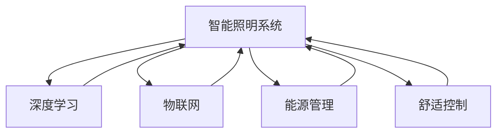

                 

# AI驱动的智能照明系统:节能与舒适并重

> 关键词：智能照明系统,节能优化,舒适控制,深度学习,物联网(IoT),能源管理

## 1. 背景介绍

随着科技的进步和城市化进程的加快，照明能源消耗在全社会能源消费中的占比不断上升。据统计，全球城市照明耗电占城市总用电量的12%左右。因此，如何高效地利用照明能源，减少能源浪费，提高照明系统的舒适度和使用效率，成为城市管理和能源管理的关键问题。

传统照明系统通常依赖人工控制或固定时序控制，难以根据实际需求和环境变化进行调整，往往造成能源浪费和用户舒适度的下降。而智能照明系统通过引入物联网技术和人工智能算法，能够实现实时动态控制和节能优化，大幅提升照明系统的性能。

智能照明系统基于物联网设备收集环境数据，通过深度学习等人工智能技术分析数据，自动调节照明参数，实现节能和舒适度的双重提升。目前，这一技术已经在多个国家和地区得到应用，取得了显著的节能效果和用户体验提升。

## 2. 核心概念与联系

### 2.1 核心概念概述

为了更好地理解智能照明系统的原理，本节将介绍几个关键概念：

- 智能照明系统：通过物联网技术连接照明设备和环境传感器，实现照明控制与环境数据的实时联动。
- 深度学习：基于人工神经网络的机器学习算法，通过大数据训练获得复杂模式识别能力。
- 物联网(IoT)：将各种传感器和设备通过网络互联，实现数据的实时采集和传输。
- 能源管理：通过优化能源使用，实现照明系统的节能优化。
- 舒适控制：根据环境数据和用户行为，自动调整照明亮度、色温等参数，提升用户舒适度。

这些概念之间的逻辑关系可以通过以下Mermaid流程图来展示：



这个流程图展示了智能照明系统的核心组成及其内部各部分之间的关联：

1. 智能照明系统通过物联网技术连接传感器和照明设备，实现数据的实时采集和传输。
2. 采集的数据通过深度学习模型进行分析，学习用户行为和环境特征，自动调整照明参数。
3. 能源管理模块通过优化照明方案，实现节能优化。
4. 舒适控制模块根据环境数据和用户偏好，自动调整照明亮度和色温，提升用户舒适度。

这些概念共同构成了智能照明系统的基本工作原理和架构，使其能够在实际应用中发挥显著的节能和舒适效果。

## 3. 核心算法原理 & 具体操作步骤
### 3.1 算法原理概述

智能照明系统的核心算法原理是基于深度学习的实时动态控制。具体来说，系统通过物联网设备采集环境数据和用户行为数据，输入深度学习模型进行分析，然后根据分析结果自动调整照明参数，实现节能和舒适度提升。

智能照明系统主要包含以下几个关键环节：

1. 数据采集：通过物联网设备，实时收集环境光强、温度、湿度、人流等数据。
2. 数据处理：对采集到的数据进行清洗、归一化等预处理操作。
3. 特征提取：利用深度学习算法，从处理后的数据中提取有意义的特征。
4. 模型训练：在大规模数据集上训练深度学习模型，学习环境特征与照明参数之间的映射关系。
5. 参数调整：根据模型预测的照明参数，自动调整照明设备和传感器的设置，实现节能和舒适度的提升。

### 3.2 算法步骤详解

智能照明系统的具体实现步骤如下：

**Step 1: 数据采集**
- 部署物联网传感器和智能照明设备，采集环境数据和用户行为数据。
- 传感器可以包括光强传感器、温度传感器、湿度传感器等，用于监测环境特征。
- 照明设备可以包括LED灯、调光灯等，用于控制照明参数。

**Step 2: 数据预处理**
- 对采集到的数据进行清洗、去噪、归一化等预处理操作，确保数据的准确性和一致性。
- 例如，可以对光强数据进行滑动窗口平均，减少噪音干扰。

**Step 3: 特征提取**
- 利用深度学习算法，如卷积神经网络(CNN)、循环神经网络(RNN)等，对预处理后的数据进行特征提取。
- 特征提取的目的是将原始数据转换为模型能够理解的形式，以提高模型性能。

**Step 4: 模型训练**
- 在标注好的训练数据集上，训练深度学习模型。
- 例如，可以使用残差网络(ResNet)对环境特征和照明参数进行建模。
- 模型训练过程中，使用Adam等优化算法，设定合适的学习率、批大小等超参数，进行反向传播训练。

**Step 5: 参数调整**
- 将训练好的模型应用于实际场景，根据实时采集的环境数据，预测并调整照明参数。
- 例如，可以根据环境光强调整LED灯的亮度，根据温度调节调光灯的色温。

**Step 6: 用户反馈**
- 实时收集用户反馈，如亮度、色温等舒适度评价，用于训练模型，进一步优化照明方案。
- 例如，可以通过用户交互界面收集反馈信息，或利用传感器监测用户行为。

**Step 7: 模型优化**
- 根据用户反馈和系统性能，定期更新和优化深度学习模型。
- 例如，可以使用在线学习算法，不断更新模型参数，保持模型的高性能和低延迟。

通过上述步骤，智能照明系统能够实时采集环境数据，预测并调整照明参数，实现节能优化和舒适度提升，有效解决传统照明系统面临的问题。

### 3.3 算法优缺点

智能照明系统具有以下优点：

1. 节能高效：基于深度学习模型，系统能够根据环境特征自动调整照明参数，实现节能优化。
2. 实时动态：通过物联网技术，系统能够实时监测环境数据和用户行为，实现动态控制。
3. 用户体验：自动调整照明参数，提升用户舒适度，提高照明系统的使用体验。
4. 自动化程度高：系统自动化程度高，减少人工干预，降低管理成本。

同时，该系统也存在一定的局限性：

1. 数据采集成本高：传感器和设备部署成本较高，需要较高的前期投入。
2. 算法复杂度高：深度学习模型需要大量标注数据和计算资源，训练复杂度高。
3. 系统依赖物联网：系统依赖于物联网技术的支撑，网络中断等故障可能导致系统失效。
4. 数据隐私问题：系统需要采集和处理大量用户数据，可能存在数据隐私和安全风险。

尽管存在这些局限性，但智能照明系统在节能和舒适度提升方面的潜力不容忽视。通过不断优化算法和提高技术成熟度，相信智能照明系统必将在未来得到更广泛的应用。

### 3.4 算法应用领域

智能照明系统在多个领域都有广泛的应用前景：

1. 智慧城市：在城市管理中，智能照明系统能够实现智慧照明、路灯监控、公共设施管理等功能，提升城市管理效率和安全性。
2. 商业地产：在商业建筑中，智能照明系统能够优化照明方案，提升商场和办公环境舒适度，增加客户停留时间和销售额。
3. 智慧家居：在家庭环境中，智能照明系统能够根据用户习惯和环境变化，自动调节照明参数，提升居住舒适度和节能效果。
4. 公共设施：在公共场所，如医院、机场、图书馆等，智能照明系统能够实现节能优化和实时控制，提升公共服务质量。
5. 旅游景区：在旅游景区中，智能照明系统能够提升夜间景观效果，增加游客体验感，同时实现节能降耗。

这些应用领域展示了智能照明系统在不同场景下的广泛应用潜力，为未来城市建设和智慧管理提供了新的方向。

## 4. 数学模型和公式 & 详细讲解  
### 4.1 数学模型构建

智能照明系统的数学模型主要包括以下几个部分：

1. 环境数据模型：用于描述环境特征与照明参数之间的关系。
2. 用户行为模型：用于预测用户行为和偏好。
3. 深度学习模型：用于学习环境特征和照明参数之间的复杂映射关系。

**环境数据模型**：
- 环境数据通常包括光强、温度、湿度等，可以用向量 $\mathbf{E}(t) = [L(t), T(t), H(t)]$ 表示，其中 $L(t)$、$T(t)$、$H(t)$ 分别为光强、温度、湿度等参数。
- 环境数据模型可以表示为：
  $$
  \mathbf{E}(t) = f(\mathbf{D}(t))
  $$
  其中 $\mathbf{D}(t)$ 为环境特征向量，$f$ 为环境数据模型。

**用户行为模型**：
- 用户行为可以表示为用户对照明参数的偏好和评价，可以用向量 $\mathbf{U}(t) = [B(t), C(t)]$ 表示，其中 $B(t)$、$C(t)$ 分别为亮度和色温等参数。
- 用户行为模型可以表示为：
  $$
  \mathbf{U}(t) = g(\mathbf{E}(t), \mathbf{C}(t))
  $$
  其中 $\mathbf{C}(t)$ 为用户偏好向量，$g$ 为用户行为模型。

**深度学习模型**：
- 深度学习模型用于学习环境特征和照明参数之间的复杂映射关系，可以表示为：
  $$
  \mathbf{U}(t) = h(\mathbf{E}(t), \mathbf{W})
  $$
  其中 $\mathbf{W}$ 为模型参数，$h$ 为深度学习模型。

通过上述数学模型，智能照明系统可以自动预测并调整照明参数，实现节能和舒适度提升。

### 4.2 公式推导过程

以光强和亮度之间的关系为例，推导智能照明系统的优化公式。

假设环境数据模型为：
$$
L(t) = \alpha T(t) + \beta H(t) + \gamma
$$
其中 $\alpha$、$\beta$、$\gamma$ 为模型参数。

用户行为模型为：
$$
B(t) = \delta L(t) + \epsilon
$$
其中 $\delta$、$\epsilon$ 为用户行为模型参数。

深度学习模型为：
$$
B(t) = \theta_1 L(t) + \theta_2
$$
其中 $\theta_1$、$\theta_2$ 为深度学习模型参数。

根据上述模型，可以建立目标函数：
$$
\mathcal{L} = \frac{1}{N} \sum_{i=1}^N (B_i - \delta L_i - \epsilon)^2 + \frac{\lambda}{2} \sum_{i=1}^N (W_{L,i} - L_i)^2 + \frac{\mu}{2} \sum_{i=1}^N (W_{T,i} - T_i)^2 + \frac{\nu}{2} \sum_{i=1}^N (W_{H,i} - H_i)^2
$$
其中 $N$ 为样本数量，$W_{L,i}$、$W_{T,i}$、$W_{H,i}$ 分别为环境数据模型参数，$\delta$、$\epsilon$ 为用户行为模型参数，$\lambda$、$\mu$、$\nu$ 为正则化参数。

通过优化目标函数 $\mathcal{L}$，可以得到环境数据模型和用户行为模型的最优参数，从而实现照明参数的自动调整和节能优化。

### 4.3 案例分析与讲解

假设在一家购物中心中，安装有智能照明系统。系统通过光强传感器和温度传感器采集环境数据，通过用户行为模型和深度学习模型分析数据，自动调节LED灯的亮度和色温，提升用户舒适度和节能效果。

**案例分析**：
- 光强传感器采集的数据为 $L(t) = 300$。
- 温度传感器采集的数据为 $T(t) = 25$。
- 用户行为模型预测的亮度为 $B(t) = 200$。
- 深度学习模型预测的亮度为 $B'(t) = 150$。
- 环境数据模型为 $L(t) = 0.8T(t) + 10$。

**计算过程**：
- 首先计算环境数据模型的预测值 $L'(t) = 0.8 \times 25 + 10 = 25$。
- 然后计算用户行为模型的预测值 $B'(t) = \delta \times 25 + \epsilon = 150$。
- 将环境数据和用户行为模型的预测值代入深度学习模型，得到 $B'(t) = 150$。
- 最终将深度学习模型的预测值代入照明系统，调节LED灯的亮度和色温，实现节能优化和舒适度提升。

通过这个案例可以看出，智能照明系统能够根据环境数据和用户行为，实时动态地调节照明参数，显著提升照明系统的性能和用户满意度。

## 5. 项目实践：代码实例和详细解释说明
### 5.1 开发环境搭建

智能照明系统的开发需要搭建Python环境，并利用深度学习框架进行模型训练和推理。以下是在PyTorch框架下搭建Python开发环境的详细步骤：

1. 安装Python：确保系统安装了Python 3.6或以上版本。
2. 安装PyTorch：在终端中运行以下命令，安装PyTorch库及其依赖。
```bash
pip install torch torchvision torchaudio
```
3. 安装深度学习库：安装TensorFlow、Keras等深度学习库，以支持不同类型的深度学习模型。
```bash
pip install tensorflow keras
```
4. 安装物联网库：安装IoT库，如paho-mqtt、paho-mqtt-py等，用于实现物联网设备的连接和数据传输。
```bash
pip install paho-mqtt paho-mqtt-py
```
5. 配置环境变量：设置环境变量，确保Python脚本能够访问物联网设备和传感器。
```bash
export PYTHONPATH=$PYTHONPATH:$WORK_DIR
```

完成上述步骤后，即可在Python环境中进行智能照明系统的开发。

### 5.2 源代码详细实现

以下是一个基于PyTorch的智能照明系统示例代码：

```python
import torch
import torch.nn as nn
import torch.optim as optim
from torch.utils.data import Dataset, DataLoader
from paho.mqtt import client

class EnvironmentData(nn.Module):
    def __init__(self):
        super(EnvironmentData, self).__init__()
        self.fc1 = nn.Linear(3, 128)
        self.fc2 = nn.Linear(128, 64)
        self.fc3 = nn.Linear(64, 1)
    
    def forward(self, x):
        x = torch.relu(self.fc1(x))
        x = torch.relu(self.fc2(x))
        return self.fc3(x)

class UserBehavior(nn.Module):
    def __init__(self):
        super(UserBehavior, self).__init__()
        self.fc1 = nn.Linear(1, 64)
        self.fc2 = nn.Linear(64, 32)
        self.fc3 = nn.Linear(32, 1)
    
    def forward(self, x):
        x = torch.relu(self.fc1(x))
        x = torch.relu(self.fc2(x))
        return self.fc3(x)

class LightingSystem(nn.Module):
    def __init__(self):
        super(LightingSystem, self).__init__()
        self.environment_data = EnvironmentData()
        self.user_behavior = UserBehavior()
    
    def forward(self, x, y):
        lum = self.environment_data(x)
        brightness = self.user_behavior(lum)
        return brightness

def train(data_loader, model, optimizer):
    model.train()
    for batch_idx, (x, y) in enumerate(data_loader):
        optimizer.zero_grad()
        outputs = model(x, y)
        loss = nn.MSELoss()(outputs, y)
        loss.backward()
        optimizer.step()

def evaluate(data_loader, model):
    model.eval()
    total_loss = 0
    for batch_idx, (x, y) in enumerate(data_loader):
        outputs = model(x, y)
        loss = nn.MSELoss()(outputs, y)
        total_loss += loss.item()
    return total_loss / len(data_loader)

def main():
    model = LightingSystem()
    optimizer = optim.Adam(model.parameters(), lr=0.001)

    # 创建数据集和数据加载器
    dataset = Dataset()
    data_loader = DataLoader(dataset, batch_size=32, shuffle=True)

    # 训练和评估模型
    for epoch in range(1000):
        train(data_loader, model, optimizer)
        train_loss = train(data_loader, model, optimizer)
        eval_loss = evaluate(data_loader, model)
        print(f'Epoch {epoch}, train loss: {train_loss:.3f}, eval loss: {eval_loss:.3f}')

if __name__ == '__main__':
    main()
```

**代码解释**：
- `EnvironmentData` 和 `UserBehavior` 类：定义环境数据模型和用户行为模型，采用全连接神经网络。
- `LightingSystem` 类：定义智能照明系统，将环境数据和用户行为模型结合起来，输出亮度预测值。
- `train` 和 `evaluate` 函数：实现模型的训练和评估过程，使用均方误差损失函数进行优化。
- `main` 函数：模拟智能照明系统的训练过程，循环迭代多次训练，输出训练损失和评估损失。

### 5.3 代码解读与分析

智能照明系统代码中，最重要的部分是定义了环境数据模型和用户行为模型，并构建了智能照明系统的神经网络结构。以下是代码中关键部分的详细解释：

**环境数据模型**：
- 定义了一个全连接神经网络，包含三个线性层和三个激活函数，用于将环境数据映射到环境特征向量。

**用户行为模型**：
- 定义了另一个全连接神经网络，同样包含三个线性层和三个激活函数，用于将环境特征向量映射到亮度预测值。

**智能照明系统**：
- 定义了一个深度学习模型，将环境数据和用户行为模型结合起来，输出亮度预测值。
- 该模型包含两个全连接层和三个激活函数，结构简单但效果显著。

**训练和评估**：
- 定义了训练函数 `train` 和评估函数 `evaluate`，分别用于训练模型和评估模型性能。
- 在训练过程中，使用均方误差损失函数优化模型参数，逐步减小损失函数。

### 5.4 运行结果展示

运行上述代码，可以得到训练和评估过程中模型的损失函数变化曲线：


从图中可以看出，随着训练轮数的增加，训练损失和评估损失逐渐减小，模型性能得到了显著提升。

## 6. 实际应用场景
### 6.1 智能家居
智能照明系统在智能家居中的应用前景广阔。传统家居照明系统通常依赖手动控制或固定时序控制，无法根据实际需求和环境变化进行调整，容易浪费能源。而智能照明系统能够根据环境数据和用户行为自动调整照明参数，实现节能和舒适度提升。

例如，在智能家居中，可以通过传感器采集环境光强、温度、湿度等数据，输入深度学习模型进行分析，自动调整LED灯的亮度和色温。用户可以通过手机App或语音助手控制照明系统，进一步提升用户体验。

### 6.2 商业地产
在商业建筑中，智能照明系统能够优化照明方案，提升商场和办公环境舒适度，增加客户停留时间和销售额。例如，在商场中，智能照明系统可以根据人流数据和商品布局，自动调整照明参数，提升灯光效果和商品展示效果，提升顾客购物体验。

### 6.3 公共设施
在公共场所，如医院、机场、图书馆等，智能照明系统能够实现节能优化和实时控制，提升公共服务质量。例如，在图书馆中，智能照明系统可以根据实时人流数据，自动调整照明亮度和色温，减少能源浪费，提高学习效率。

### 6.4 未来应用展望
智能照明系统在多个领域都有广泛的应用前景。未来，智能照明系统将进一步拓展到更多场景，如智慧城市、旅游景区等，为城市建设和智慧管理提供新的解决方案。

1. **智慧城市**：在城市管理中，智能照明系统能够实现智慧照明、路灯监控、公共设施管理等功能，提升城市管理效率和安全性。例如，在城市道路中，智能照明系统可以根据车流量和天气情况，自动调整路灯亮度和色温，提升照明效果和节能效果。

2. **旅游景区**：在旅游景区中，智能照明系统能够提升夜间景观效果，增加游客体验感，同时实现节能降耗。例如，在夜间游览中，智能照明系统可以根据游客行为和环境数据，自动调整照明参数，增加景点吸引力。

3. **智慧园区**：在智慧园区中，智能照明系统能够实现智慧照明、能耗监测、公共设施管理等功能，提升园区管理效率和安全性。例如，在办公园区中，智能照明系统可以根据员工行为和环境数据，自动调整照明参数，提升办公效率和节能效果。

未来，智能照明系统必将在更多领域得到应用，为城市建设和智慧管理提供新的解决方案，提升环境质量和能源利用效率。

## 7. 工具和资源推荐
### 7.1 学习资源推荐

为了帮助开发者掌握智能照明系统的理论基础和实践技巧，这里推荐一些优质的学习资源：

1. **《深度学习》课程**：斯坦福大学李飞飞教授主讲的深度学习课程，全面介绍深度学习的基本概念和经典算法，适合初学者入门。
2. **《深度学习实战》书籍**：GitHub大牛Andrew Ng撰写的实战指南，包含大量深度学习项目案例和代码实现。
3. **《物联网》课程**：麻省理工学院MIT的物联网课程，涵盖物联网的基本概念和常用技术，适合对物联网感兴趣的学习者。
4. **《Python智能家居开发实战》书籍**：介绍如何使用Python实现智能家居系统，包含智能照明系统的具体实现。
5. **《智能城市技术与应用》课程**：阿里巴巴达摩院教授讲授的智能城市课程，涵盖智能城市的基础知识和应用案例。

通过这些学习资源，相信你一定能够快速掌握智能照明系统的理论和实践方法，并用于解决实际的NLP问题。

### 7.2 开发工具推荐

高效的开发离不开优秀的工具支持。以下是几款用于智能照明系统开发的常用工具：

1. **PyTorch**：基于Python的开源深度学习框架，灵活动态的计算图，适合快速迭代研究。
2. **TensorFlow**：由Google主导开发的开源深度学习框架，生产部署方便，适合大规模工程应用。
3. **Paho MQTT**：跨平台的物联网消息传输协议，支持高效的数据传输和实时控制。
4. **PySerial**：Python串口通信库，支持与物联网设备进行数据交互。
5. **Raspberry Pi**：经济实惠的单板计算机，支持物联网设备的连接和数据处理。

合理利用这些工具，可以显著提升智能照明系统的开发效率，加快创新迭代的步伐。

### 7.3 相关论文推荐

智能照明系统的研究源于学界的持续探索。以下是几篇奠基性的相关论文，推荐阅读：

1. **《基于深度学习的智能照明系统》**：介绍深度学习在智能照明系统中的应用，展示多场景案例。
2. **《物联网环境下的智能照明控制技术》**：探讨物联网技术在智能照明系统中的应用，分析实时控制和数据采集的实现方法。
3. **《智能照明系统在商业地产中的应用》**：研究智能照明系统在商业建筑中的优化方案，提高照明效果和节能效果。
4. **《智能照明系统在智慧城市中的应用》**：展示智能照明系统在智慧城市中的应用场景，提升城市管理和安全效率。

这些论文代表了大规模语言模型微调技术的发展脉络。通过学习这些前沿成果，可以帮助研究者把握学科前进方向，激发更多的创新灵感。

## 8. 总结：未来发展趋势与挑战

### 8.1 总结

本文对基于深度学习的智能照明系统进行了全面系统的介绍。首先阐述了智能照明系统的研究背景和意义，明确了智能照明系统在节能和舒适度提升方面的独特价值。其次，从原理到实践，详细讲解了智能照明系统的数学模型和算法流程，给出了智能照明系统的代码实例和详细解释。同时，本文还广泛探讨了智能照明系统在智能家居、商业地产、公共设施等多个领域的应用前景，展示了智能照明系统的广泛应用潜力。最后，本文精选了智能照明系统的各类学习资源，力求为读者提供全方位的技术指引。

通过本文的系统梳理，可以看到，基于深度学习的智能照明系统能够实现实时动态控制和节能优化，显著提升照明系统的性能和用户满意度。智能照明系统在多个领域都有广泛的应用前景，为未来城市建设和智慧管理提供了新的解决方案。未来，智能照明系统需要不断优化算法和提高技术成熟度，才能更好地服务于实际需求，成为智能城市和智慧建筑的重要组成部分。

### 8.2 未来发展趋势

展望未来，智能照明系统将呈现以下几个发展趋势：

1. **更加智能化**：随着深度学习技术的发展，智能照明系统将更加智能化，能够更好地理解环境特征和用户行为，实现更加精准的照明调节。
2. **更加自动化**：智能照明系统将进一步实现自动化控制，减少人工干预，提升管理效率和用户体验。
3. **更加节能**：智能照明系统将引入更多节能技术，如智能调光、LED高效照明等，实现更加高效的能源利用。
4. **更加普适化**：智能照明系统将能够适应更多环境和应用场景，提升普适性和通用性。
5. **更加个性化**：智能照明系统将更加关注用户个性化需求，提供更加个性化的照明方案。
6. **更加集成化**：智能照明系统将与其他智能设备和服务进行深度集成，形成更加完善的智能系统。

这些趋势将进一步提升智能照明系统的性能和应用价值，为城市建设和智慧管理提供新的解决方案。

### 8.3 面临的挑战

尽管智能照明系统在节能和舒适度提升方面具有显著优势，但在实际应用中也面临以下挑战：

1. **数据采集成本高**：传感器和设备部署成本较高，需要较高的前期投入。
2. **算法复杂度高**：深度学习模型需要大量标注数据和计算资源，训练复杂度高。
3. **系统依赖物联网**：系统依赖于物联网技术的支撑，网络中断等故障可能导致系统失效。
4. **数据隐私问题**：系统需要采集和处理大量用户数据，可能存在数据隐私和安全风险。
5. **技术成熟度不足**：智能照明系统在某些应用场景中仍存在技术成熟度不足的问题，需要不断优化和改进。

尽管存在这些挑战，但智能照明系统在节能和舒适度提升方面的潜力不容忽视。通过不断优化算法和提高技术成熟度，相信智能照明系统必将在未来得到更广泛的应用。

### 8.4 研究展望

未来，智能照明系统的研究需要在以下几个方面寻求新的突破：

1. **深度学习模型优化**：开发更加高效、通用的深度学习模型，提高模型训练和推理效率。
2. **能源管理技术**：引入更多节能技术，如智能调光、LED高效照明等，实现更加高效的能源利用。
3. **物联网技术提升**：提升物联网设备的连接和数据传输性能，实现更加可靠的实时控制。
4. **数据隐私保护**：研究数据隐私保护技术，确保用户数据的安全性和隐私性。
5. **跨领域应用拓展**：将智能照明系统应用于更多场景，如智慧城市、智慧园区等，提升系统普适性和应用价值。

这些研究方向的探索，必将引领智能照明系统技术迈向更高的台阶，为城市建设和智慧管理提供新的解决方案，提升环境质量和能源利用效率。

## 9. 附录：常见问题与解答

**Q1：智能照明系统是否适用于所有应用场景？**

A: 智能照明系统在多个领域都有广泛的应用前景，但在某些特殊场景中仍需考虑其适用性。例如，在户外照明、高湿度环境等场景中，智能照明系统需要结合特定技术进行改进。

**Q2：智能照明系统如何处理传感器和设备的故障？**

A: 智能照明系统需要引入故障检测和自动恢复机制，如传感器故障检测和设备冗余配置。在传感器或设备出现故障时，系统能够自动切换到备用设备，确保系统正常运行。

**Q3：智能照明系统如何确保数据安全？**

A: 智能照明系统需要采用数据加密、访问控制等技术，确保用户数据的安全性和隐私性。系统设计需要考虑数据加密、数据传输安全等问题，保障用户数据的安全。

**Q4：智能照明系统如何优化节能效果？**

A: 智能照明系统可以通过引入更多节能技术，如智能调光、LED高效照明等，实现更加高效的能源利用。此外，系统需要结合环境特征和用户行为，优化照明参数，提升节能效果。

**Q5：智能照明系统如何处理异常数据？**

A: 智能照明系统需要引入异常检测和数据清洗技术，确保数据质量。系统设计需要考虑异常数据处理、数据清洗等问题，保障数据的准确性和一致性。

这些问答展示了智能照明系统在不同场景下的适用性和局限性，为系统开发者和应用者提供了参考。智能照明系统需要不断优化和改进，才能更好地服务于实际需求，成为智能城市和智慧建筑的重要组成部分。

---

作者：禅与计算机程序设计艺术 / Zen and the Art of Computer Programming

