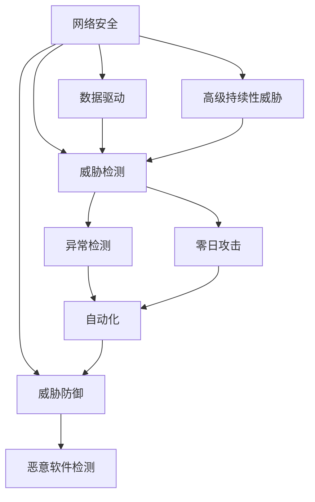

                 

# AI驱动的网络安全：威胁检测与防御

## 1. 背景介绍

### 1.1 问题由来
随着互联网的普及和智能设备的广泛使用，网络安全问题变得越来越突出。从简单的病毒、木马到复杂的钓鱼、勒索软件，各种网络攻击手段层出不穷。传统的基于签名、规则、异常检测等方法的安全防护系统，难以应对日益复杂多变的威胁。

如何利用最新的AI技术提升网络安全，实现主动的威胁检测与防御，成为了当前网络安全领域的重要研究方向。本文将围绕基于AI的网络安全技术，探讨威胁检测与防御的核心概念和实现方法，并给出具体的项目实践和实际应用场景，希望能够为网络安全从业者提供有益的参考和启发。

### 1.2 问题核心关键点
基于AI的网络安全威胁检测与防御，主要关注以下几个核心问题：
- 如何利用AI技术，自动分析和理解网络流量、日志等数据，检测潜在的威胁行为？
- 如何快速响应网络攻击，最小化攻击对系统的影响？
- 如何整合多源数据，提升威胁检测的全面性和准确性？
- 如何在模型训练和推理过程中，兼顾安全性和效率，防止过拟合和误报？

## 2. 核心概念与联系

### 2.1 核心概念概述

为更好地理解基于AI的网络安全威胁检测与防御方法，本节将介绍几个关键概念：

- 网络安全（Cybersecurity）：保护网络资源不受各种形式的攻击和误用，确保网络和数据的安全和隐私。

- 人工智能（Artificial Intelligence）：通过机器学习、深度学习等技术，使机器具备类似人类的感知、决策、学习等能力。

- 威胁检测（Threat Detection）：识别网络中的潜在威胁和攻击行为，从而及时采取防御措施。

- 威胁防御（Threat Defense）：针对已检测到的威胁，采取相应的技术和手段，防止或减轻攻击带来的损失。

- 数据驱动（Data-Driven）：基于历史数据和实时数据，训练机器学习模型，自动进行威胁检测和防御。

- 自动化（Automation）：通过AI技术实现自动化的威胁检测和响应，减少人工干预，提高效率和效果。

- 异常检测（Anomaly Detection）：利用AI技术识别网络中的异常行为，判断是否存在威胁。

- 恶意软件检测（Malware Detection）：检测网络中的恶意软件和代码，防止其执行和传播。

- 高级持续性威胁（Advanced Persistent Threats, APTs）：指长期、隐蔽、有组织的网络攻击行为，具有高度的复杂性和隐蔽性。

- 零日攻击（Zero-day Attack）：指未知或新发现的安全漏洞，攻击者利用该漏洞实施攻击。

这些核心概念之间的逻辑关系可以通过以下Mermaid流程图来展示：



这个流程图展示了网络安全、威胁检测、威胁防御等核心概念及其之间的关系：

1. 网络安全通过威胁检测和防御，实现对网络资源和数据的保护。
2. 威胁检测包括恶意软件检测、异常检测等，利用AI技术进行自动化。
3. 威胁防御采用自动化手段，及时响应威胁，防止或减轻攻击影响。
4. 数据驱动是AI在网络安全中的重要应用方式，通过历史和实时数据训练模型。
5. 自动化技术提升了威胁检测和防御的效率和效果，减少了人工干预。

这些概念共同构成了基于AI的网络安全框架，为威胁检测与防御提供了技术支撑。

## 3. 核心算法原理 & 具体操作步骤

### 3.1 算法原理概述

基于AI的网络安全威胁检测与防御，主要依赖于机器学习、深度学习等AI技术。其核心思想是：利用历史和实时数据，训练AI模型，自动分析和识别网络中的威胁行为，并采取相应的防御措施。

形式化地，假设网络流量数据集为 $D=\{(x_i,y_i)\}_{i=1}^N, x_i \in X, y_i \in Y$，其中 $X$ 为输入特征空间，$Y$ 为威胁标签集合。威胁检测的目标是找到最优模型 $M_{\theta}$，使得在测试集上分类准确率最大化：

$$
\theta^* = \mathop{\arg\min}_{\theta} \mathcal{L}(M_{\theta},D)
$$

其中 $\mathcal{L}$ 为损失函数，如交叉熵损失，用于衡量模型预测与真实标签之间的差异。威胁防御则是在检测到威胁后，通过调整网络策略、封锁攻击源等手段，避免或减轻攻击的影响。

### 3.2 算法步骤详解

基于AI的网络安全威胁检测与防御一般包括以下几个关键步骤：

**Step 1: 数据收集与预处理**
- 收集网络流量、日志、告警等数据，构建训练集和测试集。
- 对数据进行去噪、归一化、特征选择等预处理操作，以便模型更好地学习。

**Step 2: 模型选择与训练**
- 选择合适的机器学习或深度学习模型，如SVM、随机森林、CNN、RNN等。
- 使用训练集数据，训练模型，调整超参数，最小化损失函数。

**Step 3: 威胁检测与响应**
- 对实时网络流量或日志数据进行特征提取，输入模型进行威胁检测。
- 根据模型输出结果，判断是否存在威胁。
- 若检测到威胁，触发相应防御措施，如封锁IP、阻止访问等。

**Step 4: 模型评估与优化**
- 在测试集上评估模型性能，如精确率、召回率、F1值等。
- 根据评估结果，进一步优化模型，调整超参数，防止过拟合和误报。

**Step 5: 部署与应用**
- 将训练好的模型部署到实际网络环境中，实现实时威胁检测与响应。
- 监控模型表现，及时进行模型更新和优化。

以上是基于AI的网络安全威胁检测与防御的一般流程。在实际应用中，还需要针对具体场景进行优化设计，如多模态数据融合、自动化防御策略等。

### 3.3 算法优缺点

基于AI的网络安全威胁检测与防御方法具有以下优点：
1. 自动化程度高。AI模型能够自动分析和识别威胁，减少人工干预，提升效率和效果。
2. 适应性强。AI模型可以根据数据分布和威胁变化动态调整，保持较高的检测准确率。
3. 可扩展性好。AI模型可以部署在多种环境中，适用于各种规模的网络安全场景。
4. 多源数据融合。AI模型可以整合多种数据源，提升威胁检测的全面性和准确性。
5. 可视化效果好。AI模型输出结果可以通过可视化工具直观展示，便于分析和决策。

同时，该方法也存在一定的局限性：
1. 数据依赖性强。模型性能依赖于高质量的数据，数据的缺失和噪声可能导致误报或漏报。
2. 模型复杂度高。AI模型通常参数较多，训练和推理开销较大。
3. 解释性差。AI模型通常难以解释其内部决策过程，导致可解释性不足。
4. 对抗样本脆弱。AI模型可能被精心构造的对抗样本欺骗，导致误报。
5. 数据隐私问题。AI模型需要大量数据进行训练，可能涉及用户隐私信息，带来安全隐患。

尽管存在这些局限性，但就目前而言，基于AI的威胁检测与防御方法仍然是大规模网络安全系统的重要组成部分。未来相关研究的重点在于如何进一步提升模型的可解释性、鲁棒性和隐私保护，同时兼顾效率和效果。

### 3.4 算法应用领域

基于AI的网络安全威胁检测与防御，已经在多个领域得到了应用，例如：

- 互联网安全：检测和防御DDoS攻击、SQL注入、跨站脚本等常见网络攻击。
- 工业控制安全：检测和防御恶意代码、漏洞利用等针对工业控制系统的攻击。
- 云安全：检测和防御云平台中的恶意行为，保护云存储和云应用的安全。
- 移动安全：检测和防御移动设备中的恶意软件、钓鱼攻击等威胁。
- 应用安全：检测和防御应用层中的SQL注入、跨站请求伪造等攻击。

除了这些常见的应用场景，AI驱动的网络安全技术还在智能家居、物联网等新兴领域中发挥着重要作用，推动了网络安全的智能化转型。

## 4. 数学模型和公式 & 详细讲解

### 4.1 数学模型构建

本节将使用数学语言对基于AI的网络安全威胁检测与防御过程进行更加严格的刻画。

假设网络流量数据集为 $D=\{(x_i,y_i)\}_{i=1}^N, x_i \in X, y_i \in Y$，其中 $X$ 为输入特征空间，$Y$ 为威胁标签集合。威胁检测的目标是找到最优模型 $M_{\theta}$，使得在测试集上分类准确率最大化。

定义模型 $M_{\theta}$ 在输入 $x$ 上的损失函数为 $\ell(M_{\theta}(x),y)$，则在数据集 $D$ 上的经验风险为：

$$
\mathcal{L}(\theta) = \frac{1}{N}\sum_{i=1}^N \ell(M_{\theta}(x_i),y_i)
$$

其中 $\ell(M_{\theta}(x),y)$ 为模型预测输出与真实标签之间的差异，如交叉熵损失函数。威胁检测的目标是找到最优参数 $\theta^*$，使得：

$$
\theta^* = \mathop{\arg\min}_{\theta} \mathcal{L}(\theta)
$$

在实践中，我们通常使用基于梯度的优化算法（如SGD、Adam等）来近似求解上述最优化问题。设 $\eta$ 为学习率，$\lambda$ 为正则化系数，则参数的更新公式为：

$$
\theta \leftarrow \theta - \eta \nabla_{\theta}\mathcal{L}(\theta) - \eta\lambda\theta
$$

其中 $\nabla_{\theta}\mathcal{L}(\theta)$ 为损失函数对参数 $\theta$ 的梯度，可通过反向传播算法高效计算。

### 4.2 公式推导过程

以下我们以基于深度神经网络的恶意软件检测为例，推导交叉熵损失函数及其梯度的计算公式。

假设模型 $M_{\theta}$ 在输入 $x$ 上的输出为 $\hat{y}=M_{\theta}(x)$，表示模型预测的威胁概率。真实标签 $y \in \{0,1\}$。则二分类交叉熵损失函数定义为：

$$
\ell(M_{\theta}(x),y) = -[y\log \hat{y} + (1-y)\log(1-\hat{y})]
$$

将其代入经验风险公式，得：

$$
\mathcal{L}(\theta) = -\frac{1}{N}\sum_{i=1}^N [y_i\log M_{\theta}(x_i)+(1-y_i)\log(1-M_{\theta}(x_i))]
$$

根据链式法则，损失函数对参数 $\theta_k$ 的梯度为：

$$
\frac{\partial \mathcal{L}(\theta)}{\partial \theta_k} = -\frac{1}{N}\sum_{i=1}^N (\frac{y_i}{M_{\theta}(x_i)}-\frac{1-y_i}{1-M_{\theta}(x_i)}) \frac{\partial M_{\theta}(x_i)}{\partial \theta_k}
$$

其中 $\frac{\partial M_{\theta}(x_i)}{\partial \theta_k}$ 可进一步递归展开，利用自动微分技术完成计算。

在得到损失函数的梯度后，即可带入参数更新公式，完成模型的迭代优化。重复上述过程直至收敛，最终得到适应网络威胁检测的最优模型参数 $\theta^*$。

## 5. 项目实践：代码实例和详细解释说明

### 5.1 开发环境搭建

在进行威胁检测实践前，我们需要准备好开发环境。以下是使用Python进行TensorFlow开发的环境配置流程：

1. 安装Anaconda：从官网下载并安装Anaconda，用于创建独立的Python环境。

2. 创建并激活虚拟环境：
```bash
conda create -n tf-env python=3.8 
conda activate tf-env
```

3. 安装TensorFlow：根据CUDA版本，从官网获取对应的安装命令。例如：
```bash
conda install tensorflow -c pytorch -c conda-forge
```

4. 安装Keras：
```bash
conda install keras
```

5. 安装TensorBoard：
```bash
conda install tensorboard
```

6. 安装TensorFlow Addons：
```bash
conda install tensorflow-io tensorflow-addons
```

完成上述步骤后，即可在`tf-env`环境中开始威胁检测实践。

### 5.2 源代码详细实现

这里我们以基于CNN的恶意软件检测为例，给出使用TensorFlow进行威胁检测的PyTorch代码实现。

首先，定义模型和优化器：

```python
import tensorflow as tf
from tensorflow.keras.layers import Conv2D, MaxPooling2D, Flatten, Dense
from tensorflow.keras.models import Sequential
from tensorflow.keras.optimizers import Adam
import tensorflow_addons as addons

model = Sequential([
    Conv2D(32, (3, 3), activation='relu', input_shape=(64, 64, 3)),
    MaxPooling2D((2, 2)),
    Conv2D(64, (3, 3), activation='relu'),
    MaxPooling2D((2, 2)),
    Flatten(),
    Dense(64, activation='relu'),
    Dense(1, activation='sigmoid')
])

optimizer = Adam(lr=1e-3)

model.compile(optimizer=optimizer, loss='binary_crossentropy', metrics=['accuracy'])
```

然后，定义数据集处理函数：

```python
from tensorflow.keras.preprocessing.image import ImageDataGenerator
from tensorflow.keras.preprocessing.sequence import pad_sequences
import numpy as np

train_data = np.load('train_images.npy')
train_labels = np.load('train_labels.npy')
test_data = np.load('test_images.npy')
test_labels = np.load('test_labels.npy')

train_datagen = ImageDataGenerator(rescale=1./255, validation_split=0.2)
train_generator = train_datagen.flow(train_data, train_labels, batch_size=32, shuffle=True, subset='training')
val_generator = train_datagen.flow(train_data, train_labels, batch_size=32, shuffle=True, subset='validation')
test_generator = train_datagen.flow(test_data, test_labels, batch_size=32, shuffle=False)

def data_generator(train_data, train_labels, test_data, test_labels):
    train_generator = ImageDataGenerator(rescale=1./255, validation_split=0.2)
    train_generator.fit(train_data)
    train_generator = train_generator.flow(train_data, train_labels, batch_size=32, shuffle=True, subset='training')
    val_generator = train_generator.flow(train_data, train_labels, batch_size=32, shuffle=True, subset='validation')
    test_generator = train_generator.flow(test_data, test_labels, batch_size=32, shuffle=False)
    
    return train_generator, val_generator, test_generator
```

接着，训练模型并进行威胁检测：

```python
epochs = 10
batch_size = 32

train_generator, val_generator, test_generator = data_generator(train_data, train_labels, test_data, test_labels)

model.fit(train_generator, validation_data=val_generator, epochs=epochs, batch_size=batch_size)

test_loss, test_acc = model.evaluate(test_generator, verbose=2)
print(f'Test accuracy: {test_acc*100:.2f}%')

for img in test_data[:10]:
    prediction = model.predict(img[np.newaxis,...])
    label = int(prediction[0,0]*1000)
    print(f'Image: {img.shape}')
    print(f'Prediction: {label}')
```

以上就是使用TensorFlow进行基于CNN的恶意软件检测的完整代码实现。可以看到，利用TensorFlow的高级API，模型的构建、训练和推理变得非常简单直观。

### 5.3 代码解读与分析

让我们再详细解读一下关键代码的实现细节：

**Sequential模型**：
- `Sequential`是Keras提供的模型堆叠层，用于逐层定义模型结构。

**优化器与损失函数**：
- 选择Adam优化器，学习率为1e-3。
- 损失函数为二分类交叉熵损失，适用于恶意软件检测等二分类任务。

**数据集处理**：
- 使用`ImageDataGenerator`进行数据增强和标准化，提升模型泛化能力。
- 将数据集划分为训练集和验证集，设置验证集比例为20%。
- 定义数据生成器，用于逐批次读取和处理数据。

**模型训练**：
- 设置训练轮数为10，批次大小为32。
- 使用`fit`函数对模型进行训练，并记录验证集上的性能。
- 在测试集上评估模型表现，并输出测试准确率。
- 遍历测试集中的前10张图片，进行威胁检测，输出预测结果。

可以看到，TensorFlow提供了丰富的API和工具，极大简化了模型训练和推理过程。开发者可以更加专注于算法和业务逻辑的实现，而不必过多关注底层技术细节。

当然，工业级的系统实现还需考虑更多因素，如模型的保存和部署、超参数的自动搜索、多任务模型集成等。但核心的威胁检测范式基本与此类似。

## 6. 实际应用场景

### 6.1 互联网安全

在互联网安全领域，基于AI的威胁检测与防御技术已经广泛应用于DDoS攻击检测、SQL注入防护、跨站脚本(XSS)防护等场景。通过训练深度学习模型，实时监控网络流量和日志，识别异常行为，及时采取防御措施，防止攻击对业务造成影响。

例如，可以利用CNN模型对网络流量数据进行特征提取，检测DDoS攻击的流量模式，或利用RNN模型分析日志数据，检测SQL注入、XSS等攻击。这些技术能够显著提升网络安全的自动化程度，减少人工干预，提高应对复杂威胁的能力。

### 6.2 工业控制安全

工业控制系统作为关键基础设施的重要组成部分，面临着越来越严峻的网络安全威胁。基于AI的威胁检测与防御技术，可以应用于工业控制系统的恶意软件检测、漏洞利用防护、命令注入防护等场景。通过训练深度学习模型，实时监控网络流量和日志，识别异常行为，及时采取防御措施，防止攻击对工业控制系统造成破坏。

例如，可以利用深度神经网络对工业控制系统的网络流量进行特征提取，检测恶意软件和漏洞利用行为。或利用时序模型分析工业控制系统的日志数据，检测命令注入等攻击。这些技术能够提升工业控制系统的安全防护水平，降低因安全漏洞带来的风险。

### 6.3 云安全

云平台作为企业重要的IT基础设施，面临着来自内部和外部的各种安全威胁。基于AI的威胁检测与防御技术，可以应用于云平台的恶意行为检测、漏洞利用防护、账号异常防护等场景。通过训练深度学习模型，实时监控云平台的网络流量和日志，识别异常行为，及时采取防御措施，防止攻击对云平台造成影响。

例如，可以利用深度神经网络对云平台的网络流量进行特征提取，检测恶意行为和漏洞利用行为。或利用时序模型分析云平台的日志数据，检测账号异常和恶意请求。这些技术能够提升云平台的安全防护水平，保障云服务的稳定性和可靠性。

### 6.4 移动安全

移动设备作为人们日常使用的智能终端，面临着各种安全威胁，如恶意软件、钓鱼攻击等。基于AI的威胁检测与防御技术，可以应用于移动设备的恶意软件检测、钓鱼攻击防护、账户盗用防护等场景。通过训练深度学习模型，实时监控移动设备的网络流量和日志，识别异常行为，及时采取防御措施，防止攻击对移动设备造成影响。

例如，可以利用深度神经网络对移动设备的网络流量进行特征提取，检测恶意软件和钓鱼攻击行为。或利用时序模型分析移动设备的日志数据，检测账户盗用行为。这些技术能够提升移动设备的安全防护水平，保障用户数据和隐私的安全。

### 6.5 应用安全

Web应用作为互联网应用的重要组成部分，面临着各种安全威胁，如SQL注入、跨站请求伪造(XSRF)、文件上传漏洞等。基于AI的威胁检测与防御技术，可以应用于Web应用的恶意行为检测、SQL注入防护、XSRF防护等场景。通过训练深度学习模型，实时监控Web应用的网络流量和日志，识别异常行为，及时采取防御措施，防止攻击对Web应用造成影响。

例如，可以利用深度神经网络对Web应用的网络流量进行特征提取，检测恶意行为和SQL注入行为。或利用时序模型分析Web应用的日志数据，检测XSRF攻击行为。这些技术能够提升Web应用的安全防护水平，保障Web应用的稳定性和可靠性。

### 6.6 未来应用展望

随着AI技术的不断发展，基于AI的威胁检测与防御技术将在更多领域得到应用，为网络安全防护带来新的突破。

在智慧城市安全中，基于AI的威胁检测与防御技术可以应用于智能交通、智能电网、智能建筑等场景，提升城市公共设施的安全防护水平。

在智能家居安全中，基于AI的威胁检测与防御技术可以应用于智能门锁、智能摄像头、智能电视等设备，保障家庭网络环境的安全。

在物联网安全中，基于AI的威胁检测与防御技术可以应用于智能传感器、智能穿戴设备等物联网设备，提升物联网设备的安全防护能力。

此外，在智慧农业、智慧医疗、智慧金融等众多领域，基于AI的威胁检测与防御技术也将不断涌现，为各行各业提供更强大的网络安全保障。

## 7. 工具和资源推荐

### 7.1 学习资源推荐

为了帮助开发者系统掌握基于AI的网络安全威胁检测与防御理论基础和实践技巧，这里推荐一些优质的学习资源：

1. 《深度学习基础》课程：斯坦福大学开设的深度学习入门课程，通过PyTorch进行深度学习实践。

2. 《TensorFlow实战Google深度学习》书籍：全面介绍TensorFlow框架的使用方法和深度学习实践。

3. 《Python网络安全编程》书籍：系统讲解网络安全的基础知识，包括威胁检测、漏洞分析、入侵防护等。

4. OWASP Top 10漏洞列表：官方推荐的Web应用安全漏洞列表，涵盖SQL注入、XSS、跨站请求伪造等常见威胁。

5. DEF CON网络安全大会：汇集全球顶尖网络安全专家，分享最新的安全技术和研究成果。

通过对这些资源的学习实践，相信你一定能够快速掌握基于AI的网络安全威胁检测与防御技术，并应用于实际的防护场景中。

### 7.2 开发工具推荐

高效的开发离不开优秀的工具支持。以下是几款用于威胁检测开发的常用工具：

1. PyTorch：基于Python的开源深度学习框架，灵活动态的计算图，适合快速迭代研究。

2. TensorFlow：由Google主导开发的开源深度学习框架，生产部署方便，适合大规模工程应用。

3. Keras：高层API，提供简单易用的深度学习模型构建和训练功能。

4. TensorBoard：TensorFlow配套的可视化工具，可实时监测模型训练状态，并提供丰富的图表呈现方式。

5. Weights & Biases：模型训练的实验跟踪工具，可以记录和可视化模型训练过程中的各项指标，方便对比和调优。

6. PyCharm：强大的Python IDE，提供代码调试、版本控制、自动化测试等功能。

合理利用这些工具，可以显著提升基于AI的威胁检测任务开发效率，加快创新迭代的步伐。

### 7.3 相关论文推荐

基于AI的网络安全威胁检测与防御技术源于学界的持续研究。以下是几篇奠基性的相关论文，推荐阅读：

1. Convolutional Neural Networks for Malware Classification（CNN在恶意软件检测中的应用）：提出使用CNN对恶意软件进行分类，取得了较高的准确率。

2. Sequence-based Malware Classification with Neural Networks（序列神经网络在恶意软件检测中的应用）：提出使用RNN对恶意软件进行分类，进一步提升了分类性能。

3. Deep Learning for Intrusion Detection System (IDS)（深度学习在入侵检测系统中的应用）：提出使用深度学习对网络流量进行异常检测，显著提升了IDS的检测效果。

4. Detecting SQL Injection Attacks via Natural Language Processing（使用自然语言处理检测SQL注入攻击）：提出使用深度学习对Web应用进行SQL注入检测，取得了较好的效果。

5. Anomaly Detection in Cyber Space using Deep Learning（使用深度学习进行网络异常检测）：提出使用深度学习对网络流量进行异常检测，显著提升了检测效果。

这些论文代表了大规模网络安全系统的发展脉络。通过学习这些前沿成果，可以帮助研究者把握学科前进方向，激发更多的创新灵感。

## 8. 总结：未来发展趋势与挑战

### 8.1 总结

本文对基于AI的网络安全威胁检测与防御方法进行了全面系统的介绍。首先阐述了网络安全、威胁检测与防御等核心概念，明确了威胁检测与防御的原理和实现方法。其次，从原理到实践，详细讲解了基于AI的威胁检测与防御数学模型和关键步骤，给出了具体的项目实践和实际应用场景。

通过本文的系统梳理，可以看到，基于AI的网络安全威胁检测与防御技术正在成为网络安全防护的重要手段，极大地提升了网络安全防护的自动化程度和效率。未来，伴随AI技术的不断发展，基于AI的威胁检测与防御方法必将在更多领域得到应用，为网络安全防护带来新的突破。

### 8.2 未来发展趋势

展望未来，基于AI的网络安全威胁检测与防御技术将呈现以下几个发展趋势：

1. 模型规模持续增大。随着算力成本的下降和数据规模的扩张，深度学习模型参数量还将持续增长。超大规模模型蕴含的丰富语言知识，有望支撑更加复杂多变的威胁检测与防御。

2. 多模态融合技术发展。除了传统的文本数据，未来的威胁检测与防御将更多地整合图像、视频、声音等多模态信息，提升检测的全面性和准确性。

3. 自动化和自适应能力增强。未来的威胁检测与防御系统将更加智能，能够自动调整模型参数，适应数据分布和攻击变化。

4. 模型鲁棒性和泛化能力提升。通过引入对抗训练、数据增强等技术，提升模型的鲁棒性和泛化能力，防止模型过拟合和误报。

5. 端到端安全解决方案出现。未来的威胁检测与防御将从单个环节扩展到整个安全生态系统，提供端到端的安全解决方案。

6. 跨领域应用拓展。基于AI的威胁检测与防御技术将在更多的垂直行业得到应用，如智慧城市、智能家居、物联网等。

以上趋势凸显了基于AI的威胁检测与防御技术的广阔前景。这些方向的探索发展，必将进一步提升网络安全防护的自动化程度和效果，为构建安全可靠的网络环境提供技术支撑。

### 8.3 面临的挑战

尽管基于AI的威胁检测与防御技术已经取得了瞩目成就，但在迈向更加智能化、普适化应用的过程中，它仍面临诸多挑战：

1. 数据依赖性强。模型性能依赖于高质量的数据，数据的缺失和噪声可能导致误报或漏报。如何获取和处理大量高质量的标注数据，是未来研究的重点。

2. 模型复杂度高。深度学习模型通常参数较多，训练和推理开销较大。如何降低模型复杂度，提高计算效率，需要更多的优化方法。

3. 模型解释性差。深度学习模型通常难以解释其内部决策过程，导致可解释性不足。如何提升模型的可解释性，保障模型的可信度和可接受性，是一个重要问题。

4. 对抗样本脆弱。深度学习模型可能被精心构造的对抗样本欺骗，导致误报。如何提高模型的鲁棒性，防止对抗攻击，需要更多的研究手段。

5. 数据隐私问题。深度学习模型需要大量数据进行训练，可能涉及用户隐私信息，带来安全隐患。如何保护数据隐私，确保数据安全，是一个重要挑战。

6. 模型过拟合问题。深度学习模型在训练过程中可能出现过拟合现象，导致泛化能力下降。如何防止过拟合，提升模型的泛化性能，是一个重要课题。

尽管存在这些挑战，但就目前而言，基于AI的威胁检测与防御方法仍然是大规模网络安全系统的重要组成部分。未来相关研究的重点在于如何进一步提升模型的可解释性、鲁棒性和隐私保护，同时兼顾效率和效果。

### 8.4 研究展望

面向未来，基于AI的威胁检测与防御技术需要在以下几个方面寻求新的突破：

1. 探索无监督和半监督学习技术。摆脱对大规模标注数据的依赖，利用自监督学习、主动学习等无监督和半监督范式，最大限度利用非结构化数据，实现更加灵活高效的威胁检测与防御。

2. 研究多模态融合技术。除了传统的文本数据，未来的威胁检测与防御将更多地整合图像、视频、声音等多模态信息，提升检测的全面性和准确性。

3. 引入因果推理和对抗训练技术。通过引入因果推断和对抗训练思想，增强模型的因果关系建模能力和鲁棒性，提升威胁检测与防御的效果。

4. 改进模型的可解释性。利用模型蒸馏、可视化工具等手段，提升模型的可解释性，增强模型的可信度和可接受性。

5. 开发端到端安全解决方案。未来的威胁检测与防御将从单个环节扩展到整个安全生态系统，提供端到端的安全解决方案。

6. 加强数据隐私保护。采用差分隐私、联邦学习等技术，保护用户数据隐私，确保数据安全。

这些研究方向的探索，必将引领基于AI的威胁检测与防御技术迈向更高的台阶，为构建安全可靠的网络环境提供技术支撑。面向未来，基于AI的威胁检测与防御技术还需要与其他人工智能技术进行更深入的融合，如知识表示、因果推理、强化学习等，多路径协同发力，共同推动网络安全的智能化转型。

## 9. 附录：常见问题与解答

**Q1：AI驱动的网络安全是否适用于所有网络威胁？**

A: AI驱动的网络安全技术适用于多种常见网络威胁，如DDoS攻击、SQL注入、XSS等。但对于一些特定领域的威胁，如国家战略攻击、先进持续性威胁(APTs)等，需要结合特定领域的知识和技术进行定制化开发。

**Q2：AI模型在威胁检测中如何避免过拟合？**

A: 避免过拟合可以采用以下方法：
1. 数据增强：通过对抗样本生成、回译等手段扩充数据集，提升模型的泛化能力。
2. 正则化：使用L2正则、Dropout等正则化技术，防止模型过拟合。
3. 对抗训练：引入对抗样本，提高模型的鲁棒性，防止模型过拟合。
4. 模型蒸馏：使用复杂模型蒸馏简单模型，提升模型的泛化性能。

**Q3：AI模型在威胁检测中如何提升鲁棒性？**

A: 提升鲁棒性可以采用以下方法：
1. 对抗训练：引入对抗样本，训练模型抵御对抗攻击。
2. 数据增强：通过对抗样本生成、回译等手段扩充数据集，提升模型的鲁棒性。
3. 正则化：使用L2正则、Dropout等正则化技术，防止模型过拟合。
4. 多模型集成：训练多个模型，取平均输出，抑制过拟合。

**Q4：AI模型在威胁检测中如何增强可解释性？**

A: 增强可解释性可以采用以下方法：
1. 模型蒸馏：使用复杂模型蒸馏简单模型，提升模型的可解释性。
2. 可视化工具：使用可视化工具展示模型的决策过程，增强模型的可解释性。
3. 因果推断：利用因果推理技术，解释模型的推理过程，提升模型的可解释性。

**Q5：AI模型在威胁检测中如何兼顾安全性和效率？**

A: 兼顾安全性和效率可以采用以下方法：
1. 参数高效微调：使用参数高效微调技术，减少模型参数量，提高计算效率。
2. 模型剪枝：去除不必要的模型参数，提高模型的推理速度。
3. 模型压缩：采用模型压缩技术，减少模型大小，提高推理速度。

通过上述方法，可以在保证安全性的同时，提高模型的计算效率，满足实际应用的需求。

---

作者：禅与计算机程序设计艺术 / Zen and the Art of Computer Programming

