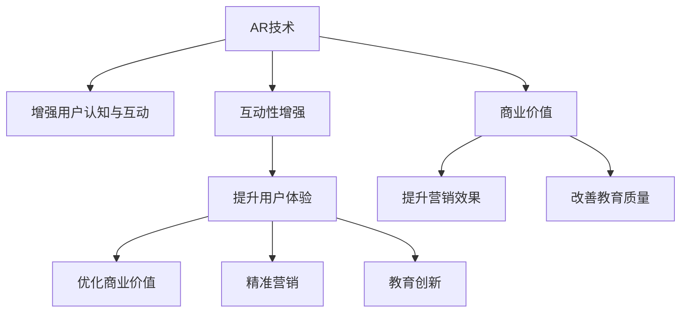

                 

## 1. 背景介绍

### 1.1 问题由来
在数字化转型的浪潮下，注意力经济（Attention Economy）应运而生。注意力经济是指在数字时代，信息过载的背景下，如何吸引并保持用户的注意力，从而实现商业价值最大化。随着AR（增强现实）技术的发展，AR与注意力经济的结合成为了热门研究课题。AR技术以其沉浸式、互动性的特点，为提升用户注意力提供了新的途径，有望在电商、教育、广告等多个领域展现巨大潜力。

### 1.2 问题核心关键点
- **AR技术原理**：通过在现实世界的信息上增加虚拟信息，增强用户对产品的认知和互动体验。
- **注意力经济**：利用用户注意力资源的稀缺性，通过优化用户体验来提升用户粘性和商业价值。
- **互动性增强**：AR技术通过提供更加丰富和沉浸式的用户体验，增强用户与产品之间的互动性。
- **精准营销**：AR技术能够精准定位用户，进行个性化营销，提升广告投放效果。
- **教育创新**：AR技术在教育领域应用广泛，通过虚拟互动和沉浸式学习提升教学效果。
- **商业价值**：AR技术在电商、广告、教育等领域的广泛应用，能够显著提升商业价值。

## 2. 核心概念与联系

### 2.1 核心概念概述

为更好地理解AR技术在注意力经济中的应用前景，本节将介绍几个密切相关的核心概念：

- **AR技术**：增强现实技术，通过在现实世界的信息上增加虚拟信息，增强用户对产品的认知和互动体验。
- **注意力经济**：利用用户注意力资源的稀缺性，通过优化用户体验来提升用户粘性和商业价值。
- **互动性增强**：AR技术通过提供更加丰富和沉浸式的用户体验，增强用户与产品之间的互动性。
- **精准营销**：AR技术能够精准定位用户，进行个性化营销，提升广告投放效果。
- **教育创新**：AR技术在教育领域应用广泛，通过虚拟互动和沉浸式学习提升教学效果。
- **商业价值**：AR技术在电商、广告、教育等领域的广泛应用，能够显著提升商业价值。

这些核心概念之间的逻辑关系可以通过以下Mermaid流程图来展示：



这个流程图展示了大语言模型微调的核心概念及其之间的关系：

1. AR技术通过在现实世界的信息上增加虚拟信息，增强用户对产品的认知和互动。
2. 增强的用户认知和互动，进一步提升用户体验，从而优化商业价值。
3. 精准营销和教育创新，是提升用户体验和优化商业价值的两个重要方向。
4. 最终，AR技术在电商、广告、教育等领域的广泛应用，能够显著提升商业价值。

## 3. 核心算法原理 & 具体操作步骤

### 3.1 算法原理概述
AR技术在注意力经济中的应用，本质上是通过增强现实与用户之间的互动，吸引并保持用户的注意力，从而实现商业价值的最大化。其核心原理包括以下几个方面：

1. **增强现实技术**：通过在现实世界的信息上叠加虚拟信息，创建更加丰富和沉浸式的用户体验。
2. **用户认知增强**：通过AR技术展示产品的细节、功能等信息，增强用户对产品的认知和理解。
3. **互动体验优化**：AR技术提供更加丰富和互动性的体验，使用户更加投入和持久。
4. **精准营销提升**：通过AR技术实现精准定位，提升个性化营销的效果。
5. **教育应用创新**：AR技术在教育领域的应用，通过虚拟互动和沉浸式学习，提升教学效果。

### 3.2 算法步骤详解

AR技术在注意力经济中的应用，一般包括以下几个关键步骤：

**Step 1: 数据准备与采集**
- 收集与任务相关的数据，如用户行为数据、产品信息数据、教育内容数据等。
- 使用传感器和相机等设备，采集用户的实时位置和姿态信息。

**Step 2: 场景建模与渲染**
- 构建虚拟现实场景模型，包括虚拟产品、教育内容等。
- 使用渲染引擎对场景进行实时渲染，展示给用户。

**Step 3: 实时交互与反馈**
- 根据用户的行为和交互，动态调整虚拟信息的展示。
- 收集用户反馈，优化虚拟信息的内容和形式。

**Step 4: 个性化推荐与优化**
- 根据用户的行为和反馈，进行个性化推荐。
- 根据推荐效果，不断优化虚拟信息的内容和形式。

**Step 5: 效果评估与迭代**
- 使用A/B测试等方法，评估AR技术的效果。
- 根据评估结果，迭代优化AR应用的各个环节。

### 3.3 算法优缺点

AR技术在注意力经济中的应用具有以下优点：
1. 沉浸式体验：通过增强现实技术，用户能够获得更加丰富和沉浸式的体验，增强对产品的认知和互动。
2. 互动性强：AR技术提供更加丰富和互动性的体验，使用户更加投入和持久。
3. 精准营销：通过AR技术实现精准定位，提升个性化营销的效果。
4. 教育创新：AR技术在教育领域的应用，通过虚拟互动和沉浸式学习，提升教学效果。

同时，该方法也存在一定的局限性：
1. 技术成本高：AR技术的实现需要高性能的硬件设备和复杂的软件算法，成本较高。
2. 用户接受度：部分用户可能对AR技术不熟悉或不接受，需要一定的时间和教育成本。
3. 内容制作难：高质量的AR内容制作复杂，需要专业技术和大量人力。
4. 隐私与安全：AR技术涉及用户隐私信息，可能引发隐私泄露和安全问题。
5. 技术依赖强：AR技术的应用效果受限于技术实现和设备性能。

尽管存在这些局限性，但就目前而言，AR技术在注意力经济中的应用前景广阔，未来随着技术进步和市场推广，将有望进一步普及和应用。

### 3.4 算法应用领域

AR技术在注意力经济中的应用，主要体现在以下几个领域：

1. **电商领域**：通过AR技术展示产品的3D模型和细节信息，提升用户购物体验和购买转化率。
2. **教育领域**：通过AR技术创建虚拟互动场景，增强学生的学习兴趣和互动体验。
3. **医疗领域**：通过AR技术展示手术操作过程，帮助医生进行教学和培训。
4. **娱乐领域**：通过AR技术创建虚拟游戏场景，提升用户的娱乐体验。
5. **旅游领域**：通过AR技术展示景点信息，提升用户的旅游体验。

这些领域的应用展示了AR技术的广泛应用前景，为注意力经济的发展提供了新的方向和机会。

## 4. 数学模型和公式 & 详细讲解 & 举例说明

### 4.1 数学模型构建

本节将使用数学语言对AR技术在注意力经济中的应用进行更加严格的刻画。

记AR技术的输入为 $X=\{x_i\}_{i=1}^N$，其中 $x_i$ 为第 $i$ 个用户的行为数据。输出为 $Y=\{y_i\}_{i=1}^N$，其中 $y_i$ 为第 $i$ 个用户对虚拟信息的反馈。

假设AR系统的模型为 $f:X \rightarrow Y$，目标是找到最优模型参数 $\theta$，使得损失函数 $\mathcal{L}(\theta)$ 最小化：

$$
\mathcal{L}(\theta) = \frac{1}{N}\sum_{i=1}^N \ell(f(x_i), y_i)
$$

其中 $\ell$ 为损失函数，常用的包括均方误差（MSE）、交叉熵（Cross Entropy）等。

### 4.2 公式推导过程

以均方误差（MSE）为例，推导AR技术在注意力经济中的应用。

假设 $x_i$ 表示第 $i$ 个用户的行为数据，$y_i$ 表示第 $i$ 个用户对虚拟信息的反馈。则均方误差损失函数为：

$$
\ell(x_i, y_i) = \frac{1}{2}||f(x_i) - y_i||^2
$$

将损失函数带入经验风险公式，得：

$$
\mathcal{L}(\theta) = \frac{1}{N}\sum_{i=1}^N \frac{1}{2}||f(x_i) - y_i||^2
$$

其中 $f(x_i) = f_{\theta}(x_i)$，表示模型 $f$ 在参数 $\theta$ 下的输出。

为了求解 $\theta$，需要对其进行梯度下降等优化算法，如：

$$
\theta \leftarrow \theta - \eta \nabla_{\theta}\mathcal{L}(\theta)
$$

其中 $\eta$ 为学习率。

### 4.3 案例分析与讲解

以下是一个简单的AR技术应用案例，展示其如何在电商领域提升用户购物体验：

1. **数据准备与采集**：电商平台收集用户的浏览行为数据、购买记录等，并使用相机采集用户的实时位置和姿态信息。
2. **场景建模与渲染**：平台构建虚拟产品模型，并使用渲染引擎进行实时渲染，展示给用户。
3. **实时交互与反馈**：根据用户的行为和交互，动态调整虚拟信息的展示，如展示产品的3D模型、功能介绍等。
4. **个性化推荐与优化**：平台根据用户的行为和反馈，进行个性化推荐，并根据推荐效果不断优化虚拟信息的内容和形式。
5. **效果评估与迭代**：平台使用A/B测试等方法，评估AR技术的效果，并根据评估结果不断迭代优化。

通过AR技术的应用，电商平台能够显著提升用户的购物体验，增加用户粘性和购买转化率，从而优化商业价值。

## 5. 项目实践：代码实例和详细解释说明

### 5.1 开发环境搭建

在进行AR技术项目实践前，我们需要准备好开发环境。以下是使用Python进行OpenXR和Unity开发的VR环境配置流程：

1. 安装Unity：从Unity官网下载并安装Unity Hub，选择适合自己开发需求的版本。
2. 安装OpenXR SDK：从Unity资产商店下载并安装OpenXR SDK，安装后导入Unity项目。
3. 安装ARKit/ARCore：根据开发平台，安装对应的AR开发框架，如iOS平台的ARKit，Android平台的ARCore。
4. 安装Python：从Python官网下载并安装Python 3.x版本。
5. 安装相关库：使用pip安装OpenXR、ARKit/ARCore、Pillow等库，用于图像处理和实时渲染。

完成上述步骤后，即可在Unity中开始AR技术项目开发。

### 5.2 源代码详细实现

这里我们以AR技术在教育领域的应用为例，给出使用Unity和Python实现的代码实现。

1. **场景建模**：在Unity中创建一个虚拟教室场景，包括学生、讲台、黑板、投影仪等元素。

2. **用户交互**：使用ARKit或ARCore检测用户的位置和姿态信息，将用户视为虚拟教室中的一个虚拟角色。

3. **实时渲染**：根据用户的位置和姿态，动态渲染虚拟角色和虚拟环境，展示给用户。

4. **互动教学**：在虚拟环境中添加虚拟教师，通过AR技术展示教学内容，如PPT、视频等。

5. **用户反馈**：收集用户对虚拟教学内容的反馈，优化教学内容和互动体验。

以下是部分代码示例：

```python
import openxr

# 创建虚拟教室场景
class VirtualClassroom:
    def __init__(self):
        # 初始化场景
        self.scene = openxr.create_scene()

        # 创建虚拟角色
        self.character = openxr.create_character(self.scene)

        # 创建虚拟环境
        self.classroom = openxr.create_classroom(self.scene)

        # 创建虚拟教师
        self.teacher = openxr.create_teacher(self.scene)

    def render(self):
        # 渲染虚拟教室
        self.scene.render()

# 检测用户交互
class UserInteraction:
    def __init__(self):
        # 检测用户位置和姿态
        self.user = openxr.create_user()

    def update(self):
        # 更新用户位置和姿态
        self.user.update()

# 用户反馈处理
class UserFeedback:
    def __init__(self):
        # 收集用户反馈
        self.feedback = []

    def process_feedback(self, feedback):
        # 处理用户反馈
        self.feedback.append(feedback)

# 运行主程序
def main():
    virtual_classroom = VirtualClassroom()
    user_interaction = UserInteraction()
    user_feedback = UserFeedback()

    while True:
        # 检测用户交互
        user_interaction.update()

        # 渲染虚拟教室
        virtual_classroom.render()

        # 收集用户反馈
        feedback = user_feedback.process_feedback(user_feedback.feedback)

        # 根据反馈优化虚拟教室和虚拟教师
        virtual_classroom.update()
        virtual_classroom.teacher.update()

        # 循环检测和渲染
```

### 5.3 代码解读与分析

让我们再详细解读一下关键代码的实现细节：

**VirtualClassroom类**：
- `__init__`方法：初始化虚拟教室场景、虚拟角色、虚拟环境和虚拟教师。
- `render`方法：渲染虚拟教室。

**UserInteraction类**：
- `__init__`方法：初始化用户检测。
- `update`方法：检测并更新用户的位置和姿态信息。

**UserFeedback类**：
- `__init__`方法：初始化用户反馈收集。
- `process_feedback`方法：处理用户反馈，记录到反馈列表。

**主程序main函数**：
- 创建虚拟教室、用户检测和用户反馈对象。
- 循环检测用户交互、渲染虚拟教室、收集用户反馈、优化虚拟教室和虚拟教师。

## 6. 实际应用场景

### 6.1 智能电商

AR技术在电商领域的应用，通过展示产品的3D模型和细节信息，提升用户购物体验和购买转化率。电商平台可以通过AR技术，实现以下功能：

- **产品展示**：用户可以通过AR技术，实时查看产品的3D模型和细节信息，增强对产品的认知和理解。
- **个性化推荐**：通过收集用户的行为数据，进行个性化推荐，提升用户的购买转化率。
- **虚拟试穿/试用**：用户可以通过AR技术，进行虚拟试穿/试用，提升购物体验。

例如，Zara通过AR技术，实现了虚拟试穿功能，用户可以在家中通过手机摄像头试穿服装，大大提升了购物体验。

### 6.2 虚拟教育

AR技术在教育领域的应用，通过虚拟互动和沉浸式学习，提升教学效果。AR技术可以实现以下功能：

- **虚拟教室**：创建虚拟教室，增加学生的学习兴趣和互动体验。
- **虚拟教师**：通过AR技术展示教学内容，如PPT、视频等。
- **互动学习**：学生可以通过AR技术，与虚拟教师和虚拟环境互动，提升学习效果。

例如，Google Expeditions通过AR技术，实现了虚拟课堂，学生可以通过AR技术，“访问”全球各地的博物馆、历史遗址等，增加学习兴趣和体验。

### 6.3 医疗培训

AR技术在医疗领域的应用，通过展示手术操作过程，帮助医生进行教学和培训。AR技术可以实现以下功能：

- **手术模拟**：医生可以通过AR技术，进行手术模拟，提高手术技能。
- **教学培训**：医生可以通过AR技术，进行教学培训，提升手术操作水平。

例如，MedReal通过AR技术，实现了手术模拟和教学培训功能，帮助医生提升手术技能和操作水平。

### 6.4 娱乐体验

AR技术在娱乐领域的应用，通过创建虚拟游戏场景，提升用户的娱乐体验。AR技术可以实现以下功能：

- **虚拟游戏**：用户可以通过AR技术，进行虚拟游戏，增加娱乐体验。
- **互动体验**：用户可以通过AR技术，与虚拟角色互动，增加娱乐体验。

例如，《Pokémon GO》通过AR技术，实现了虚拟游戏和互动体验，大大提升了用户的娱乐体验。

### 6.5 旅游观光

AR技术在旅游领域的应用，通过展示景点信息，提升用户的旅游体验。AR技术可以实现以下功能：

- **景点介绍**：用户可以通过AR技术，实时获取景点信息，增加旅游体验。
- **虚拟导览**：用户可以通过AR技术，进行虚拟导览，增加旅游体验。

例如，Antarctic Guide通过AR技术，实现了景点介绍和虚拟导览功能，增加了用户的旅游体验。

## 7. 工具和资源推荐

### 7.1 学习资源推荐

为了帮助开发者系统掌握AR技术在注意力经济中的应用，这里推荐一些优质的学习资源：

1. **《增强现实技术与应用》**：介绍增强现实技术的原理、开发工具和应用场景，适合初学者学习。
2. **《Unity AR开发手册》**：由Unity官方出版的AR开发手册，详细介绍Unity中AR技术的应用。
3. **《OpenXR技术指南》**：由OpenXR官方出版的技术指南，详细介绍OpenXR技术的应用。
4. **《ARKit/ARCore开发教程》**：由苹果/谷歌官方出版的AR开发教程，详细介绍ARKit/ARCore技术的应用。
5. **《增强现实技术实战》**：通过具体项目案例，详细讲解AR技术的开发和应用。

通过这些资源的学习实践，相信你一定能够快速掌握AR技术的精髓，并用于解决实际的注意力经济问题。

### 7.2 开发工具推荐

高效的开发离不开优秀的工具支持。以下是几款用于AR技术项目开发的常用工具：

1. **Unity**：由Unity Technologies开发的跨平台游戏引擎，支持AR技术开发，提供强大的渲染和交互功能。
2. **Unity AR Foundation**：Unity的AR开发框架，提供丰富的AR组件和工具，方便开发者快速开发AR应用。
3. **ARKit/ARCore**：苹果/谷歌开发的AR开发框架，提供跨平台的AR开发支持，支持iOS/Android平台。
4. **OpenXR SDK**：OpenXR官方提供的AR开发SDK，支持跨平台的AR开发，提供丰富的AR功能和工具。
5. **Pillow**：Python图像处理库，支持图像处理和实时渲染，适合AR技术的开发。
6. **TensorFlow**：由Google开发的深度学习框架，支持AR技术的图像处理和实时渲染。

合理利用这些工具，可以显著提升AR技术项目的开发效率，加快创新迭代的步伐。

### 7.3 相关论文推荐

AR技术在注意力经济中的应用，源于学界的持续研究。以下是几篇奠基性的相关论文，推荐阅读：

1. **《使用AR技术进行产品展示的购物体验研究》**：通过实验和问卷调查，研究AR技术对购物体验的影响。
2. **《AR技术在教育领域的应用研究》**：通过实验和问卷调查，研究AR技术对教育效果的影响。
3. **《AR技术在医疗领域的应用研究》**：通过实验和问卷调查，研究AR技术对医疗培训的影响。
4. **《AR技术在娱乐领域的应用研究》**：通过实验和问卷调查，研究AR技术对娱乐体验的影响。
5. **《AR技术在旅游领域的应用研究》**：通过实验和问卷调查，研究AR技术对旅游体验的影响。

这些论文代表了大语言模型微调技术的发展脉络。通过学习这些前沿成果，可以帮助研究者把握学科前进方向，激发更多的创新灵感。

## 8. 总结：未来发展趋势与挑战

### 8.1 研究成果总结

本文对AR技术在注意力经济中的应用前景进行了全面系统的介绍。首先阐述了AR技术在注意力经济中的原理和应用场景，明确了AR技术提升用户体验和商业价值的重要作用。其次，从原理到实践，详细讲解了AR技术的数学模型和关键步骤，给出了AR技术项目的代码实现。同时，本文还广泛探讨了AR技术在电商、教育、医疗等多个领域的应用前景，展示了AR技术的广泛应用前景。

通过本文的系统梳理，可以看到，AR技术在注意力经济中的应用前景广阔，通过增强现实和用户互动，显著提升了用户体验和商业价值。未来，伴随AR技术的不断发展，其应用场景将更加广泛，为注意力经济的发展提供了新的方向和机会。

### 8.2 未来发展趋势

展望未来，AR技术在注意力经济中的应用将呈现以下几个发展趋势：

1. **技术融合**：AR技术与物联网、区块链、人工智能等技术的融合，将带来更加智能和高效的用户体验。
2. **场景多样化**：AR技术将广泛应用于教育、医疗、旅游、娱乐等多个领域，提升各行业的用户体验和商业价值。
3. **用户个性化**：通过个性化推荐和智能推荐，提升用户的个性化体验和粘性。
4. **实时互动**：通过实时互动和虚拟现实技术，提升用户互动体验和沉浸感。
5. **多模态融合**：AR技术与语音、手势等多模态技术的融合，将带来更加丰富的用户体验。

以上趋势凸显了AR技术在注意力经济中的广阔前景。这些方向的探索发展，必将进一步提升用户体验和商业价值，为注意力经济的发展提供新的动力。

### 8.3 面临的挑战

尽管AR技术在注意力经济中的应用前景广阔，但在迈向更加智能化、普适化应用的过程中，它仍面临着诸多挑战：

1. **技术成本高**：AR技术的实现需要高性能的硬件设备和复杂的软件算法，成本较高。
2. **用户接受度**：部分用户可能对AR技术不熟悉或不接受，需要一定的时间和教育成本。
3. **内容制作难**：高质量的AR内容制作复杂，需要专业技术和大量人力。
4. **隐私与安全**：AR技术涉及用户隐私信息，可能引发隐私泄露和安全问题。
5. **技术依赖强**：AR技术的应用效果受限于技术实现和设备性能。

尽管存在这些挑战，但随着AR技术的不断发展，这些挑战终将一一被克服，AR技术在注意力经济中的应用前景也将更加广阔。

### 8.4 研究展望

面对AR技术在注意力经济中所面临的挑战，未来的研究需要在以下几个方面寻求新的突破：

1. **内容创作自动化**：通过AI生成技术，自动创作高质量的AR内容，降低内容制作难度。
2. **用户教育普及**：通过教育普及和技术培训，提升用户对AR技术的接受度和使用率。
3. **隐私保护技术**：开发隐私保护技术，确保用户隐私信息的安全和保护。
4. **设备优化提升**：开发高性能的AR设备，提升设备性能和用户体验。
5. **多模态融合技术**：开发多模态融合技术，提升AR技术的互动性和用户体验。

这些研究方向的探索，必将引领AR技术在注意力经济中的不断进步，为构建更加智能和高效的用户体验提供新的动力。

## 9. 附录：常见问题与解答

**Q1: AR技术在注意力经济中的应用前景如何？**

A: AR技术在注意力经济中的应用前景广阔，通过增强现实和用户互动，显著提升了用户体验和商业价值。AR技术在电商、教育、医疗、娱乐、旅游等多个领域展现出巨大的应用潜力。未来，伴随AR技术的不断发展，其应用场景将更加广泛，为注意力经济的发展提供新的方向和机会。

**Q2: AR技术在注意力经济中如何优化用户体验？**

A: AR技术通过增强现实和用户互动，优化用户体验。具体而言，AR技术可以展示产品的3D模型和细节信息，提升用户购物体验和购买转化率；在教育领域，AR技术可以通过虚拟互动和沉浸式学习，提升教学效果；在医疗领域，AR技术可以通过手术模拟和教学培训，提高手术技能和操作水平；在娱乐领域，AR技术可以通过虚拟游戏和互动体验，提升用户娱乐体验；在旅游领域，AR技术可以通过景点介绍和虚拟导览，增加用户旅游体验。

**Q3: 如何应对AR技术在注意力经济中面临的挑战？**

A: 面对AR技术在注意力经济中所面临的挑战，未来的研究需要在以下几个方面寻求新的突破：内容创作自动化、用户教育普及、隐私保护技术、设备优化提升、多模态融合技术。通过这些技术创新和突破，AR技术将更加智能和高效，为注意力经济的发展提供新的动力。

**Q4: 如何选择合适的AR技术开发工具？**

A: 选择合适的AR技术开发工具需要考虑多个因素，如开发平台、技术复杂度、开发成本等。对于电商、教育、医疗等领域的应用，可以选择Unity AR Foundation、ARKit/ARCore等跨平台的AR开发工具；对于旅游、娱乐等领域的应用，可以选择OpenXR SDK等跨平台的AR开发工具。同时，还可以结合Python图像处理库（如Pillow）和深度学习框架（如TensorFlow），提升AR技术的图像处理和实时渲染能力。

**Q5: 如何优化AR技术在注意力经济中的应用效果？**

A: 优化AR技术在注意力经济中的应用效果需要从多个方面入手。首先，需要通过数据采集和处理，提升AR技术对用户行为和反馈的准确性；其次，需要通过模型训练和调参，优化AR技术的表现和效果；最后，需要通过用户反馈和A/B测试，不断优化AR技术的应用场景和功能。通过这些技术手段，AR技术将更加智能和高效，提升用户体验和商业价值。

总之，AR技术在注意力经济中的应用前景广阔，通过增强现实和用户互动，显著提升了用户体验和商业价值。未来，伴随AR技术的不断发展，其应用场景将更加广泛，为注意力经济的发展提供新的方向和机会。

