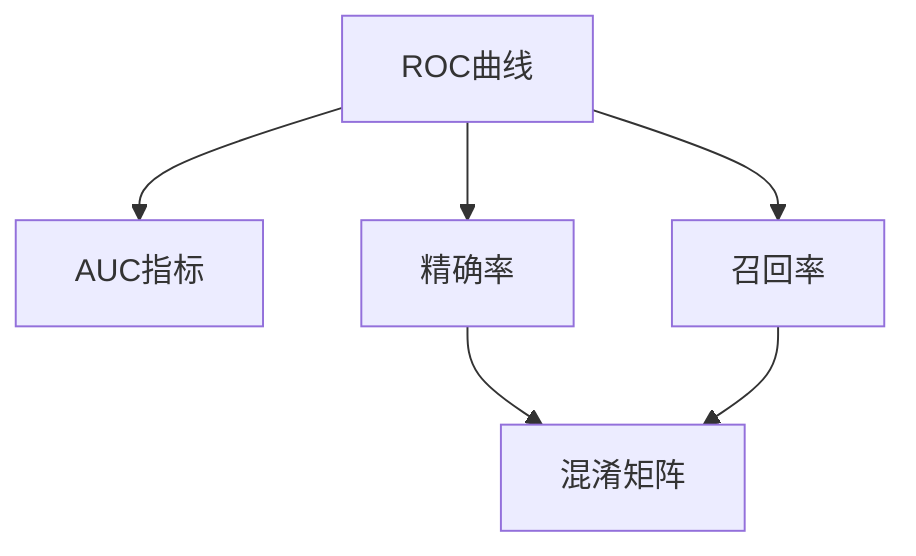

                 

# AUC原理与代码实例讲解

> 关键词：AUC,ROC曲线,精确率,召回率,二分类,假设检验,ROCCurve,Classification,PR曲线,混淆矩阵

## 1. 背景介绍

### 1.1 问题由来
在机器学习中，分类算法的评估指标多种多样。针对不同的应用场景，我们需要选取合适的指标来评价模型的性能。例如，在金融欺诈检测任务中，我们希望模型的精确率高，即错误分类为正常交易的概率低；而在疾病诊断任务中，我们希望召回率高，即漏诊率低。这些指标的选取，需要根据具体任务的特点来确定。

其中，AUC（Area Under Curve）是一个常用的二分类模型性能评估指标，它在处理二分类任务时表现优异。AUC指标不仅适用于性能平稳的二分类器，还能在评价模型对不同阈值的反应上发挥作用。因此，本文将重点介绍AUC指标的原理、计算方法，并通过代码实例，讲解如何在Python中实现AUC指标的计算。

### 1.2 问题核心关键点
AUC指标的核心思想在于，通过ROC曲线来评价模型在不同阈值下的表现，从而全面评估模型的性能。ROC曲线展示了模型在正确分类（TP）和错误分类（FP）上的变化趋势。AUC即ROC曲线下的面积，其值越大，模型的性能越好。

具体来说，AUC的计算包括以下几个关键点：
1. ROC曲线的定义和绘制方法。
2. AUC的计算公式及其推导。
3. AUC指标在二分类任务中的应用场景。
4. 如何通过代码实现AUC的计算，并在实际应用中进行评估。

## 2. 核心概念与联系

### 2.1 核心概念概述

为更好地理解AUC指标的原理，本节将介绍几个密切相关的核心概念：

- ROC曲线（Receiver Operating Characteristic Curve）：展示模型在各种阈值下，TP（True Positive，真阳性）和FP（False Positive，假阳性）的变化趋势。
- AUC（Area Under Curve）：ROC曲线下的面积，用于衡量模型的整体分类性能。
- 精确率（Precision）：分类为正例的样本中，实际为正例的比例。
- 召回率（Recall）：实际为正例的样本中，被分类为正例的比例。
- 混淆矩阵（Confusion Matrix）：展示模型在不同阈值下的预测结果和实际结果。

这些核心概念之间的逻辑关系可以通过以下Mermaid流程图来展示：



这个流程图展示了ROC曲线与AUC指标之间的关系，以及AUC、精确率和召回率等指标的联系。

## 3. 核心算法原理 & 具体操作步骤
### 3.1 算法原理概述

AUC指标通过ROC曲线来评估模型的分类性能。ROC曲线展示了一个分类器在从1到0的阈值区间内，TP和FP的变化情况。AUC即ROC曲线下的面积，其值越大，表示模型在不同阈值下的分类性能越好。

具体来说，假设模型在二分类任务上，对于不同的阈值 $\theta$，可以得到如下的TP和FP值：

$$
TP(\theta) = \sum_{i=1}^n I(y_i=1 \wedge M_{\theta}(x_i) \geq \theta)
$$
$$
FP(\theta) = \sum_{i=1}^n I(y_i=0 \wedge M_{\theta}(x_i) \geq \theta)
$$

其中 $M_{\theta}(x_i)$ 表示模型在输入 $x_i$ 上的预测结果，$I$ 表示示性函数，$n$ 表示样本总数。

### 3.2 算法步骤详解

计算AUC指标的主要步骤如下：

**Step 1: 收集样本的预测值和真实值**
- 收集模型在训练集或测试集上的预测值 $\hat{y}$ 和真实值 $y$。

**Step 2: 计算不同阈值下的TP和FP值**
- 遍历所有可能的阈值 $\theta$，计算在每个阈值下的TP和FP值。

**Step 3: 绘制ROC曲线**
- 将不同的阈值与对应的TP和FP值绘制在坐标系中，得到ROC曲线。

**Step 4: 计算AUC值**
- 计算ROC曲线下的面积，即AUC值。

下面我们将详细介绍上述步骤，并通过Python代码实例进行展示。

### 3.3 算法优缺点

AUC指标的优点在于其全面性和鲁棒性：
1. 全面性：AUC指标考虑了模型在不同阈值下的表现，能够全面评估模型的分类性能。
2. 鲁棒性：AUC指标不受样本不平衡的影响，可以处理多种不同分布的数据集。

然而，AUC指标也存在一些局限性：
1. 对于极端值敏感：AUC指标对极端值的异常表现较为敏感。
2. 对于多分类任务不适用：AUC指标主要针对二分类任务，对于多分类任务需要扩展为PR曲线（Precision-Recall Curve）。
3. 可视化效果不如其他指标：AUC指标在可视化时不如混淆矩阵直观。

## 4. 数学模型和公式 & 详细讲解  
### 4.1 数学模型构建

假设模型 $M_{\theta}$ 在输入 $x$ 上的预测结果为 $\hat{y} \in [0,1]$，表示样本属于正例的概率。根据实际标签 $y \in \{0,1\}$，可以得到不同的TP和FP值。

设 $n_+$ 为正例样本数，$n_-$ 为负例样本数。假设 $\hat{y}_i$ 表示第 $i$ 个样本的预测结果，$y_i$ 表示第 $i$ 个样本的实际标签。则在阈值 $\theta$ 下，可以得到如下的TP和FP值：

$$
TP(\theta) = \sum_{i=1}^{n_+} I(y_i=1 \wedge \hat{y}_i \geq \theta)
$$
$$
FP(\theta) = \sum_{i=1}^{n_-} I(y_i=0 \wedge \hat{y}_i \geq \theta)
$$

### 4.2 公式推导过程

AUC的计算公式为：

$$
AUC = \frac{1}{n_+ + n_-} \sum_{i=1}^{n_+} \sum_{j=1}^{n_-} I(TP_i \cdot FP_j \geq 0)
$$

其中 $TP_i$ 和 $FP_j$ 分别表示在第 $i$ 和第 $j$ 个阈值下，正例和负例的TP和FP值。

将上述公式展开，可以得到：

$$
AUC = \frac{1}{n_+ + n_-} \sum_{i=1}^{n_+} \sum_{j=1}^{n_-} I(TP_i \cdot FP_j \geq 0) = \frac{1}{n_+ + n_-} \sum_{i=1}^{n_+} \sum_{j=1}^{n_-} I(TP_i \geq 0) \cdot I(FP_j \geq 0)
$$

进一步展开，得到：

$$
AUC = \frac{1}{n_+ + n_-} \sum_{i=1}^{n_+} \sum_{j=1}^{n_-} I(TP_i \geq 0) \cdot I(FP_j \geq 0) = \frac{1}{n_+ + n_-} \sum_{i=1}^{n_+} \sum_{j=1}^{n_-} TP_i \cdot FP_j
$$

将上式代入AUC的计算公式，可以得到：

$$
AUC = \frac{1}{n_+ + n_-} \sum_{i=1}^{n_+} \sum_{j=1}^{n_-} TP_i \cdot FP_j = \frac{1}{n_+ + n_-} \sum_{i=1}^{n_+} \sum_{j=1}^{n_-} \min(TP_i, FP_j)
$$

这个公式表明，AUC实际上是ROC曲线下，TP和FP值的乘积之和的一半。

### 4.3 案例分析与讲解

为了更好地理解AUC指标的计算方法，我们以一个具体的二分类任务为例进行说明。

假设有一个简单的线性分类器，对二维数据集 $\{(x_i, y_i)\}_{i=1}^N$ 进行分类。设 $x_i \in \mathbb{R}^2$ 表示样本的特征，$y_i \in \{0,1\}$ 表示样本的实际标签。线性分类器可以表示为：

$$
\hat{y}_i = \mathbf{w}^T \mathbf{x}_i + b
$$

其中 $\mathbf{w}$ 和 $b$ 分别为权重和偏置。

现在，我们假设线性分类器的阈值为 $\theta=0$，则在阈值下，可以得到如下的TP和FP值：

$$
TP(\theta=0) = \sum_{i=1}^{n_+} I(y_i=1 \wedge \mathbf{w}^T \mathbf{x}_i + b \geq 0)
$$
$$
FP(\theta=0) = \sum_{i=1}^{n_-} I(y_i=0 \wedge \mathbf{w}^T \mathbf{x}_i + b \geq 0)
$$

设 $n_+$ 和 $n_-$ 分别为正例和负例的数量，$n=N$ 为总样本数。在阈值为 $\theta=0$ 时，TP和FP的具体值如下：

$$
TP(\theta=0) = \sum_{i=1}^{n_+} I(y_i=1 \wedge \mathbf{w}^T \mathbf{x}_i + b \geq 0)
$$
$$
FP(\theta=0) = \sum_{i=1}^{n_-} I(y_i=0 \wedge \mathbf{w}^T \mathbf{x}_i + b \geq 0)
$$

通过遍历所有可能的阈值，可以得到一组TP和FP值，从而绘制出ROC曲线，并计算出AUC值。

## 5. 项目实践：代码实例和详细解释说明
### 5.1 开发环境搭建

在进行AUC指标的计算时，我们需要准备好开发环境。以下是使用Python进行Scikit-learn开发的环境配置流程：

1. 安装Anaconda：从官网下载并安装Anaconda，用于创建独立的Python环境。

2. 创建并激活虚拟环境：
```bash
conda create -n sklearn-env python=3.8 
conda activate sklearn-env
```

3. 安装Scikit-learn：
```bash
pip install scikit-learn
```

4. 安装numpy：
```bash
pip install numpy
```

完成上述步骤后，即可在`sklearn-env`环境中开始AUC指标的计算实践。

### 5.2 源代码详细实现

下面我们以一个简单的二分类任务为例，给出使用Scikit-learn计算AUC指标的Python代码实现。

首先，准备训练数据集和测试数据集：

```python
from sklearn.datasets import load_iris
from sklearn.model_selection import train_test_split
from sklearn.linear_model import LogisticRegression
from sklearn.metrics import roc_curve, auc

# 加载鸢尾花数据集
iris = load_iris()
X = iris.data
y = iris.target

# 分割训练集和测试集
X_train, X_test, y_train, y_test = train_test_split(X, y, test_size=0.3, random_state=42)

# 训练逻辑回归模型
model = LogisticRegression()
model.fit(X_train, y_train)

# 预测测试集标签
y_pred = model.predict_proba(X_test)[:, 1]

# 计算AUC值
fpr, tpr, thresholds = roc_curve(y_test, y_pred)
auc_value = auc(fpr, tpr)
print(f"AUC value: {auc_value}")
```

在上述代码中，我们首先加载鸢尾花数据集，将其划分为训练集和测试集。然后，使用逻辑回归模型对训练集进行训练，并预测测试集的标签。最后，使用Scikit-learn内置的`roc_curve`和`auc`函数，计算出ROC曲线和AUC值，并将其打印输出。

### 5.3 代码解读与分析

让我们再详细解读一下关键代码的实现细节：

**数据准备**：
- `load_iris`函数加载鸢尾花数据集，包含150个样本和4个特征。
- `train_test_split`函数将数据集划分为训练集和测试集，测试集大小为总数据集大小的30%，随机种子为42。

**模型训练**：
- `LogisticRegression`函数创建逻辑回归模型，并使用训练集数据进行训练。

**预测和评估**：
- `predict_proba`函数预测测试集标签的概率分布，`[:, 1]`表示只返回正例的概率。
- `roc_curve`函数计算ROC曲线，`fpr`表示假正例率（False Positive Rate），`tpr`表示真正例率（True Positive Rate），`thresholds`表示阈值序列。
- `auc`函数计算AUC值。

**输出结果**：
- 打印输出AUC值，方便查看。

可以看到，通过简单的几行代码，我们便能够计算出模型的AUC值。在实际应用中，AUC指标可以帮助我们全面评估模型的性能，并与其他分类指标（如精确率和召回率）进行比较，选择最合适的模型。

## 6. 实际应用场景
### 6.1 金融欺诈检测

在金融领域，欺诈检测是一个重要的应用场景。金融机构希望通过机器学习模型对交易数据进行分析，识别出潜在的欺诈行为。

对于欺诈检测任务，AUC指标可以全面评估模型的分类性能。例如，在训练模型时，我们可以将正例样本标记为欺诈交易，负例样本标记为正常交易。通过计算模型在测试集上的AUC值，可以衡量模型在不同阈值下的表现，从而选择最合适的模型进行部署。

### 6.2 医疗疾病诊断

在医疗领域，疾病诊断也是一个重要的任务。医生希望通过机器学习模型对病人的检查数据进行分析，快速识别出疾病。

对于疾病诊断任务，AUC指标同样可以全面评估模型的分类性能。例如，在训练模型时，我们可以将正例样本标记为患病病人，负例样本标记为健康病人。通过计算模型在测试集上的AUC值，可以衡量模型在不同阈值下的表现，从而选择最合适的模型进行部署。

### 6.3 信用评分

在信用评分任务中，银行希望通过机器学习模型对借款人的信用评分进行分析，评估其还款能力。

对于信用评分任务，AUC指标可以全面评估模型的分类性能。例如，在训练模型时，我们可以将正例样本标记为高风险借款人，负例样本标记为低风险借款人。通过计算模型在测试集上的AUC值，可以衡量模型在不同阈值下的表现，从而选择最合适的模型进行部署。

### 6.4 未来应用展望

随着机器学习模型的不断发展，AUC指标在更多领域将得到应用。未来，AUC指标将会在更多二分类任务中发挥作用，成为衡量模型性能的重要标准。

在智慧城市治理中，AUC指标可以用于公共事件监测、舆情分析、应急指挥等环节，提高城市管理的自动化和智能化水平，构建更安全、高效的未来城市。

在智能推荐系统中，AUC指标可以用于用户行为预测，提高推荐系统的精准度和个性化程度。

在网络安全领域，AUC指标可以用于异常行为检测，提高网络安全防护水平。

总之，AUC指标在处理二分类任务时表现优异，未来将在更多领域得到应用，为机器学习模型的评估和选择提供重要参考。

## 7. 工具和资源推荐
### 7.1 学习资源推荐

为了帮助开发者系统掌握AUC指标的理论基础和实践技巧，这里推荐一些优质的学习资源：

1. 《机器学习实战》系列博文：由机器学习专家撰写，介绍了AUC指标的基本概念和计算方法，适合入门学习。

2. 《统计学习方法》一书：李航著，全面介绍了AUC指标的数学推导和实际应用，适合进阶学习。

3. 《机器学习》课程（Coursera）：由斯坦福大学Andrew Ng教授主讲的机器学习课程，详细介绍了AUC指标及其在实际应用中的使用。

4. Scikit-learn官方文档：Scikit-learn库的官方文档，提供了AUC指标的详细使用方法和代码示例，适合实践学习。

5. Kaggle数据集：Kaggle网站提供的大量数据集，包含了多个AUC指标计算的实际应用案例，适合实战练习。

通过对这些资源的学习实践，相信你一定能够快速掌握AUC指标的精髓，并用于解决实际的机器学习问题。

### 7.2 开发工具推荐

高效的开发离不开优秀的工具支持。以下是几款用于AUC指标计算的常用工具：

1. Scikit-learn：Python中最常用的机器学习库之一，提供了丰富的分类算法和评估指标，包括AUC指标的计算。

2. Pandas：Python中常用的数据处理库，能够方便地处理和分析数据集，支持高效的数据处理和分析。

3. NumPy：Python中常用的科学计算库，提供了高效的数组和矩阵运算功能，适合大规模数据集的计算。

4. Matplotlib：Python中常用的可视化库，能够生成各种图表，方便展示ROC曲线和AUC指标。

5. Seaborn：Python中常用的数据可视化库，提供了更高级的可视化功能，适合展示AUC指标的分布情况。

合理利用这些工具，可以显著提升AUC指标的计算效率，加快模型的评估和调试过程。

### 7.3 相关论文推荐

AUC指标的发展源于学界的持续研究。以下是几篇奠基性的相关论文，推荐阅读：

1. "Area Under the ROC Curve"（Altman DG）：Altman等人在1983年提出的AUC指标及其计算方法，奠定了AUC指标在机器学习中的基础。

2. "ROC Curves for Continuous and Categorical Data"（Hanley AJ, McNeil BJ）：Hanley和McNeil在1982年提出的ROC曲线及其在连续和分类数据上的应用，扩展了ROC曲线和AUC指标的应用范围。

3. "Classification using Positive and Negative Examples"（Peter J. Ramadge, John L. Heintz）：Ramadge和Heintz在1989年提出的ROC曲线及其在分类问题上的应用，推动了AUC指标在实际应用中的广泛使用。

4. "ROC Curves in Classification and Calibration of Predictive Models"（Frederick Mosteller, David A. checker）：Mosteller和Checker在1977年提出的ROC曲线及其在分类问题上的应用，推动了AUC指标在实际应用中的广泛使用。

这些论文代表了大语言模型微调技术的发展脉络。通过学习这些前沿成果，可以帮助研究者把握学科前进方向，激发更多的创新灵感。

## 8. 总结：未来发展趋势与挑战

### 8.1 总结

本文对AUC指标的原理、计算方法和实际应用进行了全面系统的介绍。首先阐述了AUC指标在二分类任务中的重要性，明确了AUC指标在评估模型性能方面的独特价值。其次，从原理到实践，详细讲解了AUC指标的计算步骤，并通过Python代码实例进行了展示。同时，本文还探讨了AUC指标在多个实际应用场景中的应用前景，展示了AUC指标的广泛适用性。

通过本文的系统梳理，可以看到，AUC指标在处理二分类任务时表现优异，可以帮助我们全面评估模型的性能，并与其他分类指标进行比较，选择最合适的模型。未来，随着机器学习模型的不断发展，AUC指标将在更多领域得到应用，为机器学习模型的评估和选择提供重要参考。

### 8.2 未来发展趋势

展望未来，AUC指标的发展趋势如下：

1. 在多分类任务中扩展。AUC指标在二分类任务中表现优异，但对于多分类任务，需要扩展为PR曲线（Precision-Recall Curve）。未来，PR曲线将在更多领域得到应用，成为评估模型性能的重要标准。

2. 在数据不平衡的情况下使用。AUC指标在数据不平衡的情况下表现良好，未来将会在更多数据不平衡的任务中得到应用。

3. 在模型融合中应用。AUC指标可以用于模型融合，将多个模型的预测结果进行加权，得到更准确的分类结果。未来，AUC指标将在更多模型融合场景中得到应用。

4. 在强化学习中应用。AUC指标可以用于强化学习的评估，衡量模型的奖励分布情况。未来，AUC指标将在更多强化学习场景中得到应用。

5. 在深度学习中应用。AUC指标可以用于深度学习模型的评估，衡量模型的分类性能。未来，AUC指标将在更多深度学习场景中得到应用。

以上趋势凸显了AUC指标的广泛应用前景，这些方向的探索发展，必将进一步提升机器学习模型的性能和应用范围，为人工智能技术的发展提供重要支持。

### 8.3 面临的挑战

尽管AUC指标在机器学习中表现优异，但在应用过程中仍面临一些挑战：

1. 数据不平衡问题。AUC指标在数据不平衡的情况下表现良好，但对于极端不平衡的数据集，仍需进行预处理和调整。

2. 计算复杂度问题。AUC指标的计算涉及大量的数值积分，计算复杂度较高，未来需要寻求更高效的计算方法。

3. 可解释性问题。AUC指标的计算涉及复杂的操作，难以直接解释模型的决策过程，未来需要寻求更可解释的评估指标。

4. 过度依赖数据质量。AUC指标的计算依赖于数据的质量和分布，数据噪声和异常值会对AUC指标产生影响，未来需要寻求更鲁棒的评估指标。

5. 过度依赖模型阈值。AUC指标的计算依赖于模型的阈值选择，不同的阈值选择会得到不同的AUC值，未来需要寻求更稳定的评估指标。

这些挑战需要我们在实际应用中加以关注和解决，从而更好地发挥AUC指标的作用。

### 8.4 研究展望

面对AUC指标所面临的挑战，未来的研究需要在以下几个方面寻求新的突破：

1. 探索更稳定的评估指标。需要开发更多稳定的评估指标，避免数据噪声和异常值的影响。

2. 寻求更高效的计算方法。需要寻求更高效的计算方法，降低AUC指标的计算复杂度。

3. 增强评估指标的可解释性。需要寻求更可解释的评估指标，增强模型的决策过程透明性。

4. 开发更多鲁棒的评估指标。需要开发更多鲁棒的评估指标，避免过度依赖数据质量。

5. 结合更多数据类型。需要结合更多数据类型，扩展AUC指标的应用范围。

这些研究方向的探索，必将引领AUC指标的发展，使其在更多领域得到应用，为机器学习模型的评估和选择提供重要参考。

## 9. 附录：常见问题与解答

**Q1：AUC指标的计算过程中，为什么需要进行数值积分？**

A: 在计算AUC值时，ROC曲线下包含的面积需要通过数值积分来求解。具体来说，AUC值是ROC曲线下的面积，即：

$$
AUC = \int_{0}^{1} TPR - FPR \, d\theta
$$

其中 $TPR$ 表示真正例率，$FPR$ 表示假正例率。由于ROC曲线是非线性的，因此需要使用数值积分方法来求解。常用的数值积分方法包括梯形法、辛普森法等。

**Q2：AUC指标的计算过程中，为什么需要进行阈值遍历？**

A: AUC指标的计算需要遍历所有的阈值，以计算ROC曲线下的面积。具体来说，在每个阈值下，需要计算TP和FP的值，然后绘制出ROC曲线。通过遍历所有的阈值，可以得到完整的ROC曲线，从而计算出AUC值。

**Q3：AUC指标的计算过程中，为什么需要进行正负例分离？**

A: AUC指标的计算需要对正例和负例进行分离，分别计算TP和FP的值。具体来说，在计算ROC曲线时，需要将正例和负例分开，分别计算TP和FP的值。这是因为AUC指标需要分别计算TPR和FPR的值，只有将正例和负例分开，才能得到准确的TPR和FPR。

**Q4：AUC指标的计算过程中，为什么需要进行正负例权重调整？**

A: 在实际应用中，正例和负例的数量往往不相等，因此需要进行正负例权重调整，以保证AUC指标的准确性。具体来说，在计算AUC值时，需要将正例和负例的权重进行调整，使得正例和负例在计算中的重要性相同。常用的正负例权重调整方法包括平衡正负例、加权平均值等。

**Q5：AUC指标的计算过程中，为什么需要进行ROC曲线绘制？**

A: AUC指标的计算需要先绘制ROC曲线，再计算曲线下的面积。ROC曲线展示了模型在不同阈值下的表现，可以帮助我们全面评估模型的分类性能。通过绘制ROC曲线，可以得到TPR和FPR的变化趋势，从而计算出AUC值。

---

作者：禅与计算机程序设计艺术 / Zen and the Art of Computer Programming

