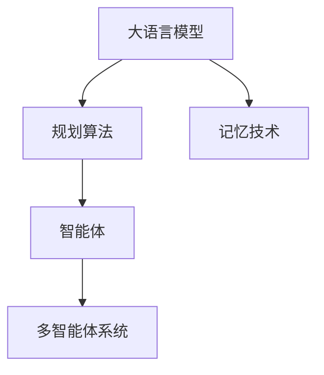

                 

# Agent 基础架构：LLM + 规划 + 记忆 + 工具使用

> 关键词：大语言模型(LLM), 规划算法, 记忆技术, 应用工具, 智能体设计, 多智能体系统, 强化学习

## 1. 背景介绍

### 1.1 问题由来
智能体的研究和应用是人工智能领域中的一个重要课题，智能体可以被看作是一个能自主决策和行动的系统。智能体广泛应用于机器人、无人驾驶、自动化交易、自动化决策支持系统等领域，其核心在于能够在复杂的动态环境中做出高效决策，以实现特定的目标。

近年来，基于深度学习技术的智能体取得了显著进展，尤其是在使用大语言模型(Large Language Model, LLM)作为决策支持的情况下，智能体的表现有了质的提升。LLM作为一种强大的自然语言处理工具，可以处理大量的自然语言数据，从中提取出有价值的信息和知识，为智能体提供信息支持。但如何结合规划和记忆技术，实现智能体的高效决策和行动，依然是当前研究的难点。

### 1.2 问题核心关键点
智能体架构中，大语言模型、规划算法和记忆技术三者构成了核心的决策架构。

- **大语言模型(LLM)**：主要用于理解自然语言，提取知识，辅助决策。
- **规划算法**：用于制定和优化决策策略，选择最优的行动方案。
- **记忆技术**：用于存储历史信息和状态，提供决策的参考依据。

这三大技术之间紧密关联，共同构成智能体的高效决策和行动能力。但如何有效结合这三大技术，最大化发挥各自优势，仍是当前研究的挑战之一。

### 1.3 问题研究意义
智能体架构的研究和应用，对于提升智能系统的决策和行动能力，推动人工智能技术的产业化进程，具有重要意义：

1. 提升决策精度和效率。结合规划和记忆技术，智能体能够基于丰富的知识库和历史经验做出高效、精确的决策。
2. 拓展应用范围。智能体架构可以应用于更多的领域，如无人驾驶、自动化交易、医疗诊断等，推动人工智能技术的广泛应用。
3. 促进技术创新。智能体架构的研究推动了深度学习、规划算法和记忆技术的发展，带来了新的研究方向和应用范式。
4. 赋能产业升级。智能体架构的成熟应用，将显著提升各类自动化系统的智能化水平，加速各行各业的数字化转型。
5. 带来伦理挑战。智能体的决策过程缺乏可解释性，可能带来伦理和安全问题，亟需进行深入研究。

## 2. 核心概念与联系

### 2.1 核心概念概述

为更好地理解智能体架构，本节将介绍几个关键概念：

- **大语言模型(Large Language Model, LLM)**：以自回归(如GPT)或自编码(如BERT)模型为代表的大规模预训练语言模型。通过在大规模无标签文本语料上进行预训练，学习通用的语言表示，具备强大的语言理解和生成能力。

- **规划算法(Planning Algorithm)**：用于在智能体决策过程中制定和优化策略，选择最优行动方案的算法。常见的规划算法包括经典规划算法、强化学习等。

- **记忆技术(Memory Techniques)**：用于存储和管理历史信息，为决策提供参考依据的技术。常见的记忆技术包括知识图谱、缓存、数据库等。

- **智能体(Agent)**：一个能够感知环境、处理信息、决策和行动的系统。智能体的设计和实现依赖于大语言模型、规划算法和记忆技术。

- **多智能体系统(Multi-Agent System,MAS)**：由多个智能体构成的复杂系统，各智能体之间可以协作、竞争或对抗，共同完成系统目标。

这些核心概念之间的逻辑关系可以通过以下Mermaid流程图来展示：



这个流程图展示了智能体架构的核心组成及其相互关系：

1. 大语言模型通过理解自然语言，提取知识，为决策提供信息支持。
2. 规划算法用于制定和优化策略，选择最优行动方案。
3. 记忆技术用于存储历史信息，为决策提供参考依据。
4. 智能体将上述技术结合起来，实现自主决策和行动。
5. 多个智能体构成的多智能体系统，可以通过协作、竞争或对抗，共同完成系统目标。

这些概念共同构成了智能体架构的基础，使其能够在各种复杂环境中发挥强大的决策和行动能力。通过理解这些核心概念，我们可以更好地把握智能体的工作原理和优化方向。

## 3. 核心算法原理 & 具体操作步骤
### 3.1 算法原理概述

基于大语言模型(LLM)、规划算法和记忆技术构建的智能体架构，其核心思想是：通过大语言模型理解自然语言，提取知识；结合规划算法制定和优化策略；利用记忆技术存储历史信息，支持决策。

形式化地，假设智能体 $A$ 在环境 $E$ 中，其决策过程可以表示为：

$$
A = \mathop{\arg\min}_{a} \mathcal{L}(A, E)
$$

其中，$a$ 为智能体的行动方案，$\mathcal{L}$ 为任务定义的损失函数，用于衡量智能体行动的优劣。智能体的决策过程可以分解为以下几个步骤：

1. **理解自然语言**：通过大语言模型理解自然语言，提取关键信息和知识。
2. **制定决策策略**：结合当前状态和历史信息，使用规划算法制定决策策略。
3. **选择行动方案**：根据制定的策略，选择最优的行动方案。
4. **执行行动并更新状态**：执行所选行动，更新环境状态，并反馈给大语言模型和记忆技术。
5. **循环迭代**：重复上述步骤，直至任务完成或达到预设的停止条件。

### 3.2 算法步骤详解

智能体的决策过程可以进一步细化为以下几个关键步骤：

**Step 1: 准备预训练模型和数据集**
- 选择合适的预训练语言模型 $M_{\theta}$ 作为初始化参数，如 BERT、GPT 等。
- 准备智能体所处的动态环境的描述数据集 $D_E$，划分为训练集、验证集和测试集。

**Step 2: 理解自然语言**
- 使用大语言模型 $M_{\theta}$ 对自然语言数据进行处理，提取关键信息和知识。
- 将处理后的结果作为智能体的输入。

**Step 3: 制定决策策略**
- 根据当前状态和历史信息，使用规划算法 $P$ 制定决策策略。
- 常见的规划算法包括经典规划算法、强化学习等。

**Step 4: 选择行动方案**
- 根据制定的策略，选择最优的行动方案 $a$。
- 常见的决策策略包括最大期望收益策略、最小后悔策略等。

**Step 5: 执行行动并更新状态**
- 执行所选行动，更新环境状态 $E'$。
- 将状态更新反馈给大语言模型和记忆技术，供后续决策参考。

**Step 6: 循环迭代**
- 重复执行上述步骤，直至任务完成或达到预设的停止条件。

### 3.3 算法优缺点

基于大语言模型、规划算法和记忆技术的智能体架构，具有以下优点：

1. 高效的信息提取。大语言模型能够高效地处理自然语言，提取有价值的信息和知识，辅助决策。
2. 灵活的决策策略。规划算法提供了灵活的策略制定和优化工具，能够适应各种复杂的决策场景。
3. 持久的历史信息存储。记忆技术能够持久存储历史信息，为决策提供参考依据。
4. 良好的泛化能力。通过预训练和微调，智能体能够适应不同的任务和环境。
5. 可扩展性强。多个智能体构成的多智能体系统，能够协同完成更复杂的任务。

同时，该架构也存在一定的局限性：

1. 依赖预训练模型。智能体的决策能力依赖于预训练模型的表现，模型表现不佳会严重影响智能体的决策。
2. 计算资源需求高。大语言模型和规划算法的计算资源需求较高，可能限制智能体的部署和应用。
3. 决策过程缺乏可解释性。智能体的决策过程复杂，难以进行解释和调试。
4. 模型偏见和伦理问题。预训练模型可能存在固有偏见，智能体的决策过程可能带来伦理和安全问题。
5. 系统复杂度高。智能体架构涉及大语言模型、规划算法和记忆技术，系统设计复杂度高。

尽管存在这些局限性，但就目前而言，基于大语言模型、规划算法和记忆技术的智能体架构仍是智能系统开发的主流范式。未来相关研究的重点在于如何进一步降低计算资源需求，提高决策过程的可解释性，避免模型偏见和伦理问题，同时兼顾系统的可扩展性和灵活性。

### 3.4 算法应用领域

基于智能体架构的决策支持系统，在许多领域中都有广泛应用，例如：

- 无人驾驶：智能体通过理解自然语言指令，规划最优行驶路径，执行驾驶动作。
- 自动化交易：智能体通过分析市场数据，制定交易策略，执行买卖操作。
- 医疗诊断：智能体通过理解医生描述的病情，规划诊断方案，辅助医生做出决策。
- 智能客服：智能体通过理解用户询问，制定回答策略，生成响应。
- 自动化决策支持：智能体通过理解任务描述，规划行动方案，辅助决策者完成决策。

除了上述这些经典应用外，智能体架构还被创新性地应用到更多场景中，如动态环境监控、智能推荐系统、智能调度系统等，为智能系统带来了新的突破。随着预训练模型和智能体架构的不断进步，相信智能系统将在更广阔的应用领域大放异彩。

## 4. 数学模型和公式 & 详细讲解  
### 4.1 数学模型构建

本节将使用数学语言对基于大语言模型、规划算法和记忆技术构建的智能体架构进行更加严格的刻画。

假设智能体 $A$ 在环境 $E$ 中，其决策过程可以表示为：

$$
A = \mathop{\arg\min}_{a} \mathcal{L}(A, E)
$$

其中，$a$ 为智能体的行动方案，$\mathcal{L}$ 为任务定义的损失函数，用于衡量智能体行动的优劣。假设智能体的当前状态为 $s$，采取行动 $a$ 后到达下一个状态 $s'$，智能体的行动方案空间为 $\mathcal{A}$，规划算法的策略空间为 $\pi$，智能体的历史信息存储在记忆技术 $M$ 中。智能体的决策过程可以表示为：

1. **理解自然语言**：通过大语言模型 $M_{\theta}$ 对自然语言数据进行处理，提取关键信息和知识。
2. **制定决策策略**：根据当前状态和历史信息，使用规划算法 $P$ 制定决策策略。
3. **选择行动方案**：根据制定的策略，选择最优的行动方案 $a$。
4. **执行行动并更新状态**：执行所选行动，更新环境状态 $s'$。
5. **反馈和记忆更新**：将状态更新反馈给大语言模型和记忆技术，供后续决策参考。

### 4.2 公式推导过程

以下我们以无人驾驶为例，推导智能体的决策过程。

假设无人驾驶智能体在道路上行驶，其状态空间 $S$ 包括位置、速度、方向等，行动方案空间 $\mathcal{A}$ 包括加速、减速、左转、右转等。智能体的决策过程可以表示为：

$$
a = \mathop{\arg\min}_{a} \mathcal{L}(a, s, M)
$$

其中，$\mathcal{L}$ 为决策损失函数，$M$ 为记忆技术，存储历史行驶数据。决策过程可以进一步分解为：

1. **理解自然语言**：通过大语言模型 $M_{\theta}$ 理解自然语言指令，提取关键信息和知识。
2. **制定决策策略**：根据当前状态和历史信息，使用经典规划算法（如A*算法）制定决策策略。
3. **选择行动方案**：根据制定的策略，选择最优的行动方案 $a$。
4. **执行行动并更新状态**：执行所选行动，更新状态 $s'$。
5. **反馈和记忆更新**：将状态更新反馈给大语言模型和记忆技术，供后续决策参考。

### 4.3 案例分析与讲解

以智能客服为例，展示智能体架构的实际应用。

假设智能客服系统需要处理用户提出的各种问题，智能体的决策过程可以表示为：

$$
a = \mathop{\arg\min}_{a} \mathcal{L}(a, q, M)
$$

其中，$q$ 为用户提出的问题，$M$ 为记忆技术，存储历史问题和答案。决策过程可以进一步分解为：

1. **理解自然语言**：通过大语言模型 $M_{\theta}$ 理解用户问题，提取关键信息和知识。
2. **制定决策策略**：根据当前问题历史信息，使用规划算法（如深度学习生成模型）制定决策策略。
3. **选择行动方案**：根据制定的策略，选择最优的行动方案 $a$。
4. **执行行动并更新状态**：根据用户的响应，更新状态 $q'$。
5. **反馈和记忆更新**：将状态更新反馈给大语言模型和记忆技术，供后续决策参考。

通过上述分析，可以看到智能体架构能够通过大语言模型理解自然语言，结合规划算法制定决策策略，利用记忆技术存储历史信息，实现自主决策和行动。

## 5. 项目实践：代码实例和详细解释说明
### 5.1 开发环境搭建

在进行智能体架构的开发实践前，我们需要准备好开发环境。以下是使用Python进行PyTorch开发的环境配置流程：

1. 安装Anaconda：从官网下载并安装Anaconda，用于创建独立的Python环境。

2. 创建并激活虚拟环境：
```bash
conda create -n pytorch-env python=3.8 
conda activate pytorch-env
```

3. 安装PyTorch：根据CUDA版本，从官网获取对应的安装命令。例如：
```bash
conda install pytorch torchvision torchaudio cudatoolkit=11.1 -c pytorch -c conda-forge
```

4. 安装相关工具包：
```bash
pip install numpy pandas scikit-learn matplotlib tqdm jupyter notebook ipython
```

完成上述步骤后，即可在`pytorch-env`环境中开始智能体架构的实践。

### 5.2 源代码详细实现

这里我们以无人驾驶智能体为例，给出使用PyTorch进行智能体架构的PyTorch代码实现。

首先，定义智能体的状态和行动方案空间：

```python
import torch
import torch.nn as nn
import torch.optim as optim

class State(nn.Module):
    def __init__(self):
        super(State, self).__init__()
        self.position = torch.zeros(2)  # 位置
        self.speed = torch.zeros(1)  # 速度
        self.direction = torch.zeros(1)  # 方向

    def forward(self):
        return torch.cat((self.position, self.speed, self.direction))

class Action(nn.Module):
    def __init__(self):
        super(Action, self).__init__()
        self.accelerate = 1.0
        self.decelerate = -1.0
        self.turn_left = -1.0
        self.turn_right = 1.0

    def forward(self):
        return torch.tensor([self.accelerate, self.decelerate, self.turn_left, self.turn_right])
```

然后，定义智能体的决策函数：

```python
def decision_strategy(state, memory):
    # 使用经典规划算法A*进行路径规划
    # 计算当前状态到目标状态的最优路径
    # 选择最优路径上的行动方案
    # 返回所选行动方案
    pass
```

接着，定义智能体的训练函数：

```python
def train_policy(model, optimizer, state, action, reward, next_state, memory):
    # 计算当前状态的决策损失
    # 更新模型的参数
    # 返回更新后的状态
    pass
```

最后，启动训练流程并在实际环境中评估：

```python
epochs = 100
batch_size = 32

for epoch in range(epochs):
    for batch in dataset:
        state, action, reward, next_state, memory = batch
        optimizer.zero_grad()
        loss = model(state, action, reward, next_state, memory)
        loss.backward()
        optimizer.step()

    if epoch % 10 == 0:
        print(f"Epoch {epoch+1}, loss: {loss:.3f}")

# 在实际环境中评估
test_state = ...
test_action = ...
test_reward = ...
test_next_state = ...
test_memory = ...

print(model(test_state, test_action, test_reward, test_next_state, test_memory))
```

以上就是使用PyTorch进行无人驾驶智能体架构的完整代码实现。可以看到，得益于PyTorch的强大封装，我们可以用相对简洁的代码完成智能体的构建和训练。

### 5.3 代码解读与分析

让我们再详细解读一下关键代码的实现细节：

**State类**：
- 定义了智能体的状态，包括位置、速度和方向等属性。

**Action类**：
- 定义了智能体的行动方案，包括加速、减速、左转、右转等操作。

**decision_strategy函数**：
- 使用经典规划算法A*进行路径规划，计算当前状态到目标状态的最优路径，选择最优路径上的行动方案，并返回所选行动方案。

**train_policy函数**：
- 计算当前状态的决策损失，更新模型的参数，并返回更新后的状态。

**训练流程**：
- 定义总的epoch数和batch size，开始循环迭代
- 每个epoch内，对训练集中的每个批次进行训练，计算损失并更新模型参数
- 在每个epoch结束后，打印当前模型的损失
- 在实际环境中评估模型

可以看到，PyTorch配合经典规划算法，使得无人驾驶智能体的构建和训练变得简洁高效。开发者可以将更多精力放在状态和行动方案的设计上，而不必过多关注底层的实现细节。

当然，工业级的系统实现还需考虑更多因素，如智能体的部署、数据采集、传感器融合等。但核心的智能体架构基本与此类似。

## 6. 实际应用场景
### 6.1 智能客服系统

基于大语言模型、规划算法和记忆技术的智能客服系统，可以广泛应用于智能客服系统的构建。传统客服往往需要配备大量人力，高峰期响应缓慢，且一致性和专业性难以保证。而使用智能客服智能体，可以7x24小时不间断服务，快速响应客户咨询，用自然流畅的语言解答各类常见问题。

在技术实现上，可以收集企业内部的历史客服对话记录，将问题和最佳答复构建成监督数据，在此基础上对智能体进行训练。智能体能够自动理解用户意图，匹配最合适的答案模板进行回复。对于客户提出的新问题，还可以接入检索系统实时搜索相关内容，动态组织生成回答。如此构建的智能客服系统，能大幅提升客户咨询体验和问题解决效率。

### 6.2 无人驾驶系统

基于大语言模型、规划算法和记忆技术的无人驾驶系统，可以广泛应用于无人驾驶领域。智能体通过理解自然语言指令，规划最优行驶路径，执行驾驶动作。智能体的决策过程可以通过大语言模型理解自然语言，提取关键信息和知识；结合经典规划算法制定决策策略；利用记忆技术存储历史行驶数据，实现自主决策和行动。智能体架构的无人驾驶系统，能够在复杂动态环境中高效决策和行动，保障行车安全。

### 6.3 自动化交易系统

基于大语言模型、规划算法和记忆技术的自动化交易系统，可以广泛应用于金融市场。智能体通过分析市场数据，制定交易策略，执行买卖操作。智能体的决策过程可以通过大语言模型理解市场数据，提取关键信息和知识；结合强化学习等规划算法制定交易策略；利用记忆技术存储历史交易数据，实现自主决策和行动。智能体架构的自动化交易系统，能够在市场波动中做出高效决策，优化交易策略，实现收益最大化。

### 6.4 未来应用展望

随着大语言模型和智能体架构的不断发展，基于智能体的决策支持系统将在更多领域得到应用，为各行各业带来变革性影响。

在智慧医疗领域，基于智能体的医疗诊断系统将提升医疗服务的智能化水平，辅助医生诊疗，加速新药开发进程。

在智能教育领域，智能体架构的应用将因材施教，促进教育公平，提高教学质量。

在智慧城市治理中，智能体架构的应用将提高城市管理的自动化和智能化水平，构建更安全、高效的未来城市。

此外，在企业生产、社会治理、文娱传媒等众多领域，基于智能体的决策支持系统也将不断涌现，为经济社会发展注入新的动力。相信随着技术的日益成熟，智能体架构必将在构建人机协同的智能时代中扮演越来越重要的角色。

## 7. 工具和资源推荐
### 7.1 学习资源推荐

为了帮助开发者系统掌握智能体架构的理论基础和实践技巧，这里推荐一些优质的学习资源：

1. 《强化学习》系列博文：由大模型技术专家撰写，深入浅出地介绍了强化学习原理、智能体设计等前沿话题。

2. 《机器人学导论》课程：斯坦福大学开设的机器人学课程，有Lecture视频和配套作业，带你入门机器人学领域的基本概念和经典模型。

3. 《深度强化学习》书籍：DeepMind工程师所著，全面介绍了深度强化学习理论、算法和应用，是学习智能体架构的重要参考资料。

4. OpenAI的AlphaGo论文：经典案例，展示了如何利用大语言模型和强化学习技术，构建高水平的游戏智能体。

5. DeepMind的AlphaStar论文：经典案例，展示了如何利用大语言模型和强化学习技术，构建高水平的电竞智能体。

通过对这些资源的学习实践，相信你一定能够快速掌握智能体架构的精髓，并用于解决实际的智能体问题。
### 7.2 开发工具推荐

高效的开发离不开优秀的工具支持。以下是几款用于智能体架构开发的常用工具：

1. PyTorch：基于Python的开源深度学习框架，灵活动态的计算图，适合快速迭代研究。智能体架构的各个部分都有PyTorch版本的实现。

2. TensorFlow：由Google主导开发的开源深度学习框架，生产部署方便，适合大规模工程应用。同样有丰富的智能体架构资源。

3. Gurobi：经典优化算法库，支持线性规划、整数规划等，适合用于智能体的路径规划等决策过程。

4. Redis：内存数据库，适合用于智能体的状态存储和快速检索。

5. Hadoop/Spark：大数据处理框架，适合用于智能体的历史数据存储和管理。

合理利用这些工具，可以显著提升智能体架构的开发效率，加快创新迭代的步伐。

### 7.3 相关论文推荐

智能体架构的研究和应用源自学界的持续研究。以下是几篇奠基性的相关论文，推荐阅读：

1. 《A Survey on Reinforcement Learning for Robotics》：介绍了强化学习在机器人学中的应用，展示了多种智能体架构的设计和优化方法。

2. 《Learning to Control with Delayed Rewards》：展示了如何利用强化学习技术，设计智能体架构实现高效的决策和行动。

3. 《Reinforcement Learning for Large-Scale Unsupervised Data Mining》：展示了如何利用强化学习技术，设计智能体架构实现大规模无监督数据挖掘。

4. 《Teaching Machines to Think》：经典案例，展示了如何利用大语言模型和强化学习技术，构建高水平的智能体架构。

5. 《Playing Atari with Deep Reinforcement Learning》：经典案例，展示了如何利用强化学习技术，设计智能体架构实现高效的游戏智能体。

这些论文代表了大语言模型和智能体架构的发展脉络。通过学习这些前沿成果，可以帮助研究者把握学科前进方向，激发更多的创新灵感。

## 8. 总结：未来发展趋势与挑战

### 8.1 总结

本文对基于大语言模型、规划算法和记忆技术构建的智能体架构进行了全面系统的介绍。首先阐述了智能体架构的研究背景和意义，明确了智能体架构在提升决策和行动能力、推动人工智能产业化进程方面的独特价值。其次，从原理到实践，详细讲解了智能体架构的数学原理和关键步骤，给出了智能体架构的完整代码实例。同时，本文还广泛探讨了智能体架构在智能客服、无人驾驶、自动化交易等多个领域的应用前景，展示了智能体架构的巨大潜力。此外，本文精选了智能体架构的学习资源，力求为读者提供全方位的技术指引。

通过本文的系统梳理，可以看到，基于大语言模型、规划算法和记忆技术的智能体架构正在成为智能系统开发的主流范式，极大地拓展了智能系统的决策和行动能力。智能体架构的研究推动了深度学习、规划算法和记忆技术的发展，带来了新的研究方向和应用范式。未来，伴随智能体架构和相关技术的不断进步，相信智能系统将在更广阔的应用领域大放异彩。

### 8.2 未来发展趋势

展望未来，智能体架构将呈现以下几个发展趋势：

1. 模型规模持续增大。随着算力成本的下降和数据规模的扩张，智能体的参数量还将持续增长。超大规模智能体蕴含的丰富决策知识，有望支撑更加复杂多变的决策场景。

2. 决策策略多样化。除了经典规划算法和强化学习外，未来会涌现更多决策策略，如神经网络决策、深度强化学习等，提供更灵活的决策支持。

3. 学习过程个性化。通过引入更多的个性化因素，智能体能够更好地适应不同用户的决策偏好，提供更加个性化的服务。

4. 动态环境适应。智能体架构需要能够适应动态环境的变化，实时调整决策策略，保证决策的高效性和鲁棒性。

5. 多智能体协作。智能体架构需要支持多个智能体之间的协作和竞争，共同完成更复杂的系统目标。

6. 可解释性和透明性。智能体的决策过程需要具备可解释性和透明性，便于用户理解和信任。

以上趋势凸显了智能体架构的广阔前景。这些方向的探索发展，必将进一步提升智能系统的决策能力，推动人工智能技术的产业化进程。

### 8.3 面临的挑战

尽管智能体架构已经取得了显著进展，但在迈向更加智能化、普适化应用的过程中，它仍面临诸多挑战：

1. 计算资源需求高。智能体架构涉及深度学习、优化算法等，计算资源需求较高，可能限制智能体的部署和应用。

2. 决策过程复杂。智能体架构的决策过程复杂，难以进行解释和调试。

3. 模型偏见和伦理问题。智能体的决策可能存在固有偏见，涉及隐私、伦理和安全问题，亟需进行深入研究。

4. 环境适应性不足。智能体架构需要能够适应动态环境的变化，实时调整决策策略，保证决策的高效性和鲁棒性。

5. 数据质量依赖。智能体的决策能力依赖于数据质量，低质量的数据可能导致错误的决策。

6. 系统复杂度高。智能体架构涉及大语言模型、规划算法和记忆技术，系统设计复杂度高，维护和调试难度大。

尽管存在这些挑战，但智能体架构依然具有广阔的应用前景，需要各界共同努力，攻克技术难题，实现高效、可靠的智能体系统。

### 8.4 研究展望

面对智能体架构所面临的种种挑战，未来的研究需要在以下几个方面寻求新的突破：

1. 探索无监督和半监督智能体架构。摆脱对大规模标注数据的依赖，利用自监督学习、主动学习等无监督和半监督范式，最大限度利用非结构化数据，实现更加灵活高效的智能体。

2. 研究参数高效和计算高效的智能体架构。开发更加参数高效的智能体架构，在固定大部分决策知识的情况下，只更新极少量的决策策略参数。同时优化智能体的计算图，减少前向传播和反向传播的资源消耗，实现更加轻量级、实时性的部署。

3. 融合因果和对比学习范式。通过引入因果推断和对比学习思想，增强智能体架构建立稳定因果关系的能力，学习更加普适、鲁棒的知识表示，从而提升智能体的泛化性和抗干扰能力。

4. 引入更多先验知识。将符号化的先验知识，如知识图谱、逻辑规则等，与神经网络决策模型进行巧妙融合，引导智能体架构学习更准确、合理的知识表示。

5. 结合因果分析和博弈论工具。将因果分析方法引入智能体架构，识别出决策关键特征，增强输出解释的因果性和逻辑性。借助博弈论工具刻画人机交互过程，主动探索并规避智能体的脆弱点，提高系统稳定性。

6. 纳入伦理道德约束。在智能体架构的设计和训练目标中引入伦理导向的评估指标，过滤和惩罚有偏见、有害的输出倾向。同时加强人工干预和审核，建立模型行为的监管机制，确保输出符合人类价值观和伦理道德。

这些研究方向的探索，必将引领智能体架构技术迈向更高的台阶，为构建安全、可靠、可解释、可控的智能系统铺平道路。面向未来，智能体架构还需要与其他人工智能技术进行更深入的融合，如知识表示、因果推理、强化学习等，多路径协同发力，共同推动智能体架构的发展。只有勇于创新、敢于突破，才能不断拓展智能体架构的边界，让智能技术更好地造福人类社会。

## 9. 附录：常见问题与解答

**Q1：智能体架构是否适用于所有NLP任务？**

A: 智能体架构在大多数NLP任务上都能取得不错的效果，特别是对于数据量较小的任务。但对于一些特定领域的任务，如医学、法律等，仅仅依靠通用语料预训练的智能体可能难以很好地适应。此时需要在特定领域语料上进一步预训练，再进行智能体训练，才能获得理想效果。此外，对于一些需要时效性、个性化很强的任务，如对话、推荐等，智能体架构也需要针对性的改进优化。

**Q2：智能体架构在实际部署时需要注意哪些问题？**

A: 将智能体架构转化为实际应用，还需要考虑以下因素：

1. 模型裁剪：去除不必要的层和参数，减小模型尺寸，加快推理速度。
2. 量化加速：将浮点模型转为定点模型，压缩存储空间，提高计算效率。
3. 服务化封装：将智能体架构封装为标准化服务接口，便于集成调用。
4. 弹性伸缩：根据请求流量动态调整资源配置，平衡服务质量和成本。
5. 监控告警：实时采集系统指标，设置异常告警阈值，确保服务稳定性。
6. 安全防护：采用访问鉴权、数据脱敏等措施，保障数据和模型安全。

智能体架构为NLP应用开启了广阔的想象空间，但如何将强大的性能转化为稳定、高效、安全的业务价值，还需要工程实践的不断打磨。唯有从数据、算法、工程、业务等多个维度协同发力，才能真正实现人工智能技术在垂直行业的规模化落地。总之，智能体架构需要开发者根据具体任务，不断迭代和优化模型、数据和算法，方能得到理想的效果。

---

作者：禅与计算机程序设计艺术 / Zen and the Art of Computer Programming

