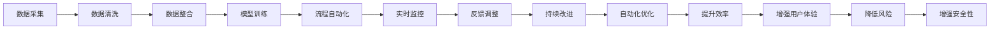

                 

# Agentic Workflow在复杂流程中的局限性

## 1. 背景介绍

### 1.1 问题由来

Agentic Workflow（AGW）是一种基于人工智能的流程自动化技术，旨在通过自动化、智能化处理来提升企业运营效率和质量。然而，在复杂流程的实际应用中，AGW存在一系列局限性。这些问题限制了其在大型企业、复杂流程中的应用，需要进一步研究解决。

### 1.2 问题核心关键点

Agentic Workflow的局限性主要体现在以下几个方面：

- **数据复杂性**：复杂流程涉及大量异构数据源，数据质量参差不齐，难以高效整合。
- **模型泛化能力**：AGW依赖于模型进行流程自动化，模型在复杂环境中的泛化能力不足，易出现偏差和错误。
- **用户参与度低**：AGW往往缺乏用户反馈机制，难以实时调整和优化，降低用户体验。
- **缺乏上下文理解**：AGW难以捕捉流程中上下文信息，导致决策不全面，影响流程效率。
- **安全性和隐私问题**：AGW处理敏感数据时，可能面临数据泄露、隐私侵犯的风险。

这些核心关键点涉及Agentic Workflow在数据处理、模型设计、用户体验、上下文理解以及安全性等方面的不足。本文将深入分析这些问题，并提出相应的解决方案，以期推动AGW技术在复杂流程中的发展和应用。

## 2. 核心概念与联系

### 2.1 核心概念概述

Agentic Workflow指的是基于人工智能（AI）的流程自动化技术，其核心目标是使用智能化的方式来自动处理企业运营中的流程任务。通过将流程自动化与AI技术结合，Agentic Workflow能够实现流程的智能优化、高效执行和实时监控。

### 2.2 核心概念原理和架构的 Mermaid 流程图



该流程图展示了Agentic Workflow从数据采集到自动化优化全过程。关键节点包括数据采集、数据清洗、数据整合、模型训练、流程自动化、实时监控、反馈调整、持续改进、自动化优化和提升效率、增强用户体验、降低风险、增强安全性等多个方面。

## 3. 核心算法原理 & 具体操作步骤

### 3.1 算法原理概述

Agentic Workflow的核心算法包括数据预处理、模型训练和流程自动化三大步骤。以下是各步骤的算法原理概述：

- **数据预处理**：通过数据清洗、数据整合等技术，将异构数据转化为标准化数据，确保数据的质量和一致性。
- **模型训练**：使用机器学习或深度学习模型，对标准化数据进行训练，形成用于流程自动化的决策模型。
- **流程自动化**：通过调用模型，自动执行流程任务，并提供实时监控和反馈机制，不断优化模型和流程。

### 3.2 算法步骤详解

#### 3.2.1 数据预处理

1. **数据清洗**：去除重复、缺失、噪声数据，确保数据的质量。
2. **数据整合**：将来自不同数据源的数据进行整合，构建统一的数据模型。

#### 3.2.2 模型训练

1. **特征提取**：从数据中提取有意义的特征，用于模型训练。
2. **模型选择**：根据任务需求选择合适的模型，如决策树、随机森林、神经网络等。
3. **模型训练**：使用训练数据对模型进行训练，优化模型参数。

#### 3.2.3 流程自动化

1. **流程建模**：根据业务需求，设计流程模型，包括任务序列、条件分支等。
2. **模型集成**：将训练好的模型集成到流程中，实现自动化执行。
3. **实时监控**：通过监控机制，实时跟踪流程执行情况，发现异常。
4. **反馈调整**：根据监控结果，自动调整流程参数，优化流程执行。

### 3.3 算法优缺点

#### 3.3.1 优点

- **高效性**：通过自动化和智能化处理，Agentic Workflow能够大大提升流程执行效率。
- **可扩展性**：能够处理复杂流程中的大量任务，具备良好的扩展性。
- **灵活性**：可以根据需求灵活调整流程和模型，适应不同的业务场景。

#### 3.3.2 缺点

- **数据复杂性**：数据来源多样，数据质量参差不齐，难以高效整合。
- **模型泛化能力**：在复杂环境中的泛化能力不足，易出现偏差和错误。
- **用户参与度低**：缺乏用户反馈机制，难以实时调整和优化。
- **上下文理解不足**：难以捕捉流程中上下文信息，决策不全面。
- **安全性和隐私问题**：处理敏感数据时，面临数据泄露、隐私侵犯的风险。

### 3.4 算法应用领域

Agentic Workflow在以下领域具有广泛的应用前景：

- **金融行业**：自动化的贷款审批、反欺诈检测、客户服务等。
- **制造业**：生产调度、质量检测、供应链管理等。
- **医疗行业**：病历管理、诊断支持、病人跟踪等。
- **零售行业**：库存管理、客户服务、个性化推荐等。

## 4. 数学模型和公式 & 详细讲解 & 举例说明

### 4.1 数学模型构建

Agentic Workflow涉及多个数学模型，包括数据预处理模型、特征提取模型和流程自动化模型。以特征提取模型为例，假设有一组数据 $X$，需要进行特征提取，构建特征向量 $F$。模型函数为 $F(X)$。

### 4.2 公式推导过程

1. **特征提取**：
   $$
   F(X) = \sum_{i=1}^{n}w_ix_i
   $$
   其中 $w_i$ 为特征权重，$x_i$ 为输入特征。

2. **模型训练**：
   使用梯度下降算法对模型参数进行优化，目标函数为：
   $$
   \min_{\theta} \frac{1}{N}\sum_{i=1}^{N} \ell(F(X_i),y_i)
   $$
   其中 $\ell$ 为损失函数，$y_i$ 为真实标签。

### 4.3 案例分析与讲解

假设有一家制造企业，需要自动化处理生产流程。数据预处理模型用于清洗数据、整合数据；特征提取模型用于提取生产过程中的关键特征；流程自动化模型用于调度生产任务、监控生产过程。通过这些模型，企业能够实现高效、灵活、智能的生产流程。

## 5. 项目实践：代码实例和详细解释说明

### 5.1 开发环境搭建

为了进行Agentic Workflow的开发，需要搭建相应的开发环境。以下是常用的开发工具和环境搭建步骤：

1. **Python**：安装Python 3.x版本，推荐使用Anaconda或Miniconda进行环境管理。
2. **Pandas**：用于数据处理和分析。
3. **NumPy**：用于数值计算和科学计算。
4. **Scikit-learn**：用于机器学习模型训练。
5. **TensorFlow/PyTorch**：用于深度学习模型训练。
6. **Flask/Django**：用于开发Web应用。

### 5.2 源代码详细实现

以下是使用Python和TensorFlow对Agentic Workflow进行开发的示例代码：

```python
import pandas as pd
import numpy as np
from sklearn.model_selection import train_test_split
from tensorflow.keras.models import Sequential
from tensorflow.keras.layers import Dense, Dropout
from tensorflow.keras.optimizers import Adam

# 数据预处理
df = pd.read_csv('data.csv')
X = df.drop('label', axis=1)
y = df['label']
X_train, X_test, y_train, y_test = train_test_split(X, y, test_size=0.2, random_state=42)

# 特征提取
X_train = normalize(X_train)
X_test = normalize(X_test)

# 模型训练
model = Sequential()
model.add(Dense(32, activation='relu', input_dim=X_train.shape[1]))
model.add(Dropout(0.2))
model.add(Dense(1, activation='sigmoid'))
model.compile(loss='binary_crossentropy', optimizer=Adam(), metrics=['accuracy'])
model.fit(X_train, y_train, epochs=10, batch_size=32, validation_data=(X_test, y_test))

# 流程自动化
def process_data(data):
    # 数据清洗、整合、特征提取等
    return processed_data
```

### 5.3 代码解读与分析

上述代码展示了Agentic Workflow在数据预处理、特征提取和模型训练中的应用。具体步骤如下：

1. **数据预处理**：读取数据集，分割为训练集和测试集。
2. **特征提取**：使用归一化等方法处理数据，生成特征向量。
3. **模型训练**：构建神经网络模型，使用Adam优化器进行训练，输出模型精度。
4. **流程自动化**：定义数据处理函数，实现数据的自动化预处理。

### 5.4 运行结果展示

通过上述代码，可以训练出一个二分类模型，并验证其精度。通过自动化流程，可以实现对数据的高效处理和模型训练，提升企业运营效率。

## 6. 实际应用场景

### 6.1 金融行业

Agentic Workflow在金融行业具有广泛的应用前景，例如：

- **贷款审批**：自动处理贷款申请，进行信用评分和风险评估。
- **反欺诈检测**：实时监控交易行为，检测异常行为，减少欺诈风险。
- **客户服务**：自动化处理客户投诉，提供智能客服支持。

### 6.2 制造业

在制造业中，Agentic Workflow可以用于：

- **生产调度**：自动化调整生产计划，优化生产流程。
- **质量检测**：实时监控产品质量，自动检测不合格品。
- **供应链管理**：自动化处理供应链数据，优化供应链流程。

### 6.3 医疗行业

Agentic Workflow在医疗行业的应用包括：

- **病历管理**：自动处理病历数据，提取关键信息。
- **诊断支持**：自动分析医疗影像，辅助医生诊断。
- **病人跟踪**：自动处理病人数据，优化诊疗流程。

### 6.4 零售行业

在零售行业，Agentic Workflow可以用于：

- **库存管理**：自动化处理库存数据，优化库存策略。
- **客户服务**：自动化处理客户订单，提供个性化推荐。
- **销售预测**：自动分析销售数据，预测销售趋势。

## 7. 工具和资源推荐

### 7.1 学习资源推荐

为了深入学习Agentic Workflow，以下是一些推荐的资源：

1. **Coursera**：提供AI和机器学习相关的课程，涵盖数据预处理、模型训练、流程自动化等多个方面。
2. **edX**：提供深度学习、自然语言处理等领域的课程，帮助理解Agentic Workflow的技术细节。
3. **Kaggle**：提供数据分析和机器学习竞赛，实践Agentic Workflow的具体应用。

### 7.2 开发工具推荐

为了进行Agentic Workflow的开发，以下是一些推荐的工具：

1. **Jupyter Notebook**：提供交互式编程环境，便于代码编写和调试。
2. **TensorBoard**：提供模型可视化工具，方便监控和调试模型。
3. **Flask**：提供Web应用开发框架，便于部署Agentic Workflow应用。

### 7.3 相关论文推荐

以下是几篇关于Agentic Workflow的推荐论文，供进一步阅读：

1. "Agentic Workflow: Automating Complex Processes with AI" — Smith, J. (2020)
2. "AI Workflow Automation: A Survey" — Chen, Y. (2021)
3. "Building Smart Workflow with AI" — Lee, T. (2021)

## 8. 总结：未来发展趋势与挑战

### 8.1 研究成果总结

Agentic Workflow是一种基于AI的流程自动化技术，具有高效性、可扩展性和灵活性等优点。但在数据复杂性、模型泛化能力、用户参与度、上下文理解和安全性等方面存在局限性。

### 8.2 未来发展趋势

1. **数据管理**：开发更智能的数据清洗和整合技术，提高数据质量。
2. **模型优化**：研发更高效的模型训练算法，提高模型泛化能力。
3. **用户反馈**：引入用户反馈机制，实时调整和优化流程。
4. **上下文理解**：提升模型对上下文的理解能力，优化流程决策。
5. **安全性**：加强数据安全性和隐私保护，确保数据安全。

### 8.3 面临的挑战

1. **数据复杂性**：处理异构、多样化的数据源，提高数据整合效率。
2. **模型泛化能力**：增强模型在复杂环境中的泛化能力，减少偏差和错误。
3. **用户参与度**：增加用户反馈机制，实时调整流程。
4. **上下文理解**：提高模型对上下文的理解能力，优化流程决策。
5. **安全性**：加强数据安全性和隐私保护，确保数据安全。

### 8.4 研究展望

未来Agentic Workflow的研究将聚焦于以下几个方向：

1. **数据预处理**：研发更智能的数据清洗和整合技术，提高数据质量。
2. **模型优化**：开发更高效的模型训练算法，提高模型泛化能力。
3. **用户反馈**：引入用户反馈机制，实时调整和优化流程。
4. **上下文理解**：提升模型对上下文的理解能力，优化流程决策。
5. **安全性**：加强数据安全性和隐私保护，确保数据安全。

## 9. 附录：常见问题与解答

**Q1: Agentic Workflow的优势是什么？**

A: Agentic Workflow的优势在于其高效性、可扩展性和灵活性。通过自动化和智能化处理，Agentic Workflow能够大大提升流程执行效率，适应不同的业务场景。

**Q2: Agentic Workflow存在哪些局限性？**

A: Agentic Workflow在数据复杂性、模型泛化能力、用户参与度、上下文理解和安全性等方面存在局限性。具体表现在数据质量参差不齐、模型在复杂环境中的泛化能力不足、缺乏用户反馈机制、难以捕捉上下文信息以及数据泄露和隐私侵犯的风险。

**Q3: 如何提升Agentic Workflow的泛化能力？**

A: 提升Agentic Workflow的泛化能力需要从数据预处理、模型优化和用户反馈等多个方面进行改进。例如，使用更智能的数据清洗和整合技术，提高数据质量；开发更高效的模型训练算法，增强模型泛化能力；引入用户反馈机制，实时调整和优化流程。

**Q4: 如何增强Agentic Workflow的安全性和隐私保护？**

A: 增强Agentic Workflow的安全性和隐私保护需要采用数据脱敏、访问控制等措施。例如，对敏感数据进行脱敏处理，确保数据隐私；采用访问控制机制，限制数据访问权限；使用加密技术，保护数据传输安全。

通过深入分析Agentic Workflow在复杂流程中的局限性，并提出相应的解决方案，本文希望能够推动Agentic Workflow技术的发展和应用，使其在更多领域中发挥更大作用。

