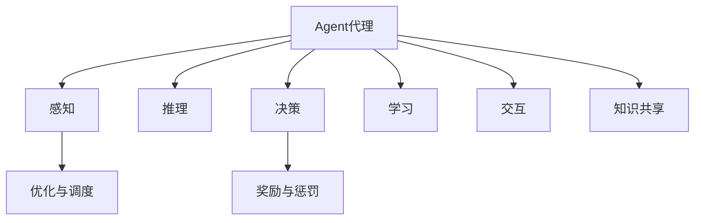

                 

# Agent代理在AI系统中的实战经验

## 1. 背景介绍

### 1.1 问题由来
随着人工智能技术的飞速发展，Agent代理（智能体）在AI系统中扮演着越来越重要的角色。在自动化控制、机器人导航、人机交互、智能推荐等领域，Agent代理不仅需要具备自主决策能力，还要能够实现多智能体协同、知识共享与优化。这些特性要求Agent代理在逻辑推理、任务规划、动作执行等方面具备较高的智能水平。

### 1.2 问题核心关键点
Agent代理的核心问题在于如何设计一个能够在复杂环境中自主决策、执行任务的智能体。这包括：
- **自主感知**：代理需要能够通过传感器或数据获取环境信息。
- **自主推理**：代理需要具备逻辑推理能力，能够从感知信息中提取有用的知识。
- **自主决策**：代理需要根据当前状态和目标，选择最优的动作或策略。
- **自主学习**：代理需要能够通过经验学习优化自身决策。
- **自主交互**：代理需要能够与人类或其他智能体进行自然交互。

### 1.3 问题研究意义
Agent代理的研究不仅能够推动人工智能技术的进步，还能够应用于更广泛的实际场景中，提高生产效率，降低人力成本，提升用户体验。具体来说，研究Agent代理的意义包括：

1. **自动化控制**：在制造业、交通运输等领域，Agent代理可以实现自动化控制，提升生产效率和安全性。
2. **机器人导航**：在无人驾驶、智能家居等领域，Agent代理可以实现自主导航和避障，增强机器人操作的智能化水平。
3. **智能推荐**：在电子商务、内容推荐等领域，Agent代理可以基于用户行为和偏好，提供个性化推荐服务，提升用户体验。
4. **智能交互**：在客服、教育等领域，Agent代理可以实现自然语言理解和生成，提升人机交互的自然性和友好性。
5. **分布式协同**：在物联网、云计算等领域，Agent代理可以实现多智能体协同，优化资源分配，提高系统性能。

## 2. 核心概念与联系

### 2.1 核心概念概述

为更好地理解Agent代理在AI系统中的实战经验，本节将介绍几个密切相关的核心概念：

- **Agent代理**：具备自主感知、推理、决策、学习、交互能力的智能体，能够在复杂环境中执行任务。
- **多智能体系统(MAS)**：由多个Agent代理组成的系统，各Agent代理间可以进行通信和协作，共同完成复杂任务。
- **知识共享**：Agent代理之间可以通过知识库、消息传递等方式共享信息，增强系统的智能水平。
- **优化与调度**：通过优化算法和调度策略，Agent代理可以协调资源，提高系统的整体性能。
- **奖励与惩罚**：通过设计合理的奖励和惩罚机制，Agent代理可以学习最优行为策略。

这些核心概念之间的逻辑关系可以通过以下Mermaid流程图来展示：



这个流程图展示了一致性Agent代理的工作原理和关键组件：

1. 感知模块负责获取环境信息。
2. 推理模块进行逻辑分析和决策。
3. 决策模块选择合适的动作或策略。
4. 学习模块通过经验更新自身行为。
5. 交互模块实现与环境和其他Agent的互动。
6. 知识共享模块通过多Agent协同增强智能水平。
7. 优化与调度模块协调资源优化系统。
8. 奖励与惩罚模块引导Agent学习最优行为。

这些模块共同构成了Agent代理的核心系统结构，使其能够在各种场景下执行复杂任务。

## 3. 核心算法原理 & 具体操作步骤
### 3.1 算法原理概述

Agent代理的核心算法原理主要包括以下几个方面：

1. **感知模块**：通常使用传感器或数据获取模块，负责感知环境信息。
2. **推理模块**：使用符号逻辑推理或神经网络模型，从感知数据中提取有用的知识。
3. **决策模块**：使用决策树、强化学习等方法，根据当前状态和目标，选择最优的动作或策略。
4. **学习模块**：使用监督学习、无监督学习、强化学习等方法，通过经验更新自身行为。
5. **交互模块**：使用自然语言处理、图像识别等技术，实现与环境和其他Agent的自然交互。

这些模块的工作原理和算法模型将会在接下来的内容中详细讲解。

### 3.2 算法步骤详解

Agent代理的实现通常遵循以下步骤：

**Step 1: 环境建模**
- 设计环境的数学模型和仿真环境，定义状态空间、动作空间、奖励函数等。

**Step 2: 设计Agent代理**
- 选择适当的模型，如决策树、深度神经网络、强化学习等，设计Agent代理的感知、推理、决策、学习、交互模块。

**Step 3: 训练和优化**
- 使用监督学习、无监督学习、强化学习等方法训练Agent代理，通过优化算法（如梯度下降、遗传算法等）不断优化模型参数。

**Step 4: 多Agent协同**
- 设计多Agent协同的机制，如分布式优化算法、通信协议、知识共享等，实现多Agent之间的协作。

**Step 5: 部署和测试**
- 将训练好的Agent代理部署到实际环境中，进行测试和验证，优化其性能和稳定性。

### 3.3 算法优缺点

Agent代理的设计和实现具有以下优点：

1. **自主性**：Agent代理具备自主感知、推理、决策、学习、交互能力，能够独立执行任务。
2. **灵活性**：Agent代理可以通过多种算法实现，适应不同的任务和环境。
3. **可扩展性**：Agent代理可以扩展到多个Agent组成的多智能体系统中，实现更复杂的任务。
4. **鲁棒性**：Agent代理可以处理噪声和不确定性，具备一定的鲁棒性。

同时，Agent代理也存在以下缺点：

1. **复杂性**：Agent代理的设计和实现较为复杂，需要考虑多个模块的协同工作。
2. **计算资源需求高**：Agent代理的训练和推理需要大量的计算资源，对硬件要求较高。
3. **数据需求大**：Agent代理的训练和优化需要大量的标注数据，数据获取成本较高。
4. **知识转移困难**：Agent代理之间的知识共享和转移较为困难，需要精心设计。

### 3.4 算法应用领域

Agent代理在多个领域得到了广泛应用，具体包括：

1. **自动化控制**：在制造业、交通运输等领域，Agent代理可以实现自动化控制，提升生产效率和安全性。
2. **机器人导航**：在无人驾驶、智能家居等领域，Agent代理可以实现自主导航和避障，增强机器人操作的智能化水平。
3. **智能推荐**：在电子商务、内容推荐等领域，Agent代理可以基于用户行为和偏好，提供个性化推荐服务，提升用户体验。
4. **智能交互**：在客服、教育等领域，Agent代理可以实现自然语言理解和生成，提升人机交互的自然性和友好性。
5. **分布式协同**：在物联网、云计算等领域，Agent代理可以实现多智能体协同，优化资源分配，提高系统性能。

## 4. 数学模型和公式 & 详细讲解  
### 4.1 数学模型构建

本节将使用数学语言对Agent代理的系统进行更加严格的刻画。

假设环境的状态空间为 $S$，动作空间为 $A$，奖励函数为 $R: S \times A \rightarrow [0,1]$，Agent代理的感知模块能够获取状态 $s_t \in S$，推理模块输出动作 $a_t \in A$，学习模块通过经验更新策略 $\pi$。则Agent代理的系统模型可以表示为：

$$
s_{t+1} = f(s_t, a_t, e_t)
$$

其中 $f$ 为状态转移函数，$e_t$ 为环境噪声。

Agent代理的优化目标是最小化期望总奖励，即：

$$
\min_\pi \mathbb{E}[\sum_{t=0}^\infty \gamma^t R(s_t, a_t)]
$$

其中 $\gamma$ 为折扣因子，$\pi$ 为策略函数。

### 4.2 公式推导过程

以下我们以强化学习为例，推导Agent代理的优化目标函数及其梯度计算公式。

假设Agent代理在状态 $s_t$ 下采取动作 $a_t$，根据当前策略 $\pi$ 和状态转移函数 $f$，进入下一个状态 $s_{t+1}$，并获取奖励 $r_{t+1}$。则强化学习的目标是最小化未来奖励的期望，即：

$$
\mathcal{L}(\pi) = -\mathbb{E}[\sum_{t=0}^\infty \gamma^t r_{t+1}]
$$

其中 $r_{t+1}$ 为下一个状态的奖励。

强化学习采用梯度下降等优化算法，通过反向传播计算梯度，更新策略函数 $\pi$。具体梯度计算公式为：

$$
\nabla_{\pi} \mathcal{L}(\pi) = \mathbb{E}[\sum_{t=0}^\infty \gamma^t \nabla_\pi \log \pi(a_t|s_t) R(s_t, a_t)]
$$

其中 $\nabla_\pi \log \pi(a_t|s_t)$ 为动作概率对策略函数的导数，$R(s_t, a_t)$ 为动作-状态奖励。

在得到梯度后，即可带入优化算法，完成Agent代理的训练和优化。

## 5. 项目实践：代码实例和详细解释说明
### 5.1 开发环境搭建

在进行Agent代理的开发前，我们需要准备好开发环境。以下是使用Python进行OpenAI Gym进行Agent代理实验的环境配置流程：

1. 安装Python：从官网下载并安装Python，建议选择3.7及以上版本。
2. 安装Gym：使用pip安装OpenAI Gym库。
```bash
pip install gym
```

3. 安装PyTorch：使用pip安装PyTorch库。
```bash
pip install torch
```

4. 安装其他依赖：根据需要安装其他必要的Python库和工具。

完成上述步骤后，即可在Python环境中进行Agent代理的开发。

### 5.2 源代码详细实现

下面我们以Q-Learning算法为例，给出使用PyTorch实现Agent代理在Gym环境中的代码实现。

首先，定义Gym环境：

```python
import gym

env = gym.make('CartPole-v1')
```

然后，定义Agent代理的感知、推理、决策、学习、交互模块：

```python
import torch
import torch.nn as nn
import torch.optim as optim
import numpy as np

class QNetwork(nn.Module):
    def __init__(self, input_dim, output_dim):
        super(QNetwork, self).__init__()
        self.fc1 = nn.Linear(input_dim, 32)
        self.fc2 = nn.Linear(32, output_dim)
    
    def forward(self, x):
        x = self.fc1(x)
        x = nn.functional.relu(x)
        x = self.fc2(x)
        return x

class Agent:
    def __init__(self, env, input_dim, output_dim, learning_rate=0.001, gamma=0.9, epsilon=0.1, epsilon_min=0.01, epsilon_decay=0.99):
        self.env = env
        self.input_dim = input_dim
        self.output_dim = output_dim
        self.learning_rate = learning_rate
        self.gamma = gamma
        self.epsilon = epsilon
        self.epsilon_min = epsilon_min
        self.epsilon_decay = epsilon_decay
        self.q_network = QNetwork(input_dim, output_dim)
        self.optimizer = optim.Adam(self.q_network.parameters(), lr=learning_rate)
    
    def act(self, state):
        if np.random.uniform() < self.epsilon:
            return self.env.action_space.sample()
        else:
            with torch.no_grad():
                state = torch.from_numpy(state).float()
                q_values = self.q_network(state)
                return torch.argmax(q_values).item()
    
    def train(self, episodes=1000):
        for episode in range(episodes):
            state = self.env.reset()
            state = np.reshape(state, [1, -1])
            total_reward = 0
            for t in range(100):
                action = self.act(state)
                next_state, reward, done, _ = self.env.step(action)
                next_state = np.reshape(next_state, [1, -1])
                q_next = self.q_network(next_state)
                q_values = self.q_network(state)
                q_values[0, action] = reward + self.gamma * torch.max(q_next)
                self.optimizer.zero_grad()
                q_values[0, action].backward()
                self.optimizer.step()
                state = next_state
                if done:
                    break
                total_reward += reward
            print("Episode:", episode+1, "Total reward:", total_reward)
            self.epsilon *= self.epsilon_decay
            self.epsilon = max(self.epsilon_min, self.epsilon)
```

最后，启动训练流程：

```python
agent = Agent(env, input_dim, output_dim)
agent.train()
```

以上就是使用PyTorch实现Q-Learning算法的Agent代理在Gym环境中的完整代码实现。可以看到，PyTorch提供的高效自动微分功能使得实现Agent代理的感知、推理、决策、学习、交互模块变得相对简单。

### 5.3 代码解读与分析

让我们再详细解读一下关键代码的实现细节：

**Gym环境**：
- 使用Gym库创建Gym环境，选择CartPole-v1作为示例，该环境模拟了一辆小车在倒立状态下保持平衡的任务。

**QNetwork类**：
- 定义Q网络，包含两个全连接层，用于计算动作-状态的价值函数。

**Agent类**：
- 定义Agent代理，包含感知、推理、决策、学习、交互模块。
- 感知模块获取当前状态，推理模块计算Q值，决策模块选择动作，学习模块通过Q-learning更新策略函数，交互模块与环境交互。
- 训练模块通过循环迭代，逐步优化Agent代理的策略函数。

**Q-Learning算法**：
- 在每个时间步中，根据当前状态和策略函数选择动作，并根据当前状态和下一个状态计算Q值。
- 使用优化器Adam更新策略函数，最小化未来奖励的期望。
- 通过 epsilon-greedy 策略平衡探索和利用，逐渐减少探索的概率，优化策略函数。

通过以上代码实现，Agent代理在Gym环境中的Q-Learning算法训练流程清晰呈现。PyTorch的高效计算能力和模块化设计使得实现Agent代理变得相对简单和直观。

## 6. 实际应用场景
### 6.1 智能交通系统

Agent代理在智能交通系统中可以用于优化交通信号控制和路线规划。通过收集交通流量、路况、天气等数据，Agent代理可以实时感知交通环境，并根据交通规则和目标优化信号灯控制和路线规划，提升交通效率，减少拥堵和事故。

### 6.2 智能电网

Agent代理可以用于智能电网的能源分配和管理。通过实时感知电力需求和供应情况，Agent代理可以自动调整发电、输电和用电策略，实现能源的高效利用和负荷平衡，提升电网的稳定性和可靠性。

### 6.3 智能制造

Agent代理在智能制造中可以用于优化生产流程和资源分配。通过实时感知生产设备状态、物料库存、订单需求等数据，Agent代理可以自动调整生产计划、调整设备使用和物料分配，实现生产流程的自动化和智能化，提升生产效率和质量。

### 6.4 金融交易

Agent代理可以用于金融交易中的自动交易和风险控制。通过实时感知市场数据和交易信号，Agent代理可以自动进行交易策略调整，控制交易风险，实现资产的保值增值。

### 6.5 医疗诊断

Agent代理可以用于医疗诊断中的疾病预测和治疗方案推荐。通过实时感知患者的病情和病历数据，Agent代理可以自动分析病情，推荐合适的治疗方案，提升诊断准确性和治疗效果。

### 6.6 个性化推荐

Agent代理可以用于个性化推荐系统中的推荐策略优化。通过实时感知用户行为和偏好，Agent代理可以自动调整推荐算法，推荐更符合用户兴趣的内容，提升用户体验。

### 6.7 智能客服

Agent代理可以用于智能客服系统中的自然语言理解和对话生成。通过实时感知用户问题和上下文，Agent代理可以自动生成合适的回复，提升客户满意度。

## 7. 工具和资源推荐
### 7.1 学习资源推荐

为了帮助开发者系统掌握Agent代理的理论基础和实践技巧，这里推荐一些优质的学习资源：

1. 《强化学习：原理与实践》系列博文：由大模型技术专家撰写，深入浅出地介绍了强化学习的基本原理和实际应用。

2. CS181《强化学习》课程：斯坦福大学开设的强化学习明星课程，有Lecture视频和配套作业，带你入门强化学习领域的基本概念和经典模型。

3. 《深度强化学习》书籍：Sutton和Barto合著的经典教材，全面介绍了强化学习的基本原理和实用技术。

4. Gym官方文档：OpenAI Gym的官方文档，提供了丰富的环境和算法样例，是上手实践的必备资料。

5. Deepmind官方博客：Deepmind的研究团队在博客中分享了大量强化学习和Agent代理的论文和应用案例，值得一读。

通过对这些资源的学习实践，相信你一定能够快速掌握Agent代理的精髓，并用于解决实际的智能系统问题。

### 7.2 开发工具推荐

高效的开发离不开优秀的工具支持。以下是几款用于Agent代理开发的常用工具：

1. PyTorch：基于Python的开源深度学习框架，灵活动态的计算图，适合快速迭代研究。Gym、PyTorch等库提供了丰富的Agent代理实现和算法优化工具。

2. TensorFlow：由Google主导开发的开源深度学习框架，生产部署方便，适合大规模工程应用。同样有丰富的Agent代理资源。

3. Gym：OpenAI开发的强化学习环境库，提供了丰富的环境模拟和测试平台，便于Agent代理的实现和评估。

4. Weights & Biases：模型训练的实验跟踪工具，可以记录和可视化模型训练过程中的各项指标，方便对比和调优。与主流深度学习框架无缝集成。

5. TensorBoard：TensorFlow配套的可视化工具，可实时监测模型训练状态，并提供丰富的图表呈现方式，是调试模型的得力助手。

6. Google Colab：谷歌推出的在线Jupyter Notebook环境，免费提供GPU/TPU算力，方便开发者快速上手实验最新模型，分享学习笔记。

合理利用这些工具，可以显著提升Agent代理的开发效率，加快创新迭代的步伐。

### 7.3 相关论文推荐

Agent代理的研究源于学界的持续研究。以下是几篇奠基性的相关论文，推荐阅读：

1. Q-Learning: The Algorithm Behind Re reinforcement learning and a 3D Printer （Q-Learning的算法和3D打印器的应用）：提出了Q-Learning算法，是强化学习的基础之一。

2. DQN: Deep Q-Networks with Human-Level Performance （深度Q网络：达到人类级表现）：提出了深度Q网络算法，是Q-Learning算法在深度神经网络上的扩展。

3. Multi-Agent Deep Reinforcement Learning （多智能体深度强化学习）：探讨了多Agent协同的强化学习算法，是Agent代理的重要研究方向。

4. AlphaGo Zero: Mastering the Game of Go without Human Knowledge （AlphaGo Zero：无人类知识下掌握围棋）：展示了多Agent协同的强化学习在复杂游戏中的应用，为Agent代理的发展提供了新的思路。

这些论文代表了大语言模型微调技术的发展脉络。通过学习这些前沿成果，可以帮助研究者把握学科前进方向，激发更多的创新灵感。

## 8. 总结：未来发展趋势与挑战

### 8.1 总结

本文对Agent代理在AI系统中的实战经验进行了全面系统的介绍。首先阐述了Agent代理的研究背景和意义，明确了Agent代理在自动化控制、机器人导航、智能推荐、智能交互等多个领域的应用价值。其次，从原理到实践，详细讲解了Agent代理的设计和优化过程，给出了Agent代理在Gym环境中的代码实现。同时，本文还广泛探讨了Agent代理在智能交通、智能电网、智能制造、金融交易、医疗诊断、个性化推荐、智能客服等多个行业领域的应用前景，展示了Agent代理的广泛适用性和巨大潜力。此外，本文精选了Agent代理的相关学习资源，力求为读者提供全方位的技术指引。

通过本文的系统梳理，可以看到，Agent代理在AI系统中的应用前景广阔，能够显著提升系统的智能化水平和效率。未来，伴随Agent代理技术的不断发展，将在更多行业得到应用，为经济社会发展注入新的动力。

### 8.2 未来发展趋势

展望未来，Agent代理技术将呈现以下几个发展趋势：

1. **多智能体协同**：随着多智能体系统的发展，Agent代理将更加注重协同合作，优化资源分配，提升系统性能。
2. **分布式计算**：随着分布式计算技术的发展，Agent代理将更加注重计算资源的优化分配，提升系统的可扩展性和性能。
3. **自适应学习**：Agent代理将更加注重自适应学习，能够根据环境变化动态调整策略，提高系统的适应性和鲁棒性。
4. **混合智能**：Agent代理将更加注重与人类和AI系统的混合智能，提升系统的决策能力和可解释性。
5. **多模态交互**：Agent代理将更加注重多模态交互，提升人机交互的自然性和友好性。
6. **实时感知与响应**：Agent代理将更加注重实时感知与响应，提升系统的实时性和响应速度。

以上趋势凸显了Agent代理技术的广阔前景。这些方向的探索发展，必将进一步提升智能系统的智能化水平和应用范围，为经济社会发展注入新的动力。

### 8.3 面临的挑战

尽管Agent代理技术已经取得了瞩目成就，但在迈向更加智能化、普适化应用的过程中，它仍面临着诸多挑战：

1. **数据获取成本高**：Agent代理的训练需要大量的标注数据，数据获取成本较高。如何高效获取和利用数据，是一个亟待解决的问题。
2. **模型复杂性高**：Agent代理的设计和实现较为复杂，需要考虑多个模块的协同工作。如何简化模型结构，降低模型复杂度，是提高Agent代理效率的关键。
3. **知识转移困难**：Agent代理之间的知识共享和转移较为困难，需要精心设计。如何提高知识共享效率，增强系统的智能水平，是提高Agent代理性能的重要方向。
4. **安全性问题**：Agent代理可能会受到恶意攻击，导致系统安全性问题。如何设计安全机制，保障系统的稳定性和安全性，是提高Agent代理可靠性的关键。
5. **可解释性问题**：Agent代理的决策过程缺乏可解释性，难以理解其内部工作机制和决策逻辑。如何提高Agent代理的可解释性，增强系统的透明性，是提高Agent代理可靠性的关键。

### 8.4 研究展望

面对Agent代理面临的这些挑战，未来的研究需要在以下几个方面寻求新的突破：

1. **无监督学习和强化学习**：探索无监督学习和强化学习的结合，减少对标注数据的依赖，提高Agent代理的泛化能力和适应性。
2. **参数高效和计算高效**：开发更加参数高效和计算高效的Agent代理算法，在固定大部分预训练参数的情况下，只更新极少量的任务相关参数，提高Agent代理的效率和性能。
3. **多模态融合**：将符号化的先验知识，如知识图谱、逻辑规则等，与神经网络模型进行巧妙融合，提升Agent代理的智能水平和决策能力。
4. **自适应学习和混合智能**：引入自适应学习和混合智能思想，使Agent代理能够根据环境变化动态调整策略，提升系统的适应性和鲁棒性。
5. **安全性和可靠性**：设计安全机制和可靠性保障机制，增强Agent代理的稳定性和安全性，提高系统的可靠性和可信度。
6. **可解释性和透明性**：提高Agent代理的可解释性和透明性，增强系统的透明性和可信度，降低人机交互的难度和风险。

这些研究方向的探索，必将引领Agent代理技术迈向更高的台阶，为构建安全、可靠、可解释、可控的智能系统铺平道路。面向未来，Agent代理技术还需要与其他人工智能技术进行更深入的融合，如知识表示、因果推理、强化学习等，多路径协同发力，共同推动智能系统的进步。只有勇于创新、敢于突破，才能不断拓展Agent代理的边界，让智能技术更好地造福人类社会。

## 9. 附录：常见问题与解答

**Q1：Agent代理的感知模块如何设计？**

A: Agent代理的感知模块通常使用传感器或数据获取模块，用于获取环境信息。设计时，需要考虑传感器的类型、精度、范围等因素，确保能够全面感知环境状态。同时，需要对感知数据进行预处理，提取有用的特征，如位置、速度、角度等。

**Q2：Agent代理的决策模块如何选择动作？**

A: Agent代理的决策模块通常使用强化学习算法，如Q-Learning、策略梯度等，根据当前状态和目标选择最优动作。选择动作时，需要考虑动作的可行性、安全性、代价等因素，确保能够最大化奖励。同时，需要设计合理的奖励函数，引导Agent代理学习最优行为策略。

**Q3：Agent代理的训练和优化过程如何进行？**

A: Agent代理的训练和优化过程通常使用监督学习、无监督学习、强化学习等方法。训练过程中，需要选择合适的优化算法，如梯度下降、Adam等，不断优化策略函数。优化过程中，需要设定合适的学习率、折扣因子、探索策略等参数，确保能够稳定收敛。

**Q4：Agent代理的部署和测试需要注意哪些问题？**

A: 将Agent代理部署到实际环境中，需要注意以下问题：
1. 部署环境的一致性：确保Agent代理在不同的部署环境下表现一致。
2. 资源优化：优化计算资源和存储空间，确保Agent代理能够高效运行。
3. 安全防护：采用访问鉴权、数据脱敏等措施，保障数据和模型安全。
4. 监控告警：实时采集系统指标，设置异常告警阈值，确保系统稳定运行。

通过以上附录问题与解答，相信你一定能够更好地理解Agent代理在AI系统中的实战经验，并在实际应用中取得良好的效果。

---

作者：禅与计算机程序设计艺术 / Zen and the Art of Computer Programming

