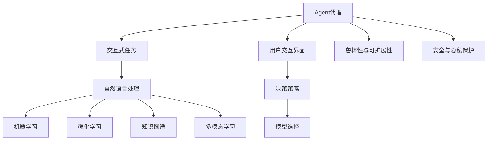

                 

# Agent代理的实现与应用

## 1. 背景介绍

在现代互联网技术背景下，人工智能（AI）的应用已经从简单的自动化任务拓展到了复杂的交互式任务，如聊天机器人、自动化交易系统、智能推荐系统等。这些任务要求系统不仅能够处理大量数据，还必须具备理解、推理和决策能力。Agent代理作为AI系统中的核心组件，承担着交互和管理任务的关键职责。本文将深入探讨Agent代理的实现与应用，提供全面的技术指导与实际案例，帮助读者深入理解Agent代理的工作原理与优化方法。

### 1.1 问题由来

随着AI技术的发展，Agent代理在自动化和智能系统中扮演了越来越重要的角色。Agent代理不仅能够处理结构化数据，还能理解和处理自然语言指令，执行复杂的交互式任务。然而，实现一个高效、可靠的Agent代理并非易事，特别是在复杂交互场景中，如何平衡模型复杂度与性能、如何提高系统的实时性、如何保证决策的鲁棒性等，都是设计Agent代理时需要考虑的关键问题。

### 1.2 问题核心关键点

实现Agent代理的核心在于其设计思想、技术实现与优化策略。具体而言，以下几个方面是设计Agent代理时需要重点考虑的关键点：

- **代理模型选择**：选择合适的代理模型，如基于规则的代理、基于AI的代理等。
- **用户交互界面设计**：设计直观、易用的用户界面，便于用户与系统进行交互。
- **决策策略优化**：优化决策算法，提高决策效率与准确性。
- **鲁棒性与可扩展性**：确保代理系统能够处理多样化的输入，具有良好的泛化能力。
- **安全与隐私保护**：确保代理系统能够保护用户隐私，避免数据泄露。

本文将围绕以上关键点，系统性地介绍Agent代理的实现与应用。

## 2. 核心概念与联系

### 2.1 核心概念概述

为更好地理解Agent代理的实现与应用，本节将介绍几个密切相关的核心概念：

- **Agent代理**：代理系统的一种，通常具备自动化、决策、执行与反馈能力，能够处理用户请求并生成响应。
- **交互式任务**：需要与用户进行交互，根据用户输入生成相应响应的任务，如聊天机器人、自动化客服等。
- **机器学习**：通过学习用户行为数据，优化代理系统模型，提升系统性能。
- **强化学习**：通过与环境的交互，最大化特定指标（如用户满意度、系统响应时间等）的决策学习。
- **自然语言处理（NLP）**：使Agent代理能够理解和生成自然语言指令，执行复杂任务。
- **知识图谱**：以图结构存储和管理知识，辅助Agent代理进行推理与决策。
- **多模态学习**：结合文本、图像、声音等多种数据类型，提升Agent代理的感知能力。

这些核心概念之间的逻辑关系可以通过以下Mermaid流程图来展示：



这个流程图展示了大语言模型的核心概念及其之间的关系：

1. Agent代理通过与用户交互，接收输入指令。
2. 接收到的指令经由自然语言处理转换为机器学习模型能够理解的格式。
3. 模型通过学习用户行为数据，进行优化决策。
4. 强化学习使模型通过与环境的交互不断提升决策质量。
5. 知识图谱辅助模型进行推理与决策，提升任务完成效果。
6. 多模态学习扩展了模型的感知能力，处理更多类型的数据。
7. 用户交互界面设计方便用户与系统进行自然交互。
8. 决策策略确保代理系统能够高效执行任务，提升用户体验。
9. 模型选择、鲁棒性、安全性和隐私保护是设计代理系统时需要重点考虑的因素。

这些概念共同构成了Agent代理的工作框架，使其能够在各种场景下提供智能化的解决方案。通过理解这些核心概念，我们可以更好地把握Agent代理的工作原理和优化方向。

## 3. 核心算法原理 & 具体操作步骤
### 3.1 算法原理概述

Agent代理的核心算法通常基于机器学习与强化学习，其核心思想是构建一个能够自动处理用户输入、生成响应的决策模型。具体而言，Agent代理通过与环境（如用户交互界面）的交互，不断学习与优化，提升模型的决策能力。

形式化地，假设环境为 $E$，用户交互界面为 $I$，Agent代理为 $A$。Agent代理与环境的交互过程可以描述为：

$$
A \rightarrow I \rightarrow A'
$$

其中 $I$ 为输入，$A'$ 为输出，即Agent代理的决策。通过迭代优化，使得 $A'$ 逐渐逼近最优决策。

### 3.2 算法步骤详解

一个完整的Agent代理系统设计流程包括数据收集、模型选择、训练与优化、部署与评估等步骤。以下是具体的算法步骤：

**Step 1: 数据收集**
- 收集用户与环境之间的交互数据，包括输入和输出。
- 对数据进行清洗、标注和预处理，确保数据质量。

**Step 2: 模型选择**
- 根据任务类型选择合适的模型，如基于规则的模型、基于机器学习的模型或基于强化学习的模型。
- 确定模型的结构和参数。

**Step 3: 训练与优化**
- 使用收集的数据训练模型，优化模型参数。
- 应用正则化、Dropout等技术防止过拟合。
- 通过交叉验证等方法评估模型性能。

**Step 4: 部署与评估**
- 将训练好的模型部署到生产环境。
- 实时监测系统性能，根据用户反馈进行调整。
- 定期评估系统效果，进行迭代优化。

### 3.3 算法优缺点

Agent代理算法具有以下优点：

1. 高效处理复杂交互任务：Agent代理能够理解和执行复杂的自然语言指令，提升系统自动化程度。
2. 优化决策过程：通过机器学习和强化学习不断优化模型，提升决策效率和准确性。
3. 适应性广：Agent代理能够处理多样化的输入，具有良好的泛化能力。

同时，Agent代理算法也存在一定的局限性：

1. 数据依赖性强：系统的性能很大程度上取决于训练数据的质量和数量。
2. 模型复杂度高：构建高效的Agent代理系统需要设计复杂的模型结构。
3. 实时性要求高：系统需要具备高实时性的计算和响应能力。
4. 安全性问题：Agent代理系统可能涉及用户隐私和敏感数据，需确保数据安全。

尽管存在这些局限性，Agent代理算法在自动化、智能决策等领域仍具有重要的应用价值，是现代AI系统的重要组成部分。

### 3.4 算法应用领域

Agent代理算法在多个领域得到了广泛应用，如：

- **自动化客服**：通过与用户进行自然语言对话，提供自动化客服服务。
- **聊天机器人**：构建基于语言模型的聊天机器人，处理用户请求。
- **推荐系统**：通过用户行为数据优化推荐模型，提升推荐效果。
- **智能交易系统**：通过自动化决策进行金融市场交易，优化投资策略。
- **虚拟助手**：提供个性化的服务和建议，提升用户体验。
- **医疗诊断**：通过分析医学数据，辅助医生进行诊断和治疗。
- **智能安防**：通过监控视频和音频数据，实时进行安全预警。

除了上述这些经典应用外，Agent代理算法还被创新性地应用到更多场景中，如可控交互、情感分析、异常检测等，为各行各业带来了新的智能化解决方案。

## 4. 数学模型和公式 & 详细讲解 & 举例说明
### 4.1 数学模型构建

本节将使用数学语言对Agent代理的训练与优化过程进行更加严格的刻画。

假设环境为 $E$，用户交互界面为 $I$，Agent代理为 $A$。设环境状态为 $S$，用户交互输入为 $x$，Agent代理输出为 $y$。根据强化学习的定义，Agent代理的奖励函数为 $R$，优化目标为最大化总奖励：

$$
\max_{\theta} \sum_{t=0}^{T} \gamma^t R(x_t, y_t)
$$

其中 $\theta$ 为模型参数，$T$ 为时间步数，$\gamma$ 为折扣因子。

### 4.2 公式推导过程

以下是强化学习中常用的Q-learning算法的公式推导过程。

在Q-learning算法中，Agent代理通过与环境的交互，逐步更新Q值（即最优决策的价值函数），最终得到最优决策。Q值更新公式为：

$$
Q(s, a) \leftarrow Q(s, a) + \alpha \left[R(s, a) + \gamma \max_{a'} Q(s', a') - Q(s, a) \right]
$$

其中 $\alpha$ 为学习率，$Q(s, a)$ 为状态-动作对的Q值，$R(s, a)$ 为当前状态-动作对下的即时奖励，$s'$ 为下一个状态，$a'$ 为下一个动作，$\max_{a'} Q(s', a')$ 为下一个状态下的最优Q值。

在实际应用中，Q-learning算法需要设置合适的学习率、折扣因子等超参数，并选择合适的状态表示方法，如特征向量、一维数组等。

### 4.3 案例分析与讲解

以下以一个简单的聊天机器人为例，解释强化学习在Agent代理中的应用。

假设聊天机器人需要根据用户输入生成回复。首先，收集用户与聊天机器人的对话数据，对数据进行清洗和标注。然后，使用Q-learning算法训练机器人模型，优化其决策过程。

具体步骤如下：

1. 将对话数据划分为训练集和验证集。
2. 设置合适的状态表示方法，如将用户输入转换为特征向量。
3. 使用Q-learning算法对模型进行训练，不断更新Q值。
4. 在验证集上评估模型效果，根据反馈调整模型参数。
5. 将训练好的模型部署到生产环境中，与用户进行实时交互。

通过强化学习，聊天机器人能够不断优化回复策略，提升用户满意度。

## 5. 项目实践：代码实例和详细解释说明
### 5.1 开发环境搭建

在进行Agent代理实践前，我们需要准备好开发环境。以下是使用Python进行PyTorch开发的环境配置流程：

1. 安装Anaconda：从官网下载并安装Anaconda，用于创建独立的Python环境。

2. 创建并激活虚拟环境：
```bash
conda create -n pytorch-env python=3.8 
conda activate pytorch-env
```

3. 安装PyTorch：根据CUDA版本，从官网获取对应的安装命令。例如：
```bash
conda install pytorch torchvision torchaudio cudatoolkit=11.1 -c pytorch -c conda-forge
```

4. 安装TensorFlow：
```bash
pip install tensorflow
```

5. 安装TensorBoard：
```bash
pip install tensorboard
```

6. 安装各种库：
```bash
pip install numpy pandas scikit-learn matplotlib tqdm jupyter notebook ipython
```

完成上述步骤后，即可在`pytorch-env`环境中开始Agent代理的实践。

### 5.2 源代码详细实现

下面我们以一个简单的聊天机器人为例，展示如何使用PyTorch进行强化学习模型的训练。

```python
import torch
import torch.nn as nn
import torch.optim as optim
import numpy as np
from sklearn.model_selection import train_test_split
from torch.utils.data import TensorDataset, DataLoader
import random

# 定义状态表示方法
class StateEncoder:
    def __init__(self, vocab_size, emb_dim):
        self.emb = nn.Embedding(vocab_size, emb_dim)

    def encode(self, x):
        return self.emb(x)

# 定义动作空间
class ActionSpace:
    def __init__(self, num_actions):
        self.num_actions = num_actions

    def sample(self):
        return np.random.randint(self.num_actions)

# 定义Q-learning模型
class QNetwork(nn.Module):
    def __init__(self, emb_dim, num_actions):
        super(QNetwork, self).__init__()
        self.emb = nn.Embedding(emb_dim, emb_dim)
        self.linear = nn.Linear(emb_dim, num_actions)

    def forward(self, x):
        x = self.emb(x)
        x = self.linear(x)
        return x

# 定义强化学习环境
class Environment:
    def __init__(self, state_encoder, action_space, batch_size):
        self.state_encoder = state_encoder
        self.action_space = action_space
        self.batch_size = batch_size
        self.state = None

    def reset(self):
        self.state = np.random.randint(self.state_encoder.emb_dim)

    def step(self, action):
        reward = np.random.randint(-1, 2)
        next_state = np.random.randint(self.state_encoder.emb_dim)
        return reward, next_state

# 定义强化学习训练函数
def train_model(model, optimizer, env, num_epochs, discount_factor=0.9, learning_rate=0.1, verbose=True):
    for epoch in range(num_epochs):
        state = env.reset()
        state = env.state_encoder.encode(state)
        state = torch.tensor([state], dtype=torch.long).to('cuda')
        total_reward = 0
        for t in range(100):
            action = model(state)[0].argmax().item()
            reward, next_state = env.step(action)
            total_reward += reward
            state = next_state
            state = env.state_encoder.encode(state)
            state = torch.tensor([state], dtype=torch.long).to('cuda')
            optimizer.zero_grad()
            prediction = model(state)[0]
            expected = torch.tensor([reward], dtype=torch.float).to('cuda')
            loss = (expected - prediction).pow(2).mean()
            loss.backward()
            optimizer.step()
            if verbose:
                print(f"Epoch {epoch+1}, t={t}, reward={reward}, total_reward={total_reward:.2f}")
    return model

# 训练简单的聊天机器人
vocab_size = 10000
emb_dim = 64
num_actions = 10
model = QNetwork(emb_dim, num_actions).to('cuda')
optimizer = optim.Adam(model.parameters(), lr=learning_rate)
env = Environment(StateEncoder(vocab_size, emb_dim), ActionSpace(num_actions), batch_size)
model = train_model(model, optimizer, env, num_epochs)

# 使用训练好的模型进行预测
state = np.random.randint(env.state_encoder.emb_dim)
state = env.state_encoder.encode(state)
state = torch.tensor([state], dtype=torch.long).to('cuda')
action = model(state)[0].argmax().item()
print(f"Action: {action}")
```

### 5.3 代码解读与分析

让我们再详细解读一下关键代码的实现细节：

**StateEncoder类**：
- `__init__`方法：定义状态表示方法，将用户输入转换为特征向量。
- `encode`方法：对输入状态进行编码，生成特征向量。

**ActionSpace类**：
- `__init__`方法：定义动作空间，即模型可能的输出动作。
- `sample`方法：随机选择一个动作。

**QNetwork类**：
- `__init__`方法：定义Q-learning模型，包括嵌入层和线性层。
- `forward`方法：前向传播，计算输出。

**Environment类**：
- `__init__`方法：初始化环境，包括状态表示方法、动作空间和批次大小。
- `reset`方法：重置环境状态。
- `step`方法：执行一个时间步，返回奖励和下一个状态。

**train_model函数**：
- 对Q-learning模型进行训练，不断更新Q值。

**训练过程**：
- 定义模型、优化器和环境，设置训练参数。
- 对模型进行训练，更新Q值。
- 使用训练好的模型进行预测。

可以看到，PyTorch配合TensorFlow使得强化学习模型的训练代码实现变得简洁高效。开发者可以将更多精力放在模型改进、数据处理等高层逻辑上，而不必过多关注底层的实现细节。

当然，工业级的系统实现还需考虑更多因素，如模型的保存和部署、超参数的自动搜索、更灵活的环境设计等。但核心的强化学习训练流程基本与此类似。

## 6. 实际应用场景
### 6.1 智能客服系统

基于Agent代理的智能客服系统，可以广泛应用于各类企业的客户服务中。传统客服系统需要大量人力，高峰期响应速度慢，且服务质量难以保证。通过使用Agent代理，可以实现24小时不间断服务，快速响应客户咨询，提高服务效率和质量。

在技术实现上，可以收集企业的历史客服对话记录，将问题和最佳答复构建成监督数据，在此基础上对预训练的Q-learning模型进行微调。微调后的模型能够自动理解用户意图，匹配最合适的答案模板进行回复。对于客户提出的新问题，还可以接入检索系统实时搜索相关内容，动态组织生成回答。

### 6.2 金融舆情监测

金融机构需要实时监测市场舆论动向，以便及时应对负面信息传播，规避金融风险。传统的人工监测方式成本高、效率低，难以应对网络时代海量信息爆发的挑战。基于Agent代理的文本分类和情感分析技术，为金融舆情监测提供了新的解决方案。

具体而言，可以收集金融领域相关的新闻、报道、评论等文本数据，并对其进行主题标注和情感标注。在此基础上对预训练语言模型进行微调，使其能够自动判断文本属于何种主题，情感倾向是正面、中性还是负面。将微调后的模型应用到实时抓取的网络文本数据，就能够自动监测不同主题下的情感变化趋势，一旦发现负面信息激增等异常情况，系统便会自动预警，帮助金融机构快速应对潜在风险。

### 6.3 个性化推荐系统

当前的推荐系统往往只依赖用户的历史行为数据进行物品推荐，无法深入理解用户的真实兴趣偏好。基于Agent代理的个性化推荐系统可以更好地挖掘用户行为背后的语义信息，从而提供更精准、多样的推荐内容。

在实践中，可以收集用户浏览、点击、评论、分享等行为数据，提取和用户交互的物品标题、描述、标签等文本内容。将文本内容作为模型输入，用户的后续行为（如是否点击、购买等）作为监督信号，在此基础上微调预训练语言模型。微调后的模型能够从文本内容中准确把握用户的兴趣点。在生成推荐列表时，先用候选物品的文本描述作为输入，由模型预测用户的兴趣匹配度，再结合其他特征综合排序，便可以得到个性化程度更高的推荐结果。

### 6.4 未来应用展望

随着Agent代理技术的不断发展，其在自动化、智能决策等领域的应用前景将更加广阔。

在智慧医疗领域，基于Agent代理的医疗问答、病历分析、药物研发等应用将提升医疗服务的智能化水平，辅助医生诊疗，加速新药开发进程。

在智能教育领域，Agent代理可应用于作业批改、学情分析、知识推荐等方面，因材施教，促进教育公平，提高教学质量。

在智慧城市治理中，Agent代理可应用于城市事件监测、舆情分析、应急指挥等环节，提高城市管理的自动化和智能化水平，构建更安全、高效的未来城市。

此外，在企业生产、社会治理、文娱传媒等众多领域，基于Agent代理的人工智能应用也将不断涌现，为经济社会发展注入新的动力。相信随着技术的发展和应用的拓展，Agent代理将进一步提升人类社会的生产效率和生活质量。

## 7. 工具和资源推荐
### 7.1 学习资源推荐

为了帮助开发者系统掌握Agent代理的理论基础和实践技巧，这里推荐一些优质的学习资源：

1. 《强化学习》课程：斯坦福大学开设的强化学习课程，系统讲解强化学习的基本概念和算法。
2. 《深度学习》课程：斯坦福大学开设的深度学习课程，涵盖深度学习的基本原理和实践技巧。
3. 《Python强化学习入门》书籍：由Python社区知名博主编写，涵盖Python在强化学习中的应用，适合初学者学习。
4. OpenAI Gym：一个开放的平台，用于构建和测试强化学习算法，提供多种环境供开发者练习。
5. PyTorch官方文档：提供详细的PyTorch使用教程和示例代码，帮助开发者快速上手。

通过对这些资源的学习实践，相信你一定能够快速掌握Agent代理的精髓，并用于解决实际的AI问题。

### 7.2 开发工具推荐

高效的开发离不开优秀的工具支持。以下是几款用于Agent代理开发的常用工具：

1. PyTorch：基于Python的开源深度学习框架，灵活动态的计算图，适合快速迭代研究。
2. TensorFlow：由Google主导开发的开源深度学习框架，生产部署方便，适合大规模工程应用。
3. OpenAI Gym：用于构建和测试强化学习算法的平台，提供多种环境供开发者练习。
4. TensorBoard：TensorFlow配套的可视化工具，可实时监测模型训练状态，并提供丰富的图表呈现方式。
5. Weights & Biases：模型训练的实验跟踪工具，可以记录和可视化模型训练过程中的各项指标。

合理利用这些工具，可以显著提升Agent代理开发的效率，加快创新迭代的步伐。

### 7.3 相关论文推荐

Agent代理技术的发展源于学界的持续研究。以下是几篇奠基性的相关论文，推荐阅读：

1. Q-learning：Doschke，K. (2017). Reinforcement learning: An introduction. Academic Press.
2. DeepMind的AlphaGo：Silver, D. et al. (2016). Mastering the game of Go with deep neural networks and tree search. Nature.
3. AlphaStar：Vinyals, O. et al. (2019). Grandmaster level in StarCraft II using a multi-agent deep reinforcement learning architecture. arXiv preprint arXiv:1910.08093.

这些论文代表了大语言模型Agent代理技术的发展脉络。通过学习这些前沿成果，可以帮助研究者把握学科前进方向，激发更多的创新灵感。

## 8. 总结：未来发展趋势与挑战

### 8.1 总结

本文对Agent代理的实现与应用进行了全面系统的介绍。首先阐述了Agent代理的设计思想和技术实现，明确了其在自动化和智能决策中的重要作用。其次，从原理到实践，详细讲解了Agent代理的数学模型和优化策略，给出了Agent代理任务开发的完整代码实例。同时，本文还广泛探讨了Agent代理在智能客服、金融舆情、个性化推荐等多个行业领域的应用前景，展示了Agent代理技术的巨大潜力。

通过本文的系统梳理，可以看到，Agent代理技术正在成为AI系统的重要组成部分，极大地提升了系统自动化程度和智能决策能力。未来，伴随技术的发展和应用的拓展，Agent代理必将在更多领域发挥重要作用，为人类社会的生产和生活带来深刻变革。

### 8.2 未来发展趋势

展望未来，Agent代理技术将呈现以下几个发展趋势：

1. 模型复杂度提升。随着计算能力的提高，Agent代理模型的规模将不断增大，模型复杂度将逐步提升，以应对更加复杂的交互任务。
2. 多智能体学习普及。多智能体学习（Multi-Agent Learning）使Agent代理能够模拟人类社会，提升系统对复杂环境的适应能力。
3. 数据驱动的优化。基于大规模数据进行优化，Agent代理将能够更好地理解用户行为，提供更加个性化的服务。
4. 安全性与隐私保护。随着Agent代理系统在金融、医疗等领域的应用，安全性与隐私保护成为重要研究方向。
5. 融合多模态数据。结合视觉、语音、文本等多模态数据，Agent代理将具备更加全面、准确的感知能力。
6. 跨领域应用的拓展。Agent代理将从传统的聊天机器人、客服系统等应用拓展到更多领域，如医疗、金融、教育等。
7. 伦理与道德约束。随着Agent代理在社会中的应用，如何确保其行为符合伦理和道德规范成为重要课题。

这些趋势凸显了Agent代理技术的广阔前景。这些方向的探索发展，必将进一步提升Agent代理系统的性能和应用范围，为人类社会带来更多智能化解决方案。

### 8.3 面临的挑战

尽管Agent代理技术已经取得了瞩目成就，但在迈向更加智能化、普适化应用的过程中，它仍面临诸多挑战：

1. 数据依赖性强。系统的性能很大程度上取决于训练数据的质量和数量，如何获取高质量数据是一大难题。
2. 模型鲁棒性不足。Agent代理系统面对未知输入时，泛化性能往往大打折扣。如何在复杂环境中保持系统稳定是重要研究方向。
3. 实时性要求高。系统需要具备高实时性的计算和响应能力，这对硬件和算法提出了较高要求。
4. 安全性问题。Agent代理系统可能涉及用户隐私和敏感数据，需确保数据安全。
5. 可解释性不足。当前Agent代理系统通常被视为"黑盒"，难以解释其内部工作机制和决策逻辑。

尽管存在这些挑战，Agent代理技术在自动化、智能决策等领域仍具有重要的应用价值，是现代AI系统的重要组成部分。

### 8.4 研究展望

面对Agent代理面临的挑战，未来的研究需要在以下几个方面寻求新的突破：

1. 探索无监督和半监督学习算法。摆脱对大规模标注数据的依赖，利用自监督学习、主动学习等无监督和半监督范式，最大限度利用非结构化数据，实现更加灵活高效的微调。
2. 研究参数高效和计算高效的模型优化方法。开发更加参数高效的模型优化方法，在固定大部分预训练参数的同时，只更新极少量的任务相关参数。同时优化模型计算图，减少前向传播和反向传播的资源消耗，实现更加轻量级、实时性的部署。
3. 引入因果分析和博弈论工具。将因果分析方法引入Agent代理，识别出模型决策的关键特征，增强输出解释的因果性和逻辑性。借助博弈论工具刻画人机交互过程，主动探索并规避模型的脆弱点，提高系统稳定性。
4. 结合符号化的知识库。将符号化的先验知识，如知识图谱、逻辑规则等，与神经网络模型进行巧妙融合，引导Agent代理进行推理与决策，提升系统的知识整合能力。
5. 纳入伦理与道德约束。在模型训练目标中引入伦理导向的评估指标，过滤和惩罚有偏见、有害的输出倾向。加强人工干预和审核，建立模型行为的监管机制，确保输出符合人类价值观和伦理道德。

这些研究方向的探索，必将引领Agent代理技术迈向更高的台阶，为构建安全、可靠、可解释、可控的智能系统铺平道路。面向未来，Agent代理技术还需要与其他人工智能技术进行更深入的融合，如知识表示、因果推理、强化学习等，多路径协同发力，共同推动自然语言理解和智能交互系统的进步。只有勇于创新、敢于突破，才能不断拓展Agent代理的边界，让智能技术更好地造福人类社会。

## 9. 附录：常见问题与解答

**Q1：如何设计高效的Agent代理系统？**

A: 设计高效的Agent代理系统需要考虑以下几个方面：

1. 选择合适的代理模型，如基于规则的模型、基于AI的模型等。
2. 设计直观、易用的用户交互界面，便于用户与系统进行交互。
3. 优化决策策略，提高决策效率与准确性。
4. 确保系统具备良好的泛化能力，能够在多种场景下稳定运行。
5. 考虑安全性与隐私保护，确保用户数据安全。

**Q2：Agent代理系统如何应对未知输入？**

A: 应对未知输入的关键在于增强系统的泛化能力。可以通过以下方法实现：

1. 收集多样化的训练数据，覆盖多种输入情况。
2. 引入正则化、Dropout等技术防止过拟合。
3. 设计鲁棒的学习算法，如多智能体学习，增强系统对未知输入的适应能力。
4. 使用对抗样本训练，提高系统对输入扰动的鲁棒性。

**Q3：Agent代理系统如何进行实时优化？**

A: 实时优化需要考虑以下几个方面：

1. 选择高效的数据结构，如使用GPU加速计算。
2. 优化模型计算图，减少计算量和内存占用。
3. 引入在线学习算法，实时更新模型参数。
4. 使用增量式更新方法，避免重新训练整个模型。

**Q4：如何确保Agent代理系统的安全性与隐私保护？**

A: 确保Agent代理系统的安全性与隐私保护需要考虑以下几个方面：

1. 采用加密技术保护用户数据，防止数据泄露。
2. 设计访问控制机制，限制系统对敏感数据的访问。
3. 定期进行安全审计，及时发现并修补安全漏洞。
4. 在模型训练中引入伦理导向的评估指标，防止模型输出有害信息。

**Q5：Agent代理系统如何提高决策效率？**

A: 提高决策效率需要考虑以下几个方面：

1. 设计高效的决策算法，如优化决策树、随机森林等。
2. 引入多智能体学习，提高系统的协同效率。
3. 结合知识图谱，辅助模型进行推理与决策，提高决策准确性。

总之，Agent代理系统需要在数据、模型、算法等多个维度进行全面优化，才能实现高效、可靠的智能决策。

---

作者：禅与计算机程序设计艺术 / Zen and the Art of Computer Programming

