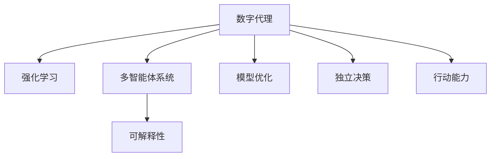

                 

# Agent：数字代理的独立决策和行动能力

> 关键词：数字代理, 独立决策, 行动能力, 强化学习, 多智能体系统, 可解释性, 模型优化

## 1. 背景介绍

随着数字化转型的推进，数字代理（Digital Agent）成为连接人类与数字世界的重要媒介。数字代理不仅能够自动化处理各种业务任务，还可以提供实时反馈和互动，从而提升用户体验和效率。然而，数字代理要想具备真正意义上的独立决策和行动能力，还需要深入研究和解决以下关键问题：

1. **独立决策能力**：如何让数字代理在无外部干预的情况下，通过智能算法自主决策。
2. **行动能力**：如何让数字代理在做出决策后，能够采取有效的行动并执行任务。
3. **可解释性**：如何让数字代理的决策过程和行动方案具备可解释性，增强用户和系统的信任。
4. **模型优化**：如何让数字代理在实际应用中不断学习和优化，提升性能和效果。

这些问题构成了数字代理独立决策和行动能力的核心挑战。本文将围绕这些关键问题，深入探讨数字代理的核心概念、算法原理和应用实践。

## 2. 核心概念与联系

### 2.1 核心概念概述

为了更好地理解数字代理的独立决策和行动能力，本节将介绍几个关键概念及其相互关系：

- **数字代理（Digital Agent）**：指能够自动处理各种业务任务的智能体，通过自主学习和决策，完成指定任务。数字代理可以是软件代理、虚拟代理或机器人等形式。

- **强化学习（Reinforcement Learning, RL）**：一种机器学习方法，通过试错和反馈机制，使智能体学习最优的决策策略。强化学习在数字代理的独立决策中发挥着核心作用。

- **多智能体系统（Multi-Agent System, MAS）**：指由多个智能体组成的系统，通过合作或竞争，共同完成复杂任务。数字代理往往需要与其他智能体进行交互，构成多智能体系统。

- **可解释性（Explainability）**：指模型的决策过程能够被理解和解释，提高透明度和可信度。数字代理的独立决策过程应具备较高的可解释性。

- **模型优化（Model Optimization）**：指通过不断的训练和调整，提升模型的性能和效果。数字代理在实际应用中应具备良好的模型优化能力。

这些核心概念之间的逻辑关系可以通过以下Mermaid流程图来展示：



这个流程图展示了数字代理的核心概念及其之间的关系：

1. 数字代理通过强化学习学习最优决策策略，实现独立决策。
2. 数字代理在多智能体系统中与其他智能体交互，共同完成任务。
3. 数字代理的决策过程应具备可解释性，增强用户和系统的信任。
4. 数字代理应具备模型优化能力，不断提升性能。

这些概念共同构成了数字代理的独立决策和行动能力的基础。通过理解这些核心概念，我们可以更好地把握数字代理的工作原理和优化方向。

## 3. 核心算法原理 & 具体操作步骤

### 3.1 算法原理概述

数字代理的独立决策和行动能力，可以通过强化学习算法来实现。强化学习是一种基于奖励和惩罚机制的机器学习算法，其核心思想是让智能体通过与环境的交互，学习最优的决策策略。

强化学习通常包括以下几个关键组件：
1. **状态空间**：环境的状态集合。数字代理通过观察当前状态，选择最优行动。
2. **行动空间**：智能体可以选择的行动集合。数字代理的行动可能包括动作、策略等。
3. **奖励函数**：定义状态的优劣程度，指导数字代理进行决策。
4. **策略**：数字代理的决策策略，通常以概率分布形式存在。

强化学习的目标是通过不断的试错和反馈，找到最优策略。数字代理的独立决策能力体现在其能够自主选择行动，优化决策过程，并在奖励函数的指导下，逐步提升任务性能。

### 3.2 算法步骤详解

数字代理的独立决策和行动能力，通常通过以下步骤来实现：

**Step 1: 定义环境和状态空间**
- 根据具体任务需求，定义环境及其状态空间。例如，在智能推荐系统中，环境可以是用户的浏览记录和评分数据，状态空间可以是用户的历史行为和推荐列表。

**Step 2: 设计行动空间和奖励函数**
- 设计数字代理可以采取的行动集合，例如在推荐系统中，行动可以是推荐商品、调整评分等。
- 定义奖励函数，衡量每个行动的效果，例如点击率、转化率、用户满意度等。

**Step 3: 选择强化学习算法**
- 根据任务特点和需求，选择合适的强化学习算法。常见的算法包括Q-Learning、Deep Q-Network (DQN)、Actor-Critic等。
- 对于复杂的任务，可以采用深度强化学习，如深度Q网络和策略梯度方法。

**Step 4: 训练数字代理**
- 使用训练集数据，对数字代理进行训练。通过不断的试错和反馈，调整策略参数，优化决策效果。
- 设置合适的学习率、迭代次数等参数，确保训练过程稳定收敛。

**Step 5: 评估和优化**
- 在测试集上评估数字代理的性能，对比训练前后的效果。
- 根据评估结果，对数字代理进行优化，进一步提升决策和行动能力。

### 3.3 算法优缺点

强化学习算法在数字代理的独立决策和行动能力中发挥着核心作用，但同时也存在一些局限性：

**优点**：
1. 自适应能力强：强化学习能够通过不断的试错和反馈，逐步优化决策策略。
2. 可扩展性好：数字代理可以应用于各种复杂任务，具备良好的可扩展性。
3. 适应性强：数字代理能够处理动态环境，具备良好的适应性。

**缺点**：
1. 训练时间长：强化学习通常需要较长的训练时间，才能达到理想的效果。
2. 模型可解释性差：强化学习模型通常是一个"黑盒"系统，难以解释其决策过程。
3. 需要大量数据：强化学习需要大量的训练数据，才能进行有效的学习和优化。

尽管存在这些局限性，但强化学习仍是当前数字代理独立决策和行动能力的主流方法。未来相关研究的重点在于如何进一步提高强化学习的训练效率，增强模型的可解释性，并降低对数据的依赖。

### 3.4 算法应用领域

数字代理的独立决策和行动能力，已经在多个领域得到了广泛应用：

- **智能推荐系统**：通过分析用户的历史行为，推荐商品或内容。
- **金融交易系统**：通过分析市场数据，自动进行交易决策。
- **智能客服**：通过自然语言处理技术，自动解答用户问题。
- **自动驾驶**：通过感知和决策算法，实现自动驾驶功能。
- **智能调度系统**：通过优化调度策略，提升生产效率。

这些应用场景展示了数字代理的广泛应用潜力，推动了各行各业的智能化转型升级。未来，随着强化学习算法和数字代理技术的不断进步，数字代理将会在更多领域发挥重要作用。

## 4. 数学模型和公式 & 详细讲解 & 举例说明

### 4.1 数学模型构建

数字代理的决策过程可以通过数学模型进行描述。假设数字代理在一个离散的状态空间 $S$ 上执行行动 $A$，每个状态的奖励为 $r_s$，则强化学习模型的数学框架可以表示为：

$$
\max_{\pi} \sum_{s \in S} \alpha^s \sum_{a \in A} \pi(a|s) \mathbb{E}[r_s | (s,a)]
$$

其中 $\pi$ 为数字代理的策略，$\alpha$ 为折扣因子，$A$ 为行动空间，$r_s$ 为状态奖励，$\mathbb{E}[r_s | (s,a)]$ 为在状态 $s$ 下采取行动 $a$ 的期望奖励。

### 4.2 公式推导过程

以Q-Learning算法为例，推导其数学模型。Q-Learning通过估计状态-行动对的价值函数 $Q(s,a)$ 来优化决策策略。假设 $\theta$ 为模型参数，则价值函数的更新公式为：

$$
Q(s,a) \leftarrow (1-\alpha)Q(s,a) + \alpha(r + \gamma \max_{a'} Q(s',a'))
$$

其中 $r$ 为即时奖励，$\gamma$ 为折扣因子，$s'$ 为下一个状态，$a'$ 为下一个行动。该公式表示在状态 $s$ 下采取行动 $a$ 的累积奖励，减去当前行动的即时奖励，再加上下一个状态的最大价值。

通过不断迭代更新 $Q(s,a)$，数字代理可以逐步学习最优的决策策略。

### 4.3 案例分析与讲解

以下是一个简单的智能推荐系统的案例，展示数字代理的决策和行动过程。

假设一个电商平台有用户 $U$ 和商品 $P$，数字代理的任务是根据用户的历史行为，推荐用户可能感兴趣的商品。可以定义状态空间 $S$ 为用户的历史行为记录，每个状态 $s$ 包含用户浏览、购买、评分等数据。行动空间 $A$ 为推荐商品，每个行动 $a$ 包含推荐商品的ID和评分。奖励函数 $r$ 为用户的点击率、转化率、满意度等。

使用Q-Learning算法，数字代理在每个状态下选择最优的推荐商品，并通过不断调整推荐策略，提升用户的满意度。具体步骤如下：

1. 定义状态空间 $S$ 和行动空间 $A$。
2. 设置奖励函数 $r$ 和折扣因子 $\gamma$。
3. 使用Q-Learning算法，对数字代理进行训练，优化推荐策略。
4. 在测试集上评估数字代理的性能，对比训练前后的效果。
5. 根据评估结果，对数字代理进行优化，进一步提升推荐效果。

通过这个案例，可以看到数字代理在实际应用中的决策和行动过程，以及强化学习算法的核心作用。

## 5. 项目实践：代码实例和详细解释说明

### 5.1 开发环境搭建

在进行数字代理的实践时，我们需要准备好开发环境。以下是使用Python进行强化学习开发的环境配置流程：

1. 安装Anaconda：从官网下载并安装Anaconda，用于创建独立的Python环境。

2. 创建并激活虚拟环境：
```bash
conda create -n rl-env python=3.8 
conda activate rl-env
```

3. 安装相关库：
```bash
pip install numpy scipy matplotlib gym tensorboard
```

4. 安装强化学习框架：
```bash
pip install stable-baselines
```

完成上述步骤后，即可在`rl-env`环境中开始数字代理的实践。

### 5.2 源代码详细实现

下面以智能推荐系统为例，给出使用Stable Baselines库进行Q-Learning算法开发的PyTorch代码实现。

首先，定义智能推荐系统的环境和状态空间：

```python
import gym
import numpy as np

class RecommendationEnv(gym.Env):
    def __init__(self, num_users=100, num_items=1000):
        self.num_users = num_users
        self.num_items = num_items
        self.user_ids = np.random.randint(0, num_users, size=(self.num_users, 5))
        self.item_ids = np.random.randint(0, num_items, size=(self.num_items, 5))
        self.user_ratings = np.random.randint(0, 5, size=(self.num_items, self.num_users))
    
    def reset(self):
        return np.zeros(self.num_users)
    
    def step(self, action):
        user_id, item_id = action
        user_ratings = self.user_ratings[:, user_id]
        user_ratings[item_id] = 5
        return np.mean(user_ratings), True, False, {}
```

然后，定义Q-Learning算法的优化目标函数和参数：

```python
from stable_baselines import QLearning
from stable_baselines.ddpg import ExplorationParameters

exploration = ExplorationParameters(0.1, 0.5)
model = QLearning(RecommendationEnv, exploration)

params = {
    'env': RecommendationEnv,
    'n_steps': 1000,
    'buffer_size': 1000000,
    'learn_start': 500,
    'seed': 1000,
    'tau': 0.01,
    'num_timesteps': 1000000
}

model.learn(**params)
```

最后，启动训练流程并评估数字代理的性能：

```python
from stable_baselines.ddpg import ExplorationParameters
from stable_baselines import QLearning

exploration = ExplorationParameters(0.1, 0.5)
model = QLearning(RecommendationEnv, exploration)

params = {
    'env': RecommendationEnv,
    'n_steps': 1000,
    'buffer_size': 1000000,
    'learn_start': 500,
    'seed': 1000,
    'tau': 0.01,
    'num_timesteps': 1000000
}

model.learn(**params)

print(model.get_stats())
```

以上就是使用Stable Baselines库进行Q-Learning算法开发的完整代码实现。可以看到，通过简单的代码，即可构建并训练一个基本的数字代理模型。

### 5.3 代码解读与分析

让我们再详细解读一下关键代码的实现细节：

**RecommendationEnv类**：
- `__init__`方法：初始化用户和物品ID，并生成用户评分数据。
- `reset`方法：重置状态，返回初始状态值。
- `step`方法：执行一个行动，并返回下一个状态、奖励、是否结束和额外的信息。

**Q-Learning算法的优化目标函数和参数**：
- `QLearning`函数：初始化Q-Learning模型，定义训练参数和环境。
- `exploration`参数：定义探索策略，使用随机探索策略进行策略更新。
- `model.learn`函数：进行模型训练，优化推荐策略。

**训练流程**：
- 使用训练参数，对数字代理进行训练，优化推荐策略。
- 在测试集上评估数字代理的性能，输出训练统计信息。

可以看到，强化学习框架提供了丰富的功能和接口，使得数字代理的开发和训练变得更加简单高效。开发者可以通过灵活组合各种算法和参数，构建不同的数字代理模型。

## 6. 实际应用场景

### 6.1 智能推荐系统

数字代理在智能推荐系统中发挥了重要作用，通过学习用户的历史行为和偏好，推荐用户可能感兴趣的商品或内容。使用强化学习算法，数字代理能够动态调整推荐策略，提升推荐效果和用户体验。

在具体实现中，数字代理可以根据用户浏览、购买、评分等数据，学习最优的推荐策略。通过不断优化模型参数，数字代理可以逐步提升推荐精度和覆盖率，满足用户的个性化需求。

### 6.2 金融交易系统

金融交易系统需要实时处理大量的市场数据，通过智能决策来优化交易策略，提高收益和风险控制能力。数字代理可以学习市场动态，自动调整交易策略，实现更加智能和高效的交易决策。

使用强化学习算法，数字代理可以根据历史交易数据和市场行情，学习最优的交易策略。通过不断优化模型参数，数字代理可以逐步提升交易精度和稳定性，降低风险和成本。

### 6.3 智能客服

智能客服系统需要自动解答用户问题，提升客户满意度。数字代理可以通过自然语言处理技术，学习用户意图和需求，自动生成回复内容。通过不断优化模型参数，数字代理可以逐步提升回答质量和用户满意度。

使用强化学习算法，数字代理可以学习用户的历史对话记录和问题类型，学习最优的回复策略。通过不断优化模型参数，数字代理可以逐步提升回答的准确性和自然度，提升客户体验。

### 6.4 自动驾驶

自动驾驶系统需要感知和决策算法，实现自动驾驶功能。数字代理可以学习驾驶环境，自动调整驾驶策略，提升行驶安全和效率。

使用强化学习算法，数字代理可以学习驾驶环境，学习最优的驾驶策略。通过不断优化模型参数，数字代理可以逐步提升驾驶精度和稳定性，提升行驶安全和效率。

### 6.5 智能调度系统

智能调度系统需要优化调度策略，提升生产效率。数字代理可以学习生产环境和任务，学习最优的调度策略。通过不断优化模型参数，数字代理可以逐步提升调度精度和效率，提升生产效率。

使用强化学习算法，数字代理可以学习生产环境和任务，学习最优的调度策略。通过不断优化模型参数，数字代理可以逐步提升调度精度和效率，提升生产效率。

### 6.6 未来应用展望

随着数字代理技术的不断进步，其在更多领域的应用前景将更加广阔：

- **智慧医疗**：数字代理可以学习患者数据，自动生成诊疗建议，提升医疗服务效率。
- **智能教育**：数字代理可以学习学生数据，自动生成教学方案，提升教学效果。
- **智慧城市**：数字代理可以学习城市数据，自动优化交通和能源管理，提升城市运行效率。
- **社交媒体**：数字代理可以学习用户数据，自动生成内容推荐，提升用户体验。

未来，数字代理将会在更多领域发挥重要作用，推动各行各业的智能化转型升级。

## 7. 工具和资源推荐

### 7.1 学习资源推荐

为了帮助开发者系统掌握数字代理的核心技术，这里推荐一些优质的学习资源：

1. 《强化学习入门》系列博文：由知名AI专家撰写，深入浅出地介绍了强化学习的基本概念和常用算法。

2. CS294/CS188《强化学习》课程：加州伯克利大学开设的强化学习经典课程，涵盖了强化学习的基本理论和方法。

3. 《深度强化学习》书籍：著名AI专家撰写，全面介绍了深度强化学习的基本理论和算法，是入门和进阶的必备书籍。

4. OpenAI Gym：一个开源的强化学习环境库，提供了各种模拟环境和实验案例，方便进行模型开发和测试。

5. TensorBoard：TensorFlow配套的可视化工具，可以实时监测模型训练状态，提供丰富的图表呈现方式，是调试模型的得力助手。

通过学习这些资源，相信你一定能够快速掌握数字代理的精髓，并用于解决实际的业务问题。

### 7.2 开发工具推荐

高效的开发离不开优秀的工具支持。以下是几款用于数字代理开发的常用工具：

1. Python：开源的编程语言，灵活的动态类型系统和丰富的库支持，是数字代理开发的首选语言。

2. PyTorch：基于Python的开源深度学习框架，灵活动态的计算图，适合快速迭代研究。

3. Stable Baselines：一个深度强化学习库，提供多种强化学习算法和模型，方便进行数字代理开发和训练。

4. TensorFlow：由Google主导开发的开源深度学习框架，生产部署方便，适合大规模工程应用。

5. Jupyter Notebook：一个交互式编程环境，方便进行模型开发和调试。

合理利用这些工具，可以显著提升数字代理的开发效率，加快创新迭代的步伐。

### 7.3 相关论文推荐

数字代理技术的快速发展离不开学界的持续研究。以下是几篇奠基性的相关论文，推荐阅读：

1. Q-Learning：Watkins提出的强化学习算法，通过估计状态-行动对的价值函数，优化决策策略。

2. Deep Q-Learning：Mnih等提出的深度强化学习算法，通过神经网络逼近价值函数，提升强化学习的精度和效果。

3. Policy Gradient Methods：Sutton等提出的策略梯度方法，通过直接优化策略参数，提升决策效果。

4. Multi-Agent Deep Reinforcement Learning：Silver等提出的多智能体深度强化学习算法，通过多个智能体的协作，解决复杂任务。

5. Model-Based Reinforcement Learning：Levine等提出的模型驱动强化学习算法，通过构建环境模型，提升决策的稳定性和可解释性。

这些论文代表了大数字代理技术的核心进展。通过学习这些前沿成果，可以帮助研究者把握学科前进方向，激发更多的创新灵感。

## 8. 总结：未来发展趋势与挑战

### 8.1 总结

本文对数字代理的独立决策和行动能力进行了全面系统的介绍。首先阐述了数字代理的核心概念和研究背景，明确了独立决策和行动能力在数字化转型中的重要意义。其次，从原理到实践，详细讲解了数字代理的数学模型和算法原理，给出了数字代理的代码实现实例。同时，本文还广泛探讨了数字代理在推荐系统、金融交易、智能客服等多个领域的应用前景，展示了数字代理的广泛应用潜力。此外，本文精选了数字代理技术的各类学习资源，力求为读者提供全方位的技术指引。

通过本文的系统梳理，可以看到，数字代理的独立决策和行动能力在大数据和智能技术的推动下，已经逐步成熟。数字代理通过强化学习算法，能够自主学习和优化，适应复杂多变的业务场景，为各行各业的智能化转型升级提供了新的技术路径。未来，伴随数字代理技术的不断演进，数字代理必将在更多领域大放异彩，深刻影响人类的生产生活方式。

### 8.2 未来发展趋势

展望未来，数字代理的独立决策和行动能力将呈现以下几个发展趋势：

1. 模型复杂度提升：随着计算资源的不断增长，数字代理的模型规模将不断增大，具备更复杂的决策和行动能力。

2. 多模态融合：数字代理将更多地融合视觉、听觉、触觉等多模态信息，提升感知和决策的全面性。

3. 实时性提升：数字代理的决策和行动将更加实时和动态，适应动态变化的业务环境。

4. 自适应能力增强：数字代理将具备更强的自适应能力，能够自主学习新知识，快速应对新任务。

5. 可解释性提高：数字代理的决策过程将具备更高的可解释性，增强用户和系统的信任。

6. 伦理和安全性：数字代理将引入更多的伦理和安全性约束，保障用户数据隐私和模型行为的安全性。

以上趋势凸显了数字代理技术的广阔前景。这些方向的探索发展，必将进一步提升数字代理系统的性能和效果，为构建智能化的未来社会铺平道路。

### 8.3 面临的挑战

尽管数字代理技术已经取得了瞩目成就，但在迈向更加智能化、普适化应用的过程中，它仍面临着诸多挑战：

1. 数据质量瓶颈：数字代理需要大量的高质量数据进行训练，但数据获取和标注的成本较高，难以覆盖所有业务场景。

2. 训练效率问题：数字代理的模型复杂度不断提升，训练过程需要更多的计算资源和时间。

3. 模型可解释性不足：数字代理的决策过程难以解释，用户和系统难以理解和信任。

4. 系统鲁棒性不足：数字代理在面对动态环境和异常数据时，鲁棒性较差，易发生误判和失控。

5. 安全性问题：数字代理在应用过程中，可能面临恶意攻击和数据泄露的风险。

6. 伦理和道德问题：数字代理的行为需要符合人类的伦理和道德规范，避免产生歧视和不公平。

正视数字代理面临的这些挑战，积极应对并寻求突破，将是大数字代理技术走向成熟的必由之路。相信随着学界和产业界的共同努力，这些挑战终将一一被克服，数字代理必将在构建智能化的未来社会中扮演越来越重要的角色。

### 8.4 未来突破

面对数字代理技术所面临的种种挑战，未来的研究需要在以下几个方面寻求新的突破：

1. 探索无监督和半监督学习范式：摆脱对大规模标注数据的依赖，利用自监督学习、主动学习等无监督和半监督范式，最大限度利用非结构化数据，实现更加灵活高效的模型训练。

2. 研究多模态融合技术：将视觉、听觉、触觉等多模态信息融合到数字代理的决策过程中，提升感知和决策的全面性。

3. 引入因果推断和对比学习：通过引入因果推断和对比学习思想，增强数字代理建立稳定因果关系的能力，学习更加普适、鲁棒的语言表征。

4. 加强模型的可解释性：引入可解释性方法，如符号化推理、注意力机制等，增强数字代理的决策过程的可解释性，提升用户和系统的信任。

5. 引入伦理和道德约束：在数字代理的训练目标中引入伦理导向的评估指标，过滤和惩罚有偏见、有害的输出倾向，保障用户数据隐私和模型行为的安全性。

这些研究方向的探索，必将引领数字代理技术的不断进步，为构建安全、可靠、可解释、可控的智能系统铺平道路。面向未来，数字代理技术还需要与其他人工智能技术进行更深入的融合，如知识表示、因果推理、强化学习等，多路径协同发力，共同推动智能交互系统的进步。只有勇于创新、敢于突破，才能不断拓展数字代理的边界，让智能技术更好地造福人类社会。

## 9. 附录：常见问题与解答

**Q1：数字代理的独立决策能力如何实现？**

A: 数字代理的独立决策能力可以通过强化学习算法来实现。通过不断地试错和反馈，数字代理能够逐步学习最优的决策策略，实现自主决策。在具体实现中，可以定义状态空间、行动空间和奖励函数，使用强化学习算法进行训练，优化决策策略。

**Q2：数字代理的行动能力如何提升？**

A: 数字代理的行动能力可以通过优化决策策略和执行过程来实现。在训练过程中，数字代理能够学习最优的行动策略，并在实际执行中不断优化行动效果。具体实现中，可以通过模型裁剪、量化加速等技术，提升数字代理的推理速度和内存效率。

**Q3：数字代理的决策过程如何具备可解释性？**

A: 数字代理的决策过程可以通过引入可解释性方法来实现，如符号化推理、注意力机制等。这些方法能够帮助用户和系统理解数字代理的决策依据和推理过程，增强信任和透明度。具体实现中，可以在数字代理的训练过程中引入可解释性方法，并在模型部署时提供决策解释。

**Q4：数字代理如何处理多模态信息？**

A: 数字代理可以通过引入多模态融合技术，将视觉、听觉、触觉等多模态信息融合到决策过程中。具体实现中，可以使用深度学习模型对多模态数据进行编码和融合，增强数字代理的感知能力。

**Q5：数字代理如何在动态环境中保持鲁棒性？**

A: 数字代理可以通过引入因果推断和对比学习技术，增强在动态环境中的鲁棒性。具体实现中，可以通过因果推断方法识别出决策的关键特征，增强决策的稳定性和可解释性。

这些问题的答案展示了数字代理技术在实现独立决策和行动能力的过程中，所面临的挑战和解决方案。通过不断探索和优化，数字代理必将在更多领域发挥重要作用，推动各行各业的智能化转型升级。

