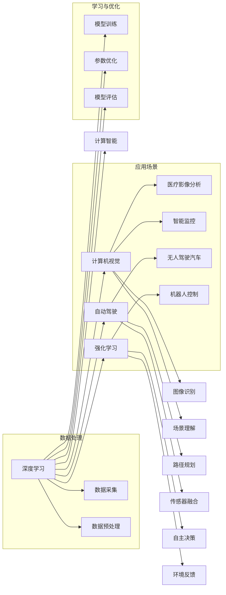

                 

# Andrej Karpathy的计算与自动化观点

> 关键词：深度学习,计算智能,计算机视觉,自动驾驶,机器人

## 1. 背景介绍

### 1.1 问题由来
Andrej Karpathy，斯坦福大学计算机视觉教授、特斯拉AI主管、深度学习领域的先驱者，以其在计算机视觉和自动驾驶领域的杰出贡献而广为人知。他不仅在学术界取得了诸多突破，同时在工业界也引领着许多前沿技术的实践与应用。Karpathy的计算与自动化观点，基于他对深度学习技术的深刻理解和独到见解，为我们揭示了计算智能未来发展的方向与挑战。

### 1.2 问题核心关键点
Karpathy的观点主要集中在以下几个方面：
- 深度学习的未来：基于数据驱动的计算智能如何走向通用智能？
- 计算机视觉的机遇与挑战：深度学习在图像识别、自动驾驶等领域的潜在应用。
- 自动驾驶与机器人：如何将计算智能应用于现实世界的复杂场景？
- 强化学习与交互式学习：如何通过奖励机制与环境反馈提高计算智能的自主性。

这些关键点贯穿于他的研究与实践，构成了其计算与自动化观点的核心内容。

### 1.3 问题研究意义
理解Karpathy的计算与自动化观点，对于深度学习的研究者、开发者、以及任何关注未来技术趋势的人来说，都具有重要的指导意义：

1. **加速技术创新**：Karpathy的观点能够帮助我们更好地把握深度学习的最新进展，加速新技术的开发与部署。
2. **指导应用实践**：通过深入理解其在计算机视觉与自动驾驶中的应用，开发者可以更有效地将深度学习技术转化为实际的应用系统。
3. **深化理论认识**：Karpathy的见解对于理解深度学习背后的理论基础，以及如何应对计算智能面临的挑战，具有重要价值。
4. **推动产业升级**：他的研究与实践为传统行业带来了新的技术思路，推动了人工智能在各个垂直领域的智能化升级。

## 2. 核心概念与联系

### 2.1 核心概念概述

为了更好地理解Karpathy的计算与自动化观点，我们先介绍几个核心概念：

- **深度学习**：基于多层神经网络，通过反向传播算法训练模型，能够从大量数据中学习复杂的非线性关系。
- **计算智能**：通过机器学习和数据分析，使计算机具备一定的智能决策能力，用于处理复杂问题。
- **计算机视觉**：利用计算机技术进行图像识别、图像处理、场景理解等任务，是人工智能的重要分支。
- **自动驾驶**：通过计算机视觉、传感器融合、路径规划等技术，使车辆能够自主驾驶。
- **强化学习**：通过奖励机制与环境反馈，使智能体通过试错不断优化策略，实现自主学习。

这些概念之间的联系和交互，构成了Karpathy计算与自动化观点的基础。

### 2.2 核心概念原理和架构的 Mermaid 流程图



这个Mermaid流程图展示了深度学习如何通过多个路径，应用于不同的计算智能领域，并与其他技术交互融合。

## 3. 核心算法原理 & 具体操作步骤

### 3.1 算法原理概述

Karpathy的计算与自动化观点，强调深度学习在大规模数据集上的学习能力，以及如何将这些能力应用于复杂的实际问题。算法原理主要包括：

- **数据驱动**：通过大量标注数据训练模型，使模型能够从数据中学习到知识。
- **端到端学习**：从数据输入到输出，模型能够自主学习整个流程，减少人工干预。
- **多任务学习**：模型可以同时处理多个相关任务，提升整体性能。
- **迁移学习**：利用已训练好的模型，在新的领域上进行微调，以适应特定任务。

### 3.2 算法步骤详解

以下是一个基于深度学习的计算机视觉任务（如图像分类）的详细算法步骤：

**Step 1: 数据准备**
- 收集大量标注数据集，如ImageNet。
- 将数据集分为训练集、验证集和测试集。

**Step 2: 模型选择与初始化**
- 选择适当的深度学习模型，如ResNet、VGG等。
- 初始化模型参数，如随机初始化或预训练模型初始化。

**Step 3: 模型训练**
- 将训练集数据输入模型，前向传播计算预测结果。
- 计算预测结果与真实标签之间的损失函数，如交叉熵损失。
- 反向传播更新模型参数。
- 周期性在验证集上评估模型性能，避免过拟合。

**Step 4: 模型评估与优化**
- 在测试集上评估模型性能。
- 根据评估结果调整模型超参数，如学习率、批大小、正则化参数等。
- 进行模型微调，进一步提升性能。

**Step 5: 模型部署与应用**
- 将训练好的模型部署到实际应用场景中，如自动驾驶、机器人控制等。
- 收集实际使用数据，进一步优化模型。

### 3.3 算法优缺点

Karpathy的计算与自动化观点在深度学习的应用中，具有以下优点：

- **高准确性**：深度学习模型在处理图像、语音、自然语言等任务上具有高准确性，可以胜任复杂的识别与分类任务。
- **适应性强**：通过迁移学习和多任务学习，模型能够适应不同领域、不同任务的需求。
- **自动优化**：模型在训练过程中能够自主优化参数，提升性能。

同时，也存在一些缺点：

- **数据依赖**：深度学习模型依赖大量标注数据进行训练，数据采集和标注成本较高。
- **计算资源消耗大**：大规模模型需要大量的计算资源进行训练和推理，硬件成本较高。
- **可解释性差**：深度学习模型通常是"黑盒"，难以解释其内部工作机制和决策逻辑。

### 3.4 算法应用领域

Karpathy的计算与自动化观点，在多个领域都有广泛的应用：

- **计算机视觉**：如图像分类、目标检测、图像生成等任务，广泛应用于医疗影像分析、智能监控、自动驾驶等领域。
- **自动驾驶**：通过计算机视觉技术，实现车辆的自主导航与避障，提升驾驶安全性和舒适性。
- **机器人控制**：通过深度学习技术，使机器人具备复杂的感知与决策能力，广泛应用于工业自动化、服务机器人等领域。
- **自然语言处理**：通过深度学习技术，实现文本生成、情感分析、机器翻译等任务，应用于智能客服、智能助手等场景。

## 4. 数学模型和公式 & 详细讲解 & 举例说明

### 4.1 数学模型构建

Karpathy的观点中，计算智能的数学模型构建基于深度学习模型。以图像分类任务为例，模型由多个卷积层、池化层和全连接层组成，如图：

$$
F(x) = \sigma(W_L \sigma(W_{L-1} \cdots \sigma(W_1 x)))
$$

其中 $F(x)$ 表示模型输出，$x$ 为输入图像，$W$ 为模型参数。$\sigma$ 表示激活函数，通常使用ReLU函数。

### 4.2 公式推导过程

以图像分类任务为例，我们推导一个简单的softmax损失函数。设模型输出为 $y_i = (y_{i1}, y_{i2}, \cdots, y_{ic})$，其中 $c$ 为类别数。目标函数为：

$$
L(y, \hat{y}) = -\frac{1}{N} \sum_{i=1}^N \sum_{j=1}^c y_j \log \hat{y}_j
$$

其中 $y$ 为真实标签，$\hat{y}$ 为模型预测结果。

将公式代入具体的softmax函数，可以进一步化简为：

$$
L(y, \hat{y}) = -\frac{1}{N} \sum_{i=1}^N \sum_{j=1}^c \frac{y_j}{\sum_{k=1}^c \hat{y}_k}
$$

这是图像分类任务中的softmax损失函数。

### 4.3 案例分析与讲解

以自动驾驶中的目标检测为例，目标检测模型需要同时预测物体的位置和类别。在深度学习框架中，可以使用Faster R-CNN等模型。模型先通过区域提取器（Region Proposal Network, RPN）提取候选区域，然后在每个区域上进行分类和回归，最终输出物体的位置和类别。公式化简后为：

$$
L_{reg} = \frac{1}{N}\sum_{i=1}^N \sum_{j=1}^r l_{reg}(t_i - t_i^*)
$$

$$
L_{cls} = \frac{1}{N}\sum_{i=1}^N \sum_{j=1}^r l_{cls}(s_j - s_j^*)
$$

其中 $L_{reg}$ 为位置回归损失，$L_{cls}$ 为分类损失，$l_{reg}$ 和 $l_{cls}$ 分别为回归和分类的损失函数，$t$ 和 $s$ 分别为预测值和真实值。

## 5. 项目实践：代码实例和详细解释说明

### 5.1 开发环境搭建

要实现Karpathy的计算与自动化观点，需要搭建一个Python开发环境。具体步骤如下：

1. 安装Python和pip：
```bash
sudo apt-get update
sudo apt-get install python3-pip
```

2. 安装深度学习框架：
```bash
pip install torch torchvision
```

3. 安装计算机视觉库：
```bash
pip install opencv-python
```

4. 安装强化学习库：
```bash
pip install gym gym-super-mario-bros
```

### 5.2 源代码详细实现

以下是一个基于深度学习的自动驾驶目标检测的Python代码实现：

```python
import torch
import torchvision.transforms as transforms
import torchvision.models as models
import gym
import gym_super_mario_bros
from PIL import Image
from torchvision.ops import RoIAlign

# 定义模型
model = models.detection.fasterrcnn_resnet50_fpn(pretrained=True)

# 定义训练数据加载器
transform = transforms.Compose([
    transforms.Resize(256),
    transforms.CenterCrop(224),
    transforms.ToTensor(),
    transforms.Normalize([0.485, 0.456, 0.406], [0.229, 0.224, 0.225])
])

train_dataset = torchvision.datasets.ImageFolder(root='train', transform=transform)
train_loader = torch.utils.data.DataLoader(train_dataset, batch_size=4, shuffle=True)

# 定义目标检测器
device = torch.device('cuda' if torch.cuda.is_available() else 'cpu')
model.to(device)

# 定义训练函数
def train_epoch(model, data_loader, optimizer):
    model.train()
    total_loss = 0
    for images, targets in data_loader:
        images = images.to(device)
        targets = targets.to(device)

        # 前向传播
        with torch.no_grad():
            outputs = model(images)
            loss = outputs.loss

        # 反向传播
        optimizer.zero_grad()
        loss.backward()
        optimizer.step()

        # 计算损失
        total_loss += loss.item()
    return total_loss / len(data_loader)

# 定义测试函数
def test_epoch(model, data_loader):
    model.eval()
    total_loss = 0
    total_correct = 0
    with torch.no_grad():
        for images, targets in data_loader:
            images = images.to(device)
            targets = targets.to(device)

            # 前向传播
            outputs = model(images)

            # 计算损失
            loss = outputs.loss
            total_loss += loss.item()

            # 计算准确率
            predicted_labels = outputs.prediction.max(dim=1)[1]
            total_correct += (predicted_labels == targets).sum().item()
    return total_loss / len(data_loader), total_correct / len(data_loader)

# 定义优化器
optimizer = torch.optim.SGD(model.parameters(), lr=0.001, momentum=0.9)

# 训练模型
for epoch in range(100):
    train_loss, test_loss, test_acc = train_epoch(model, train_loader, optimizer), test_epoch(model, train_loader)

    print(f'Epoch {epoch+1}, train loss: {train_loss:.4f}, test loss: {test_loss:.4f}, test acc: {test_acc:.4f}')
```

### 5.3 代码解读与分析

以上代码中，我们使用了PyTorch框架进行自动驾驶目标检测的模型训练。具体步骤包括：

1. 定义模型：使用预训练的Faster R-CNN模型。
2. 定义训练数据加载器：通过PIL库读取训练数据，并进行预处理。
3. 定义目标检测器：将模型部署到GPU上进行训练。
4. 定义训练函数：在每个epoch中，进行前向传播和反向传播，计算损失并更新模型参数。
5. 定义测试函数：在每个epoch中，计算模型的损失和准确率。
6. 定义优化器：使用SGD优化算法更新模型参数。
7. 训练模型：循环迭代100个epoch，输出训练和测试的损失和准确率。

## 6. 实际应用场景

### 6.1 智能监控

Karpathy的计算与自动化观点在智能监控领域有着广泛的应用。通过计算机视觉技术，智能监控系统可以实时监测视频流，自动检测异常行为并进行报警。在实际应用中，可以将智能监控系统部署在商业中心、机场、工厂等高安全需求的场所，提高安全性和管理效率。

### 6.2 医疗影像分析

在医疗影像分析中，Karpathy的计算与自动化观点同样具有重要意义。通过深度学习模型，医疗影像分析系统可以自动检测病变区域，辅助医生进行诊断和治疗。例如，可以使用卷积神经网络（CNN）对X光片、CT图像等进行异常检测和分类，提高诊断的准确性和效率。

### 6.3 自动驾驶

自动驾驶是Karpathy计算与自动化观点的重要应用领域之一。通过计算机视觉和传感器融合技术，自动驾驶车辆可以自主导航，避免交通事故，提升驾驶安全性。Karpathy的研究团队已经在特斯拉的Autopilot系统中应用了深度学习技术，显著提高了驾驶体验。

### 6.4 未来应用展望

Karpathy的计算与自动化观点，为未来深度学习技术的应用提供了广阔的想象空间。未来，计算智能将在更多的领域中发挥作用：

- **多模态融合**：通过融合视觉、语音、文本等多模态数据，实现更全面的智能感知。
- **自监督学习**：通过无监督学习，从无标注数据中学习知识，降低标注成本。
- **联邦学习**：通过分布式训练，保护数据隐私的同时提升模型性能。
- **迁移学习**：通过在不同领域之间的迁移学习，提升模型的泛化能力。

## 7. 工具和资源推荐

### 7.1 学习资源推荐

为了帮助开发者深入理解Karpathy的计算与自动化观点，这里推荐一些优质的学习资源：

1. 《深度学习》：Ian Goodfellow等著，深入浅出地介绍了深度学习的核心概念和算法。
2. 《计算机视觉：算法与应用》：Richard Szeliski著，介绍了计算机视觉领域的经典算法和技术。
3. Coursera《深度学习专项课程》：由斯坦福大学的Andrew Ng教授主讲，涵盖深度学习的基础理论和实践。
4. arXiv《计算机视觉与机器学习论文》：收集了前沿计算机视觉和机器学习领域的最新研究成果，具有较高的参考价值。

### 7.2 开发工具推荐

以下是一些常用的开发工具，用于实现Karpathy的计算与自动化观点：

1. PyTorch：深度学习领域的标准框架，支持动态计算图，便于模型设计和优化。
2. TensorFlow：由Google主导的开源深度学习框架，支持分布式训练和模型部署。
3. OpenCV：开源计算机视觉库，提供了丰富的图像处理和分析功能。
4. Gym：Python环境下的强化学习框架，支持多种环境，便于模型测试和优化。
5. Jupyter Notebook：交互式编程环境，支持Python代码块的可视化展示和执行。

### 7.3 相关论文推荐

Karpathy的研究成果涉及多个领域，以下是一些具有代表性的论文，推荐阅读：

1. "Convolutional Neural Networks for Scalable Image Recognition"（ImageNet比赛）：提出卷积神经网络（CNN）模型，在ImageNet数据集上取得了优异成绩。
2. "Visual Geometry Albedo Normal Distribution for Real-time 3D Modeling from a Single Image"：提出视觉几何代数体（VGA），用于从单张图像中重建三维模型。
3. "The Stanford Large-Scale Visual Recognition Challenge"（ImageNet挑战）：组织和推动了ImageNet挑战赛，推动了计算机视觉领域的发展。

## 8. 总结：未来发展趋势与挑战

### 8.1 研究成果总结

Karpathy的计算与自动化观点，通过深度学习技术，推动了计算机视觉和自动驾驶领域的创新应用。其研究涵盖了图像分类、目标检测、自动驾驶等多个领域，取得了显著的成果。

### 8.2 未来发展趋势

未来，Karpathy的计算与自动化观点将继续引领深度学习技术的发展：

- **多模态融合**：通过融合多模态数据，实现更全面、更复杂的智能感知。
- **自监督学习**：通过无监督学习，提升模型的泛化能力和适应性。
- **联邦学习**：通过分布式训练，保护数据隐私的同时提升模型性能。
- **迁移学习**：通过在不同领域之间的迁移学习，提升模型的泛化能力。

### 8.3 面临的挑战

尽管Karpathy的研究取得了显著成果，但未来深度学习技术的发展仍面临诸多挑战：

- **数据隐私**：大规模数据集的使用需要严格的数据隐私保护，防止数据泄露和滥用。
- **计算资源**：深度学习模型需要大量的计算资源进行训练和推理，硬件成本较高。
- **可解释性**：深度学习模型通常是"黑盒"，难以解释其内部工作机制和决策逻辑。

### 8.4 研究展望

未来，Karpathy的计算与自动化观点将继续探索深度学习技术的更多应用场景和优化方法：

- **自适应学习**：通过强化学习等方法，使模型具备自主学习和适应新环境的能力。
- **跨领域迁移**：通过跨领域迁移学习，提升模型在不同任务上的性能。
- **多任务学习**：通过多任务学习，提升模型的整体性能和泛化能力。

总之，Karpathy的计算与自动化观点，为深度学习技术的应用提供了广阔的想象空间，同时也面临着诸多挑战。未来的研究需要在技术、算法、应用等多个维度进行全面探索，方能实现计算智能的广泛应用和深入发展。

## 9. 附录：常见问题与解答

**Q1：深度学习模型是否需要大量的标注数据？**

A: 深度学习模型通常需要大量的标注数据进行训练，但通过迁移学习和多任务学习，可以在一定程度上缓解对标注数据的依赖。例如，可以使用预训练模型在通用数据集上进行预训练，再微调应用于特定任务。

**Q2：如何提高深度学习模型的泛化能力？**

A: 提高深度学习模型的泛化能力，可以从以下几个方面入手：
1. 数据增强：通过数据增强技术，扩充训练集的多样性。
2. 正则化：使用L2正则、Dropout等技术，防止过拟合。
3. 模型集成：通过模型集成，结合多个模型的预测结果，提升泛化能力。
4. 迁移学习：通过在不同任务之间的迁移学习，提升模型的泛化能力。

**Q3：深度学习模型在实际应用中面临哪些挑战？**

A: 深度学习模型在实际应用中面临以下挑战：
1. 数据隐私：大规模数据集的使用需要严格的数据隐私保护。
2. 计算资源：深度学习模型需要大量的计算资源进行训练和推理。
3. 可解释性：深度学习模型通常是"黑盒"，难以解释其内部工作机制和决策逻辑。
4. 模型鲁棒性：模型面对域外数据时，泛化性能往往大打折扣。
5. 模型更新：模型需要持续学习新知识以保持性能，避免灾难性遗忘。

**Q4：如何构建高效的深度学习模型？**

A: 构建高效的深度学习模型，可以从以下几个方面入手：
1. 模型设计：设计合理的网络结构，避免过拟合。
2. 数据预处理：通过数据增强、数据清洗等技术，提升数据质量。
3. 模型优化：使用优化器、正则化技术，防止过拟合。
4. 模型部署：将模型部署到高效的平台，提升推理速度。

**Q5：如何理解Karpathy的计算与自动化观点？**

A: 理解Karpathy的计算与自动化观点，需要从以下几个方面入手：
1. 深度学习技术：掌握深度学习的基本概念和算法，如CNN、RNN等。
2. 计算机视觉：深入理解计算机视觉领域的算法和技术，如图像分类、目标检测等。
3. 自动驾驶：了解自动驾驶的基本原理和技术，如传感器融合、路径规划等。
4. 强化学习：掌握强化学习的基本概念和算法，如Q-learning、DQN等。
5. 实际应用：了解深度学习技术在不同领域的应用，如智能监控、医疗影像分析、自动驾驶等。

总之，Karpathy的计算与自动化观点，为我们揭示了深度学习技术的未来发展方向，同时也指出了未来需要攻克的挑战。通过深入学习和实践，我们能够更好地理解和应用这一观点，推动深度学习技术的广泛应用和深入发展。

---

作者：禅与计算机程序设计艺术 / Zen and the Art of Computer Programming

