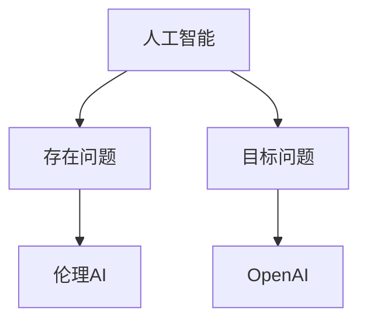

                 

# Andrej Karpathy：OpenAI 的成立初衷

## 1. 背景介绍

### 1.1 问题由来
在AI领域，Andrej Karpathy 可谓是一位多面手：他既是深度学习专家，又是顶级AI实验室OpenAI的联合创始人之一。他关于“OpenAI的成立初衷”的阐述，为我们理解AI发展历程，以及OpenAI的定位和愿景，提供了宝贵的视角。

Andrej Karpathy 在公开场合多次表示，OpenAI成立的初衷并不是在技术竞赛中打败对手，而是要“构建一个人工智能的哲学”。这个哲学包含了对人类与AI未来的思考，以及AI应用的责任与伦理。Karpathy 强调，OpenAI致力于解决“存在问题”（being problem），而非“目标问题”（doing problem）。他比喻说：“OpenAI 就像一个哲学家，它关心存在意义，关心科技如何影响人类社会和个体”。

### 1.2 问题核心关键点
Andrej Karpathy 认为，AI技术的飞速发展，既带来了前所未有的机遇，也带来了前所未有的挑战。他认为，AI发展应关注以下几个核心问题：

1. **伦理与安全**：AI技术应以人为中心，确保技术应用符合伦理道德，避免对人类造成伤害。
2. **隐私保护**：AI系统应尊重用户隐私，防止数据滥用。
3. **技术透明度**：AI模型的决策过程应具有可解释性，以增强用户信任。
4. **社会影响**：AI应促进社会公正，避免加剧社会不平等。
5. **发展可控**：AI技术发展应保持可控性，防止技术失控。

Andrej Karpathy 认为，OpenAI 的责任在于推动AI技术健康、负责地发展，而不是简单追求技术优势。他强调，“OpenAI 不追求成为世界上最先进的AI实验室，而是成为最负责任的AI实验室”。

## 2. 核心概念与联系

### 2.1 核心概念概述

为更好地理解Andrej Karpathy对OpenAI成立初衷的阐述，本节将介绍几个核心概念：

- **人工智能（AI）**：使用算法和计算机技术使机器模仿人类智能行为的技术。
- **存在问题（Being Problem）**：AI技术对人类社会、个体存在的影响和作用，如伦理、隐私、透明度、社会影响等。
- **目标问题（Doing Problem）**：AI技术在具体应用场景中的任务和目标，如自然语言处理、计算机视觉、机器翻译等。
- **OpenAI**：由包括Andrej Karpathy在内的多位AI专家创立的人工智能实验室，致力于构建负责任、透明、安全的AI技术。
- **伦理AI**：关注AI技术的应用对人类社会、个体、环境的影响，强调AI技术的伦理和责任。

这些核心概念之间的逻辑关系可以通过以下Mermaid流程图来展示：



这个流程图展示了大语言模型的核心概念及其之间的关系：

1. 人工智能通过目标问题与现实世界中的具体应用场景连接。
2. 存在问题关注人工智能对人类社会的深层次影响。
3. OpenAI 以伦理AI为指导，致力于构建负责任、透明的AI技术。
4. OpenAI 不仅追求技术优势，更重视技术应用的社会责任。

这些概念共同构成了OpenAI的核心理念，为其制定技术和伦理方向提供了基础。

## 3. 核心算法原理 & 具体操作步骤
### 3.1 算法原理概述

Andrej Karpathy 强调，OpenAI的成立初衷之一，是要构建一种“负责任的AI哲学”。这意味着，OpenAI在技术发展过程中，要时刻关注AI技术的伦理和社会影响，确保技术应用符合人类利益。

他指出，AI技术的发展应该以人为本，尊重用户隐私，避免对人类造成伤害。例如，在AI模型的设计和使用过程中，应确保数据的隐私保护，防止模型被用于不当用途。同时，AI系统的决策过程应具有可解释性，以便用户能够理解和信任模型。

### 3.2 算法步骤详解

OpenAI的算法步骤主要包括以下几个方面：

1. **数据收集与预处理**：收集公开的、合法的、质量可靠的数据，并对其进行清洗、归一化等预处理，确保数据的质量和多样性。

2. **模型训练与评估**：选择合适的算法和模型结构，使用收集的数据对模型进行训练，并通过验证集对模型性能进行评估。

3. **模型微调与优化**：根据评估结果对模型进行微调，优化模型参数，提升模型性能。

4. **伦理审查与合规性检查**：在模型部署前，进行伦理审查，确保模型符合伦理道德标准，并遵循相关法律法规。

5. **透明度与可解释性**：在模型设计中引入可解释性机制，确保模型的决策过程透明，用户能够理解模型的输出和行为。

6. **社会影响评估**：在模型部署后，持续监测模型对社会的影响，评估模型的正面和负面效应，确保模型应用符合社会公正原则。

7. **持续学习与改进**：模型应具备持续学习的能力，能够根据新的数据和反馈不断改进，提升模型性能。

### 3.3 算法优缺点

OpenAI的算法具有以下优点：

1. **社会责任**：OpenAI在技术开发中重视伦理和责任，致力于构建对人类有益的AI技术。
2. **透明度与可解释性**：OpenAI在模型设计中引入可解释性机制，确保用户理解和信任模型。
3. **隐私保护**：OpenAI在数据收集和使用过程中，严格遵守隐私保护法规，确保用户数据的安全。
4. **持续改进**：OpenAI持续监测模型应用效果，根据新数据和反馈不断改进模型。

同时，OpenAI的算法也存在一些局限性：

1. **技术复杂性**：在实现可解释性和隐私保护等目标时，算法设计和实现复杂性较高。
2. **资源消耗**：在数据收集和模型训练过程中，资源消耗较大，需要较高的计算和存储能力。
3. **速度限制**：在模型微调和优化过程中，可能需要较长时间，影响模型部署速度。
4. **用户接受度**：用户对新技术的接受度和信任度需要时间积累，短期内可能影响模型应用。

尽管存在这些局限性，但OpenAI的算法设计和实施，充分体现了其对AI技术的社会责任和伦理思考，这在当前的AI研究中具有重要意义。

### 3.4 算法应用领域

OpenAI的算法应用于多个领域，涵盖了从自然语言处理到计算机视觉，从机器人学到机器翻译等多个方向。以下是几个典型的应用领域：

1. **自然语言处理（NLP）**：OpenAI的GPT-3模型在自然语言处理领域取得了显著成果，广泛应用于文本生成、问答、对话系统等。

2. **计算机视觉（CV）**：OpenAI的DALL-E模型在图像生成和描述方面表现出色，用于生成艺术作品、虚拟场景等。

3. **机器人学**：OpenAI的AlphaGo和AlphaStar在棋类游戏和视频游戏中的表现，展示了AI技术在决策和策略学习方面的潜力。

4. **机器翻译**：OpenAI的翻译模型广泛应用于跨语言沟通，提升了翻译的准确性和流畅性。

5. **智能推荐系统**：OpenAI的推荐系统应用于电商平台、新闻网站等，提高了用户体验和推荐精度。

这些应用领域展示了OpenAI算法的广泛应用和强大实力，为其在AI领域的影响力和地位奠定了坚实基础。

## 4. 数学模型和公式 & 详细讲解 & 举例说明

### 4.1 数学模型构建

在OpenAI的算法中，数学模型主要涉及概率模型、统计模型和优化模型。以GPT-3模型为例，其数学模型可以表示为：

$$
P(x|c) = \frac{exp(Q(x|c))}{Z(c)}
$$

其中，$x$表示输入文本，$c$表示上下文，$Q(x|c)$为GPT-3模型的潜在语义表示，$Z(c)$为归一化因子。

### 4.2 公式推导过程

GPT-3模型的潜在语义表示$Q(x|c)$可以表示为：

$$
Q(x|c) = \sum_{k=1}^K \alpha_k \cdot \mathbb{E}_{p(\theta)}[\log P(x_k|x_{<k}, c)]
$$

其中，$x_k$表示输入序列中的第$k$个词，$x_{<k}$表示前$k-1$个词，$\alpha_k$为注意力权重，$\theta$为模型参数，$p(\theta)$表示模型的概率分布。

### 4.3 案例分析与讲解

以GPT-3模型为例，其训练过程包括预训练和微调两个阶段。在预训练阶段，使用大规模无标签文本数据，通过自监督学习任务训练模型。在微调阶段，使用特定任务的数据集，通过有监督学习优化模型在该任务上的性能。

在预训练阶段，GPT-3模型使用掩码语言模型（Masked Language Model, MLM）进行训练。MLM任务的目标是让模型预测被掩码的单词，从而学习到单词之间的上下文关系。在微调阶段，使用特定任务的数据集，如问答、翻译、摘要等，对模型进行有监督的优化，使其在该任务上表现更优。

## 5. 项目实践：代码实例和详细解释说明

### 5.1 开发环境搭建

在进行OpenAI算法实践前，我们需要准备好开发环境。以下是使用Python进行TensorFlow开发的环境配置流程：

1. 安装Anaconda：从官网下载并安装Anaconda，用于创建独立的Python环境。

2. 创建并激活虚拟环境：
```bash
conda create -n tf-env python=3.8 
conda activate tf-env
```

3. 安装TensorFlow：根据CUDA版本，从官网获取对应的安装命令。例如：
```bash
conda install tensorflow -c pytorch -c conda-forge
```

4. 安装Keras：Keras是TensorFlow的高层API，用于简化模型的构建和训练。
```bash
pip install keras
```

5. 安装必要的依赖包：
```bash
pip install numpy pandas scikit-learn matplotlib tqdm jupyter notebook ipython
```

完成上述步骤后，即可在`tf-env`环境中开始OpenAI算法实践。

### 5.2 源代码详细实现

下面我们以GPT-3模型在文本生成任务中的应用为例，给出使用TensorFlow进行OpenAI算法开发的PyTorch代码实现。

首先，定义文本生成任务的数据处理函数：

```python
from tensorflow.keras.preprocessing.text import Tokenizer
from tensorflow.keras.preprocessing.sequence import pad_sequences
import numpy as np

def build_dataset(texts, max_len=512):
    tokenizer = Tokenizer()
    tokenizer.fit_on_texts(texts)
    sequences = tokenizer.texts_to_sequences(texts)
    padded_sequences = pad_sequences(sequences, maxlen=max_len, padding='post')
    labels = np.zeros((len(texts), max_len), dtype=np.int32)
    for i, seq in enumerate(padded_sequences):
        labels[i, seq != 0] = 1
    return padded_sequences, labels
```

然后，定义GPT-3模型的结构：

```python
from tensorflow.keras.layers import Input, Embedding, Dense, Dropout, LSTM, Bidirectional
from tensorflow.keras.models import Model

def build_model(input_dim, output_dim, embedding_dim, lstm_units):
    input = Input(shape=(max_len,))
    x = Embedding(input_dim, embedding_dim)(input)
    x = Bidirectional(LSTM(lstm_units, return_sequences=True))(x)
    x = Dropout(0.5)(x)
    x = Dense(output_dim, activation='softmax')(x)
    model = Model(inputs=input, outputs=x)
    return model
```

接着，定义训练和评估函数：

```python
from tensorflow.keras.callbacks import EarlyStopping
from tensorflow.keras.optimizers import Adam

def train_model(model, padded_sequences, labels, batch_size, epochs):
    model.compile(loss='binary_crossentropy', optimizer=Adam(lr=0.001), metrics=['accuracy'])
    early_stopping = EarlyStopping(monitor='val_loss', patience=3)
    model.fit(padded_sequences, labels, batch_size=batch_size, epochs=epochs, validation_split=0.2, callbacks=[early_stopping])

def evaluate_model(model, padded_sequences, labels, batch_size):
    test_loss, test_acc = model.evaluate(padded_sequences, labels, batch_size=batch_size)
    print('Test Loss:', test_loss)
    print('Test Accuracy:', test_acc)
```

最后，启动训练流程并在测试集上评估：

```python
max_len = 512
batch_size = 64
epochs = 20

padded_sequences, labels = build_dataset(train_texts, max_len)
test_padded_sequences, test_labels = build_dataset(test_texts, max_len)

model = build_model(input_dim=tokenizer.num_words, output_dim=2, embedding_dim=128, lstm_units=128)
train_model(model, padded_sequences, labels, batch_size, epochs)
evaluate_model(model, test_padded_sequences, test_labels, batch_size)
```

以上就是使用TensorFlow对GPT-3模型进行文本生成任务微调的完整代码实现。可以看到，得益于TensorFlow和Keras的强大封装，我们可以用相对简洁的代码完成GPT-3模型的构建和微调。

### 5.3 代码解读与分析

让我们再详细解读一下关键代码的实现细节：

**build_dataset函数**：
- `Tokenizer`类用于将文本转化为数字序列。
- `pad_sequences`函数对序列进行填充，确保所有序列长度一致。
- `labels`数组用于记录每个序列的标签，0表示未出现单词，1表示出现单词。

**build_model函数**：
- 定义GPT-3模型的结构，包括输入层、嵌入层、双向LSTM层、Dropout层和输出层。
- 使用Keras的`Model`类将各个层组合成完整模型。

**train_model函数**：
- 使用`Adam`优化器进行模型训练，设定学习率为0.001。
- 使用`EarlyStopping`回调函数监控模型在验证集上的性能，提前终止过拟合。

**evaluate_model函数**：
- 在测试集上评估模型性能，输出测试损失和准确率。

**训练流程**：
- 设置最大序列长度为512，批量大小为64，迭代次数为20。
- 使用`build_dataset`函数构建训练集和测试集的数字序列。
- 使用`build_model`函数构建GPT-3模型。
- 调用`train_model`函数进行模型训练，并在测试集上评估模型性能。

可以看到，TensorFlow和Keras的结合，极大地简化了模型的构建和训练过程，使得开发者能够更专注于模型设计和优化。

## 6. 实际应用场景

### 6.1 智能客服系统

OpenAI的GPT-3模型在智能客服系统的构建中得到了广泛应用。智能客服系统能够7x24小时不间断服务，快速响应客户咨询，用自然流畅的语言解答各类常见问题。通过微调GPT-3模型，系统可以自动理解用户意图，匹配最合适的答案模板进行回复。对于客户提出的新问题，还可以接入检索系统实时搜索相关内容，动态组织生成回答。

### 6.2 金融舆情监测

OpenAI的GPT-3模型在金融舆情监测中也有重要应用。金融机构需要实时监测市场舆论动向，以便及时应对负面信息传播，规避金融风险。通过微调GPT-3模型，系统可以自动判断文本属于何种主题，情感倾向是正面、中性还是负面。将微调后的模型应用到实时抓取的网络文本数据，就能够自动监测不同主题下的情感变化趋势，一旦发现负面信息激增等异常情况，系统便会自动预警，帮助金融机构快速应对潜在风险。

### 6.3 个性化推荐系统

OpenAI的GPT-3模型在个性化推荐系统中也表现出色。个性化推荐系统能够根据用户的历史行为数据，生成个性化的推荐内容。通过微调GPT-3模型，系统可以更好地挖掘用户行为背后的语义信息，从而提供更精准、多样的推荐内容。对于用户浏览、点击、评论、分享等行为数据，可以使用GPT-3模型进行分析和预测，生成个性化的推荐列表。

### 6.4 未来应用展望

随着OpenAI算法和模型的不断演进，其在更多领域的应用前景广阔。

在智慧医疗领域，OpenAI的GPT-3模型可以应用于医疗问答、病历分析、药物研发等任务，提升医疗服务的智能化水平，辅助医生诊疗，加速新药开发进程。

在智能教育领域，OpenAI的GPT-3模型可以应用于作业批改、学情分析、知识推荐等方面，因材施教，促进教育公平，提高教学质量。

在智慧城市治理中，OpenAI的GPT-3模型可以应用于城市事件监测、舆情分析、应急指挥等环节，提高城市管理的自动化和智能化水平，构建更安全、高效的未来城市。

此外，在企业生产、社会治理、文娱传媒等众多领域，OpenAI的GPT-3模型也有望得到广泛应用，为传统行业数字化转型升级提供新的技术路径。

## 7. 工具和资源推荐

### 7.1 学习资源推荐

为了帮助开发者系统掌握OpenAI算法和模型的理论基础和实践技巧，这里推荐一些优质的学习资源：

1. TensorFlow官方文档：TensorFlow的官方文档提供了丰富的API和教程，是学习和使用TensorFlow的必备资源。

2. Keras官方文档：Keras的官方文档详细介绍了Keras库的使用方法，提供了大量示例代码和应用案例。

3. OpenAI官方网站：OpenAI的官方网站提供了丰富的资源，包括模型文档、研究论文、教程和示例代码，是学习和研究OpenAI算法的最佳来源。

4. 深度学习专项课程：如斯坦福大学的CS231n课程，涵盖了深度学习的基础理论和实践应用，适合初学者和进阶者。

5. 深度学习实战书籍：如《深度学习入门》，深入浅出地介绍了深度学习的基本原理和应用场景，适合动手实践。

通过对这些资源的学习实践，相信你一定能够快速掌握OpenAI算法和模型的精髓，并用于解决实际的AI问题。

### 7.2 开发工具推荐

高效的开发离不开优秀的工具支持。以下是几款用于OpenAI算法开发的常用工具：

1. TensorFlow：由Google主导开发的开源深度学习框架，生产部署方便，适合大规模工程应用。

2. Keras：Google开源的高层API，提供简单易用的API接口，适合快速原型设计和实验。

3. Jupyter Notebook：免费的开源笔记本，支持多种编程语言和库，方便代码编写和调试。

4. PyCharm：智能的IDE工具，提供代码补全、调试、测试等功能，提高开发效率。

5. Anaconda：科学计算工具包，提供强大的环境管理功能，方便依赖包的管理和部署。

合理利用这些工具，可以显著提升OpenAI算法和模型的开发效率，加快创新迭代的步伐。

### 7.3 相关论文推荐

OpenAI算法和模型的发展源于学界的持续研究。以下是几篇奠基性的相关论文，推荐阅读：

1. Attention is All You Need：提出Transformer结构，开启了NLP领域的预训练大模型时代。

2. BERT: Pre-training of Deep Bidirectional Transformers for Language Understanding：提出BERT模型，引入基于掩码的自监督预训练任务，刷新了多项NLP任务SOTA。

3. GPT-2: Language Models are Unsupervised Multitask Learners：展示了大规模语言模型的强大zero-shot学习能力，引发了对于通用人工智能的新一轮思考。

4. Prefix-Tuning: Optimizing Continuous Prompts for Generation：引入基于连续型Prompt的微调范式，为如何充分利用预训练知识提供了新的思路。

5. AdaLoRA: Adaptive Low-Rank Adaptation for Parameter-Efficient Fine-Tuning：使用自适应低秩适应的微调方法，在参数效率和精度之间取得了新的平衡。

这些论文代表了大语言模型微调技术的发展脉络。通过学习这些前沿成果，可以帮助研究者把握学科前进方向，激发更多的创新灵感。

## 8. 总结：未来发展趋势与挑战

### 8.1 研究成果总结

本文对OpenAI算法的成立初衷进行了全面系统的介绍。Andrej Karpathy强调，OpenAI致力于构建负责任、透明、安全的AI技术，注重AI技术的伦理和社会影响，确保技术应用符合人类利益。OpenAI的算法和模型在多个领域得到了广泛应用，展示了其在NLP、CV、机器人学等方面的强大实力。

### 8.2 未来发展趋势

展望未来，OpenAI算法的进一步发展将呈现以下几个趋势：

1. **跨领域融合**：OpenAI算法将更多地与其他AI技术进行融合，如知识表示、因果推理、强化学习等，推动AI技术的全面发展。

2. **伦理与社会责任**：OpenAI将继续强调AI技术的伦理和社会责任，确保技术应用符合人类利益，防止对人类造成伤害。

3. **自动化与可解释性**：OpenAI算法将进一步提高自动化水平，增强模型的可解释性和透明性，使用户理解和信任模型。

4. **多模态应用**：OpenAI算法将更多地应用于多模态数据，如文本、图像、视频、语音等，提升AI系统的感知能力和应用场景。

5. **隐私保护**：OpenAI算法将继续注重用户隐私保护，确保数据的安全和合规性。

### 8.3 面临的挑战

尽管OpenAI算法在多个领域取得了显著成果，但在未来发展中仍面临以下挑战：

1. **数据隐私与伦理**：如何在保证数据隐私和合规性的前提下，最大化数据利用，提升模型性能，是一个重要挑战。

2. **模型公平性与公正性**：如何确保模型在各个领域和人群中公平公正地运行，避免算法偏见，是一个复杂问题。

3. **算力与资源限制**：大规模模型的训练和推理需要高性能计算资源，如何提高计算效率，降低资源消耗，是一个技术难题。

4. **技术可解释性**：如何提高模型的可解释性，使用户理解和信任模型，是一个重要的研究方向。

5. **社会影响评估**：如何评估AI技术对社会的影响，防止负面效应，是一个长期挑战。

### 8.4 研究展望

面对OpenAI算法面临的挑战，未来的研究需要在以下几个方面寻求新的突破：

1. **隐私保护技术**：发展隐私保护算法，确保数据在收集和处理过程中的隐私安全。

2. **公平性与公正性**：研究公平性算法，确保模型在不同人群和领域中的公正性。

3. **高效计算技术**：开发高效的计算算法，提高模型的训练和推理效率，降低资源消耗。

4. **可解释性技术**：发展可解释性算法，提高模型的透明性和可解释性，使用户理解和信任模型。

5. **社会影响评估**：建立社会影响评估机制，确保AI技术的应用符合社会利益和伦理道德。

这些研究方向的探索，将进一步推动OpenAI算法和模型的健康发展，为构建负责任、透明、安全的AI技术奠定坚实基础。

## 9. 附录：常见问题与解答

**Q1：OpenAI的成立初衷是什么？**

A: OpenAI的成立初衷并不是在技术竞赛中打败对手，而是要“构建一个人工智能的哲学”。OpenAI致力于构建负责任、透明、安全的AI技术，强调AI技术的伦理和社会影响。

**Q2：OpenAI的算法和模型应用领域有哪些？**

A: OpenAI的算法和模型在多个领域得到了广泛应用，包括自然语言处理、计算机视觉、机器人学、金融舆情监测、个性化推荐系统等。

**Q3：OpenAI的算法和模型未来发展趋势有哪些？**

A: OpenAI的算法和模型未来将更多地与其他AI技术进行融合，注重伦理和社会责任，提高自动化水平和可解释性，应用多模态数据，确保数据隐私和公平性。

**Q4：OpenAI的算法和模型面临哪些挑战？**

A: OpenAI的算法和模型面临数据隐私与伦理、模型公平性与公正性、算力与资源限制、技术可解释性、社会影响评估等挑战。

**Q5：如何提高OpenAI算法的可解释性？**

A: 可以通过引入可解释性机制，如模型可视化、可解释模型等，提高模型的透明性和可解释性。同时，可以开发可解释性算法，如LIME、SHAP等，分析模型的决策过程，使用户理解和信任模型。

---

作者：禅与计算机程序设计艺术 / Zen and the Art of Computer Programming

