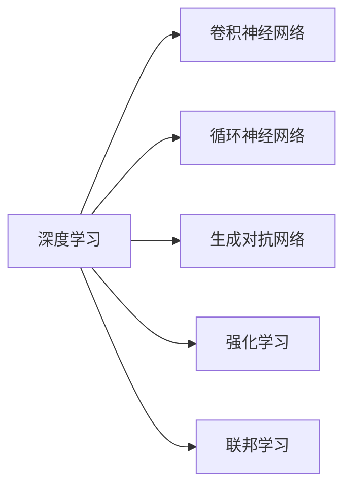

                 

## 1. 背景介绍

### 1.1 问题由来

Andrej Karpathy，作为深度学习领域的杰出代表之一，曾深度参与Google自动驾驶项目和Tesla自动驾驶系统的研发，对AI的未来发展有着独到的见解。本文将基于Andrej Karpathy在公开讲座、学术论文及社交媒体中的言论，探讨AI未来的发展前景。

### 1.2 问题核心关键点

当前，AI领域正面临许多关键问题，包括但不限于：

- **数据隐私和安全**：数据是AI的“石油”，如何在保护隐私的同时充分利用数据，是一个重要的挑战。
- **算法透明度和可解释性**：随着AI在各行业的普及，算法的可解释性变得尤为重要，尤其是在医疗、金融等高风险领域。
- **泛化能力与公平性**：AI模型的泛化能力和公平性问题，如何避免模型在特定数据集上过度拟合，以及如何减少偏见和歧视。
- **人机协作**：AI与人类如何更好地协作，以及如何构建可信任的人机交互系统。

通过这些问题的探讨，可以更全面地理解AI的发展趋势和未来的挑战。

## 2. 核心概念与联系

### 2.1 核心概念概述

- **深度学习(Deep Learning)**：一种基于神经网络的机器学习技术，通过多层非线性映射关系，从数据中学习到复杂的特征表示。
- **卷积神经网络(CNN)**：一种特殊的神经网络结构，常用于图像和视频处理，可以自动学习图像特征。
- **循环神经网络(RNN)**：一种可以处理序列数据的网络结构，常用于自然语言处理和时间序列分析。
- **生成对抗网络(GAN)**：一种可以生成新数据样本的模型，由生成器和判别器两部分组成，通过对抗训练生成逼真的样本。
- **强化学习(Reinforcement Learning, RL)**：通过试错的方式学习最优策略，广泛应用于游戏、机器人控制等领域。
- **联邦学习(Federated Learning)**：一种分布式学习技术，多方在不共享数据的前提下联合训练模型，保护用户隐私。

这些概念之间存在紧密的联系，共同构建了AI技术的框架体系。

### 2.2 核心概念原理和架构的 Mermaid 流程图



这个流程图展示了深度学习与其他核心概念之间的联系和依赖关系。

## 3. 核心算法原理 & 具体操作步骤

### 3.1 算法原理概述

AI技术的核心算法原理主要围绕以下几个方面展开：

- **特征提取与表示**：通过多层神经网络自动提取数据的特征表示，实现数据的高效利用。
- **模型训练与优化**：使用梯度下降等优化算法，最小化损失函数，提升模型性能。
- **迁移学习与微调**：利用预训练模型在特定任务上的微调，加速模型训练，提升泛化能力。
- **对抗训练与鲁棒性**：通过引入对抗样本，增强模型对噪声和攻击的鲁棒性。
- **联邦学习与隐私保护**：在多方数据不共享的前提下，联合训练模型，保护用户隐私。

### 3.2 算法步骤详解

**Step 1: 数据准备**

- 收集和预处理数据，确保数据质量和多样性。
- 进行数据增强，如旋转、缩放、噪声注入等，增加训练集的多样性。

**Step 2: 模型选择与初始化**

- 选择合适的模型架构，如CNN、RNN、Transformer等。
- 对模型进行初始化，设置学习率、批大小等超参数。

**Step 3: 模型训练与优化**

- 使用梯度下降等优化算法，最小化损失函数。
- 定期在验证集上评估模型性能，防止过拟合。
- 采用早停等策略，避免过拟合。

**Step 4: 模型评估与部署**

- 在测试集上评估模型性能，对比微调前后的效果。
- 使用微调后的模型对新数据进行预测，集成到实际应用系统中。
- 持续收集新数据，定期重新微调模型，以适应数据分布的变化。

### 3.3 算法优缺点

深度学习的优点：

- **强大表征能力**：通过多层非线性映射，自动提取数据的高阶特征。
- **高效泛化能力**：能够在大规模数据上进行训练，泛化能力强。
- **端到端处理**：可以直接从原始数据到最终结果，减少中间步骤。

深度学习的缺点：

- **计算资源消耗大**：需要大量计算资源进行训练。
- **模型复杂度高**：模型结构复杂，不易解释。
- **数据依赖性强**：依赖高质量标注数据，数据获取成本高。

### 3.4 算法应用领域

深度学习在众多领域中得到了广泛应用，包括但不限于：

- **计算机视觉**：如图像分类、目标检测、人脸识别等。
- **自然语言处理**：如机器翻译、文本生成、语音识别等。
- **自动驾驶**：如无人车驾驶、自动驾驶决策等。
- **医疗影像**：如疾病诊断、医学影像生成等。
- **金融预测**：如股票价格预测、信用评分等。

## 4. 数学模型和公式 & 详细讲解 & 举例说明

### 4.1 数学模型构建

以卷积神经网络为例，其数学模型可以表示为：

$$
y = \sigma(Wx + b)
$$

其中 $W$ 为卷积核，$x$ 为输入特征图，$b$ 为偏置项，$\sigma$ 为激活函数。

### 4.2 公式推导过程

以卷积神经网络的卷积操作为例，其推导过程如下：

$$
y = \sum_{i=1}^{n} w_i \cdot x_i
$$

其中 $w_i$ 为卷积核的第 $i$ 个元素，$x_i$ 为输入特征图的第 $i$ 个元素。

### 4.3 案例分析与讲解

以图像分类为例，卷积神经网络通过卷积层提取图像特征，然后通过池化层对特征进行降维，最终通过全连接层输出分类结果。

## 5. 项目实践：代码实例和详细解释说明

### 5.1 开发环境搭建

安装Python和相关库，如TensorFlow、PyTorch、Keras等，搭建开发环境。

### 5.2 源代码详细实现

以Keras实现卷积神经网络为例：

```python
from keras.models import Sequential
from keras.layers import Conv2D, MaxPooling2D, Flatten, Dense

model = Sequential()
model.add(Conv2D(32, (3, 3), activation='relu', input_shape=(28, 28, 1)))
model.add(MaxPooling2D((2, 2)))
model.add(Conv2D(64, (3, 3), activation='relu'))
model.add(MaxPooling2D((2, 2)))
model.add(Conv2D(64, (3, 3), activation='relu'))
model.add(Flatten())
model.add(Dense(64, activation='relu'))
model.add(Dense(10, activation='softmax'))

model.compile(optimizer='adam', loss='categorical_crossentropy', metrics=['accuracy'])
model.fit(train_images, train_labels, epochs=10, batch_size=32, validation_data=(test_images, test_labels))
```

### 5.3 代码解读与分析

代码实现了一个简单的卷积神经网络，包括卷积层、池化层、全连接层等。

## 6. 实际应用场景

### 6.1 计算机视觉

在计算机视觉领域，深度学习被广泛应用于图像分类、目标检测、人脸识别等任务，取得了显著的成果。例如，YOLO、SSD等目标检测模型，可以在实时场景下实现高精度的物体检测。

### 6.2 自然语言处理

在自然语言处理领域，深度学习被应用于机器翻译、文本生成、语音识别等任务。如Google的BERT模型，在自然语言理解任务上取得了最优的性能。

### 6.3 自动驾驶

在自动驾驶领域，深度学习被应用于图像处理、行为预测、决策规划等任务。例如，Tesla的自动驾驶系统，通过深度学习实现了高精度的目标检测和行为预测。

### 6.4 医疗影像

在医疗影像领域，深度学习被应用于疾病诊断、医学影像生成等任务。如Google的Inception模型，在图像分类和目标检测任务上取得了优异的性能。

## 7. 工具和资源推荐

### 7.1 学习资源推荐

- **《深度学习》（Ian Goodfellow著）**：深度学习领域的经典教材，全面介绍了深度学习的基本概念和算法。
- **《动手学深度学习》**：斯坦福大学深度学习课程的教材，提供了丰富的实践案例和代码。
- **Coursera深度学习课程**：由Andrew Ng开设的深度学习课程，涵盖深度学习的理论和实践。

### 7.2 开发工具推荐

- **PyTorch**：深度学习领域的领先框架，提供灵活的动态计算图。
- **TensorFlow**：Google推出的深度学习框架，支持分布式训练。
- **Keras**：高层次的深度学习框架，提供简单易用的API。

### 7.3 相关论文推荐

- **ImageNet Large Scale Visual Recognition Challenge (ILSVRC)**：计算机视觉领域的顶级比赛，展示了深度学习在图像识别任务上的成果。
- **BERT: Pre-training of Deep Bidirectional Transformers for Language Understanding**：BERT模型在自然语言理解任务上的突破性成果。
- **Playing Atari with Deep Reinforcement Learning**：AlphaGo在围棋领域的成功，展示了深度学习在强化学习任务上的潜力。

## 8. 总结：未来发展趋势与挑战

### 8.1 研究成果总结

深度学习在多个领域取得了显著的成果，但仍然面临诸多挑战，如数据隐私、算法透明性、泛化能力和公平性等。

### 8.2 未来发展趋势

- **数据隐私保护**：联邦学习、差分隐私等技术将进一步发展，保护用户隐私。
- **算法透明性**：可解释性、公平性等成为研究重点，提升算法的透明度和可解释性。
- **泛化能力和公平性**：优化模型结构，减少偏见和歧视，提升模型的泛化能力和公平性。
- **人机协作**：提升人机交互的自然性和智能性，构建可信任的人机协作系统。

### 8.3 面临的挑战

- **数据隐私和安全**：如何在保护隐私的同时充分利用数据，是一个重要的挑战。
- **算法透明度和可解释性**：算法的可解释性变得尤为重要，尤其是在高风险领域。
- **泛化能力与公平性**：避免模型在特定数据集上过度拟合，以及如何减少偏见和歧视。
- **人机协作**：如何构建可信任的人机交互系统，确保系统的可靠性和安全性。

### 8.4 研究展望

- **联邦学习**：分布式训练技术的发展将进一步推动深度学习在各行业的应用。
- **可解释性**：提升算法的可解释性，使其更具可信性和透明性。
- **泛化能力**：优化模型结构，提升模型的泛化能力和公平性。
- **人机协作**：构建可信任的人机协作系统，提升系统的自然性和智能性。

## 9. 附录：常见问题与解答

**Q1: 深度学习在计算机视觉中应用广泛，但在自然语言处理领域的效果如何？**

A: 深度学习在自然语言处理领域同样取得了显著的成果，如BERT模型在自然语言理解任务上取得了最优的性能。

**Q2: 深度学习模型为何需要大量计算资源？**

A: 深度学习模型的计算复杂度高，训练时需要大量计算资源进行反向传播和优化。

**Q3: 如何提升深度学习模型的泛化能力？**

A: 可以通过数据增强、对抗训练、正则化等方法提升模型的泛化能力。

**Q4: 如何提升深度学习模型的可解释性？**

A: 可以通过可视化、注意力机制等方法提升模型的可解释性。

**Q5: 深度学习在医疗影像中的应用前景如何？**

A: 深度学习在医疗影像中的应用前景广阔，可以通过图像分类、医学影像生成等任务提升医疗诊断的准确性和效率。

作者：禅与计算机程序设计艺术 / Zen and the Art of Computer Programming

