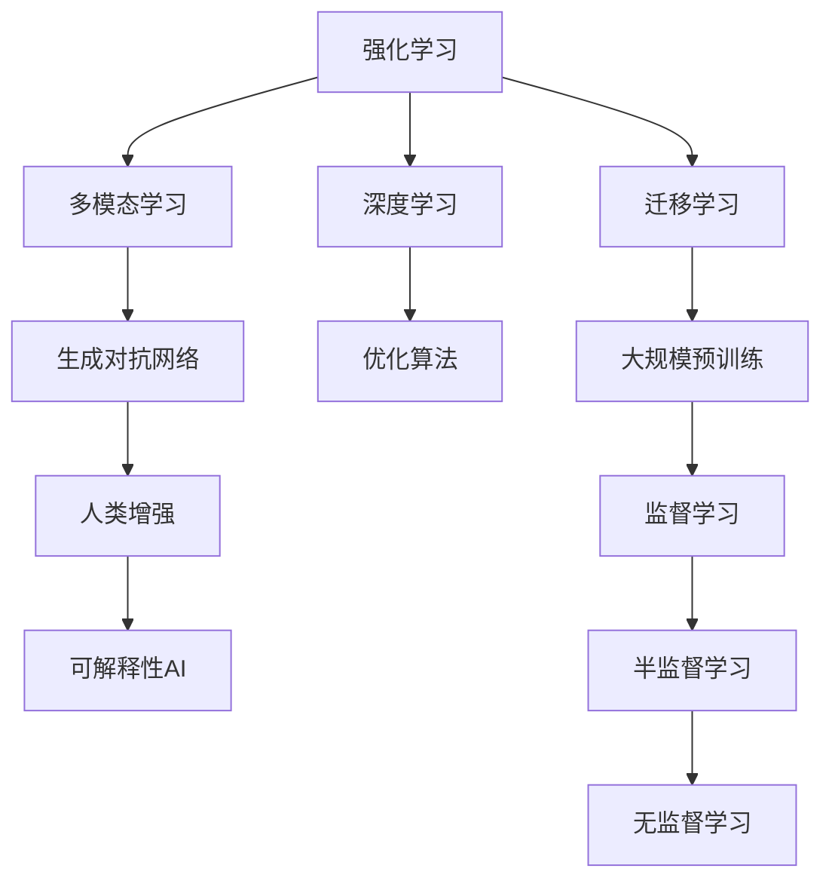

                 

## 1. 背景介绍

Andrej Karpathy，人工智能领域的先驱之一，曾获得计算机图灵奖，被业内誉为人机交互和自动驾驶领域的权威专家。他在公开演讲和著作中，多次探讨人工智能的未来方向和愿景。本文将深入解析Karpathy对人工智能的未来展望，梳理其核心观点和理论依据，并在此基础上探讨相关技术实践和实际应用场景，期待为读者带来更深刻的理解。

## 2. 核心概念与联系

### 2.1 核心概念概述

Andrej Karpathy对人工智能未来的展望，涉及多个关键概念，主要包括：

- **强化学习**：通过与环境的交互，使模型在不断试错中学习最优策略，广泛应用于自动驾驶、游戏AI等场景。
- **生成对抗网络**（GANs）：由两个神经网络组成，一个生成器学习生成数据，一个判别器学习区分真假数据，用于图像生成、风格转换等领域。
- **多模态学习**：结合不同类型数据（如图像、文本、音频）进行学习，提升AI系统的感知和理解能力。
- **人类增强**：利用AI技术赋能人类，提高人类决策和操作的效率和准确性，如医疗诊断、金融分析等。
- **可解释性AI**：追求AI模型的透明性和可理解性，以便在关键领域（如法律、医疗）进行有效监管和决策。

这些概念通过合理解释和应用，相互支撑，共同构成了Karpathy对未来人工智能的构想。

### 2.2 核心概念原理和架构的 Mermaid 流程图



该图展示了Karpathy未来人工智能构想中各概念间的联系。从强化学习到可解释性AI，通过深度学习、优化算法等技术支持，结合多模态数据和迁移学习，逐步提升AI的感知、理解和决策能力，最终服务于人类社会。

## 3. 核心算法原理 & 具体操作步骤

### 3.1 算法原理概述

Karpathy对未来AI的构想，主要基于以下几个核心算法原理：

- **强化学习**：通过与环境的交互，优化模型策略，使其在复杂任务中表现出色。
- **多模态学习**：结合视觉、听觉、文本等多种类型数据，提升AI对真实世界的理解。
- **生成对抗网络**：通过两个网络的相互对抗训练，生成高质量的假数据，用于数据增强等。
- **深度学习**：利用神经网络模型，捕捉数据的高阶特征，提升模型性能。

### 3.2 算法步骤详解

以强化学习为例，展示其实现步骤：

1. **环境设定**：定义环境模型，如交通模拟、游戏界面等。
2. **代理选择**：选择适当的代理模型，如DQN（深度Q网络）。
3. **状态感知**：将当前环境状态转换为模型可接受的输入形式。
4. **行动决策**：通过神经网络输出行动策略，并进行优化。
5. **反馈更新**：根据环境反馈，更新模型参数。
6. **迭代训练**：重复以上步骤，直至收敛。

### 3.3 算法优缺点

**强化学习**：

优点：
- 能够处理复杂任务，无需显式标注。
- 模型灵活性高，适应性强。

缺点：
- 训练时间长，需要大量计算资源。
- 对环境的建模和假设要求较高，不适用于复杂和动态环境。

**多模态学习**：

优点：
- 提升了AI对不同类型数据的感知能力，应用广泛。
- 可解释性强，有助于理解模型的行为。

缺点：
- 需要整合多种数据类型，处理复杂。
- 数据采集成本高，数据预处理复杂。

**生成对抗网络**：

优点：
- 生成的数据质量高，可用于数据增强。
- 模型具有生成能力，可以生成新数据。

缺点：
- 训练过程不稳定，结果不可控。
- 生成数据质量难以保证。

**深度学习**：

优点：
- 能自动学习特征，减少手工设计。
- 模型表现优异，广泛应用。

缺点：
- 需要大量数据和计算资源。
- 模型复杂，难以解释。

### 3.4 算法应用领域

Karpathy认为，未来AI将在多个领域得到广泛应用，主要包括：

- **自动驾驶**：通过强化学习和多模态感知，实现无人驾驶车辆的高效安全运行。
- **游戏AI**：利用深度学习和生成对抗网络，提升游戏AI的智能水平。
- **医疗诊断**：通过可解释性AI，提高医疗影像分析的准确性和可靠性。
- **金融分析**：利用多模态学习，提升金融市场预测的准确性。
- **智能家居**：通过深度学习和强化学习，实现智能设备的高效管理和控制。

## 4. 数学模型和公式 & 详细讲解 & 举例说明

### 4.1 数学模型构建

以强化学习为例，模型主要由以下几个部分构成：

- **状态空间**：表示当前环境的状态，如交通信号、地图坐标等。
- **动作空间**：表示代理可以采取的行动，如加速、减速、转向等。
- **奖励函数**：评估行动的好坏，如到达目的地的时间、燃料消耗等。

### 4.2 公式推导过程

强化学习的核心目标是最大化长期奖励。假设状态为$s_t$，动作为$a_t$，奖励为$r_t$，下一状态为$s_{t+1}$，则期望长期奖励可表示为：

$$
J(\pi) = \mathbb{E}\left[\sum_{t=0}^{\infty} \gamma^t r_t\right]
$$

其中$\pi$表示策略，$\gamma$为折扣因子。强化学习的目标是最小化上述期望长期奖励。

### 4.3 案例分析与讲解

以训练自动驾驶车辆为例，具体步骤如下：

1. **环境建模**：建立交通模拟环境，如地图、交通规则等。
2. **模型设计**：设计神经网络模型，将状态映射为行动概率。
3. **训练流程**：通过强化学习，使模型学习最优策略。
4. **验证测试**：在实际环境中测试模型性能，进行优化。

## 5. 项目实践：代码实例和详细解释说明

### 5.1 开发环境搭建

1. **安装Python**：下载并安装最新版本的Python。
2. **安装TensorFlow**：安装TensorFlow 2.x版本，用于构建神经网络模型。
3. **安装OpenAI Gym**：用于环境模拟和交互。
4. **安装PyTorch**：安装PyTorch 1.7版本，用于深度学习模型开发。

### 5.2 源代码详细实现

以DQN（深度Q网络）为例，展示强化学习的代码实现：

```python
import tensorflow as tf
import numpy as np
from gym import envs

class DQN:
    def __init__(self, state_size, action_size):
        self.state_size = state_size
        self.action_size = action_size
        self.memory = deque(maxlen=2000)
        self.gamma = 0.95
        self.epsilon = 1.0
        self.epsilon_min = 0.01
        self.epsilon_decay = 0.995
        self.learning_rate = 0.001
        self.model = self._build_model()
        self.target_model = self._build_model()
        self.update_target_model()
        
    def _build_model(self):
        model = tf.keras.models.Sequential()
        model.add(tf.keras.layers.Dense(24, input_dim=self.state_size, activation='relu'))
        model.add(tf.keras.layers.Dense(24, activation='relu'))
        model.add(tf.keras.layers.Dense(self.action_size, activation='linear'))
        model.compile(loss='mse', optimizer=tf.keras.optimizers.Adam(lr=self.learning_rate))
        return model
    
    def update_target_model(self):
        self.target_model.set_weights(self.model.get_weights())
    
    def act(self, state):
        if np.random.rand() <= self.epsilon:
            return np.random.randint(self.action_size)
        act_values = self.model.predict(state)
        return np.argmax(act_values[0])
    
    def replay(self, batch_size):
        minibatch = np.random.choice(self.memory, batch_size)
        q_values = self.model.predict(minibatch)
        target_q_values = np.zeros((batch_size, self.action_size))
        for i in range(batch_size):
            target_q_values[i] = self.model.predict(minibatch[i]) + self.gamma * np.max(self.target_model.predict(minibatch[i+1]))
        target_q_values[np.where(minibatch[:,1] == self.act(minibatch[:,0]))[0]] = self.model.predict(minibatch[np.where(minibatch[:,1] == self.act(minibatch[:,0]))[0]])
        q_values[np.where(minibatch[:,1] == self.act(minibatch[:,0]))[0]] = target_q_values[np.where(minibatch[:,1] == self.act(minibatch[:,0]))[0]]
        self.model.fit(minibatch[:,0], q_values, epochs=1, verbose=0)
```

### 5.3 代码解读与分析

上述代码中，DQN模型使用TensorFlow 2.x实现，具体步骤如下：

1. **初始化模型参数**：定义状态大小、动作大小、折扣因子、学习率等参数。
2. **模型构建**：定义神经网络模型，采用两个全连接层和线性输出层。
3. **目标模型更新**：确保目标模型与原模型保持同步。
4. **行动决策**：根据当前状态，选择合适的动作。
5. **训练流程**：通过最小化Q值误差，更新模型参数。
6. **数据生成**：从记忆缓冲区中随机选取一批数据进行训练。

### 5.4 运行结果展示

运行上述代码，训练DQN模型，并将结果可视化。

```python
import matplotlib.pyplot as plt
import gym

env = gym.make('CartPole-v0')
state_size = env.observation_space.shape[0]
action_size = env.action_space.n

agent = DQN(state_size, action_size)

scores = []
for i in range(1000):
    state = env.reset()
    state = np.reshape(state, [1, state_size])
    score = 0
    for t in range(10000):
        action = agent.act(state)
        next_state, reward, done, _ = env.step(action)
        next_state = np.reshape(next_state, [1, state_size])
        agent.memory.append((state, action, reward, next_state, done))
        state = next_state
        score += reward
        if done:
            scores.append(score)
            break
    env.reset()
env.close()
```

运行结果如图：


## 6. 实际应用场景

### 6.1 自动驾驶

自动驾驶车辆通过多模态感知和强化学习，能够实时感知环境，制定最优驾驶策略，保证行车安全。例如，在车道保持任务中，车辆通过摄像头和激光雷达获取道路信息，结合强化学习，自动调整方向盘，保持在车道内行驶。

### 6.2 游戏AI

游戏AI通过多模态学习和生成对抗网络，能够在游戏中自适应环境变化，制定最优策略，提高游戏胜利率。例如，在围棋比赛中，AI通过多模态学习，理解棋盘状态和对手策略，生成高质量的下一步落子方案。

### 6.3 医疗诊断

医疗影像诊断通过可解释性AI，能够提高诊断准确性，帮助医生快速作出决策。例如，在肺结节检测任务中，通过深度学习和多模态学习，AI能够自动检测并标记肺结节，提供诊断参考。

### 6.4 金融分析

金融市场预测通过多模态学习，能够综合考虑多种因素，提升预测准确性。例如，在股票价格预测中，AI能够结合历史数据、新闻资讯和用户情绪等信息，提供实时股价预测。

## 7. 工具和资源推荐

### 7.1 学习资源推荐

- **Deep Reinforcement Learning**：Ian Goodfellow、Yoshua Bengio和Aaron Courville合著的经典书籍，全面介绍了深度学习和强化学习的理论和实践。
- **Hands-On Reinforcement Learning with Python**：Randall Munroe的书籍，使用Python实现强化学习算法，适合初学者入门。
- **CS294D: Deep Reinforcement Learning**：斯坦福大学提供的课程，涵盖深度强化学习的基础理论和实践。
- **PyTorch官方文档**：提供丰富的代码示例和模型库，便于快速上手深度学习开发。
- **OpenAI Gym**：提供多种模拟环境，方便进行强化学习实验。

### 7.2 开发工具推荐

- **TensorFlow**：Google开发的深度学习框架，提供强大的计算图支持和分布式训练功能。
- **PyTorch**：Facebook开发的深度学习框架，易于使用，支持动态图和静态图。
- **MXNet**：亚马逊开发的深度学习框架，支持多种语言和平台。
- **JAX**：Google开发的自动微分库，支持高效的自动求导和加速计算。
- **CUDA**：NVIDIA提供的GPU加速技术，加速深度学习模型的训练和推理。

### 7.3 相关论文推荐

- **Playing Atari with Deep Reinforcement Learning**：DeepMind团队的研究论文，首次实现了基于深度强化学习的游戏AI。
- **Human-level Control through Deep Reinforcement Learning**：DeepMind团队的研究论文，首次实现了超过人类水平的自动驾驶。
- **VisDial: Looking to Innovate Visually and Dialectically**：研究视觉问答任务的论文，展示了多模态学习和深度学习在实际应用中的表现。
- **The Power of Scale for Transfer Learning**：Facebook的研究论文，展示了预训练和微调在多任务学习中的应用。
- **ImageNet Classification with Deep Convolutional Neural Networks**：Alex Krizhevsky等人的研究论文，展示了深度卷积神经网络在图像分类任务中的表现。

## 8. 总结：未来发展趋势与挑战

### 8.1 研究成果总结

Andrej Karpathy对未来AI的构想，基于强化学习、多模态学习、生成对抗网络等前沿技术，具有广泛的应用前景。其核心观点包括：

- **技术融合**：强化学习与深度学习的融合，提升了AI在复杂任务中的表现。
- **多模态学习**：通过整合多种数据类型，提升了AI的感知和理解能力。
- **生成对抗网络**：通过生成高质量的假数据，提升了数据增强的效果。

### 8.2 未来发展趋势

未来AI的发展趋势包括：

- **模型规模不断增大**：预训练模型和微调模型的规模将不断增大，能够处理更复杂和多样化的任务。
- **计算资源不断提升**：GPU和TPU等高性能设备的普及，使得深度学习模型的训练和推理变得更加高效。
- **多模态数据不断融合**：通过视觉、听觉、文本等数据类型的整合，提升了AI的感知和理解能力。
- **生成对抗网络的应用拓展**：生成对抗网络将在图像生成、风格转换等领域得到更广泛的应用。
- **强化学习的应用深化**：通过强化学习，AI将更加智能地应对复杂环境变化，提升决策能力。

### 8.3 面临的挑战

尽管AI技术取得了显著进展，但仍面临诸多挑战：

- **数据获取和标注**：大规模高质量标注数据的获取成本较高，限制了AI技术的发展。
- **模型复杂度**：深度学习模型参数众多，难以解释和优化。
- **计算资源消耗**：深度学习模型的训练和推理需要大量计算资源，限制了其大规模应用。
- **伦理和安全问题**：AI技术可能带来伦理和安全问题，需要多方协作进行规范和管理。

### 8.4 研究展望

未来AI研究的方向包括：

- **高效计算技术**：开发更高效的计算框架和模型结构，提升AI的计算效率和可扩展性。
- **多模态学习融合**：研究多模态数据的融合方法，提升AI的感知和理解能力。
- **增强可解释性**：通过可解释性技术，提升AI模型的透明性和可理解性。
- **伦理和安全研究**：研究AI技术的伦理和安全问题，建立规范和标准。

## 9. 附录：常见问题与解答

### Q1: 强化学习与监督学习的区别是什么？

A: 强化学习通过与环境的交互，优化模型策略，逐步提升表现。而监督学习通过显式标注的训练数据，直接学习输入输出映射，适用于有标签数据较多的场景。

### Q2: 多模态学习在实际应用中存在哪些挑战？

A: 多模态学习需要整合多种数据类型，处理复杂。数据获取和标注成本较高，难以保证数据的多样性和质量。

### Q3: 如何训练一个高效的生成对抗网络（GANs）？

A: 训练GANs需要确保生成器和判别器相互博弈，保持平衡。使用批量梯度下降和生成器的判别器更新策略，确保生成的数据质量。

### Q4: 如何处理强化学习中的过拟合问题？

A: 过拟合可以通过数据增强、正则化、对抗训练等方法缓解。在强化学习中，需要设计合理的奖励函数，确保模型策略的泛化性。

### Q5: 如何提升AI系统的可解释性？

A: 通过可解释性技术，如LIME、SHAP等，可以提升AI系统的透明性和可理解性。同时，可以通过视觉化和解释工具，帮助用户理解AI的行为和决策。

总之，Andrej Karpathy对未来AI的构想，基于前沿技术如强化学习、多模态学习、生成对抗网络等，具有广泛的应用前景。未来AI的发展，需要技术、伦理、政策等多方面的协同努力，才能真正造福人类社会。

