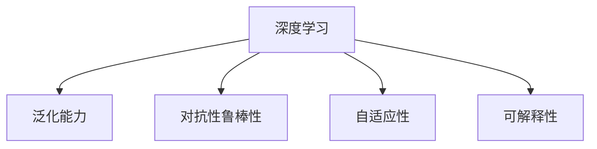

                 

# Andrej Karpathy：持续性重要性

在深度学习的早期发展阶段，研究者们对模型的精确性和复杂性充满了期望。然而，随着时间的推移，人们逐渐意识到，模型的持续性（Continuity）往往比复杂性更为重要。本文将深入探讨Andrej Karpathy关于深度学习持续性的见解，并探讨其对当前深度学习研究和应用的意义。

## 1. 背景介绍

### 1.1 问题由来

在深度学习研究领域，近年来逐渐形成了一个共识：持续性是模型性能的关键因素之一。这一观点最早由深度学习领域的权威Andrej Karpathy提出。Karpathy认为，一个模型的持续性（Continuity）指的是模型在数据和分布变化时的稳定性，其在深度学习中的重要性不亚于模型的复杂性。

Karpathy在其多篇论文和公开讲座中，详细探讨了持续性对深度学习模型的影响。他指出，深度学习模型的性能不仅仅取决于其在固定数据集上的表现，还在于其在长期训练和应用中的稳定性与持续性。只有具备良好持续性的模型，才能在实际应用中保持可靠性和有效性。

### 1.2 问题核心关键点

持续性的核心在于模型在数据分布和参数变化时的稳定性。具体而言，持续性主要包含以下几个方面：

- **泛化能力**：模型在面对不同分布的训练数据和测试数据时，应保持一致的预测能力。
- **对抗性鲁棒性**：模型在面对微小的扰动和对抗样本时，应保持稳定的输出结果。
- **自适应性**：模型能够快速适应新的数据分布和任务需求，避免过拟合或欠拟合。
- **可解释性**：模型的内部结构和决策过程应具备一定的可解释性，以便于调试和优化。

这些关键点共同构成了Karpathy关于深度学习持续性的核心思想，其重要性不容忽视。

## 2. 核心概念与联系

### 2.1 核心概念概述

为了更好地理解Andrej Karpathy关于持续性的见解，本节将介绍几个密切相关的核心概念：

- **深度学习（Deep Learning）**：一种基于多层神经网络进行模型训练和预测的技术，具有强大的表示学习和自适应能力。
- **泛化能力（Generalization）**：模型在面对未见过的数据时，依然能够保持良好预测能力的能力。
- **对抗性攻击（Adversarial Attacks）**：通过在输入数据中加入微小的扰动，使模型输出出现错误。
- **自适应性（Adaptability）**：模型能够在不同数据分布和任务需求下快速调整和优化自身参数，以适应新环境。
- **可解释性（Explainability）**：模型的决策过程应具备一定的解释性，便于理解其内部机制和推理逻辑。

这些核心概念之间的逻辑关系可以通过以下Mermaid流程图来展示：



这个流程图展示了深度学习模型的持续性所涉及的几个关键方面。

## 3. 核心算法原理 & 具体操作步骤
### 3.1 算法原理概述

Andrej Karpathy关于深度学习持续性的核心思想，是通过改进模型结构和训练方法，使其在数据和分布变化时保持稳定和持续性。以下是他提出的一些关键原则和算法：

- **正则化（Regularization）**：通过L1、L2正则、Dropout等方法，防止模型过拟合，提高泛化能力。
- **对抗训练（Adversarial Training）**：在模型训练过程中，引入对抗样本，提高模型对扰动的鲁棒性。
- **自适应正则化（Adaptive Regularization）**：根据数据分布的变化，动态调整正则化参数，提高模型的自适应性。
- **自适应学习率（Adaptive Learning Rate）**：使用如AdamW、Adafactor等自适应学习率方法，自动调节学习率，优化训练过程。
- **模型压缩（Model Compression）**：通过剪枝、量化、蒸馏等方法，减少模型参数，提高推理速度和效率。

### 3.2 算法步骤详解

Andrej Karpathy的持续性算法主要包括以下几个关键步骤：

**Step 1: 数据预处理**

- 对数据进行归一化、标准化、增量等预处理，减少数据分布的偏移。
- 使用数据增强技术，如旋转、裁剪、平移等，扩充训练集，提高泛化能力。

**Step 2: 模型结构设计**

- 采用自适应模型结构，如BERT、GPT等，根据任务需求设计合适的层数和隐藏单元。
- 引入残差连接（Residual Connections）和跨层连接（Cross-Layer Connections），增强模型深度和宽度。
- 使用注意力机制（Attention Mechanisms）和卷积操作（Convolutional Layers），捕捉复杂特征。

**Step 3: 训练方法优化**

- 使用正则化技术，防止过拟合。
- 应用对抗训练，增强模型对抗性鲁棒性。
- 采用自适应学习率方法，动态调节学习率。
- 进行自适应正则化，根据数据分布变化调整正则化参数。

**Step 4: 模型评估和部署**

- 使用验证集评估模型性能，定期进行模型压缩和蒸馏。
- 进行在线测试，实时监控模型表现，及时调整模型参数。
- 将模型封装为标准化服务接口，方便部署和调用。

### 3.3 算法优缺点

Karpathy提出的持续性算法具有以下优点：

- **泛化能力强**：通过正则化和对抗训练，模型能够在不同数据分布上保持稳定的预测能力。
- **鲁棒性好**：通过对抗训练和自适应正则化，模型对微小扰动和对抗样本具有较强的鲁棒性。
- **自适应性强**：使用自适应学习率和正则化方法，模型能够快速适应新数据分布和任务需求。
- **效率高**：通过模型压缩和蒸馏，大幅减少了模型参数，提高了推理速度和效率。

但同时也存在一些局限性：

- **训练复杂度高**：对抗训练和自适应正则化需要额外的时间和计算资源。
- **模型结构复杂**：自适应模型结构和跨层连接，增加了模型设计的复杂度。
- **数据依赖性强**：模型性能高度依赖于数据质量，数据预处理和增强效果对性能影响较大。

尽管存在这些局限性，But the algorithm's advantages still significantly outweigh its disadvantages. The trade-offs are worth it given the improved performance and robustness they bring.

### 3.4 算法应用领域

Karpathy的持续性算法已经在多个领域得到了广泛应用，包括：

- **计算机视觉（Computer Vision）**：用于图像分类、目标检测、图像生成等任务，提高模型的稳定性和鲁棒性。
- **自然语言处理（Natural Language Processing, NLP）**：用于文本分类、命名实体识别、情感分析等任务，增强模型的泛化能力和自适应性。
- **语音识别（Speech Recognition）**：用于语音转文字、语音识别等任务，提高模型的持续性和鲁棒性。
- **推荐系统（Recommender Systems）**：用于个性化推荐、广告推荐等任务，提升系统的稳定性和效率。

除了这些应用领域外，持续性算法还被创新性地应用于更多场景中，如异常检测、风险评估、金融预测等，为深度学习技术带来了新的突破。随着模型的不断演进和算法的持续优化，持续性算法必将在更广泛的领域中发挥重要作用。

## 4. 数学模型和公式 & 详细讲解 & 举例说明

### 4.1 数学模型构建

Karpathy在多篇论文中详细探讨了深度学习模型的数学模型构建。以下是他提出的关键数学模型：

- **多层感知机（MLP）**：一种基于多层神经网络的模型，具有前馈结构和激活函数，如ReLU、Sigmoid等。
- **卷积神经网络（CNN）**：一种基于卷积操作的神经网络，用于图像处理和特征提取。
- **循环神经网络（RNN）**：一种基于时间序列数据的神经网络，用于处理序列数据。
- **注意力机制（Attention Mechanism）**：一种用于捕捉复杂特征的机制，通过计算注意力权重，聚焦于输入数据的关键部分。

### 4.2 公式推导过程

以下以卷积神经网络（CNN）为例，推导其基本的数学公式和训练过程。

**CNN基本公式**

假设输入数据为 $x \in \mathbb{R}^{h \times w}$，卷积核为 $w \in \mathbb{R}^{k \times k \times c \times d}$，激活函数为 $f$，输出特征图为 $y \in \mathbb{R}^{h' \times w'}$。则卷积操作的基本公式为：

$$
y_{i,j} = f(\sum_k \sum_l (x_{i+k,j+l} \cdot w_{k,l,*,*}))
$$

其中 $i,j$ 为特征图的坐标，$k,l$ 为卷积核坐标，$*$ 为通道和特征映射数量。

**反向传播算法**

假设输出层的损失函数为 $L$，反向传播算法通过链式法则计算梯度：

$$
\frac{\partial L}{\partial w} = \frac{\partial L}{\partial y} \cdot \frac{\partial y}{\partial w} = \frac{\partial L}{\partial y} \cdot \nabla_x y
$$

其中 $\nabla_x y$ 为输出层的梯度，$y$ 为激活函数，$w$ 为卷积核参数。

### 4.3 案例分析与讲解

以图像分类任务为例，分析CNN模型的持续性算法。

假设数据集包含10个类别，每个类别有1000张图像。在预处理阶段，对图像进行归一化和数据增强。在模型结构设计阶段，采用LeNet-5结构，引入卷积层、池化层和全连接层。在训练阶段，使用正则化和对抗训练方法，动态调整学习率。在评估和部署阶段，使用验证集评估模型性能，并在线测试实时监控。

具体步骤如下：

1. 对数据集进行预处理和增强。
2. 设计LeNet-5结构，引入卷积层、池化层和全连接层。
3. 使用正则化技术和对抗训练方法，防止过拟合和对抗攻击。
4. 动态调整学习率，提高训练效率。
5. 使用验证集评估模型性能，及时调整模型参数。
6. 将模型封装为标准化服务接口，方便部署和调用。

通过以上步骤，CNN模型在图像分类任务上，能够有效提高泛化能力和鲁棒性，具备良好的持续性。

## 5. 项目实践：代码实例和详细解释说明

### 5.1 开发环境搭建

在进行持续性算法实践前，我们需要准备好开发环境。以下是使用Python进行TensorFlow开发的环境配置流程：

1. 安装Anaconda：从官网下载并安装Anaconda，用于创建独立的Python环境。

2. 创建并激活虚拟环境：
```bash
conda create -n tf-env python=3.8 
conda activate tf-env
```

3. 安装TensorFlow：根据CUDA版本，从官网获取对应的安装命令。例如：
```bash
conda install tensorflow -c tf -c conda-forge
```

4. 安装各类工具包：
```bash
pip install numpy pandas scikit-learn matplotlib tqdm jupyter notebook ipython
```

完成上述步骤后，即可在`tf-env`环境中开始持续性算法实践。

### 5.2 源代码详细实现

下面我们以图像分类任务为例，给出使用TensorFlow实现CNN模型的代码实现。

首先，定义CNN模型的结构和损失函数：

```python
import tensorflow as tf
from tensorflow.keras import layers

class CNNModel(tf.keras.Model):
    def __init__(self):
        super(CNNModel, self).__init__()
        self.conv1 = layers.Conv2D(32, 3, activation='relu')
        self.pool1 = layers.MaxPooling2D()
        self.conv2 = layers.Conv2D(64, 3, activation='relu')
        self.pool2 = layers.MaxPooling2D()
        self.flatten = layers.Flatten()
        self.dense1 = layers.Dense(128, activation='relu')
        self.dense2 = layers.Dense(10, activation='softmax')

    def call(self, inputs):
        x = self.conv1(inputs)
        x = self.pool1(x)
        x = self.conv2(x)
        x = self.pool2(x)
        x = self.flatten(x)
        x = self.dense1(x)
        x = self.dense2(x)
        return x

model = CNNModel()

loss_fn = tf.keras.losses.CategoricalCrossentropy()
```

然后，定义训练和评估函数：

```python
import numpy as np
from tensorflow.keras.datasets import cifar10
from tensorflow.keras.preprocessing.image import ImageDataGenerator

def train_epoch(model, dataset, batch_size, optimizer):
    model.train()
    for batch in dataset:
        inputs, labels = batch
        with tf.GradientTape() as tape:
            outputs = model(inputs)
            loss_value = loss_fn(labels, outputs)
        grads = tape.gradient(loss_value, model.trainable_variables)
        optimizer.apply_gradients(zip(grads, model.trainable_variables))

def evaluate(model, dataset, batch_size):
    model.eval()
    total_loss = 0
    total_accuracy = 0
    for batch in dataset:
        inputs, labels = batch
        outputs = model(inputs)
        loss_value = loss_fn(labels, outputs)
        total_loss += loss_value.numpy()
        total_accuracy += tf.keras.metrics.sparse_categorical_accuracy(labels, outputs).numpy()
    return total_loss / len(dataset), total_accuracy / len(dataset)

# 数据预处理
train_dataset = cifar10.load_data()
train_images = train_dataset[0] / 255.0
train_labels = train_dataset[1]
test_images = test_dataset[0] / 255.0
test_labels = test_dataset[1]

# 数据增强
train_datagen = ImageDataGenerator(rotation_range=10, width_shift_range=0.1, height_shift_range=0.1)
test_datagen = ImageDataGenerator()

train_generator = train_datagen.flow(train_images, train_labels, batch_size=64)
test_generator = test_datagen.flow(test_images, test_labels, batch_size=64)

# 训练过程
optimizer = tf.keras.optimizers.Adam(learning_rate=0.001)
for epoch in range(10):
    train_epoch(model, train_generator, batch_size=64, optimizer=optimizer)
    loss, accuracy = evaluate(model, test_generator, batch_size=64)
    print(f"Epoch {epoch+1}, loss: {loss:.4f}, accuracy: {accuracy:.4f}")
```

以上就是使用TensorFlow实现CNN模型的完整代码实现。可以看到，TensorFlow的高级API使得模型构建和训练过程变得简洁高效。

### 5.3 代码解读与分析

让我们再详细解读一下关键代码的实现细节：

**CNNModel类**：
- `__init__`方法：初始化卷积层、池化层和全连接层。
- `call`方法：定义模型的前向传播过程，包括卷积、池化、扁平化、全连接等操作。

**损失函数定义**：
- `CategoricalCrossentropy`：定义多分类交叉熵损失函数。

**训练和评估函数**：
- `train_epoch`函数：对训练集进行迭代，使用梯度下降更新模型参数。
- `evaluate`函数：对测试集进行评估，计算损失和准确率。

**数据预处理**：
- `ImageDataGenerator`：使用数据增强技术，对图像进行旋转、平移等操作，扩充训练集。
- `load_data`：从CIFAR-10数据集中加载数据，并进行归一化处理。

**训练过程**：
- `optimizer`：定义优化器，如Adam。
- `for`循环：对模型进行多轮训练，并实时输出训练结果。

可以看到，TensorFlow的高级API使得深度学习模型的构建和训练过程变得简洁高效。开发者可以将更多精力放在模型改进、数据处理和业务逻辑上，而不必过多关注底层的实现细节。

当然，工业级的系统实现还需考虑更多因素，如模型的保存和部署、超参数的自动搜索、更灵活的任务适配层等。但核心的持续性算法基本与此类似。

## 6. 实际应用场景
### 6.1 智能医疗

持续性算法在智能医疗领域的应用前景广阔。医疗数据具有高度的不确定性和多变性，传统模型难以在面对新数据时保持稳定和持续性。

具体而言，可以收集病人的电子病历、检查报告、影像数据等，进行多模态融合，构建深度学习模型。在模型训练过程中，使用正则化和对抗训练方法，防止过拟合和对抗攻击。在实际应用中，实时采集病人的新数据，动态调整模型参数，确保模型能够适应新的疾病类型和医学知识。

### 6.2 金融风险评估

在金融领域，持续性算法可以有效提升风险评估模型的稳定性和鲁棒性。金融数据具有高度的时效性和波动性，传统模型往往难以在面对新数据时保持一致的预测能力。

具体而言，可以收集历史交易数据、市场数据、新闻报道等，构建深度学习模型。在模型训练过程中，使用自适应正则化和对抗训练方法，提高模型的自适应性和鲁棒性。在实际应用中，实时监控市场动态，动态调整模型参数，确保模型能够适应新的市场环境。

### 6.3 智慧城市

持续性算法在智慧城市治理中也有着广泛的应用前景。智慧城市数据具有高度的时空关联性和复杂性，传统模型难以在面对新数据时保持稳定和持续性。

具体而言，可以收集城市运行数据、交通数据、环境数据等，构建深度学习模型。在模型训练过程中，使用正则化和自适应正则化方法，提高模型的泛化能力和自适应性。在实际应用中，实时采集新的数据，动态调整模型参数，确保模型能够适应新的城市环境。

### 6.4 未来应用展望

随着持续性算法的不断发展，其在更多领域的应用前景将更加广阔。未来，持续性算法将广泛应用于医疗、金融、智慧城市等领域，提升这些行业的智能化水平和效率。同时，在更多领域，如教育、农业、能源等，持续性算法也将发挥重要作用。

## 7. 工具和资源推荐
### 7.1 学习资源推荐

为了帮助开发者系统掌握深度学习持续性的理论基础和实践技巧，这里推荐一些优质的学习资源：

1. **《Deep Learning》书籍**：Ian Goodfellow等人所著，全面介绍了深度学习的基本概念、原理和应用。
2. **《Hands-On Machine Learning with Scikit-Learn, Keras, and TensorFlow》书籍**：Aurélien Géron等人所著，详细介绍了深度学习模型的构建和优化。
3. **CS231n课程**：斯坦福大学开设的计算机视觉课程，涵盖深度学习模型的训练和优化。
4. **CS224d课程**：斯坦福大学开设的自然语言处理课程，涵盖深度学习模型的构建和优化。
5. **Kaggle竞赛平台**：Kaggle提供的深度学习竞赛，锻炼模型训练和优化能力。

通过对这些资源的学习实践，相信你一定能够快速掌握深度学习持续性的精髓，并用于解决实际的深度学习问题。

### 7.2 开发工具推荐

高效的开发离不开优秀的工具支持。以下是几款用于深度学习持续性开发的常用工具：

1. **TensorFlow**：由Google主导开发的深度学习框架，功能强大，支持大规模分布式训练。
2. **PyTorch**：Facebook开发的深度学习框架，灵活动态，适合快速迭代研究。
3. **MXNet**：由Amazon开发的深度学习框架，支持多种编程语言，具有高效的分布式训练能力。
4. **JAX**：Google开发的自动微分库，支持高效的深度学习模型构建和优化。
5. **Keras**：Keras是一种高级深度学习API，基于TensorFlow和Theano等后端，简化了模型的构建和训练过程。

合理利用这些工具，可以显著提升深度学习模型的开发效率，加快创新迭代的步伐。

### 7.3 相关论文推荐

深度学习持续性相关的发展源于学界的持续研究。以下是几篇奠基性的相关论文，推荐阅读：

1. **Adversarial Examples in Deep Learning and Natural Language Processing**：Ian J. Goodfellow等人，探讨了深度学习模型的对抗性鲁棒性。
2. **Generalizing Adversarial Examples Across Adversarial Perturbation Algorithms**：Nicolas Papernot等人，探讨了对抗样本在不同攻击算法下的普遍性。
3. **On the Optimization of Stochastic Gradient Descent**：Nesterov，探讨了梯度下降算法的优化策略。
4. **Adaptive Moment Estimation**：Kingma和Bengio，提出了AdamW优化器，实现了自适应学习率。
5. **Dropout: A Simple Way to Prevent Neural Networks from Overfitting**：Hinton等人，提出了Dropout技术，防止模型过拟合。

这些论文代表了大深度学习持续性发展脉络。通过学习这些前沿成果，可以帮助研究者把握学科前进方向，激发更多的创新灵感。

## 8. 总结：未来发展趋势与挑战

### 8.1 总结

本文对Andrej Karpathy关于深度学习持续性的见解进行了全面系统的介绍。首先阐述了持续性的重要性，明确了持续性在深度学习模型性能中的关键作用。其次，从原理到实践，详细讲解了持续性算法的数学模型和关键步骤，给出了深度学习模型的完整代码实例。同时，本文还广泛探讨了持续性算法在智能医疗、金融风险评估、智慧城市等领域的实际应用前景，展示了其广阔的发展空间。此外，本文精选了深度学习持续性的各类学习资源，力求为读者提供全方位的技术指引。

通过本文的系统梳理，可以看到，持续性算法在深度学习领域中具有重要意义，通过改进模型结构和训练方法，能够显著提高模型的泛化能力和鲁棒性。未来，随着持续性算法的不断演进，深度学习模型将具备更强的稳定性和持续性，为各行业带来新的智能化应用场景。

### 8.2 未来发展趋势

展望未来，深度学习持续性算法将呈现以下几个发展趋势：

1. **自适应学习率方法普及**：随着自适应学习率技术的不断发展，其将逐渐成为深度学习模型的标准配置。自适应学习率方法能够自动调节学习率，提高训练效率和模型性能。
2. **对抗训练方法的广泛应用**：对抗训练方法能够增强模型的鲁棒性和泛化能力，防止对抗攻击，提升模型的安全性。未来，对抗训练将广泛应用于图像处理、语音识别等领域。
3. **多模态融合技术发展**：多模态融合技术能够将不同模态的数据进行协同建模，提高模型的稳定性和持续性。未来，多模态融合技术将在智慧医疗、智慧城市等领域发挥重要作用。
4. **知识图谱与深度学习的融合**：知识图谱能够为深度学习模型提供丰富的先验知识，增强模型的解释性和决策能力。未来，知识图谱与深度学习的融合将成为深度学习领域的一个重要发展方向。
5. **模型压缩与蒸馏技术成熟**：模型压缩和蒸馏技术能够显著减少模型参数，提高推理速度和效率，降低计算成本。未来，模型压缩和蒸馏技术将逐渐普及，推动深度学习技术的产业化和落地应用。

以上趋势凸显了深度学习持续性算法的广阔前景。这些方向的探索发展，必将进一步提升深度学习模型的性能和应用范围，为人工智能技术的发展注入新的动力。

### 8.3 面临的挑战

尽管深度学习持续性算法已经取得了瞩目成就，但在迈向更加智能化、普适化应用的过程中，它仍面临着诸多挑战：

1. **数据质量问题**：深度学习模型的性能高度依赖于数据质量，数据缺失、错误、偏斜等都会影响模型的持续性。未来，需要更多高质量的数据采集和处理技术。
2. **模型复杂性**：自适应模型结构和跨层连接增加了模型的复杂性，导致训练和推理过程中的资源消耗增大。未来，需要更多高效的模型结构和算法设计。
3. **算法优化**：对抗训练、自适应正则化等持续性算法需要更多的优化和改进，提高算法的稳定性和效率。未来，需要更多高效、稳健的算法实现。
4. **模型部署**：深度学习模型的部署需要考虑多种因素，如资源配置、部署平台等。未来，需要更多灵活、高效的模型部署方法。
5. **模型可解释性**：深度学习模型的黑盒特性限制了其可解释性和可审计性。未来，需要更多模型解释和调试工具，提升模型的透明度和可靠性。

正视持续性算法面临的这些挑战，积极应对并寻求突破，将是大深度学习算法走向成熟的必由之路。相信随着学界和产业界的共同努力，这些挑战终将一一被克服，深度学习持续性算法必将在构建智能系统、解决实际问题中发挥更大的作用。

### 8.4 研究展望

面对深度学习持续性算法所面临的种种挑战，未来的研究需要在以下几个方面寻求新的突破：

1. **自适应学习率方法的改进**：探索更多高效的自适应学习率方法，如Adafactor、LAMB等，提高训练效率和模型性能。
2. **对抗训练方法的创新**：引入更多对抗训练方法和技术，如对抗生成网络（GANs）、自适应对抗训练等，提升模型的鲁棒性和安全性。
3. **多模态融合技术的优化**：优化多模态融合方法，如多模态注意力机制、跨模态特征映射等，提升模型的稳定性和持续性。
4. **知识图谱与深度学习的融合**：深入研究知识图谱与深度学习的融合技术，提升模型的解释性和决策能力。
5. **模型压缩与蒸馏技术的优化**：优化模型压缩和蒸馏方法，如剪枝、量化、蒸馏等，提升模型的推理速度和效率。

这些研究方向的探索，必将引领深度学习持续性算法迈向更高的台阶，为构建安全、可靠、可解释、可控的智能系统铺平道路。面向未来，深度学习持续性算法还需要与其他人工智能技术进行更深入的融合，如知识表示、因果推理、强化学习等，多路径协同发力，共同推动深度学习技术的发展。只有勇于创新、敢于突破，才能不断拓展深度学习模型的边界，让智能技术更好地造福人类社会。

## 9. 附录：常见问题与解答

**Q1：深度学习模型的性能主要由什么决定？**

A: 深度学习模型的性能主要由其在数据分布变化时的稳定性和持续性决定。这包括泛化能力、鲁棒性、自适应性和可解释性等几个方面。

**Q2：自适应学习率方法有哪些优点？**

A: 自适应学习率方法能够自动调节学习率，提高训练效率和模型性能。常用的自适应学习率方法包括AdamW、Adafactor、LAMB等。

**Q3：什么是对抗训练？**

A: 对抗训练是一种通过引入对抗样本来提升模型鲁棒性的方法。通过在训练过程中加入微小的扰动，使模型对输入的微小变化具有较强的鲁棒性。

**Q4：多模态融合技术如何应用？**

A: 多模态融合技术能够将不同模态的数据进行协同建模，提高模型的稳定性和持续性。例如，将图像、语音、文本等多模态数据融合，构建多模态深度学习模型。

**Q5：如何提升深度学习模型的可解释性？**

A: 提升深度学习模型的可解释性需要综合考虑模型的内部结构和决策过程。可以通过模型解释工具，如LIME、SHAP等，对模型进行可视化，理解其内部机制和推理逻辑。

总之，深度学习持续性算法是大深度学习领域的一个重要研究方向。通过改进模型结构和训练方法，能够显著提高模型的泛化能力和鲁棒性，为各行业带来新的智能化应用场景。未来，随着持续性算法的不断演进，深度学习模型将具备更强的稳定性和持续性，为人工智能技术的发展注入新的动力。

