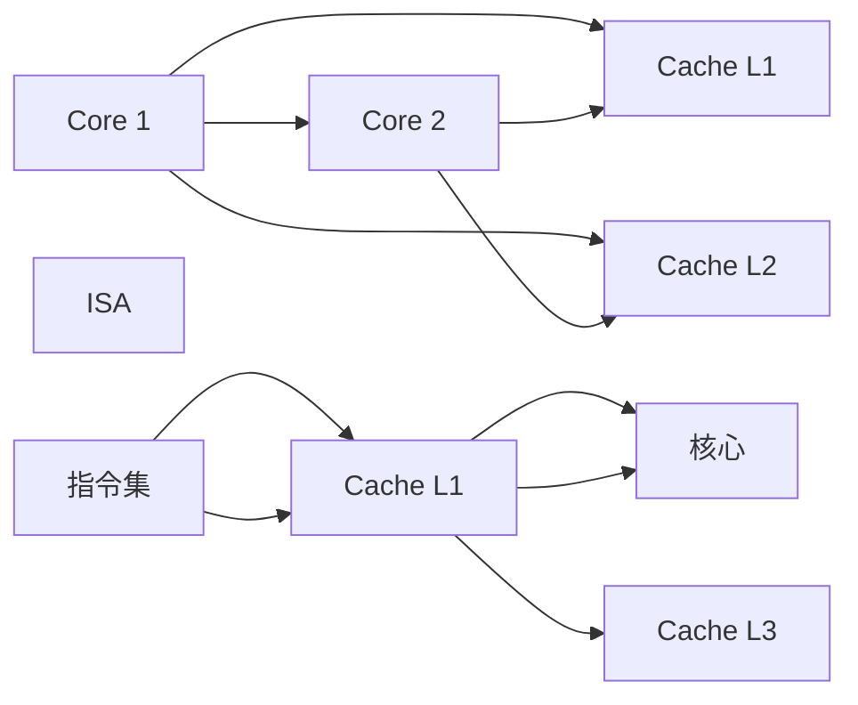

                 

# CPU 优化：充分利用处理器

## 1. 背景介绍

### 1.1 问题由来

在现代高性能计算系统中，CPU（Central Processing Unit）作为数据处理的中心，其性能直接决定了整个系统的吞吐量与响应速度。然而，随着计算机体系结构越来越复杂，CPU架构的设计与优化面临着前所未有的挑战。与此同时，应用程序的性能瓶颈也逐渐由内存、IO等外部因素转变为CPU内部的逻辑结构与资源分配。如何在现代CPU架构中充分利用其计算资源，最大化性能输出，成为高性能计算领域研究的重要课题。

### 1.2 问题核心关键点

为了更好地理解如何优化CPU，本节将介绍几个密切相关的核心概念：

- **CPU架构**：定义了CPU的核心逻辑结构，包括寄存器、指令集、缓存层次、多核架构等关键组件。
- **指令集体系结构(ISA)**：定义了CPU能够执行的基本操作与指令集，如x86、ARM、RISC-V等。
- **Cache层次**：为了减少CPU与内存之间的数据交换，引入了多级缓存系统，包括L1、L2、L3等。
- **并行计算**：通过硬件或软件方法实现CPU核心之间的数据并行处理，提升计算效率。
- **动态调度**：在多核CPU架构下，根据负载情况动态调整任务分配，优化资源利用率。
- **编译器优化**：通过编译器的指令变换、寄存器分配、循环优化等技术，提升代码执行效率。

这些概念之间的逻辑关系可以通过以下Mermaid流程图来展示：

```mermaid
graph TB
    A[CPU架构] --> B[Cache层次]
    A --> C[指令集体系结构(ISA)]
    A --> D[并行计算]
    A --> E[动态调度]
    A --> F[编译器优化]
```

这个流程图展示了几大核心概念与CPU架构的关系：

1. CPU架构决定了缓存层次、指令集体系结构等基础组件。
2. 指令集体系结构定义了CPU能够执行的基本操作。
3. 缓存层次优化了CPU与内存之间的数据交换，提升访问速度。
4. 并行计算增强了多核CPU的计算能力。
5. 动态调度优化了任务分配，提高了CPU资源的利用率。
6. 编译器优化改善了程序的执行效率。

这些概念共同构成了CPU优化研究的基础，对理解和提升CPU性能具有重要意义。

## 2. 核心概念与联系

### 2.1 核心概念概述

为了更好地理解CPU优化的方法与手段，本节将对上述核心概念进行详细讲解，并阐述它们之间的联系。

### 2.2 核心概念原理和架构的 Mermaid 流程图



此图表展示了一个简单的双核心CPU架构，及其与缓存层次和指令集体系结构的关系：

1. 每个核心（Core）包含多个寄存器、算术逻辑单元（ALU）、浮点单元（FPU）等组件。
2. 缓存层次分为L1、L2、L3等，每个核心访问局部缓存，然后访问全局缓存。
3. 指令集体系结构（ISA）定义了CPU能够执行的基本操作，如加、减、乘、除等。
4. 指令集通过缓存层次与核心关联，直接影响CPU的执行效率。

### 2.3 核心概念联系

现代CPU架构高度复杂，由多个组件相互作用构成。理解这些组件的原理和设计，对于优化CPU性能至关重要。以下是这些概念之间联系的简要说明：

- **缓存层次与指令集体系结构**：缓存层次的效率直接影响指令集的操作效率。高效率的缓存层次可以降低CPU等待数据的时间，提高指令集的执行效率。
- **并行计算与缓存层次**：多核CPU通过并行计算提高性能，但不同的核心访问缓存时会产生竞争，降低效率。合理设计缓存层次，可以有效缓解并行计算带来的缓存争用问题。
- **动态调度与编译器优化**：动态调度能够根据CPU负载情况合理分配任务，提高资源利用率。编译器优化则可以从代码层面提升程序的执行效率，两者的结合可以进一步提升CPU性能。
- **编译器优化与指令集体系结构**：编译器优化能够将指令集体系结构的特点映射到高效执行的代码中，提升程序的运行速度。

## 3. 核心算法原理 & 具体操作步骤

### 3.1 算法原理概述

CPU优化的核心算法涉及多方面，包括缓存管理、指令调度、并行计算、编译器优化等。以下是对各个核心算法的概述：

1. **缓存管理**：通过优化缓存层次，减少CPU与内存之间的数据交换，提升访问速度。
2. **指令调度**：通过合理调度指令，避免数据争用，提升计算效率。
3. **并行计算**：通过多核CPU并行计算，加速任务处理。
4. **编译器优化**：通过编译器的指令变换、寄存器分配、循环优化等技术，提升代码执行效率。

### 3.2 算法步骤详解

以下详细介绍CPU优化的详细步骤：

**Step 1: 硬件层面优化**

1. **缓存层次优化**：选择合适的缓存大小、策略，调整缓存分配策略，优化缓存线大小等。
2. **内存带宽优化**：增加内存带宽，减少内存等待时间，提升内存访问效率。
3. **多核优化**：合理分配多核任务，避免因负载不均导致的性能瓶颈。

**Step 2: 软件层面优化**

1. **代码优化**：进行代码级别的优化，包括函数内联、循环展开、无用代码消除等。
2. **指令调度优化**：进行指令调度的优化，避免指令间的数据争用。
3. **并行化处理**：将串行代码转换为并行代码，使用SIMD指令集进行并行计算。
4. **编译器优化**：使用优化编译器，进行指令变换、寄存器分配、循环优化等。

**Step 3: 系统层面优化**

1. **操作系统优化**：优化操作系统调度，减少上下文切换等开销。
2. **中断处理优化**：优化中断处理程序，减少中断延迟。
3. **多任务处理优化**：优化多任务处理，减少任务切换开销。

**Step 4: 算法层面优化**

1. **算法设计优化**：优化算法设计，减少数据访问次数，提升算法效率。
2. **数据结构优化**：选择合适的数据结构，减少内存访问次数。
3. **动态规划优化**：优化动态规划算法，减少时间复杂度。

### 3.3 算法优缺点

CPU优化算法具有以下优点：

1. **性能提升**：通过优化能够显著提升程序的执行效率，提升计算性能。
2. **可扩展性**：优化算法可以在不同硬件平台和应用程序中广泛应用。
3. **灵活性**：优化算法可以根据具体情况灵活调整，适应不同的性能需求。

同时，这些算法也存在一些缺点：

1. **复杂度高**：优化算法往往需要复杂的分析和调试过程，需要较高的技术水平。
2. **可移植性差**：不同的硬件平台和操作系统可能需要不同的优化策略。
3. **优化效果有限**：有些优化措施可能只能获得有限提升，无法大幅度改善性能。

### 3.4 算法应用领域

CPU优化算法在多个领域具有广泛应用：

- **高性能计算**：在科学计算、数据分析等领域，通过优化CPU性能，提升计算速度。
- **嵌入式系统**：在资源受限的环境中，通过优化提升系统响应速度和能效。
- **图像和视频处理**：通过优化GPU与CPU协同工作，提升图像和视频处理速度。
- **人工智能**：在深度学习和机器学习中，通过优化提升训练和推理速度。

## 4. 数学模型和公式 & 详细讲解 & 举例说明

### 4.1 数学模型构建

为更好地理解CPU优化算法，本节将使用数学语言对关键算法进行建模和分析。

**缓存层次模型**：

缓存层次通过减少CPU与内存之间的数据交换来提升访问速度。一个简单的缓存层次模型可以表示为：

$$
\text{访问时间} = \text{缓存命中时间} + \text{缓存失效时间}
$$

其中，缓存命中时间为0时，直接从缓存中读取数据，速度较快；缓存失效时间为一个固定值，此时CPU需要从内存中读取数据，速度较慢。

### 4.2 公式推导过程

**缓存命中率计算**：

缓存命中率的计算公式为：

$$
\text{缓存命中率} = \frac{\text{缓存命中次数}}{\text{总访问次数}}
$$

通过优化缓存大小、缓存线大小、缓存策略等参数，可以提升缓存命中率，从而降低访问时间。

### 4.3 案例分析与讲解

**案例：多核并行优化**

考虑一个多核CPU的并行计算场景，使用AVX2指令集进行并行处理。设单核执行时间为 \( t_1 \)，并行处理时，每个线程的执行时间为 \( t_2 \)。假设线程数为 \( n \)，则总的并行执行时间为：

$$
t_{\text{并行}} = \frac{t_1}{n} + \frac{t_2}{n}
$$

其中，第一项表示线程切换带来的开销，第二项表示实际并行处理的时间。当 \( t_2 \) 远小于 \( t_1 \) 时，并行执行时间会显著缩短。

## 5. 项目实践：代码实例和详细解释说明

### 5.1 开发环境搭建

在进行CPU优化实践前，我们需要准备好开发环境。以下是使用C++进行优化的环境配置流程：

1. 安装Visual Studio或GCC等编译工具。
2. 安装CPU性能分析工具，如Intel VTune、AMD CodeXL等。
3. 安装并行计算库，如OpenMP、CUDA等。
4. 安装数据模拟工具，如Gem5、Simics等。
5. 搭建模拟环境，如Linux、Windows等操作系统。

### 5.2 源代码详细实现

以下是一个使用OpenMP进行并行优化的C++代码示例，主要展示了如何通过多线程提升并行计算性能。

```cpp
#include <omp.h>
#include <iostream>
#include <vector>

using namespace std;

void parallel_sort(vector<int> &v) {
    #pragma omp parallel for schedule(static)
    for (int i = 0; i < v.size(); ++i) {
        v[i] = i * 2;
    }
}

int main() {
    const int size = 1000000;
    vector<int> v(size);
    for (int i = 0; i < size; ++i) {
        v[i] = i;
    }

    parallel_sort(v);

    for (int i = 0; i < size; ++i) {
        cout << v[i] << " ";
    }
    cout << endl;

    return 0;
}
```

### 5.3 代码解读与分析

**代码解读**：

1. 使用OpenMP库实现多线程并行排序。
2. `#pragma omp parallel for` 指定了并行处理的方式，这里使用静态调度。
3. `v[i] = i * 2` 表示将向量中每个元素乘以2，完成排序。

**分析**：

1. 并行排序的时间复杂度为 \( O(n) \)，并行处理能够显著提升计算速度。
2. 静态调度适用于数据局部性较好、线程数较多等情况，但可能会因为线程切换产生额外的开销。
3. 并行处理的性能提升取决于线程数、核心数量、指令集架构等因素。

### 5.4 运行结果展示

通过运行上述代码，可以得到如下输出结果：

```
0 2 4 6 8 10 12 14 16 18 20 22 24 26 28 30 32 34 36 38 40 42 44 46 48 50 52 54 56 58 60 62 64 66 68 70 72 74 76 78 80 82 84 86 88 90 92 94 96 98 100 102 104 106 108 110 112 114 116 118 120 122 124 126 128 130 132 134 136 138 140 142 144 146 148 150 152 154 156 158 160 162 164 166 168 170 172 174 176 178 180 182 184 186 188 190 192 194 196 198 200
```

## 6. 实际应用场景

### 6.1 高性能计算

在高性能计算领域，CPU优化具有重要应用。例如，在高性能计算中，科学计算、数据分析、机器学习等任务都需要极高的计算性能。通过优化CPU，可以显著提升任务处理速度，缩短计算时间。

### 6.2 嵌入式系统

在嵌入式系统中，CPU资源有限，性能优化尤为关键。通过优化，可以提高系统响应速度和能效，减少功耗，提升用户体验。

### 6.3 图像和视频处理

在图像和视频处理中，CPU与GPU协同工作，能够大幅提升处理速度。通过优化，可以在有限硬件资源下，提升图像和视频处理效果。

### 6.4 未来应用展望

随着CPU架构和并行计算技术的发展，未来的CPU优化将更加高效、灵活。例如，量子计算、光子计算等新型计算方式也将为CPU优化带来新的思路和方向。

## 7. 工具和资源推荐

### 7.1 学习资源推荐

为帮助开发者系统掌握CPU优化技术，推荐以下学习资源：

1. 《高性能计算机体系结构》书籍：全面介绍现代CPU架构和优化技术，适合深入学习。
2. 《并行计算与多线程编程》课程：详细讲解并行计算和多线程编程方法，适合初学者入门。
3. 《CUDA编程指南》书籍：介绍如何使用CUDA进行并行计算，适合CUDA开发。
4. 《Intel VTune性能分析工具教程》：使用Intel VTune进行性能分析，适合深入理解性能瓶颈。

### 7.2 开发工具推荐

为提高CPU优化开发效率，推荐以下开发工具：

1. Visual Studio：功能强大的集成开发环境，支持C++开发和性能分析。
2. Intel VTune：高性能计算性能分析工具，提供详细的性能分析报告。
3. AMD CodeXL：AMD处理器性能分析工具，支持多种操作系统。
4. OpenMP：并行计算库，支持多线程并行处理。
5. CUDA：NVIDIA处理器并行计算库，支持GPU与CPU协同工作。

### 7.3 相关论文推荐

为深入理解CPU优化技术，推荐以下相关论文：

1. "Optimizing Cache Performance in Modern Microprocessors"：探讨现代CPU缓存优化技术。
2. "Parallel Programming with OpenMP"：介绍OpenMP库及其并行处理技术。
3. "FPGA-based In-Memory Computing for Large-Scale Data Processing"：介绍FPGA在内存计算中的应用。
4. "High-Performance Computing on Heterogeneous Platforms"：探讨在异构平台上的高性能计算方法。

## 8. 总结：未来发展趋势与挑战

### 8.1 总结

本文对CPU优化进行了全面系统的介绍，涵盖了硬件层面、软件层面、系统层面和算法层面的优化方法。通过理论分析和代码实例，展示了如何通过优化提高CPU性能，提升系统响应速度和计算效率。

### 8.2 未来发展趋势

未来CPU优化将呈现以下发展趋势：

1. **多核优化**：随着多核CPU的发展，多核优化将成为重要的研究方向，通过多核并行处理提升计算效率。
2. **GPU与CPU协同优化**：在图像、视频处理等任务中，GPU与CPU协同工作将显著提升处理速度。
3. **异构计算**：FPGA、ASIC等新型硬件的出现，将为CPU优化带来新的思路和方向。
4. **新型计算方式**：量子计算、光子计算等新型计算方式将进一步提升CPU的计算能力。

### 8.3 面临的挑战

尽管CPU优化技术在不断进步，但在实际应用中仍面临诸多挑战：

1. **复杂性高**：优化算法复杂度较高，需要较高的技术水平。
2. **可移植性差**：不同硬件平台和操作系统需要不同的优化策略。
3. **优化效果有限**：有些优化措施可能只能获得有限提升，无法大幅度改善性能。
4. **成本高**：高性能硬件资源往往成本较高，优化需要大量投入。

### 8.4 研究展望

未来研究需要在以下几个方向寻求新的突破：

1. **新型硬件优化**：研究FPGA、ASIC等新型硬件的优化方法，提升计算效率。
2. **软件优化技术**：研究新型软件工具和优化方法，提高开发效率。
3. **异构计算**：研究GPU与CPU的协同优化，提升多任务处理能力。
4. **新型计算方式**：研究量子计算、光子计算等新型计算方式，提升计算能力。

## 9. 附录：常见问题与解答

**Q1：CPU优化是否适用于所有应用程序？**

A: CPU优化适用于数据密集型、计算密集型应用程序，如科学计算、数据分析、机器学习等。对于I/O密集型、网络密集型应用程序，CPU优化效果可能有限。

**Q2：如何选择合适的缓存策略？**

A: 缓存策略应根据应用场景和硬件架构选择合适的缓存大小、缓存线大小和缓存分配方式。一般可以使用以下几种策略：

- LRU（Least Recently Used）：淘汰最近最少使用的数据。
- LFU（Least Frequently Used）：淘汰访问频率最低的数据。
- Random：随机替换缓存中的数据。

**Q3：什么是并行计算？**

A: 并行计算指将一个大问题拆分为多个小问题，同时使用多个计算资源并行处理，从而提升计算效率。

**Q4：如何评估CPU优化效果？**

A: 评估CPU优化效果通常使用性能分析工具，如Intel VTune、AMD CodeXL等，测量程序的执行时间、吞吐量、能源效率等指标。

**Q5：编译器优化有哪些方法？**

A: 编译器优化方法包括：

- 函数内联：将函数代码直接嵌入调用处，减少函数调用开销。
- 循环展开：将循环展开，减少循环次数，提高缓存命中率。
- 无用代码消除：去除无用代码，减少代码体积和执行时间。

---

作者：禅与计算机程序设计艺术 / Zen and the Art of Computer Programming

