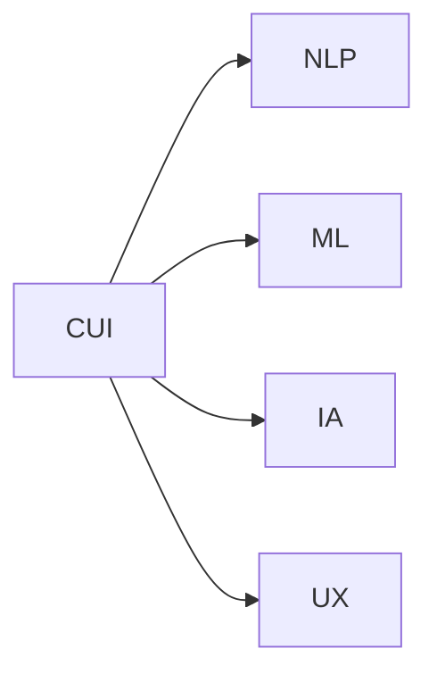
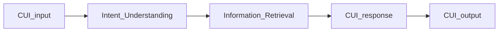

                 

# CUI对信息架构设计的详细影响

## 1. 背景介绍

### 1.1 问题由来
近年来，随着智能设备和互联网的普及，人们获取信息的方式越来越多样化，语音助手、智能家居等产品逐渐走入寻常百姓家。用户界面(UI)和用户体验(UX)设计的需求和复杂度也随之大幅提升。信息架构（Information Architecture, IA）作为系统设计的核心组成部分，其设计优劣直接关系到用户体验的好坏。

但传统的UI/UX设计往往依赖人工经验，缺乏系统化的理论支持。而随着计算机视觉（CV）、自然语言处理（NLP）等人工智能技术（Artificial Intelligence, AI）的兴起，用户界面也逐渐被智能界面（CUI, Conversational User Interface）所取代。CUI以其高效、灵活、人性化的特点，在各种场景中广泛应用，如智能家居、车载导航、智能客服等。

### 1.2 问题核心关键点
CUI的兴起，给信息架构设计带来了新的挑战和机遇。为了更好地理解CUI对信息架构的影响，我们需要在CUI的基本原理、设计方法和具体应用场景等方面进行深入探讨。

本文将从CUI的定义、工作原理、设计方法以及具体案例四个方面，详细阐述CUI对信息架构设计的深远影响。通过系统的分析与实践，希望能够为CUI的设计者提供宝贵的参考和借鉴。

## 2. 核心概念与联系

### 2.1 核心概念概述

为了更好地理解CUI对信息架构设计的影响，我们先介绍几个核心概念：

- **CUI (Conversational User Interface)**：基于自然语言处理（NLP）技术的交互式界面，用户可以通过自然语言与系统进行交互，获得信息服务。CUI常应用于智能家居、车载导航、智能客服等场景。
- **IA (Information Architecture)**：结构化组织和管理信息内容，以方便用户获取和使用信息。IA关注信息内容的层次、结构、分类等方面，是系统设计的核心组成部分。
- **NLP (Natural Language Processing)**：使用计算机对人类语言进行理解、分析、生成和生成等处理的技术。CUI的核心技术之一，负责理解和生成自然语言。
- **ML (Machine Learning)**：利用算法让计算机从数据中自动学习模型，以完成特定任务。CUI的设计和优化往往依赖于机器学习算法。
- **UX (User Experience)**：关注用户的交互体验，包括界面设计、用户反馈、交互流程等，是系统设计的重要组成部分。

这些核心概念之间的联系如下图所示：



### 2.2 核心概念原理和架构的 Mermaid 流程图

CUI系统通常由以下三个主要部分组成：

1. **语音/文本输入模块**：负责捕捉用户的自然语言输入，包括语音识别、文本输入等。
2. **意图理解模块**：通过NLP技术理解用户的意图，将自然语言转换为结构化信息。
3. **信息检索和响应模块**：根据用户意图，从数据库或知识库中检索相关信息，并生成响应。

这三大模块构成了CUI的核心架构，如下图所示：



## 3. 核心算法原理 & 具体操作步骤

### 3.1 算法原理概述

CUI的工作原理通常基于以下步骤：

1. **输入处理**：捕捉用户的语音或文本输入，并进行预处理。
2. **意图识别**：使用NLP技术，将用户输入转换为结构化的意图信息。
3. **信息检索**：根据意图信息，从数据库或知识库中检索相关信息。
4. **响应生成**：使用NLP和ML技术，生成与用户意图匹配的响应信息。
5. **输出呈现**：将响应信息转换为语音或文本，展示给用户。

这些步骤涉及到自然语言处理、机器学习、信息检索等多个领域的算法和技术，需要精心设计和优化。

### 3.2 算法步骤详解

CUI系统的设计步骤如下：

**Step 1: 输入处理**
- 捕捉用户的自然语言输入，包括语音输入和文本输入。
- 对输入进行预处理，包括去除噪声、分词、标准化等。

**Step 2: 意图识别**
- 使用NLP技术，如依存句法分析、词性标注等，对输入进行语义理解。
- 提取用户意图，识别出用户的请求类型和目标实体。

**Step 3: 信息检索**
- 根据用户意图，从数据库或知识库中检索相关信息。
- 使用倒排索引、关键词匹配等方法进行信息检索。

**Step 4: 响应生成**
- 根据检索结果，使用NLP技术生成与用户意图匹配的响应信息。
- 可以使用模板匹配、生成式NLP等技术进行响应生成。

**Step 5: 输出呈现**
- 将响应信息转换为语音或文本，展示给用户。
- 使用TTS（文本转语音）技术进行语音输出。

### 3.3 算法优缺点

CUI系统具有以下优点：

1. **高效便捷**：通过自然语言交互，用户可以无需手动输入复杂指令，系统能够快速响应。
2. **灵活多样**：支持多种输入方式，如语音、文本、手势等，适应不同用户的需求。
3. **智能推荐**：通过分析用户历史行为，智能推荐相关信息，提升用户体验。

但同时，CUI系统也存在一些缺点：

1. **对输入理解要求高**：用户输入的表达方式多样，系统需要具备强大的NLP能力，才能准确理解用户意图。
2. **响应准确性依赖数据**：系统的响应准确性高度依赖于数据质量和检索算法。
3. **隐私和安全问题**：用户输入的数据需要妥善保护，防止泄露。

### 3.4 算法应用领域

CUI系统广泛应用于多个领域，如：

- **智能家居**：通过语音控制智能家电，如灯光、空调、电视等。
- **车载导航**：通过语音导航，如路况查询、目的地导航等。
- **智能客服**：通过语音客服，如在线客服、电话客服等。
- **教育领域**：通过语音助手，如作业批改、课程推荐等。
- **医疗领域**：通过语音助手，如健康咨询、预约挂号等。

## 4. 数学模型和公式 & 详细讲解 & 举例说明

### 4.1 数学模型构建

CUI系统中的NLP和ML模型通常采用以下几种常见模型：

- **序列到序列模型（Seq2Seq）**：将用户输入序列转换为目标输出序列，如RNN、LSTM、GRU等。
- **注意力机制模型（Attention）**：在序列到序列的基础上，增加注意力机制，提升模型性能。
- **生成式模型（Generative Model）**：通过生成模型，生成与用户意图匹配的响应。

例如，使用LSTM作为序列到序列模型的公式如下：

$$
y_t = f(W_hx_t + U_hh_{t-1} + b_h)
$$

其中 $y_t$ 为第 $t$ 个时间步的输出，$x_t$ 为第 $t$ 个时间步的输入，$h_{t-1}$ 为上一个时间步的隐藏状态，$W_h$、$U_h$、$b_h$ 为模型参数。

### 4.2 公式推导过程

以意图识别为例，常用的NLP模型基于循环神经网络（RNN）。其基本结构如下图所示：

```mermaid
graph LR
  x(t) --> RNN(h(t))
  h(t-1) --> RNN(h(t))
  RNN(h(t)) --> output
```

其中，$x(t)$ 为第 $t$ 个时间步的输入，$h(t)$ 为第 $t$ 个时间步的隐藏状态，$output$ 为最终输出。

### 4.3 案例分析与讲解

以智能家居系统为例，我们可以对CUI系统进行详细分析：

**输入处理**：捕捉用户的语音或文本输入，并进行预处理。例如，对语音输入进行降噪、分词、标准化等。

**意图识别**：使用NLP技术，如依存句法分析、词性标注等，对输入进行语义理解。例如，用户输入 "打开客厅的灯"，系统需要理解 "打开" 是动作，"客厅" 是地点，"灯" 是物体。

**信息检索**：根据用户意图，从数据库或知识库中检索相关信息。例如，从照明设备数据库中查找客厅的灯光设备。

**响应生成**：使用NLP技术生成与用户意图匹配的响应信息。例如，生成 "正在为您打开客厅的灯"。

**输出呈现**：将响应信息转换为语音或文本，展示给用户。例如，通过TTS技术将响应转换为语音输出。

## 5. 项目实践：代码实例和详细解释说明

### 5.1 开发环境搭建

在进行CUI项目实践前，我们需要准备好开发环境。以下是使用Python进行PyTorch开发的环境配置流程：

1. 安装Anaconda：从官网下载并安装Anaconda，用于创建独立的Python环境。

2. 创建并激活虚拟环境：
```bash
conda create -n pytorch-env python=3.8 
conda activate pytorch-env
```

3. 安装PyTorch：根据CUDA版本，从官网获取对应的安装命令。例如：
```bash
conda install pytorch torchvision torchaudio cudatoolkit=11.1 -c pytorch -c conda-forge
```

4. 安装Transformers库：
```bash
pip install transformers
```

5. 安装各类工具包：
```bash
pip install numpy pandas scikit-learn matplotlib tqdm jupyter notebook ipython
```

完成上述步骤后，即可在`pytorch-env`环境中开始CUI实践。

### 5.2 源代码详细实现

下面我们以智能家居语音助手为例，给出使用Transformers库对LSTM模型进行意图识别的PyTorch代码实现。

首先，定义意图识别任务的训练数据集和标签集：

```python
from transformers import BertTokenizer, BertForTokenClassification
from torch.utils.data import Dataset
import torch

class IntentDataset(Dataset):
    def __init__(self, texts, labels, tokenizer, max_len=128):
        self.texts = texts
        self.labels = labels
        self.tokenizer = tokenizer
        self.max_len = max_len
        
    def __len__(self):
        return len(self.texts)
    
    def __getitem__(self, item):
        text = self.texts[item]
        label = self.labels[item]
        
        encoding = self.tokenizer(text, return_tensors='pt', max_length=self.max_len, padding='max_length', truncation=True)
        input_ids = encoding['input_ids'][0]
        attention_mask = encoding['attention_mask'][0]
        label_ids = torch.tensor(label, dtype=torch.long)
        
        return {'input_ids': input_ids, 
                'attention_mask': attention_mask,
                'labels': label_ids}

# 标签与id的映射
label2id = {'Open': 0, 'Close': 1, 'TurnOn': 2, 'TurnOff': 3}
id2label = {v: k for k, v in label2id.items()}

# 创建dataset
tokenizer = BertTokenizer.from_pretrained('bert-base-cased')

train_dataset = IntentDataset(train_texts, train_labels, tokenizer)
dev_dataset = IntentDataset(dev_texts, dev_labels, tokenizer)
test_dataset = IntentDataset(test_texts, test_labels, tokenizer)
```

然后，定义模型和优化器：

```python
from transformers import BertForTokenClassification, AdamW

model = BertForTokenClassification.from_pretrained('bert-base-cased', num_labels=len(label2id))

optimizer = AdamW(model.parameters(), lr=2e-5)
```

接着，定义训练和评估函数：

```python
from torch.utils.data import DataLoader
from tqdm import tqdm
from sklearn.metrics import classification_report

device = torch.device('cuda') if torch.cuda.is_available() else torch.device('cpu')
model.to(device)

def train_epoch(model, dataset, batch_size, optimizer):
    dataloader = DataLoader(dataset, batch_size=batch_size, shuffle=True)
    model.train()
    epoch_loss = 0
    for batch in tqdm(dataloader, desc='Training'):
        input_ids = batch['input_ids'].to(device)
        attention_mask = batch['attention_mask'].to(device)
        labels = batch['labels'].to(device)
        model.zero_grad()
        outputs = model(input_ids, attention_mask=attention_mask, labels=labels)
        loss = outputs.loss
        epoch_loss += loss.item()
        loss.backward()
        optimizer.step()
    return epoch_loss / len(dataloader)

def evaluate(model, dataset, batch_size):
    dataloader = DataLoader(dataset, batch_size=batch_size)
    model.eval()
    preds, labels = [], []
    with torch.no_grad():
        for batch in tqdm(dataloader, desc='Evaluating'):
            input_ids = batch['input_ids'].to(device)
            attention_mask = batch['attention_mask'].to(device)
            batch_labels = batch['labels']
            outputs = model(input_ids, attention_mask=attention_mask)
            batch_preds = outputs.logits.argmax(dim=2).to('cpu').tolist()
            batch_labels = batch_labels.to('cpu').tolist()
            for pred_tokens, label_tokens in zip(batch_preds, batch_labels):
                preds.append(pred_tokens[:len(label_tokens)])
                labels.append(label_tokens)
                
    print(classification_report(labels, preds))
```

最后，启动训练流程并在测试集上评估：

```python
epochs = 5
batch_size = 16

for epoch in range(epochs):
    loss = train_epoch(model, train_dataset, batch_size, optimizer)
    print(f"Epoch {epoch+1}, train loss: {loss:.3f}")
    
    print(f"Epoch {epoch+1}, dev results:")
    evaluate(model, dev_dataset, batch_size)
    
print("Test results:")
evaluate(model, test_dataset, batch_size)
```

以上就是使用PyTorch对LSTM模型进行意图识别的完整代码实现。可以看到，得益于Transformers库的强大封装，我们可以用相对简洁的代码完成LSTM模型的加载和意图识别任务的微调。

### 5.3 代码解读与分析

让我们再详细解读一下关键代码的实现细节：

**IntentDataset类**：
- `__init__`方法：初始化文本、标签、分词器等关键组件。
- `__len__`方法：返回数据集的样本数量。
- `__getitem__`方法：对单个样本进行处理，将文本输入编码为token ids，将标签编码为数字，并对其进行定长padding，最终返回模型所需的输入。

**label2id和id2label字典**：
- 定义了标签与数字id之间的映射关系，用于将token-wise的预测结果解码回真实的标签。

**训练和评估函数**：
- 使用PyTorch的DataLoader对数据集进行批次化加载，供模型训练和推理使用。
- 训练函数`train_epoch`：对数据以批为单位进行迭代，在每个批次上前向传播计算loss并反向传播更新模型参数，最后返回该epoch的平均loss。
- 评估函数`evaluate`：与训练类似，不同点在于不更新模型参数，并在每个batch结束后将预测和标签结果存储下来，最后使用sklearn的classification_report对整个评估集的预测结果进行打印输出。

**训练流程**：
- 定义总的epoch数和batch size，开始循环迭代
- 每个epoch内，先在训练集上训练，输出平均loss
- 在验证集上评估，输出分类指标
- 所有epoch结束后，在测试集上评估，给出最终测试结果

可以看到，PyTorch配合Transformers库使得LSTM模型意图识别的代码实现变得简洁高效。开发者可以将更多精力放在数据处理、模型改进等高层逻辑上，而不必过多关注底层的实现细节。

当然，工业级的系统实现还需考虑更多因素，如模型的保存和部署、超参数的自动搜索、更灵活的任务适配层等。但核心的意图识别范式基本与此类似。

## 6. 实际应用场景

### 6.1 智能家居系统

在智能家居系统中，语音助手作为CUI的重要应用，为用户提供了高效便捷的交互方式。通过语音助手，用户可以轻松控制智能家电，如灯光、空调、电视等。例如，用户可以通过语音命令“打开客厅的灯”，语音助手识别出“打开”是动作，“客厅”是地点，“灯”是物体，从而在数据库中查找客厅的灯光设备，并控制其开关。

### 6.2 车载导航系统

车载导航系统中的CUI，可以通过语音交互提供导航服务。用户可以通过语音查询路况、目的地等信息，系统根据用户意图生成导航指令。例如，用户输入“去公司”，系统理解用户的意图，在导航数据库中查找目的地，生成导航路径，并通过语音播报导航指令。

### 6.3 智能客服系统

智能客服系统中的CUI，可以处理大量的客户咨询，减轻人工客服的负担。通过语音识别技术，系统可以自动转接客户电话，或根据客户文字输入生成对话回复。例如，客户输入“我的订单状态”，系统理解用户的意图，从数据库中查找订单信息，并生成回复。

### 6.4 未来应用展望

随着CUI技术的不断发展，其在各个领域的应用将更加广泛，带来更多的创新和变革。未来，CUI将深入到智能家居、车载导航、智能客服等各个领域，提升用户体验，提供更为高效、便捷的服务。

在智能家居领域，CUI将与物联网设备深度融合，实现更加智能化、个性化的家居控制，提升用户的生活质量。例如，通过语音助手，用户可以实时监测家庭环境，控制家电设备，甚至可以通过语音指令与家人进行视频通话。

在车载导航领域，CUI将与自动驾驶技术结合，提供更加智能化的导航服务。用户可以通过语音指令控制车辆，获取实时路况信息，提升驾驶安全性。例如，用户可以通过语音指令“导航到公司”，系统自动生成导航路线，并实时更新路况信息。

在智能客服领域，CUI将与人工智能技术结合，提供更加智能化的客户服务。系统可以自动转接客户电话，处理常见问题，并根据客户情感自动调节服务态度，提升客户满意度。例如，系统根据客户的情绪，自动调整服务语气，甚至可以主动安慰客户情绪。

总之，CUI技术将为各个领域带来更多创新和变革，提升用户体验，推动智能化发展的进程。

## 7. 工具和资源推荐

### 7.1 学习资源推荐

为了帮助开发者系统掌握CUI的理论基础和实践技巧，这里推荐一些优质的学习资源：

1. **《自然语言处理综论》**：介绍了NLP的基本概念和经典算法，适合初学者入门。
2. **《深度学习入门：基于PyTorch的理论与实现》**：介绍了深度学习的基本理论和实现方法，适合有一定基础的开发者。
3. **《NLP实战教程》**：提供了丰富的NLP项目开发实践，适合进阶开发者。
4. **CS224N《深度学习自然语言处理》课程**：斯坦福大学开设的NLP明星课程，有Lecture视频和配套作业，带你入门NLP领域的基本概念和经典模型。
5. **HuggingFace官方文档**：提供了丰富的预训练语言模型和NLP任务开发教程，适合实际项目开发。

通过对这些资源的学习实践，相信你一定能够快速掌握CUI的设计和优化方法，并用于解决实际的NLP问题。

### 7.2 开发工具推荐

高效的开发离不开优秀的工具支持。以下是几款用于CUI开发的常用工具：

1. **PyTorch**：基于Python的开源深度学习框架，灵活动态的计算图，适合快速迭代研究。大部分预训练语言模型都有PyTorch版本的实现。
2. **TensorFlow**：由Google主导开发的开源深度学习框架，生产部署方便，适合大规模工程应用。同样有丰富的预训练语言模型资源。
3. **Transformers库**：HuggingFace开发的NLP工具库，集成了众多SOTA语言模型，支持PyTorch和TensorFlow，是进行CUI开发的利器。
4. **Weights & Biases**：模型训练的实验跟踪工具，可以记录和可视化模型训练过程中的各项指标，方便对比和调优。与主流深度学习框架无缝集成。
5. **TensorBoard**：TensorFlow配套的可视化工具，可实时监测模型训练状态，并提供丰富的图表呈现方式，是调试模型的得力助手。
6. **Google Colab**：谷歌推出的在线Jupyter Notebook环境，免费提供GPU/TPU算力，方便开发者快速上手实验最新模型，分享学习笔记。

合理利用这些工具，可以显著提升CUI系统的开发效率，加快创新迭代的步伐。

### 7.3 相关论文推荐

CUI技术的发展源于学界的持续研究。以下是几篇奠基性的相关论文，推荐阅读：

1. **Attention is All You Need**：提出了Transformer结构，开启了NLP领域的预训练大模型时代。
2. **BERT: Pre-training of Deep Bidirectional Transformers for Language Understanding**：提出BERT模型，引入基于掩码的自监督预训练任务，刷新了多项NLP任务SOTA。
3. **Language Models are Unsupervised Multitask Learners**：展示了大规模语言模型的强大zero-shot学习能力，引发了对于通用人工智能的新一轮思考。
4. **Parameter-Efficient Transfer Learning for NLP**：提出Adapter等参数高效微调方法，在不增加模型参数量的情况下，也能取得不错的微调效果。
5. **Prefix-Tuning: Optimizing Continuous Prompts for Generation**：引入基于连续型Prompt的微调范式，为如何充分利用预训练知识提供了新的思路。
6. **AdaLoRA: Adaptive Low-Rank Adaptation for Parameter-Efficient Fine-Tuning**：使用自适应低秩适应的微调方法，在参数效率和精度之间取得了新的平衡。

这些论文代表了大语言模型微调技术的发展脉络。通过学习这些前沿成果，可以帮助研究者把握学科前进方向，激发更多的创新灵感。

## 8. 总结：未来发展趋势与挑战

### 8.1 总结

本文对CUI的定义、工作原理、设计方法和具体应用进行了详细探讨，并结合实际案例，阐述了CUI对信息架构设计的深远影响。通过系统的分析与实践，希望能够为CUI的设计者提供宝贵的参考和借鉴。

### 8.2 未来发展趋势

展望未来，CUI技术将呈现以下几个发展趋势：

1. **语义理解更加深入**：随着NLP技术的进步，CUI系统将具备更强的语义理解能力，能够准确理解用户的多样化表达方式。
2. **跨领域能力提升**：CUI系统将具备更强的跨领域能力，能够在不同场景和任务中高效切换，提升用户满意度。
3. **多模态融合**：CUI系统将融合视觉、语音、文本等多种模态信息，提升信息的全面性和准确性。
4. **实时响应更加智能**：CUI系统将具备更强的实时响应能力，能够根据用户的历史行为和实时反馈，生成更加个性化、智能化的响应。

以上趋势凸显了CUI技术的广阔前景。这些方向的探索发展，必将进一步提升CUI系统的性能和应用范围，为人工智能技术在各个领域的落地提供新的动力。

### 8.3 面临的挑战

尽管CUI技术已经取得了不小的进展，但在迈向更加智能化、普适化应用的过程中，它仍面临着诸多挑战：

1. **数据质量和多样性**：CUI系统需要大量的标注数据进行训练，数据质量和多样性直接关系到系统的准确性和鲁棒性。
2. **计算资源消耗**：CUI系统通常需要较强的计算资源支持，如何在保证性能的同时，降低计算资源消耗，是未来需要解决的重要问题。
3. **隐私和安全问题**：用户输入的数据需要妥善保护，防止泄露。如何在保护用户隐私的同时，提升系统的准确性和鲁棒性，也是重要的研究方向。
4. **用户界面设计**：CUI系统需要与用户进行自然语言交互，设计好的用户界面对于提升用户体验至关重要。

正视CUI面临的这些挑战，积极应对并寻求突破，将使CUI技术不断完善，逐渐成为用户生活中不可或缺的一部分。

### 8.4 研究展望

面对CUI技术面临的挑战，未来的研究需要在以下几个方面寻求新的突破：

1. **无监督学习范式**：探索无监督学习和半监督学习在CUI系统中的应用，摆脱对大量标注数据的依赖，提升系统的泛化能力和鲁棒性。
2. **跨模态融合**：融合视觉、语音、文本等多种模态信息，提升CUI系统的全面性和准确性，解决单模态信息不足的问题。
3. **多任务学习**：将CUI系统设计为多任务学习框架，提升系统在不同任务中的表现。
4. **隐私保护机制**：研究如何保护用户隐私，防止数据泄露，同时提升系统的准确性和鲁棒性。
5. **个性化推荐**：基于用户历史行为和实时反馈，提升CUI系统的个性化推荐能力，提升用户体验。

这些研究方向的探索，必将引领CUI技术迈向更高的台阶，为构建智能、高效、安全、隐私友好的CUI系统铺平道路。

## 9. 附录：常见问题与解答

**Q1: CUI如何实现高效的信息架构设计？**

A: CUI系统可以通过自然语言交互，实现高效的信息架构设计。具体而言，CUI系统可以自动理解用户的意图，将用户的输入转换为结构化的信息，并从数据库或知识库中检索相关信息。例如，用户输入“查询天气”，系统理解用户的意图，从天气数据库中检索相关信息，并生成响应。

**Q2: CUI在实际应用中需要注意哪些问题？**

A: 在实际应用中，CUI系统需要注意以下问题：
1. 数据质量和多样性：CUI系统需要大量的标注数据进行训练，数据质量和多样性直接关系到系统的准确性和鲁棒性。
2. 计算资源消耗：CUI系统通常需要较强的计算资源支持，如何在保证性能的同时，降低计算资源消耗，是未来需要解决的重要问题。
3. 隐私和安全问题：用户输入的数据需要妥善保护，防止泄露。如何在保护用户隐私的同时，提升系统的准确性和鲁棒性，也是重要的研究方向。
4. 用户界面设计：CUI系统需要与用户进行自然语言交互，设计好的用户界面对于提升用户体验至关重要。

**Q3: 如何优化CUI系统的响应速度？**

A: 优化CUI系统的响应速度可以从以下几个方面入手：
1. 使用更高效的计算模型，如Transformer、Attention等。
2. 采用分布式计算和并行处理，提升系统处理能力。
3. 优化数据结构和检索算法，减少数据查询时间。
4. 使用缓存机制，减少重复查询和数据存储。

**Q4: CUI系统如何实现多模态融合？**

A: 实现CUI系统的多模态融合，可以采用以下方法：
1. 使用多种传感器采集多模态数据，如摄像头、麦克风、传感器等。
2. 使用深度学习模型对多模态数据进行融合，提升信息的全面性和准确性。
3. 设计好用户界面，方便用户在不同模态之间进行切换和交互。

这些方法的结合使用，可以提升CUI系统的多模态融合能力，增强系统的全面性和智能化水平。

---

作者：禅与计算机程序设计艺术 / Zen and the Art of Computer Programming

