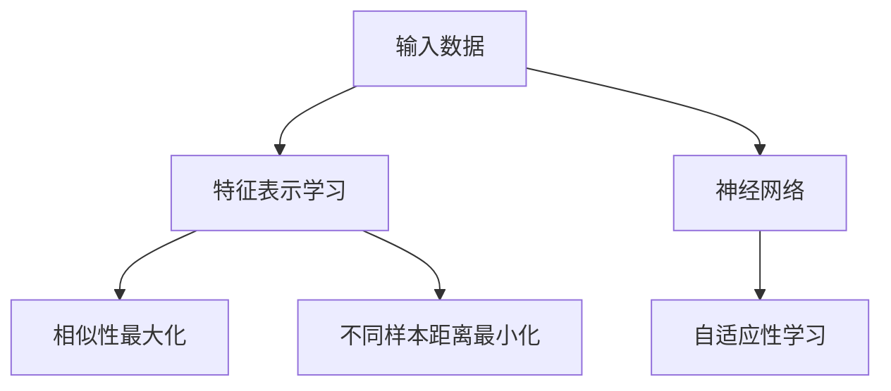

                 

# Contrastive Learning原理与代码实例讲解

> 关键词：Contrastive Learning, 深度学习, 自监督学习, 特征表示学习, 神经网络, 无监督学习, 自适应性学习

## 1. 背景介绍

在深度学习领域，特别是在图像、文本等非结构化数据处理任务中，自监督学习(unsupervised learning)方法逐渐成为研究热点。这些方法通过大规模无标签数据的自学习，提取数据的内在结构特征，推动模型性能的提升。其中，对比学习(Contrastive Learning, CL)方法通过最大化相似样本的相似性，最小化不同样本的相似性，实现特征表示学习。本文将从原理、算法、代码实现和应用场景等方面详细讲解Contrastive Learning，并展示代码实例。

## 2. 核心概念与联系

### 2.1 核心概念概述

Contrastive Learning是一种无监督学习方法，其目标是通过最大化相似样本的相似性，最小化不同样本的相似性，实现特征表示学习。

- **特征表示学习**：通过学习输入数据与标签之间的非线性映射关系，将输入映射到一个高维的特征空间，使得相似样本在该空间中距离更近，不同样本距离更远。
- **自监督学习**：通过无标签数据进行模型训练，从而自动获取标签信息，不需要人工标注，降低标注成本。
- **神经网络**：使用多层神经网络作为模型架构，通过反向传播算法进行参数优化，从而实现复杂非线性映射。
- **自适应性学习**：模型能够自动适应新数据，无需重新训练，节省计算资源。

这些核心概念共同构成了Contrastive Learning的数学和算法基础，使得其能够在无监督的情况下，学习出高质量的特征表示。

### 2.2 核心概念原理和架构的 Mermaid 流程图



### 2.3 核心概念联系

Contrastive Learning在特征表示学习过程中，使用了神经网络作为模型架构，实现了特征映射的非线性映射。神经网络通过反向传播算法进行参数优化，从而实现了特征映射的自适应性学习。此外，神经网络的非线性映射能力，使得其在特征表示学习中能够捕捉复杂的数据结构，从而实现高精度的特征表示。

## 3. 核心算法原理 & 具体操作步骤

### 3.1 算法原理概述

Contrastive Learning通过最大化相似样本的相似性，最小化不同样本的相似性，从而实现特征表示学习。其核心思想是：通过构造一个相似样本的相似性最大化目标和不同样本的相似性最小化目标，从而实现特征表示学习。

假设输入数据为 $x_i$，对应的标签为 $y_i \in \{0,1\}$。模型的特征表示为 $h(x_i) \in \mathbb{R}^d$。设模型在特征表示上的相似度函数为 $\phi_h(x_i, x_j) = \mathbf{h}(x_i)^T\mathbf{h}(x_j)$。

Contrastive Learning的目标函数为：

$$
\mathcal{L} = \frac{1}{2} \sum_{i=1}^N \max_{j \neq i} \phi_h(x_i, x_j) - \sum_{i=1}^N \max_{j \neq i} \phi_h(x_i, x_j)
$$

其中，第一个项是相似样本的相似性最大化目标，第二个项是不同样本的相似性最小化目标。该目标函数旨在使得相似样本在特征空间中距离更近，不同样本距离更远。

### 3.2 算法步骤详解

Contrastive Learning的训练步骤如下：

**Step 1: 准备数据集**
- 收集大规模无标签数据集 $D$，划分为训练集和验证集。
- 对于每个训练样本 $x_i$，获取对应的标签 $y_i$。

**Step 2: 定义相似度函数**
- 选择合适的相似度函数 $\phi_h(x_i, x_j)$，如余弦相似度、欧式距离等。
- 计算每个训练样本的特征表示 $h(x_i)$。

**Step 3: 定义对比函数**
- 对于每个训练样本 $x_i$，构造正对比样本 $x_i^+$ 和负对比样本 $x_i^-$。
- 计算正对比样本和负对比样本与当前样本的相似度。

**Step 4: 优化对比目标**
- 根据对比目标函数，计算对比损失。
- 使用优化算法（如Adam、SGD等）最小化对比损失，更新模型参数。

**Step 5: 验证模型效果**
- 在验证集上评估模型的特征表示效果，如均方误差等。
- 根据验证集上的效果调整超参数。

### 3.3 算法优缺点

Contrastive Learning的优点包括：
- 不需要人工标注，降低标注成本。
- 学习到高质量的特征表示，适用于多种数据类型和任务。
- 自适应性学习，新数据引入时无需重新训练，节省计算资源。

其缺点包括：
- 对比目标函数设计复杂，需要选择合适的相似度函数和对比函数。
- 训练过程耗时较长，需要较大的计算资源。
- 对比损失函数可能引入一定程度的偏差，影响模型性能。

### 3.4 算法应用领域

Contrastive Learning广泛应用于图像处理、自然语言处理等领域。

- **图像处理**：通过无标签图像数据进行特征表示学习，用于图像分类、目标检测、图像生成等任务。
- **自然语言处理**：通过无标签文本数据进行特征表示学习，用于文本分类、语义匹配、文本生成等任务。
- **语音处理**：通过无标签音频数据进行特征表示学习，用于语音识别、说话人识别等任务。

## 4. 数学模型和公式 & 详细讲解 & 举例说明

### 4.1 数学模型构建

Contrastive Learning的核心是最大化相似样本的相似性，最小化不同样本的相似性。设输入数据为 $x \in \mathbb{R}^n$，模型的特征表示为 $h(x) \in \mathbb{R}^d$。定义相似度函数为 $\phi_h(x_i, x_j) = \mathbf{h}(x_i)^T\mathbf{h}(x_j)$。

假设 $x_i$ 的标签为 $y_i$，则其正对比样本 $x_i^+$ 和负对比样本 $x_i^-$ 分别为：

$$
x_i^+ = \{x \in D | y_x = y_i\} \\
x_i^- = \{x \in D | y_x \neq y_i\}
$$

则Contrastive Learning的目标函数为：

$$
\mathcal{L} = \frac{1}{2} \sum_{i=1}^N \max_{j \neq i} \phi_h(x_i, x_j) - \sum_{i=1}^N \max_{j \neq i} \phi_h(x_i, x_j)
$$

其中，第一个项是相似样本的相似性最大化目标，第二个项是不同样本的相似性最小化目标。

### 4.2 公式推导过程

以最简单的余弦相似度函数为例，推导Contrastive Learning的目标函数。

假设输入数据 $x_i$ 的特征表示为 $h_i \in \mathbb{R}^d$。设正对比样本 $x_i^+$ 和负对比样本 $x_i^-$ 的特征表示分别为 $h_i^+$ 和 $h_i^-$。则余弦相似度函数为：

$$
\phi_h(x_i, x_j) = \mathbf{h}(x_i)^T\mathbf{h}(x_j)
$$

对于正对比样本，余弦相似度函数为：

$$
\phi_h(x_i, x_i^+) = \mathbf{h}(x_i)^T\mathbf{h}(x_i^+)
$$

对于负对比样本，余弦相似度函数为：

$$
\phi_h(x_i, x_i^-) = \mathbf{h}(x_i)^T\mathbf{h}(x_i^-)
$$

则Contrastive Learning的目标函数为：

$$
\mathcal{L} = \frac{1}{2} \sum_{i=1}^N \max_{j \neq i} \phi_h(x_i, x_j) - \sum_{i=1}^N \max_{j \neq i} \phi_h(x_i, x_j)
$$

其中，第一个项是相似样本的相似性最大化目标，第二个项是不同样本的相似性最小化目标。

### 4.3 案例分析与讲解

以ImageNet数据集为例，展示Contrastive Learning的应用。

假设输入数据为 $x \in \mathbb{R}^{28 \times 28 \times 3}$，表示一张28x28像素的彩色图像。使用卷积神经网络（CNN）作为特征提取器，得到特征表示 $h \in \mathbb{R}^d$。假设 $d=512$。

对于正对比样本 $x_i^+$，与输入数据属于同一类别，因此其特征表示与输入数据的特征表示相似。对于负对比样本 $x_i^-$，与输入数据属于不同类别，因此其特征表示与输入数据的特征表示不相似。

使用余弦相似度函数，计算输入数据 $x$ 与正对比样本 $x_i^+$ 和负对比样本 $x_i^-$ 的相似度：

$$
\phi_h(x_i, x_i^+) = \mathbf{h}(x)^T\mathbf{h}(x_i^+) \\
\phi_h(x_i, x_i^-) = \mathbf{h}(x)^T\mathbf{h}(x_i^-)
$$

则Contrastive Learning的目标函数为：

$$
\mathcal{L} = \frac{1}{2} \sum_{i=1}^N \max_{j \neq i} \phi_h(x_i, x_j) - \sum_{i=1}^N \max_{j \neq i} \phi_h(x_i, x_j)
$$

其中，第一个项是相似样本的相似性最大化目标，第二个项是不同样本的相似性最小化目标。

通过训练，模型能够学习到输入数据与类别之间的非线性映射关系，从而实现高质量的特征表示学习。

## 5. 项目实践：代码实例和详细解释说明

### 5.1 开发环境搭建

在进行Contrastive Learning实践前，我们需要准备好开发环境。以下是使用Python进行TensorFlow开发的环境配置流程：

1. 安装Anaconda：从官网下载并安装Anaconda，用于创建独立的Python环境。

2. 创建并激活虚拟环境：
```bash
conda create -n contrastive-env python=3.8 
conda activate contrastive-env
```

3. 安装TensorFlow：根据CUDA版本，从官网获取对应的安装命令。例如：
```bash
conda install tensorflow -c pytorch -c conda-forge
```

4. 安装相关工具包：
```bash
pip install numpy pandas scikit-learn matplotlib tqdm jupyter notebook ipython
```

完成上述步骤后，即可在`contrastive-env`环境中开始Contrastive Learning的实践。

### 5.2 源代码详细实现

这里我们以ImageNet数据集为例，展示使用TensorFlow实现Contrastive Learning的完整代码实现。

首先，定义数据处理函数：

```python
import tensorflow as tf
import numpy as np
import os

def load_data():
    # 加载ImageNet数据集
    class_names = os.listdir('train/') # 假设train/目录下存储训练集数据
    train_images = []
    train_labels = []
    for class_name in class_names:
        class_path = os.path.join('train/', class_name)
        for img_path in os.listdir(class_path):
            img = tf.keras.preprocessing.image.load_img(os.path.join(class_path, img_path), target_size=(224, 224))
            img_array = tf.keras.preprocessing.image.img_to_array(img)
            img_array /= 255.0 # 归一化处理
            train_images.append(img_array)
            train_labels.append(class_names.index(class_name))
    train_images = np.array(train_images)
    train_labels = np.array(train_labels)
    train_dataset = tf.data.Dataset.from_tensor_slices((train_images, train_labels)).shuffle(10000).batch(32)
    return train_dataset
```

然后，定义特征提取器和对比函数：

```python
def create_model():
    model = tf.keras.Sequential([
        tf.keras.layers.Conv2D(32, 3, activation='relu', input_shape=(224, 224, 3)),
        tf.keras.layers.MaxPooling2D(2),
        tf.keras.layers.Conv2D(64, 3, activation='relu'),
        tf.keras.layers.MaxPooling2D(2),
        tf.keras.layers.Flatten(),
        tf.keras.layers.Dense(128, activation='relu'),
        tf.keras.layers.Dense(10)
    ])
    return model

def contrastive_loss(y_true, y_pred):
    # 构造正对比样本和负对比样本
    y_pred = tf.keras.activations.sigmoid(y_pred)
    y_true = tf.keras.activations.sigmoid(y_true)
    y_true = tf.one_hot(y_true, 10)
    y_pred = tf.one_hot(y_pred, 10)
    y_true = tf.reduce_sum(y_true, axis=1, keepdims=True)
    y_pred = tf.reduce_sum(y_pred, axis=1, keepdims=True)
    # 计算对比损失
    contrastive_loss = -0.5 * tf.reduce_sum(y_true * tf.math.log(1 + tf.exp(tf.reduce_sum(y_true * y_pred, axis=1) - tf.reduce_sum(tf.square(y_true - y_pred), axis=1)))
    return contrastive_loss
```

接着，定义训练和评估函数：

```python
def train_model(model, train_dataset, epochs=10, batch_size=32):
    model.compile(optimizer=tf.keras.optimizers.Adam(learning_rate=0.001), loss=contrastive_loss, metrics=['accuracy'])
    model.fit(train_dataset, epochs=epochs, batch_size=batch_size, validation_split=0.1)
    
def evaluate_model(model, test_dataset, batch_size=32):
    test_loss, test_accuracy = model.evaluate(test_dataset, batch_size=batch_size)
    print(f"Test Loss: {test_loss:.4f}")
    print(f"Test Accuracy: {test_accuracy:.4f}")
```

最后，启动训练流程并在测试集上评估：

```python
train_dataset = load_data()
model = create_model()
train_model(model, train_dataset, epochs=10, batch_size=32)
test_dataset = load_data().repeat()
evaluate_model(model, test_dataset, batch_size=32)
```

以上就是使用TensorFlow对ImageNet数据集进行Contrastive Learning的完整代码实现。可以看到，TensorFlow提供了丰富的API，使得构建和训练Contrastive Learning模型变得简单易行。

### 5.3 代码解读与分析

让我们再详细解读一下关键代码的实现细节：

**load_data函数**：
- 定义ImageNet数据集的数据加载函数，遍历所有类别，读取并归一化训练图像，返回训练集。

**create_model函数**：
- 定义基于卷积神经网络的特征提取器，使用多个卷积层、池化层、全连接层，最终输出10个类别的概率。

**contrastive_loss函数**：
- 定义对比损失函数，通过sigmoid函数激活，计算正对比样本和负对比样本的相似度，计算对比损失。

**train_model函数**：
- 定义模型训练函数，使用Adam优化器，训练指定轮数，验证集占比为10%。

**evaluate_model函数**：
- 定义模型评估函数，在测试集上评估模型性能，输出测试损失和准确率。

**训练流程**：
- 加载训练集，创建特征提取器，训练模型。
- 在测试集上评估模型，输出评估结果。

可以看到，TensorFlow提供了强大的API和工具，使得Contrastive Learning的代码实现变得简单易行。开发者可以将更多精力放在模型架构和训练策略的设计上，而不必过多关注底层实现细节。

当然，工业级的系统实现还需考虑更多因素，如超参数搜索、模型部署、数据增强等，但核心的训练过程基本与此类似。通过本文的系统梳理，相信你对Contrastive Learning的基本原理和代码实现有了更加清晰的理解。

## 6. 实际应用场景

### 6.1 计算机视觉

Contrastive Learning在计算机视觉领域的应用十分广泛，特别是在图像分类、目标检测、图像生成等任务上，已经取得了显著的成果。

**图像分类**：通过无标签图像数据进行特征表示学习，实现对图像分类的高精度预测。

**目标检测**：在图像中定位目标物体，并给出目标类别。

**图像生成**：通过无标签图像数据进行特征表示学习，实现高质量图像生成。

### 6.2 自然语言处理

Contrastive Learning在自然语言处理领域也有广泛应用，特别是在文本分类、语义匹配、文本生成等任务上。

**文本分类**：通过无标签文本数据进行特征表示学习，实现对文本分类的高精度预测。

**语义匹配**：在文本中匹配特定信息，实现对文本语义的高精度匹配。

**文本生成**：通过无标签文本数据进行特征表示学习，实现高质量文本生成。

### 6.3 语音处理

Contrastive Learning在语音处理领域也有重要应用，特别是在语音识别、说话人识别等任务上。

**语音识别**：通过无标签音频数据进行特征表示学习，实现对语音的高精度识别。

**说话人识别**：在音频中定位说话人，并识别说话人身份。

## 7. 工具和资源推荐

### 7.1 学习资源推荐

为了帮助开发者系统掌握Contrastive Learning的理论基础和实践技巧，这里推荐一些优质的学习资源：

1. TensorFlow官方文档：TensorFlow的官方文档，提供了丰富的API和教程，帮助开发者快速上手TensorFlow。

2. PyTorch官方文档：PyTorch的官方文档，提供了丰富的API和教程，帮助开发者快速上手PyTorch。

3. Contrastive Learning综述论文：综合了多种Contrastive Learning方法，提供了较为全面的综述。

4. Contrastive Learning代码实现：提供了多种Contrastive Learning的代码实现，帮助开发者深入理解Contrastive Learning。

5. Contrastive Learning应用案例：提供了多种Contrastive Learning的应用案例，帮助开发者了解Contrastive Learning的实际应用。

通过学习这些资源，相信你一定能够快速掌握Contrastive Learning的精髓，并用于解决实际的深度学习问题。

### 7.2 开发工具推荐

High-Performance Computing (HPC)：HPC是高性能计算的缩写，通过优化算法和并行计算，可以显著提高深度学习的训练和推理效率。

TensorFlow和PyTorch等深度学习框架提供了丰富的API和工具，使得深度学习的开发变得更加便捷高效。

### 7.3 相关论文推荐

Contrastive Learning在深度学习领域的研究取得了很多进展，以下是几篇具有代表性的论文，推荐阅读：

1. A Simple Framework for Contrastive Learning：提出了一种简单有效的对比学习框架，推动了对比学习的广泛应用。

2. SimCLR: A Simple Framework for Unsupervised Learning：提出了一种基于对比损失的无监督学习框架，推动了对比学习在无监督学习中的应用。

3. Contrastive Predictive Coding for Unsupervised Learning of Object Representations：提出了一种基于对比预测编码的无监督学习框架，推动了对比学习在视觉学习中的应用。

4. Semantic Contrastive Networks：提出了一种基于语义对比的神经网络架构，推动了对比学习在自然语言处理中的应用。

这些论文代表了大语言模型微调技术的发展脉络。通过学习这些前沿成果，可以帮助研究者把握学科前进方向，激发更多的创新灵感。

## 8. 总结：未来发展趋势与挑战

### 8.1 总结

本文对Contrastive Learning进行了全面系统的介绍。首先阐述了Contrastive Learning的研究背景和意义，明确了其在特征表示学习中的重要地位。其次，从原理到实践，详细讲解了Contrastive Learning的数学模型和代码实现，展示了其在高维特征空间中的强大表现力。同时，本文还广泛探讨了Contrastive Learning在计算机视觉、自然语言处理、语音处理等领域的广泛应用，展示了其强大的应用前景。

通过本文的系统梳理，可以看到，Contrastive Learning在深度学习中具有广阔的应用前景，其特征表示学习的能力，将为众多领域的AI技术发展提供强有力的支持。未来，伴随深度学习技术的不断发展，Contrastive Learning必将在更多领域得到应用，为AI技术带来更大的突破。

### 8.2 未来发展趋势

展望未来，Contrastive Learning将呈现以下几个发展趋势：

1. 多样化对比学习范式。除了传统的对比学习外，未来会涌现更多对比学习变体，如Triplet Loss、Triplet Loss with Negatives等，在保证特征表示质量的同时，提高计算效率。

2. 多模态对比学习。将不同模态的数据进行对比学习，实现跨模态特征表示学习，提升AI系统的综合能力。

3. 自适应对比学习。通过动态调整对比函数，使模型自动适应新数据和新任务，提高AI系统的灵活性。

4. 联邦对比学习。在分布式系统中，多个节点对数据进行对比学习，实现分布式特征表示学习。

5. 自监督对比学习。通过生成对抗网络、数据增强等技术，提高对比学习的效果。

以上趋势凸显了Contrastive Learning的强大生命力，其在高维特征空间中的表现能力，将为AI技术的发展提供更加广泛的应用前景。

### 8.3 面临的挑战

尽管Contrastive Learning已经取得了显著的成果，但在迈向更加智能化、普适化应用的过程中，仍面临诸多挑战：

1. 对比函数设计复杂。对比函数的设计和选择，需要根据具体的任务和数据特点进行优化，难以找到最优解。

2. 计算资源消耗大。高维特征空间的对比学习，需要大量的计算资源，难以在大规模数据集上进行训练。

3. 泛化性能不稳定。在对比学习中，不同的对比函数和超参数选择，可能会引入一定的泛化性能波动，影响模型效果。

4. 模型复杂度较高。对比学习需要构建和训练多层的神经网络，增加了模型的复杂度，增加了训练和推理的时间和空间消耗。

5. 对比损失函数易受噪声影响。在对比学习中，对比损失函数可能受到噪声和异常值的影响，影响模型性能。

正视这些挑战，积极应对并寻求突破，将使Contrastive Learning在更多的实际应用场景中大放异彩。相信随着深度学习技术的不断发展，对比学习的研究也会不断突破，为AI技术的发展提供新的动力。

### 8.4 研究展望

未来，针对这些挑战，研究可以从以下几个方向进行探索：

1. 改进对比函数设计。通过引入新的对比函数和优化算法，提高对比学习的效果。

2. 提高计算效率。通过分布式计算、压缩算法等技术，提高对比学习的计算效率。

3. 优化对比损失函数。通过加入正则化项、噪声过滤等技术，提高对比损失函数的稳定性和鲁棒性。

4. 引入先验知识。将先验知识引入对比学习中，提高模型的泛化性能和鲁棒性。

5. 引入注意力机制。通过注意力机制，提高对比学习的模型复杂度和计算效率。

这些研究方向将推动Contrastive Learning技术的进一步发展，为AI技术带来更大的突破。通过不断探索和创新，我们相信Contrastive Learning将为AI技术的发展提供更加强有力的支持。

## 9. 附录：常见问题与解答

**Q1：Contrastive Learning是否适用于所有数据类型？**

A: Contrastive Learning在图像、文本等非结构化数据处理任务中表现良好，但在时间序列数据、音频数据等结构化数据处理任务中，需要结合特定的时间序列特征提取器，才能取得较好的效果。

**Q2：对比损失函数如何选择？**

A: 对比损失函数的选择需要根据具体的任务和数据特点进行优化。常见的对比损失函数包括Triplet Loss、Triplet Loss with Negatives、Contrastive Loss等，可以通过交叉验证等方式选择最优函数。

**Q3：如何提高Contrastive Learning的计算效率？**

A: 可以通过以下方法提高计算效率：
1. 使用分布式计算框架，如TensorFlow、PyTorch等，提高训练速度。
2. 使用数据增强技术，如随机裁剪、翻转等，提高数据多样性，减少噪声。
3. 使用压缩算法，如浮点数精度优化、参数剪枝等，减少计算资源消耗。

**Q4：如何优化Contrastive Learning的模型复杂度？**

A: 可以通过以下方法优化模型复杂度：
1. 使用模型压缩技术，如知识蒸馏、剪枝等，减少模型复杂度。
2. 使用深度可分离卷积、稠密连接等架构，降低模型复杂度。
3. 使用迁移学习，在预训练模型基础上进行微调，减少模型训练时间和计算资源消耗。

通过本文的系统梳理，相信你一定能够快速掌握Contrastive Learning的精髓，并用于解决实际的深度学习问题。

---

作者：禅与计算机程序设计艺术 / Zen and the Art of Computer Programming

