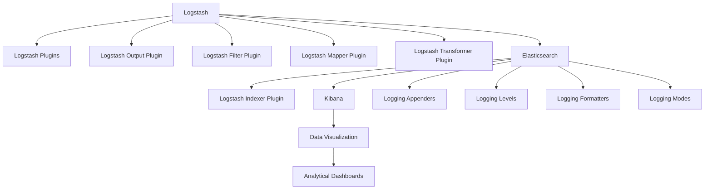

                 

## 1. 背景介绍

在现代企业信息化建设中，日志系统是至关重要的基础设施之一。它不仅记录了系统的运行状态，也记录了用户的操作行为，是系统审计、问题诊断、性能调优的重要依据。随着企业数字化转型的深入，日志系统的规模和复杂度也在不断增加，如何在保证高效采集、快速处理、可靠存储的同时，提高日志数据的分析利用率，成为一个迫切需要解决的问题。

本文旨在通过分析当前主流日志采集系统ELK（Elasticsearch, Logstash, Kibana）的实现原理，探讨如何优化其性能，提升日志数据的分析利用率，并提出一些实践经验。

## 2. 核心概念与联系

### 2.1 核心概念概述

- **Elasticsearch**：一个基于RESTful接口的分布式搜索与分析引擎，支持大规模数据存储、快速搜索和分析。
- **Logstash**：一个开源的日志收集、聚合和处理框架，支持从多种数据源采集日志数据，并对数据进行处理、转换、过滤和路由。
- **Kibana**：一个基于Web的数据可视化工具，提供图形化界面，支持用户对Elasticsearch中的数据进行实时监控和分析。
- **日志采集**：通过自动化工具从各种系统组件（如应用服务器、数据库、网络设备等）中收集日志数据，以便于集中管理和分析。
- **日志分析**：通过分析日志数据，提取有用的信息，如系统性能、错误记录、用户行为等，为系统优化和问题诊断提供依据。
- **日志存储**：通过分布式文件系统或数据库，将日志数据长期保存，方便后续查询和分析。

这些核心概念构成了ELK日志采集与分析系统的基础。通过这些组件的协同工作，ELK系统可以高效地完成日志的采集、处理、存储和分析，为企业的运营监控提供支持。

### 2.2 核心概念原理和架构的 Mermaid 流程图



这个图展示了ELK系统的工作流程：Logstash通过插件从不同的数据源采集日志数据，并将其转换为Elasticsearch可索引的格式，存储在Elasticsearch中。然后，Kibana从Elasticsearch中检索数据，并通过图形化界面进行可视化展示和分析。同时，系统还支持日志的自定义输出和过滤。

## 3. 核心算法原理 & 具体操作步骤

### 3.1 算法原理概述

ELK日志采集与分析系统的核心算法原理主要围绕着数据采集、数据处理和数据存储三个方面展开。数据采集阶段，系统通过Logstash的插件机制从不同数据源采集日志数据。数据处理阶段，系统通过Logstash的插件机制对数据进行过滤、转换和聚合。数据存储阶段，系统通过Elasticsearch的分布式存储机制，对日志数据进行高效存储和检索。

### 3.2 算法步骤详解

#### 3.2.1 数据采集

数据采集是ELK系统的第一步。Logstash支持从多种数据源采集日志数据，包括文件、数据库、网络协议等。具体流程如下：

1. **配置输入插件**：在Logstash配置文件中定义输入插件，如`input.file`用于文件日志采集，`input.log`用于日志文件采集，`input.http`用于网络协议采集等。
2. **启动采集进程**：启动Logstash服务，使其开始从指定数据源中采集日志数据。
3. **数据传输**：Logstash将采集到的日志数据通过网络传输到Elasticsearch集群。

#### 3.2.2 数据处理

数据处理是ELK系统的核心功能之一。Logstash通过一系列插件对采集到的日志数据进行处理，包括过滤、转换、聚合等。具体流程如下：

1. **配置过滤器插件**：在Logstash配置文件中定义过滤器插件，如`filter.perl`用于使用Perl脚本来过滤日志数据，`filter.sql`用于使用SQL语句过滤日志数据等。
2. **数据转换**：使用转换插件对日志数据进行处理，如`transform.strip`用于去除日志中的空格，`transform.replace`用于替换日志中的特定字符串等。
3. **数据聚合**：使用聚合插件对日志数据进行聚合，如`aggregate.groupby`用于按照特定字段进行分组，`aggregate.sum`用于计算特定字段的总和等。

#### 3.2.3 数据存储

数据存储是ELK系统的最后一步。Elasticsearch通过分布式存储机制，对日志数据进行高效存储和检索。具体流程如下：

1. **创建索引**：在Elasticsearch集群中创建日志索引，指定日志数据的字段结构。
2. **存储数据**：Logstash将处理后的日志数据存储到Elasticsearch集群中，根据索引的字段结构进行自动分类。
3. **查询检索**：通过Kibana界面，用户可以对存储在Elasticsearch中的日志数据进行查询和检索。

### 3.3 算法优缺点

#### 3.3.1 优点

1. **高效性**：ELK系统基于分布式架构，能够处理大规模日志数据，提供高效的日志采集和处理能力。
2. **灵活性**：ELK系统支持多种数据源和多种数据处理插件，可以根据需要灵活配置采集和处理流程。
3. **可视化分析**：Kibana提供强大的数据可视化功能，用户可以通过图形化界面方便地对日志数据进行分析和监控。

#### 3.3.2 缺点

1. **复杂性**：ELK系统的配置和部署比较复杂，需要一定的技术积累。
2. **资源消耗**：ELK系统的日志采集和处理需要占用一定的计算和存储资源，对于资源有限的场景可能不适用。
3. **数据安全**：ELK系统的日志存储和传输需要一定的安全保障措施，以防止数据泄露和篡改。

### 3.4 算法应用领域

ELK系统广泛应用于互联网公司、金融公司、政府机构等领域，支持对各种系统组件的日志数据进行采集、处理和分析。例如，在互联网公司中，ELK系统可以用于监控网站服务器的运行状态，识别和定位故障，优化系统性能。在金融公司中，ELK系统可以用于监控交易系统的运行状态，识别和防止欺诈行为。在政府机构中，ELK系统可以用于监控网络设备的运行状态，保障网络安全。

## 4. 数学模型和公式 & 详细讲解 & 举例说明

### 4.1 数学模型构建

ELK系统的数学模型主要围绕着日志数据的采集、处理和存储展开。假设日志数据集为$D=\{(x_i,y_i)\}_{i=1}^N$，其中$x_i$表示日志数据，$y_i$表示日志数据的类别标签。

#### 4.2 公式推导过程

1. **数据采集模型**：
   $$
   f_{采集}(x_i) = \begin{cases}
   0 & \text{如果$x_i$未被采集} \\
   1 & \text{如果$x_i$被采集}
   \end{cases}
   $$
2. **数据处理模型**：
   $$
   f_{处理}(x_i) = \begin{cases}
   x_i' & \text{如果$x_i$经过处理} \\
   x_i & \text{如果$x_i$未经过处理}
   \end{cases}
   $$
3. **数据存储模型**：
   $$
   f_{存储}(x_i) = \begin{cases}
   \text{存储到Elasticsearch} & \text{如果$x_i$满足存储条件} \\
   \text{不存储} & \text{如果$x_i$不满足存储条件}
   \end{cases}
   $$

### 4.3 案例分析与讲解

假设有一家电商公司，使用ELK系统监控其网站的服务器运行状态。在ELK系统中，定义了一个名为`logstash_inputs`的插件，用于从公司的日志文件系统中采集日志数据。同时，定义了一个名为`filter_perl`的插件，用于使用Perl脚本来过滤日志数据，去除无关信息。最后，定义了一个名为`logstash_outputs`的插件，用于将处理后的日志数据存储到Elasticsearch集群中。

## 5. 项目实践：代码实例和详细解释说明

### 5.1 开发环境搭建

在进行ELK日志采集与分析优化实践前，我们需要准备好开发环境。以下是使用Python进行Elasticsearch开发的环境配置流程：

1. 安装Anaconda：从官网下载并安装Anaconda，用于创建独立的Python环境。
2. 创建并激活虚拟环境：
```bash
conda create -n elasticsearch-env python=3.8 
conda activate elasticsearch-env
```
3. 安装Elasticsearch：根据操作系统和版本，从官网获取对应的安装命令。例如：
```bash
cd /tmp
wget https://artifacts.elastic.co/downloads/elasticsearch/elasticsearch-7.14.1-amd64.deb
sudo dpkg -i elasticsearch-7.14.1-amd64.deb
sudo /etc/init.d/elasticsearch start
```
4. 安装Elasticsearch-Py：
```bash
pip install elasticsearch-py
```

### 5.2 源代码详细实现

以下是一个基于Elasticsearch-Py的Python代码示例，用于向Elasticsearch集群中存储日志数据：

```python
from elasticsearch import Elasticsearch
from elasticsearch import helpers

es = Elasticsearch(['http://localhost:9200'])

index_name = 'logs'
type_name = 'log'

# 定义日志数据
data = [
    {'id': 1, 'message': 'File storage', 'timestamp': '2023-01-01T00:00:00Z'},
    {'id': 2, 'message': 'Database query', 'timestamp': '2023-01-01T00:01:00Z'},
    {'id': 3, 'message': 'Web request', 'timestamp': '2023-01-01T00:02:00Z'},
    {'id': 4, 'message': 'Server error', 'timestamp': '2023-01-01T00:03:00Z'},
    {'id': 5, 'message': 'User login', 'timestamp': '2023-01-01T00:04:00Z'},
    {'id': 6, 'message': 'File upload', 'timestamp': '2023-01-01T00:05:00Z'},
]

# 将日志数据存储到Elasticsearch中
bulk_data = [dict(index=index_name, body=doc) for doc in data]
bulk_response = helpers.bulk(es, bulk_data, refresh=True)
```

### 5.3 代码解读与分析

让我们再详细解读一下关键代码的实现细节：

**Elasticsearch-Py库**：
- `Elasticsearch`类：用于连接Elasticsearch集群，执行CRUD操作。
- `helps`模块：提供了bulk操作接口，用于批量处理数据。

**代码实现**：
- `es = Elasticsearch(['http://localhost:9200'])`：创建Elasticsearch客户端，连接本地的Elasticsearch集群。
- `index_name = 'logs'`：定义日志索引名称。
- `type_name = 'log'`：定义日志文档类型。
- `data`：定义要存储的日志数据，包含日志ID、消息内容和记录时间。
- `bulk_data`：将日志数据转换为Elasticsearch的bulk格式，以便于批量存储。
- `bulk_response`：执行bulk操作，将日志数据存储到Elasticsearch集群中。

### 5.4 运行结果展示

运行上述代码后，可以通过Kibana界面查看日志数据存储情况，并进行分析和监控。在Kibana中，可以定义各种图表和仪表盘，展示日志数据的实时监控情况，如服务器响应时间、请求数量、错误率等。

## 6. 实际应用场景

### 6.1 互联网公司

在互联网公司中，ELK系统可以用于监控网站的服务器运行状态，识别和定位故障，优化系统性能。具体场景如下：

1. **日志采集**：通过Logstash插件从Web服务器、数据库、应用服务器等组件中采集日志数据。
2. **数据处理**：使用过滤器插件对日志数据进行过滤和转换，去除无关信息，保留有用的日志数据。
3. **数据存储**：将处理后的日志数据存储到Elasticsearch集群中，方便后续查询和分析。
4. **数据查询**：使用Kibana界面进行数据查询和可视化分析，快速识别系统故障，优化系统性能。

### 6.2 金融公司

在金融公司中，ELK系统可以用于监控交易系统的运行状态，识别和防止欺诈行为。具体场景如下：

1. **日志采集**：通过Logstash插件从交易系统、支付系统等组件中采集日志数据。
2. **数据处理**：使用过滤器插件对日志数据进行过滤和转换，去除无关信息，保留有用的日志数据。
3. **数据存储**：将处理后的日志数据存储到Elasticsearch集群中，方便后续查询和分析。
4. **数据查询**：使用Kibana界面进行数据查询和可视化分析，识别和防止欺诈行为，优化交易系统性能。

### 6.3 政府机构

在政府机构中，ELK系统可以用于监控网络设备的运行状态，保障网络安全。具体场景如下：

1. **日志采集**：通过Logstash插件从网络设备、服务器、应用程序等组件中采集日志数据。
2. **数据处理**：使用过滤器插件对日志数据进行过滤和转换，去除无关信息，保留有用的日志数据。
3. **数据存储**：将处理后的日志数据存储到Elasticsearch集群中，方便后续查询和分析。
4. **数据查询**：使用Kibana界面进行数据查询和可视化分析，监控网络设备状态，保障网络安全。

### 6.4 未来应用展望

未来，ELK系统的应用场景还将进一步扩展，涵盖更多的领域和行业。随着技术的发展，ELK系统将具备更多的功能和特性，如实时流处理、机器学习、大数据分析等，为企业提供更加全面和深入的日志监控和分析能力。

## 7. 工具和资源推荐

### 7.1 学习资源推荐

为了帮助开发者系统掌握ELK日志采集与分析的理论基础和实践技巧，这里推荐一些优质的学习资源：

1. **Elasticsearch官方文档**：Elasticsearch官方提供的详细文档，涵盖了Elasticsearch的所有功能和使用方法。
2. **Logstash官方文档**：Logstash官方提供的详细文档，涵盖了Logstash的所有功能和使用方法。
3. **Kibana官方文档**：Kibana官方提供的详细文档，涵盖了Kibana的所有功能和使用方法。
4. **Elastic Stack实战指南**：作者TensorFlow Dad，介绍Elasticsearch、Logstash、Kibana在实际项目中的应用案例。
5. **ElasticSearch Masterclass**：Udemy上的课程，由Elasticsearch官方认证专家授课，深入浅出地讲解了Elasticsearch的实现原理和应用实践。

通过对这些资源的学习实践，相信你一定能够快速掌握ELK日志采集与分析的精髓，并用于解决实际的日志问题。

### 7.2 开发工具推荐

高效的开发离不开优秀的工具支持。以下是几款用于ELK日志采集与分析开发的常用工具：

1. **Elasticsearch-Py**：Python官方提供的Elasticsearch客户端库，支持Python的索引、查询、更新、删除等操作。
2. **Logstash-Py**：Python官方提供的Logstash客户端库，支持Python的日志采集、过滤、转换等操作。
3. **Kibana-Py**：Python官方提供的Kibana客户端库，支持Python的仪表盘创建、数据可视化等操作。
4. **Ansible**：自动化部署和运维工具，支持Elasticsearch、Logstash、Kibana等组件的快速部署和配置。
5. **Docker**：容器化技术，支持Elasticsearch、Logstash、Kibana等组件的快速搭建和运行。

合理利用这些工具，可以显著提升ELK日志采集与分析任务的开发效率，加快创新迭代的步伐。

### 7.3 相关论文推荐

ELK系统的发展源于学界的持续研究。以下是几篇奠基性的相关论文，推荐阅读：

1. **ElasticSearch: A Distributed, Real-time File System with a Map-Reduce Interface**：Elasticsearch的原论文，由Shayne Ward和Dustin Yandell撰写，介绍了Elasticsearch的核心算法和实现原理。
2. **Logstash: A Log Processing and Forwarding Agent**：Logstash的原论文，由Elasticsearch官方撰写，介绍了Logstash的核心算法和实现原理。
3. **Kibana: Search and Display in the Time Series**：Kibana的原论文，由Elasticsearch官方撰写，介绍了Kibana的核心算法和实现原理。
4. **Elastic Stack in Practice**：作者Kent Beck，介绍了Elasticsearch、Logstash、Kibana在实际项目中的应用案例。
5. **ElasticSearch: A Real-time Distributed Numerical Database**：Elasticsearch的介绍性论文，由Shayne Ward撰写，介绍了Elasticsearch的核心算法和实现原理。

这些论文代表了大数据日志系统的发展脉络。通过学习这些前沿成果，可以帮助研究者把握学科前进方向，激发更多的创新灵感。

## 8. 总结：未来发展趋势与挑战

### 8.1 总结

本文对ELK日志采集与分析系统进行了全面系统的介绍。首先阐述了ELK系统的实现原理和核心算法，明确了日志采集、数据处理和数据存储的关键步骤。其次，通过代码实例和实际应用场景，展示了ELK系统在日志数据采集、处理和分析方面的优势和应用价值。

通过本文的系统梳理，可以看到，ELK系统已经成为现代企业信息化建设中不可或缺的基础设施，为系统的监控和优化提供了强大支持。未来，伴随Elasticsearch、Logstash、Kibana等组件的持续演进，ELK系统将具备更多功能和特性，进一步提升日志数据的分析利用率，为企业的运营监控提供更有力的保障。

### 8.2 未来发展趋势

展望未来，ELK系统的应用场景还将进一步扩展，涵盖更多的领域和行业。随着技术的发展，ELK系统将具备更多的功能和特性，如实时流处理、机器学习、大数据分析等，为企业提供更加全面和深入的日志监控和分析能力。

### 8.3 面临的挑战

尽管ELK系统已经取得了瞩目成就，但在迈向更加智能化、普适化应用的过程中，它仍面临着诸多挑战：

1. **数据处理复杂性**：大规模日志数据的采集、处理和存储对系统性能提出了很高的要求，需要高效的算法和硬件支持。
2. **数据安全**：日志数据涉及企业敏感信息，如何保障数据安全是ELK系统面临的重要挑战。
3. **资源消耗**：ELK系统的日志采集和处理需要占用大量的计算和存储资源，对于资源有限的场景可能不适用。
4. **实时性要求**：对于一些需要实时监控和响应的场景，ELK系统需要具备实时流处理的能力。
5. **数据一致性**：如何保障日志数据的一致性和完整性，避免数据丢失和重复，是ELK系统需要解决的问题。

### 8.4 研究展望

面对ELK系统面临的挑战，未来的研究需要在以下几个方面寻求新的突破：

1. **优化数据处理算法**：开发更加高效的数据处理算法，提升系统的处理性能和资源利用率。
2. **增强数据安全保障**：采用加密、访问控制等措施，保障日志数据的安全性。
3. **支持实时流处理**：开发支持实时流处理的插件和模块，满足实时监控和响应的需求。
4. **提高数据一致性**：采用分布式事务和数据同步机制，保障日志数据的一致性和完整性。
5. **引入机器学习技术**：引入机器学习技术，对日志数据进行智能分析和预测，提升系统的智能化水平。

这些研究方向的探索，必将引领ELK系统迈向更高的台阶，为企业的运营监控和问题诊断提供更加全面和深入的支持。面向未来，ELK系统需要与其他技术进行更深入的融合，如大数据分析、人工智能等，多路径协同发力，共同推动日志系统的发展和应用。

## 9. 附录：常见问题与解答

**Q1：如何优化ELK系统的日志采集性能？**

A: 优化ELK系统日志采集性能的方法如下：
1. **增加索引分片**：通过增加索引分片，提高Elasticsearch集群的数据处理能力。
2. **调整日志输出插件**：优化日志输出插件的配置，减少日志数据的冗余和重复。
3. **使用批量写入**：通过批量写入机制，减少对Elasticsearch的写入压力，提高写入效率。
4. **优化Logstash插件**：通过优化Logstash插件的配置，减少日志数据的采集和处理时间。
5. **使用异步写入**：通过异步写入机制，减少Logstash对磁盘的读写操作，提高写入效率。

**Q2：如何优化ELK系统的日志处理性能？**

A: 优化ELK系统日志处理性能的方法如下：
1. **优化过滤器插件**：优化过滤器插件的配置，减少日志数据的冗余和重复。
2. **使用批量处理**：通过批量处理机制，减少Elasticsearch的查询压力，提高查询效率。
3. **优化聚合插件**：优化聚合插件的配置，减少聚合操作的计算量和存储成本。
4. **使用分布式计算**：通过分布式计算机制，提高日志数据的处理能力和资源利用率。
5. **使用缓存技术**：通过缓存技术，减少对Elasticsearch的频繁查询，提高查询效率。

**Q3：如何优化ELK系统的日志存储性能？**

A: 优化ELK系统日志存储性能的方法如下：
1. **增加索引分片**：通过增加索引分片，提高Elasticsearch集群的数据存储能力。
2. **调整日志存储策略**：优化日志存储策略的配置，减少日志数据的冗余和重复。
3. **使用异步写入**：通过异步写入机制，减少Logstash对磁盘的读写操作，提高写入效率。
4. **优化索引模板**：优化索引模板的配置，减少索引的创建和维护成本。
5. **使用冷数据优化**：通过冷数据优化机制，减少热数据对存储资源的占用，提高存储效率。

**Q4：ELK系统如何实现实时监控和分析？**

A: ELK系统实现实时监控和分析的方法如下：
1. **使用实时流处理插件**：通过实时流处理插件，将日志数据实时转发到Elasticsearch集群中。
2. **使用Kibana的实时面板**：通过Kibana的实时面板，实时监控和分析Elasticsearch集群中的日志数据。
3. **使用ElasticSearch-Template**：通过ElasticSearch-Template，动态创建实时索引，存储实时日志数据。
4. **使用Kibana的仪表盘**：通过Kibana的仪表盘，实时监控和分析Elasticsearch集群中的日志数据，生成各种图表和仪表盘。
5. **使用ElasticSearch-Filter**：通过ElasticSearch-Filter，过滤和筛选实时日志数据，生成实时的数据流。

这些方法能够帮助ELK系统实现实时监控和分析，及时发现和解决问题，优化系统性能。

**Q5：ELK系统如何保障数据安全？**

A: ELK系统保障数据安全的方法如下：
1. **使用数据加密**：通过数据加密技术，保障日志数据在传输和存储过程中的安全性。
2. **设置访问控制**：通过设置访问控制，限制对日志数据的访问权限，保障数据安全。
3. **使用审计日志**：通过审计日志技术，记录日志数据的访问和操作记录，保障数据安全。
4. **使用数据脱敏**：通过数据脱敏技术，隐藏日志数据中的敏感信息，保障数据安全。
5. **使用网络隔离**：通过网络隔离技术，保障日志数据的安全传输，防止数据泄露。

这些方法能够帮助ELK系统保障数据安全，防止数据泄露和篡改，保障企业的运营安全。

---

作者：禅与计算机程序设计艺术 / Zen and the Art of Computer Programming

