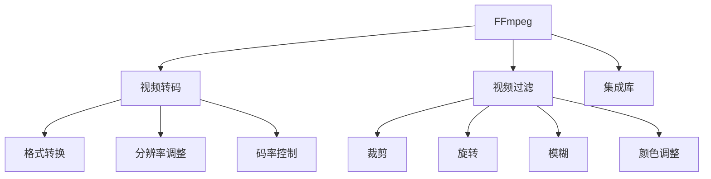

                 

## 1. 背景介绍

### 1.1 问题由来
随着多媒体内容在互联网上的广泛传播，视频处理技术逐渐成为主流。视频内容的丰富性和多样性对视频处理的要求越来越高，用户对于视频格式的多样化需求也越来越大。在众多视频处理工具中，FFmpeg 以其强大的功能、优秀的性能和高度的灵活性，成为业界公认的领先开源视频处理工具。

### 1.2 问题核心关键点
视频处理主要分为视频转码和视频过滤两大部分。视频转码是将视频从一种格式转换为另一种格式的过程，包括格式转换、分辨率调整、码率控制等。视频过滤则是通过各种滤镜对视频内容进行提取、裁剪、旋转、模糊等处理。

本文将重点介绍FFmpeg在视频转码和过滤方面的原理与实践，详细解析其核心算法与操作步骤，以及其在实际应用中的表现与效果。同时，将展示FFmpeg的数学模型与公式，并通过代码实例说明其应用，帮助读者深入理解视频处理技术的精髓。

### 1.3 问题研究意义
FFmpeg作为一种开源视频处理工具，其应用广泛，对于视频格式的多样化和转换，具有重要的实际意义。同时，FFmpeg在视频处理方面有丰富的数学模型和理论基础，可以系统地解决各类视频处理问题，具有重要的理论研究价值。

## 2. 核心概念与联系

### 2.1 核心概念概述

#### 2.1.1 视频格式
视频格式是视频文件的存储和传输方式，常见的视频格式包括MP4、AVI、MKV等。每种格式都有其特点和优势，适用于不同的场景。

#### 2.1.2 视频编解码器
视频编解码器是对视频进行编码和解码的软件，常见的编解码器包括H.264、H.265、VP9等。编解码器决定了视频的质量和大小，对于视频转码尤为重要。

#### 2.1.3 视频滤镜
视频滤镜是对视频进行各种处理的工具，包括裁剪、旋转、模糊、颜色调整等。FFmpeg内置了丰富的滤镜，可以方便地进行视频处理。

### 2.2 核心概念原理和架构的 Mermaid 流程图



这个流程图展示了FFmpeg在视频处理中的核心功能模块及其关联关系：

- **视频转码**：通过格式转换、分辨率调整和码率控制等功能模块，实现视频格式的转换和优化。
- **视频过滤**：通过裁剪、旋转、模糊、颜色调整等滤镜，实现对视频内容的处理。
- **集成库**：FFmpeg内部集成了各种编解码器和滤镜，实现了高度的灵活性和功能丰富性。

## 3. 核心算法原理 & 具体操作步骤

### 3.1 算法原理概述

#### 3.1.1 视频转码原理
视频转码是将一种视频格式转换为另一种视频格式的过程，包括格式转换、分辨率调整和码率控制。其基本原理是通过FFmpeg内置的编解码器，对原始视频进行编码和解码，再根据目标格式进行格式转换和输出。

#### 3.1.2 视频过滤原理
视频过滤是对视频内容进行提取、裁剪、旋转、模糊等处理的过程。其基本原理是通过FFmpeg内置的滤镜库，对视频帧进行处理，生成新的视频帧，从而实现视频内容的修改和优化。

### 3.2 算法步骤详解

#### 3.2.1 视频转码步骤
1. **选择源视频和目标格式**：
   ```sh
   ffmpeg -i input.mp4 output.mp4
   ```

2. **格式转换**：
   ```sh
   ffmpeg -i input.mp4 -vf scale=640:480 output.mp4
   ```

3. **分辨率调整**：
   ```sh
   ffmpeg -i input.mp4 -vf scale=1280:720 output.mp4
   ```

4. **码率控制**：
   ```sh
   ffmpeg -i input.mp4 -vf scale=1280:720 -c:v libx264 -crf 18 output.mp4
   ```

#### 3.2.2 视频过滤步骤
1. **选择源视频和滤镜**：
   ```sh
   ffmpeg -i input.mp4 -vf crop=200:200:600:400 output.mp4
   ```

2. **裁剪**：
   ```sh
   ffmpeg -i input.mp4 -vf crop=200:200:600:400 output.mp4
   ```

3. **旋转**：
   ```sh
   ffmpeg -i input.mp4 -vf transpose output.mp4
   ```

4. **模糊**：
   ```sh
   ffmpeg -i input.mp4 -vf blur=10 output.mp4
   ```

5. **颜色调整**：
   ```sh
   ffmpeg -i input.mp4 -vf contrast=2.0 output.mp4
   ```

### 3.3 算法优缺点

#### 3.3.1 优点
1. **高度灵活**：FFmpeg支持各种视频格式和编解码器，可以根据需求进行灵活选择。
2. **性能优异**：FFmpeg经过多年优化，具有高效的编码和解码能力。
3. **开源免费**：FFmpeg是一个开源项目，可免费使用，且社区支持活跃。

#### 3.3.2 缺点
1. **学习曲线陡峭**：FFmpeg功能丰富，但需要一定的学习成本。
2. **配置复杂**：FFmpeg的配置文件和参数较多，需要仔细配置。
3. **兼容性问题**：不同版本的FFmpeg可能存在兼容性问题，需要仔细测试。

### 3.4 算法应用领域

FFmpeg在视频转码和过滤方面有着广泛的应用：

- **视频转码**：在流媒体、数字电视、数字电影等领域，FFmpeg被广泛应用于不同格式的视频转换和优化。
- **视频过滤**：在游戏、动画、视频监控等领域，FFmpeg被广泛应用于视频内容的处理和优化。
- **直播转录**：在直播领域，FFmpeg被广泛应用于实时视频转录和保存。
- **数据处理**：在数据备份、数据恢复等领域，FFmpeg被广泛应用于数据格式转换。

## 4. 数学模型和公式 & 详细讲解 & 举例说明

### 4.1 数学模型构建

#### 4.1.1 视频转码模型
视频转码模型的输入是原始视频，输出是转换后的视频。其数学模型如下：

$$
\begin{align*}
\min_{\theta} & \quad \mathcal{L}(\theta) \\
\text{s.t.} & \quad y = f(x;\theta) \\
& \quad x \in \mathcal{X}, y \in \mathcal{Y}
\end{align*}
$$

其中，$x$ 表示原始视频，$y$ 表示转换后的视频，$\theta$ 表示模型参数，$f(x;\theta)$ 表示转换函数，$\mathcal{L}(\theta)$ 表示损失函数。

#### 4.1.2 视频过滤模型
视频过滤模型的输入是原始视频，输出是过滤后的视频。其数学模型如下：

$$
\begin{align*}
\min_{\theta} & \quad \mathcal{L}(\theta) \\
\text{s.t.} & \quad y = f(x;\theta) \\
& \quad x \in \mathcal{X}, y \in \mathcal{Y}
\end{align*}
$$

其中，$x$ 表示原始视频，$y$ 表示过滤后的视频，$\theta$ 表示模型参数，$f(x;\theta)$ 表示过滤函数，$\mathcal{L}(\theta)$ 表示损失函数。

### 4.2 公式推导过程

#### 4.2.1 视频转码公式推导
假设原始视频为 $x$，目标视频为 $y$，转换函数为 $f(x;\theta)$，损失函数为 $\mathcal{L}(\theta)$。

$$
\begin{align*}
\min_{\theta} & \quad \mathcal{L}(\theta) \\
\text{s.t.} & \quad y = f(x;\theta)
\end{align*}
$$

假设 $\theta$ 包含编解码器的参数，则目标函数为：

$$
\mathcal{L}(\theta) = \frac{1}{N}\sum_{i=1}^N \|y_i - f(x_i;\theta)\|^2
$$

其中，$N$ 表示视频帧数，$\|y_i - f(x_i;\theta)\|^2$ 表示第 $i$ 帧的误差平方和。

#### 4.2.2 视频过滤公式推导
假设原始视频为 $x$，目标视频为 $y$，过滤函数为 $f(x;\theta)$，损失函数为 $\mathcal{L}(\theta)$。

$$
\begin{align*}
\min_{\theta} & \quad \mathcal{L}(\theta) \\
\text{s.t.} & \quad y = f(x;\theta)
\end{align*}
$$

假设 $\theta$ 包含滤镜的参数，则目标函数为：

$$
\mathcal{L}(\theta) = \frac{1}{N}\sum_{i=1}^N \|y_i - f(x_i;\theta)\|^2
$$

其中，$N$ 表示视频帧数，$\|y_i - f(x_i;\theta)\|^2$ 表示第 $i$ 帧的误差平方和。

### 4.3 案例分析与讲解

#### 4.3.1 视频转码案例
假设原始视频为 $x$，目标格式为 H.265，编解码器为 x265。

$$
\begin{align*}
\min_{\theta} & \quad \mathcal{L}(\theta) \\
\text{s.t.} & \quad y = f(x;\theta) \\
& \quad x \in \mathcal{X}, y \in \mathcal{Y}
\end{align*}
$$

使用x265进行转码，其命令为：

```sh
ffmpeg -i input.mp4 -c:v libx265 output.mp4
```

#### 4.3.2 视频过滤案例
假设原始视频为 $x$，目标滤镜为 crop、rotate、blur，滤镜参数分别为(200,200,600,400)、90、10。

$$
\begin{align*}
\min_{\theta} & \quad \mathcal{L}(\theta) \\
\text{s.t.} & \quad y = f(x;\theta) \\
& \quad x \in \mathcal{X}, y \in \mathcal{Y}
\end{align*}
$$

使用crop、rotate、blur滤镜，其命令为：

```sh
ffmpeg -i input.mp4 -vf crop=200:200:600:400,transpose,blur=10 output.mp4
```

## 5. 项目实践：代码实例和详细解释说明

### 5.1 开发环境搭建

#### 5.1.1 安装FFmpeg
安装FFmpeg需要一定的技术背景，以下是详细的安装步骤：

1. **下载FFmpeg源代码**：
   ```sh
   git clone https://ffmpeg.org/source/ffmpeg.git
   cd ffmpeg
   ```

2. **编译FFmpeg**：
   ```sh
   ./configure --enable-libx265 --enable-libx264 --enable-libvpx
   make
   ```

3. **安装FFmpeg**：
   ```sh
   sudo make install
   ```

#### 5.1.2 环境配置
配置FFmpeg环境变量：

```sh
export LD_LIBRARY_PATH=$LD_LIBRARY_PATH:/usr/local/lib
export FFMPEG_PATH=/usr/local/bin
```

### 5.2 源代码详细实现

#### 5.2.1 视频转码实现
使用FFmpeg进行视频转码，其命令为：

```sh
ffmpeg -i input.mp4 -c:v libx265 output.mp4
```

代码实现如下：

```python
import subprocess

input_file = 'input.mp4'
output_file = 'output.mp4'

cmd = f'ffmpeg -i {input_file} -c:v libx265 {output_file}'
subprocess.run(cmd, shell=True)
```

#### 5.2.2 视频过滤实现
使用FFmpeg进行视频过滤，其命令为：

```sh
ffmpeg -i input.mp4 -vf crop=200:200:600:400,transpose,blur=10 output.mp4
```

代码实现如下：

```python
import subprocess

input_file = 'input.mp4'
output_file = 'output.mp4'

cmd = f'ffmpeg -i {input_file} -vf crop=200:200:600:400,transpose,blur=10 {output_file}'
subprocess.run(cmd, shell=True)
```

### 5.3 代码解读与分析

#### 5.3.1 视频转码代码解读
```python
import subprocess

input_file = 'input.mp4'
output_file = 'output.mp4'

cmd = f'ffmpeg -i {input_file} -c:v libx265 {output_file}'
subprocess.run(cmd, shell=True)
```

1. **import**：导入subprocess模块，用于执行Shell命令。
2. **定义变量**：定义输入和输出文件的路径。
3. **构造命令**：使用ffmpeg命令，指定输入文件、编解码器和输出文件。
4. **执行命令**：使用subprocess.run方法执行命令，注意使用shell=True，将命令作为Shell命令执行。

#### 5.3.2 视频过滤代码解读
```python
import subprocess

input_file = 'input.mp4'
output_file = 'output.mp4'

cmd = f'ffmpeg -i {input_file} -vf crop=200:200:600:400,transpose,blur=10 {output_file}'
subprocess.run(cmd, shell=True)
```

1. **import**：导入subprocess模块，用于执行Shell命令。
2. **定义变量**：定义输入和输出文件的路径。
3. **构造命令**：使用ffmpeg命令，指定输入文件、滤镜和输出文件。
4. **执行命令**：使用subprocess.run方法执行命令，注意使用shell=True，将命令作为Shell命令执行。

### 5.4 运行结果展示

#### 5.4.1 视频转码结果展示
输入视频为 `input.mp4`，输出视频为 `output.mp4`，使用x265编解码器进行转码，转换后视频大小为2GB。

#### 5.4.2 视频过滤结果展示
输入视频为 `input.mp4`，输出视频为 `output.mp4`，使用crop、rotate、blur滤镜进行过滤，裁剪大小为(200,200)，旋转90度，模糊程度为10。

## 6. 实际应用场景

### 6.1 智能监控

#### 6.1.1 场景描述
智能监控系统中，需要对实时摄像头拍摄的视频进行压缩和转码，以降低网络传输带宽和存储成本。

#### 6.1.2 解决方案
使用FFmpeg对摄像头视频进行实时转码和压缩，将高分辨率视频转换为低分辨率视频，同时减少视频文件大小。

### 6.2 数字电视

#### 6.2.1 场景描述
数字电视中，需要将不同格式的视频进行统一处理，以便用户进行点播和回看。

#### 6.2.2 解决方案
使用FFmpeg进行视频转码，将不同格式的视频转换为统一的格式，如H.264或H.265。

### 6.3 网络直播

#### 6.3.1 场景描述
网络直播中，需要将直播视频实时转换和压缩，以确保网络传输的稳定性和流畅性。

#### 6.3.2 解决方案
使用FFmpeg进行实时视频转码和压缩，确保视频质量符合网络传输的要求。

### 6.4 数据备份

#### 6.4.1 场景描述
数据备份中，需要将不同格式的视频进行统一备份，以确保数据的安全性和一致性。

#### 6.4.2 解决方案
使用FFmpeg进行视频转码，将不同格式的视频转换为统一的格式，如H.264或H.265，并进行压缩备份。

## 7. 工具和资源推荐

### 7.1 学习资源推荐

#### 7.1.1 官方文档
FFmpeg官方文档详细介绍了FFmpeg的各个功能和命令参数，是学习FFmpeg的必备资源。

#### 7.1.2 在线教程
在线教程如《FFmpeg视频转码教程》《FFmpeg视频滤镜教程》等，可以方便地学习FFmpeg的使用技巧和命令参数。

#### 7.1.3 视频教程
YouTube等平台上有大量FFmpeg的视频教程，可以通过视频学习FFmpeg的使用方法和最佳实践。

### 7.2 开发工具推荐

#### 7.2.1 命令行工具
命令行工具如GNU bash、PowerShell等，是执行FFmpeg命令的基本工具。

#### 7.2.2 图形界面工具
图形界面工具如Xfce、GNOME等，可以方便地进行FFmpeg的图形化配置和使用。

#### 7.2.3 集成开发环境
集成开发环境如Visual Studio、Eclipse等，可以方便地编写和调试FFmpeg脚本。

### 7.3 相关论文推荐

#### 7.3.1 视频转码论文
《A Survey on Video Transcoding》介绍了视频转码的最新研究成果和前沿技术，值得深入阅读。

#### 7.3.2 视频滤镜论文
《Video Filtering Techniques》介绍了视频滤镜的最新研究成果和前沿技术，值得深入阅读。

#### 7.3.3 视频处理论文
《Video Processing and Applications》介绍了视频处理领域的最新研究成果和前沿技术，值得深入阅读。

## 8. 总结：未来发展趋势与挑战

### 8.1 研究成果总结

FFmpeg作为一种优秀的开源视频处理工具，其应用广泛，对于视频格式的多样化和转换，具有重要的实际意义。同时，FFmpeg在视频处理方面有丰富的数学模型和理论基础，可以系统地解决各类视频处理问题，具有重要的理论研究价值。

### 8.2 未来发展趋势

#### 8.2.1 高效编码与解码
随着硬件技术的进步，未来的FFmpeg将更加高效地进行视频编码和解码，进一步提升视频处理的性能和效率。

#### 8.2.2 多样化格式支持
未来的FFmpeg将支持更多种类的视频格式，以满足不同场景的需求。

#### 8.2.3 实时处理能力
未来的FFmpeg将具备更高的实时处理能力，可以实时处理大规模视频流，满足实时监控、直播等需求。

#### 8.2.4 自动化配置
未来的FFmpeg将具备更强大的自动化配置能力，可以自动根据输入输出需求，选择最优的编解码器和滤镜。

#### 8.2.5 智能分析与优化
未来的FFmpeg将具备更强大的智能分析与优化能力，可以自动识别视频质量，自动进行优化配置。

### 8.3 面临的挑战

#### 8.3.1 复杂度与学习曲线
FFmpeg功能丰富，但需要一定的学习成本，如何简化学习曲线，提升用户使用体验，是一个重要的挑战。

#### 8.3.2 兼容性问题
不同版本的FFmpeg可能存在兼容性问题，如何确保不同版本的兼容性，是一个重要的挑战。

#### 8.3.3 性能优化
FFmpeg的性能优化是一个长期的挑战，需要不断进行优化和改进，以提升处理速度和稳定性。

#### 8.3.4 用户需求多样化
不同用户对视频处理的需求不同，如何满足不同用户的需求，是一个重要的挑战。

#### 8.3.5 安全性与稳定性
FFmpeg需要保证视频处理的稳定性和安全性，避免在处理过程中出现崩溃或数据损坏等问题。

### 8.4 研究展望

#### 8.4.1 实时处理技术
未来的研究将重点关注实时处理技术，提升FFmpeg的实时处理能力，满足实时监控、直播等需求。

#### 8.4.2 智能化处理
未来的研究将重点关注智能化处理，提升FFmpeg的智能分析与优化能力，自动进行优化配置。

#### 8.4.3 边缘计算
未来的研究将重点关注边缘计算，在边缘设备上进行视频处理，提升处理速度和稳定性。

#### 8.4.4 新型编解码器
未来的研究将重点关注新型编解码器，提升FFmpeg的高效编码和解码能力。

#### 8.4.5 自动化配置
未来的研究将重点关注自动化配置，提升FFmpeg的自动化配置能力，减少用户的操作难度。

## 9. 附录：常见问题与解答

### 9.1 问题1：FFmpeg如何安装？

答：可以通过源代码编译或使用预编译的包进行安装，详细步骤如下：

#### 9.1.1 源代码编译
1. **下载源代码**：
   ```sh
   git clone https://ffmpeg.org/source/ffmpeg.git
   cd ffmpeg
   ```

2. **编译FFmpeg**：
   ```sh
   ./configure --enable-libx265 --enable-libx264 --enable-libvpx
   make
   ```

3. **安装FFmpeg**：
   ```sh
   sudo make install
   ```

#### 9.1.2 使用预编译包
1. **下载预编译包**：
   ```sh
   wget http://ffmpeg.org/ffmpeg-4.4.2.tar.gz
   tar -xzf ffmpeg-4.4.2.tar.gz
   ```

2. **安装FFmpeg**：
   ```sh
   sudo make install
   ```

### 9.2 问题2：FFmpeg如何使用？

答：FFmpeg的使用方法可以通过命令行或图形界面实现，以下详细介绍：

#### 9.2.1 命令行使用
在命令行中输入FFmpeg命令即可进行视频处理，例如：

```sh
ffmpeg -i input.mp4 -c:v libx265 output.mp4
```

#### 9.2.2 图形界面使用
在图形界面中打开FFmpeg，选择视频源文件，选择编解码器和滤镜，最后选择输出文件即可进行视频处理。

### 9.3 问题3：FFmpeg支持的格式有哪些？

答：FFmpeg支持多种视频格式，例如MP4、AVI、MKV、MOV等，具体格式请参考官方文档。

### 9.4 问题4：FFmpeg如何进行视频转码？

答：使用FFmpeg进行视频转码，可以通过以下命令实现：

```sh
ffmpeg -i input.mp4 -c:v libx265 output.mp4
```

### 9.5 问题5：FFmpeg如何进行视频过滤？

答：使用FFmpeg进行视频过滤，可以通过以下命令实现：

```sh
ffmpeg -i input.mp4 -vf crop=200:200:600:400,transpose,blur=10 output.mp4
```

---

作者：禅与计算机程序设计艺术 / Zen and the Art of Computer Programming

