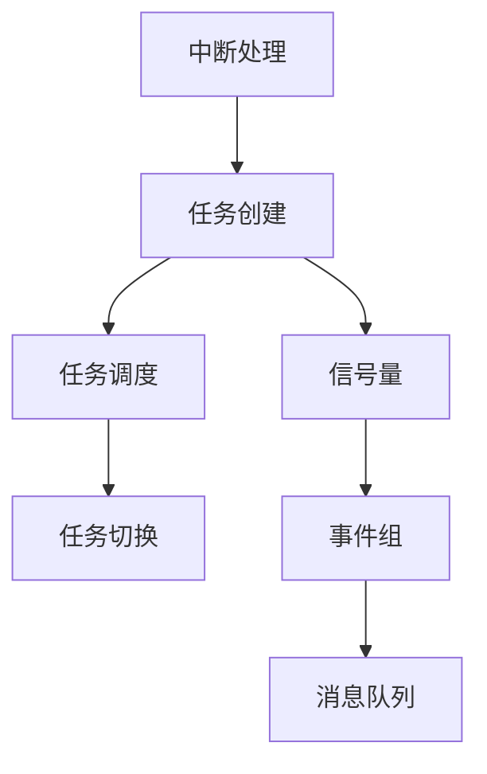

                 

## 1. 背景介绍

### 1.1 问题由来
在嵌入式系统领域，实时操作系统（Real-Time Operating System, RTOS）因其能够满足系统对时间要求严格、响应速度快的要求而受到广泛应用。单片机作为嵌入式系统中的重要组成部分，具备低成本、低功耗、功能丰富等优势，因此在消费电子、工业控制、智能家居等领域得到了广泛应用。然而，单片机资源有限，内存、计算能力有限，如何在有限资源下实现高效、可靠、安全的实时操作系统成为了一个重要课题。

### 1.2 问题核心关键点
FreeRTOS作为一款广泛使用的开源实时操作系统，以其高性能、小资源占用、易于使用的特点，在单片机领域有着广泛的应用。本文将系统介绍FreeRTOS的原理、使用方法及其在单片机上的应用场景，帮助读者全面掌握FreeRTOS的核心概念和技术要点。

## 2. 核心概念与联系

### 2.1 核心概念概述
FreeRTOS是一款开源的实时操作系统，被广泛应用于微控制器、嵌入式系统、物联网等领域。其主要特点包括：
- **任务管理**：通过任务调度，实现系统多任务并行执行。
- **中断管理**：实时响应中断请求，提高系统响应速度。
- **资源管理**：管理内存、硬件等系统资源，提高资源利用率。
- **任务同步**：通过信号量、事件组等机制实现任务间的同步和互斥。
- **通信机制**：支持任务间通信，如消息队列、事件标志组等。

### 2.2 核心概念原理和架构的 Mermaid 流程图



该流程图展示了FreeRTOS核心概念之间的关系。任务创建后，通过任务调度实现多任务并行执行。任务切换时，系统响应中断请求，进行中断处理。任务间通过信号量、事件组等机制进行同步和互斥，并通过消息队列进行通信。

## 3. 核心算法原理 & 具体操作步骤

### 3.1 算法原理概述
FreeRTOS的实时操作系统是基于任务调度算法实现的。其主要任务调度算法包括基于优先级的抢占式调度算法和基于优先级的协同式调度算法。

基于优先级的抢占式调度算法通过优先级来确定任务的执行顺序。每个任务都有固定的优先级，优先级高的任务优先执行。当一个任务正在执行时，如果有更高优先级的中断或任务到来，系统会立即切换执行该任务。

基于优先级的协同式调度算法中，每个任务按照固定优先级执行，但任务之间可以进行同步和互斥。当一个任务在等待同步信号量或事件时，其他高优先级任务可以执行，直到同步条件满足，任务恢复执行。

### 3.2 算法步骤详解

**步骤1: 任务创建**

在FreeRTOS中，任务是通过函数创建的。以下是一个创建任务的示例代码：

```c
#include "freertos/FreeRTOS.h"
#include "freertos/task.h"

static void app_main(void)
{
    TaskHandle_t xTask = xTaskCreate(vApplicationIdleTask, "IdleTask", configMINIMAL_STACK_SIZE, NULL, 2, NULL);
    vTaskStartScheduler();
}
```

该代码创建了一个名为IdleTask的任务，栈空间大小为最小值，优先级为2。

**步骤2: 任务调度**

FreeRTOS通过任务调度算法实现多任务并行执行。当一个任务执行完后，系统会调用调度函数进行任务切换。以下是一个示例代码：

```c
#include "freertos/FreeRTOS.h"
#include "freertos/task.h"

void vApplicationIdleTask(void *pvParameters)
{
    while(1) 
    {
        // 执行任务代码
    }
}
```

该代码定义了一个IdleTask，它将一直在循环中执行。

**步骤3: 中断处理**

FreeRTOS支持实时中断处理。当一个中断发生时，系统会立即停止当前任务的执行，并切换到中断处理函数执行。以下是一个中断处理函数的示例代码：

```c
#include "freertos/FreeRTOS.h"
#include "freertos/semphr.h"
#include "freertos/task.h"

void vApplicationInterruptService(void)
{
    // 中断处理代码
}
```

该代码定义了一个中断处理函数，用于处理中断请求。

### 3.3 算法优缺点

**优点**

1. **实时性**：FreeRTOS支持实时任务调度，能够满足系统对时间要求严格、响应速度快的需求。
2. **小资源占用**：FreeRTOS设计精简，占用的系统资源较少，适用于资源受限的单片机系统。
3. **易于使用**：FreeRTOS提供了丰富的API接口，易于上手使用。
4. **灵活性**：FreeRTOS支持多种通信机制，如消息队列、事件组等，用户可根据需求进行选择。

**缺点**

1. **任务切换开销**：FreeRTOS的任务切换开销较大，可能会影响系统的响应速度。
2. **调度算法限制**：FreeRTOS的任务调度算法较为简单，不支持复杂的调度策略。
3. **资源管理限制**：FreeRTOS的资源管理功能较为简单，适用于资源受限的系统，但对复杂资源管理需求的支持不足。

### 3.4 算法应用领域

FreeRTOS广泛应用于工业控制、消费电子、智能家居、汽车电子等领域，特别是在嵌入式系统中的微控制器上得到了广泛应用。其主要应用场景包括：

1. **消费电子**：智能手机、智能家居设备、智能穿戴设备等。
2. **工业控制**：工业自动化设备、机器人控制、传感器网络等。
3. **汽车电子**：汽车电子控制系统、智能驾驶、车辆诊断等。
4. **物联网**：智慧城市、智能电网、智能家居等。

## 4. 数学模型和公式 & 详细讲解 & 举例说明

### 4.1 数学模型构建

FreeRTOS的任务调度算法是基于优先级的抢占式调度算法，其任务调度策略可以用以下数学模型表示：

设任务集合为 $T$，任务 $i$ 的优先级为 $p_i$，当前正在执行的任务为 $j$，任务调度器为 $S$，则任务调度过程可以表示为：

$$
S = \begin{cases}
\text{选择优先级最高的任务} & \text{当前正在执行的任务执行完毕或被中断} \\
\text{选择正在执行的任务} & \text{其他高优先级任务未到来}
\end{cases}
$$

其中，优先级最高的任务为：

$$
i_{\text{max}} = \arg\max_{i \in T} p_i
$$

### 4.2 公式推导过程

假设任务集合 $T$ 中的任务优先级从小到大排序为 $p_1, p_2, \dots, p_n$，当前正在执行的任务为 $j$，则任务调度器的选择规则可以表示为：

$$
i_{\text{max}} = \begin{cases}
\text{选择优先级最高的任务} & \text{当前正在执行的任务执行完毕或被中断} \\
\text{选择正在执行的任务} & \text{其他高优先级任务未到来}
\end{cases}
$$

假设当前正在执行的任务为 $j$，其优先级为 $p_j$，则任务调度器的选择规则可以表示为：

$$
i_{\text{max}} = \begin{cases}
\text{选择优先级最高的任务} & p_j < p_i \\
\text{选择正在执行的任务} & \text{其他高优先级任务未到来}
\end{cases}
$$

### 4.3 案例分析与讲解

以下是一个示例代码，用于演示FreeRTOS的任务调度过程：

```c
#include "freertos/FreeRTOS.h"
#include "freertos/task.h"

static void vTask1(void *pvParameters)
{
    while(1) 
    {
        // 任务1代码
    }
}

static void vTask2(void *pvParameters)
{
    while(1) 
    {
        // 任务2代码
    }
}

void app_main(void)
{
    xTaskCreate(vTask1, "Task1", configMINIMAL_STACK_SIZE, NULL, 2, NULL);
    xTaskCreate(vTask2, "Task2", configMINIMAL_STACK_SIZE, NULL, 2, NULL);
    vTaskStartScheduler();
}
```

该代码创建了两个任务，Task1和Task2，优先级都为2。当一个任务正在执行时，另一个任务的执行优先级更高，因此会立即切换执行该任务。

## 5. 项目实践：代码实例和详细解释说明

### 5.1 开发环境搭建

在使用FreeRTOS之前，需要先搭建开发环境。以下是一个示例代码，用于搭建基于STM32F4的开发环境：

```bash
sudo apt-get update
sudo apt-get install -y gdb gdb-make libgcc-arm-linux-gnueabihf-dev libstdc++-arm-linux-gnueabihf-dev libncurses-dev libncurses5-dev libncurses5-dev-arm-linux-gnueabihf-dev
sudo apt-get install -y arm-linux-gnueabihf-gcc g++-multilib libgcc-arm-linux-gnueabihf
```

### 5.2 源代码详细实现

以下是一个基于STM32F4的FreeRTOS示例代码，用于实现任务调度、中断处理和通信：

```c
#include "freertos/FreeRTOS.h"
#include "freertos/task.h"
#include "freertos/queue.h"

static QueueHandle_t xQueue = xQueueCreate(10, sizeof(int));

void vTask1(void *pvParameters)
{
    int value = 0;
    
    while(1) 
    {
        xQueueReceive(xQueue, &value, portMAX_DELAY);
        // 处理接收到的数据
    }
}

void vTask2(void *pvParameters)
{
    while(1) 
    {
        // 生产数据
        int value = rand() % 10;
        xQueueSend(xQueue, &value, portMAX_DELAY);
    }
}

void app_main(void)
{
    xTaskCreate(vTask1, "Task1", configMINIMAL_STACK_SIZE, NULL, 2, NULL);
    xTaskCreate(vTask2, "Task2", configMINIMAL_STACK_SIZE, NULL, 2, NULL);
    vTaskStartScheduler();
}
```

该代码创建了两个任务，Task1和Task2。Task1从消息队列中接收数据，Task2向消息队列中发送数据。通过消息队列，两个任务实现了通信。

### 5.3 代码解读与分析

在FreeRTOS中，任务通过函数创建。任务函数由 `xTaskCreate` 函数调用。该函数接受任务名、栈空间大小、初始化参数、优先级、堆栈空间和函数指针。

在任务函数中，任务代码可以根据实际需求编写。在任务函数执行过程中，任务可以使用FreeRTOS提供的函数，如任务切换函数 `vTaskSwitchTo`，任务等待函数 `xTaskDelay` 等。

在任务执行过程中，任务可以使用消息队列进行通信。消息队列由 `xQueueCreate` 函数创建。该函数接受队列的最大深度和消息长度，返回队列句柄。任务可以使用 `xQueueReceive` 函数从队列中接收数据，使用 `xQueueSend` 函数向队列中发送数据。

## 6. 实际应用场景

### 6.1 消费电子

FreeRTOS在消费电子领域有着广泛的应用，例如智能手表、智能家居设备等。这些设备需要实时响应用户的输入，快速处理数据，同时保证系统的稳定性和可靠性。FreeRTOS的高性能和实时性使得其在消费电子领域中得到了广泛应用。

### 6.2 工业控制

在工业控制领域，FreeRTOS被用于自动化设备、机器人控制、传感器网络等场景。这些设备需要实时采集和处理数据，快速响应控制命令，同时保证系统的稳定性和可靠性。FreeRTOS的高性能和实时性使得其在工业控制领域中得到了广泛应用。

### 6.3 汽车电子

在汽车电子领域，FreeRTOS被用于汽车电子控制系统、智能驾驶、车辆诊断等场景。这些设备需要实时采集和处理数据，快速响应控制命令，同时保证系统的稳定性和可靠性。FreeRTOS的高性能和实时性使得其在汽车电子领域中得到了广泛应用。

### 6.4 物联网

在物联网领域，FreeRTOS被用于智慧城市、智能电网、智能家居等场景。这些设备需要实时采集和处理数据，快速响应控制命令，同时保证系统的稳定性和可靠性。FreeRTOS的高性能和实时性使得其在物联网领域中得到了广泛应用。

## 7. 工具和资源推荐

### 7.1 学习资源推荐

为了帮助开发者全面掌握FreeRTOS的核心概念和技术要点，这里推荐一些优质的学习资源：

1. FreeRTOS官方文档：FreeRTOS提供了详细的官方文档，包含了任务的创建、调度、中断处理等核心概念和API接口的详细介绍。
2. FreeRTOS书籍：《嵌入式系统设计：FreeRTOS和Linux实践》一书详细介绍了FreeRTOS的核心概念和使用方法。
3. FreeRTOS博客：FreeRTOS官网提供了丰富的博客和示例代码，帮助开发者理解和掌握FreeRTOS的使用方法。

### 7.2 开发工具推荐

使用FreeRTOS进行开发时，可以使用以下开发工具：

1. STM32CubeIDE：STM32CubeIDE是STM32官方提供的开发环境，支持调试、烧录和监控等功能。
2. OpenOCD：OpenOCD是一款开源的JTAG调试工具，可以用于调试单片机和嵌入式设备。
3. IAR Embedded Workbench：IAR Embedded Workbench是一款流行的嵌入式开发工具，支持STM32等单片机的开发。

### 7.3 相关论文推荐

以下是几篇FreeRTOS相关论文，推荐阅读：

1. Real-Time Operating System: Design and Implementation: This paper provides an overview of real-time operating system design and implementation.
2. FreeRTOS: A Lightweight, Portable Operating System Kernel: This paper discusses the design and implementation of the FreeRTOS operating system kernel.
3. FreeRTOS in Embedded Systems: A Tutorial: This paper provides a tutorial on using FreeRTOS in embedded systems.

## 8. 总结：未来发展趋势与挑战

### 8.1 研究成果总结

FreeRTOS是一款广泛应用于嵌入式系统和单片机领域的实时操作系统。其主要特点包括任务管理、中断处理、资源管理、任务同步和通信机制等。通过任务调度算法和优先级机制，FreeRTOS能够实现多任务的并行执行和高性能实时响应。

### 8.2 未来发展趋势

未来，FreeRTOS将继续在嵌入式系统和单片机领域得到广泛应用，同时会在以下方向进行发展和改进：

1. **支持更多架构**：FreeRTOS将支持更多的嵌入式处理器架构，如ARM Cortex-M、RISC-V等。
2. **增强安全性**：FreeRTOS将增强安全性特性，如加密、认证等，提高系统的安全性和可靠性。
3. **优化性能**：FreeRTOS将优化任务调度和资源管理等关键模块，提高系统的性能和响应速度。
4. **扩展功能**：FreeRTOS将扩展更多的功能模块，如网络支持、蓝牙支持等，满足更多应用需求。

### 8.3 面临的挑战

尽管FreeRTOS在嵌入式系统和单片机领域得到了广泛应用，但在实际使用过程中，仍面临以下挑战：

1. **资源限制**：单片机资源受限，FreeRTOS需要在资源使用上进行优化。
2. **系统稳定性**：单片机系统容易受到外部干扰，FreeRTOS需要在系统稳定性和可靠性上进一步提升。
3. **开发难度**：单片机开发难度较高，开发者需要掌握硬件和软件两方面的知识。
4. **性能优化**：单片机系统资源有限，FreeRTOS需要在性能上进行优化。

### 8.4 研究展望

未来，FreeRTOS将从以下几个方面进行研究：

1. **优化任务调度算法**：通过优化任务调度算法，提高系统的响应速度和性能。
2. **增强资源管理**：通过增强资源管理模块，提高系统的资源利用率和性能。
3. **扩展功能模块**：通过扩展更多的功能模块，满足更多应用需求。
4. **优化开发工具**：通过优化开发工具，降低单片机开发的难度。

## 9. 附录：常见问题与解答

**Q1: 如何在单片机中集成FreeRTOS？**

A: 在单片机中集成FreeRTOS，需要进行以下步骤：
1. 下载FreeRTOS源代码。
2. 创建任务、消息队列等系统组件。
3. 初始化FreeRTOS内核。
4. 使用FreeRTOS函数进行任务调度和通信。

**Q2: FreeRTOS如何实现实时响应？**

A: FreeRTOS通过任务调度算法实现实时响应。当高优先级任务到来时，系统会立即切换执行该任务，从而实现实时响应。

**Q3: FreeRTOS如何管理资源？**

A: FreeRTOS通过资源管理模块管理内存、硬件等系统资源。任务在执行过程中可以申请和使用系统资源，FreeRTOS会进行资源分配和回收。

**Q4: FreeRTOS如何在单片机中实现通信？**

A: FreeRTOS通过消息队列、事件组等机制实现任务间的通信。任务可以使用消息队列进行数据传递，使用事件组进行同步和互斥。

**Q5: FreeRTOS在单片机中如何进行中断处理？**

A: FreeRTOS支持实时中断处理。当一个中断发生时，系统会立即停止当前任务的执行，并切换到中断处理函数执行。

---

作者：禅与计算机程序设计艺术 / Zen and the Art of Computer Programming

