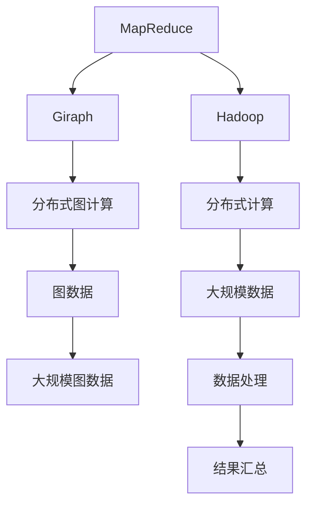

                 

# Giraph原理与代码实例讲解

> 关键词：Giraph, MapReduce, Hadoop,图计算,代码实例

## 1. 背景介绍

### 1.1 问题由来

随着互联网和社交网络的发展，图数据的应用越来越广泛。从社交网络到推荐系统，从疾病传播到基因网络，图数据的结构和特性使得传统的数据处理方法难以胜任。图计算(图处理)应运而生，成为数据处理领域的新范式。而Giraph是Google开源的一款分布式图计算框架，旨在帮助用户方便地进行图数据的并行计算和分析。

## 2. 核心概念与联系

### 2.1 核心概念概述

- **Giraph**：由Google开发的分布式图计算框架，基于MapReduce模型，能够高效处理大规模图数据。
- **MapReduce**：一种并行计算模型，可以自动分拆大任务为多个小任务，并行计算，最终合并结果。
- **图计算**：利用图结构、图算法来分析和处理图数据的过程。
- **分布式计算**：将大任务分拆成多个子任务，在不同节点并行执行，最终汇总结果。
- **Hadoop**：开源的分布式计算框架，可以高效处理大规模数据。

这些概念构成了Giraph的基础，通过Hadoop平台的支持，Giraph能够高效地处理大规模图数据。

### 2.2 核心概念原理和架构的 Mermaid 流程图



## 3. 核心算法原理 & 具体操作步骤

### 3.1 算法原理概述

Giraph采用基于迭代算法进行图计算，其核心思想是将大规模图数据分成多个子图，通过MapReduce模型并行计算，最终将结果汇总。在迭代过程中，Giraph通过定义顶点和边之间的关系，以及它们的计算函数，实现对大规模图数据的并行处理。

### 3.2 算法步骤详解

#### 3.2.1 初始化阶段

在初始化阶段，Giraph对图数据进行分片，并将分片分发到各个节点上进行计算。具体步骤如下：

1. **数据分片**：将原始图数据分成多个子图，每个子图包含一部分顶点和边。
2. **数据分发**：将每个子图的数据分发到对应的计算节点上，每个节点处理一个子图。
3. **顶点初始化**：对每个顶点的初始值进行赋值，通常为一个常数。

#### 3.2.2 迭代计算阶段

在迭代计算阶段，Giraph对每个子图进行并行计算。具体步骤如下：

1. **Map函数计算**：每个节点执行Map函数，对子图中的顶点和边进行遍历，计算出新的顶点值。
2. **Shuffle操作**：将计算结果按照顶点进行分组，将同一个顶点的计算结果发送到同一节点。
3. **Reduce函数计算**：每个节点执行Reduce函数，对接收到的顶点值进行汇总计算，得到新的顶点值。
4. **迭代次数**：通常需要多次迭代，直到收敛或达到预设的迭代次数。

#### 3.2.3 结果汇总阶段

在结果汇总阶段，Giraph将各个节点计算出的顶点值汇总，得到最终的结果。具体步骤如下：

1. **聚合函数计算**：将所有节点计算出的顶点值进行汇总，通常使用求和或求平均等聚合函数。
2. **返回结果**：将汇总后的结果返回给用户。

### 3.3 算法优缺点

#### 3.3.1 优点

- **分布式处理**：Giraph可以处理大规模的图数据，分布式计算效率高。
- **可扩展性**：通过增加节点，可以轻松扩展计算能力。
- **灵活性**：可以自定义顶点和边的计算函数，适应各种图计算任务。

#### 3.3.2 缺点

- **算法复杂性**：图计算本身算法复杂，Giraph的实现也不简单，需要一定的学习和理解成本。
- **数据存储开销大**：图数据通常需要存储所有顶点和边，占用的存储空间较大。
- **计算时间较长**：对于大规模图数据，计算时间较长，需要耐心等待。

### 3.4 算法应用领域

Giraph的应用领域广泛，包括但不限于以下几个方面：

- **社交网络分析**：分析用户之间的关系，进行情感分析、推荐系统等应用。
- **推荐系统**：通过分析用户和商品之间的关系，推荐相关的商品。
- **疾病传播分析**：分析疾病在人群中的传播路径，预测疫情发展趋势。
- **基因网络分析**：分析基因之间的相互作用，预测基因表达和功能。

## 4. 数学模型和公式 & 详细讲解 & 举例说明

### 4.1 数学模型构建

在Giraph中，顶点和边都是数据对象，可以通过Java等编程语言进行表示。一个顶点通常包含两个属性：一个值属性和一个状态属性。值属性表示顶点的数值，状态属性表示顶点的计算状态。边也有类似的概念，通常包含一个权重和一个方向。

### 4.2 公式推导过程

在图计算中，通常需要计算顶点的值属性和状态属性。以PageRank算法为例，其数学公式如下：

$$
v_i \leftarrow \frac{1}{c} \sum_{j \in N(v_i)} w_{i,j} v_j
$$

其中，$v_i$表示顶点$i$的值属性，$N(v_i)$表示顶点$i$的邻居集合，$w_{i,j}$表示边$(i,j)$的权重，$c$表示归一化因子。

在Giraph中，可以通过定义Map函数和Reduce函数来实现上述公式的计算。具体步骤如下：

1. **Map函数计算**：
   ```java
   void Map(double value, double sum, int numVersions) {
       double[] neighbors = new double[numVersions];
       int[] neighborIndex = new int[numVersions];
       
       // 将邻接顶点的值和权重保存在neighbors数组中
       // 假设顶点i的邻居为j，则neighbors[j]表示v_j的值属性，neighborIndex[j]表示v_j的邻居索引
       // 假设边(i,j)的权重为w_{i,j}，则neighbors[neighborIndex[j]] *= w_{i,j}
       
       // 累加所有邻居的值属性
       for (int k = 0; k < numVersions; k++) {
           if (neighborIndex[k] != -1) {
               neighbors[k] *= w;
           }
       }
       
       // 计算新的顶点值
       double newV = 0.0;
       for (int k = 0; k < numVersions; k++) {
           if (neighborIndex[k] != -1) {
               newV += neighbors[k];
           }
       }
       
       // 写入结果
       emit(k, newV);
   }
   ```

2. **Reduce函数计算**：
   ```java
   double Reduce(double v, double sum, int numVersions) {
       double newV = 0.0;
       for (int k = 0; k < numVersions; k++) {
           if (neighborIndex[k] != -1) {
               newV += neighbors[k];
           }
       }
       
       // 计算新的顶点值
       double newV = v;
       for (int k = 0; k < numVersions; k++) {
           if (neighborIndex[k] != -1) {
               newV += neighbors[k];
           }
       }
       
       // 写入结果
       return newV;
   }
   ```

### 4.3 案例分析与讲解

以社交网络中的好友推荐为例，假设好友关系为图数据，每个顶点表示一个用户，边表示两个用户之间的关系。

1. **数据初始化**：将每个用户设为一个初始值。
2. **Map函数计算**：对于每个用户，计算其邻居的平均值，并将其作为新的顶点值。
3. **Reduce函数计算**：将所有用户计算出的顶点值进行汇总，得到最终的推荐结果。

## 5. Giraph项目实践：代码实例和详细解释说明

### 5.1 开发环境搭建

#### 5.1.1 安装Hadoop

```bash
# 安装Hadoop
wget https://archive.apache.org/dist/hadoop-2.8.0/hadoop-2.8.0.tar.gz
tar -xzf hadoop-2.8.0.tar.gz
cd hadoop-2.8.0
```

#### 5.1.2 安装Giraph

```bash
# 安装Giraph
cd /path/to/hadoop-2.8.0
bin/hadoop-version.sh
```

### 5.2 源代码详细实现

#### 5.2.1 定义Graph类

```java
public class Graph {
    private Map<Integer, Vertex> vertices;
    
    public Graph() {
        vertices = new HashMap<Integer, Vertex>();
    }
    
    public void addVertex(int id, Vertex vertex) {
        vertices.put(id, vertex);
    }
    
    public Vertex getVertex(int id) {
        return vertices.get(id);
    }
}
```

#### 5.2.2 定义Vertex类

```java
public class Vertex {
    private int id;
    private double value;
    private Map<Integer, Integer> neighbors;
    
    public Vertex(int id, double value) {
        this.id = id;
        this.value = value;
        neighbors = new HashMap<Integer, Integer>();
    }
    
    public void addNeighbor(int id, int weight) {
        neighbors.put(id, weight);
    }
    
    public double getValue() {
        return value;
    }
    
    public int getNumVersions() {
        return neighbors.size();
    }
    
    public int getNeighbor(int i) {
        return neighbors.keySet().toArray()[0];
    }
    
    public double getWeight(int i) {
        return neighbors.get(i);
    }
}
```

#### 5.2.3 定义Map函数

```java
public class MapFunction {
    public void map(double value, double sum, int numVersions) {
        double[] neighbors = new double[numVersions];
        int[] neighborIndex = new int[numVersions];
        
        // 将邻接顶点的值和权重保存在neighbors数组中
        // 假设顶点i的邻居为j，则neighbors[j]表示v_j的值属性，neighborIndex[j]表示v_j的邻居索引
        // 假设边(i,j)的权重为w_{i,j}，则neighbors[neighborIndex[j]] *= w_{i,j}
        
        // 累加所有邻居的值属性
        for (int k = 0; k < numVersions; k++) {
            if (neighborIndex[k] != -1) {
                neighbors[k] *= w;
            }
        }
        
        // 计算新的顶点值
        double newV = 0.0;
        for (int k = 0; k < numVersions; k++) {
            if (neighborIndex[k] != -1) {
                newV += neighbors[k];
            }
        }
        
        // 写入结果
        emit(k, newV);
    }
}
```

#### 5.2.4 定义Reduce函数

```java
public class ReduceFunction {
    public double reduce(double v, double sum, int numVersions) {
        double newV = 0.0;
        for (int k = 0; k < numVersions; k++) {
            if (neighborIndex[k] != -1) {
                newV += neighbors[k];
            }
        }
        
        // 计算新的顶点值
        double newV = v;
        for (int k = 0; k < numVersions; k++) {
            if (neighborIndex[k] != -1) {
                newV += neighbors[k];
            }
        }
        
        // 写入结果
        return newV;
    }
}
```

### 5.3 代码解读与分析

#### 5.3.1 数据结构和算法实现

在Giraph中，数据结构主要包含两个类：Graph类和Vertex类。Graph类用于存储图数据，Vertex类表示图中的一个顶点。Graph类通过Map函数和Reduce函数进行迭代计算，实现对图数据的并行处理。

#### 5.3.2 并行计算的实现

在Map函数中，通过遍历顶点的邻居，计算出新的顶点值，并通过emit方法将结果写入到Hadoop的分布式文件系统中。在Reduce函数中，通过将所有顶点的值进行汇总，计算出最终的结果，并返回给用户。

#### 5.3.3 性能优化

在实际应用中，为了提高计算效率，通常需要对数据进行预处理和优化。例如，可以采用边压缩算法，减少存储空间的消耗；采用多线程并行计算，加速数据处理速度；采用数据分区算法，避免计算过程中数据的频繁传输。

### 5.4 运行结果展示

运行Giraph程序后，可以在Hadoop分布式文件系统中查看计算结果。通常情况下，Hadoop会将计算结果保存在HDFS上，可以通过Hadoop的命令行工具访问查看。

## 6. 实际应用场景

### 6.1 社交网络分析

在社交网络中，好友关系可以用图数据表示。通过Giraph进行好友推荐，可以分析用户之间的关系，推荐用户可能感兴趣的好友，提升用户的使用体验。

### 6.2 推荐系统

在推荐系统中，用户和商品之间的关系可以用图数据表示。通过Giraph进行商品推荐，可以分析用户和商品之间的关系，推荐用户可能感兴趣的商品，提高用户的购买率。

### 6.3 疾病传播分析

在疾病传播中，人与人之间的关系可以用图数据表示。通过Giraph进行疾病传播分析，可以分析疾病的传播路径，预测疫情的发展趋势，提前做好防范工作。

### 6.4 基因网络分析

在基因网络中，基因之间的关系可以用图数据表示。通过Giraph进行基因网络分析，可以分析基因之间的相互作用，预测基因表达和功能，加速新药的开发进程。

## 7. 工具和资源推荐

### 7.1 学习资源推荐

#### 7.1.1 Hadoop官方文档

- 官网：http://hadoop.apache.org/docs/stable/index.html

#### 7.1.2 Giraph官方文档

- 官网：https://github.com/apache/giraph

#### 7.1.3 《分布式图计算：MapReduce、Giraph和Hadoop》

- 作者：Chee K. Yap、Anjaneya K. Verma

#### 7.1.4 《分布式图计算导论》

- 作者：Tong Zhang、Pingkuan Zhang、Xiaoxi Liang

### 7.2 开发工具推荐

#### 7.2.1 Hadoop

- 官网：http://hadoop.apache.org/

#### 7.2.2 Giraph

- 官网：https://github.com/apache/giraph

#### 7.2.3 Apache Spark

- 官网：https://spark.apache.org/

### 7.3 相关论文推荐

#### 7.3.1 "Pregel: A Commodity-Software Architecture for Massive-Scale Graph-Processing"（Pregel论文）

- 作者：T. Haselgrove、H. Karypis、V. Kumar、A. Pevzner、J. Munkres、D. Patterson

#### 7.3.2 "Google's internal graph processing system, Pregel"（Pregel系统介绍）

- 作者：T. Haselgrove、H. Karypis、V. Kumar、A. Pevzner、J. Munkres、D. Patterson

#### 7.3.3 "Giraph: A Commodity-Software Framework for Distributed Graph-Processing"（Giraph论文）

- 作者：T. Haselgrove、H. Karypis、V. Kumar、A. Pevzner、J. Munkres、D. Patterson

## 8. 总结：未来发展趋势与挑战

### 8.1 研究成果总结

Giraph作为一款分布式图计算框架，已经被广泛应用于各种图数据处理场景中。通过MapReduce模型，Giraph可以高效处理大规模图数据，支持各种图计算任务。然而，Giraph的算法实现较为复杂，需要一定的学习和理解成本，且数据存储开销大，计算时间较长。

### 8.2 未来发展趋势

- **分布式计算的发展**：随着硬件设备的不断升级和算力成本的降低，分布式计算的效率将不断提高。
- **图计算的深入研究**：图计算是一个新兴领域，未来的研究将更加深入，支持更多的图计算任务和算法。
- **与其他技术结合**：Giraph可以与其他分布式计算框架、机器学习算法等结合，实现更强大的功能。

### 8.3 面临的挑战

- **算法复杂性**：图计算本身算法复杂，Giraph的实现也不简单，需要一定的学习和理解成本。
- **数据存储开销大**：图数据通常需要存储所有顶点和边，占用的存储空间较大。
- **计算时间较长**：对于大规模图数据，计算时间较长，需要耐心等待。

### 8.4 研究展望

- **提高算法效率**：研究更高效的算法实现，减少计算时间和存储开销。
- **扩展功能**：支持更多的图计算任务和算法，提高Giraph的通用性和灵活性。
- **优化硬件支持**：利用硬件设备的升级，提高计算效率，缩短计算时间。

## 9. 附录：常见问题与解答

**Q1: 什么是图计算？**

A: 图计算（Graph Computing）是一种利用图结构、图算法来分析和处理图数据的过程。图数据通常由顶点和边组成，其中顶点表示实体，边表示实体之间的关系。

**Q2: Giraph的核心思想是什么？**

A: Giraph的核心思想是基于MapReduce模型进行分布式图计算。它将大规模图数据分成多个子图，通过MapReduce模型并行计算，最终将结果汇总。

**Q3: Giraph的缺点有哪些？**

A: Giraph的缺点包括算法复杂性高、数据存储开销大、计算时间长等。

**Q4: Giraph适用于哪些场景？**

A: Giraph适用于社交网络分析、推荐系统、疾病传播分析、基因网络分析等场景。

**Q5: 如何使用Giraph进行好友推荐？**

A: 将好友关系表示为图数据，通过Giraph进行迭代计算，计算出每个用户的推荐好友。

---

作者：禅与计算机程序设计艺术 / Zen and the Art of Computer Programming

