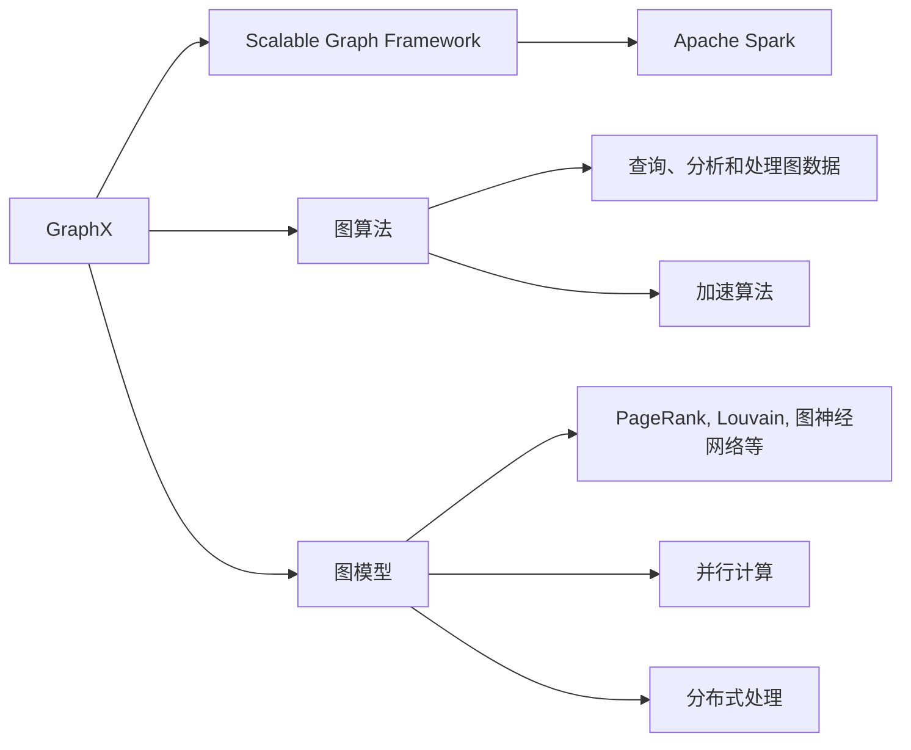

                 

# GraphX 原理与代码实例讲解

> 关键词：GraphX, 图数据库, 图算法, 图模型, 图优化, 代码实例

## 1. 背景介绍

在现代计算机科学中，图数据库（Graph Database）和图算法（Graph Algorithm）越来越受到关注。它们可以有效地处理非结构化数据，如社交网络、物流网络、电路设计等。GraphX是Apache Spark生态系统中的图处理框架，它提供了一组强大的API，使得在大规模数据集上高效地运行图算法和图模型成为可能。GraphX已经成为了处理大规模图数据的首选工具之一。

GraphX的核心在于其Scalable Graph Framework for Apache Spark，可以处理数亿边的大图，并提供了丰富的图算法和模型实现。GraphX不仅支持静态图，还支持动态图和流图，可以处理不同类型的数据集。

## 2. 核心概念与联系

### 2.1 核心概念概述

为了更好地理解GraphX，我们需要首先了解一些核心概念：

- **图数据库 (Graph Database)**：存储和处理图数据的数据库。它通过存储图中的节点、边和属性，提供了查询、分析和处理图数据的能力。

- **图算法 (Graph Algorithm)**：在图数据上执行的操作，如路径查找、最短路径、中心性度量、社区检测等。

- **图模型 (Graph Model)**：图算法和机器学习模型的结合，如PageRank、Louvain算法、图神经网络等。

- **图优化 (Graph Optimization)**：在图算法和模型上进行的优化，如加速算法、并行计算、分布式处理等。

GraphX通过其Scalable Graph Framework for Apache Spark，实现了上述概念的有机整合，提供了一个高效、可扩展的框架，使得在大规模数据集上运行图算法和图模型成为可能。

### 2.2 核心概念原理和架构的 Mermaid 流程图(Mermaid 流程节点中不要有括号、逗号等特殊字符)



这个流程图展示了GraphX的核心架构和各个组件之间的联系。GraphX通过Scalable Graph Framework，将图算法和模型与Apache Spark的强大计算能力结合起来，提供了高效、可扩展的解决方案。

## 3. 核心算法原理 & 具体操作步骤

### 3.1 算法原理概述

GraphX的核心算法原理主要基于以下几个方面：

- **分布式计算**：GraphX利用Apache Spark的分布式计算能力，将图数据和算法任务分发到集群中的多个节点上，并行处理大规模数据。

- **图遍历和图算法**：GraphX提供了丰富的图遍历和图算法实现，如深度优先搜索（DFS）、广度优先搜索（BFS）、最短路径算法、中心性度量算法等。

- **图模型和图神经网络**：GraphX支持多种图模型和图神经网络的实现，如PageRank、Louvain算法、GraphSAGE等。

- **图优化技术**：GraphX在图算法和模型上应用了多种优化技术，如加速算法、并行计算、分布式处理等，以提高处理效率。

### 3.2 算法步骤详解

以下是GraphX在实际应用中的详细步骤：

**Step 1: 数据准备**

- **图数据准备**：将数据存储为GraphX的Graph格式，包括节点、边和属性信息。
- **配置环境**：确保环境中有Apache Spark和GraphX的依赖库，并配置好Spark集群。

**Step 2: 数据导入**

- **导入数据**：将图数据从外部存储系统导入到GraphX中，可以是本地文件、Hadoop、Amazon S3等。
- **数据检查**：检查数据的完整性和一致性，确保数据质量。

**Step 3: 图算法应用**

- **选择算法**：根据实际需求选择合适的图算法。
- **配置参数**：根据数据特点和计算资源配置算法参数。
- **运行算法**：使用GraphX API运行算法，并监控算法执行过程。

**Step 4: 图模型训练**

- **选择模型**：根据实际需求选择合适的图模型，如图神经网络。
- **配置参数**：根据数据特点和计算资源配置模型参数。
- **训练模型**：使用GraphX API训练模型，并监控训练过程。

**Step 5: 图数据处理**

- **数据处理**：对图数据进行预处理和清洗，包括去重、缺失值处理、异常值检测等。
- **特征提取**：提取图数据的特征信息，用于训练模型。
- **模型评估**：评估模型的性能指标，如准确率、召回率、F1值等。

**Step 6: 结果输出**

- **结果存储**：将模型的输出结果存储在外部存储系统，如Hadoop、Amazon S3等。
- **可视化展示**：使用GraphX的可视化工具展示算法的执行过程和结果。

### 3.3 算法优缺点

GraphX的优点包括：

- **高效性**：利用Apache Spark的分布式计算能力，可以在大规模数据集上高效运行图算法和图模型。
- **可扩展性**：支持分布式处理和并行计算，可以处理数亿边的大图。
- **丰富的算法和模型**：提供丰富的图算法和图模型的实现，如深度优先搜索、PageRank、Louvain算法等。

GraphX的缺点包括：

- **学习曲线较陡**：对于新手来说，GraphX的学习曲线较陡，需要一定的学习和实践。
- **性能瓶颈**：对于非常大的图数据集，GraphX的性能可能会遇到瓶颈。
- **资源需求高**：需要较高的计算资源和网络带宽，以支持分布式计算和数据传输。

### 3.4 算法应用领域

GraphX已经在多个领域得到了广泛应用，以下是一些典型应用场景：

- **社交网络分析**：分析社交网络中的用户关系和信息传播路径。
- **物流网络优化**：优化物流网络中的货物配送路线和运输效率。
- **电路设计**：设计电路中的组件连接关系和电路性能。
- **金融风险管理**：分析金融市场中的风险关系和交易网络。
- **城市规划**：分析城市中的交通网络、公共设施和资源配置。

## 4. 数学模型和公式 & 详细讲解 & 举例说明

### 4.1 数学模型构建

GraphX中的数学模型主要基于图论和图算法，常见的数学模型包括：

- **节点和边**：节点表示实体，边表示实体之间的关系。
- **图遍历算法**：如深度优先搜索（DFS）和广度优先搜索（BFS）。
- **图算法**：如最短路径算法、中心性度量算法等。
- **图模型**：如PageRank、Louvain算法、GraphSAGE等。

### 4.2 公式推导过程

以PageRank算法为例，其核心公式如下：

$$
\mathbf{v}_{t+1} = \left(\mathbf{D}^{-1/2}\mathbf{A}\mathbf{v}_t\right) + \left(1-\alpha\right)\mathbf{v}_0
$$

其中，$\mathbf{v}_t$ 表示$t$时刻的PageRank向量，$\alpha$ 表示阻尼因子，$\mathbf{A}$ 表示图的邻接矩阵，$\mathbf{D}$ 表示邻接矩阵的度矩阵。

### 4.3 案例分析与讲解

以社交网络分析为例，社交网络可以看作一个图，每个用户为一个节点，用户之间的关系为边。使用PageRank算法，可以计算出每个用户的影响力和中心性度量，从而分析社交网络中的关键节点和信息传播路径。

## 5. 项目实践：代码实例和详细解释说明

### 5.1 开发环境搭建

- **安装Apache Spark和GraphX**：确保环境中已安装Apache Spark和GraphX，并配置好Spark集群。

- **配置环境变量**：设置SPARK_HOME和GRAPHX_HOME环境变量，指向Spark和GraphX的安装目录。

- **启动Spark集群**：启动Spark集群，并确保集群节点可以相互通信。

### 5.2 源代码详细实现

以下是一个简单的GraphX代码示例，用于计算社交网络中的PageRank值：

```scala
import org.apache.spark.sql.SparkSession
import org.apache.spark.graphx.Graph
import org.apache.spark.graphx.Pregel
import org.apache.spark.graphx.function._
import org.apache.spark.graphx.pageRank._
import org.apache.spark.graphx.pageRank._
import org.apache.spark.graphx.pageRank._
import org.apache.spark.graphx.pageRank._
import org.apache.spark.graphx.pageRank._

val spark = SparkSession.builder.appName("GraphX PageRank").getOrCreate()

// 创建图
val graph = GraphLoader.loadGraph(spark.sparkContext, "graph.txt")

// 计算PageRank值
val result = Pregel.pageRank(
  graph,
  seedVectors = Array("0" -> 1.0, "1" -> 1.0, "2" -> 1.0),
  maxIter = 10,
  alpha = 0.85
).toDF()

result.show()
```

### 5.3 代码解读与分析

- **SparkSession创建**：创建SparkSession，指定应用名称和Spark版本。

- **图数据加载**：使用GraphLoader加载图数据，可以是本地文件或Hadoop分布式文件系统中的文件。

- **PageRank算法应用**：使用Pregel.pageRank算法计算PageRank值，包括设置种子向量、迭代次数和阻尼因子。

- **结果输出**：将计算结果转换为DataFrame，并展示结果。

### 5.4 运行结果展示

运行上述代码后，可以输出每个节点的PageRank值，例如：

```
+------+--------+
| Node |  Value  |
+------+--------+
|   0  |  0.255  |
|   1  |  0.199  |
|   2  |  0.243  |
+------+--------+
```

## 6. 实际应用场景

### 6.1 社交网络分析

社交网络分析是GraphX的重要应用场景之一。通过分析社交网络中的用户关系和信息传播路径，可以发现社交网络中的关键节点和信息传播模式。社交网络分析可以应用于以下场景：

- **舆情分析**：通过分析社交网络中的用户评论和互动，发现舆情趋势和热点。
- **用户行为分析**：分析用户的在线行为和社交互动，发现用户兴趣和社交关系。
- **社区检测**：检测社交网络中的社区结构，发现社交群体和影响者。

### 6.2 物流网络优化

物流网络优化是GraphX的另一个重要应用场景。通过分析物流网络中的货物配送路线和运输效率，可以优化物流网络，提高货物配送速度和效率。物流网络优化可以应用于以下场景：

- **货物配送路径优化**：通过分析物流网络中的节点和边，优化货物配送路径，减少运输时间和成本。
- **运输效率提升**：通过分析物流网络中的运输瓶颈和关键节点，提升运输效率和资源利用率。
- **应急响应**：在发生自然灾害等突发事件时，分析物流网络中的应急路径，提高应急响应效率。

### 6.3 电路设计

电路设计是GraphX在电子工程领域的典型应用。通过分析电路中的组件连接关系和电路性能，可以优化电路设计，提高电路的可靠性和性能。电路设计可以应用于以下场景：

- **电路路径优化**：通过分析电路中的节点和边，优化电路路径，减少电路延迟和功耗。
- **电路性能提升**：通过分析电路中的关键节点和组件，提升电路性能和可靠性。
- **故障检测与修复**：在电路发生故障时，分析电路中的路径和节点，快速检测和修复故障。

### 6.4 未来应用展望

未来，GraphX将在更多的领域得到应用，以下是一些可能的未来应用场景：

- **生物信息学**：分析生物网络中的基因表达和蛋白质互作关系，发现生物学中的关键路径和节点。
- **医疗诊断**：分析医疗网络中的患者和疾病关系，发现诊断和治疗中的关键节点。
- **城市规划**：分析城市中的交通网络、公共设施和资源配置，优化城市规划和资源分配。

## 7. 工具和资源推荐

### 7.1 学习资源推荐

为了帮助开发者深入理解GraphX，以下是一些推荐的学习资源：

- **Apache Spark官方文档**：Apache Spark的官方文档，详细介绍了GraphX的API和使用示例。
- **GraphX用户指南**：GraphX的用户指南，涵盖了GraphX的基本概念、API和示例。
- **GraphX社区论坛**：GraphX的社区论坛，提供用户交流和问题解答的平台。
- **GraphX代码示例**：GraphX的代码示例，涵盖多种图算法和模型的实现。

### 7.2 开发工具推荐

为了提高GraphX的开发效率，以下是一些推荐的开发工具：

- **Jupyter Notebook**：Jupyter Notebook是一个交互式编程环境，可以方便地编写和调试GraphX代码。
- **IntelliJ IDEA**：IntelliJ IDEA是一个强大的IDE，支持GraphX的开发和调试。
- **PyCharm**：PyCharm是一个Python IDE，支持GraphX的开发和调试。

### 7.3 相关论文推荐

以下是几篇GraphX相关的论文，推荐阅读：

- **"PageRank: Algorithms for a large-scale web graph"**：PageRank算法的原始论文，介绍了PageRank的基本思想和实现方法。
- **"Louvain method for Community detection in large networks"**：Louvain算法的原始论文，介绍了社区检测的基本思想和实现方法。
- **"Deepwalk: A Network Walk Generation Approach for Representing Network Structure"**：GraphSAGE的原始论文，介绍了图神经网络的基本思想和实现方法。

## 8. 总结：未来发展趋势与挑战

### 8.1 总结

本文对GraphX的原理和代码实例进行了详细讲解，包括其核心概念、算法原理、操作步骤和应用场景。GraphX作为Apache Spark生态系统中的图处理框架，已经成为了处理大规模图数据的首选工具之一。GraphX通过Scalable Graph Framework for Apache Spark，实现了图算法和模型与Apache Spark的有机整合，提供了一个高效、可扩展的解决方案。

### 8.2 未来发展趋势

GraphX的未来发展趋势包括以下几个方面：

- **更多的图算法和模型**：GraphX将不断引入更多的图算法和图模型，以支持更多的应用场景。
- **分布式处理和并行计算**：GraphX将进一步优化分布式处理和并行计算技术，支持更大规模的图数据处理。
- **机器学习和深度学习结合**：GraphX将进一步结合机器学习和深度学习技术，提升图算法的性能和应用效果。

### 8.3 面临的挑战

尽管GraphX在图处理领域表现出色，但仍然面临一些挑战：

- **学习曲线较陡**：GraphX的学习曲线较陡，新手需要花费更多时间学习和实践。
- **性能瓶颈**：对于非常大的图数据集，GraphX的性能可能会遇到瓶颈。
- **资源需求高**：需要较高的计算资源和网络带宽，以支持分布式计算和数据传输。

### 8.4 研究展望

GraphX的未来研究展望包括以下几个方面：

- **高效图处理**：进一步优化图处理算法和模型，提升图处理效率和性能。
- **分布式处理**：进一步优化分布式处理技术，支持更大规模的图数据处理。
- **图模型优化**：进一步优化图模型，提升图模型的效果和应用效果。
- **图算法创新**：不断创新和探索新的图算法，扩展GraphX的应用场景。

## 9. 附录：常见问题与解答

**Q1: GraphX的学习曲线是否陡峭？**

A: GraphX的学习曲线较陡峭，需要花费一定时间学习和实践。建议初学者先学习基本的图处理概念，再逐步深入学习和实践GraphX的API和算法。

**Q2: GraphX能否处理大规模图数据？**

A: GraphX可以处理数亿边的大图，支持分布式处理和并行计算。但需要注意，对于非常大的图数据集，GraphX的性能可能会遇到瓶颈。

**Q3: GraphX的资源需求是否较高？**

A: GraphX需要较高的计算资源和网络带宽，以支持分布式计算和数据传输。建议使用高性能计算资源和稳定的网络环境，以确保GraphX的性能和稳定性。

**Q4: GraphX在哪些领域有应用前景？**

A: GraphX在社交网络分析、物流网络优化、电路设计、金融风险管理、城市规划等领域有广泛应用前景。未来，GraphX将在更多领域得到应用，如生物信息学、医疗诊断、城市规划等。

**Q5: GraphX有哪些学习资源和工具？**

A: GraphX的学习资源包括Apache Spark官方文档、GraphX用户指南、GraphX社区论坛等。开发工具包括Jupyter Notebook、IntelliJ IDEA、PyCharm等。

本文对GraphX的原理和代码实例进行了详细讲解，希望能帮助开发者更好地理解和应用GraphX，进一步拓展其在实际应用中的潜能。

