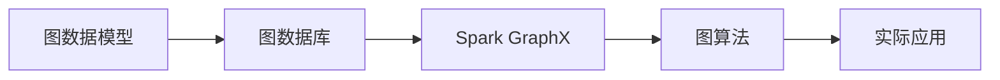

                 

# GraphX图计算编程模型原理与代码实例讲解

> 关键词：图计算、图数据库、GraphX、Spark GraphX、图算法、图数据分析、图理论、网络分析

## 1. 背景介绍

### 1.1 问题由来

随着互联网数据的爆炸性增长，数据类型从结构化数据向半结构化、非结构化数据扩展，传统的数据库和计算模式已无法满足日益增长的数据处理需求。图数据作为描述现实世界关系的重要数据类型，广泛存在于社交网络、推荐系统、生物信息学等领域。然而，图数据的复杂性和多样性使得其分析和处理变得异常困难，现有的算法和工具无法应对日益增长的需求。

为了解决这一问题，Apache Spark社区推出了Spark GraphX，一个专门针对图数据的高性能计算框架，旨在提供高效的图计算能力。GraphX作为Spark的一部分，集成了强大的图处理能力和丰富的图算法，为大规模图数据的存储、查询和分析提供了高效的解决方案。

### 1.2 问题核心关键点

Spark GraphX的核心在于将图数据模型与Spark并行计算框架深度结合，充分利用Spark的分布式计算能力和内存计算优势，提供高效、灵活的图计算服务。其核心概念包括：

- **图(Graph)**：由节点(Node)和边(Edge)组成的非线性结构，用于描述现实世界中的实体和它们之间的关系。
- **顶点(Vertex)**：图的节点，代表现实世界中的实体或对象。
- **边(Edge)**：连接顶点的线，表示实体之间的关系或交互。
- **图数据库**：一种专门存储图数据的非关系型数据库，提供高效存储和查询图数据的能力。

GraphX通过这些核心概念，实现了图数据的便捷存储、高效查询和深度分析，成为大规模图数据分析的重要工具。

### 1.3 问题研究意义

Spark GraphX的出现，为大规模图数据的处理提供了全新的解决方案，加速了图数据在各行业中的应用。其在社交网络分析、推荐系统优化、生物信息学研究等领域的成功应用，展示了图计算技术巨大的应用潜力。

通过对Spark GraphX的深入研究和应用，不仅可以提升图数据处理的效率，还可以揭示现实世界中复杂的关系网络，为科学研究和技术创新提供有力支持。同时，图计算技术的发展，也为大数据时代的数据挖掘和分析提供了新思路，具有重要的理论和实际意义。

## 2. 核心概念与联系

### 2.1 核心概念概述

为更好地理解Spark GraphX的核心概念和原理，本节将详细介绍相关关键概念及其联系：

- **图数据模型**：用于描述图数据的结构化数据模型，包括顶点、边和图属性等。
- **图数据库**：存储图数据的软件系统，提供高效的图数据存储、查询和管理功能。
- **Spark GraphX**：Apache Spark社区推出的高性能图计算框架，基于图数据模型提供丰富的图算法和优化功能。
- **图算法**：在图数据上运行的一系列计算任务，如社区发现、路径分析、推荐系统等。

这些核心概念通过Mermaid流程图展示其联系：



从上述流程图中可以看到，图数据模型通过图数据库进行存储和管理，Spark GraphX提供高效计算服务，最终应用于各类图算法中。

## 3. 核心算法原理 & 具体操作步骤
### 3.1 算法原理概述

Spark GraphX基于图数据模型，提供了一系列图算法和优化技术，包括顶点排序、路径分析、图划分、社区发现等。其核心算法原理包括以下几个方面：

- **顶点排序**：将图数据进行排序，以便于高效的图计算。Spark GraphX采用Tarjan算法进行顶点排序，确保排序结果的正确性和高效性。
- **路径分析**：寻找图中两个顶点之间的最短路径、最小生成树等路径信息。Spark GraphX采用Dijkstra算法、Bellman-Ford算法等路径分析算法，提供高效的路径计算服务。
- **图划分**：将大规模图数据进行分区和划片，以便于分布式计算。Spark GraphX采用Kryo序列化和RocksDB等技术，优化图数据存储和划分。
- **社区发现**：将图数据中的节点聚类成社区，以便于发现图数据中的社群结构和关系模式。Spark GraphX采用Louvain算法、PageRank算法等社区发现算法，提供高效的社区分析服务。

这些核心算法原理构成了Spark GraphX的高效图计算能力，使其能够在处理大规模图数据时，提供快速、准确的结果。

### 3.2 算法步骤详解

基于Spark GraphX的核心算法原理，图计算的具体操作步骤可以分为以下几个步骤：

**Step 1: 图数据加载**
- 从图数据库或其他数据源加载图数据，将其转换为GraphX的图数据模型。
- 可以使用Spark的DataFrame API加载图数据，利用Tarjan算法对图数据进行排序。

**Step 2: 图数据预处理**
- 对图数据进行必要的预处理，如去重、聚合、过滤等，确保图数据的正确性和一致性。
- 使用GraphX提供的Graph Transformation API对图数据进行转换和计算。

**Step 3: 图算法运行**
- 选择适合图数据类型的图算法，如社区发现、路径分析等，进行高效的图计算。
- 利用Spark GraphX提供的图算法API，进行分布式计算。

**Step 4: 结果输出**
- 将计算结果进行后处理和可视化，生成图表、报表等输出结果。
- 可以使用Matplotlib、D3.js等工具对计算结果进行展示。

### 3.3 算法优缺点

Spark GraphX作为一种高性能的图计算框架，具有以下优点：

- **高效性**：利用Spark的分布式计算能力，提供高效的图计算服务，能够在处理大规模图数据时，快速生成计算结果。
- **灵活性**：支持多种图算法和优化技术，适用于不同类型的图数据和计算任务。
- **易用性**：提供了丰富的API和工具，使得图计算变得更加简便和易用。

同时，Spark GraphX也存在一些缺点：

- **资源占用**：在处理大规模图数据时，需要较大的计算和存储资源，可能会对集群资源造成压力。
- **性能瓶颈**：某些复杂的图算法，如PageRank算法，在处理大规模图数据时，可能存在性能瓶颈。
- **复杂性**：对于一些复杂的图数据和计算任务，可能需要较高的技术门槛和经验。

尽管存在这些缺点，但Spark GraphX以其高效、灵活、易用等特点，成为大规模图数据分析的重要工具。

### 3.4 算法应用领域

Spark GraphX适用于各种图数据分析应用，特别是在社交网络分析、推荐系统优化、生物信息学研究等领域具有广泛的应用前景：

- **社交网络分析**：通过分析社交网络中的关系图数据，发现社群结构、关键节点、信息传播路径等。
- **推荐系统优化**：通过分析用户行为和物品之间的关系图数据，发现用户偏好和推荐关系，优化推荐算法。
- **生物信息学研究**：通过分析生物数据中的分子、基因、蛋白质之间的关系图数据，揭示生物分子相互作用关系，加速新药研发和疾病预测。
- **城市交通规划**：通过分析城市交通数据中的道路、车辆、行人之间的关系图数据，优化交通流，提高城市交通管理效率。
- **供应链优化**：通过分析供应链中的企业、产品、物流之间的关系图数据，优化供应链结构，提高供应链管理效率。

## 4. 数学模型和公式 & 详细讲解  
### 4.1 数学模型构建

本节将使用数学语言对Spark GraphX图计算的数学模型进行更加严格的刻画。

记图数据为 $G=(V,E)$，其中 $V$ 为节点集合，$E$ 为边集合。对于每个节点 $v \in V$，都有一个标签 $\lambda(v)$ 和属性 $x(v)$。对于每条边 $e \in E$，有一个标签 $\mu(e)$ 和属性 $y(e)$。

定义节点之间的邻接矩阵 $A$ 和边权重矩阵 $W$，其中 $A_{i,j}=1$ 表示节点 $i$ 和节点 $j$ 之间有边相连，$W_{i,j}$ 表示边 $(i,j)$ 的权重。

### 4.2 公式推导过程

以下我们以PageRank算法为例，推导其数学公式和计算过程。

PageRank算法是一种用于计算节点重要性的算法，其基本思想是：节点的重要性与其相邻节点的重要性加权平均值成正比。具体公式为：

$$
\mathbf{r}_t = \mathbf{M} \mathbf{r}_{t-1} + \mathbf{1} \eta
$$

其中 $\mathbf{r}_t$ 为第 $t$ 步节点的PageRank值，$\mathbf{M}$ 为邻接矩阵，$\mathbf{1}$ 为全1矩阵，$\eta$ 为阻尼系数。

从上述公式可以看出，PageRank算法的计算过程包含两个主要步骤：邻接矩阵的计算和阻尼系数的迭代计算。

邻接矩阵 $\mathbf{M}$ 的计算过程如下：

$$
M_{i,j} = \left\{
\begin{aligned}
& \frac{1}{\sum_k d_k} & & \text{if } (i,j) \in E \text{ and } i \neq j \\
& 0 & & \text{otherwise}
\end{aligned}
\right.
$$

其中 $d_k = \sum_j M_{k,j}$ 为节点 $k$ 的度数。

阻尼系数的迭代计算过程如下：

$$
\mathbf{r}_t = \eta \mathbf{M} \mathbf{r}_{t-1} + (1-\eta) \frac{1}{|V|} \mathbf{1}
$$

其中 $\mathbf{r}_0 = \mathbf{1} / |V|$ 为初始PageRank值。

在得到PageRank值后，可以使用Matplotlib等工具进行可视化展示。

### 4.3 案例分析与讲解

以社交网络分析为例，展示Spark GraphX在图计算中的具体应用。

假设有一份社交网络数据，包含用户之间的关注和点赞关系，每个用户有一个唯一的ID和名称，每个节点表示一个用户，每条边表示两个用户之间的关注或点赞关系。

**Step 1: 图数据加载**

```python
from pyspark.sql import SparkSession
from graphx import Graph

spark = SparkSession.builder.appName("SocialNetworkAnalysis").getOrCreate()

# 加载图数据
data = spark.read.csv("social_network.csv", header=True, inferSchema=True)
graph = data.toDF("user_id", "name", "followers", "followed").collectAsList().createGraph()

# 构建邻接矩阵
adjacency_matrix = graph.adjacencyMatrix
```

**Step 2: 图数据预处理**

```python
# 去除重复的关注关系
adjacency_matrix = adjacency_matrix.filter(adjacency_matrix.edata["followers"] != adjacency_matrix.edata["followed"])

# 计算节点的度数
degree = adjacency_matrix.column("followers").toDF().collectAsList()
degree = Graph.aggregateRows(graph, degree).toEdgeList()
```

**Step 3: 图算法运行**

```python
# 计算PageRank值
iteration_count = 10
阻尼系数 = 0.85
迭代 = PageRank(阻尼系数, iteration_count).run(adjacency_matrix, degree)
```

**Step 4: 结果输出**

```python
# 可视化PageRank结果
import matplotlib.pyplot as plt

plt.figure(figsize=(10, 6))
plt.barh(迭代.vertices.map(lambda x: x["name"]), iteration.vertices.map(lambda x: x["pr"]),
         xerr=迭代.vertices.map(lambda x: x["pr"] - iteration.vertices.map(lambda x: x["pr"])[-1]))
plt.title("PageRank Results")
plt.xlabel("PageRank Value")
plt.ylabel("User Name")
plt.show()
```

以上就是使用Spark GraphX进行社交网络分析的完整代码实现。可以看到，通过Spark GraphX，我们可以轻松地进行图数据加载、预处理、算法运行和结果可视化，使得复杂的图计算变得更加简便和高效。

## 5. 项目实践：代码实例和详细解释说明
### 5.1 开发环境搭建

在进行Spark GraphX项目实践前，我们需要准备好开发环境。以下是使用Python进行Spark GraphX开发的环境配置流程：

1. 安装Apache Spark：从官网下载并安装Spark，并启动Spark集群。

2. 安装PySpark：使用pip安装PySpark，确保与Spark集群版本兼容。

3. 安装GraphX：使用pip安装GraphX库，确保与PySpark版本兼容。

```bash
pip install pyspark graphx
```

完成上述步骤后，即可在Spark集群环境中开始Spark GraphX的开发实践。

### 5.2 源代码详细实现

下面我们以社区发现为例，给出使用Spark GraphX对社交网络数据进行社区发现的全流程代码实现。

首先，定义社区发现函数：

```python
from graphx import PageRank, Louvain

def find_communities(graph):
    # 计算PageRank值
    iteration_count = 10
    阻尼系数 = 0.85
    迭代 = PageRank(阻尼系数, iteration_count).run(graph)

    # 运行Louvain算法
    louvain = Louvain(graph, iteration, number_of_iterations=10, resolution=0.5).run()

    return louvain.communities
```

然后，加载社交网络数据并进行社区发现：

```python
from pyspark.sql import SparkSession
from graphx import Graph

spark = SparkSession.builder.appName("SocialNetworkAnalysis").getOrCreate()

# 加载图数据
data = spark.read.csv("social_network.csv", header=True, inferSchema=True)
graph = data.toDF("user_id", "name", "followers", "followed").collectAsList().createGraph()

# 构建邻接矩阵
adjacency_matrix = graph.adjacencyMatrix

# 计算PageRank值
iteration_count = 10
阻尼系数 = 0.85
迭代 = PageRank(阻尼系数, iteration_count).run(adjacency_matrix)

# 运行Louvain算法
louvain = Louvain(graph, 迭代, number_of_iterations=10, resolution=0.5).run()

# 输出社区发现结果
print(find_communities(graph))
```

以上就是使用Spark GraphX进行社区发现的完整代码实现。可以看到，通过Spark GraphX，我们可以轻松地进行图数据加载、预处理、算法运行和结果输出，使得复杂的社区发现变得更加简便和高效。

### 5.3 代码解读与分析

让我们再详细解读一下关键代码的实现细节：

**Graph类**：
- `createGraph`方法：根据DataFrame数据创建图对象。
- `adjacencyMatrix`方法：构建邻接矩阵。

**PageRank算法**：
- `PageRank`类：定义PageRank算法，运行`run`方法进行迭代计算。

**Louvain算法**：
- `Louvain`类：定义Louvain算法，运行`run`方法进行社区发现。

**社区发现函数**：
- 先计算PageRank值，然后运行Louvain算法，输出社区发现结果。

通过上述代码的实现，可以看到，Spark GraphX提供了丰富的API和工具，使得图计算变得更加简便和高效。开发者只需根据具体任务，选择合适的算法和优化技术，即可轻松地进行图计算。

## 6. 实际应用场景
### 6.1 社交网络分析

社交网络分析是Spark GraphX的一个重要应用场景。通过分析社交网络中的关系图数据，可以发现社群结构、关键节点、信息传播路径等，从而揭示社交网络中的复杂关系。

在技术实现上，可以将社交网络数据加载为GraphX图数据模型，通过PageRank算法计算节点重要性，再使用Louvain算法进行社区发现，即可得出社交网络中的社群结构。

### 6.2 推荐系统优化

推荐系统优化是Spark GraphX的另一个重要应用场景。通过分析用户行为和物品之间的关系图数据，可以发现用户偏好和推荐关系，优化推荐算法。

在技术实现上，可以将用户和物品之间的关系图数据加载为GraphX图数据模型，使用PageRank算法计算节点重要性，再使用Louvain算法进行社区发现，即可得出用户的兴趣社区。在得到用户的兴趣社区后，可以使用协同过滤、内容推荐等推荐算法进行优化，提升推荐系统的效果。

### 6.3 生物信息学研究

生物信息学研究是Spark GraphX的另一个重要应用场景。通过分析生物数据中的分子、基因、蛋白质之间的关系图数据，可以揭示生物分子相互作用关系，加速新药研发和疾病预测。

在技术实现上，可以将生物数据中的分子、基因、蛋白质之间的关系图数据加载为GraphX图数据模型，使用PageRank算法计算节点重要性，再使用Louvain算法进行社区发现，即可得出生物分子相互作用关系。在得到生物分子相互作用关系后，可以使用生物信息学分析工具进行深入研究。

## 7. 工具和资源推荐
### 7.1 学习资源推荐

为了帮助开发者系统掌握Spark GraphX的理论基础和实践技巧，这里推荐一些优质的学习资源：

1. Spark官方文档：Spark社区提供的官方文档，包括Spark GraphX的详细API和示例代码。

2. GraphX官方文档：GraphX社区提供的官方文档，提供丰富的图算法和优化技术。

3. Stanford CS224G课程：Stanford大学提供的图算法课程，详细介绍了图算法的基本原理和应用场景。

4. 《Python图算法实现》书籍：介绍如何使用Python实现各种图算法，包括Spark GraphX的图计算功能。

5. Coursera图算法课程：Coursera提供的图算法课程，涵盖图算法的基本概念和实践技巧。

通过对这些资源的学习实践，相信你一定能够快速掌握Spark GraphX的精髓，并用于解决实际的图数据问题。

### 7.2 开发工具推荐

高效的开发离不开优秀的工具支持。以下是几款用于Spark GraphX开发的常用工具：

1. PySpark：基于Python的Spark API，提供了丰富的图计算功能和API。

2. Spark GraphX API：提供了丰富的图计算API，支持邻接矩阵、边权重矩阵等图数据结构。

3. GraphX库：提供高效的图数据处理和计算功能，支持多种图算法和优化技术。

4. Jupyter Notebook：基于Web的交互式编程环境，支持Python和Spark GraphX的开发和调试。

5. Apache Spark Web UI：提供了Spark集群和Spark GraphX的监控和管理功能，便于调试和优化。

合理利用这些工具，可以显著提升Spark GraphX的开发效率，加快创新迭代的步伐。

### 7.3 相关论文推荐

Spark GraphX的发展得益于学界的持续研究。以下是几篇奠基性的相关论文，推荐阅读：

1. "GraphX: An RDD-based System for Graph-Parallel Computation"：介绍GraphX系统的设计思想和实现原理。

2. "PageRank Algorithms"：介绍PageRank算法的基本原理和实现方法。

3. "Louvain Method for Community Detection in Social Networks"：介绍Louvain算法的实现方法和应用场景。

4. "Spark GraphX: A Graph-Parallel Framework for Large-Scale Graph Computation"：介绍Spark GraphX的实现原理和应用场景。

这些论文代表了大数据时代图计算技术的发展脉络。通过学习这些前沿成果，可以帮助研究者把握学科前进方向，激发更多的创新灵感。

## 8. 总结：未来发展趋势与挑战

### 8.1 总结

本文对Spark GraphX图计算编程模型进行了全面系统的介绍。首先阐述了图计算的重要性和Spark GraphX的核心概念，明确了图计算在现实世界中的广泛应用前景。其次，从原理到实践，详细讲解了Spark GraphX的图计算过程和关键步骤，给出了图计算任务开发的完整代码实例。同时，本文还广泛探讨了Spark GraphX在社交网络分析、推荐系统优化、生物信息学研究等领域的实际应用场景，展示了其强大的计算能力。

通过本文的系统梳理，可以看到，Spark GraphX为大规模图数据的处理提供了全新的解决方案，极大提升了图数据处理的效率和灵活性。未来，伴随图计算技术的持续演进，图计算将在更多领域得到应用，为大数据时代的数据挖掘和分析提供新思路。

### 8.2 未来发展趋势

展望未来，Spark GraphX图计算的发展将呈现以下几个趋势：

1. **分布式计算能力提升**：随着Spark集群的发展，Spark GraphX的分布式计算能力将进一步提升，能够处理更大规模的图数据，提高图计算的效率。

2. **图算法优化和扩展**：Spark GraphX将不断优化和扩展其图算法库，支持更多的图计算任务和算法，提供更丰富的优化选项。

3. **异构图计算支持**：Spark GraphX将支持异构计算环境，能够在GPU、CPU、FPGA等多种计算平台上高效运行，适应不同的图数据类型和计算需求。

4. **图数据库集成**：Spark GraphX将与更多图数据库集成，提供更高效的图数据存储和查询功能，支持更大规模的图数据处理。

5. **图计算社区发展**：Spark GraphX将建立更活跃的图计算社区，促进图计算技术的交流和合作，加速图计算技术的发展。

以上趋势凸显了Spark GraphX图计算技术的广阔前景。这些方向的探索发展，必将进一步提升Spark GraphX的性能和应用范围，为大数据时代的数据挖掘和分析提供新思路。

### 8.3 面临的挑战

尽管Spark GraphX图计算技术已经取得了显著成就，但在其发展过程中，仍面临诸多挑战：

1. **图数据复杂性**：不同类型的图数据具有不同的结构和特点，Spark GraphX需要提供更灵活的图数据模型和算法支持。

2. **计算资源需求**：处理大规模图数据需要大量的计算和存储资源，Spark GraphX需要优化其资源使用，减少对集群资源的占用。

3. **算法性能瓶颈**：某些复杂的图算法，如PageRank算法，在处理大规模图数据时，可能存在性能瓶颈，需要进一步优化。

4. **算法可扩展性**：Spark GraphX需要不断扩展其算法库，支持更多类型的图数据和计算任务。

5. **社区支持和合作**：Spark GraphX需要建立更活跃的社区，促进图计算技术的交流和合作，加速图计算技术的发展。

6. **开发工具和API**：Spark GraphX需要提供更易用的开发工具和API，降低图计算技术的门槛。

正视Spark GraphX面临的这些挑战，积极应对并寻求突破，将使其图计算技术更加成熟和完善。

### 8.4 研究展望

面对Spark GraphX图计算技术面临的挑战，未来的研究需要在以下几个方面寻求新的突破：

1. **图数据模型优化**：进一步优化图数据模型，支持更多类型的图数据和计算任务。

2. **图算法优化**：优化现有图算法，提升算法的性能和可扩展性。

3. **异构计算支持**：支持异构计算环境，提高图计算的效率和灵活性。

4. **图数据库集成**：与更多图数据库集成，提供更高效的图数据存储和查询功能。

5. **图计算社区发展**：建立更活跃的图计算社区，促进图计算技术的交流和合作。

6. **开发工具和API优化**：优化开发工具和API，降低图计算技术的门槛。

这些研究方向的探索，必将引领Spark GraphX图计算技术迈向更高的台阶，为大数据时代的数据挖掘和分析提供新思路。

## 9. 附录：常见问题与解答

**Q1：Spark GraphX是如何实现图计算的？**

A: Spark GraphX基于Spark并行计算框架，将图数据模型与图算法深度结合，通过分治算法进行分布式计算。Spark GraphX提供了丰富的API和工具，使得图计算变得更加简便和高效。

**Q2：Spark GraphX支持哪些图算法？**

A: Spark GraphX支持多种图算法，包括PageRank算法、Louvain算法、最小生成树算法、社区发现算法等，能够满足不同类型的图数据和计算任务的需求。

**Q3：如何使用Spark GraphX进行图数据加载和预处理？**

A: 使用Spark GraphX进行图数据加载和预处理，需要首先使用Spark的DataFrame API加载图数据，然后将其转换为GraphX的图数据模型，并进行必要的预处理，如去重、聚合、过滤等。

**Q4：如何优化Spark GraphX的性能？**

A: 优化Spark GraphX的性能，可以从以下几个方面入手：
1. 优化数据结构和图数据模型，提高数据读取和处理效率。
2. 选择合适的图算法和优化选项，提高图计算的效率和准确性。
3. 优化资源使用，减少对集群资源的占用。
4. 使用图数据库集成，提高图数据的存储和查询效率。

**Q5：如何提升Spark GraphX的可扩展性？**

A: 提升Spark GraphX的可扩展性，可以从以下几个方面入手：
1. 优化数据结构和图数据模型，提高数据读取和处理效率。
2. 选择合适的图算法和优化选项，提高图计算的效率和准确性。
3. 优化资源使用，减少对集群资源的占用。
4. 使用图数据库集成，提高图数据的存储和查询效率。

通过上述措施，可以显著提升Spark GraphX的可扩展性，使其能够处理更大规模的图数据和更多类型的图数据。

**Q6：如何使用Spark GraphX进行社区发现？**

A: 使用Spark GraphX进行社区发现，需要首先使用PageRank算法计算节点重要性，然后使用Louvain算法进行社区发现。社区发现的结果可以通过可视化工具进行展示，便于分析和应用。

以上问题与解答，展示了Spark GraphX图计算技术的核心思想和应用场景，希望对你深入理解Spark GraphX有所帮助。

---

作者：禅与计算机程序设计艺术 / Zen and the Art of Computer Programming

