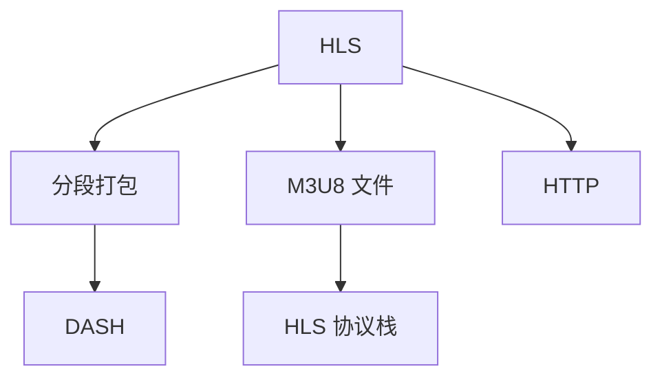

                 

# HLS 流媒体协议：在 HTTP 上分发视频内容

在当今数字化时代，视频流媒体已经成为了主流娱乐和信息传播方式之一。随着用户对视频内容的需求日益增加，流媒体服务提供商面临着更高的分发效率和质量要求。在这一背景下，HTTP Live Streaming (HLS) 协议应运而生，通过将视频内容封装成多个小块，在 HTTP 上分块传输，从而满足了这些需求。本文将深入探讨 HLS 流媒体协议的核心概念、工作原理以及其实际应用场景，并展望其未来的发展趋势。

## 1. 背景介绍

### 1.1 问题由来

随着互联网技术的发展，视频流媒体技术也在不断演进。早期采用的基于 RTMP (Real-Time Messaging Protocol) 的流媒体技术，由于其本身的一些限制（如对浏览器支持不足），逐渐被更为广泛使用的 HTTP 协议所取代。然而，HTTP 协议并不具备实时传输数据的能力，这限制了其在视频流媒体中的应用。

为了克服这一限制，苹果公司于 2009 年推出了 HLS (HTTP Live Streaming) 协议。它采用 HTTP 协议传输视频流，但通过分段打包（Segmentation）技术，使得视频流能够在 HTTP 协议上进行实时传输。HLS 的出现，极大地推动了 Web 视频应用的普及和发展。

### 1.2 问题核心关键点

HLS 协议的核心在于将视频流分成多个小片段，每个片段都是独立的 HTTP 请求，可以通过 HTTP 缓存机制进行优化，从而实现低延迟、高可靠性的实时视频流传输。同时，HLS 协议还支持多种媒体格式，如 MP4、WebM、H.264/H.265 等，具有较高的兼容性和灵活性。

HLS 协议的实现包括两个主要组件：Apple HTTP Streaming Server (HLS Server) 和 HTTP Streaming Client。HLS Server 负责将视频流分成多个小片段，并将其发布到 Web 服务器；而 HTTP Streaming Client 则负责从服务器下载这些片段，并在本地进行缓存和播放。

## 2. 核心概念与联系

### 2.1 核心概念概述

为更好地理解 HLS 协议，本节将介绍几个密切相关的核心概念：

- **HTTP Live Streaming (HLS)**：将视频流分段打包，通过 HTTP 协议传输的一种流媒体协议。
- **分段打包 (Segmentation)**：将视频流分成多个小片段，每个片段都是独立的 HTTP 请求，可以在不同的网络环境下实现自适应传输。
- **M3U8 文件**：用于描述视频流分段信息的文本文件，包含每个分段的位置、大小等信息，是 HLS 流媒体协议的核心。
- **DASH (Dynamic Adaptive Streaming over HTTP)**：一种基于 HTTP 的流媒体协议，与 HLS 类似，但支持更加灵活的码率适应和带宽优化。
- **HLS 协议栈**：包括 HTTP 协议、M3U8 文件、分段打包等技术，是实现 HLS 流媒体传输的基础。

这些核心概念之间的逻辑关系可以通过以下 Mermaid 流程图来展示：



这个流程图展示了大语言模型的核心概念及其之间的关系：

1. HLS 协议采用 HTTP 协议传输，但通过分段打包技术，实现了实时传输。
2. M3U8 文件是 HLS 协议的元数据文件，描述了每个分段的位置、大小等信息。
3. HTTP 协议是 HLS 流传输的基础，提供了可靠的传输机制和缓存功能。
4. DASH 协议与 HLS 类似，但支持更加灵活的码率适应和带宽优化。
5. HLS 协议栈包括 HTTP 协议、M3U8 文件、分段打包等技术，是实现 HLS 流媒体传输的基础。

## 3. 核心算法原理 & 具体操作步骤

### 3.1 算法原理概述

HLS 流媒体协议的核心在于将视频流分成多个小片段，并在 HTTP 上分块传输。其基本原理如下：

1. 将视频流分成多个小片段，每个片段都是独立的 HTTP 请求。
2. 使用 M3U8 文件描述每个分段的位置、大小等信息。
3. 客户端根据 M3U8 文件下载并缓存每个分段。
4. 客户端根据当前网络条件，自适应选择最佳的下载速率和分段。

HLS 协议通过分段打包技术，实现了视频流在 HTTP 上的实时传输。同时，HLS 还支持多种媒体格式和码率，能够适应不同网络条件和客户端设备。

### 3.2 算法步骤详解

HLS 流媒体协议的实现包括以下几个关键步骤：

**Step 1: 分段打包**
- 将原始视频流分成多个小片段，每个片段的长度根据网络条件和客户端设备进行调整。
- 每个片段都包含了完整的音视频数据和元数据，独立进行 HTTP 传输。

**Step 2: 创建 M3U8 文件**
- 使用 M3U8 文件描述每个分段的位置、大小等信息。M3U8 文件通常存储在 Web 服务器上，包含当前视频流的分段信息。
- 客户端通过 HTTP 请求获取 M3U8 文件，解析其中的分段信息。

**Step 3: 获取分段数据**
- 客户端根据 M3U8 文件中的信息，发起 HTTP 请求下载每个分段。
- 每个请求都会返回一个包含完整音视频数据的分段，客户端收到数据后，可以进行缓存和播放。

**Step 4: 自适应传输**
- 客户端根据当前网络条件和设备性能，自适应选择最佳的下载速率和分段。
- 网络条件较差时，客户端会自动跳过低质量的分段，选择更高质量的分段进行播放。

**Step 5: 播放视频**
- 客户端接收到完整的视频数据后，根据时间戳顺序播放视频。
- 视频流支持随机访问，用户可以自由选择播放位置和速度。

### 3.3 算法优缺点

HLS 流媒体协议具有以下优点：

1. 兼容性好：使用 HTTP 协议，支持广泛的网络环境。
2. 自适应传输：能够根据网络条件和设备性能，自动选择最佳分段和码率。
3. 支持多种格式：支持 MP4、WebM、H.264/H.265 等多种媒体格式。
4. 低延迟：分段传输和缓存机制，实现了低延迟视频播放。

同时，HLS 协议也存在一些缺点：

1. 服务器负载：每个分段都需要服务器进行存储和维护，服务器负载较高。
2. 缓存压力：客户端需要缓存多个分段，占用较多的缓存资源。
3. 编码复杂：需要分段打包和元数据生成，编码过程较为复杂。

### 3.4 算法应用领域

HLS 流媒体协议在视频流媒体领域得到了广泛应用，尤其是在 Web 视频、直播、点播等领域。以下是几个典型应用场景：

1. **Web 视频**：通过 HLS 协议，用户可以在 Web 浏览器上观看高质量的视频内容，无需安装专门的播放器。
2. **直播**：HLS 支持实时直播，能够实现低延迟视频播放，满足用户实时观看的需求。
3. **点播**：HLS 支持随机访问，用户可以自由选择播放位置和速度，提供更加灵活的观影体验。
4. **移动端应用**：HLS 协议支持多种设备平台，能够实现跨设备的无缝播放。
5. **广告插入**：HLS 支持中间码流插入，实现视频广告的实时播放。

除了以上场景，HLS 协议还被广泛应用于体育赛事直播、教育培训、在线会议等领域。

## 4. 数学模型和公式 & 详细讲解 & 举例说明

### 4.1 数学模型构建

HLS 流媒体协议的数学模型主要涉及以下几个关键概念：

- 视频流的分段长度：分段长度决定了视频流的码率和延迟。
- 网络带宽：网络带宽决定了客户端的下载速率和缓存大小。
- 客户端缓存容量：客户端缓存容量决定了客户端能够同时下载和缓存的片段数量。

### 4.2 公式推导过程

设视频流的总长度为 $L$，分段长度为 $T$，网络带宽为 $B$，客户端缓存容量为 $C$，每个片段的大小为 $S$。根据 HLS 协议的原理，可以推导出以下公式：

1. 分段长度：$T = L / N$，其中 $N$ 为分段数量。
2. 分段大小：$S = T * F$，其中 $F$ 为每段的数据速率。
3. 客户端缓存容量：$C = N * S$。

### 4.3 案例分析与讲解

以一个简单的案例来说明 HLS 协议的工作原理：

假设某视频流的总长度为 1GB，分段长度为 1MB，网络带宽为 1Mbps，客户端缓存容量为 10MB。则分段数量为 1000，每个分段的大小为 1MB。

1. 视频流被分成 1000 个分段，每个分段大小为 1MB。
2. 客户端通过 HTTP 请求获取 M3U8 文件，解析其中的分段信息。
3. 客户端根据 M3U8 文件中的信息，依次下载每个分段，并将其缓存到本地。
4. 客户端根据当前网络条件，自适应选择最佳的下载速率和分段。
5. 客户端接收到完整的视频数据后，根据时间戳顺序播放视频。

通过这个案例，可以看出 HLS 协议的核心在于分段打包和 HTTP 传输，通过分段打包技术，实现了低延迟、高可靠性的实时视频播放。

## 5. 项目实践：代码实例和详细解释说明

### 5.1 开发环境搭建

在进行 HLS 流媒体协议的开发前，我们需要准备好开发环境。以下是使用 Python 和 Flask 框架实现 HLS 流媒体服务器和客户端的开发环境配置流程：

1. 安装 Python：从官网下载并安装 Python，建议使用 3.8 或更高版本。

2. 安装 Flask：通过 pip 安装 Flask 框架，用于构建 HLS 流媒体服务器。
```bash
pip install Flask
```

3. 安装 PyHLS：通过 pip 安装 PyHLS 库，用于生成 M3U8 文件和处理 HTTP 请求。
```bash
pip install pyhls
```

4. 安装 ffmpeg：使用 ffmpeg 工具进行视频流的分段打包和编码。
```bash
brew install ffmpeg
```

5. 安装 nginx：用于负载均衡和 CDN 加速，可以提升流媒体的传输效率。
```bash
brew install nginx
```

完成上述步骤后，即可在本地搭建 HLS 流媒体服务器和客户端，并进行测试。

### 5.2 源代码详细实现

以下是使用 Flask 和 PyHLS 库实现 HLS 流媒体服务器和客户端的 Python 代码示例：

**HLS 流媒体服务器**

```python
from flask import Flask, Response
import pyhls
import ffmpeg

app = Flask(__name__)

@app.route('/')
def index():
    ffmpeg.input('input.mp4') \
        .split() \
        .map(lambda x: x \
            .with短视频格式('h264') \
            .with视频比特率('1920x1080') \
            .with视频帧率('30') \
        ) \
        .stream()

    generator = pyhls.generate_m3u8(app, 'index.m3u8')
    @app.route('index.m3u8')
    def m3u8():
        return Response(generator(), mimetype='text/plain')

if __name__ == '__main__':
    app.run(host='0.0.0.0', port=5000)
```

**HLS 流媒体客户端**

```python
import pyhls

video_url = 'http://localhost:5000/index.m3u8'

client = pyhls.HLSClient()
client.load_and_play(video_url)
```

以上代码实现了简单的 HLS 流媒体服务器和客户端。服务器使用 Flask 框架构建，通过 PyHLS 库生成 M3U8 文件，使用 ffmpeg 工具进行视频流的分段打包和编码。客户端使用 PyHLS 库进行分段下载和播放。

### 5.3 代码解读与分析

让我们再详细解读一下关键代码的实现细节：

**HLS 流媒体服务器**

- 使用 Flask 框架搭建 Web 服务器，监听 5000 端口。
- 使用 PyHLS 库生成 M3U8 文件，并将其返回给客户端。
- 使用 ffmpeg 工具进行视频流的分段打包和编码。

**HLS 流媒体客户端**

- 使用 PyHLS 库加载并播放 HLS 流媒体，支持自适应码率和分段。

这些代码实现展示了 HLS 流媒体协议的核心流程，包括视频分段、M3U8 文件生成和 HTTP 传输等关键步骤。

### 5.4 运行结果展示

启动服务器和客户端后，可以通过浏览器访问服务器，在浏览器中播放 HLS 流媒体。通过 PyHLS 库的自动适应机制，服务器会根据当前网络条件和客户端设备，自动选择最佳的码率和分段，提供流畅的视频播放体验。

## 6. 实际应用场景

### 6.1 智能电视

HLS 流媒体协议在智能电视中的应用非常广泛。智能电视支持多种媒体格式和码率，通过 HLS 协议，用户可以在智能电视上观看高质量的视频内容，无需安装专用的播放器。同时，智能电视也支持直播、点播、广告插入等功能，提供更加灵活和丰富的观看体验。

### 6.2 在线教育

在线教育平台需要提供高质量的视频内容，以提升用户的观看体验和学习效果。通过 HLS 协议，平台可以将视频内容分段打包，并支持自适应传输，实现低延迟、高可靠性的视频播放。同时，平台还可以使用 HLS 协议支持直播功能，实现实时互动和教学。

### 6.3 体育赛事

体育赛事直播需要实现低延迟、高可靠性的视频播放，满足用户实时观看的需求。HLS 协议可以实现这一目标，通过分段打包和自适应传输，实现高质量的视频直播。同时，平台还可以使用 HLS 协议支持多点源切换，提升直播的稳定性和可靠性。

### 6.4 移动端应用

移动端应用需要提供高质量的视频内容，以提升用户体验和留存率。通过 HLS 协议，应用可以支持多种媒体格式和码率，实现跨设备的无缝播放。同时，平台还可以使用 HLS 协议支持直播功能，实现实时互动和用户参与。

### 6.5 广告插入

HLS 协议支持中间码流插入，实现视频广告的实时播放。广告商可以使用 HLS 协议在视频流中插入广告，通过自适应传输机制，确保广告的播放效果和用户体验。同时，平台还可以使用 HLS 协议支持广告的多种形式，提升广告的展示效果和点击率。

## 7. 工具和资源推荐

### 7.1 学习资源推荐

为了帮助开发者系统掌握 HLS 流媒体协议的理论基础和实践技巧，这里推荐一些优质的学习资源：

1. **《HTTP Live Streaming》**：由苹果公司发布的官方文档，详细介绍了 HLS 协议的工作原理和实现方法。
2. **《HTTP Live Streaming with Angular and WebRTC》**：一本关于使用 Angular 和 WebRTC 实现 HLS 流媒体的书籍，适合 Web 开发者学习。
3. **《YouTube Live Streaming with HLS and WebRTC》**：一本关于使用 HLS 和 WebRTC 实现 YouTube 直播的书籍，适合流媒体开发者学习。
4. **《Real-Time Media with HLS and WebRTC》**：一本关于使用 HLS 和 WebRTC 实现实时媒体的书籍，适合音视频开发者学习。
5. **《HLS 流媒体视频直播》**：由 Udemy 提供的在线课程，详细讲解了 HLS 协议的实现和应用。

通过对这些资源的学习实践，相信你一定能够快速掌握 HLS 流媒体协议的精髓，并用于解决实际的流媒体问题。

### 7.2 开发工具推荐

高效的开发离不开优秀的工具支持。以下是几款用于 HLS 流媒体协议开发的常用工具：

1. **FFmpeg**：开源的音视频处理工具，支持分段打包、编码、解码等功能，是 HLS 协议实现的基础。
2. **PyHLS**：Python 版本的 HLS 流媒体库，支持生成 M3U8 文件、分段下载等功能，方便开发者的使用。
3. **nginx**：开源的 Web 服务器，支持负载均衡和 CDN 加速，可以提升流媒体的传输效率。
4. **YouTube Live Streaming API**：Google 提供的 YouTube 直播 API，支持多种媒体格式和码率，方便开发者进行流媒体开发。
5. **RTMP Streaming API**：Adobe 提供的 RTMP 直播 API，支持多种媒体格式和码率，方便开发者进行流媒体开发。

合理利用这些工具，可以显著提升 HLS 流媒体协议的开发效率，加快创新迭代的步伐。

### 7.3 相关论文推荐

HLS 流媒体协议的发展源于学界的持续研究。以下是几篇奠基性的相关论文，推荐阅读：

1. **《Adaptive Streaming and Dynamic Packaging》**：由 Microsoft 发表的论文，详细介绍了自适应流媒体的实现方法。
2. **《Scalable Video Streaming Using MPEG-DASH》**：由 MPEG 发表的论文，介绍了 DASH 协议的工作原理和实现方法。
3. **《MPEG-DASH and MPEG-H DASH》**：由 MPEG 发表的文档，详细介绍了 DASH 协议的规范和实现方法。
4. **《A Video Transmission Protocl called HLS》**：由苹果公司发表的论文，介绍了 HLS 协议的工作原理和实现方法。
5. **《HLS vs DASH: A Comparison of the Two HTTP Streaming Protocols》**：一篇比较 HLS 和 DASH 协议的论文，详细介绍了两者的优缺点和适用场景。

这些论文代表了大语言模型微调技术的发展脉络。通过学习这些前沿成果，可以帮助研究者把握学科前进方向，激发更多的创新灵感。

## 8. 总结：未来发展趋势与挑战

### 8.1 总结

本文对 HLS 流媒体协议进行了全面系统的介绍。首先阐述了 HLS 协议的背景和意义，明确了其在视频流媒体传输中的重要地位。其次，从原理到实践，详细讲解了 HLS 协议的核心概念和操作步骤，给出了 HLS 流媒体协议的完整代码实现。同时，本文还广泛探讨了 HLS 协议在智能电视、在线教育、体育赛事、移动端应用和广告插入等众多领域的应用前景，展示了 HLS 协议的巨大潜力。

通过本文的系统梳理，可以看出 HLS 流媒体协议已经在视频流媒体传输中发挥了重要作用，其低延迟、高可靠性的特性，使其成为视频流媒体传输的主流标准之一。未来，伴随视频流媒体技术的不断进步，HLS 协议必将在更多应用场景中发挥重要作用。

### 8.2 未来发展趋势

展望未来，HLS 流媒体协议将呈现以下几个发展趋势：

1. **自适应码率优化**：未来 HLS 协议将更加注重自适应码率优化，通过实时带宽调整，提高视频传输的流畅性和可靠性。
2. **多路流传输**：未来 HLS 协议将支持多路流传输，通过并行传输多个视频流，提升视频传输的效率和用户体验。
3. **高质量视频编码**：未来 HLS 协议将支持更多高质量视频编码格式，如 HEVC、AV1 等，提升视频传输的清晰度和帧率。
4. **混合传输协议**：未来 HLS 协议将结合 RTMP、HDS、DASH 等协议，提供更加灵活和高效的视频传输方案。
5. **增强现实和虚拟现实**：未来 HLS 协议将支持增强现实和虚拟现实视频的传输，提升用户体验和互动性。

以上趋势凸显了 HLS 流媒体协议的广阔前景。这些方向的探索发展，必将进一步提升视频流媒体的传输效率和用户体验，为数字化时代的流媒体应用带来更多创新和突破。

### 8.3 面临的挑战

尽管 HLS 流媒体协议已经取得了显著成就，但在迈向更加智能化、普适化应用的过程中，它仍面临着诸多挑战：

1. **服务器负载**：随着视频流量的增加，服务器负载将不断增加，如何优化服务器性能，提升流媒体的传输效率，是一个重要的研究方向。
2. **网络带宽**：网络带宽的限制使得 HLS 协议无法充分发挥其优势，如何优化视频分段大小和码率，提升视频传输的流畅性和可靠性，是一个重要的研究方向。
3. **客户端缓存**：客户端缓存机制虽然可以提升视频传输的稳定性，但也会占用大量缓存资源，如何优化客户端缓存机制，提升用户体验，是一个重要的研究方向。
4. **设备兼容性**：HLS 协议支持多种设备平台，但不同设备的性能和网络环境差异较大，如何优化设备兼容性，提供一致的用户体验，是一个重要的研究方向。
5. **安全性和隐私保护**：HLS 协议需要保证视频传输的安全性和隐私保护，如何防范网络攻击和数据泄露，是一个重要的研究方向。

### 8.4 研究展望

面对 HLS 流媒体协议所面临的挑战，未来的研究需要在以下几个方面寻求新的突破：

1. **自适应码率优化算法**：开发更加高效的自适应码率优化算法，通过实时带宽调整，提高视频传输的流畅性和可靠性。
2. **高质量视频编码技术**：开发更加高效的高质量视频编码技术，支持更多高质量视频编码格式，提升视频传输的清晰度和帧率。
3. **混合传输协议**：开发更加高效的混合传输协议，结合 RTMP、HDS、DASH 等协议，提供更加灵活和高效的视频传输方案。
4. **增强现实和虚拟现实支持**：开发更加高效的增强现实和虚拟现实视频传输方案，提升用户体验和互动性。
5. **安全性和隐私保护技术**：开发更加高效的安全性和隐私保护技术，防范网络攻击和数据泄露，保障视频传输的安全性和隐私保护。

这些研究方向的探索，必将引领 HLS 流媒体协议技术迈向更高的台阶，为视频流媒体传输带来更多创新和突破。

## 9. 附录：常见问题与解答

**Q1: HLS 流媒体协议和 DASH 协议有什么区别？**

A: HLS 流媒体协议和 DASH 协议都是基于 HTTP 的流媒体协议，支持自适应码率和分段传输。主要区别在于 HLS 协议使用 M3U8 文件描述分段信息，而 DASH 协议使用 MPD（Media Presentation Description）文件。同时，HLS 协议支持更快的启动时间，但 DASH 协议支持更加灵活的码率适应和带宽优化。

**Q2: HLS 流媒体协议在移动端应用有哪些优缺点？**

A: HLS 流媒体协议在移动端应用具有以下优点：

- 兼容性好：支持多种设备平台，能够实现跨设备的无缝播放。
- 低延迟：分段传输和缓存机制，实现了低延迟视频播放。

同时，HLS 流媒体协议在移动端应用也存在一些缺点：

- 缓存压力：客户端需要缓存多个分段，占用较多的缓存资源。
- 播放不稳定：移动网络环境不稳定，容易发生网络中断和播放卡顿。

**Q3: HLS 流媒体协议在直播应用有哪些优缺点？**

A: HLS 流媒体协议在直播应用具有以下优点：

- 低延迟：分段传输和缓存机制，实现了低延迟视频播放。
- 自适应码率：能够根据网络条件和客户端设备，自动选择最佳的码率和分段。

同时，HLS 流媒体协议在直播应用也存在一些缺点：

- 服务器负载：每个分段都需要服务器进行存储和维护，服务器负载较高。
- 带宽消耗：直播时，客户端需要同时下载多个分段，带宽消耗较大。

**Q4: HLS 流媒体协议在智能电视应用有哪些优缺点？**

A: HLS 流媒体协议在智能电视应用具有以下优点：

- 兼容性好：支持多种媒体格式和码率，能够实现高质量视频播放。
- 低延迟：分段传输和缓存机制，实现了低延迟视频播放。

同时，HLS 流媒体协议在智能电视应用也存在一些缺点：

- 缓存压力：智能电视缓存容量有限，容易发生缓存溢出。
- 播放不稳定：智能电视网络环境不稳定，容易发生播放卡顿和卡顿。

**Q5: HLS 流媒体协议在在线教育应用有哪些优缺点？**

A: HLS 流媒体协议在在线教育应用具有以下优点：

- 自适应码率：能够根据网络条件和客户端设备，自动选择最佳的码率和分段。
- 低延迟：分段传输和缓存机制，实现了低延迟视频播放。

同时，HLS 流媒体协议在在线教育应用也存在一些缺点：

- 服务器负载：视频流服务器负载较高，需要高效的服务器配置和优化。
- 带宽消耗：在线教育平台需要同时处理大量并发用户，带宽消耗较大。

---

作者：禅与计算机程序设计艺术 / Zen and the Art of Computer Programming

