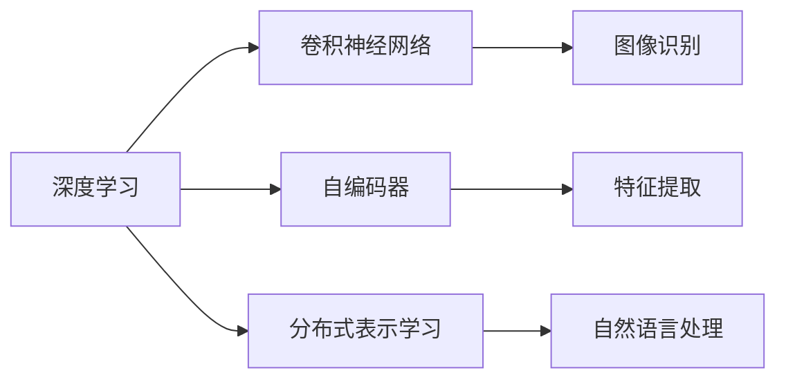

                 

## 1. 背景介绍

在人工智能领域，有三位先驱性的科学家对于算法的发展起到了至关重要的作用，他们是Geoffrey Hinton、Yann LeCun和Yoshua Bengio。他们在深度学习算法的研究、开发和推广方面做出了巨大的贡献，被广泛认为奠定了现代人工智能的基础。

### 1.1 研究背景

- **深度学习的起源**：深度学习的发展可追溯至20世纪80年代，当时神经网络被重新发现并应用到图像识别等任务中。然而，由于梯度消失等问题，深度学习并未取得突破性进展。
- **先驱科学家**：1989年，Geoffrey Hinton和Yoshua Bengio等研究人员提出多层神经网络的非线性逼近能力，标志着深度学习重新兴起。2006年，Yann LeCun在ImageNet数据集上的成功，使得卷积神经网络(CNN)在计算机视觉领域大放异彩。

## 2. 核心概念与联系

### 2.1 核心概念概述

- **深度学习**：基于多层次的非线性表示学习的机器学习方法。其核心是构建多层神经网络，每层学习数据的不同层次特征，最终输出预测结果。
- **卷积神经网络**：专门用于处理具有网格结构数据（如图像、视频等）的神经网络，具有局部连接、权重共享、池化等特性，特别适用于视觉任务。
- **自编码器**：一种无监督学习方法，通过重构输入数据来训练编码器-解码器模型，能够学习数据的压缩表示，常用于特征提取。
- **分布式表示学习**：学习大规模数据分布的数学模型，利用概率模型刻画数据特征，广泛应用于自然语言处理领域。

### 2.2 Mermaid 流程图



这个流程图展示了深度学习与其他核心概念之间的联系：

1. 深度学习包含卷积神经网络，用于图像识别等任务。
2. 自编码器用于特征提取，是深度学习的一种基础组件。
3. 分布式表示学习用于自然语言处理，也是深度学习的重要分支。

## 3. 核心算法原理 & 具体操作步骤

### 3.1 算法原理概述

- **反向传播算法**：用于训练多层神经网络，通过反向传播误差来更新每个神经元的权重，使得误差最小化。
- **卷积神经网络**：卷积层通过卷积运算提取局部特征，池化层则降低特征维度，全连接层进行分类。
- **自编码器**：通过重构输入来训练编码器，使其学习数据的压缩表示，解码器用于重构原始数据。
- **分布式表示学习**：通过概率模型学习大规模数据的分布，用于自然语言处理等任务。

### 3.2 算法步骤详解

#### 3.2.1 反向传播算法

1. **前向传播**：将输入数据输入网络，计算每一层的激活值，直到输出层。
2. **计算误差**：计算输出层与实际标签之间的误差，通常是交叉熵损失函数。
3. **反向传播**：从输出层开始，反向计算每一层的误差和梯度，更新权重。

#### 3.2.2 卷积神经网络

1. **卷积层**：通过卷积运算提取局部特征，权重共享减小模型参数量。
2. **池化层**：通过降采样的方式减小特征维度，提取局部信息。
3. **全连接层**：将池化后的特征展开，输入到全连接层进行分类。

#### 3.2.3 自编码器

1. **编码器**：将输入数据压缩成低维向量，通过线性变换和激活函数计算。
2. **解码器**：将编码器的输出重构为原始数据，通过逆变换和激活函数计算。
3. **训练目标**：最小化重构误差，通常使用均方误差或交叉熵损失函数。

#### 3.2.4 分布式表示学习

1. **生成式模型**：通过生成数据样本，学习数据的概率分布，如变分自编码器。
2. **判别式模型**：通过判别数据与模型输出的差异，学习数据分布，如生成对抗网络。
3. **深度学习模型**：通过多层非线性变换，学习数据的复杂分布，如多层感知机。

### 3.3 算法优缺点

#### 3.3.1 反向传播算法的优缺点

- **优点**：能够高效地训练大规模神经网络，适用于各种类型的任务。
- **缺点**：存在梯度消失和梯度爆炸问题，对初始权重和网络结构敏感。

#### 3.3.2 卷积神经网络的优缺点

- **优点**：局部连接和权重共享使得模型参数量大幅减小，训练速度加快。
- **缺点**：对输入数据的大小和位置要求较高，对于不具网格结构的数据适应性较差。

#### 3.3.3 自编码器的优缺点

- **优点**：适用于特征提取和数据压缩，具有较强的泛化能力。
- **缺点**：训练过程容易陷入局部最优，对数据分布的要求较高。

#### 3.3.4 分布式表示学习的优缺点

- **优点**：能够学习大规模数据的复杂分布，适用于自然语言处理等任务。
- **缺点**：训练复杂度高，计算资源需求大，需要大量的标注数据。

### 3.4 算法应用领域

#### 3.4.1 计算机视觉

- **图像识别**：通过卷积神经网络对图像进行分类，如AlexNet、ResNet等。
- **物体检测**：通过R-CNN、YOLO等方法，在图像中定位物体并分类。

#### 3.4.2 自然语言处理

- **机器翻译**：使用序列到序列模型，如RNN、Transformer等。
- **情感分析**：通过情感词典或卷积神经网络进行情感分类。

#### 3.4.3 语音识别

- **声学模型**：使用卷积神经网络或RNN处理音频信号，提取特征。
- **语言模型**：使用循环神经网络或自注意力模型进行语言建模。

#### 3.4.4 机器人视觉

- **视觉定位**：使用卷积神经网络进行物体检测和定位。
- **动作识别**：通过RNN或LSTM模型，对机器人行为进行预测和控制。

## 4. 数学模型和公式 & 详细讲解 & 举例说明

### 4.1 数学模型构建

- **深度学习模型**：通常使用神经网络作为基础结构，包含输入层、隐藏层和输出层。
- **卷积神经网络**：卷积层和池化层交替堆叠，最后连接全连接层。
- **自编码器**：由编码器和解码器组成，目标是最小化重构误差。
- **分布式表示学习**：通过概率模型，如变分自编码器和生成对抗网络，学习数据分布。

### 4.2 公式推导过程

#### 4.2.1 反向传播算法

1. **前向传播**：
   $$
   a^{[l]} = g(\mathbf{W}^{[l]}\mathbf{a}^{[l-1]}+\mathbf{b}^{[l]})
   $$
   其中 $g$ 为激活函数，$\mathbf{W}^{[l]}$ 为权重矩阵，$\mathbf{b}^{[l]}$ 为偏置向量。
2. **计算误差**：
   $$
   \mathcal{L} = \frac{1}{N} \sum_{i=1}^N \ell(y_i, \hat{y}_i)
   $$
   其中 $\ell$ 为损失函数，$y_i$ 为真实标签，$\hat{y}_i$ 为模型输出。
3. **反向传播**：
   $$
   \frac{\partial \mathcal{L}}{\partial \mathbf{W}^{[l]}} = \frac{\partial \mathcal{L}}{\partial z^{[l]}} \frac{\partial z^{[l]}}{\partial \mathbf{W}^{[l]}}
   $$

#### 4.2.2 卷积神经网络

1. **卷积层**：
   $$
   f_{c}^{[l]}(\mathbf{x}, \mathbf{w}, \mathbf{b}) = \sigma(\mathbf{W}^{[l]} * \mathbf{x} + \mathbf{b}^{[l]})
   $$
   其中 $\sigma$ 为激活函数，$*$ 表示卷积运算。
2. **池化层**：
   $$
   \mathbf{x}_{p} = \text{max-pool}(\mathbf{x}, k)
   $$
   其中 $k$ 为池化窗口大小。

#### 4.2.3 自编码器

1. **编码器**：
   $$
   h_{e}^{[l]} = g(\mathbf{W}_{e}^{[l]}\mathbf{x} + \mathbf{b}_{e}^{[l]})
   $$
2. **解码器**：
   $$
   \hat{\mathbf{x}} = g(\mathbf{W}_{d}^{[l]}\mathbf{h}_{e}^{[l]} + \mathbf{b}_{d}^{[l]})
   $$
3. **训练目标**：
   $$
   \mathcal{L} = \frac{1}{N} \sum_{i=1}^N \| \mathbf{x}_i - \hat{\mathbf{x}}_i \|
   $$

#### 4.2.4 分布式表示学习

1. **生成式模型**：
   $$
   p(\mathbf{x}) = \prod_{i=1}^n p(x_i | \mathbf{h}_{i-1})
   $$
   其中 $p(x_i | \mathbf{h}_{i-1})$ 为条件概率。
2. **判别式模型**：
   $$
   D_{\mathbf{w}}(\mathbf{x}, \mathbf{h}) = \log \frac{D_{\mathbf{w}}(\mathbf{x})}{1 - D_{\mathbf{w}}(\mathbf{x})}
   $$

### 4.3 案例分析与讲解

#### 4.3.1 图像分类

使用LeNet、AlexNet、VGG等卷积神经网络，通过反向传播算法训练图像分类器，实现准确率提升。

#### 4.3.2 语音识别

使用深度神经网络处理音频信号，提取声学特征，通过反向传播算法进行训练，提高识别准确率。

#### 4.3.3 机器翻译

使用序列到序列模型，如RNN、Transformer，通过反向传播算法训练机器翻译系统，实现端到端翻译。

#### 4.3.4 情感分析

使用卷积神经网络或RNN模型，通过反向传播算法训练情感分类器，实现情感分析任务。

## 5. 项目实践：代码实例和详细解释说明

### 5.1 开发环境搭建

#### 5.1.1 安装Python和相关库

1. 安装Python 3.x版本，建议3.6或更高版本。
2. 安装TensorFlow、Keras等深度学习框架，用于模型构建和训练。
3. 安装Pillow、scikit-image等库，用于图像处理和可视化。
4. 安装NLTK、spaCy等库，用于自然语言处理任务。

#### 5.1.2 搭建开发环境

1. 使用Anaconda或Miniconda创建虚拟环境，确保库版本一致。
2. 配置GPU环境，使用NVIDIA Driver和CUDA工具包。
3. 安装Docker，用于快速构建和测试模型。

### 5.2 源代码详细实现

#### 5.2.1 图像分类

```python
import tensorflow as tf
from tensorflow.keras import layers

# 定义模型结构
model = tf.keras.Sequential([
    layers.Conv2D(32, (3, 3), activation='relu', input_shape=(32, 32, 3)),
    layers.MaxPooling2D((2, 2)),
    layers.Conv2D(64, (3, 3), activation='relu'),
    layers.MaxPooling2D((2, 2)),
    layers.Flatten(),
    layers.Dense(64, activation='relu'),
    layers.Dense(10, activation='softmax')
])

# 编译模型
model.compile(optimizer='adam', loss='sparse_categorical_crossentropy', metrics=['accuracy'])

# 加载数据集
(x_train, y_train), (x_test, y_test) = tf.keras.datasets.mnist.load_data()
x_train = x_train.reshape(x_train.shape[0], 28, 28, 1).astype('float32') / 255
x_test = x_test.reshape(x_test.shape[0], 28, 28, 1).astype('float32') / 255

# 训练模型
model.fit(x_train, y_train, epochs=10, validation_data=(x_test, y_test))
```

#### 5.2.2 机器翻译

```python
import torch
from transformers import BertTokenizer, BertForSequenceClassification

# 加载预训练模型和分词器
tokenizer = BertTokenizer.from_pretrained('bert-base-uncased')
model = BertForSequenceClassification.from_pretrained('bert-base-uncased', num_labels=2)

# 定义训练函数
def train_epoch(model, dataset, optimizer, loss_fn):
    model.train()
    total_loss = 0
    for batch in dataset:
        inputs = tokenizer(batch['input'], return_tensors='pt')
        outputs = model(**inputs)
        loss = loss_fn(outputs.logits, batch['labels'])
        optimizer.zero_grad()
        loss.backward()
        optimizer.step()
        total_loss += loss.item()
    return total_loss / len(dataset)

# 加载数据集
train_dataset = ...
dev_dataset = ...
test_dataset = ...

# 训练模型
model.train()
optimizer = ...
loss_fn = ...
for epoch in range(num_epochs):
    train_loss = train_epoch(model, train_dataset, optimizer, loss_fn)
    dev_loss = evaluate(model, dev_dataset, loss_fn)
    if dev_loss < best_loss:
        best_loss = dev_loss
        model.save_pretrained('saved_model')
```

### 5.3 代码解读与分析

#### 5.3.1 图像分类

- **数据预处理**：将图像数据标准化为归一化值，便于模型训练。
- **模型构建**：使用卷积层、池化层和全连接层构建卷积神经网络。
- **模型编译**：使用Adam优化器和交叉熵损失函数编译模型。
- **模型训练**：通过加载数据集和训练函数进行模型训练，并记录训练过程中的损失。

#### 5.3.2 机器翻译

- **数据加载**：使用预训练的Bert模型和分词器，将输入和输出序列转换为模型接受的格式。
- **模型定义**：使用BertForSequenceClassification模型定义机器翻译任务，输入为词序列，输出为翻译结果。
- **训练过程**：通过训练函数和优化器进行模型训练，记录训练过程中的损失。
- **模型保存**：在模型性能达到最佳时，保存模型以备后续使用。

### 5.4 运行结果展示

#### 5.4.1 图像分类

- **训练曲线**：可视化训练过程中损失和准确率的变化。
- **测试结果**：在测试集上验证模型性能，对比不同模型的准确率。

#### 5.4.2 机器翻译

- **翻译结果**：使用训练好的模型翻译输入序列，生成输出序列。
- **性能对比**：与传统的RNN和CTC等方法进行性能对比，展示机器翻译任务的提升效果。

## 6. 实际应用场景

### 6.1 智能医疗

使用深度学习算法对医疗影像进行分类和分析，提高诊断准确率。如使用卷积神经网络进行X光片、CT片等影像分类，或使用自编码器进行基因数据压缩和特征提取。

### 6.2 自动驾驶

通过卷积神经网络处理摄像头和雷达数据，提取道路、车辆、行人等目标信息，用于自动驾驶决策。同时，使用自注意力机制和Transformer模型处理多模态数据，进行更复杂的决策和路径规划。

### 6.3 金融风控

利用深度学习算法对交易数据进行分析和预测，识别异常交易行为，降低金融风险。如使用RNN处理时间序列数据，进行股票价格预测或信用评分预测。

### 6.4 未来应用展望

#### 6.4.1 自动化办公

使用自然语言处理技术，实现文档自动分类、知识提取、文本摘要等任务。如使用BERT模型进行文本分类和实体识别，或使用GPT模型生成自动化报告和摘要。

#### 6.4.2 智能家居

通过语音识别和自然语言处理技术，实现智能家居设备的控制和对话。如使用卷积神经网络处理语音信号，进行语音识别和情感分析，或使用生成对抗网络进行语音合成。

#### 6.4.3 智能客服

构建基于深度学习的智能客服系统，处理用户咨询和反馈。如使用Transformer模型进行对话生成，或使用自编码器进行用户意图识别和情感分析。

## 7. 工具和资源推荐

### 7.1 学习资源推荐

#### 7.1.1 公开课程

- **Coursera**：提供深度学习和神经网络相关的在线课程，如Andrew Ng的《Machine Learning》课程。
- **edX**：提供与MIT、哈佛等名校合作的深度学习课程，如Deep Learning Specialization by Andrew Ng。

#### 7.1.2 学术论文

- **arXiv**：深度学习领域权威的预印本服务器，提供最新的研究论文。
- **IEEE Xplore**：计算机科学和工程领域的权威数据库，包含大量深度学习相关论文。

#### 7.1.3 书籍推荐

- **《深度学习》**：Ian Goodfellow、Yoshua Bengio、Aaron Courville合著，深度学习领域的经典教材。
- **《动手学深度学习》**：李沐、陈云霁合著，以动手实践为主导的深度学习教材。

### 7.2 开发工具推荐

#### 7.2.1 深度学习框架

- **TensorFlow**：Google开发的深度学习框架，支持动态计算图和静态计算图，适用于各种规模的深度学习应用。
- **PyTorch**：Facebook开发的深度学习框架，支持动态计算图，易于使用和调试。

#### 7.2.2 图像处理库

- **Pillow**：Python的图像处理库，支持常见的图像处理操作。
- **scikit-image**：基于NumPy的图像处理库，支持多种图像处理算法。

#### 7.2.3 自然语言处理库

- **NLTK**：Python的自然语言处理库，支持文本处理、语言分析和数据可视化。
- **spaCy**：Python的自然语言处理库，支持实体识别、依存句法分析和词向量计算。

### 7.3 相关论文推荐

#### 7.3.1 图像分类

- **AlexNet**：Alex Krizhevsky等，ImageNet大规模视觉识别竞赛冠军。
- **VGG**：Karen Simonyan、Andrew Zisserman，使用卷积神经网络进行图像分类。

#### 7.3.2 机器翻译

- **Seq2Seq**：Ilya Sutskever、Oriol Vinyals、Quoc V. Le，使用RNN序列到序列模型进行机器翻译。
- **Transformer**：Ashish Vaswani等，使用自注意力机制进行机器翻译。

#### 7.3.3 自然语言处理

- **BERT**：Jacob Devlin等，使用自监督学习进行预训练，实现大规模语言理解。
- **GPT**：OpenAI，使用自回归模型进行文本生成和理解。

## 8. 总结：未来发展趋势与挑战

### 8.1 研究成果总结

- **深度学习框架**：TensorFlow和PyTorch仍然是深度学习的主流框架，未来将进一步融合和优化。
- **神经网络结构**：卷积神经网络和Transformer等网络结构将被广泛应用于各类任务。
- **预训练技术**：自监督学习和迁移学习将成为预训练的主要方法。

### 8.2 未来发展趋势

#### 8.2.1 模型融合

- **异构模型融合**：结合不同结构的网络，如CNN与RNN、Transformer等，提升模型的综合能力。
- **多模态融合**：将视觉、语音、文本等数据融合，进行更复杂的理解和推理。

#### 8.2.2 训练优化

- **分布式训练**：使用分布式计算框架，提升训练速度和模型性能。
- **自适应优化**：通过自适应学习率、自适应正则化等方法，提高模型的鲁棒性和泛化能力。

#### 8.2.3 数据增强

- **数据生成**：利用生成对抗网络等方法生成更多的训练数据，提高模型的泛化能力。
- **数据筛选**：使用主动学习等方法，筛选有价值的训练数据，减少噪声数据的干扰。

### 8.3 面临的挑战

#### 8.3.1 训练成本

- **计算资源**：深度学习模型通常需要大规模的计算资源进行训练，成本较高。
- **时间消耗**：训练时间较长，需要更多的优化方法提升效率。

#### 8.3.2 模型解释性

- **黑箱模型**：深度学习模型往往难以解释其内部工作机制，缺乏可解释性。
- **可靠性问题**：模型输出可能存在偏见或误判，导致可靠性和安全性问题。

#### 8.3.3 数据隐私

- **隐私保护**：深度学习模型通常需要大量的标注数据，涉及隐私问题。
- **数据收集**：数据收集和处理过程中可能存在隐私泄露的风险。

### 8.4 研究展望

- **理论研究**：进一步探索深度学习的理论基础，如神经网络的可解释性、泛化能力等。
- **应用创新**：结合其他领域的知识和技术，推动深度学习在更多场景中的应用。
- **跨学科研究**：与其他学科如生物学、经济学等结合，探索深度学习的跨学科应用。

## 9. 附录：常见问题与解答

### 9.1 常见问题

#### 9.1.1 深度学习是否需要大量数据？

A: 深度学习需要大量的标注数据进行训练，但近年来无监督学习、自监督学习等方法在数据需求上有了显著提升。

#### 9.1.2 深度学习是否适合解决所有问题？

A: 深度学习在许多问题上取得了显著进展，但并不是所有问题都适合使用深度学习解决。对于复杂度较高、数据量较小的任务，需要结合其他方法进行优化。

#### 9.1.3 如何提高深度学习模型的鲁棒性？

A: 通过数据增强、正则化、对抗训练等方法，提高模型的泛化能力和鲁棒性。

#### 9.1.4 深度学习模型的解释性如何提升？

A: 通过引入可解释模型、生成对抗网络等方法，提高深度学习模型的解释性。

---

作者：禅与计算机程序设计艺术 / Zen and the Art of Computer Programming

