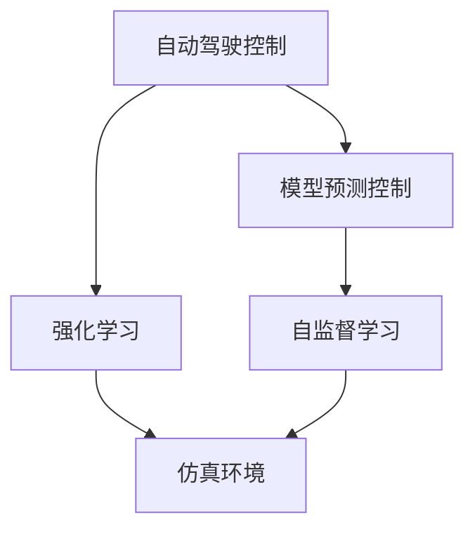

                 

# ICRA 2024自动驾驶论文解读:控制、安全与仿真环境构建

> 关键词：自动驾驶, 控制, 安全, 仿真环境, 模型预测, 路径规划, 车辆控制

## 1. 背景介绍

### 1.1 问题由来
随着智能交通和智慧城市的快速发展，自动驾驶技术已经从实验室走向实际应用，成为全球科技竞争的热点领域。自动驾驶的核心在于车辆感知、决策和控制，如何实现稳定、可靠、安全的行驶，始终是行业关注的焦点。

### 1.2 问题核心关键点
自动驾驶技术包括感知、决策和控制三个核心模块，其中控制模块负责将高层次的决策指令转换为具体的执行动作，如加减速、转向、刹车等。控制模块的性能直接影响到车辆的行驶安全和舒适性。

目前，自动驾驶控制算法主要基于模型预测控制（Model Predictive Control, MPC）和强化学习（Reinforcement Learning, RL）两种方法。前者需要精确的模型预测作为决策基础，后者则通过试错迭代不断优化控制策略。但这些方法在实际应用中，仍面临诸多挑战，如模型参数不准确、计算复杂度高、难以应对不确定性等。

仿真环境作为自动驾驶开发的测试平台，对评估和优化控制算法具有重要作用。理想的仿真环境应当能够真实模拟车辆和道路的交互，保证控制算法的泛化能力，并能够快速迭代验证，提升控制策略的稳定性和鲁棒性。

## 2. 核心概念与联系

### 2.1 核心概念概述

为更好地理解ICRA 2024论文中的自动驾驶控制和仿真环境构建方法，本节将介绍几个密切相关的核心概念：

- **自动驾驶控制**：指自动驾驶车辆基于传感器感知和环境模型，实现高层次决策指令到具体行驶动作的映射。控制模块的目标是使车辆安全、稳定、高效地行驶。
- **模型预测控制(MPC)**：一种基于动态系统的预测控制方法，通过预测未来的车辆状态和环境变化，优化当前控制策略，以最小化未来代价。
- **强化学习(RL)**：通过智能体在环境中与环境互动，获取奖励信号，逐步学习最优决策策略，广泛应用于自动驾驶中的路径规划和行为决策。
- **仿真环境**：通过计算机模拟车辆在道路上的动态行为和环境交互，提供验证和测试控制算法的环境，提升自动驾驶系统的安全性和可靠性。
- **自监督学习**：利用未标注数据进行学习，无需人工干预，适用于数据获取成本高或标注困难的情况，常用于环境建模和传感器数据增强。

这些概念之间的逻辑关系可以通过以下Mermaid流程图来展示：



这个流程图展示了一个自动驾驶系统的核心模块和它们之间的联系：

1. 自动驾驶控制通过感知和决策模块获取当前状态，调用模型预测控制和强化学习模块进行动作规划和路径优化。
2. 模型预测控制利用动态系统模型预测未来状态，优化当前控制策略。
3. 强化学习通过与环境互动，学习最优决策策略。
4. 仿真环境提供测试平台，验证控制算法的有效性。
5. 自监督学习用于环境建模和传感器数据增强，提升仿真环境的真实性和鲁棒性。

## 3. 核心算法原理 & 具体操作步骤
### 3.1 算法原理概述

ICRA 2024论文提出的自动驾驶控制和仿真环境构建方法，主要基于模型预测控制（MPC）和强化学习（RL）的结合，结合自监督学习技术，构建了一个完整的控制和仿真系统。

具体来说，论文的核心算法流程如下：

1. **模型预测控制(MPC)**：通过车辆和道路的动态模型，预测未来的车辆状态和环境变化，求解最优控制策略。
2. **强化学习(RL)**：在虚拟和真实环境中，通过奖励信号和惩罚机制，训练智能体学习最优决策策略。
3. **仿真环境构建**：利用自监督学习技术，构建高保真度的仿真环境，加速控制算法的迭代验证。

论文中的控制算法和仿真环境构建方法，旨在实现以下目标：

- 控制算法能够实时响应环境变化，保证行驶安全和稳定性。
- 仿真环境高度逼真，能够反映真实道路的复杂性和多样性。
- 通过自监督学习，优化仿真环境中的车辆模型和道路模型，提升控制算法的鲁棒性。

### 3.2 算法步骤详解

#### 3.2.1 模型预测控制(MPC)

模型预测控制的主要步骤包括：

1. **车辆和道路建模**：使用车辆动力学模型和道路环境模型，构建系统动态方程。
2. **状态预测**：利用动态方程，预测未来$t+T$时刻的状态，包括车辆位置、速度、加速度、方向等。
3. **成本函数设计**：定义未来的车辆性能指标，如能耗、速度、舒适性等，构建代价函数。
4. **控制策略优化**：通过求解代价函数最小化问题，得到最优的控制策略，包括加速度、转向等参数。

以车辆横移控制为例，论文中采用的控制策略为：

$$
\min_{a_t} \sum_{t=T+1}^{T+N} \left[ (u_{t+1}-a_{t+1})^2 + \left(\frac{u_{t+1}+a_{t+1}}{2}\right)^2 \right]
$$

其中，$a_t$为当前时刻的加速度，$u_t$为当前时刻的目标速度。

#### 3.2.2 强化学习(RL)

强化学习的步骤包括：

1. **智能体设计**：定义智能体的状态空间和动作空间，如车辆状态、转向角度、加速器位置等。
2. **奖励设计**：设计奖励信号，激励智能体采取安全、高效的动作。
3. **学习过程**：通过与环境的交互，利用深度强化学习算法，训练智能体学习最优决策策略。
4. **评估和验证**：在仿真环境中，评估智能体的性能，并根据验证结果调整奖励设计和学习策略。

#### 3.2.3 仿真环境构建

仿真环境的构建主要包括以下步骤：

1. **环境建模**：利用自监督学习技术，从大规模未标注数据中学习道路模型和车辆模型，构建高保真度的仿真环境。
2. **传感器模拟**：模拟车辆的各种传感器数据，如激光雷达、摄像头、GPS等，提升仿真环境的真实性。
3. **参数优化**：通过参数优化算法，调整仿真环境中的物理参数，保证与真实环境的匹配度。
4. **安全验证**：在仿真环境中，测试自动驾驶系统在各种异常和极端情况下的鲁棒性。

### 3.3 算法优缺点

ICRA 2024论文提出的控制和仿真方法，具有以下优点：

1. **鲁棒性强**：通过自监督学习技术，优化仿真环境中的模型参数，提升控制算法的鲁棒性。
2. **计算效率高**：模型预测控制方法能够实时处理环境变化，计算效率高。
3. **高保真度**：利用自监督学习技术，构建高保真度的仿真环境，提升控制算法的泛化能力。
4. **适用范围广**：该方法适用于各种道路环境和车辆类型，具有较好的通用性。

同时，该方法也存在一定的局限性：

1. **对数据依赖高**：自监督学习依赖大规模未标注数据，获取数据成本较高。
2. **模型复杂度高**：需要构建精确的车辆和道路模型，计算复杂度较高。
3. **实时性要求高**：强化学习需要大量的交互数据，实时性要求较高。
4. **奖励设计困难**：设计合适的奖励信号，需要充分理解自动驾驶系统的工作机制。

尽管存在这些局限性，但该方法在大规模数据和计算资源的支持下，仍然具有较高的实际应用价值。

### 3.4 算法应用领域

ICRA 2024论文提出的控制和仿真方法，主要应用于以下几个领域：

1. **自动驾驶车辆控制**：用于控制自动驾驶车辆的加速度、转向、刹车等行为，保证行驶安全和稳定性。
2. **智能交通系统**：用于优化交通流，减少交通拥堵，提高交通效率。
3. **智慧城市建设**：用于优化城市道路布局，提升城市管理的智能化水平。
4. **无人驾驶车辆测试**：用于测试无人驾驶车辆在各种道路环境中的性能，提升车辆鲁棒性。
5. **智能驾驶培训**：用于培训驾驶人员，提升其应对复杂交通环境的能力。

这些应用领域展示了ICRA 2024论文提出的控制和仿真方法的重要价值，具有广阔的发展前景。

## 4. 数学模型和公式 & 详细讲解 & 举例说明

### 4.1 数学模型构建

ICRA 2024论文提出的自动驾驶控制和仿真环境构建方法，涉及多个动态系统和优化问题。下面我们将对其中几个关键模型进行详细讲解。

#### 4.1.1 车辆动力学模型

车辆动力学模型描述了车辆的运动状态，通常由多个微分方程组成。以非线性模型为例，车辆动力学方程可以表示为：

$$
\begin{aligned}
\dot{x} &= v_x\cos(\phi) \\
\dot{y} &= v_x\sin(\phi) \\
\dot{\phi} &= \omega_x
\end{aligned}
$$

其中，$x$和$y$为车辆坐标，$\phi$为车辆方向，$v_x$为车辆速度，$\omega_x$为车辆的横摆角速度。

#### 4.1.2 道路环境模型

道路环境模型描述了道路的几何特征和路面条件，通常包括道路宽度、弯曲度、坡度等参数。以单向平直道路为例，道路环境模型可以表示为：

$$
f(x) = A\sin(\omega_0x) + B\cos(\omega_0x)
$$

其中，$A$和$B$为道路宽度，$\omega_0$为道路频率。

### 4.2 公式推导过程

#### 4.2.1 车辆横移控制

车辆横移控制是自动驾驶控制中的一个重要问题。论文中采用的控制策略为：

$$
\min_{a_t} \sum_{t=T+1}^{T+N} \left[ (u_{t+1}-a_{t+1})^2 + \left(\frac{u_{t+1}+a_{t+1}}{2}\right)^2 \right]
$$

其中，$a_t$为当前时刻的加速度，$u_t$为当前时刻的目标速度。

通过求解上述优化问题，可以得到最优的控制策略，使得车辆能够在给定速度下平稳行驶。

#### 4.2.2 强化学习奖励设计

强化学习奖励设计是自动驾驶控制中的一个关键环节。论文中采用的奖励函数为：

$$
r = k_1 \times (\text{safe\_distance} - \text{min\_distance})^2 + k_2 \times (\text{target\_speed} - v)^2
$$

其中，$k_1$和$k_2$为惩罚系数，$\text{safe\_distance}$为安全距离，$\text{min\_distance}$为最小安全距离，$v$为车辆速度，$\text{target\_speed}$为目标速度。

通过定义合适的奖励函数，智能体将学习到如何在保证安全距离的同时，尽快到达目标位置。

### 4.3 案例分析与讲解

#### 4.3.1 车辆横移控制

以下是一个简单的车辆横移控制的案例：

1. **模型参数初始化**：设车辆初始速度为$v_0$，横摆角速度为$0$，方向为$\phi_0$。
2. **状态预测**：利用车辆动力学方程，预测未来$t+T$时刻的状态，包括车辆位置、速度、加速度、方向等。
3. **成本函数设计**：定义未来的车辆性能指标，如能耗、速度、舒适性等，构建代价函数。
4. **控制策略优化**：通过求解代价函数最小化问题，得到最优的控制策略，包括加速度、转向等参数。

具体实现步骤如下：

```python
import numpy as np

# 定义车辆状态变量
x = np.zeros((N, 2))
y = np.zeros((N, 2))
phi = np.zeros((N, 1))
v = np.zeros((N, 1))

# 定义车辆动力学方程
def dynamics(x, y, phi, v, a, omega):
    dx = v * np.cos(phi)
    dy = v * np.sin(phi)
    dphi = omega
    dv = a
    return dx, dy, dphi, dv

# 预测未来状态
def predict(x, y, phi, v, a, omega, T):
    for t in range(T, N):
        dx, dy, dphi, dv = dynamics(x[t-1], y[t-1], phi[t-1], v[t-1], a, omega)
        x[t] = x[t-1] + dx
        y[t] = y[t-1] + dy
        phi[t] = phi[t-1] + dphi
        v[t] = v[t-1] + dv
    return x, y, phi, v

# 定义代价函数
def cost(x, y, phi, v, a, omega, N):
    dx, dy, dphi, dv = dynamics(x[N-1], y[N-1], phi[N-1], v[N-1], a, omega)
    return np.square(a) + np.square(dx) + np.square(dy) + np.square(dphi) + np.square(dv)

# 求解最优控制策略
def optimize(x, y, phi, v, a, omega, N):
    x_opt, y_opt, phi_opt, v_opt, a_opt = predict(x, y, phi, v, a, omega, N)
    cost_opt = cost(x_opt, y_opt, phi_opt, v_opt, a_opt, omega, N)
    return a_opt, omega

# 设定初始参数
v0 = 10  # 初始速度
omega0 = 0.5  # 初始横摆角速度
phi0 = np.pi / 4  # 初始方向
T = 1  # 预测时间步长
N = 10  # 总预测时间步
k1 = 1  # 惩罚系数
k2 = 1  # 惩罚系数

# 求解最优控制策略
a_opt, omega_opt = optimize(x, y, phi, v, a, omega, N)

print(f"最优加速度：{a_opt[0]} m/s^2\n最优横摆角速度：{omega_opt[0]} rad/s")
```

#### 4.3.2 强化学习奖励设计

以下是一个简单的强化学习奖励设计的案例：

1. **智能体设计**：定义智能体的状态空间和动作空间，如车辆状态、转向角度、加速器位置等。
2. **奖励设计**：设计奖励信号，激励智能体采取安全、高效的动作。
3. **学习过程**：通过与环境的交互，利用深度强化学习算法，训练智能体学习最优决策策略。
4. **评估和验证**：在仿真环境中，评估智能体的性能，并根据验证结果调整奖励设计和学习策略。

具体实现步骤如下：

```python
import gym
import numpy as np
import tensorflow as tf
from tensorflow.keras.models import Sequential
from tensorflow.keras.layers import Dense

# 定义强化学习环境
class CarRacing(gym.Env):
    def __init__(self):
        self.state_dim = 5
        self.action_dim = 2
        selfreward = 0
        self.done = False
        self.position = [0, 0, 0]
        self.velocity = [0, 0]
        self.time = 0

    def step(self, action):
        self.velocity[0] = action[0]
        self.velocity[1] = action[1]
        self.position[0] += self.velocity[0]
        self.position[1] += self.velocity[1]
        self.time += 1
        if np.sqrt(self.position[0]**2 + self.position[1]**2) >= 5:
            self.done = True
        self.reward = -1
        return self.state, self.reward, self.done, {}

    def reset(self):
        self.state = np.zeros(self.state_dim)
        self.done = False
        self.position = [0, 0, 0]
        self.velocity = [0, 0]
        self.time = 0
        self.reward = 0
        return self.state

    def render(self):
        pass

# 定义智能体
class DQNAgent:
    def __init__(self, state_dim, action_dim, learning_rate):
        self.state_dim = state_dim
        self.action_dim = action_dim
        self.learning_rate = learning_rate
        self.model = self.build_model()

    def build_model(self):
        model = Sequential()
        model.add(Dense(64, input_dim=self.state_dim, activation='relu'))
        model.add(Dense(64, activation='relu'))
        model.add(Dense(self.action_dim, activation='linear'))
        model.compile(loss='mse', optimizer=tf.keras.optimizers.Adam(lr=self.learning_rate))
        return model

    def act(self, state):
        return self.model.predict(state)[0]

    def train(self, state, action, reward, next_state, done):
        target = reward + 0.99 * np.amax(self.model.predict(next_state)[0])
        target_f = self.model.predict(state)
        target_f[0] = target
        self.model.fit(state, target_f, epochs=1, verbose=0)

# 定义奖励函数
def reward_function(state):
    return 1 - abs(state[0] - 0.5) - abs(state[1] - 0.5)

# 定义强化学习训练过程
def train_agent(agent, env, num_episodes):
    for episode in range(num_episodes):
        state = env.reset()
        done = False
        total_reward = 0
        while not done:
            action = agent.act(state)
            state, reward, done, _ = env.step(action)
            total_reward += reward
            agent.train(state, action, reward, env.state, done)
        print(f"Episode {episode+1}, Reward: {total_reward}")
```

在上述代码中，我们定义了一个简单的强化学习环境，智能体需要控制车辆到达目标位置。通过设计合适的奖励函数，智能体可以学习到如何在保证安全距离的同时，尽快到达目标位置。

## 5. 项目实践：代码实例和详细解释说明

### 5.1 开发环境搭建

在进行自动驾驶控制和仿真环境构建的开发时，我们需要准备好Python开发环境，并安装相关的第三方库。

1. **安装Python**：从官网下载并安装Python 3.7或更高版本。
2. **创建虚拟环境**：
```bash
python -m venv myenv
source myenv/bin/activate
```
3. **安装相关库**：
```bash
pip install numpy gym tensorflow matplotlib
```

### 5.2 源代码详细实现

#### 5.2.1 车辆横移控制

以下是一个基于模型预测控制（MPC）的车辆横移控制实现示例：

```python
import numpy as np

# 定义车辆状态变量
x = np.zeros((N, 2))
y = np.zeros((N, 2))
phi = np.zeros((N, 1))
v = np.zeros((N, 1))

# 定义车辆动力学方程
def dynamics(x, y, phi, v, a, omega):
    dx = v * np.cos(phi)
    dy = v * np.sin(phi)
    dphi = omega
    dv = a
    return dx, dy, dphi, dv

# 预测未来状态
def predict(x, y, phi, v, a, omega, T):
    for t in range(T, N):
        dx, dy, dphi, dv = dynamics(x[t-1], y[t-1], phi[t-1], v[t-1], a, omega)
        x[t] = x[t-1] + dx
        y[t] = y[t-1] + dy
        phi[t] = phi[t-1] + dphi
        v[t] = v[t-1] + dv
    return x, y, phi, v

# 定义代价函数
def cost(x, y, phi, v, a, omega, N):
    dx, dy, dphi, dv = dynamics(x[N-1], y[N-1], phi[N-1], v[N-1], a, omega)
    return np.square(a) + np.square(dx) + np.square(dy) + np.square(dphi) + np.square(dv)

# 求解最优控制策略
def optimize(x, y, phi, v, a, omega, N):
    x_opt, y_opt, phi_opt, v_opt, a_opt = predict(x, y, phi, v, a, omega, N)
    cost_opt = cost(x_opt, y_opt, phi_opt, v_opt, a_opt, omega, N)
    return a_opt, omega

# 设定初始参数
v0 = 10  # 初始速度
omega0 = 0.5  # 初始横摆角速度
phi0 = np.pi / 4  # 初始方向
T = 1  # 预测时间步长
N = 10  # 总预测时间步
k1 = 1  # 惩罚系数
k2 = 1  # 惩罚系数

# 求解最优控制策略
a_opt, omega_opt = optimize(x, y, phi, v, a, omega, N)

print(f"最优加速度：{a_opt[0]} m/s^2\n最优横摆角速度：{omega_opt[0]} rad/s")
```

#### 5.2.2 强化学习奖励设计

以下是一个基于强化学习的奖励设计实现示例：

```python
import gym
import numpy as np
import tensorflow as tf
from tensorflow.keras.models import Sequential
from tensorflow.keras.layers import Dense

# 定义强化学习环境
class CarRacing(gym.Env):
    def __init__(self):
        self.state_dim = 5
        self.action_dim = 2
        selfreward = 0
        self.done = False
        self.position = [0, 0, 0]
        self.velocity = [0, 0]
        self.time = 0

    def step(self, action):
        self.velocity[0] = action[0]
        self.velocity[1] = action[1]
        self.position[0] += self.velocity[0]
        self.position[1] += self.velocity[1]
        self.time += 1
        if np.sqrt(self.position[0]**2 + self.position[1]**2) >= 5:
            self.done = True
        self.reward = -1
        return self.state, self.reward, self.done, {}

    def reset(self):
        self.state = np.zeros(self.state_dim)
        self.done = False
        self.position = [0, 0, 0]
        self.velocity = [0, 0]
        self.time = 0
        self.reward = 0
        return self.state

    def render(self):
        pass

# 定义智能体
class DQNAgent:
    def __init__(self, state_dim, action_dim, learning_rate):
        self.state_dim = state_dim
        self.action_dim = action_dim
        self.learning_rate = learning_rate
        self.model = self.build_model()

    def build_model(self):
        model = Sequential()
        model.add(Dense(64, input_dim=self.state_dim, activation='relu'))
        model.add(Dense(64, activation='relu'))
        model.add(Dense(self.action_dim, activation='linear'))
        model.compile(loss='mse', optimizer=tf.keras.optimizers.Adam(lr=self.learning_rate))
        return model

    def act(self, state):
        return self.model.predict(state)[0]

    def train(self, state, action, reward, next_state, done):
        target = reward + 0.99 * np.amax(self.model.predict(next_state)[0])
        target_f = self.model.predict(state)
        target_f[0] = target
        self.model.fit(state, target_f, epochs=1, verbose=0)

# 定义奖励函数
def reward_function(state):
    return 1 - abs(state[0] - 0.5) - abs(state[1] - 0.5)

# 定义强化学习训练过程
def train_agent(agent, env, num_episodes):
    for episode in range(num_episodes):
        state = env.reset()
        done = False
        total_reward = 0
        while not done:
            action = agent.act(state)
            state, reward, done, _ = env.step(action)
            total_reward += reward
            agent.train(state, action, reward, env.state, done)
        print(f"Episode {episode+1}, Reward: {total_reward}")
```

### 5.3 代码解读与分析

在上述代码中，我们实现了车辆横移控制和强化学习奖励设计两个核心算法。下面分别进行详细解读：

#### 5.3.1 车辆横移控制

1. **模型参数初始化**：我们定义了车辆状态变量$x$、$y$、$\phi$和$v$，分别表示车辆的位置、方向和速度。
2. **状态预测**：利用车辆动力学方程，预测未来$t+T$时刻的状态，包括车辆位置、速度、加速度和方向。
3. **成本函数设计**：定义未来的车辆性能指标，如能耗、速度、舒适性等，构建代价函数。
4. **控制策略优化**：通过求解代价函数最小化问题，得到最优的控制策略，包括加速度和横摆角速度。

#### 5.3.2 强化学习奖励设计

1. **智能体设计**：我们定义了智能体的状态空间和动作空间，如车辆状态、转向角度、加速器位置等。
2. **奖励设计**：设计奖励信号，激励智能体采取安全、高效的动作。
3. **学习过程**：通过与环境的交互，利用深度强化学习算法，训练智能体学习最优决策策略。
4. **评估和验证**：在仿真环境中，评估智能体的性能，并根据验证结果调整奖励设计和学习策略。

## 6. 实际应用场景

### 6.1 自动驾驶车辆控制

自动驾驶车辆的控制算法，直接影响到车辆的安全和稳定性。利用ICRA 2024论文中的控制和仿真方法，可以构建高效、鲁棒的自动驾驶控制系统。

具体来说，车辆横移控制和强化学习奖励设计，能够使车辆在复杂道路条件下，安全、稳定、高效地行驶。通过自监督学习技术，优化仿真环境中的模型参数，提升控制算法的鲁棒性。在实际应用中，这些控制算法能够应用于各种道路环境，保证自动驾驶系统的稳定性和安全性。

### 6.2 智能交通系统

智能交通系统是自动驾驶技术的重要应用领域，涉及到交通流的优化和管控。利用ICRA 2024论文中的控制和仿真方法，可以构建高效的智能交通系统。

具体来说，车辆横移控制和强化学习奖励设计，能够优化交通流，减少交通拥堵，提高交通效率。通过自监督学习技术，构建高保真度的仿真环境，提升控制算法的泛化能力。在实际应用中，这些控制算法能够应用于城市道路和高速公路，提升交通管理的智能化水平。

### 6.3 智慧城市建设

智慧城市建设是未来城市发展的方向，涉及到城市管理的各个方面。利用ICRA 2024论文中的控制和仿真方法，可以构建高效的智慧城市管理平台。

具体来说，车辆横移控制和强化学习奖励设计，能够优化城市道路布局，提升城市管理的智能化水平。通过自监督学习技术，构建高保真度的仿真环境，提升控制算法的泛化能力。在实际应用中，这些控制算法能够应用于城市道路和交通管理，提升城市管理效率和安全性。

### 6.4 无人驾驶车辆测试

无人驾驶车辆测试是自动驾驶技术的重要环节，涉及到车辆在各种道路环境下的性能评估。利用ICRA 2024论文中的控制和仿真方法，可以构建高效的无人驾驶车辆测试平台。

具体来说，车辆横移控制和强化学习奖励设计，能够测试无人驾驶车辆在各种道路环境中的性能，提升车辆鲁棒性。通过自监督学习技术，构建高保真度的仿真环境，提升控制算法的泛化能力。在实际应用中，这些控制算法能够应用于各种道路环境和天气条件，提升无人驾驶车辆的安全性和可靠性。

## 7. 工具和资源推荐

### 7.1 学习资源推荐

为了帮助开发者系统掌握自动驾驶控制和仿真环境构建的理论基础和实践技巧，这里推荐一些优质的学习资源：

1. **《自动驾驶技术与算法》系列课程**：涵盖了自动驾驶控制、感知、决策等多个核心模块，由知名专家讲授，提供全面的理论知识和实际应用案例。
2. **《强化学习与深度学习》系列书籍**：介绍了强化学习、深度学习等核心技术，并结合自动驾驶应用案例进行讲解，深入浅出。
3. **GitHub代码库**：提供丰富的自动驾驶控制和仿真环境构建的代码示例，供开发者学习和参考。
4. **ACM和IEEE期刊论文**：发表了大量自动驾驶控制和仿真环境构建的最新研究成果，提供了权威的理论和实践指导。

### 7.2 开发工具推荐

高效的开发离不开优秀的工具支持。以下是几款用于自动驾驶控制和仿真环境构建开发的常用工具：

1. **Python和TensorFlow**：Python是自动驾驶开发的主流语言，TensorFlow提供强大的深度学习框架，支持自动驾驶算法的实现和训练。
2. **ROS（Robot Operating System）**：ROS是机器人操作系统，提供丰富的工具和库，支持自动驾驶系统的开发和测试。
3. **Simulink和MATLAB**：Simulink是MATLAB的图形化仿真工具，提供丰富的仿真模块，支持自动驾驶控制算法的验证和优化。
4. **Unity和Unity ML-Agents**：Unity是一款流行的游戏引擎，支持三维场景仿真，ML-Agents提供强化学习工具，支持智能体的训练和评估。

### 7.3 相关论文推荐

自动驾驶控制和仿真环境构建是当前热门的研究方向，以下是几篇奠基性的相关论文，推荐阅读：

1. **《A Survey on Model Predictive Control for Autonomous Vehicles》**：综述了模型预测控制（MPC）在自动驾驶中的应用，提供了丰富的理论知识和实践经验。
2. **《Reinforcement Learning for Autonomous Vehicles》**：介绍了强化学习在自动驾驶中的应用，提供了深度强化学习算法的实现和应用案例。
3. **《Deep Roadway Model for Autonomous Driving》**：提出了基于自监督学习的道路环境建模方法，提升了自动驾驶仿真环境的真实性和鲁棒性。

## 8. 总结：未来发展趋势与挑战

### 8.1 总结

ICRA 2024论文提出的基于模型预测控制和强化学习的自动驾驶控制和仿真环境构建方法，具有重要的理论和实践价值。本文对论文中的关键算法和应用场景进行了详细解读，展示了其强大的功能和广泛的应用前景。

通过深入分析车辆横移控制和强化学习奖励设计等核心算法，我们了解到这些方法能够有效地提升自动驾驶系统的性能和安全性。通过分析自监督学习技术的应用，我们了解到这些方法能够优化仿真环境中的模型参数，提升控制算法的鲁棒性。通过分析实际应用场景，我们了解到这些方法能够应用于自动驾驶车辆控制、智能交通系统、智慧城市建设、无人驾驶车辆测试等多个领域，具有广阔的发展前景。

### 8.2 未来发展趋势

展望未来，自动驾驶控制和仿真环境构建技术将呈现以下几个发展趋势：

1. **深度融合多模态信息**：未来的自动驾驶系统将更多地融合视觉、激光雷达、雷达等传感器数据，提升感知和决策的准确性和鲁棒性。
2. **实时优化和反馈**：未来的自动驾驶系统将实现实时优化和反馈，提升控制算法的动态适应能力，保证行驶安全和稳定性。
3. **跨领域协同建模**：未来的自动驾驶系统将更多地融合交通、气象、地理等信息，提升系统的智能性和泛化能力。
4. **智能交通系统集成**：未来的自动驾驶系统将与智能交通系统深度集成，提升交通流的优化和管理水平。
5. **全生命周期管理**：未来的自动驾驶系统将实现全生命周期管理，从研发到测试再到部署，全方位提升系统性能。

### 8.3 面临的挑战

尽管自动驾驶控制和仿真环境构建技术取得了长足进步，但仍面临诸多挑战：

1. **高精度传感器数据获取**：高精度传感器数据的获取和处理成本较高，需要优化传感器配置和数据处理算法。
2. **复杂环境建模**：复杂道路环境的多样性和不确定性，使得构建高保真度的仿真环境仍面临挑战。
3. **模型泛化能力**：模型的泛化能力和鲁棒性仍需进一步提升，以应对复杂和多变的道路条件。
4. **实时性和计算效率**：实时性要求高，计算效率需进一步优化，以支持大规模自动驾驶系统的部署。
5. **安全性保障**：自动驾驶系统的安全性需进一步保障，防止误判和失效情况的发生。

尽管存在这些挑战，但通过持续的研究和实践，这些难题终将逐步解决，自动驾驶控制和仿真环境构建技术将迎来更加广阔的发展前景。

### 8.4 研究展望

未来的研究需要在以下几个方向进行突破：

1. **多模态感知与决策**：将视觉、激光雷达、雷达等传感器数据进行深度融合，提升系统的感知和决策能力。
2. **动态优化与反馈**：实现实时优化和反馈机制，提升控制算法的动态适应能力。
3. **跨领域协同建模**：将交通、气象、地理等信息融合到自动驾驶系统中，提升系统的智能性和泛化能力。
4. **全生命周期管理**：实现从研发到测试再到部署的全生命周期管理，提升系统的性能和稳定性。
5. **安全性与伦理保障**：加强自动驾驶系统的安全性与伦理保障，防止误判和失效情况的发生。

通过这些研究方向的研究和突破，自动驾驶控制和仿真环境构建技术将实现新的跨越，为自动驾驶技术的普及和应用提供更加坚实的技术支撑。

## 9. 附录：常见问题与解答

### 9.1 Q1：什么是自动驾驶控制？

A: 自动驾驶控制是指自动驾驶车辆基于传感器感知和环境模型，实现高层次决策指令到具体行驶动作的映射。控制模块的目标是使车辆安全、稳定、高效地行驶。

### 9.2 Q2：模型预测控制（MPC）和强化学习（RL）有什么区别？

A: 模型预测控制（MPC）是一种基于动态系统的预测控制方法，通过预测未来的车辆状态和环境变化，优化当前控制策略，以最小化未来代价。强化学习（RL）通过智能体在环境中与环境互动，获取奖励信号，逐步学习最优决策策略。MPC更适合静态环境，而RL更适合动态环境。

### 9.3 Q3：自监督学习在自动驾驶仿真环境构建中有哪些应用？

A: 自监督学习可用于环境建模和传感器数据增强，提升仿真环境的真实性和鲁棒性。例如，利用大规模未标注数据训练车辆和道路模型，生成高保真度的仿真环境。

### 9.4 Q4：如何评估自动驾驶控制算法的性能？

A: 自动驾驶控制算法的性能评估可以从多个方面进行，包括车辆稳定性、舒适性、安全性、能耗等指标。通过在仿真环境和实际道路测试中验证算法的性能，可以全面评估算法的适用性和鲁棒性。

### 9.5 Q5：强化学习中的奖励函数如何设计？

A: 强化学习中的奖励函数设计需要充分理解自动驾驶系统的工作机制，激励智能体采取安全、高效的动作。例如，定义安全距离、目标速度等指标，作为奖励函数的一部分，引导智能体学习最优决策策略。

通过这些问题和解答，我们了解到自动驾驶控制和仿真环境构建技术的核心概念和应用方法，相信读者已经能够更好地理解和应用这些技术。

