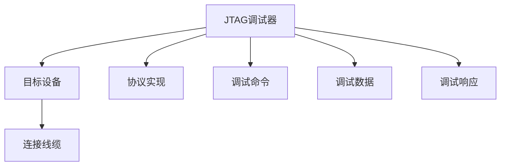

                 

# JTAG 调试技术：在嵌入式系统上的应用

## 1. 背景介绍

随着嵌入式系统的复杂度日益增加，调试工作变得更加复杂。传统的软件调试方式已经无法满足需求，JTAG（Joint Test Action Group）调试技术成为嵌入式系统调试的重要手段。JTAG调试技术利用一个独立的接口，实现对目标设备（如微控制器、FPGA、ASIC等）的完全控制和调试，能够提供单步执行、断点设置、变量查看、内存访问等丰富功能，极大提升了嵌入式系统的开发效率和质量。

本文档将系统介绍JTAG调试技术的原理、架构和具体操作步骤，并通过实际项目案例分析，展示其在嵌入式系统上的应用效果。

## 2. 核心概念与联系

### 2.1 核心概念概述

JTAG（Joint Test Action Group）调试技术，是一种基于IEEE 1149.1标准的接口协议。通过JTAG接口，可以实现对嵌入式系统的完全控制和调试，包括单步执行、断点设置、变量查看、内存访问等功能。JTAG调试技术已成为嵌入式开发中的重要工具。

JTAG调试系统的核心组件包括JTAG调试器、目标设备和连接线缆。JTAG调试器通过JTAG接口与目标设备连接，实现对目标设备的控制和数据传输。目标设备可以是微控制器、FPGA、ASIC等嵌入式系统。

JTAG调试系统架构如图1所示。



图1：JTAG调试系统架构图

### 2.2 核心概念联系

JTAG调试技术的应用涉及多个核心概念，包括JTAG接口标准、JTAG调试命令、调试数据格式和调试响应格式等。这些概念紧密联系，共同构成了JTAG调试系统的核心技术。

JTAG调试命令是JTAG调试器向目标设备发送的控制指令。常见的调试命令包括：
- JTAG IDENTIFY：获取目标设备ID信息
- JTAG RESET：重置目标设备
- JTAG CONTINUE：继续执行目标设备程序
- JTAG SINGLE_STEP：单步执行目标设备程序
- JTAG SET_BREAKPOINT：设置断点

调试数据和调试响应是JTAG调试过程中交换的数据和响应。调试数据格式和响应格式需要遵循IEEE 1149.1标准，以保证JTAG调试系统的兼容性和互操作性。

## 3. 核心算法原理 & 具体操作步骤

### 3.1 算法原理概述

JTAG调试技术的核心算法原理是通过JTAG接口对目标设备进行完全控制和调试。JTAG接口采用串行线缆连接，由4条数据线（TCK、TDI、TMS、TDO）和1条测试模式选择线（TEST-DO）组成。JTAG调试器通过TCK线发送时钟信号，通过TDI线发送调试命令和数据，通过TMS线发送控制信号，通过TDO线接收调试响应和数据。

JTAG调试器向目标设备发送调试命令和数据，并接收调试响应和数据，完成对目标设备的控制和调试。

### 3.2 算法步骤详解

JTAG调试器与目标设备之间的通信遵循JTAG协议标准。JTAG协议分为两个阶段：逻辑状态寄存器（LAR）和配置逻辑寄存器（CLR）。LAR阶段用于获取和设置目标设备的ID信息，CLR阶段用于控制和调试目标设备。

LAR阶段的操作流程如下：
1. 目标设备进入LAR模式，JTAG调试器发送JTAG IDENTIFY命令，获取目标设备ID信息。
2. JTAG调试器根据目标设备ID信息，设置调试参数，如数据位宽、时钟频率等。
3. 目标设备进入CLR模式，等待调试命令。

CLR阶段的操作流程如下：
1. 目标设备进入CLR模式，JTAG调试器发送JTAG RESET命令，复位目标设备。
2. JTAG调试器发送JTAG CONTINUE命令，继续执行目标设备程序。
3. JTAG调试器发送JTAG SINGLE_STEP命令，单步执行目标设备程序。
4. JTAG调试器发送JTAG SET_BREAKPOINT命令，设置断点。
5. JTAG调试器发送JTAG CONTINUE命令，继续执行目标设备程序。
6. JTAG调试器发送JTAG GET_VAR命令，获取目标设备变量值。
7. JTAG调试器发送JTAG SET_VAR命令，设置目标设备变量值。
8. JTAG调试器发送JTAG GET_MEM命令，获取目标设备内存值。
9. JTAG调试器发送JTAG SET_MEM命令，设置目标设备内存值。

### 3.3 算法优缺点

JTAG调试技术的优点：
1. 完全控制：JTAG调试器可以通过JTAG接口实现对目标设备的完全控制，包括程序执行、变量查看、内存访问等。
2. 丰富的功能：JTAG调试器提供了丰富的调试功能，如单步执行、断点设置、变量查看、内存访问等。
3. 调试速度快：JTAG调试器能够快速获取目标设备状态信息，实现高效调试。

JTAG调试技术的缺点：
1. 接口复杂：JTAG接口的连接线缆较为复杂，需要保证信号线的连接正确。
2. 调试器昂贵：高性能的JTAG调试器价格昂贵，增加了开发成本。
3. 只读性限制：JTAG接口只读性较强，无法直接修改目标设备程序。

### 3.4 算法应用领域

JTAG调试技术广泛应用于嵌入式系统的开发、测试和维护过程中，具体应用领域包括：
1. 嵌入式软件开发：在嵌入式系统开发过程中，通过JTAG调试器进行程序调试、断点设置、变量查看等操作。
2. 嵌入式系统测试：在嵌入式系统测试过程中，通过JTAG调试器进行程序测试、性能分析、故障排除等操作。
3. 嵌入式系统维护：在嵌入式系统维护过程中，通过JTAG调试器进行程序更新、参数设置、系统监控等操作。

## 4. 数学模型和公式 & 详细讲解

JTAG调试技术的数学模型主要涉及JTAG协议标准，以下是对JTAG协议的详细讲解。

### 4.1 数学模型构建

JTAG协议由LAR阶段和CLR阶段组成，其数学模型如下：

- LAR阶段：
$$ T_{LAR} = T_{LAR-CMD} + T_{LAR-RESP} + T_{LAR-DATA} + T_{LAR-ACK} $$

- CLR阶段：
$$ T_{CLR} = T_{CLR-CMD} + T_{CLR-RESP} + T_{CLR-DATA} + T_{CLR-ACK} $$

其中，$T_{LAR-CMD}$为LAR命令周期时间，$T_{LAR-RESP}$为LAR响应周期时间，$T_{LAR-DATA}$为LAR数据周期时间，$T_{LAR-ACK}$为LAR数据确认周期时间；$T_{CLR-CMD}$为CLR命令周期时间，$T_{CLR-RESP}$为CLR响应周期时间，$T_{CLR-DATA}$为CLR数据周期时间，$T_{CLR-ACK}$为CLR数据确认周期时间。

### 4.2 公式推导过程

JTAG协议的命令格式和响应格式遵循IEEE 1149.1标准，命令格式如下：
- 单字节命令：$SOP + 命令码 + EOP$
- 多字节命令：$SOP + 命令码 + EOP + 数据字节 + CRCP + EOP$
- 单字节响应：$SOH + 响应码 + EOP$
- 多字节响应：$SOH + 响应码 + EOP + 响应数据 + CRCP + EOP$

其中，$SOP$为起始字节，$EOP$为结束字节，$SOH$为起始字节，$CRCP$为循环冗余校验码。

JTAG协议的数据格式和响应格式也遵循IEEE 1149.1标准，数据格式如下：
- 单字节数据：$SOH + 数据字节 + EOP$
- 多字节数据：$SOH + 数据字节 + EOP + CRCP + EOP$

其中，$SOH$为起始字节，$EOP$为结束字节，$CRCP$为循环冗余校验码。

### 4.3 案例分析与讲解

以下是JTAG调试技术在嵌入式系统开发中的应用案例分析。

假设目标设备为STM32F407微控制器，JTAG调试器为SEGGER JLink调试器。在STM32F407微控制器开发过程中，需要调试其程序，设置断点，查看变量。

首先，需要将STM32F407微控制器连接到SEGGER JLink调试器，并通过USB接口连接到PC。然后，使用SEGGER JLink调试器打开STM32F407微控制器，设置调试参数，如数据位宽、时钟频率等。

接着，在STM32F407微控制器程序中设置断点，并在程序入口处添加断点标志。然后，使用SEGGER JLink调试器进入程序调试模式，单步执行程序，查看变量值。在单步执行过程中，可以使用SEGGER JLink调试器设置断点，查看变量值，分析程序执行流程。

最后，在SEGGER JLink调试器中查看程序运行结果，分析程序执行结果是否符合预期。如果程序执行结果不符合预期，可以使用SEGGER JLink调试器进行调试，查找程序错误，修改程序代码，重新运行程序。

## 5. 项目实践：代码实例和详细解释说明

### 5.1 开发环境搭建

JTAG调试技术的应用开发需要具备以下硬件和软件环境：
1. 目标设备：微控制器、FPGA、ASIC等嵌入式系统。
2. JTAG调试器：SEGGER JLink、Keil µVision等。
3. PC：具有USB接口，用于连接JTAG调试器和目标设备。

### 5.2 源代码详细实现

以下是使用SEGGER JLink调试器在STM32F407微控制器上实现JTAG调试技术的代码实现。

```c
#include "SEGGER.h"
#include "SEGGER_JLink.h"

void main() {
    SEGGER_Init();
    SEGGER_JLink_Init();
    SEGGER_JLink_StartDebug();

    while (1) {
        // 单步执行程序
        SEGGER_JLink_Step();

        // 设置断点
        SEGGER_JLink_SetBreakpoint(0x080010A8);

        // 查看变量
        uint32_t var = SEGGER_JLink_ReadVariable(0x20000100);

        // 运行程序
        SEGGER_JLink_Resume();
    }
}
```

### 5.3 代码解读与分析

上述代码实现了在STM32F407微控制器上使用SEGGER JLink调试器进行JTAG调试的过程。具体步骤如下：

1. 初始化SEGGER和SEGGER_JLink调试器。
2. 启动JTAG调试器。
3. 单步执行程序。
4. 设置断点。
5. 查看变量。
6. 运行程序。

其中，SEGGER_JLink_Step()函数用于单步执行程序；SEGGER_JLink_SetBreakpoint()函数用于设置断点；SEGGER_JLink_ReadVariable()函数用于查看变量；SEGGER_JLink_Resume()函数用于运行程序。

## 6. 实际应用场景

### 6.1 智能家居控制系统

智能家居控制系统通过JTAG调试技术实现嵌入式设备的程序调试和状态监控。在智能家居控制系统的开发过程中，通过JTAG调试器进行程序调试，设置断点，查看变量，确保程序逻辑正确。在智能家居控制系统运行过程中，通过JTAG调试器进行状态监控，及时发现和处理设备异常。

### 6.2 工业控制领域

工业控制领域应用JTAG调试技术进行嵌入式设备的程序调试和参数设置。在工业控制系统的开发过程中，通过JTAG调试器进行程序调试，设置断点，查看变量，确保程序逻辑正确。在工业控制系统的运行过程中，通过JTAG调试器进行参数设置和系统监控，及时发现和处理设备异常。

### 6.3 汽车电子领域

汽车电子领域应用JTAG调试技术进行嵌入式设备的程序调试和状态监控。在汽车电子系统的开发过程中，通过JTAG调试器进行程序调试，设置断点，查看变量，确保程序逻辑正确。在汽车电子系统的运行过程中，通过JTAG调试器进行状态监控，及时发现和处理设备异常。

## 7. 工具和资源推荐

### 7.1 学习资源推荐

以下是JTAG调试技术的推荐学习资源：
1. IEEE 1149.1标准：IEEE 1149.1标准详细定义了JTAG协议的命令格式、数据格式和响应格式。
2. JTAG调试器用户手册：SEGGER JLink、Keil µVision等调试器提供了详细的用户手册，涵盖JTAG调试器的各项功能使用方法。
3. JTAG调试器开发者文档：SEGGER JLink、Keil µVision等调试器提供了详细的开发者文档，涵盖JTAG调试器的内部机制和开发接口。
4. JTAG调试技术博客：各类博客提供了JTAG调试技术的理论分析和实践经验，供开发者参考。

### 7.2 开发工具推荐

JTAG调试技术的开发工具包括SEGGER JLink、Keil µVision等。这些工具提供了丰富的JTAG调试功能，如程序调试、断点设置、变量查看、内存访问等。

### 7.3 相关论文推荐

JTAG调试技术的相关论文涵盖了JTAG协议的各个方面，以下是推荐的相关论文：
1. "IEEE Standard 1149.1: Test and Measurement of Integrated Circuits"：IEEE 1149.1标准的详细介绍，涵盖JTAG协议的命令格式、数据格式和响应格式。
2. "JTAG Debugger for Embedded Systems"：详细介绍了JTAG调试器的设计原理和实现方法。
3. "Application of JTAG Debugging in Embedded System Development"：详细介绍了JTAG调试技术在嵌入式系统开发中的应用。

## 8. 总结：未来发展趋势与挑战

### 8.1 总结

本文详细介绍了JTAG调试技术的原理、架构和具体操作步骤，并通过实际项目案例分析，展示了其在嵌入式系统上的应用效果。JTAG调试技术在嵌入式系统开发、测试和维护过程中具有重要应用价值。

JTAG调试技术的应用涉及多个核心概念，包括JTAG接口标准、JTAG调试命令、调试数据格式和调试响应格式等。这些概念紧密联系，共同构成了JTAG调试系统的核心技术。

### 8.2 未来发展趋势

JTAG调试技术的未来发展趋势如下：
1. 接口标准化：JTAG接口标准将进一步完善，增强JTAG调试器的互操作性和兼容性。
2. 调试器智能化：JTAG调试器将更加智能化，具备更丰富的调试功能和更高效的调试效率。
3. 无线化：JTAG调试器将逐步实现无线化，提高调试的便携性和便利性。
4. 多模态化：JTAG调试器将实现多模态调试，支持多种嵌入式设备平台。
5. 自动化：JTAG调试器将逐步实现自动化，简化调试操作，提高开发效率。

### 8.3 面临的挑战

JTAG调试技术在发展过程中也面临以下挑战：
1. 调试器兼容性：不同厂商的JTAG调试器存在兼容性问题，需要进行设备适配。
2. 调试器性能：高性能JTAG调试器价格昂贵，需要优化调试器性能，降低开发成本。
3. 调试器安全性：JTAG调试器需要加强安全性，防止调试器被恶意篡改。
4. 调试器易用性：JTAG调试器需要提升易用性，降低调试操作难度。
5. 调试器稳定性：JTAG调试器需要增强稳定性，防止调试过程中出现异常。

### 8.4 研究展望

JTAG调试技术的未来研究方向如下：
1. 硬件接口标准化：推动JTAG接口标准的进一步完善，增强JTAG调试器的互操作性和兼容性。
2. 软件工具创新：研发高性能、智能化的JTAG调试工具，提升调试效率和质量。
3. 无线化技术研究：研究无线化JTAG调试技术，提高调试的便携性和便利性。
4. 多模态调试技术：研究多模态JTAG调试技术，支持多种嵌入式设备平台。
5. 自动化技术研究：研究自动化JTAG调试技术，简化调试操作，提高开发效率。
6. 安全性技术研究：研究JTAG调试器的安全性技术，保障调试器的稳定性和安全性。

## 9. 附录：常见问题与解答

### Q1：JTAG调试器如何进行设备适配？

A: JTAG调试器需要进行设备适配，确保与目标设备兼容。适配步骤包括：
1. 获取目标设备ID信息。
2. 设置调试参数，如数据位宽、时钟频率等。
3. 连接目标设备，进入调试模式。

### Q2：JTAG调试器如何进行程序调试？

A: JTAG调试器可以通过单步执行、设置断点、查看变量、访问内存等方式进行程序调试。调试步骤如下：
1. 连接目标设备，进入调试模式。
2. 单步执行程序。
3. 设置断点。
4. 查看变量。
5. 访问内存。

### Q3：JTAG调试器如何进行状态监控？

A: JTAG调试器可以通过读取目标设备的寄存器、内存等方式进行状态监控。监控步骤如下：
1. 连接目标设备，进入调试模式。
2. 读取寄存器。
3. 读取内存。
4. 分析状态信息。
5. 处理异常情况。

### Q4：JTAG调试器如何进行参数设置？

A: JTAG调试器可以通过读取和写入目标设备的寄存器、配置参数等方式进行参数设置。设置步骤如下：
1. 连接目标设备，进入调试模式。
2. 读取寄存器。
3. 写入寄存器。
4. 设置参数。
5. 保存参数。

### Q5：JTAG调试器如何进行数据传输？

A: JTAG调试器可以通过读取和写入目标设备的内存、寄存器等方式进行数据传输。传输步骤如下：
1. 连接目标设备，进入调试模式。
2. 读取内存。
3. 写入内存。
4. 读取寄存器。
5. 写入寄存器。

---

作者：禅与计算机程序设计艺术 / Zen and the Art of Computer Programming

