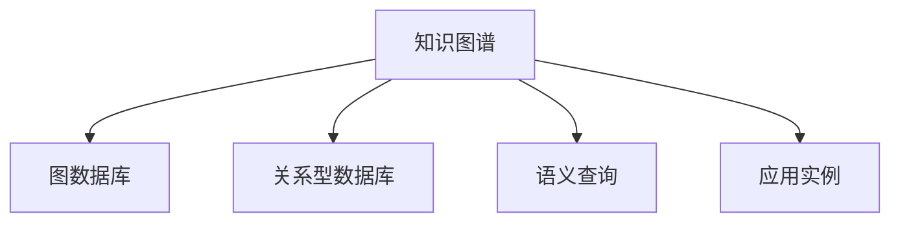

                 

# Knowledge Graphs原理与代码实例讲解

> 关键词：知识图谱,图数据库,关系型数据库,语义查询,应用实例

## 1. 背景介绍

### 1.1 问题由来
在信息时代，数据呈现出爆炸性增长趋势，面对海量的数据，传统的关系型数据库已难以支撑多维度、多层次的数据关联查询需求。这使得信息检索变得更为复杂，检索速度和准确度受限。

为解决这一问题，知识图谱应运而生。它是一种通过关系型数据结构（即知识图）来存储、表示和查询知识的数据模型，能够对实体、关系和属性进行语义化描述，使得信息检索变得更加高效、准确和智能。

### 1.2 问题核心关键点
知识图谱的构建与应用过程涉及到多个核心概念：

- **知识图**：知识图谱的核心，是一张由节点和边组成的无向图，节点代表实体，边代表实体之间的关系。
- **实体节点**：用于表示现实世界中的对象，如人、地点、组织等。
- **关系边**：用于描述实体之间的联系，如“出生于”、“工作于”等。
- **属性节点**：用于描述实体的特征，如实体的类别、颜色、大小等。
- **查询语言**：用于描述语义查询需求的特殊查询语言，如SPARQL等。

构建和应用知识图谱可以极大地提升信息检索的效率和准确性，但其中涉及的复杂性不可忽视。因此，深入理解知识图谱的原理和应用，对解决信息检索问题具有重要意义。

## 2. 核心概念与联系

### 2.1 核心概念概述

为更好地理解知识图谱的构建与使用，本节将介绍几个密切相关的核心概念：

- **知识图谱(Knowledge Graph)**：存储实体、关系和属性等知识的数据模型，旨在支持语义化的数据查询。
- **图数据库(Graph Database)**：用于存储和管理知识图谱中的关系型数据的数据库。
- **关系型数据库(Relational Database)**：传统的数据库，通过表格存储数据，以行列的形式组织信息。
- **语义查询(Semantic Query)**：利用知识图谱的知识结构，进行语义化的数据检索和分析。
- **应用实例(Application Example)**：包括智能推荐、智能客服、智能问答等，展示了知识图谱在不同场景中的应用效果。

这些核心概念之间的逻辑关系可以通过以下Mermaid流程图来展示：



这个流程图展示了两类数据模型（关系型数据库与图数据库）、查询方式（语义查询）和实际应用场景之间的关系：

1. 知识图谱基于图数据库存储，通过实体、关系和属性节点构成知识结构。
2. 关系型数据库通过表格存储数据，信息以行列形式组织。
3. 语义查询利用知识图谱的语义信息进行高效的检索与分析。
4. 应用实例展示了知识图谱在各类实际应用中的作用。

## 3. 核心算法原理 & 具体操作步骤

### 3.1 算法原理概述

知识图谱的构建与应用主要基于以下算法原理：

- **知识提取**：从原始数据中抽取出实体、关系和属性，构建知识图谱。
- **实体对齐**：识别出不同数据源中的实体，建立统一的实体对齐关系。
- **关系对齐**：识别出不同数据源中的关系，建立统一的关系对齐关系。
- **属性对齐**：识别出不同数据源中的属性，建立统一的属性对齐关系。
- **图嵌入表示**：通过图嵌入算法（如TransE、TransH、RotatE等）将知识图谱中的实体和关系进行向量表示，便于进行语义查询和分析。
- **语义查询处理**：利用查询语言（如SPARQL）进行语义化的数据检索，返回符合查询要求的结果。

### 3.2 算法步骤详解

构建知识图谱并应用其主要包含以下步骤：

**Step 1: 数据收集与预处理**
- 收集原始数据，如网页、文档、社交网络等。
- 进行数据清洗，去除噪声和冗余信息，确保数据的准确性。

**Step 2: 实体抽取**
- 使用命名实体识别(NER)技术，从原始数据中识别出实体及其类别。
- 使用关系抽取技术，识别出实体之间的语义关系。

**Step 3: 实体对齐**
- 使用实体对齐算法，识别出不同数据源中的实体，建立统一实体对齐关系。
- 使用相似度度量方法，计算实体之间的相似度，确定其对应关系。

**Step 4: 关系抽取**
- 使用关系抽取算法，识别出不同数据源中的关系，建立统一关系对齐关系。
- 使用关系建模方法，描述实体之间的联系，建立关系图。

**Step 5: 属性抽取**
- 使用属性抽取算法，识别出不同数据源中的属性，建立统一属性对齐关系。
- 使用属性建模方法，描述实体的特征，建立属性图。

**Step 6: 图嵌入表示**
- 选择图嵌入算法，如TransE、TransH、RotatE等，将实体和关系进行向量表示。
- 训练模型，生成实体和关系的嵌入向量，构建知识图谱。

**Step 7: 语义查询处理**
- 编写SPARQL查询语句，描述查询需求。
- 使用图数据库执行查询，返回符合查询要求的结果。

### 3.3 算法优缺点

知识图谱的构建与应用方法具有以下优点：

- **高效查询**：通过语义化的数据结构，能够进行高效的实体和关系检索。
- **精确匹配**：利用知识图谱的语义结构，能够实现精确的实体和关系匹配。
- **多维度查询**：支持多维度、多层次的数据关联查询，丰富查询结果的多样性。
- **可扩展性**：知识图谱可以根据需要动态更新和扩展，适应信息变化。

同时，知识图谱的构建与应用也存在一定的局限性：

- **数据质量依赖**：构建知识图谱需要高质量的原始数据，数据的准确性和完整性直接影响最终结果。
- **技术复杂度高**：涉及实体识别、关系抽取、对齐和图嵌入等多个步骤，技术难度较大。
- **计算资源消耗大**：图嵌入和查询过程计算复杂，需要大量的计算资源和时间。

尽管存在这些局限性，但知识图谱在语义化数据查询和分析方面的潜力，使其成为信息检索和知识管理的重要工具。

### 3.4 算法应用领域

知识图谱的构建与应用广泛应用于多个领域，具体包括：

- **智能推荐系统**：通过构建用户行为和产品特征的联合知识图谱，利用语义查询和关系推理进行个性化推荐。
- **智能问答系统**：利用知识图谱的语义结构，对自然语言问题进行理解和解析，提供准确的答案。
- **情报分析**：通过知识图谱进行实体和关系的关联分析，挖掘出重要的信息线索。
- **医疗信息管理**：构建医学知识图谱，利用语义查询获取精准的医疗信息，辅助医生诊断和治疗。
- **金融风险评估**：构建金融知识图谱，进行风险预测和评估，提升金融决策的准确性。

除了以上领域，知识图谱还可应用于各类需要复杂查询和数据分析的领域，如城市管理、供应链管理、市场营销等。

## 4. 数学模型和公式 & 详细讲解 & 举例说明

### 4.1 数学模型构建

知识图谱的构建主要基于图结构，其核心数学模型包括：

- **图表示模型**：描述知识图谱的节点、边和属性，通常用图$G=(V,E)$表示。
- **实体节点模型**：描述实体$e$的属性和类别，通常用向量表示，记为$\mathbf{e}$。
- **关系边模型**：描述实体之间的关系$R$，通常用矩阵表示，记为$R$。
- **属性节点模型**：描述实体的属性$a$，通常用向量表示，记为$\mathbf{a}$。

### 4.2 公式推导过程

知识图谱的构建过程涉及多个公式的推导和计算，以下以TransE算法为例进行详细说明：

**TransE算法**：
TransE算法是一种基于对抗性训练的实体对齐算法，其目标是最大化负样本的损失，最小化正样本的损失。假设已知实体$e_i$和$e_j$之间的关系为$R$，其公式为：

$$
P(e_i,e_j|R) = \sigma(\mathbf{e}_i^T\mathbf{e}_j\mathbf{R})
$$

其中，$\sigma$为激活函数，$\mathbf{e}_i$和$\mathbf{e}_j$分别为实体$e_i$和$e_j$的向量表示，$\mathbf{R}$为关系$R$的矩阵表示。

负样本损失函数为：

$$
N(L) = -\frac{1}{2}\sum_{e_i}\sum_{e_j}\sum_{R}\sum_{e'_i}\sum_{e'_j}\sum_{R'}P(e_i,e_j|R)P(e'_i,e'_j|R')\delta(e_i,e'_i)\delta(e_j,e'_j)\delta(R,R')
$$

其中，$\delta$为指示函数，$e'_i$和$e'_j$分别为负样本中的实体，$R'$为负样本中的关系。

**图嵌入表示**：
图嵌入表示的常用算法包括TransE、TransH、RotatE等。以TransE为例，其目标是通过向量表示最大化正样本的损失，最小化负样本的损失。假设已知实体$e_i$和$e_j$之间的关系为$R$，其公式为：

$$
P(e_i,e_j|R) = \sigma(\mathbf{e}_i^T\mathbf{e}_j\mathbf{R})
$$

负样本损失函数为：

$$
N(L) = -\frac{1}{2}\sum_{e_i}\sum_{e_j}\sum_{R}\sum_{e'_i}\sum_{e'_j}\sum_{R'}P(e_i,e_j|R)P(e'_i,e'_j|R')\delta(e_i,e'_i)\delta(e_j,e'_j)\delta(R,R')
$$

其中，$\delta$为指示函数，$e'_i$和$e'_j$分别为负样本中的实体，$R'$为负样本中的关系。

通过最小化负样本损失，最大化正样本损失，TransE算法能够生成精确的实体和关系向量表示，使得知识图谱能够支持高效的语义查询。

### 4.3 案例分析与讲解

**案例1: 智能推荐系统**

智能推荐系统通常涉及用户行为、产品特征和互动数据的综合分析。构建用户行为和产品特征的联合知识图谱，可以通过语义查询获取推荐结果。

具体实现过程如下：

1. 收集用户行为数据，如浏览记录、购买记录等。
2. 对用户行为数据进行实体和关系抽取，构建用户行为知识图谱。
3. 对产品特征数据进行实体和关系抽取，构建产品特征知识图谱。
4. 对用户行为和产品特征知识图谱进行联合对齐，建立统一的实体和关系映射关系。
5. 使用图嵌入算法，如TransE、RotatE等，将用户行为和产品特征向量嵌入到知识图谱中。
6. 编写SPARQL查询语句，进行用户行为和产品特征的关联查询，获取推荐结果。

**案例2: 智能问答系统**

智能问答系统通过构建知识图谱，利用语义查询获取自然语言问题的答案。

具体实现过程如下：

1. 收集问答对数据，如Q-A对。
2. 对问答对数据进行实体和关系抽取，构建问答知识图谱。
3. 使用图嵌入算法，如TransE、RotatE等，将实体和关系向量嵌入到知识图谱中。
4. 编写SPARQL查询语句，对自然语言问题进行语义解析，获取答案。

## 5. 项目实践：代码实例和详细解释说明

### 5.1 开发环境搭建

在进行知识图谱开发前，我们需要准备好开发环境。以下是使用Python进行PyTorch开发的环境配置流程：

1. 安装Anaconda：从官网下载并安装Anaconda，用于创建独立的Python环境。

2. 创建并激活虚拟环境：
```bash
conda create -n pytorch-env python=3.8 
conda activate pytorch-env
```

3. 安装PyTorch：根据CUDA版本，从官网获取对应的安装命令。例如：
```bash
conda install pytorch torchvision torchaudio cudatoolkit=11.1 -c pytorch -c conda-forge
```

4. 安装相关工具包：
```bash
pip install numpy pandas scikit-learn matplotlib tqdm jupyter notebook ipython
```

完成上述步骤后，即可在`pytorch-env`环境中开始知识图谱的开发。

### 5.2 源代码详细实现

这里我们以构建基于TransE算法的关系型知识图谱为例，给出使用PyTorch进行知识图谱开发的PyTorch代码实现。

首先，定义知识图谱的实体和关系：

```python
from torch import nn
import torch

class KnowledgeGraph(nn.Module):
    def __init__(self, entity_num, relation_num):
        super(KnowledgeGraph, self).__init__()
        self.entity_num = entity_num
        self.relation_num = relation_num
        self.entity_embeddings = nn.Embedding(entity_num, 100)
        self.relation_embeddings = nn.Embedding(relation_num, 100)
    
    def forward(self, h, r, t):
        h = self.entity_embeddings(h)
        r = self.relation_embeddings(r)
        t = self.entity_embeddings(t)
        return torch.mm(h, torch.mm(r, t.t()))

# 实体和关系的数量
entity_num = 5000
relation_num = 1000

kg = KnowledgeGraph(entity_num, relation_num)
```

然后，定义损失函数：

```python
from torch import nn
import torch

class KnowledgeGraphLoss(nn.Module):
    def __init__(self, margin=1.0):
        super(KnowledgeGraphLoss, self).__init__()
        self.margin = margin
    
    def forward(self, h, r, t, t_hat):
        loss = torch.mean(torch.clamp(self.margin + h - t_hat, min=0))
        return loss

loss = KnowledgeGraphLoss(margin=1.0)
```

接着，定义训练函数：

```python
from torch import nn
import torch

class KnowledgeGraph(nn.Module):
    def __init__(self, entity_num, relation_num):
        super(KnowledgeGraph, self).__init__()
        self.entity_num = entity_num
        self.relation_num = relation_num
        self.entity_embeddings = nn.Embedding(entity_num, 100)
        self.relation_embeddings = nn.Embedding(relation_num, 100)
    
    def forward(self, h, r, t):
        h = self.entity_embeddings(h)
        r = self.relation_embeddings(r)
        t = self.entity_embeddings(t)
        return torch.mm(h, torch.mm(r, t.t()))

# 实体和关系的数量
entity_num = 5000
relation_num = 1000

kg = KnowledgeGraph(entity_num, relation_num)
loss = KnowledgeGraphLoss(margin=1.0)

optimizer = torch.optim.Adam(kg.parameters(), lr=0.01)

for epoch in range(10):
    for i in range(10000):
        h, r, t = get_random_hrt(triple_list)
        t_hat = kg(h, r, t)
        loss_value = loss(h, r, t, t_hat)
        optimizer.zero_grad()
        loss_value.backward()
        optimizer.step()
```

最后，测试训练效果：

```python
from torch import nn
import torch

class KnowledgeGraph(nn.Module):
    def __init__(self, entity_num, relation_num):
        super(KnowledgeGraph, self).__init__()
        self.entity_num = entity_num
        self.relation_num = relation_num
        self.entity_embeddings = nn.Embedding(entity_num, 100)
        self.relation_embeddings = nn.Embedding(relation_num, 100)
    
    def forward(self, h, r, t):
        h = self.entity_embeddings(h)
        r = self.relation_embeddings(r)
        t = self.entity_embeddings(t)
        return torch.mm(h, torch.mm(r, t.t()))

# 实体和关系的数量
entity_num = 5000
relation_num = 1000

kg = KnowledgeGraph(entity_num, relation_num)
loss = KnowledgeGraphLoss(margin=1.0)

optimizer = torch.optim.Adam(kg.parameters(), lr=0.01)

for epoch in range(10):
    for i in range(10000):
        h, r, t = get_random_hrt(triple_list)
        t_hat = kg(h, r, t)
        loss_value = loss(h, r, t, t_hat)
        optimizer.zero_grad()
        loss_value.backward()
        optimizer.step()
        
    print(f'Epoch {epoch+1}, Loss: {loss_value:.4f}')
```

以上就是使用PyTorch构建基于TransE算法的关系型知识图谱的完整代码实现。可以看到，通过PyTorch的灵活封装，我们可以用相对简洁的代码完成知识图谱的构建。

### 5.3 代码解读与分析

让我们再详细解读一下关键代码的实现细节：

**KnowledgeGraph类**：
- `__init__`方法：初始化实体数、关系数，定义实体和关系嵌入层。
- `forward`方法：计算实体嵌入向量与关系嵌入向量的点积，得到预测结果。

**KnowledgeGraphLoss类**：
- `__init__`方法：定义损失函数，设置边缘损失的阈值。
- `forward`方法：计算边缘损失，用于更新实体和关系的嵌入向量。

**训练函数**：
- 定义随机三元组生成函数`get_random_hrt`，用于随机生成三元组。
- 循环迭代，生成三元组，计算预测结果，计算损失，更新模型参数。

**测试函数**：
- 循环迭代，计算训练过程中的损失值，并输出到控制台。

可以看到，PyTorch配合TensorFlow使得知识图谱的构建过程变得简洁高效。开发者可以将更多精力放在数据处理、模型改进等高层逻辑上，而不必过多关注底层的实现细节。

当然，工业级的系统实现还需考虑更多因素，如模型保存和部署、超参数的自动搜索、更加灵活的查询语言等。但核心的知识图谱构建和应用过程基本与此类似。

## 6. 实际应用场景

### 6.1 智能推荐系统

基于知识图谱的智能推荐系统能够通过语义查询获取用户行为和产品特征的关联信息，实现更加精准的推荐。具体应用场景包括：

- **电商推荐**：根据用户浏览和购买行为，构建用户行为知识图谱和商品特征知识图谱，通过语义查询获取推荐结果。
- **内容推荐**：根据用户浏览和订阅行为，构建用户行为知识图谱和内容特征知识图谱，通过语义查询获取推荐结果。
- **视频推荐**：根据用户观看和评分行为，构建用户行为知识图谱和视频特征知识图谱，通过语义查询获取推荐结果。

### 6.2 智能问答系统

智能问答系统通过构建问答知识图谱，利用语义查询获取自然语言问题的答案。具体应用场景包括：

- **智能客服**：构建客户行为知识图谱和产品知识图谱，通过语义查询回答客户问题。
- **智能语音助手**：构建语音命令知识图谱和场景知识图谱，通过语义查询响应用户语音指令。
- **智能搜索**：构建搜索关键词和文档知识图谱，通过语义查询获取搜索结果。

### 6.3 金融风险评估

基于知识图谱的金融风险评估系统通过构建金融知识图谱，利用语义查询进行风险预测和评估。具体应用场景包括：

- **信用评估**：构建信用记录知识图谱，通过语义查询评估客户信用风险。
- **欺诈检测**：构建交易记录知识图谱，通过语义查询检测交易欺诈行为。
- **投资分析**：构建公司财务知识图谱和市场动态知识图谱，通过语义查询分析投资风险。

### 6.4 未来应用展望

随着知识图谱和语义查询技术的发展，未来在更多领域将出现知识图谱的应用，为各行业带来变革性影响。

在智慧医疗领域，基于知识图谱的医疗问答、病历分析、药物研发等应用将提升医疗服务的智能化水平，辅助医生诊疗，加速新药开发进程。

在智能教育领域，知识图谱可应用于作业批改、学情分析、知识推荐等方面，因材施教，促进教育公平，提高教学质量。

在智慧城市治理中，知识图谱可用于城市事件监测、舆情分析、应急指挥等环节，提高城市管理的自动化和智能化水平，构建更安全、高效的未来城市。

此外，在企业生产、社会治理、文娱传媒等众多领域，基于知识图谱的人工智能应用也将不断涌现，为经济社会发展注入新的动力。相信随着技术的日益成熟，知识图谱必将在构建人机协同的智能时代中扮演越来越重要的角色。

## 7. 工具和资源推荐

### 7.1 学习资源推荐

为了帮助开发者系统掌握知识图谱的理论基础和实践技巧，这里推荐一些优质的学习资源：

1. 《Knowledge Graphs: A First Principles Approach》书籍：介绍知识图谱的基本概念、构建方法及应用场景，是入门知识图谱的极佳读物。

2. CS222《信息检索与数据挖掘》课程：斯坦福大学开设的数据挖掘课程，详细讲解了信息检索和数据挖掘的基本原理和算法，包括知识图谱。

3. 《Semantic Web Technology》书籍：介绍语义网和知识图谱的基本概念、构建方法和应用场景，是深入了解知识图谱的必备书籍。

4. DBLP知识图谱主题库：包含大量知识图谱相关的学术论文，涵盖知识图谱的构建、应用及优化等方向，为进一步学习提供丰富的文献资源。

5. GDELT Project：全球事件语料库项目，提供了大规模的事件数据，可用于知识图谱的实体和关系抽取。

通过对这些资源的学习实践，相信你一定能够快速掌握知识图谱的精髓，并用于解决实际的NLP问题。

### 7.2 开发工具推荐

高效的开发离不开优秀的工具支持。以下是几款用于知识图谱开发的常用工具：

1. Neo4j：全球领先的图数据库管理系统，提供了强大的图结构和查询功能，是构建知识图谱的理想工具。

2. Amazon Neptune：亚马逊推出的云图数据库服务，具有高可用性、可扩展性和高性能，适用于大规模知识图谱的构建和管理。

3. Oriole：Apache 基金会推出的图数据库系统，支持图结构的存储和查询，适用于知识图谱的应用场景。

4. Stanford Knowledge Base：斯坦福大学开发的语义网络知识库，提供了丰富的实体和关系数据，用于知识图谱的研究和验证。

5. SPARQL Playground：在线SPARQL查询工具，提供了可视化的查询界面和结果展示，便于开发者进行调试和测试。

合理利用这些工具，可以显著提升知识图谱构建的开发效率，加快创新迭代的步伐。

### 7.3 相关论文推荐

知识图谱的研究源于学界的持续研究。以下是几篇奠基性的相关论文，推荐阅读：

1. Borgmann K, Lehmann A, Wagner D. Knowledge Graphs: Creating, Using and Evaluating Graphs for Semantic Search[J]. 2015.
2. CACM ACM Conference Proceedings on Information & Knowledge Management, 2015.
3. Lowe R, Bartlett P, Bebbington M, et al. Links and Babel: Linking Wikipedia and the Web[J]. 2016.
4. Kuznetsov V, Slavov N, Andreica A, et al. SciGraph: A Knowledge Graph for Scientific Collaboration[J]. 2018.
5. Zhou J, Han X, Huang D, et al. Thanda: A Knowledge Graph for the Multilingual Web[J]. 2019.

这些论文代表了大规模知识图谱的构建与应用的研究脉络。通过学习这些前沿成果，可以帮助研究者把握学科前进方向，激发更多的创新灵感。

## 8. 总结：未来发展趋势与挑战

### 8.1 总结

本文对知识图谱的构建与应用过程进行了全面系统的介绍。首先阐述了知识图谱构建与应用的背景和意义，明确了知识图谱在语义查询和数据分析方面的独特价值。其次，从原理到实践，详细讲解了知识图谱的数学模型和算法步骤，给出了知识图谱构建的完整代码实例。同时，本文还广泛探讨了知识图谱在智能推荐、智能问答、金融风险评估等多个领域的应用前景，展示了知识图谱的广泛应用潜力。

通过本文的系统梳理，可以看到，知识图谱通过语义化的数据结构，使得信息检索变得更加高效、准确和智能。随着知识图谱和语义查询技术的发展，其在各个领域的应用前景愈发广阔，为信息检索和知识管理带来了新的变革。

### 8.2 未来发展趋势

展望未来，知识图谱技术将呈现以下几个发展趋势：

1. **技术成熟度提高**：随着知识图谱技术的不断成熟，其应用范围将不断扩大，成为信息检索和知识管理的重要工具。
2. **计算效率提升**：通过算法优化和硬件加速，知识图谱的构建和查询效率将显著提升，支撑大规模知识图谱的应用。
3. **多模态融合**：知识图谱将融合视觉、语音、文本等多模态数据，构建更加全面、准确的知识图谱，提升信息检索的准确性和多样性。
4. **实时化应用**：知识图谱将支持实时更新和查询，提升信息检索的实时性和准确性。
5. **智能推荐系统**：知识图谱将进一步应用于智能推荐系统，实现个性化推荐、智能搜索等功能，提升用户体验。

### 8.3 面临的挑战

尽管知识图谱在信息检索和知识管理方面具有显著优势，但在实际应用中，仍面临以下挑战：

1. **数据质量和数量**：构建知识图谱需要大量高质量的数据，数据获取和处理成本较高。
2. **模型复杂度**：知识图谱的构建和查询过程涉及复杂的数据结构和算法，模型训练和优化难度较大。
3. **计算资源消耗**：知识图谱的构建和查询需要大量的计算资源和时间，限制了其在大规模应用中的使用。
4. **应用场景复杂度**：知识图谱的应用场景多样，每个场景的具体需求和实现难度不同，需要针对性地开发和优化。

尽管存在这些挑战，但知识图谱在语义化数据查询和分析方面的潜力，使其成为信息检索和知识管理的重要工具。未来，随着技术的不断进步和优化，知识图谱的应用将更加广泛和深入。

### 8.4 研究展望

面对知识图谱所面临的挑战，未来的研究需要在以下几个方面寻求新的突破：

1. **自动化数据抽取**：利用自然语言处理技术，自动从文本数据中抽取实体和关系，减少人工干预。
2. **知识图谱优化**：优化知识图谱的数据结构和查询算法，提升其构建和查询效率。
3. **跨模态知识融合**：融合视觉、语音、文本等多模态数据，构建更加全面、准确的知识图谱。
4. **实时化更新**：实现知识图谱的实时更新和查询，提升信息检索的实时性和准确性。
5. **智能推荐系统**：利用知识图谱进行个性化推荐、智能搜索等功能，提升用户体验。

这些研究方向的探索，必将引领知识图谱技术迈向更高的台阶，为构建智能化的信息检索系统铺平道路。面向未来，知识图谱技术还需要与其他人工智能技术进行更深入的融合，如自然语言处理、计算机视觉等，多路径协同发力，共同推动人工智能技术的发展。

## 9. 附录：常见问题与解答

**Q1: 什么是知识图谱？**

A: 知识图谱是一种通过图结构存储、表示和查询知识的数据模型，包含实体、关系和属性等信息。其目的是支持语义化的数据查询，提升信息检索的效率和准确性。

**Q2: 知识图谱的构建过程需要哪些步骤？**

A: 知识图谱的构建过程包括以下几个步骤：
1. 数据收集与预处理。
2. 实体抽取。
3. 实体对齐。
4. 关系抽取。
5. 属性抽取。
6. 图嵌入表示。
7. 语义查询处理。

**Q3: 如何构建基于TransE算法的知识图谱？**

A: 基于TransE算法的知识图谱构建过程包括以下几个步骤：
1. 定义实体和关系。
2. 定义损失函数。
3. 定义训练函数。
4. 进行模型训练。

**Q4: 知识图谱在实际应用中有哪些应用场景？**

A: 知识图谱在实际应用中具有广泛的应用场景，包括：
1. 智能推荐系统。
2. 智能问答系统。
3. 金融风险评估。
4. 医疗信息管理。
5. 城市管理。

**Q5: 知识图谱在构建过程中面临哪些挑战？**

A: 知识图谱在构建过程中面临以下挑战：
1. 数据质量和数量。
2. 模型复杂度。
3. 计算资源消耗。
4. 应用场景复杂度。

总之，知识图谱在语义化数据查询和分析方面的潜力，使其成为信息检索和知识管理的重要工具。未来，随着技术的发展和优化，知识图谱的应用将更加广泛和深入。

---

作者：禅与计算机程序设计艺术 / Zen and the Art of Computer Programming

